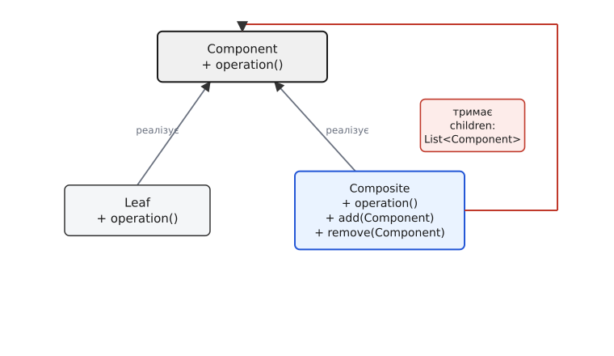
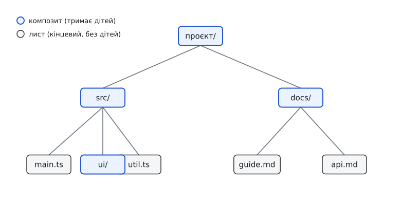

# Компонувальник

<preknowlist>
- [Інтерфейс проти реалізації](topic:programming/interface-vs-implementation) — різниця між тим, ЩО тип обіцяє назовні, і тим, ЯК він це робить; увесь патерн тримається на тому, що лист і контейнер обіцяють клієнту однакове «що».
- [Поліморфізм і динамічне зв'язування](topic:programming/polymorphism) — виклик через абстрактний тип, що в рантаймі йде в потрібну реалізацію; без нього клієнт не зміг би однаково звертатися до листа й до вузла.
- [Композиція над спадкуванням](topic:programming/composition-inheritance) — чому об'єкт краще тримати всередині полем, ніж успадковувати; компонувальник саме тримає своїх дітей полем-списком.
- [Рекурсія](topic:algorithms/recursion) — коли розв'язок задачі для цілого зводиться до тієї самої задачі для частин; операція по дереву компонувальника рекурсивна за самою будовою.
</preknowlist>

Уяви, що тобі треба порахувати, скільки місця займає тека на диску. У теці лежать файли — з ними просто: у кожного є розмір, склав їх — маєш відповідь. Але в теці лежать ще й **інші теки**. А в тих — свої файли й свої теки. І в жодному місці ти наперед не знаєш, чи те, на що ти зараз дивишся, — це файл (склав розмір і все) чи тека (треба спуститися всередину й порахувати там).

Найпростіший підхід породжує код, який роз'їдає програму зсередини:

```ts
function totalSize(item: FileSystemItem): number {
  if (item.kind === "file") {
    return item.size;
  } else if (item.kind === "folder") {
    let sum = 0;
    for (const child of item.children) {
      sum += totalSize(child);   // а тут знову той самий if усередині
    }
    return sum;
  }
}
```

Придивись, що тут негаразд. Клієнт — той, хто хоче розмір, — **мусить сам розрізняти** файл і теку. Щоразу, коли він робить будь-що з елементом дерева, він перевіряє його вид і розгалужується. І це не одне місце: намалювати дерево на екрані — той самий `if`. Порахувати кількість елементів — той самий `if`. Знайти найбільший — знову. Кожна операція над деревом обростає розгалуженням «а це в мене лист чи вузол?». Додаси третій вид елемента (скажімо, символьне посилання) — доведеться знайти **всі** ці `if`-и по всій програмі й дописати гілку. Це прямо той тягар, від якого рятує [принцип відкритості-закритості](topic:programming/open-closed).

Корінь болю ось у чому: **клієнт розбирається у внутрішній будові дерева**, хоча йому до неї немає діла. Йому потрібен розмір — а не знання, що теки влаштовані інакше, ніж файли. Компонувальник (від «компонувати», лат. *componere* — складати докупи) прибирає цю різницю з очей клієнта: він робить так, щоб **окремий об'єкт і ціла група об'єктів виглядали для клієнта однаково**. Тоді розгалуження зникає — не ховається, а справді зникає, — а операція над деревом стає такою ж короткою, як операція над одним листком.

## Що саме об'єднати спільним інтерфейсом

Ключове рішення — знайти, **що спільного** просить клієнт у файла й у теки. Він просить розмір. Отже, зробімо так, щоб і файл, і тека вміли відповісти на одне питання: `size()`. Це і є спільний інтерфейс — назвімо його `Component` (складова частина).

Тепер два види складових. **Лист (англ. *leaf* — листок)** — це елемент, у якого дітей немає: файл. Його `size()` просто повертає власний розмір. **Компонувальник, вузол (англ. *composite* — складений)** — це елемент, що **тримає в собі інші складові** й сам є складовою: тека. Її `size()` не має власного числа — вона питає розмір у кожної своєї дитини й підсумовує.

Ось де ховається вся сила патерна, і на неї варто подивитися уважно. Що тримає в собі тека? Не «файли й теки» — а **складові, `Component`**. Тобто той самий тип, яким є вона сама. Тека — це `Component`, який усередині містить список `Component`-ів. І оскільки серед них можуть бути інші теки (теж `Component`), будова замикається сама на себе — виходить **дерево довільної глибини**. Ця петля «контейнер тримає список того типу, яким є сам» — серце компонувальника; без неї він не працює.



*Лист і компонувальник реалізують той самий інтерфейс, тож клієнт звертається до обох однаково. Червона петля — суть патерна: компонувальник тримає список складових того самого типу, яким є сам, і через це будова замикається в дерево.*

Тепер операція `size()` для теки виглядає так — і зверни увагу, що жодного розрізнення «файл це чи тека» в ній немає:

:::tabs
```ts
interface Component {
  size(): number;                 // спільний інтерфейс: обіцянка обом
}

class File implements Component {
  constructor(private bytes: number) {}
  size(): number {
    return this.bytes;            // лист: власне число
  }
}

class Folder implements Component {
  private children: Component[] = [];

  add(c: Component): void {        // тільки в компонувальника
    this.children.push(c);
  }

  size(): number {
    let sum = 0;
    for (const c of this.children) {
      sum += c.size();            // питаю розмір, НЕ питаючи, хто це
    }
    return sum;
  }
}
```
```py
from abc import ABC, abstractmethod

class Component(ABC):
    @abstractmethod
    def size(self) -> int:        # спільний інтерфейс: обіцянка обом
        ...

class File(Component):
    def __init__(self, num_bytes: int):
        self._bytes = num_bytes

    def size(self) -> int:
        return self._bytes        # лист: власне число

class Folder(Component):
    def __init__(self):
        self._children: list[Component] = []

    def add(self, c: Component) -> None:   # тільки в компонувальника
        self._children.append(c)

    def size(self) -> int:
        return sum(c.size() for c in self._children)   # питаю, НЕ питаючи, хто це
```
:::

Дивись на рядок `sum += c.size()`. Тут `c` — це `Component`. Він може бути файлом, може бути текою на десять рівнів углиб — байдуже. Тека кличе `size()`, і **динамічне зв'язування** саме спрямує виклик у потрібну реалізацію: у файлі поверне число, у вкладеній теці — знову запустить підсумовування вглиб. Ми не пишемо рекурсію явно — вона **вбудована в будову**: тека, питаючи розмір у своїх дітей, серед яких є теки, автоматично спускається деревом до самого дна. Це той випадок, коли [рекурсія](topic:algorithms/recursion) не окремий прийом, а прямий наслідок того, що структура посилається сама на себе.

> 🔧 **Навіщо це.** Практична вигода — у тому, що **новий вид елемента не чіпає клієнта**. Додаси символьне посилання: пишеш новий клас `Symlink implements Component` з його власним `size()`, і все. Жоден з існуючих циклів по дереву не змінюється, бо жоден не питав «а хто ти». Порівняй із першим варіантом, де новий вид означав похід по всіх `if`-ах програми. Компонувальник переносить знання про вид елемента з клієнта в самі елементи — і саме тому дерево можна нарощувати новими видами, не ламаючи те, що вже написане.

## Клієнт більше не бачить різниці

Тепер найголовніший наслідок, заради якого все й затівалося. Подивись, як користується цим клієнт:

:::tabs
```ts
// збираємо дерево
const root = new Folder();
const src = new Folder();
src.add(new File(1200));
src.add(new File(800));
root.add(src);
root.add(new File(500));

// а тепер — увага — клієнт НЕ знає й не питає, що перед ним
console.log(root.size());      // 2500
console.log(src.size());       // 2000
console.log(new File(42).size());  // 42 — той самий виклик
```
```py
# збираємо дерево
root = Folder()
src = Folder()
src.add(File(1200))
src.add(File(800))
root.add(src)
root.add(File(500))

# а тепер — увага — клієнт НЕ знає й не питає, що перед ним
print(root.size())        # 2500
print(src.size())         # 2000
print(File(42).size())    # 42 — той самий виклик
```
:::

`root.size()`, `src.size()`, `File(42).size()` — це три однакові виклики. Клієнтові байдуже, що перше — дерево з п'яти вузлів, друге — гілка, третє — самотній файл. Для нього це все просто `Component`, у якого можна спитати розмір. **Одну річ і групу речей він тримає в руках однаково** — це і є та рівність, яку обіцяє патерн. Банда чотирьох сформулювала його намір саме так: «скомпонувати об'єкти в деревну структуру, що представляє ієрархію частина-ціле, і дати клієнтам однаково поводитися з окремими об'єктами та їхніми групами» ([так вони це записали](topic:programming/composite/hist-composite-birth.md)).

Ця однаковість — не косметика. Вона змінює те, скільки клієнт мусить знати. Раніше, щоб порахувати розмір, треба було розуміти будову: що є вузли, є листки, вони різні, обробляй їх по-різному. Тепер треба знати одне: є `Component`, у нього є `size()`. Уся складність дерева схована **за інтерфейсом**, а назовні стирчить одна проста обіцянка. Ось чому це [структура проти реалізації](topic:programming/interface-vs-implementation) в чистому вигляді: клієнт живе на боці «що вміє», а «як воно всередині влаштоване деревом» його не обходить.

Ту саму будову легше побачити на дереві, ніж описати словами.



*Частина-ціле: тека (композит) тримає і файли (листки), і теки. Виклик `size()` на корені сам спускається до кожного листка й підсумовує вгору — рекурсія тут не окремий алгоритм, а форма самої структури.*

## Де це насправді живе

Може здатися, що йдеться лише про файли на диску, — але це той самий візерунок, що повторюється всюди, де є **вкладення однорідних речей**. Варто впізнавати його в дикому вигляді.

**Дерево елементів на сторінці.** HTML-документ — це компонувальник підручникового зразка. `<div>` тримає інші елементи, ті тримають свої, аж до текстових вузлів-листків. Коли браузер рахує розміри блоку чи малює його, він кличе одну й ту саму операцію на кожному вузлі, не питаючи, контейнер це чи текст, — саме тому DOM і зветься **деревом** (англ. *Document Object Model*).

**Меню й підменю.** Пункт меню, що відкриває підменю, і звичайний пункт-команда мають поводитися для коду меню однаково: у обох треба спитати назву, обидва можна намалювати. Різниця лише в тому, що підменю всередині тримає ще пункти — тобто це компонувальник, а команда — лист.

**Графічний редактор.** Ти виділив кілька фігур і згрупував їх — і група тепер поводиться як одна фігура: її можна пересунути, повернути, змінити розмір. Усередині групи можуть бути інші групи. `move(dx, dy)` на групі просто пересуває кожну складову — і якщо складова теж група, спускається глибше. Класичний приклад, з якого патерн частково й виріс.

**Вирази й формули.** Вузол `+` тримає два піддерева-доданки, кожен з яких — теж вираз (може бути числом-листком, а може — ще одним `+`). Порахувати вираз — це спитати значення в піддерев і застосувати операцію; знову той самий рекурсивний спуск. На цьому стоять калькулятори, компілятори й [абстрактні синтаксичні дерева](topic:algorithms/abstract-syntax-tree).

У всіх цих випадках спільне одне: **є одиничне, є складене з таких самих одиничних, і код хоче поводитися з ними однаково**. Щойно ти це побачив — знаєш, що напрошується компонувальник.

## Ціна однаковості: прозорість проти безпеки

Тут чесна стаття мусить зупинитися на незручному питанні, яке банда чотирьох винесла окремо, бо воно й справді має два розв'язки без ідеального. Питання таке: **де оголосити операції `add` і `remove`** — ті, що додають і прибирають дітей?

З одного боку, лист **не має дітей**, тож `add(child)` для файла — безглуздя. Логічно оголосити `add`/`remove` лише в компонувальника. Але тоді клієнт, тримаючи в руках `Component`, **не може** просто взяти й додати дитину — бо в інтерфейсі `Component` такого методу немає. Йому доведеться спершу з'ясувати, чи це компонувальник, і привести тип. А це вертає той самий `if`, який ми виганяли: клієнт знову розрізняє лист і вузол. Зате код **безпечний**: неможливо навіть спробувати додати файл усередину файла — компілятор не дасть.

З іншого боку, можна оголосити `add`/`remove` **прямо в `Component`** — тоді вони є в кожного, і клієнт справді поводиться з усіма однаково, ні про що не питаючи. Це **прозорість**: лист і вузол мають рівно один інтерфейс. Але за неї платимо: у листа тепер є метод `add`, якому там не місце. Що він робить? Мусить якось відреагувати на безглуздий виклик — кинути виняток або мовчки нічого не зробити. Тобто безпека, яку давав компілятор, зникла: помилку «додав дитину до файла» тепер видно лише в рантаймі.

```
                    add/remove у Component?
   ТАК (прозорість)                        НІ (безпека)
   ─────────────────                       ────────────
   один інтерфейс на всіх;                 add/remove лише в Composite;
   клієнт не розрізняє вузли               клієнт мусить перевіряти тип
   АЛЕ: add у листа безглуздий →           АЛЕ: втрачаємо однаковість,
   помилка спливе лише в рантаймі          повертається розгалуження
```

Оберемо прозорість — бо саме однаковість є метою патерна, а безпеку хоч трохи повертаємо явним рішенням. Банда чотирьох, зваживши те саме, теж схилилася до прозорості, назвавши доступ до дітей через спільний інтерфейс важливішим. Практичний вихід: у базовому `Component` дати `add`/`remove` з розумною поведінкою за замовчуванням, яка **відмовляє**, а компонувальник її перевизначає:

:::tabs
```ts
abstract class Component {
  abstract size(): number;

  // прозорість: методи є в кожного, але за замовчуванням чесно відмовляють
  add(c: Component): void {
    throw new Error("листок не може мати дітей");
  }
  remove(c: Component): void {
    throw new Error("листок не може мати дітей");
  }
}

class File extends Component {
  constructor(private bytes: number) { super(); }
  size(): number { return this.bytes; }
  // add/remove успадковані — кинуть виняток, і це чесно
}

class Folder extends Component {
  private children: Component[] = [];
  size(): number { return this.children.reduce((s, c) => s + c.size(), 0); }
  add(c: Component): void { this.children.push(c); }        // перевизначає
  remove(c: Component): void {
    this.children = this.children.filter(x => x !== c);
  }
}
```
```py
from abc import ABC, abstractmethod

class Component(ABC):
    @abstractmethod
    def size(self) -> int: ...

    # прозорість: методи є в кожного, але за замовчуванням чесно відмовляють
    def add(self, c: "Component") -> None:
        raise TypeError("листок не може мати дітей")

    def remove(self, c: "Component") -> None:
        raise TypeError("листок не може мати дітей")

class File(Component):
    def __init__(self, num_bytes: int):
        self._bytes = num_bytes
    def size(self) -> int:
        return self._bytes
    # add/remove успадковані — кинуть виняток, і це чесно

class Folder(Component):
    def __init__(self):
        self._children: list[Component] = []
    def size(self) -> int:
        return sum(c.size() for c in self._children)
    def add(self, c: Component) -> None:        # перевизначає
        self._children.append(c)
    def remove(self, c: Component) -> None:
        self._children.remove(c)
```
:::

Це компроміс, а не перемога: помилка «додав дитину до листка» лишається рантаймовою. Але вона **гучна** — виняток одразу вкаже, де саме порушено правило, — і за це ми отримали найцінніше: клієнт справді тримає всіх за один інтерфейс. У мовах зі строгим контролем типів дехто обирає протилежно — безпеку, — і живе з приведенням типів у клієнті. Ідеального боку немає; є свідомий вибір, що для цієї задачі болючіше.

> 🔧 **Навіщо це.** Це рішення не абстрактне — воно щодня стоїть перед тим, хто проєктує API дерева. Тримаєш конфіг у вигляді дерева вузлів? Даси клієнту `addChild` на кожному вузлі — зручно, але хтось спробує додати дитину до листка-значення. Не даси — клієнт замучиться перевіряти типи. Знати, що це усвідомлений компроміс прозорість-проти-безпеки, а не твоя недоробка, — означає обрати бік свідомо, під конкретне співвідношення «скільки коду будує дерево» проти «скільки коду боїться зламати його».

## Обхід дерева: рекурсія вже всередині

Варто окремо помітити те, що в компонувальнику дається задарма. Будь-яка операція, що має пройти **все дерево**, — порахувати вузли, зібрати назви, знайти найбільший файл, вивести структуру з відступами — пишеться за тим самим шаблоном, що й `size()`: лист повертає своє, компонувальник питає дітей і зводить їхні відповіді докупи. Рекурсія вже вмонтована в будову, тож окремий обхід писати не треба — операція «їде» по дереву сама.

Наприклад, друк дерева з відступами:

:::tabs
```ts
class File extends Component {
  print(indent = ""): void { console.log(indent + this.name); }
}
class Folder extends Component {
  print(indent = ""): void {
    console.log(indent + this.name + "/");
    for (const c of this.children) c.print(indent + "  ");  // глибше — з відступом
  }
}
```
```py
class File(Component):
    def print_tree(self, indent: str = "") -> None:
        print(indent + self.name)

class Folder(Component):
    def print_tree(self, indent: str = "") -> None:
        print(indent + self.name + "/")
        for c in self._children:
            c.print_tree(indent + "  ")     # глибше — з відступом
```
:::

Той самий кістяк, лише дія в листку й у вузлі інша. Коли таких операцій багато й не хочеться дописувати метод у кожен клас щоразу, обхід виносять **назовні** дерева — окремим об'єктом, що вміє відвідати кожен вузол; це вже інший патерн, [відвідувач](topic:programming/visitor), який природно лягає поверх компонувальника. А коли треба просто перебрати вузли поспіль, не занурюючись у їхню будову, дерево дають назовні через [ітератор](topic:programming/iterator). Обидва — сусіди компонувальника: він будує деревну структуру, а вони дають способи її обійти. Повний робочий обхід із підрахунком складності — в [окремому розборі](topic:programming/composite/proj-composite-traversal.md).

## Де компонувальник недоречний

Патерн спокусливий, і саме тому його інколи натягують туди, де він шкодить. Варто знати межу.

Компонувальник виправданий рівно тоді, коли є **справжня ієрархія частина-ціле** й коли клієнт справді хоче поводитися з одиничним і складеним **однаково**. Прибери будь-яку з двох умов — і патерн стає тягарем.

Якщо ієрархії немає — дані плоскі, просто список, — компонувальник ні до чого: список і є список, дерево йому нав'язувати безглуздо. Якщо ж дерево є, але операції над листком і вузлом **принципово різні** й клієнт **усе одно мусить** їх розрізняти, — спільний інтерфейс стає фікцією. Ти оголосиш метод, який у половині класів кидає виняток, і замість однаковості отримаєш ілюзію однаковості, крізь яку клієнт однаково перевіряє типи. Тоді чесніше не вдавати спільний інтерфейс, а лишити два різні типи.

І остання пастка — коли заради «красивого дерева» будову ускладнюють там, де вистачило б звичайного вкладеного списку чи мапи. Компонувальник платить за себе поліморфними викликами й зайвими класами; він окупається, коли дерево глибоке, росте новими видами вузлів і по ньому ганяють багато однакових операцій. Дрібне двоярусне вкладення на три елементи цього не варте — воно розв'язується простіше, і винесення його в компонувальник було б [передчасним ускладненням](topic:programming/anti-patterns).

## Як він народився

Компонувальник — один із двадцяти трьох патернів класичної книжки «Design Patterns: Elements of Reusable Object-Oriented Software» (1994) чотирьох авторів — Еріха Гамми, Річарда Гелма, Ральфа Джонсона й Джона Вліссідса, — яких через їхню кількість прозвали «бандою чотирьох». Він потрапив до розділу **структурних** патернів: тих, що про **компонування об'єктів у більші структури**, на відміну від породжувальних (про створення) чи поведінкових (про взаємодію).

Ідея не була кабінетною. Вона визріла з роботи над бібліотеками графічних інтерфейсів і редакторами кінця 1980-х, де конкретно поставала задача: група фігур має поводитися як одна фігура, а елемент, що містить інші, — як звичайний елемент. Хто саме, з яких попередніх систем і в якій формі виклав це вперше — розібрано в [нотатці про народження патерна](topic:programming/composite/hist-composite-birth.md).
