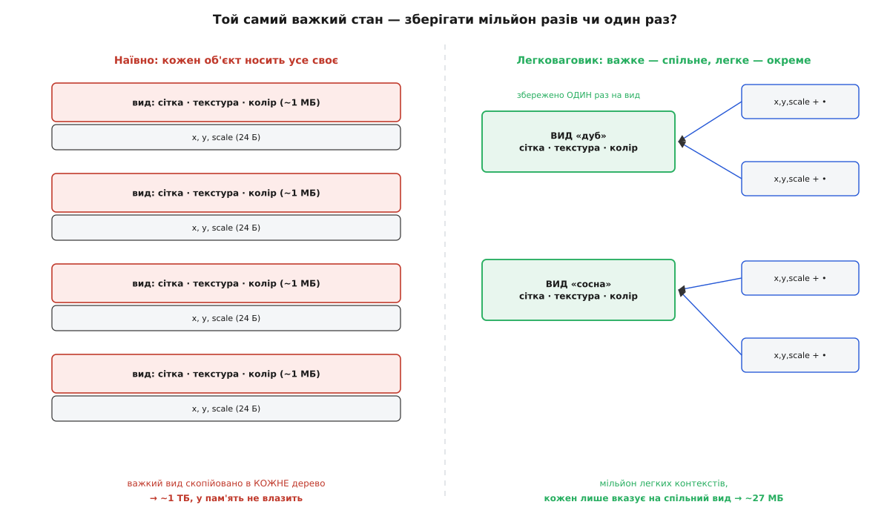
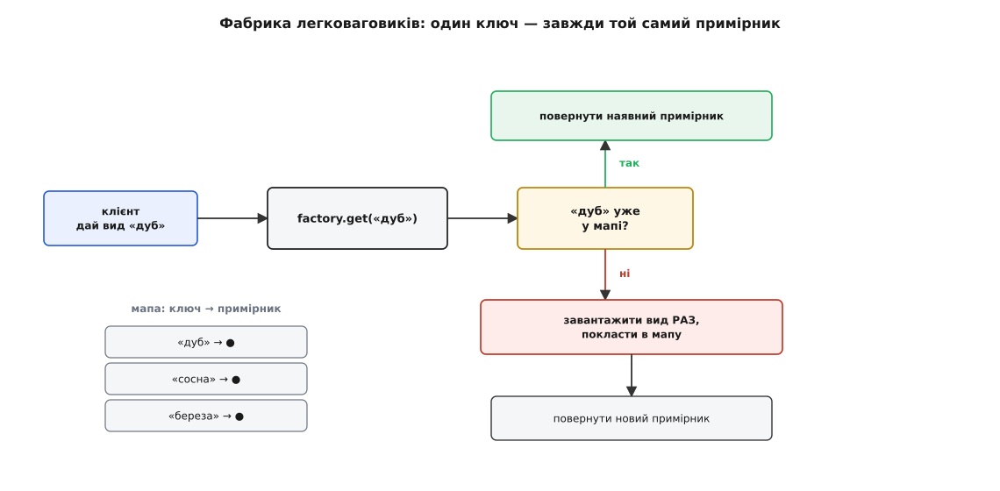
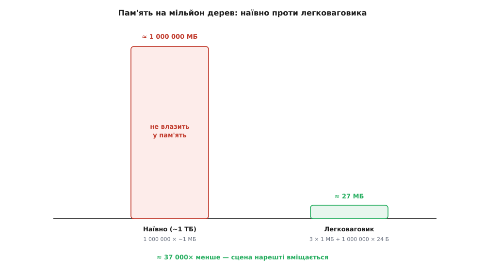

# Легковаговик

<preknowlist>
- [Незмінність](topic:programming/immutability) — чому об'єкт, що не міняється після створення, можна безпечно ділити між багатьма власниками.
- [Купа](topic:programming/heap-dynamic-memory) — об'єкти живуть у купі, а змінні тримають на них вказівники; «поділити» об'єкт означає, що на один примірник указує багато вказівників.
- [Що таке патерн](topic:programming/what-is-pattern) — патерн як названий повторюваний розв'язок задачі об'єктного дизайну.
</preknowlist>

Уяви ігровий світ, у якому росте мільйон дерев. Кожне дерево — це об'єкт, і найпростіше зробити його «повним»: нехай тримає все, що потрібно, щоб його намалювати. А потрібно чимало — сітка вершин (десятки тисяч трикутників), текстура кори й листя, колір, плюс те, де саме воно стоїть і якого розміру. Складаємо чесно: важка частина (сітка + текстура) легко тягне на мегабайт. Множимо на мільйон — виходить близько терабайта. Такий світ не завантажиться взагалі: стільки пам'яті немає.

Тепер придивімося, що саме ми зберігаємо мільйон разів. Дерев мільйон, але **видів** дерева — жменя: дуб, сосна, береза. Сітка дуба, його текстура й колір **однакові** в кожного дуба на карті. Ми копіюємо той самий важкий мегабайт сто тисяч разів поспіль — і платимо за це терабайтом. Різне в дерев лише одне: **де** воно стоїть і **яке завбільшки**. Оце по-справжньому належить конкретному дереву; усе решта належить його **виду**.

## Розділити те, що повторюється, і те, що унікальне

Звідси й вихід. Стан кожного об'єкта розпадається на дві частини за одним питанням: це про **вид** чи про **цей конкретний примірник**?

- **Внутрішній стан** (лат. *intrinsecus* — «зсередини») — те, що визначає вид і не залежить від місця в світі: сітка, текстура, колір. Він **спільний** для всіх дубів і **незмінний**. Його треба зберегти **рівно один раз на вид**.
- **Зовнішній стан** (лат. *extrinsecus* — «іззовні») — те, що унікальне для примірника: координати, масштаб. Його небагато, і він **свій у кожного** дерева.

Далі — головний рух патерна. Важкий внутрішній стан зберігаємо один раз на вид (три об'єкти-види на весь ліс), а кожне дерево робимо крихітним: воно тримає лише свій зовнішній стан і **вказівник** на спільний вид. Мільйон дерев перетворюється на мільйон дрібних записів «координати + вказівник» плюс три важкі спільні вузли. Об'єкт, з якого винесли все спільне, стає настільки легким, наскільки взагалі можливо, — і саме тому патерн зветься **легковаговик** (англ. *flyweight* — найлегша вагова категорія в боксі, бійці до 112 фунтів ≈ 50.8 кг). Термін увели [Пол Колдер і Марк Лінтон](topic:programming/flyweight/hist-flyweight-glyphs.md) 1990 року для текстового редактора, де кожна літера на екрані була окремим об'єктом; згодом його закріпила «банда чотирьох» (GoF).

> 🔧 **Навіщо це.** Питання «що тут про вид, а що про примірник?» — це і є вся робота легковаговика, і саме воно вирішує, вміститься сцена в пам'ять чи ні. Гра з мільйоном дерев, редактор із мільйоном літер, симуляція з мільйоном клітин — усі вони живуть тільки тому, що важке спільне лежить в одному примірнику. Помилишся з розрізом — залишиш у спільному вузлі щось «своє» на примірник (наприклад, координати) — і або роздуєш пам'ять назад до терабайта, або дістанеш підступний баг зі спільним станом.



*Наївно важкий вид дублюється в кожному дереві й дає близько терабайта; з легковаговиком вид лежить один раз, а кожне дерево — це лише координати плюс вказівник.*

## Чому спільне мусить бути незмінним

Спільне використання дає економію, але водночас ставить одну жорстку умову. Якщо на той самий об'єкт-вид указує сто тисяч дубів, то будь-яка зміна цього об'єкта миттєво зачепить усі сто тисяч. Дозволь одному дереву «підфарбувати свій дуб» — і почервоніє весь ліс. Тому внутрішній стан легковаговика мусить бути [незмінним](topic:programming/immutability): створили вид один раз — і далі лише читаємо. Незмінність — це не прикраса, а те, що взагалі робить спільне використання безпечним; без неї спільний об'єкт перетворюється на джерело загадкових зв'язаних змін (аліасинг), які майже неможливо відстежити.

Зовнішній стан натомість вільно змінюється — бо він **не** спільний. Живе він в одному з двох місць. Або його тримає **об'єкт-контекст** (те саме дерево: поля `x, y, scale` плюс вказівник на вид). Або його **передають у методи** легковаговика під час виклику — `dub.draw(canvas, x, y)`, — і тоді сам легковаговик не тримає координат зовсім, а бере їх аргументом на кожен ужиток. Обидва підходи законні; вибір залежить від того, чи є в системі природний об'єкт-контекст, якому це місце належить.

## Фабрика: гарантія одного примірника на значення

Уся економія тримається на одній обіцянці: **двох об'єктів «дуб» існувати не повинно**. Якщо десь у коді хтось випадково створить другий вид «дуб», ми тихо втратимо половину виграшу — і не помітимо. Тому створення легковаговиків не роблять напряму `new`; його ховають за **фабрикою**.

Фабрика — це функція `get(ключ)`, за якою стоїть [мапа](topic:algorithms/hash-table) «ключ виду → спільний примірник». Просиш «дуб»: якщо в мапі він уже є — повертається той самий об'єкт; якщо нема — фабрика створює його **один раз**, кладе в мапу й повертає. Мапа й є тим механізмом, що робить дублікат неможливим: однаковий ключ завжди дає один і той самий примірник. Це звичайна [фабрика](topic:programming/factory-method) в ролі сторожа спільного сховища.



*Фабрика легковаговиків: мапа «ключ → примірник» перетворює повторний запит того самого виду на повернення того самого об'єкта, а не на нове створення.*

## Порахуймо пам'ять

Візьмемо конкретні числа. Розкладемо стан на важкий спільний вид і легкий контекст і порахуємо байти. Тут доречний C++: розмір кожного поля видно очима.

```cpp
// Внутрішній стан — спільний і незмінний. Важкий: сітка + текстура + колір.
struct TreeKind {
    std::string          name;     // "дуб", "сосна", "береза"
    std::vector<Vertex>  mesh;     // десятки тисяч вершин — сотні КБ
    TextureId            texture;  // хендл текстури в пам'яті GPU
    uint32_t             color;    // RGBA
};                                 // ефективно ~1 МБ на один вид

// Зовнішній стан — свій на кожне дерево. Легкий.
struct Tree {
    float            x, y, z;      // 12 Б — де стоїть
    float            scale;        //  4 Б — який завбільшки
    const TreeKind*  kind;         //  8 Б — вказівник на СПІЛЬНИЙ вид
};                                 // 24 Б на дерево
```

Фабрика видає спільні види й нікому не дає створити другий «дуб»:

```cpp
class TreeKindFactory {
    std::unordered_map<std::string, std::unique_ptr<TreeKind>> pool_;
public:
    const TreeKind* get(const std::string& name) {
        auto it = pool_.find(name);
        if (it != pool_.end()) return it->second.get();  // уже є — той самий примірник
        auto kind = loadTreeKind(name);                  // нема — створити РАЗ
        const TreeKind* raw = kind.get();
        pool_[name] = std::move(kind);
        return raw;
    }
};
```

Тепер арифметика на мільйон дерев і три види:

```
Наївно (кожне дерево тримає власний важкий вид):
  1 000 000 × ~1 МБ            = ~1 ТБ     — у пам'ять не влазить узагалі

Легковаговик (вид спільний, дерево тримає лише вказівник):
  види:    3 × ~1 МБ          = 3 МБ
  дерева:  1 000 000 × 24 Б   ≈ 24 МБ
  разом                        ≈ 27 МБ
```

Терабайт перетворився на 27 мегабайтів — приблизно в **тридцять сім тисяч разів** менше, і сцена нарешті вміщається в пам'ять. Чесна засторога: наївний варіант із повним копіюванням мегабайтної сітки ніхто й не пише — саме тому, що числа неможливі. Легковаговик тут не трюк для економії останніх відсотків, а **єдиний спосіб**, яким така сцена взагалі існує; патерн лише робить це спільне використання явним і безпечним — з чіткою межею між видом і примірником та з фабрикою, що не дає завестися дублікатам. Повний робочий приклад — з вимірюванням пам'яті, витісненням рідкісних видів і безпекою в багатьох потоках — розібрано в [окремому проєкті](topic:programming/flyweight/proj-forest-flyweight.md).



*Наївне зберігання впирається в стелю пам'яті; легковаговик стискає ту саму сцену до десятків мегабайтів — різниця в десятки тисяч разів.*

## Ти вже цим користуєшся: інтернування

Легковаговик настільки корисний, що мови вбудовують його прямо в час виконання. Найменших цілих чисел і коротких рядків у програмі — безліч, а різних значень серед них мало (лічильники циклів, індекси, прапорці). Тож середовище тримає **один спільний примірник** на кожне поширене значення — це зветься **інтернування** (англ. *interning* — зведення однакових значень до одного примірника в спільному сховищі), і це той самий легковаговик: значення незмінні, тому ділити їх безпечно.

У Java автопакування маленького `int` іде через `Integer.valueOf`, а той кешує діапазон від −128 до 127. У CPython ще на старті створено цілі від −5 до 256. Однакові значення в цих межах — це буквально один і той самий об'єкт:

:::tabs
```java
Integer a = 127, b = 127;
System.out.println(a == b);       // true  — обидва з кешу −128..127, один примірник
Integer c = 128, d = 128;
System.out.println(c == d);       // false — поза кешем, це два різні об'єкти
System.out.println(c.equals(d));  // true  — порівнюй ЗНАЧЕННЯ, не тотожність
```
```python
a = 256; b = 256
print(a is b)   # True  — CPython тримає один примірник для −5..256
c = 257; d = 257
print(c is d)   # False — поза кешем, різні примірники
print(c == d)   # True  — порівнюй значення, не тотожність
```
:::

Тут же ховається класична пастка. Порівняння на тотожність (`==` для об'єктів у Java, `is` у Python) **працює** для значень усередині кешу й **тихо ламається** за його межами — бо там середовище повертає нові об'єкти, а не спільний. Правило просте: тотожність (той самий об'єкт) і рівність (те саме значення) — різні речі; для значень порівнюй **значення** (`equals`, `==` за вмістом), а не адресу. Той самий рядок у Java інтернується в пул літералів, а `String.intern()` дає це явно.

## З чим не плутати

Легковаговик легко змішати із сусідніми патернами, бо всі вони так чи так «повторно вживають» об'єкти. Різниця — в намірі.

- [Пул об'єктів](topic:programming/object-pool) теж уникає зайвих створень, але ділить **змінні** об'єкти **по черзі**: клієнт бере об'єкт із пулу, працює з ним **одноосібно**, повертає. Легковаговик ділить **незмінні** об'єкти **одночасно** й нічого не повертає. Пул економить на **вартості створення/знищення**, легковаговик — на **обсязі пам'яті** через спільність.
- [Сінглтон](topic:programming/singleton) — це один примірник **на весь тип**. Легковаговик — один примірник **на кожне окреме значення**; фабрика легковаговиків тримає цілу родину таких «сінглтонів за ключем».
- [Мапа тотожності](topic:programming/identity-map) теж кешує за ключем, але заради **узгодженості сутностей** у межах сеансу (один об'єкт у пам'яті на один рядок бази), а не заради економії пам'яті на незмінних значеннях. Схожа механіка — інша мета.
- [Об'єкт-значення](topic:programming/entity-value-object) визначається своїм вмістом і природно незмінний — тобто ідеальний кандидат на інтернування; інтернувати об'єкти-значення й означає застосувати до них легковаговик.

## Пастки й межа доречності

Найгостріше вже назване: **змінний внутрішній стан** — це баг. Поклав у спільний вид бодай одне поле, яке комусь захочеться змінити, — і зміна протече в усіх власників. Спільне мусить бути незмінним, крапка.

Друга пастка — **фабрика тримає посилання назавжди**. Мапа «ключ → примірник» не відпускає свої об'єкти, тож [збирач сміття](topic:programming/garbage-collection) не може їх звільнити: кеш, який лише росте, — це витік пам'яті в сповільненому темпі. Коли множина ключів відкрита й довільна (не три види, а мільйони унікальних рядків), тримай значення через [слабкі посилання](topic:programming/weak-references) або став витіснення рідкісних записів.

Третя — **багато потоків**. Якщо два потоки одночасно попросять новий, ще не створений вид, наївна фабрика може створити його двічі або пошкодити мапу. Метод `get` має бути [потокобезпечним](topic:programming/thread-safety): синхронізація чи конкурентна мапа.

І головне — **не застосовуй легковаговик передчасно**. Виграш є лише тоді, коли одночасно збігаються три умови: об'єктів **дуже багато** (велике N), різних значень внутрішнього стану **мало** (мале K), і сам внутрішній стан **важкий**. Якщо різних значень майже стільки ж, скільки об'єктів (K ≈ N), ділити нема чого — залишиться лише накладна вартість фабрики й зайвий рівень непрямості через вказівник. Де саме проходить межа беззбитковості й коли патерн починає окуповуватися — розібрано в [моделі економії](topic:programming/flyweight/math-flyweight-savings.md). Правило те саме, що й скрізь в оптимізації: спершу виміряй, а тоді дроби об'єкт на вид і примірник.

Легковаговик — це, зрештою, дисципліна одного питання, поставленого до кожного важкого об'єкта, якого стає забагато: **що тут насправді про вид, а що про цей конкретний примірник?** — і твердої відмови зберігати вид більш ніж один раз. Де дрібні об'єкти множаться тисячами — літери, плитки карти, частинки, клітини, токени, маленькі числа — там і працює цей рух.
