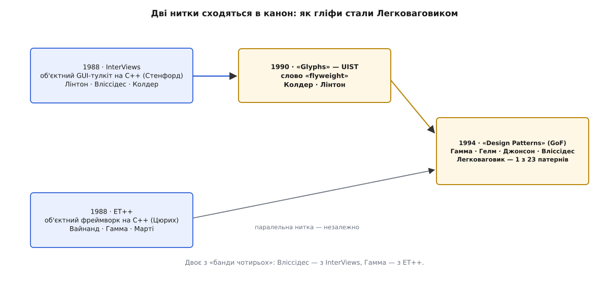

# 📜 Гліфи: коли кожна літера стала об'єктом

1990 рік, Стенфордський університет, Центр інтегрованих систем (Center for Integrated Systems). На конференції UIST '90 у Сноуберді, штат Юта (3–5 жовтня), двоє дослідників — **Пол Колдер** (Paul R. Calder) і **Марк Лінтон** (Mark A. Linton) — виходять із доповіддю, назва якої звучить майже як жарт: «Glyphs: Flyweight Objects for User Interfaces» — «Гліфи: легковагові об'єкти для інтерфейсів користувача». І перше, що вони кажуть про свою роботу, — зізнання: цю саму статтю, яку зараз читають слухачі, набрано, зверстано й надруковано в редакторі, який автори щойно написали. «We used our editor to create, format, and print this paper», — стоїть у вступі. Текст — автопортрет технології, про яку розповідає.

А розповідає він про річ, що тоді здавалася безрозсудною: зробити **кожну літеру на екрані окремим об'єктом**.

## Чому «об'єкт на літеру» був божевіллям

Об'єктний підхід обіцяв просту річ: усе, чим користувач маніпулює, роби програмним об'єктом — тоді код повторює структуру того, що людина бачить. Кнопка — об'єкт, меню — об'єкт, вікно — об'єкт. Кінець 1980-х довів це до тулкітів графічних інтерфейсів, і там ідея вперлася в стелю. Кнопок і меню на екрані — десятки, ну сотні. Але текст? Текст логічно складається з **літер**, і чесний об'єктний застосунок мав би будувати свій вигляд із об'єктів, що малюють окрему літеру. Колдер і Лінтон рахують просто: помірного розміру документ — технічна стаття чи розділ книжки — потребує **щонайменше 50 000** таких об'єктів-символів.

П'ятдесят тисяч об'єктів на один розділ — на машині 1990 року (автори міряли на DECstation 3100). І проблема не в самій кількості, а в тому, **скільки важить кожен**. Типовий «повний» компонент інтерфейсу тих років носив усе своє: власні координати, повний графічний контекст (шрифт, колір, товщину), логіку реакції на мишу й клавіатуру, логіку перемальовування. У тодішніх тулкітах найпростіший видимий компонент важив від кількасот до кількох тисяч байтів — в X Toolkit Athena Widgets близько 500–2000, в ET++ близько 300–3000. Помнож бодай на 50 000 — і сам лише каркас тексту з'їдає десятки мегабайтів, ще до єдиної літери справжнього змісту.

Тому насправді ніхто так і не робив. Редактори тих років ішли протилежним шляхом: не «об'єкт на літеру», а один величезний монолітний віджет, який усередині сам порається з масивом символів. Автори наводять міру цієї складності — текстовий віджет Athena, що робить приблизно те саме, розрісся до **майже 10 000 рядків коду в двадцяти файлах**. Об'єктна чистота програла продуктивності всуху: ідеал казав «моделюй кожну літеру», а рахунок пам'яті казав «і не думай».

## InterViews: тулкіт, у якому це стало можливим

Колдер і Лінтон працювали не на порожньому місці. Лінтон вів у Стенфорді розробку **InterViews** — об'єктного тулкіта графічних інтерфейсів, написаного на C++. Це важлива деталь часу: сам C++ був іще молодий, і сама думка будувати серйозний інтерфейс на об'єктах, а не на процедурах C, була свіжою. InterViews дозволяв **компонувати** інтерфейс із інтерактивних об'єктів — рамок, коробок, стосів, — вкладаючи їх одне в одне деревом. Ключові статті про нього — «InterViews: A C++ Graphical Interface Toolkit» (1988) і «Composing User Interfaces with InterViews» (1989) — Лінтон писав разом із Колдером і ще одним співавтором, чиє ім'я ще спливе в цій історії: **Джон Вліссідес** (John M. Vlissides).

Саме всередині InterViews визріла думка про гліфи. **Гліф** (гр. *glyphḗ* — «різьблення, вирізьблене») у друкарстві — це накреслення одного знака. Колдер і Лінтон беруть слово буквально: гліф у них — крихітний об'єкт, що вміє одне-єдине — намалювати себе. Базовий клас `Glyph` задає протокол малювання; підкласи — конкретні накреслення: графічні примітиви (лінії, кола), текстові (символи, пропуски), складені (`LRBox` — плитка зліва направо, `TBBox` — згори вниз). Застосунок описує свій вигляд, **будуючи ієрархію гліфів** — дерево, де листки малюють літери, а вузли розкладають дітей по рядках і сторінках. Це дерево — прямий приклад [компонувальника](topic:programming/composite): складений гліф і одиничний підкоряються одному протоколу, тож клієнт малює ціле дерево, не розрізняючи вузол і листок.

## Рух, що зробив об'єкт невагомим

Тепер головне — як 50 000 об'єктів раптом стали дозволенними. Колдер і Лінтон роблять два розрізи, і обидва зводяться до одного: **винести з об'єкта все, що не про його вид**.

Перший розріз — **не зберігати контекст**. Символьний гліф не тримає ні своїх координат, ні повного графічного контексту. Автори кажуть прямо: позиція й «пензель» (painter) **передаються в операцію малювання** щоразу, коли гліф малюють. `Character` не знає, **де** він на сторінці, — йому це кажуть у момент виклику `draw`. Отже, все мінливе й унікальне для місця живе не в гліфі, а **іззовні**, в аргументах виклику.

Другий розріз — **ділити той самий об'єкт**. Якщо гліф не тримає нічого про своє місце, то два однакові гліфи вже нічим не відрізняються — і тоді їх не треба два. У статті це сказано з майже дитячою простотою: щоб показати текст, `TextView` будує **один-єдиний примірник** `Character` для літери «a» — і вживає той самий примірник **скрізь, де ця літера трапляється** у файлі. Тисяча «a» на сторінці — це тисяча вказівників на один спільний об'єкт «a».

Як це виглядає в пам'яті редактора, видно з того, як він тримає документ. Автори описують **три буфери**: перший зберігає коди символів, другий — їхні формати, а третій — **вказівники на спільні гліфи `Character`**. Текст документа — це, по суті, довгий масив вказівників на жменю спільних накреслень. І тоді кожен окремий гліф стає майже безтілесним: у розширеному InterViews гліф важив **десяток-другий байтів** — проти сотень і тисяч у сусідніх тулкітах. Об'єкт, з якого винесли контекст і який ділять усі однакові, стає настільки легким, наскільки взагалі можливо.

Розплата за легкість — розкладка. Дерево коробок треба щоразу розставляти по місцях: рахувати, де починається рядок, де перенос, де край колонки. Колдер і Лінтон беруть цю математику зі складання — з алгоритму верстки рядків **TeX** Дональда Кнута (Donald Knuth), що мінімізує «штрафи» за негарні переноси на цілий абзац. Пропуски між словами вони роблять розтяжним «клеєм» (Glue), а місця можливого переносу — «дискреційними» вузлами (Discretionary) — теж терміни прямо з TeX. Результат вражав саме буденністю: об'єктний `TextView` з багатьма шрифтами, вбудованою графікою, переносами й багатоколонковою версткою вмістився в **менш ніж 50 рядків коду** — проти тих майже десяти тисяч у монолітному віджеті. А швидкодія на DECstation 3100 лишалася інтерактивною: найгірший випадок — переверстати й перемалювати цілу сторінку — давав приблизно **пів секунди** затримки.

Ось чому стаття могла дозволити собі надрукувати саму себе. Це був не жест і не хвастощі, а доказ: редактор, зібраний із мільйонів найдрібніших спільних об'єктів, справді працює на залізі свого часу — настільки, що на ньому зробили публікацію про нього ж.

## Звідки взялася назва: найлегша вага

Слово **flyweight** стоїть у статті просто в лапках — «a set of "flyweight" components». Автори не пояснюють метафори, бо для англомовного читача пояснювати нема чого: це готове повсякденне слово. **Найлегша вагова категорія в боксі.**

Категорію flyweight запровадив 1909 року лондонський National Sporting Club — як останню, восьму з класичних вагових категорій, для бійців **до 112 фунтів** (50.8 кг, або 8 стоунів). Дослівно «муха-вага»: боєць настільки легкий, наскільки взагалі бувають професійні боксери. (Ще легші категорії — light flyweight на 108 фунтів і мінімальна на 105 — з'явилися значно пізніше, тож сьогодні flyweight — найлегша з *класичних*, а не з усіх узагалі; але в 1990-му метафора читалася однозначно.) Колдер і Лінтон беруть це слово точно за призначенням: гліф — це об'єкт найлегшої можливої вагової категорії, з якого зняли все зайве.

Метафора влучна ще й тим, де ламається. Боксер-легковаговик легкий, але не слабкий — він так само повноцінний боєць, лиш позбавлений зайвої маси; його сила в тому, що він робить, а не в тому, що носить. Гліф — так само: він уміє повноцінно намалювати себе, просто не тягає з собою контексту. Легкість тут — не урізаність, а дисципліна.

Статус цієї історії: **усталено**. Слово flyweight стоїть у роботі 1990 року чорним по білому; походження боксерського терміна документоване; те, що автори взяли саме цей образ, — очевидне прочитання, а не домисел.

## Друга нитка: ET++

Ідея легких спільних об'єктів висіла в повітрі кінця 1980-х, і Колдер із Лінтоном були не єдині, хто її намацав. У списку літератури їхньої ж статті стоїть **ET++** — об'єктний фреймворк застосунків, теж на C++, який у Цюриху будували **Андре Вайнанд** (André Weinand), **Еріх Гамма** (Erich Gamma) і **Рудольф Марті** (Rudolf Marty); вони доповідали про нього на OOPSLA '88. ET++ теж вибудовував інтерфейс із дрібних об'єктів і теж бився за те, щоб зробити їх дешевими.

Дві незалежні команди — стенфордська навколо InterViews і цюрихська навколо ET++ — незалежно дійшли до однієї відповіді: коли об'єктів мусить бути дуже багато, винось із них усе спільне назовні й ділись одним примірником. Це типова доля хорошого патерна: його не так винаходять, як **виявляють** — у кількох місцях одразу, бо на нього наштовхує сама задача. Запам'ятаймо обидва імені — Вліссідес з InterViews, Гамма з ET++, — бо за чотири роки вони зійдуться в одній книжці.

## Як легковаговик потрапив у канон

1994 року виходить книжка, що змінила спосіб, у який програмісти говорять про свій код: «Design Patterns: Elements of Reusable Object-Oriented Software». Її написали четверо — **Еріх Гамма**, **Річард Гелм** (Richard Helm), **Ральф Джонсон** (Ralph Johnson) і **Джон Вліссідес** (John Vlissides), — і за ними закріпилося прізвисько «банда чотирьох» (Gang of Four, GoF). Вони зібрали й назвали **23 повторювані розв'язки** об'єктного дизайну, давши кожному ім'я, задачу й структуру — про сам сенс такого іменованого каталогу є [окрема розмова](topic:programming/what-is-pattern). Серед цих двадцяти трьох — **Легковаговик**, у групі структурних патернів.

Простежмо, як гліфи туди дійшли, — нитка пряма. Вліссідес прийшов у «банду чотирьох» **із InterViews**: він співавтор тих самих стенфордських статей поруч із Лінтоном і Колдером. Гамма прийшов **з ET++**: це його цюрихський фреймворк. Тобто двоє з чотирьох авторів канону особисто будували ті два тулкіти, у яких легковаговик уже жив у коді. Їм не треба було вигадувати патерн — вони мали його в руках і лишалося його **назвати й узагальнити**.

І GoF узагальнює. Те, що в Колдера й Лінтона було конкретним «гліфом», банда чотирьох піднімає до загального патерна й вводить словник, яким користуються дотепер: стан об'єкта ділиться на **внутрішній** (intrinsic) — той, що зберігається в легковаговику й тому спільний, бо не залежить від контексту, — і **зовнішній** (extrinsic) — той, що залежить від контексту й тому не ділиться. Приклад вони лишають той самий, символьний: документ, де всі знаки в одному шрифті, обійдеться порядком **сотні** об'єктів-символів (десь як розмір таблиці ASCII) **незалежно від довжини** тексту. А в розділі «Known Uses» книжка називає першоджерело прямо: концепцію легковагових об'єктів «уперше описано й досліджено як прийом дизайну в InterViews 3.0», де розробники збудували редактор **Doc** як доказ спроможності; поруч згадано й ET++. Наскрізний приклад-дослідження всієї книжки — редактор **Lexi** — теж змодельовано з того Doc.

## Що насправді сталося

Якщо стягнути цю історію в одне речення, вона повчальна не датами, а тим, **як** народжуються патерни. Легковаговик ніхто не вигадав за столом. Його **знайшли в робочому коді** — у редакторі, який був настільки справжній, що надрукував статтю про себе; знайшли одразу у двох місцях (InterViews і ET++), бо на нього штовхала сама задача «об'єктів мусить бути неможливо багато»; назвали словом із боксерського рингу, бо воно точно лягало; і закріпили в каноні руками тих самих людей, які перед тим набили руку, будуючи ті тулкіти.

І сам розріз, який Колдер із Лінтоном зробили над літерою — «що тут про накреслення, а що про місце на сторінці», — виявився ширшим за текст. Уже у своїй статті 1990 року вони пишуть, що бачать гліфи скрізь, від клітинок таблиці до відеокадрів. За кілька десятиліть той самий рух — винести спільне назовні, ділити один незмінний примірник — працює всюди, де дрібні об'єкти множаться тисячами: плитки ігрових карт, частинки, вузли дерев, маленькі цілі числа. Але почалося все з простого нахабства: узяти найдрібнішу річ на екрані — літеру — і сказати, що вона теж заслуговує бути об'єктом. Треба лише зробити її невагомою.

*Легковаговик не вигадали, а виявили: він уже жив у двох тулкітах, доповідь Колдера й Лінтона дала йому ім'я з боксу, а канон GoF — місце серед патернів.*
