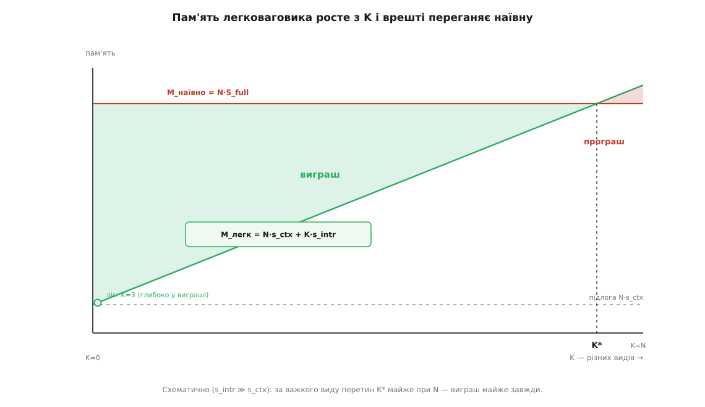
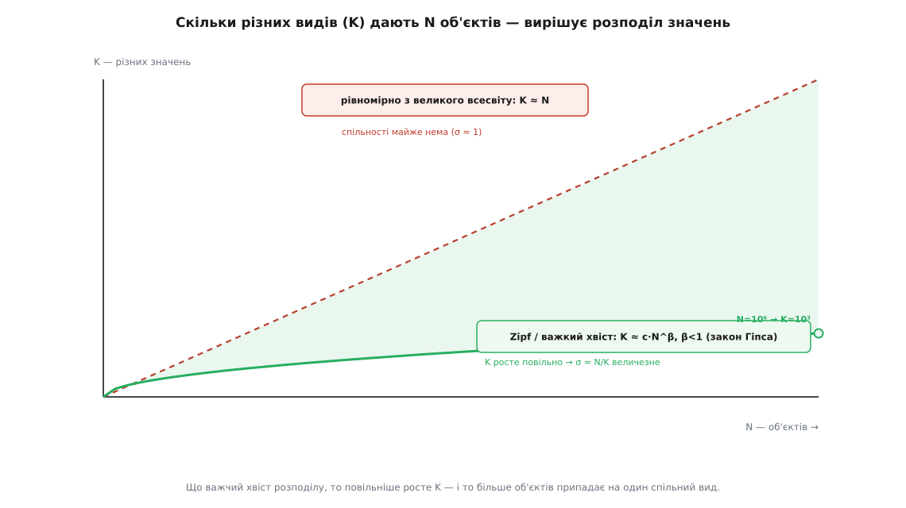

# 🧮 Модель економії: коли легковаговик окупається

Легковаговик обіцяє економію пам'яті — але економія не безумовна. Є числа, за яких він стискає терабайт до десятків мегабайтів, і є числа, за яких він лише додає накладну вартість, не заощадивши жодного байта. Уся різниця — у трьох величинах: скільки об'єктів, скільки серед них справді різних, і скільки важить те, що ми ділимо. Зведімо це в модель, з якої видно точку, де патерн перестає окуповуватися.

## Дві формули пам'яті

Позначмо чесно все, що входить у рахунок:

```
N        — скільки об'єктів у сцені (примірників)
K        — скільки серед них РІЗНИХ видів (різних значень внутрішнього стану)
s_intr   — розмір внутрішнього (спільного) стану — «важке», що ми ділимо
e        — розмір зовнішнього стану на примірник (координати, масштаб…)
p        — розмір вказівника (типово 8 Б на 64-бітній машині)
f        — накладні на один запис фабрики (ключ + службові поля мапи)
```

Наївний варіант тримає в кожному об'єкті **все** — і важкий внутрішній стан, і свій зовнішній. Повний об'єкт коштує `S_full = s_intr + e`, і таких об'єктів N:

```
M_наївно = N · S_full = N · (s_intr + e)
```

Легковаговик розриває об'єкт на дві частини. Важкий внутрішній стан зберігається **раз на вид** — K копій, — а кожен примірник стискається до контексту `s_ctx = e + p`: свій зовнішній стан плюс вказівник на спільний вид. Плюс сама фабрика тримає мапу з K записів:

```
M_легк = N · s_ctx + K · s_intr + K · f
       = N · (e + p) + K · (s_intr + f)
```

Порівняймо два вирази поглядом, ще без алгебри. Наївно важке `s_intr` множиться на N; у легковаговику воно множиться на K. Якщо K набагато менше за N, ми замінили мільйон копій мегабайта на жменю — оце й уся економія. Але замість неї з'явилися дві нові статті витрат: у кожному з N контекстів завівся вказівник `p`, а фабрика взяла собі `K · f`. Модель існує саме для того, щоб зважити перше проти другого.

## Умова виграшу — і що з неї скорочується

Виграш — це різниця двох формул:

```
ΔM = M_наївно − M_легк
   = N · (s_intr + e) − N · (e + p) − K · (s_intr + f)
   = N · s_intr + N·e − N·e − N·p − K · (s_intr + f)
   = N · (s_intr − p) − K · (s_intr + f)
```

Зверни увагу на те, що зникло: зовнішній стан `e` скоротився повністю. І це не трюк алгебри, а факт про природу патерна — зовнішній стан ми платимо **однаково** в обох схемах, бо він однаково свій у кожного примірника; легковаговик його не чіпає. Тож уся торгівля йде лише між двома речами: **важкий внутрішній стан, який ми виграємо спільністю**, проти **вказівника й фабрики, які ми за цю спільність доплачуємо**. Координати, кольори, масштаби — усе зовнішнє — до балансу не входять зовсім.

Патерн окуповується, коли `ΔM > 0`:

```
N · (s_intr − p) > K · (s_intr + f)

           s_intr − p
K  <  N · ────────────  =  K*
           s_intr + f
```

Ось вона, точка беззбитковості `K*` — гранична кількість різних видів, за якою економія зникає. Прочитаймо її у двох крайнощах, бо саме в них ховається вся інтуїція.

Якщо внутрішній стан **важкий** — `s_intr ≫ p` і `s_intr ≫ f`, як мегабайтна сітка проти восьмибайтного вказівника, — то дріб `(s_intr − p)/(s_intr + f)` майже дорівнює одиниці, і `K* ≈ N`. Це означає: легковаговик виграє майже завжди, поки видів бодай трохи менше, ніж об'єктів. Мільйон дерев і навіть пів мільйона видів — усе одно виграш.

Якщо ж внутрішній стан **легкий** — `s_intr` порівнянне з `p`, — дріб стрімко падає, `K*` тане до нуля, і вікно виграшу зачиняється. А коли `s_intr < p`, чисельник стає від'ємний: `K*` менше за одиницю, тобто патерн програє за будь-якого осмисленого K. Ділити те, що легше за вказівник на нього, — чистий збиток; до цієї межі повернемось окремо, бо це найпоширеніша помилка.

> 🔧 **Навіщо це.** `K*` — одне число, у якому стуляються всі три величини задачі, і воно каже прямо: доти, доки різних видів менше за `K*`, дроби об'єкт на вид і примірник; більше — не чіпай. За важкого внутрішнього стану `K*` майже дорівнює N, тож вікно виграшу широчезне й помилитися важко. За легкого — `K*` біля нуля, і будь-яке застосування легковаговика тут програш, хоч би яка гарна була спільність. Одна формула відрізняє випадок, де патерн рятує сцену, від випадку, де він її псує.

## Скільки саме економимо: у стиснення є стеля

Умова каже, окуповується чи ні. Але на скільки? Візьмемо відношення — у скільки разів легковаговик менший:

```
       M_наївно        N · s_intr                 1
R  =  ──────────  ≈  ────────────────────  =  ──────────────────
        M_легк        N · s_ctx + K · s_intr     s_ctx/s_intr + K/N
```

(тут я відкинув `e`, `f`, `p` як дрібні проти `s_intr` — щоб побачити головне). У знаменнику два доданки, і кожен ставить свою стелю. Другий, `K/N`, — це обернений **коефіцієнт спільності**: у скільки разів менше видів, ніж об'єктів. Якби він був єдиний, стиснення дорівнювало б рівно `N/K` — «скільки примірників припадає на один спільний вид». Але є ще перший доданок, `s_ctx/s_intr`, і він від K не залежить зовсім.

Це той момент, який модель робить видимим, а очі — ні. Навіть якщо звести K до одного-єдиного виду, `K/N` впаде до нуля, але `s_ctx/s_intr` нікуди не дінеться — і стиснення впреться в стелю:

```
             S_full     s_intr
R_max  =  ──────────  ≈  ──────
             s_ctx        s_ctx
```

Більше за відношення «повний об'єкт до голого контексту» не стиснеш **ніколи**, хоч як мало було б видів, — бо самі N контекстів треба десь тримати. Порахуймо на лісі з мільйона дерев: `N = 10⁶`, `S_full ≈ 1 МБ`, `s_ctx = 24 Б`, `s_intr ≈ 1 МБ`, `K = 3`.

```
N · s_ctx  = 10⁶ · 24 Б      = 24 МБ     ← контексти (підлога)
K · s_intr = 3 · 1 МБ         =  3 МБ     ← спільні види
M_легк     = 24 + 3           = 27 МБ
R          = 10¹² / (27·10⁶)  ≈ 37 000

стеля:  R_max = S_full/s_ctx = 10⁶/24 ≈ 42 000
```

Важлива дрібниця, яку без моделі не помітиш: у цьому лісі спільні види (`3 МБ`) — це вже **менша** частина витрат, ніж контексти (`24 МБ`). Ми притиснулися до стелі `42 000`, і K тут майже ні до чого — сцена стала **контекстно-обмеженою**. Зменшувати видів далі нема сенсу: заощадиш три мегабайти з двадцяти семи. Якщо хочеться стиснути ще — треба чіпати вже `s_ctx` (наприклад, паковати координати щільніше), а не K. Модель показує пальцем, куди тиснути.



*Наївна пам'ять не залежить від K (пласка лінія); пам'ять легковаговика росте з кожним новим видом і врешті переганяє її — перетин у точці беззбитковості `K*`, за важкого внутрішнього стану майже при N.*

## Точка беззбитковості зблизька: вказівник і фабрика

Досі ми міряли беззбитковість у байтах пам'яті. Але непрямість через вказівник має ще й **часову** ціну, і вона в модель пам'яті не входить — її треба класти поряд.

Кожне звертання до внутрішнього стану в легковаговику — це розіменування вказівника: процесор іде за адресою в спільний вид. Якщо той вид зараз у [кеші](book:programming/cache) — розплата копійчана (звертання до L1 ≈ 0.5 нс). Якщо його там нема — кеш-промах тягне читання з головної пам'яті, а це вже близько 100 нс, разів у двісті довше. Наївний варіант такого стрибка не робить: важкий стан лежить прямо в об'єкті, поруч із його зовнішніми полями.

Але тут модель робить несподіваний поворот на користь легковаговика. Спільних видів **мало** (K), і вони гарячі — ті самі три сітки читає весь мільйон дерев, тож вони майже завжди в кеші. Наївний варіант навпаки: мільйон окремих мегабайтних копій — це мільйон холодних сторінок, які витісняють одна одну й забивають кеш ущент. Тож за важкого `s_intr` легковаговик зазвичай не тільки менший, а й **швидший** — його робочий набір крихітний. Непрямість кусає лише тоді, коли доступ хаотичний (стрибки по розкиданих контекстах із випадковими видами) **і** виграш пам'яті й так марґінальний — тобто рівно там, де патерн і без того на межі.

Друга доплата — сама фабрика. За нею стоїть [хеш-таблиця](book:algorithms/hash-table) «ключ виду → примірник»; вона коштує пам'яті (`K · f`: ключі, вказівники, порожні комірки під коефіцієнт заповнення) і коштує часу на кожному `get` (хешування ключа плюс пробінг). Поки K маленьке — три види, — це порох. Але якщо множина ключів велика й відкрита (K росте разом із N), `K · f` перетворюється на ще одну статтю розміру N — і з'їдає виграш з іншого боку. Ось чому в моделі `f` стоїть саме поряд із `s_intr`, у тому самому множнику на K: обидва — «ціна за вид», і обидва стають небезпечні тоді самому, коли видів забагато.

## Коефіцієнт спільності живе в розподілі значень

Досі K був для нас просто числом. Та насправді K не задають — його **отримують**: він визначається тим, як значення внутрішнього стану розподілені серед N об'єктів. І це найважливіша частина моделі, бо саме розподіл вирішує, чи росте K повільно (тоді патерн живе), чи майже як N (тоді він мертвий).

Уяви, що кожен з N об'єктів «тягне» собі вид із якогось джерела. Скільки різних видів випаде?

Якщо значення **рівномірні** й беруться з великого всесвіту на U можливих видів, то очікувана кількість різних після N витягів — `K ≈ U·(1 − e^(−N/U))`. Коли `N ≪ U` (всесвіт величезний проти вибірки), це ≈ N: майже всі об'єкти різні, спільності катма, `K ≈ N`. Рівномірний розподіл над широким всесвітом — найгірший ворог легковаговика: ділити нема чого.

Але реальні дані майже ніколи не рівномірні. Слова в тексті, теги, кольори пікселів, назви міст, токени коду — усі підкоряються **важкому хвостові**: жменя значень трапляється шалено часто, а решта — зрідка. Класична форма — [розподіл Ципфа](book:math/heavy-tail-distributions) (Zipf): частота значення обернено пропорційна його рангові. І для таких розподілів кількість різних значень росте не як N, а **сублінійно**:

```
K ≈ c · N^β,     0 < β < 1     (емпіричний закон Гіпса, англ. Heaps' law)
```

Закон Гіпса — не окремий постулат, а прямий наслідок Ципфа: якщо частоти йдуть за Ципфом із показником z, то показник росту словника `β ≈ 1/z`, і для типового тексту `β ≈ 0.5`. (Це усталений результат математичної лінгвістики, підтверджений на корпусах багатьох мов.) Що він дає нам? Підставмо в коефіцієнт спільності:

```
        N        N
σ  =  ─────  ≈  ──────  =  N^(1−β) / c        →  росте разом з N
        K       c·N^β
```

За `β < 1` спільність `σ` **зростає без межі** з розміром сцени: що більше об'єктів, то ефективніший легковаговик. Порахуймо для `β = 0.5, c = 1`:

```
N = 10³   →  K ≈ 32,       σ ≈ 31
N = 10⁶   →  K ≈ 1 000,    σ ≈ 1 000
N = 10¹²  →  K ≈ 10⁶,      σ ≈ 10⁶
```

Мільйон об'єктів дають лише тисячу різних видів — і кожен вид ділить тисяча примірників. Ось математична причина, чому легковаговик так природно лягає на текст, карти, токени: дані самі важкохвості, і K відстає від N на цілий показник.



*Розподіл вирішує все: за рівномірних значень з великого всесвіту K росте разом з N (спільності нема), за важкого хвоста Ципфа K ≈ c·N^β лишається малим — і на кожен спільний вид припадають тисячі примірників.*

Практичний висновок: перш ніж лічити байти, зміряй **розподіл**. Один запит `SELECT count(DISTINCT kind), count(*) FROM objects` — і ти знаєш K для свого N. Якщо `count(distinct)` близький до `count(*)` — розподіл плаский, легковаговик мертвий, хай яке важке `s_intr`. Якщо `count(distinct)` відстає на порядки — розподіл важкохвостий, і патерн лише чекає, щоб його застосували. Ту саму модель зручно порахувати наперед — це проста арифметика, і тут доречний скрипт, а не С++:

```python
def flyweight_savings(N, K, s_intr, e, p=8, f=48):
    """Пам'ять двох схем і точка беззбитковості, у байтах."""
    S_full  = s_intr + e
    M_naive = N * S_full
    M_fw    = N * (e + p) + K * (s_intr + f)
    K_star  = N * (s_intr - p) / (s_intr + f)   # гранична к-сть видів
    return {
        "M_наївно":  M_naive,
        "M_легк":    M_fw,
        "стиснення": M_naive / M_fw,
        "K*":        K_star,
        "виграш?":   K < K_star,
    }

# ліс: мільйон дерев, три види, важка сітка (~1 МБ)
print(flyweight_savings(N=1_000_000, K=3, s_intr=1_000_000, e=16))
# M_наївно ≈ 1.0e12,  M_легк ≈ 27e6,  стиснення ≈ 37000,  K* ≈ 999944,  виграш? True

# те саме, але внутрішній стан — крихітне 4-байтне число:
print(flyweight_savings(N=1_000_000, K=1000, s_intr=4, e=0))
# M_легк > M_наївно,  K* < 0  →  виграш? False: ділити легше за вказівник немає сенсу
```

## Коли легковаговик коштує більше, ніж заощаджує

Тепер зберімо всі межі докупи — три ситуації, у кожній з яких `ΔM ≤ 0`, тобто патерн у мінусі.

**1. Видів майже стільки ж, скільки об'єктів (`K ≈ N`).** Спільність зникла: `M_легк ≈ N·(e+p) + N·(s_intr+f) > N·(s_intr+e) = M_наївно`. Ми доплатили `N·p` за вказівники й `N·f` за фабрику — і не заощадили нічого, бо ділити не було чого. Це прямий наслідок `K < K* ≈ N`, пробитий наскрізь.

**2. Внутрішній стан легший за вказівник (`s_intr ≤ p`).** Найпідступніша пастка, бо тут навіть чудова спільність не рятує. Візьмемо крайній приклад: інтернувати чотирибайтове число за восьмибайтним вказівником.

```
наївно (значення inline):   M = N · 4 Б
легковаговик (вказівник):   M = N · 8 Б  +  K · 4 Б   >  N · 4 Б   завжди

умова виграшу:  s_intr > p / (1 − K/N)   →   при s_intr=4, p=8  НЕ виконується
```

Ми замінили чотири байти самого значення на вісім байтів вказівника **на** ці чотири байти — подвоїли витрати ще до фабрики. Правило гостре: якщо те, що ділиш, легше за вказівник, який на нього показує, — не діли. Саме тому середовища інтернують не всі числа підряд, а лише маленький кеш поширених, де виграш іде не від розміру (він тут від'ємний), а від іншого — менше роботи збирачеві, швидша рівність за тотожністю.

**3. Гарячий шлях, де непрямість дорожча за пам'ять.** Буває, що `ΔM > 0` — пам'ять формально виграна, — але виграш мізерний (кілька відсотків), а внутрішній стан читається в найгарячішому циклі мільярди разів. Тоді ланцюжок «розіменуй вказівник → можливо, кеш-промах» додає до кожної ітерації затримку, якої економія кількох мегабайтів не виправдовує. Це беззбитковість уже не в байтах, а в тактах: питай не тільки «скільки заощадив пам'яті», а й «скільки коштує кожен доступ через непрямість проти вартості заощадженого».

Спільний знаменник усіх трьох — легковаговик бере фіксовану плату (вказівник на примірник, фабрика на вид, непрямість на доступ) наперед, а віддає економію лише пропорційно спільності. Нема спільності або нема важкого стану — плата лишається, віддача зникає.

## Три ворота

Модель зводиться до трьох воріт, і пройти треба **всі три** — будь-яке зачинене вбиває виграш:

```
1.  N велике            — об'єктів справді багато (інакше нема на чому економити)

2.  K ≪ N  і росте      — різних видів мало, і за важкого хвоста K ≈ c·N^β (β<1),
    сублінійно             тобто відстає від N; перевір розподіл, не здогадуйся

3.  s_intr ≫ p          — те, що ділиш, набагато важче за вказівник (інакше
                          доплата за непрямість перевищить економію)
```

Перше ворота дають масштаб, друге — спільність, третє — вагу спільного. Точка беззбитковості `K* = N·(s_intr − p)/(s_intr + f)` стуляє їх в одне число: за важкого `s_intr` вона майже при N (велике вікно виграшу), за легкого — біля нуля (вікна нема зовсім). Тому послідовність завжди та сама: спершу зміряй N, K і `s_intr` на реальних даних, підстав у модель — а вже тоді розрізай об'єкт на вид і примірник. Легковаговик не «економить пам'ять взагалі»; він економить рівно там, де важке повторюється, і мовчки додає накладну там, де ні.
