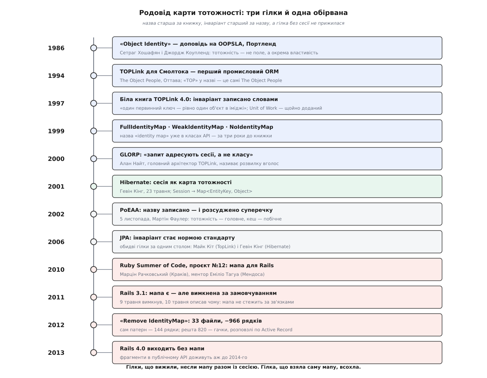
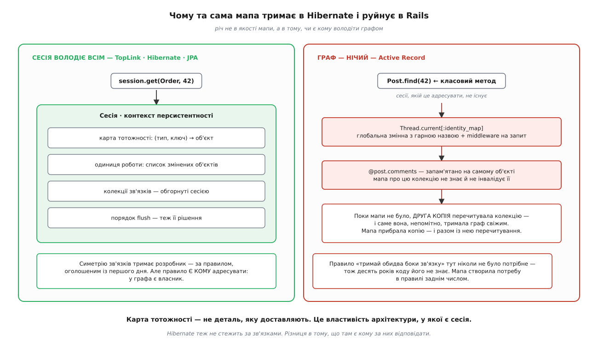

# 📜 Родовід карти тотожності

Назва патерна зазвичай молодша за сам патерн: спершу хтось будує річ, бо без неї не працює, і аж потім хтось інший підбирає слово. З картою тотожності сталося саме так, і проміжок вийшов чималий. Книжку, яку сьогодні цитують як джерело назви, видали 5 листопада 2002 року. А слово `IdentityMap` лежало в назвах класів комерційного продукту вже у вересні 1999-го — і не як термін статті, а як буденна деталь довідника: `FullIdentityMap`, `WeakIdentityMap`, `NoIdentityMap`. Сам же інваріант — «один ключ, один об'єкт» — записали звичайною прозою ще в білій книзі 1997 року.

Цей проміжок вартий розбору, і не заради першості. У родоводі видно річ значно кориснішу: чому той самий патерн в одних руках тримає всю конструкцію, а в інших руйнує дані й вилітає з фреймворку. Відповідь, як побачиш, жодного разу не залежить від якості самої мапи.



*Гілки, що вижили, несли мапу разом із сесією. Гілка, що взяла саму лише мапу, всохла за три роки.*

## Питання, старше за всі ORM

Почалося не з відображення об'єктів на таблиці, а з питання, від якого воно згодом і завелося: що взагалі означає «той самий»?

Восени 1986-го, на конференції OOPSLA в Портленді (29 вересня — 2 жовтня), Сетраг Хошафян (Setrag Khoshafian) і Джордж Коупленд (George P. Copeland) виступили з доповіддю «Object Identity» — вона зайняла сторінки 406–416 у збірнику. Теза була проста й незручна: тотожність об'єкта — це не його значення й не одне з його полів, а окрема властивість, і мови та бази підтримують її по-різному, від слабкої до сильної. Автори вибудували цей континуум і доводили, що сильну тотожність треба закладати на понятійному рівні — і в мовах програмування, і в базах даних, і в тому, що між ними.

Звучить академічно, доки не помітиш, куди це б'є. Мова програмування дає сильну тотожність задарма: два імені вказують на одну адресу — це один об'єкт, і жодних питань. Реляційна база дає тотожність слабку й зовнішню: рядок «той самий», якщо збігається первинний ключ, а де саме лежать байти — нікого не обходить. Обидві системи всередині себе бездоганні. Біда починається рівно тоді, коли одну накладають на другу, — і 1986 року це ще була суперечка теоретиків про майбутнє об'єктних баз даних, а не інженерна проблема. Об'єктні бази здавалися відповіддю: якщо зберігати об'єкти як об'єкти, накладати нічого не доведеться.

Відповіддю вони не стали. І тим, кому за десять років довелося-таки накладати одне на друге, розв'язувати задачу випало не в статті, а в продукті, що його купують.

## Оттава: контора, яка назвала продукт власним ім'ям

The Object People заснували 1989 року в Оттаві — спершу як консультацію зі Смолтока з ухилом у навчання. Продукт, що з них виріс, вони назвали, не мудруючи: **TOP**Link, де «TOP» — це самі The Object People. Першу версію випустили 1994 року — цю дату називає й сама фірма у своїй білій книзі, тож вона надійна. TOPLink часто звуть першим промисловим ORM; це твердження мандрує з довідника в довідник, а корінням сягає власного маркетингу фірми, тож приймати його за встановлений факт не варто — надійно тут інше й важливіше: **об'єктно-реляційне відображення визріло у Смолтоку, а не в Java**, і на той час, коли задачу побачив світ Java, в Оттаві її розв'язували вже років зо два.

Умови задачі тут варто відчути буквально. Смолток живе в **іміджі** — цілісному знімку пам'яті, де всі об'єкти живі одночасно й посилаються одне на одного напряму. Реляційна база живе рядками. Між ними — та сама тріщина з 1986 року, тільки тепер по ній ходять клієнти з великими грошима й застарілими схемами, які нікуди не подінуться.

Що TOPLink із цим зробив, найкраще видно в його власній білій книзі — «TOPLink™ Version 4.0, A White Paper, © 1997 The Object People Inc.». Там є розділ «Object Identity», і в ньому — рівно два речення про механіку. Смолток, кажуть автори, дає кожному об'єктові унікальну тотожність; реляційні бази підтримують тотожність зовнішню, через унікальні первинні ключі. А далі — головне:

> Щоб правильно обробляти складні зв'язки й циклічні посилання, TOPLink забезпечує, щоб кожен унікальний ідентифікатор (первинний ключ) у базі відповідав рівно одному об'єктові в іміджі.
> — «TOPLink™ Version 4.0. A White Paper», The Object People, 1997

Це і є весь патерн, за п'ять років до того, як його назвали патерном. Зверни увагу на обґрунтування: **не «щоб було швидше»**. Мотив названо прямо — «складні зв'язки й циклічні посилання». Тобто інваріант завели заради того, щоб граф об'єктів узагалі можна було зібрати, а не заради економії на SELECT-ах.

І ще одна дрібниця, яку легко проминути, а вона багато що пояснює далі. Одиниця роботи в TOPLink — **новинка версії 4.0**, тієї самої, 1997 року. Тобто мапа з'явилася 1994-го, а одиниця роботи наздогнала її аж через три роки. Порядок тут не випадковий і не міг бути іншим: доки на рядок припадає кілька об'єктів, «список змінених» не має сенсу — у ньому будуть два різні записи про той самий рядок і жодного способу обрати правильний. [Одиницю роботи](topic:programming/unit-of-work) можна будувати лише на вже наявній тотожності. Родовід підтверджує цю залежність датами: спершу мапа, потім те, що на ній тримається.

## Дві сусідні відповіді в одному довіднику

Тепер — момент, заради якого варто читати старі FAQ. У довіднику «TOPLink for Java FAQ», що зберігся в архіві станом на 1 вересня 1999 року, стоять поруч два питання.

**S2. Як працює об'єктне кешування TOPLink?** Відповідь: TOPLink розрізняє об'єкти за первинним ключем; кеш живе в `DatabaseSession` або `ServerSession` і зберігає об'єкти за класом і ключем. Далі — перелік: «у TOPLink є п'ять типів **кешів**, які налаштовуються для кожного класу окремо»:

```java
None         (NoIdentityMap)
Full         (FullIdentityMap,          типовий для JDK 1.1.X)
Cache        (CacheIdentityMap,         фіксований розмір, LRU)
Weak         (WeakIdentityMap)
Cached Weak  (SoftCacheWeakIdentityMap, типовий для JDK 1.2)
```

**S3. Як TOPLink підтримує тотожність об'єктів?** Відповідь: перевіряючи кеш під час читання, щоб на будь-який набір реляційних даних створювався лише один екземпляр класу; тож повторні читання повертають те саме посилання. І далі — формулювання, від якого варто зупинитися: **порушенням тотожності** (англ. *violating object identity*) названо створення об'єкта, який уже є в кеші з тим самим класом і ключем.

Отже, 1999 рік. Слово «identity map» — уже в назвах класів. Думка «зробив двійника — вчинив порушення, а не просто повільніше» — уже сформульована. Аргумент про циклічні посилання — уже на місці. Здавалося б, лишилося тільки надрукувати.

Але подивись на ці дві відповіді разом — і побачиш, чому не лишилося. **Це одна структура, описана двічі під двома різними заголовками.** S2 каже: це кеш, ось п'ять його типів. S3 каже: це гарантія правильності, а її порушення — дефект. Обидві відповіді правдиві, обидві написані тими самими людьми, і між ними немає ані слова про те, яка з них головна. У переліку типів кешу спокійнісінько стоїть `NoIdentityMap` — бо якщо це справді кеш, то «жодного» є цілком законним вибором.

Той самий FAQ, тільки смолтоківський (TOPLink for Smalltalk 5.0, архівна копія від 19 серпня 2000 року), має вже й окремий розділ під назвою «Identity Maps» — з питаннями «як задати політику карти тотожності?» та «яку карту тотожності мені взяти?» і з методами дескриптора `useNoIdentityMap`, `useCacheIdentityMap`, `useStrongIdentityMap`, `useStrongCacheIdentityMap`. А в змісті того ж документа поруч стоять «Sessions», «Unit Of Work (Object-Level Transactions)», «Proxies», «Mappings». Тобто **весь словник, який ми сьогодні звемо патернами прикладної архітектури, лежав у довіднику одного продукту за два роки до книжки** — просто без єдиного слова про те, що з цього головне, а що похідне.

> 🔧 **Навіщо це.** Ось чому «дати назву» — не косметика. Поки річ описано двома сусідніми відповідями, кожна команда сама вирішує, яка з них головна, — і половина вирішить, що кеш. А з цього рішення випливає геть усе інше: чи можна її вимкнути, чи міряти влучання у відсотках, чи вважати промах дефектом. Назва — це не ярлик на готовому; це вибір того, яка з двох правд первинна.

## Розвилка, названа вголос

Перш ніж дійти до книжки, варто послухати людину, яка знала цю мапу зсередини краще за всіх, — і сказала про неї найважливіше.

Алан Найт (Alan Knight) був головним архітектором родини TOPLink, а також входив до експертних груп Sun з EJB 2.0 та JDO. Коли TOPLink пішов у Java й далі до нових власників, Найт очолив GLORP (Generic Lightweight Object-Relational Persistence) — відкритий смолтоківський фреймворк, задум якого прямо походив від TOPLink. Короткий опис GLORP він подав на OOPSLA 2000. І там, серед опису механіки запитів, є речення, що на одинадцять років випереджає всю історію з Rails:

> Зауваж, що запити адресують конкретному об'єктові Session, який заразом керує транзакціями. Розмовляючи з сесією явно — а не маючи неявну сесію із запитами у вигляді класових методів чи звернень до загальної фабрики, — ми легко підтримуємо кілька незалежних сесій в одній віртуальній машині.
> — Alan Knight, «GLORP: Generic Lightweight Object-Relational Persistence», OOPSLA 2000

Прочитай уважно, що тут протиставлено. З одного боку — запит, адресований сесії; у самій статті приклад виглядає так:

```smalltalk
aSession executeQuery: (Query forManyOf: Person
                              where: [:person | person address street = 'Main'])
```

Перший, кому тут щось кажуть, — `aSession`. З другого боку розвилки — **запити у вигляді класових методів**: тобто рівно `Post.find(42)`, де першим стоїть клас, а сесії в реченні немає взагалі. Найт 2000 року називає це розвилкою й пояснює свій вибір скромно — потребою тримати кілька незалежних сесій в одній віртуальній машині. Але наслідок у цього вибору куди більший, ніж він тоді формулював, і саме він вирішить долю патерна в Rails: **якщо запит адресують класу, то сесії немає — а отже, мапі немає власника.**

## 2001 і 2002: та сама конструкція, зібрана вдруге й записана втретє

Гевін Кінг (Gavin King) робив J2EE-застосунки в австралійській Cirrus Technologies і потерпав від сутностей-бінів EJB2 — і 23 травня 2001 року випустив першу версію Hibernate. Він не переписував TOPLink; він розв'язував ту саму задачу з тими самими обмеженнями — і прийшов до тієї самої конструкції. Осердям Hibernate стала сесія, а сесія і є карта тотожності: `Map<EntityKey, Object>`, де ключ — клас разом з ідентифікатором. Так само, як в Оттаві сімома роками раніше.

А 5 листопада 2002 року Addison-Wesley видала «Patterns of Enterprise Application Architecture» Мартіна Фаулера (Martin Fowler) — і саме її сьогодні цитують як джерело назви.

Тож поставмо чесне питання: що конкретно зробив Фаулер, якщо слово вже було, інваріант уже був, а обидві реалізації вже працювали?

Почнімо з того, чого він **не** робив, — і це його власна позиція, а не наша поблажливість. У передмові до тієї ж книжки Фаулер пише прямо: патерни — не оригінальні ідеї, а спостереження за тим, що діється в полі; тому автори патернів кажуть не «винайшов», а «виявив». І додає думку, яку варто мати на думці щоразу, коли сперечаєшся про термінологію: для досвідченого проєктувальника цінність патерна не в новій ідеї, а в тому, що ним стає можливо **порозумітися**. Каталожна стаття про Identity Map, до речі, нікого конкретного першовідкривачем не називає — тож твердження «Фаулер узяв назву саме з TOPLink» доказів не має; доведено лише те, що назва була в полі, а книжка зробила її спільною.

Але «лише порозумітися» — це применшення, і родовід показує, чому. Згадай ті дві сусідні відповіді з довідника 1999 року. Фаулер зробив із ними те, чого за вісім років від першого TOPLink не зробив ніхто, — **розсудив їх**. Він сказав, що головна турбота цієї структури — тотожність, а кеш вона тільки підробляє. Тобто з двох правдивих описів однієї речі він оголосив первинним один — і тим перетворив налаштування продукту на твердження про правильність. Це не ярлик на готовому. Це рішення, з якого далі випливають усі практичні наслідки: чому мапу не вимикають заради економії пам'яті, чому її промах — дефект, а не повільніший шлях, і чому `NoIdentityMap` у переліку типів кешу — це, якщо казати відверто, пропозиція бути неправим.

Друге, що дала книжка, — незалежність від власника. Доки «identity map» жила в назвах класів TOPLink, це була вокабула одного вендора; після книжки нею стало можливо описати Hibernate, який про TOPLink нічого не позичав, і будь-що інше. Родовід тут розгалужується не тому, що хтось у когось списав, а тому, що задача одна.

## 2006: інваріант дописують у стандарт

Далі гілки сходяться — і буквально, за одним столом.

JSR 220 (Enterprise JavaBeans 3.0), у надрах якого народився JPA, вели двоє співкерівників специфікації: Лінда ДеМішель (Linda DeMichiel) із Sun і **Майк Кіт** (Mike Keith) з Oracle — той самий Майк Кіт, що був архітектором TopLink. Гевін Кінг представляв там JBoss із Hibernate. Тобто смолтоківсько-оттавська гілка й гілка Hibernate опинилися в одній експертній групі; фінальний реліз вийшов 11 травня 2006 року.

Порівняй тепер два речення, між якими дев'ять років. Оттава, біла книга 1997-го: кожен первинний ключ у базі відповідає рівно одному об'єктові в іміджі. Специфікація JPA: контекст персистентності — це множина екземплярів сутностей, у якій **на кожну персистентну тотожність припадає єдиний екземпляр сутності**.

Те саме твердження. Спершу — обіцянка продукту, потім — норма стандарту. І одна суттєва зміна: у стандарті немає `useNoIdentityMap`. Вимикача не лишили — бо те, що є означенням контексту, вимкнути неможливо за побудовою.

## Краків — Мендоса, 2010: Rails бере патерн

Тепер — гілка, яка обірвалася. І почати треба з того, що обірвалася вона не через недбальство: люди робили роботу сумлінно, а програв її задум ще до першого рядка коду.

У межах Ruby Summer of Code 2010 запустили проєкт №12 — «ActiveRecord Identity Map». Студент — Марцін Рачковський (Marcin Raczkowski) із Кракова; ментори — Еміліо Тагуа (Emilio Tagua) з Мендоси й Девід Стівенсон (David Stevenson) із Сан-Франциско. Мету записали так:

> Наша мета — надати підключувану реалізацію карти тотожності для ActiveRecord. Карта тотожності — це патерн проєктування, який використовують для **поліпшення швидкодії**, надаючи **кеш у пам'яті**, що запобігає повторному видобуванню тих самих даних об'єкта з бази — у нашому разі в межах того самого запиту чи потоку.
> — Ruby Summer of Code 2010, проєкт №12

Три слова в цьому реченні визначили все, що станеться далі: **підключувана**, **швидкодія**, **кеш**. Це рівно та відповідь S2 з довідника 1999 року — і рівно те, що Фаулер вісьмома роками раніше оголосив похідним.

Найгостріше те, що самі ж Rails цитували правильну відповідь. У файлі `activerecord/lib/active_record/identity_map.rb` версії 3.1.0 документація починається дослівним реченням Фаулера — «забезпечує, щоб кожен об'єкт завантажувався лише раз, тримаючи кожен завантажений об'єкт у мапі» — і посиланням просто на його каталог. Тобто **речення взяли, а машину, яка це речення виконує, — ні**.

І тут спрацьовує розвилка, яку Найт назвав 2000 року. [Active Record](topic:programming/active-record) — це `Post.find(42)`, класовий метод; сесії, якій це адресувати, не існує. Тож мапі не знайшлося власника — і її поклали туди, куди єдино й можна було:

```ruby
def repository
  Thread.current[:identity_map] ||= Hash.new { |h,k| h[k] = {} }
end
```

Це глобальна змінна з гарною назвою. Плюс middleware, що загортає кожен запит, аби вона вчасно очищалася. Плюс `IdentityMap.use` і `IdentityMap.without` — блоки, якими мапу можна вмикати й вимикати **посеред роботи**. Річ, яку задумували як інваріант, дістала не власника, а перемикач.

## Чому копія була ліками

9 травня 2011 року о 22:48 Жозе Валім (José Valim) робить коміт з описом «Disable identity map by default» — вимкнути карту тотожності за замовчуванням. Наступного ранку, о 09:33, він же комітить «Document identity map inconsistency with associations» — задокументувати неузгодженість зі зв'язками. Спершу вимкнув, а вранці пояснив чому. У документації, що з'явилася того ранку, стоїть ось це:

```ruby
Post.has_many :comments, :dependent => :destroy

comment = @post.comments.first
comment.post = nil
comment.save
Post.destroy(@post.id)
```

І пояснення: без карти тотожності цей код знищить `@post`, а коментар лишиться цілим. А з увімкненою мапою пост, який завантажить `Post.destroy`, буде **точно тим самим об'єктом**, що й `@post`; а `@post` усе ще тримає коментар у `@post.comments` — і коментар буде вилучено помилково.

Тепер розберімо, що тут насправді сталося, бо це найцікавіше місце всього родоводу.

Прослідкуй за кодом **без** мапи. `comment.post = nil; comment.save` — у базі зв'язок розірвано. Далі `Post.destroy(@post.id)` читає з бази **новий** об'єкт-пост; його колекція `comments` теж свіжа з бази, а там коментаря вже немає — бо `post_id` став `NULL`. Каскад іде порожньою колекцією, коментар живий. Правильно.

А тепер **з** мапою. `Post.destroy(@post.id)` отримує з мапи той самий `@post` — усе, як обіцяв патерн. Але `@post.comments` завантажили ще на початку й запам'ятали **на самому об'єкті**; мапа про цю колекцію не знає, інвалідувати її нікому. Каскад `dependent: :destroy` іде застарілою колекцією й знищує коментар, який посту вже не належить.

Ось у чому вивернутість: **поки мапи не було, роль інвалідації тихо виконувала друга копія.** Кожне повторне читання, тобто рівно той двійник, заради знищення якого патерн і існує, приносило свіжий граф із бази. Правильність Active Record непомітно спиралася на перечитування. Мапа прибрала двійників — і разом із ними прибрала перечитування, яке нікому й на думку не спадало вважати механізмом. Патерн, чия єдина робота — не дати застарілій копії знищити дані, знищив дані сам, бо застарілою виявилася не копія, а колекція всередині єдиного об'єкта.

І тут треба сказати річ, без якої висновок вийшов би нечесним. **Hibernate за зв'язками теж не стежить.** У ньому діє те саме обмеження: карта тотожності знає об'єкти, а не граф; двобічний зв'язок треба узгоджувати на обох боках руками — звідси вся культура методів-помічників `addComment`/`removeComment`, і документація прямо каже, що лише узгоджені двобічні зв'язки гарантовано зберігаються правильно. Дірка та сама.

Різниця не в мапі. Різниця в тому, що в Hibernate це правило оголосили **з першого дня**, і є кому його адресувати: у графа є власник — сесія, яка володіє й мапою, і колекціями, і порядком запису. А в Active Record таке правило ніколи не було потрібне: від самого початку Rails і всі шість років до появи мапи `dependent: :destroy` ходив перечитаною колекцією, і код усього світу писався в цьому припущенні. Мапа створила потребу в правилі **заднім числом** — і весь наявний код це правило порушував. Ретроспективно ввести інваріант у фреймворк, що півдесятиліття будувався на його відсутності, не вийде: інваріант — це не те, що додають.



*Річ не в якості мапи, а в тому, чи є кому володіти графом. Мапа без власника гарантує тотожність об'єкта — і рівно нічого про його зв'язки.*

## −966 рядків

2 березня 2012 року Карлос Антоніо да Сілва (Carlos Antonio da Silva) робить коміт з лаконічним описом «Remove IdentityMap». 13 березня Жозе Валім зливає його. У Rails 4.0, що вийшов 25 червня 2013 року, мапи вже немає.

Але найкраще про всю цю історію каже не текст коміту, а його статистика: **33 файли, +36 / −966**. Сам `identity_map.rb` — це 144 рядки з тих 966. Решта — понад вісімсот — це гачки, розповзлі по `association.rb`, `autosave_association.rb`, `counter_cache.rb`, `dirty.rb`, `inheritance.rb`, `persistence.rb`, `fixtures.rb`. Ось і виміряна ціна патерна без власника: **сто сорок чотири рядки суті потребували вісімсот рядків утручань у чужі нутрощі** — бо не було сесії, крізь яку все й так проходить, і кожне місце, де народжується або змінюється об'єкт, доводилося перехоплювати окремо. У Hibernate ці вісімсот рядків не потрібні не тому, що там кращі програмісти, а тому, що там усе й так іде через сесію.

Патерн лишив по собі й шрам, що пережив його на два роки. 3 січня 2014-го Ів Зенн (Yves Senn) оголошує застарілими методи `symbolized_base_class` і `symbolized_sti_name` з поясненням: ними користувалася лише `IdentityMap`, яку прибрали. Викинути їх одразу було не можна — вони встигли стати частиною публічного API.

## Що показує родовід

Складімо тепер докупи те, що дала кожна гілка.

Мапа **ніколи не подорожувала сама**. У TOPLink вона йшла в комплекті з `DatabaseSession`, `ServerSession` та `UnitOfWork`. У GLORP — із сесією, якій адресують запити. У Hibernate сесія і **є** мапою. У JPA стандарт назвав узагалі не мапу, а **контекст персистентності** — тобто дав ім'я посудині, а мапа лишилася тим, із чого посудину зроблено. Скрізь, де патерн вижив, поруч був той, хто володіє графом.

Rails узяли мапу без посудини — єдине, що взагалі можна було взяти, бо в [Active Record](topic:programming/active-record) посудини немає за побудовою. Далі все випливло само: власником стала `Thread.current`, вмикачем — рядок конфігурації, а обіцянкою — швидкодія. Три роки — і −966 рядків.

І остання деталь, у якій уся суть, — про вимикач. Він був **і** в TOPLink: `useNoIdentityMap` чесно стояв у переліку. Але типовим значенням там була мапа **ввімкнена** (`FullIdentityMap`, потім `SoftCacheWeakIdentityMap`), і вимкнути її означало свідомо відмовитися від гарантії, знаючи, від чого відмовляєшся. У Rails типовим значенням була мапа **вимкнена**, і ввімкнути її означало ступити на стежку, якою ходили одиниці. Перемикач той самий — а замовчування протилежні. Замовчування ж і є справжнім твердженням фреймворку про те, що він вважає правильним; решта — опції. JPA дійшов у цьому до кінця й вимикача не лишив зовсім.

Тож коли наступного разу побачиш патерн, що чудово працює в одному фреймворку й ніяк не приживається в іншому, спитай не «чи добре його реалізували». Спитай, як питав Алан Найт 2000 року: **кому тут адресують запит**. Відповідь на це питання, а не якість коду, вирішує, чи є в патерна шанс.
