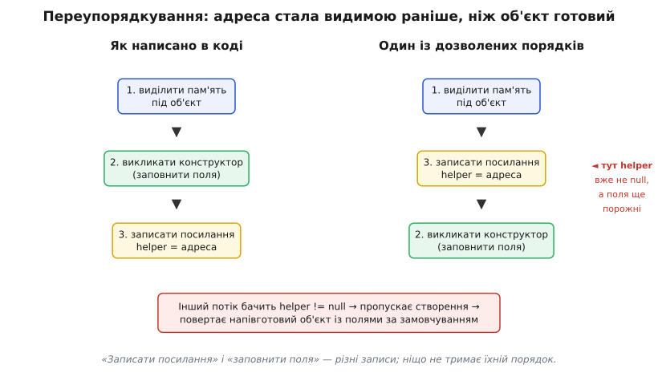
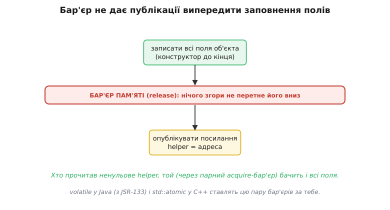

# 🧮 Блокування з подвійною перевіркою: чому воно зламане

Є шаблон коду, який виглядає настільки очевидно правильним, що його десятиліттями переписували з книжки в книжку, поки гурт найповажніших фахівців із багатопотоковості не сів і не написав окрему заяву під назвою «Double-Checked Locking is Broken» — «блокування з подвійною перевіркою зламане». Не «повільне», не «крихке», а саме **зламане**: воно дає неправильний результат навіть тоді, коли компілятор, процесор і твій код усі до одного роблять рівно те, що їм дозволено. Розберімо це від самого дна — бо це найчистіший приклад того, як інтуїція про «порядок, у якому все стається» розсипається, щойно потоків стає більше ніж один.

## Що це за прийом і навіщо він з'явився

Почнімо з задачі. Ледачий сінглтон створює свій єдиний об'єкт аж при першому звертанні. У багатопотоковій програмі це створення треба вберегти від гонитви — інакше два потоки, що зайшли одночасно, зроблять два об'єкти. Найпростіший захист — замок навколо всієї перевірки-і-створення:

```java
class Foo {
    private Helper helper = null;

    public synchronized Helper getHelper() {   // замок беруть ЩОРАЗУ
        if (helper == null)
            helper = new Helper();
        return helper;
    }
}
```

Це правильно. Але подивись, що діється після того, як об'єкт уже створено: кожен наступний виклик усе одно бере замок, заходить, бачить готове поле, віддає його й відпускає замок. Замок потрібен був рівно один раз — при першому створенні; далі це чистий податок на кожне читання. А читань може бути мільйони.

Звідси народжується спокуслива оптимізація. Думка така: замок потрібен лиш поки поле порожнє. То перевірмо поле **без** замка спершу; якщо воно вже заповнене — просто повертаємо, без жодної синхронізації. І тільки якщо порожнє — беремо замок і всередині перевіряємо **ще раз** (раптом хтось устиг створити, поки ми чекали на замок). Дві перевірки — звідси й назва, блокування з подвійною перевіркою (англ. *double-checked locking*, DCL):

```java
class Foo {
    private Helper helper = null;

    public Helper getHelper() {
        if (helper == null) {                  // 1-ша перевірка — БЕЗ замка
            synchronized (this) {
                if (helper == null)            // 2-га перевірка — під замком
                    helper = new Helper();
            }
        }
        return helper;
    }
}
```

На папері бездоганно. Гарячий шлях (об'єкт уже є) не торкається замка зовсім — лише одне порівняння з `null`. Замок бере лише рідкісний перший прохід. Внутрішня перевірка ловить перегони двох потоків, що обидва проскочили зовнішню. Логіка нібито замкнена з усіх боків.

І все ж вона зламана. Щоб побачити чому, треба спуститися на рівень, який у однопотоковому світі можна було не помічати все життя, — на рівень **моделі пам'яті**.

## Означення: модель пам'яті й переупорядкування

**Модель пам'яті** (англ. *memory model*) — це формальний контракт мови про те, які записи одного потоку та в якому порядку **зобов'язані стати видимими** іншому потоку. Ключове слово — «зобов'язані». Модель пам'яті не описує, що станеться; вона окреслює межу дозволеного: що система має право робити з твоїм кодом, лишаючись коректною.

І перше, що вражає при першому знайомстві: **порядок, у якому записи стають видимими іншому потоку, не зобов'язаний збігатися з порядком рядків у твоєму коді.**

Це не збій. Це навмисна свобода, і за неї ти щодня платиш швидкодією. Двоє незалежних грають на переупорядкування:

**Компілятор.** Оптимізатор вільно переставляє інструкції, якщо в межах **одного потоку** результат не змінюється. Записав `a = 1; b = 2;` — компілятор має повне право згенерувати спершу запис `b`, потім `a`, якщо це зручніше для регістрів чи конвеєра. У послідовній програмі ти цієї перестановки ніколи не помітиш: читаєш ти теж по-своєму, і все сходиться.

**Процесор.** Навіть якщо інструкції йдуть у пам'ять у «правильному» порядку, залізо має власні буфери запису (англ. *store buffer*), кеші й позачергове виконання. Запис у пам'ять може «зависнути» в буфері ядра й дійти до спільної пам'яті **пізніше**, ніж наступний за ним запис. Тобто навіть ідеально впорядкований машинний код інше ядро може побачити перемішаним.

> 🔧 **Навіщо це.** Ці перестановки — не примха розробників компіляторів, а левова частка того, чому сучасний код швидкий. Тримати всі записи строго по порядку й миттю розсилати їх усім ядрам означало б зупиняти конвеєр на кожному записі й ганяти кеші синхронно — втратити рази́ швидкодії. Тому за замовчуванням кожне ядро працює зі своєю картиною пам'яті, а синхронізацію ти **доплачуєш явно** — лише там, де вона справді потрібна. Модель пам'яті — це і є прейскурант: де порядок безкоштовний, а де за нього треба заплатити бар'єром.

Отже, правило гри таке: **у межах одного потоку все виглядає послідовним; між потоками — без явної синхронізації — жодних гарантій порядку немає.** Саме на цій межі DCL і провалюється.

## Інтуїція: як `helper = new Helper()` розпадається на кроки

Секрет у тому, що безневинний рядок

```java
helper = new Helper();
```

**не** є одна неподільна дія. Це щонайменше три окремі кроки:

```
1. виділити пам'ять під об'єкт  → отримати адресу
2. викликати конструктор        → заповнити поля об'єкта за адресою
3. записати адресу в поле helper → тепер helper != null
```

У послідовній програмі порядок 1 → 2 → 3 очевидний і непорушний: адже поле `helper` логічно має отримати значення аж наприкінці. Але згадай попереднє правило. Ці три кроки — три записи в пам'ять всередині одного потоку, і поки результат **у цьому потоці** той самий, компілятор і процесор вільні їх переставити. А результат у цьому потоці **той самий** і при порядку 1 → 3 → 2: той, хто виконав присвоєння, наприкінці однаково має і заповнений об'єкт, і посилання на нього. Різницю між «спершу заповнив, потім опублікував» і «спершу опублікував, потім заповнив» видно **лише збоку** — з іншого потоку. А про інший потік однопотокова оптимізація нічого не знає й не зобов'язана дбати.

Тож серед дозволених — оцей порядок:

```
1. виділити пам'ять під об'єкт
3. записати адресу в поле helper   ← helper вже НЕ null…
2. викликати конструктор           ← …а поля ще НЕ заповнені
```


*«Записати посилання» і «заповнити поля» — це різні записи в пам'ять; ніщо в межах одного потоку не тримає їхній взаємний порядок, тож публікація адреси може випередити конструктор.*

І ось тут відкривається смертельне вікно. Між кроком 3 і кроком 2 поле `helper` **уже ненульове**, а об'єкт за цією адресою — ще напівпорожній, з полями за замовчуванням (нулі, `null`-и, `false`-и). Якщо саме в цю мить інший потік зробить свою **першу, беззамкову** перевірку `if (helper == null)`, він побачить ненульове посилання, вирішить «о, готово», пропустить усе створення й поверне цей об'єкт назовні. Викличний код дістане `Helper`, у якого половина полів ще порожня. Далі — або `NullPointerException` на порожньому полі, або, ще підступніше, тихо неправильна поведінка, бо поле мало значення за замовчуванням замість справжнього.

Найгидкіше: **замок тут ні до чого**. Другий потік навіть не намагався брати замок — він провалився саме на беззамковій зовнішній перевірці, яка й була всім сенсом оптимізації. Замок навколо створення справний; діра — не в замку, а в тому, що читач по інший бік бачить наслідки чужих записів у переставленому порядку.

Це не теоретична страшилка. Автори заяви прямо показали: JIT-компілятор Symantec транслював `singletons[i].reference = new Singleton();` так, що присвоєння посилання відбувалося **до** виклику конструктора — тимчасовий реєстр діставав адресу свіжовиділеної пам'яті, вона одразу лягала в поле, і лише потім бігла ініціалізація. Цілком законно за тодішньою моделлю пам'яті Java. *(Статус: документований факт, зафіксований у самій декларації.)*

## Формальний апарат: «відбувається-раніше» і публікація

Щоб говорити про це точно, потрібне одне поняття — відношення **«відбувається-раніше»** (англ. *happens-before*). Це часткове впорядкування подій програми з єдиною по-справжньому важливою властивістю: **якщо дія X відбувається-раніше за дію Y, то всі записи, зроблені до X, гарантовано видимі тому, хто виконує Y.** Це і є формальний спосіб сказати «Y бачить свіжу пам'ять від X».

У межах одного потоку `happens-before` збігається з порядком коду — тому послідовні програми й «просто працюють». А от **між** потоками це відношення саме́ не виникає. Його треба **встановити** синхронізацією. Класичні джерела `happens-before` між потоками:

```
• відпускання замка happens-before наступного взяття ТОГО САМОГО замка
• запис volatile-поля  happens-before наступного читання ТОГО САМОГО поля
• запуск потоку happens-before першої дії в ньому
```

Тепер погляньмо на зламаний DCL крізь цю лінзу. Записи полів `Helper` роблять всередині `synchronized`. Другий потік, що читає `helper` на зовнішній перевірці, замок **не бере**. Отже, між «конструктор заповнив поля» і «другий потік прочитав посилання й пішов ним користуватися» **немає жодного ребра happens-before**. А раз немає ребра — немає й гарантії видимості: другий потік має повне право бачити ненульове `helper` та застарілі (порожні) поля об'єкта. Формально це навіть не «баг у певній реалізації» — це поведінка, дозволена самою моделлю. Реалізація, що робить так, — коректна. Зламаний — код.

Ось у чому глибина заяви «DCL is Broken»: справа не в тому, що якийсь компілятор нашкодив. Справа в тому, що DCL **вимагає гарантії видимості, якої ніде не попросив**. Він читає опубліковане іншим потоком значення, не встановивши з тим потоком жодного `happens-before`. Це діра в самій конструкції, а не в її втіленні.

Заяву 2000 року підписали ті, чиї імена стоять під фундаментом багатопотокової Java та JVM: **Девід Бейкон, Джошуа Блох, Джефф Боґда, Кліфф Клік, Пол Гаар, Даґ Лі, Том Мей, Ян-Віллем Мессен, Джеремі Менсон, Джон Д. Мітчелл, Келвін Нільсен, Білл П'ю та Емін Ґюн Сірер.** Даґ Лі — автор бібліотеки паралельності, що лягла в основу `java.util.concurrent`; Білл П'ю очолив перегляд самої моделі пам'яті Java; Джошуа Блох написав «Effective Java». Коли така рада каже «зламане», варто дослухатися. *(Статус: перелік підписантів — з першоджерела декларації.)*

## Стара vs нова модель Java: чому `volatile` став ліками

Напрошується латка: а якщо оголосити поле `volatile`? Ключове слово `volatile` (лат. *volatilis* — летючий; поле, значення якого може «злетіти» будь-якої миті з іншого потоку) здавна означало «читай справжнє значення з пам'яті, не з кешу регістра». Латка правильна — але **лише з певної версії Java**, і в цьому вся сіль.

**Стара модель (до Java 5, JDK 1.4 і раніше).** У ній `volatile` гарантував свіжість самого поля, але **не забороняв переставляти звичайні записи навколо запису volatile**. Тобто заповнення полів `Helper` (звичайні записи) все одно могло переповзти за публікацію посилання — навіть якщо саме посилання зробити volatile. DCL лишався зламаним навіть із `volatile`. Саме тому заява беззастережно писала: у старій моделі надійного способу зробити DCL просто **немає** (крім важких обхідних трюків).

**Нова модель (Java 5, 2004, специфікація JSR-133).** Модель пам'яті переписали, і серед іншого **посилили семантику `volatile`**. Тепер правило таке — цитуючи по суті першоджерело:

```
запис volatile-поля НЕ можна переставити з жодним попереднім читанням чи записом,
а читання volatile-поля НЕ можна переставити з жодним наступним читанням чи записом.
```

Це і є той бар'єр, якого бракувало. Запис у `helper` (volatile) став **межею, крізь яку не проповзуть униз** попередні звичайні записи — заповнення полів об'єкта. Отже, порядок «спершу поля, потім публікація» тепер **гарантований**. А парне читання volatile на іншому боці встановлює те саме `happens-before`: хто прочитав ненульове `helper`, той бачить і всі записи, що передували його публікації, — тобто повністю заповнений об'єкт.


*volatile у сучасній Java і `std::atomic` у C++ ставлять пару бар'єрів — release при публікації й acquire при читанні, — і саме ця пара створює ребро happens-before між тим, хто створив об'єкт, і тим, хто його побачив.*

Тому **правильний** DCL у сучасній Java відрізняється від зламаного рівно одним словом:

```java
class Foo {
    private volatile Helper helper = null;     // ← єдина, але вирішальна відмінність

    public Helper getHelper() {
        if (helper == null) {                  // читання volatile: acquire-бар'єр
            synchronized (this) {
                if (helper == null)
                    helper = new Helper();      // запис volatile: release-бар'єр
            }
        }
        return helper;
    }
}
```

Розберімо по кроках, що тепер тримає порядок. Запис `helper = new Helper()` — це запис volatile-поля. За новою моделлю всі записи, що йому передували (а виділення й **заповнення полів** конструктором передують присвоєнню в порядку програми), не мають права перетнути цей бар'єр донизу. Тож у мить, коли `helper` стає ненульовим для будь-кого, поля вже заповнені — гарантовано. Зовнішня перевірка `if (helper == null)` — читання того самого volatile-поля; побачивши ненульове значення, вона встановлює `happens-before` із записом, а отже читач бачить усі попередні записи автора. Вікно з напівготовим об'єктом закрилося. *(Статус: посилена семантика volatile у JSR-133 / Java 5 — документована зміна специфікації.)*

Одне застереження, що показує тонкість межі: якщо `Helper` **незмінний** — усі його поля `final`, — то за новою моделлю Java `final`-поля мають власну гарантію публікації, і такий DCL коректний **навіть без** `volatile`. Але це вузький виняток; щойно є хоч одне не-`final` поле, `volatile` знову обов'язковий. Простіше не тримати цей виняток у голові, а завжди ставити `volatile`.

## Той самий сюжет у C++

C++ пройшов буквально тим самим шляхом, лише на кілька років пізніше. У 2004-му Скотт Меєрс і Андрій Александреску розібрали DCL у статті «C++ and the Perils of Double-Checked Locking» і дійшли жорсткого висновку: **до C++11 у мові взагалі не було ні моделі пам'яті, ні самого поняття потоку.** Стандарт мовчав про багатопотоковість — а отже компілятор не мав жодних обмежень на переупорядкування записів навколо публікації посилання. У такому світі DCL не просто ненадійний — він **у принципі не виражається** засобами мови: немає слова, яким наказати «не переставляй ці записи», бо стандарт не визнає паралелізму. *(Статус: відсутність моделі пам'яті до C++11 — задокументований факт, наведений авторами статті.)*

C++11 дав мові пам'яттєву модель і тип `std::atomic` з явним керуванням порядком. Правильний DCL тепер записують з атомарним посиланням і парою `release`/`acquire`:

```cpp
#include <atomic>
#include <mutex>

class Foo {
    static std::atomic<Helper*> instance;
    static std::mutex m;
public:
    static Helper* getHelper() {
        Helper* p = instance.load(std::memory_order_acquire);   // acquire
        if (p == nullptr) {
            std::lock_guard<std::mutex> lock(m);
            p = instance.load(std::memory_order_relaxed);       // під замком relaxed досить
            if (p == nullptr) {
                p = new Helper();                                // конструктор до кінця…
                instance.store(p, std::memory_order_release);    // …ПОТІМ публікація (release)
            }
        }
        return p;
    }
};
```

Логіка дзеркальна до Java. `memory_order_release` при `store` — бар'єр, що не дає записам конструктора (вони над ним у порядку програми) перетекти вниз за публікацію вказівника. `memory_order_acquire` при зовнішньому `load` — парний бар'єр: побачивши ненульовий вказівник, потік бачить і всі записи, що передували його `release`-публікації. Пара release–acquire над однією атомарною змінною і є те саме ребро `happens-before`, яке в Java дає `volatile`. Другий `load` уже під замком — тому `relaxed`: замок сам собою впорядкував усе, що треба.

## Де це працює в темі: правильна латка й чому її зазвичай не треба

Отже, DCL **можна** полагодити — рівно однією річчю: явним бар'єром пам'яті, що прив'язує публікацію посилання до завершення конструктора й дає парне ребро `happens-before` читачеві. У Java це `volatile` (від Java 5), у C++ — `std::atomic` з `release`/`acquire` (від C++11). Без цієї прив'язки DCL зламаний за визначенням, з нею — коректний. Уся суть заяви вкладається в один рядок: **проблема не в замку, а у **видимості записів**, і лікує її не другий `if`, а бар'єр.**

Але тут напрошується головне питання цієї теми: а **навіщо** взагалі городити DCL, якщо його так легко зіпсувати? І чесна відповідь для сінглтона — здебільшого **не треба**. DCL винаходили як лінивий сінглтон без сталого податку на замок; сьогодні той самий результат дають простіші й безпечніші засоби, у яких небезпечний порядок бере на себе платформа, а не ти.

**Готова ініціалізація (eager).** Створи об'єкт одразу, при завантаженні класу чи модуля. Ініціалізацію статичних полів середовище й так виконує рівно раз і потокобезпечно — гонитві просто нема де взятися, а отже нема чого й лагодити подвійною перевіркою. Ціна — об'єкт будується завжди, навіть коли не знадобиться.

**Ідіома «тримач через статичний вкладений клас» (Java).** Коли лінивість таки потрібна, канонічна заміна DCL у Java — не крутити `volatile` вручну, а покласти екземпляр у статичне поле окремого вкладеного класу:

```java
class Foo {
    private static class Holder {
        static final Helper INSTANCE = new Helper();   // ініціалізується при першому доступі
    }
    public static Helper getHelper() {
        return Holder.INSTANCE;                          // саме тут Holder і завантажиться
    }
}
```

Вкладений клас `Holder` завантажиться **аж коли** вперше згадають `Holder.INSTANCE` — тобто ліниво, при першому виклику `getHelper()`. А про потокобезпеку ініціалізації статичного поля дбає сама специфікація мови: «поле не буде ініціалізоване, поки до нього не звернуться, і будь-який потік, що звертається до поля, побачить усі записи, зроблені при його ініціалізації». Тобто те саме `happens-before`, тільки безкоштовно й без жодного `volatile`. Це визнана перевага над DCL: та сама лінивість, нуль ручної синхронізації, нуль шансів помилитися з порядком.

**C++11 magic statics.** У C++ роль такого «тримача» грає локальна статична змінна функції. Стандарт C++11 у розділі про оголошення ([stmt.dcl]) прописав дослівно: «якщо потік входить в оголошення в той час, коли змінну вже ініціалізує інший потік, він **зобов'язаний зачекати** на завершення ініціалізації». Компілятор сам вставляє прихований одноразовий замок — цю можливість так і прозвали «магічні статики» (англ. *magic statics*):

```cpp
Helper& getHelper() {
    static Helper instance;   // C++11: ініціалізується рівно раз, потокобезпечно
    return instance;
}
```

Один рядок робить усе, заради чого писали DCL: ліниво (при першому проході через оголошення), рівно раз, потокобезпечно — і без жодного бар'єра в твоєму коді. *(Статус: формулювання [stmt.dcl] p4 — з тексту стандарту C++11; підтримка з'явилася в GCC 4.3 та Visual Studio 2015.)*

Ось чому в сучасному коді DCL для сінглтона — майже завжди зайвий. Він лишається повчальним прикладом того, як тонко влаштована видимість пам'яті між потоками, і зрідка стає в пригоді там, де готовий ідіом платформи чомусь не лягає (складніша ледача ініціалізація, не проста статична змінна). Але як шаблон «швидкого лінивого сінглтона» його витіснили: готова ініціалізація, статичний тримач у Java і magic statics у C++ дають те саме, і в них **неможливо** припуститися помилки з порядком записів, бо цей порядок за тебе тримає мова.

Сухий залишок один. DCL ламається не через погану реалізацію, а через **запитану, але не встановлену гарантію видимості**: читач бачить опубліковане іншим потоком посилання, не маючи з тим потоком ребра `happens-before`. Полагодити це можна лише бар'єром (`volatile` у Java, `std::atomic` у C++), що прив'язує публікацію до завершення конструктора. А оскільки платформа вже вміє публікувати статичні поля правильно й безкоштовно, найкращий DCL — той, якого ти не написав.

## Джерела

- The "Double-Checked Locking is Broken" Declaration — https://www.cs.umd.edu/~pugh/java/memoryModel/DoubleCheckedLocking.html
- Scott Meyers, Andrei Alexandrescu, «C++ and the Perils of Double-Checked Locking» — https://www.aristeia.com/Papers/DDJ_Jul_Aug_2004_revised.pdf
- Double-checked locking (Wikipedia) — https://en.wikipedia.org/wiki/Double-checked_locking
- C++11 [stmt.dcl] thread-safe initialization of block-scope statics — https://gist.github.com/louis-langholtz/3c08fbf10d6923db912689bb87812d58
