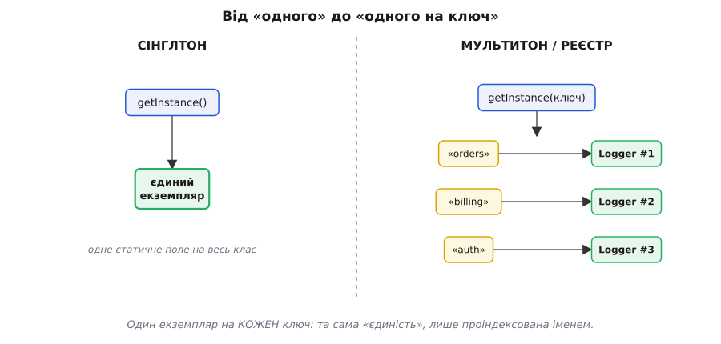
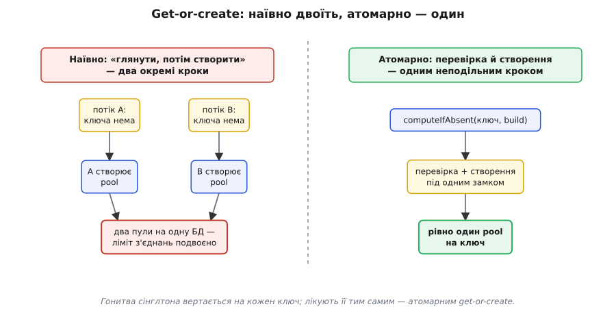
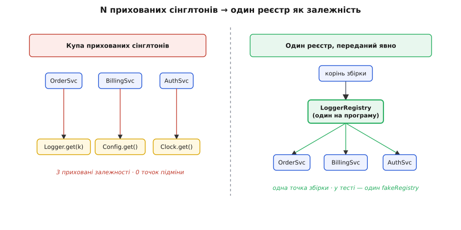
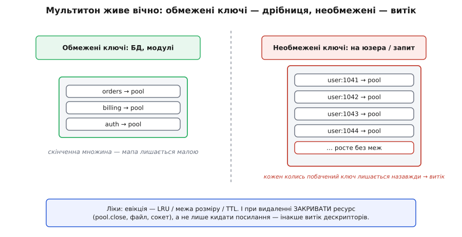

# ⚙️ Мультитон і реєстр: сінглтон на N іменованих екземплярів

## Задача: не «один», а «один на ключ»

Сінглтон відповідає на питання «як зробити, щоб об'єкт існував рівно один». Але життя частіше ставить сусіднє, ледь зсунуте питання: не «один на всю програму», а **«один на кожну назву»**. Один пул з'єднань на кожну базу даних. Один логер на кожен модуль. Один кеш на кожну область даних. Один клієнт на кожен зовнішній сервіс.

Придивися, що тут спільного з сінглтоном, а що інше. Спільне — сама **вимога єдиності**: двійник тієї самої речі лишається помилкою. Два пули до однієї бази розчепірять ліміт з'єднань удвічі й обидва вважатимуть, що тримають повний бюджет. Два логери на один модуль переплутають порядок записів у файл. Два кеші на одну область розійдуться в значеннях. Інше — **кількість самих речей**: їх стільки, скільки різних імен, і наперед це число невідоме, воно випливає з даних. Баз може бути три або тридцять; модулів — скільки в програмі файлів.

Отже, нам потрібна конструкція, яка тримає обіцянку «рівно один» **окремо для кожного ключа** й видає за ключем завжди той самий об'єкт. Наївна відповідь, яку пишуть найчастіше, — накидати купу окремих сінглтонів (`OrdersDbPool`, `BillingDbPool`, `AuthDbPool`…) або завести одну глобальну мапу й дописувати в неї «якщо ключа ще нема». Обидва шляхи працюють у демонстрації й обидва тихо приносять ті самі болі, що й сінглтон, лише помножені на кількість ключів. Розберімо, як зробити це правильно — і де саме воно ламається.

## Ідея: словник плюс get-or-create

Уся конструкція вміщається в одне речення. Там, де сінглтон тримає **одне статичне поле** під єдиний екземпляр, мультитон тримає **словник** `ключ → екземпляр`; замість `getInstance()` він дає `getInstance(ключ)`, який або повертає наявний запис за цим ключем, або створює новий, кладе в словник і повертає його.


*Один екземпляр на кожен ключ — це та сама «єдиність» сінглтона, лише проіндексована іменем; виродженим випадком з одним можливим ключем мультитон стає звичайним сінглтоном.*

Ця операція «повернути наявне або створити й запам'ятати» настільки часта, що має усталену назву — **get-or-create** (діст-або-створи). Вона і є серцем усього патерна; усе інше — це варіації на тему того, як зробити її правильно під навантаженням і як не дати словнику зжерти пам'ять.

Сам патерн зветься **мультитон** (англ. *multiton* — злютовано з *multi* й *singleton*): узагальнення сінглтона на скінченну, керовану сім'ю іменованих екземплярів. Часто ту саму думку називають **реєстром** (англ. *registry*) — коли наголос падає не на «створити», а на «зберегти й знайти за ключем». У «банді чотирьох» цього патерна немає: це пізніша, названа окремо надбудова над сінглтоном — з тим самим ядром «контрольована єдиність» і тим самим набором пасток.

Найзнайоміший мультитон, яким ти вже користувався, навіть не називаючи його так, — **фабрика логерів**. Виклик `LoggerFactory.getLogger("orders")` двічі з тим самим іменем повертає **той самий** об'єкт: під капотом реалізація (Logback, Log4j2) тримає реєстр логерів за іменем і додає нові через той самий атомарний get-or-create. Логер дешевий на створення, а ключів (імен модулів) скінченно й небагато — тому ця фабрика живе спокійно й непомітно. Саме на цьому прикладі найлегше побачити, як конструкція має працювати; а коли ключів стає багато й вони дорогі — на прикладі пулів з'єднань — вилізуть усі граблі.

## Робочий код: потокобезпечний get-or-create

Ось де захована перша й найгостріша складність. Get-or-create — це **перевірка й дія двома кроками**: спершу «чи є запис за ключем?», потім, якщо нема, «створити й покласти». Між цими кроками є щілина в часі, і в багатопотоковій програмі два потоки протискаються в неї одночасно — рівно як у сінглтоні, тільки тепер конкуренція йде **за конкретний ключ**. Два потоки просять пул для тієї самої бази, обидва бачать, що запису ще нема, і обидва його створюють. Народжується два пули на одну базу — єдиність за цим ключем зламана ([що таке гонитва даних і чому без узгодження виходить два «єдиних»](topic:programming/thread-safety) — коли кілька потоків торкаються тих самих даних без синхронізації, результат залежить від непередбачуваного порядку кроків).

Лікують це так само, як у сінглтоні: **зробити перевірку-й-створення неподільними**. Але кожна платформа дає для цього свій ідіом, і вони повчально різні — бо різні їхні моделі паралельності. Той самий реєстр логерів, потокобезпечно, трьома мовами:

:::tabs
```java
// Java: computeIfAbsent на ConcurrentHashMap — АТОМАРНИЙ get-or-create.
// Перевірка й вставка — під внутрішнім замком сегмента мапи, одним кроком.
public final class LoggerRegistry {
    private final ConcurrentMap<String, Logger> loggers = new ConcurrentHashMap<>();

    public Logger get(String name) {
        // якщо ключа нема — викликає Logger::new РІВНО раз, навіть під десятком потоків;
        // решта чекають і отримують той самий створений екземпляр
        return loggers.computeIfAbsent(name, Logger::new);
    }
}
```
```go
// Go: подвійна перевірка на RWMutex. Спершу дешеве читання під RLock;
// якщо промах — беремо ексклюзивний Lock і перевіряємо ще раз, уже під ним.
type LoggerRegistry struct {
    mu      sync.RWMutex
    loggers map[string]*Logger
}

func NewLoggerRegistry() *LoggerRegistry {
    return &LoggerRegistry{loggers: make(map[string]*Logger)}
}

func (r *LoggerRegistry) Get(name string) *Logger {
    r.mu.RLock()
    lg, ok := r.loggers[name]
    r.mu.RUnlock()
    if ok {
        return lg // швидкий шлях: ключ уже є, жодного ексклюзивного замка
    }

    r.mu.Lock()
    defer r.mu.Unlock()
    if lg, ok := r.loggers[name]; ok { // друга перевірка: хтось міг створити, поки ми брали Lock
        return lg
    }
    lg = newLogger(name)
    r.loggers[name] = lg
    return lg
}
```
```cpp
// C++: подвійна перевірка на shared_mutex. Дешеве спільне читання під
// shared_lock; якщо промах — ексклюзивний unique_lock і друга перевірка під ним.
#include <shared_mutex>
#include <mutex>
#include <unordered_map>
#include <memory>
#include <string>

class LoggerRegistry {
    std::unordered_map<std::string, std::shared_ptr<Logger>> loggers_;
    std::shared_mutex mu_;
public:
    std::shared_ptr<Logger> get(const std::string& name) {
        {
            std::shared_lock read{mu_};            // читачі гарячого шляху не блокують одне одного
            auto it = loggers_.find(name);
            if (it != loggers_.end())
                return it->second;                 // швидкий шлях: ключ уже є
        }
        std::unique_lock write{mu_};               // на створення — ексклюзивний замок
        auto it = loggers_.find(name);             // друга перевірка: хтось міг створити, поки брали замок
        if (it != loggers_.end())
            return it->second;
        auto lg = std::make_shared<Logger>(name);
        loggers_.emplace(name, lg);
        return lg;
    }
};
```
```python
# Python: подвійна перевірка на threading.Lock.
# Читання dict без замка безпечне під GIL; присвоєння атомарне — тож ідіом коректний.
import threading

class LoggerRegistry:
    def __init__(self):
        self._loggers: dict[str, Logger] = {}
        self._lock = threading.Lock()

    def get(self, name: str) -> "Logger":
        lg = self._loggers.get(name)      # швидка перевірка без замка
        if lg is not None:
            return lg
        with self._lock:                  # у вузьке місце — по одному
            lg = self._loggers.get(name)  # друга перевірка вже під замком
            if lg is None:
                lg = Logger(name)
                self._loggers[name] = lg
            return lg
```
:::

Придивися, як чотири мови кажуть **одне й те саме** різними словами. `computeIfAbsent` у Java — це готовий, вбудований атомарний get-or-create: тобі не видно ані `if`, ані замка, платформа зробила їх усередині. Go, C++ і Python такого одного виклику не мають, тож пишуть **подвійну перевірку** руками: дешева перевірка спочатку (щоб на гарячому шляху, коли ключ давно є, не платити за ексклюзивний замок), а якщо промах — замок і **друга** перевірка під ним, бо між першою перевіркою й захопленням замка запис міг з'явитися. Go і C++ ідуть іще на крок далі: перше читання беруть під **спільним** замком для читачів (`RWMutex` у Go, `shared_mutex` у C++), щоб паралельні читачі гарячого шляху не ставали в чергу одне за одним, і лише на створення вмикають ексклюзивний замок. Це той самий приклад двоетапної обережності, що й у класичному блокуванні з подвійною перевіркою, — але тут він **коректний без хитрощів із пам'яттю**, бо ми не публікуємо напівготове посилання: у Go запис у мапу відбувається під замком, у C++ і запис, і читання захищає той самий `shared_mutex`, у Python присвоєння в `dict` атомарне під GIL, і читач або бачить повністю готовий об'єкт, або не бачить нічого.

> 🔧 **Навіщо це.** Реєстр — це не «мапа плюс трохи коду». Уся його правильність тримається на тому, що **перевірка й створення неподільні**. Прибери це — і найпідліший баг лізе не там, де здається: словник цілісний, жоден запис не зіпсований, просто для одного ключа тихо існує **два** об'єкти, і код у різних кутках програми бачить різну правду за однаковим іменем. Це та сама гонитва, що труїть сінглтон, тільки тепер вона повертається на **кожен** ключ окремо — тож і замикати її треба на рівні операції get-or-create, а не десь «навколо».


*Ліворуч два потоки одночасно бачать, що ключа нема, і кожен створює свій пул; праворуч перевірка й створення — один неподільний крок, і екземпляр виходить один.*

### Однопотоковий не означає безпечний: гонитва через await

Може здатися, що в однопотокових середовищах — як-от Node.js із його однією ниткою виконання — цієї мороки нема: без потоків нема й гонитви, і реєстр зводиться до `Map` з простим `if`. Для **синхронного** створення це правда:

```ts
// Синхронний get-or-create: у Node одна нитка, гонитві нізвідки взятися
class LoggerRegistry {
  private loggers = new Map<string, Logger>();

  get(name: string): Logger {
    let lg = this.loggers.get(name);
    if (lg === undefined) {
      lg = new Logger(name);          // між get і set керування нікуди не йде
      this.loggers.set(name, lg);
    }
    return lg;
  }
}
```

Але щойно створення стає **асинхронним** — а для пулів, з'єднань, дорогих клієнтів воно майже завжди асинхронне, — гонитва повертається навіть на одній нитці. Річ у `await`: у точці `await` функція **віддає керування** назад у цикл подій, і поки перший виклик чекає, поки збудується пул, другий виклик з тим самим ключем устигає пройти ту саму перевірку «пулу ще нема» й теж почати будувати. Дві нитки не потрібні — досить двох перекладених у часі `await`-ів:

```ts
class PoolRegistry {
  private pools = new Map<string, Pool>();
  private inflight = new Map<string, Promise<Pool>>();

  get(key: string): Promise<Pool> {
    const ready = this.pools.get(key);
    if (ready) return Promise.resolve(ready);      // уже готовий

    // ключова хитрість: кешуємо саму ОБІЦЯНКУ побудови, а не лише готовий пул.
    // Другий виклик під час будівництва дістане ТУ САМУ обіцянку й дочекається її,
    // а не почне будувати другий пул.
    let building = this.inflight.get(key);
    if (!building) {
      building = createPool(key).then(pool => {
        this.pools.set(key, pool);
        this.inflight.delete(key);
        return pool;
      });
      this.inflight.set(key, building);
    }
    return building;
  }
}
```

Прийом «кешувати незавершену обіцянку» — це рівно те, що в Go зветься **singleflight** («один політ»): скільки б викликів не прийшло на один ключ, поки триває створення, справжня робота виконується **один раз**, а всі решта чіпляються до того самого результату. Побачити цю гонитву на однонитковому Node важче, ніж потокову, — і саме тому вона частіше доживає до продакшну.

## Реєстр як залежність витісняє купу сінглтонів

Тепер найголовніше — не про потоки, а про архітектуру, і саме заради цього варто взагалі говорити про реєстр окремо від сінглтона.

Уяви, що ти не завів реєстру, а пішов очевиднішим шляхом: кожен об'єкт, якому треба логер, сам кличе `Logger.get("orders")`; кожен, кому треба конфіг, кличе `Config.getInstance()`; кому треба годинник — `Clock.now()`. Кожен такий виклик — **прихована глобальна залежність**: у сигнатурі її не видно, підмінити в тесті нема куди, і кожен новий вид глобального доступу додає ще один такий незримий дріт. Ти отримав не один сінглтон, а їх **розсип** — і кожен тягне повний набір сінглтонових бід.

Реєстр згортає цей розсип у **одну** залежність. Замість того щоб десятки місць лізли по десятки глобалів, ти створюєш реєстр **один раз** — там, де збираєш програму докупи (композиційний корінь), — і **передаєш** його тим, кому він потрібен. Один шов замість багатьох:

:::tabs
```ts
// БУЛО: сервіс сам лізе по глобальний логер — прихована залежність, підмінити нема куди
class OrderService {
  process(order: Order) {
    Logger.get("orders").info("нове замовлення");   // ← незримий глобал
  }
}

// СТАЛО: реєстр приходить через конструктор — залежність видно, її можна підмінити
class OrderService {
  constructor(private loggers: LoggerRegistry) {}    // ← видно в сигнатурі

  process(order: Order) {
    this.loggers.get("orders").info("нове замовлення");
  }
}

// збірка програми (один раз, в одному місці):
const loggers = new LoggerRegistry();
const orders = new OrderService(loggers);

// у тесті: підставляємо фейковий реєстр — жодного глобального стану
const fake = new FakeLoggerRegistry();
const sut = new OrderService(fake);
```
```java
// БУЛО: прихована залежність від глобального реєстру логерів
class OrderService {
    void process(Order order) {
        Logger.get("orders").info("нове замовлення");  // ← незримий глобал
    }
}

// СТАЛО: реєстр — явна залежність конструктора
class OrderService {
    private final LoggerRegistry loggers;
    OrderService(LoggerRegistry loggers) { this.loggers = loggers; }  // ← видно в сигнатурі

    void process(Order order) {
        loggers.get("orders").info("нове замовлення");
    }
}

// збірка (композиційний корінь):
LoggerRegistry loggers = new LoggerRegistry();
OrderService orders = new OrderService(loggers);

// у тесті: свій реєстр на кожен тест, стан не тече між прогонами
OrderService sut = new OrderService(new FakeLoggerRegistry());
```
:::

Різниця здається косметичною, а переставляє все на місця. Залежність `OrderService` від логерів тепер **написана в конструкторі** — її видно з першого погляду. Хто дасть той реєстр і чи він один на всю програму — вирішується в **одному місці**. А головне — повертається **тестованість**: у тесті ти передаєш фейковий реєстр, кожен тест дістає свій, ізольований, і жоден не отруює наступного спільним живучим станом. Це і є [впровадження залежностей](topic:programming/dependency-injection): об'єкт **отримує** потрібне ззовні, а не **добуває** сам глобально; для реєстру воно працює точно так само, як для будь-якого іншого об'єкта.


*Купа прихованих сінглтонів дає стільки незримих залежностей, скільки глобалів, і жодної точки підміни; один реєстр, переданий явно, — це одна залежність, одна точка збірки й один фейк у тесті.*

> 🔧 **Навіщо це.** Ось у чому парадокс, і його варто вимовити прямо: **реєстр — це водночас і ліки, і отрута**. Переданий як залежність, він **гоїть** — стягує розсип глобалів у один керований, підмінний об'єкт. Залишений глобальним (`LoggerRegistry.getInstance().get(...)`), він **отруює гірше** за поодинокий сінглтон — бо це вже глобальна змінна, всередині якої живе ще й цілий словник спільного стану, доступного звідусіль. Той самий код, залежно від **одного** рішення — передавати чи діставати, — стає взірцевим або токсичним. Тому питання «реєстр чи ні» вторинне; первинне — **передаєш ти його руками чи він глобальний**.

## Складність і пастки

Реєстр коштує дешево в роботі й дорого в недогляді. Зведімо ціну й перелічимо граблі, кожні з яких відкриваються незалежно.

```
пошук / вставка:  O(1) у середньому            (геш-таблиця за ключем)
пам'ять:          O(k),  k = число різних ключів
                  БЕЗ евікції k лише росте → пам'ять монотонно вгору
евікція (LRU):    O(1) на видалення, пам'ять ≤ заданій межі
```

Сам get-or-create — це геш-пошук, тобто амортизовано O(1); тут швидкодія не проблема. Проблема — у другому рядку: **пам'ять росте з числом ключів**, і без спеціального заходу вона не спадає ніколи. Звідси й тягнуться головні пастки.

### Атомарність get-or-create

Перша пастка вже розібрана вище — неатомарний get-or-create двоїть екземпляри, — але в неї є два тонкі продовження, про які спотикаються навіть із «правильним» атомарним викликом.

**Створення під замком серіалізує всіх.** Ідіом Go/Python вище будує об'єкт **тримаючи замок**. Для дешевого логера це дрібниця; але якщо `newLogger` замінити на `createPool`, що встановлює мережеве з'єднання за сотні мілісекунд, то всі інші потоки, яким треба будь-який **інший** ключ, стоятимуть у черзі за цим замком. Ліки — будувати **поза** замком і публікувати результат атомарно (як робить singleflight), або дати кожному ключу свій замок (`map[key]*sync.Once` у Go), щоб довга побудова одного ключа не блокувала решту.

**«Діст-або-створи» може створити зайве й викинути.** Спокуслива на вигляд коротша форма приховує ту саму пастку навпаки. У Python `self._loggers.setdefault(name, Logger(name))` виглядає як атомарний get-or-create — а насправді **щоразу** обчислює `Logger(name)` ще до виклику `setdefault`, навіть коли ключ давно є, і зайвий об'єкт одразу йде на смітник. Те саме в Go з `sync.Map`: його `LoadOrStore(key, value)` вимагає збудувати `value` **до** виклику, тож на кожен запит ти платиш за створення, навіть якщо store не станеться. Для дешевого значення це лише марна робота; для дорогого пулу — відкрите й одразу викинуте з'єднання. Тому для дорогих значень бери форму, що **відкладає** створення до моменту, коли воно справді потрібне (`computeIfAbsent`, singleflight, ручна подвійна перевірка), а не «створи заздалегідь, потім, може, викинь».

І окрема, найковарніша грабля саме `ConcurrentHashMap.computeIfAbsent`: **функція-будівник не сміє чіпати ту саму мапу**. Якщо всередині `Logger::new` (чи ланцюжком з нього) знову покликати `loggers.computeIfAbsent(...)`, то в Java 8 це заганяє мапу в **нескінченний цикл** (баг JDK-8062841), а від Java 9 кидає `IllegalStateException` з текстом «Recursive update». Документація прямо забороняє змінювати мапу зсередини функції обчислення — тримай будівник ключа незалежним від самого реєстру.

### Необмежене зростання й вічне життя

Це головна відмінність мультитона від сінглтона й найпоширеніший спосіб посадити ним пам'ять. Сінглтон тримає **один** об'єкт вічно — і це нормально: один незмінний тягар. Мультитон тримає **по одному на ключ** вічно — а це нормально, лише поки ключів **скінченно й небагато**.


*Бази й модулі — скінченна множина, і реєстр за ними живе спокійно; але ключі на кшталт «на користувача» чи «на запит» ростуть без меж, і кожен колись побачений запис лишається назавжди — це прямий витік пам'яті.*

Ключі бувають двох порід, і від породи залежить усе. **Обмежені** — бази даних, модулі, типи повідомлень: їх скінченна, наперед відома жменя, реєстр за ними ніколи не роздується, тут можна нічого не боятися. **Необмежені** — на користувача, на сесію, на запит, на орендаря, що приходить і йде: множина таких ключів росте з життям системи, і мультитон, який просто «кладе новий, якщо нема», перетворюється на **словник, що росте, поки не впаде процес**. Найпідступніше те, що баг виглядає як повільний витік: пам'ять повзе вгору тижнями, тести на короткому прогоні нічого не бачать.

Ліки — **обмежити реєстр**: викидати давно не вживані записи (евікція за LRU — least-recently-used), тримати стелю розміру або час життя (TTL). Але тут чигає ще одна пастка, специфічна для дорогих ресурсів: **викинути запис — це не те саме, що звільнити ресурс**. Якщо значення — пул з'єднань, файл чи сокет, то просто прибрати посилання з мапи мало: збирач сміття прибере об'єкт, але **дескриптор** (з'єднання, файловий хендл) лишиться відкритим, поки не спрацює фіналізатор — а він може й не спрацювати. Тому при евікції ресурс треба **явно закрити**:

```java
// Обмежений реєстр пулів: стеля розміру + LRU + ЗАКРИТТЯ пулу при евікції.
public final class PoolRegistry implements AutoCloseable {
    private static final int MAX = 64;
    private final Map<String, ConnectionPool> pools;

    public PoolRegistry() {
        // accessOrder=true → LinkedHashMap тримає порядок за останнім доступом (LRU)
        this.pools = new LinkedHashMap<>(16, 0.75f, true) {
            @Override
            protected boolean removeEldestEntry(Map.Entry<String, ConnectionPool> eldest) {
                if (size() > MAX) {
                    eldest.getValue().close();   // ← закрити з'єднання, не лише кинути посилання
                    return true;                 // ← і аж тоді видалити запис
                }
                return false;
            }
        };
    }

    public synchronized ConnectionPool get(String url) {  // LinkedHashMap не потокобезпечний
        ConnectionPool p = pools.get(url);                // get теж оновлює «свіжість» (LRU)
        if (p == null) {
            p = new ConnectionPool(url);
            pools.put(url, p);                            // put запускає removeEldestEntry
        }
        return p;
    }

    @Override
    public synchronized void close() {
        pools.values().forEach(ConnectionPool::close);    // при зупинці — закрити всі
        pools.clear();
    }
}
```

У продакшні цю логіку рідко пишуть руками — беруть готову обмежену мапу (Caffeine чи Guava в Java, `lru_cache` з максимумом чи бібліотечний LRU у Python), де стеля розміру, TTL і **гачок на евікцію** (щоб закрити ресурс) уже реалізовані й перевірені. Але розуміти під ними треба саме це: реєстр без межі — це витік, а межа без закриття ресурсу — витік дескрипторів. Сам пул з'єднань, який тут виступає значенням, — це окремий патерн зі своїм життєвим циклом; як він улаштований усередині, розібрано в [пулі об'єктів](topic:programming/object-pool) (тримати напоготові набір дорогих на створення об'єктів і видавати їх у користування замість щоразу створювати наново).

### Витік ключів і мертві значення

Пам'ять тече не лише через кількість записів, а й через те, що **сам запис тримає свої об'єкти живими**. Мапа сильно (strong) посилається і на ключ, і на значення — тобто, поки запис у реєстрі, ні ключ, ні значення не можуть бути зібрані, навіть якщо більше ніде в програмі на них уже ніхто не дивиться. Для обмежених ключів це якраз добре (ми й хочемо, щоб пул жив). Але коли ключ — це сам якийсь об'єкт (сесія, з'єднання, вузол), реєстр стає причиною, чому цей об'єкт **безсмертний**: він давно не потрібен, його вже ніде не тримають, а він живий лише тому, що є ключем у нашій мапі.

Тут рятують **слабкі посилання** (weak references) — такі, що **не** заважають збирачеві прибрати об'єкт. Мапа зі слабкими ключами сама викидає запис, коли ключ помирає деінде:

:::tabs
```python
import weakref

# WeakKeyDictionary: ключ тримається СЛАБКО. Щойно об'єкт-ключ помирає деінде —
# запис зникає сам, чистити руками не треба.
per_session_cache: "weakref.WeakKeyDictionary[Session, Metrics]" = weakref.WeakKeyDictionary()

# ПАСТКА: значення НЕ мусить сильно посилатися на свій ключ — інакше воно
# тримає ключ живим, слабке посилання ніколи не «відпустить», і витік лишається.
```
```java
// WeakHashMap: ключ тримається слабко; коли на Session більше ніхто не дивиться,
// збирач прибирає і об'єкт, і запис із мапи.
Map<Session, Metrics> perSession = new WeakHashMap<>();

// Та сама пастка: якщо Metrics усередині тримає посилання на свій Session,
// ключ ніколи не помре — слабкість ключа знецінюється сильним посиланням із значення.
```
:::

Слабкі посилання спираються на роботу збирача сміття (як саме він вирішує, що об'єкт більше недосяжний, — у [збиранні сміття](topic:programming/garbage-collection)), і мають власну тонку пастку, виділену в коментарях: **значення не сміє сильно тримати свій ключ**, бо тоді слабкість ключа нічого не варта. Це часта, важко вловна причина, чому «слабка» мапа все одно тече.

### Нормалізація ключів

Остання, найтихіша грабля: реєстр гарантує «один на ключ» рівно настільки, наскільки **однакові ключі справді рівні між собою**. Якщо та сама база адресується двома написаннями — `db.prod:5432` і `DB.PROD:5432/`, або той самий URL з різним регістром хоста чи зайвим слешем, — реєстр чесно заведе **два** записи, бо для нього це два різні рядки. Наслідок той самий, що й від гонитви: два пули на одну базу, лише причина інша.

Тому ключ перед пошуком **нормалізують** — зводять до канонічної форми (нижній регістр хоста, прибрати кінцевий слеш, відсортувати параметри). І окремо: ключ мусить мати **стабільну ідентичність** — не можна брати за ключ змінюваний об'єкт, чий геш або рівність міняються після того, як його поклали в мапу (у Java — мутувати поля, що беруть участь у `equals`/`hashCode`; у Python — брати за ключ те, що не є незмінним). Змінив ключ після вставки — і запис «губиться» в мапі: він там є, але за новим гешем його вже не знайти. Найнадійніше — ключі-рядки чи інші незмінні (immutable) значення в канонічній формі.

## Коли реєстр доречний, а коли це N прихованих глобалів

Звести все докупи допомагає одне питання — те саме, що й для сінглтона, лише подвоєне. Сінглтон питають: «чи справді потрібен рівно один і чи мусить він діставатися звідусіль». Реєстр питають так само, з двома уточненнями під його природу.

Перше — **чи обмежена множина ключів**. Якщо ключі скінченні й небагато (бази, модулі, типи) — реєстр природний і безпечний, він живе вічно й не роздувається. Якщо ключі необмежені (на користувача, на запит) — реєстр **мусить** мати евікцію із закриттям ресурсів, інакше це запрограмований витік; і часто в цьому місці чесніша відповідь — не тримати їх у глобальному реєстрі взагалі, а створювати на час потреби й відпускати.

Друге, головне, — **чи передаєш ти реєстр як залежність**. Тут і проходить межа між ліками й отрутою. Реєстр, **переданий** у конструктор, — це здоровий спосіб згорнути розсип сінглтонів в одну керовану, підмінну залежність: одна точка збірки, один фейк у тесті, тестованість на місці. Реєстр, лишений **глобальним** (`Registry.getInstance()`), — це сінглтон, всередині якого сидить ще й словник спільного стану, тобто найгірша з усіх глобальних змінних, і всі болі сінглтона повертаються помножені на кількість ключів.

Отже, практичне правило коротке. Хочеш «один на кожну назву» — бери мультитон, але роби get-or-create **атомарним**, тримай ключі **обмеженими або евіктованими із закриттям ресурсів**, **нормалізуй** ключ і, найважливіше, **передавай реєстр руками, а не діставай глобально**. Зроби так — і реєстр стане тим, чим сінглтон рідко буває: конструкцією, якою можна користуватися спокійно, а не з осторогою.
