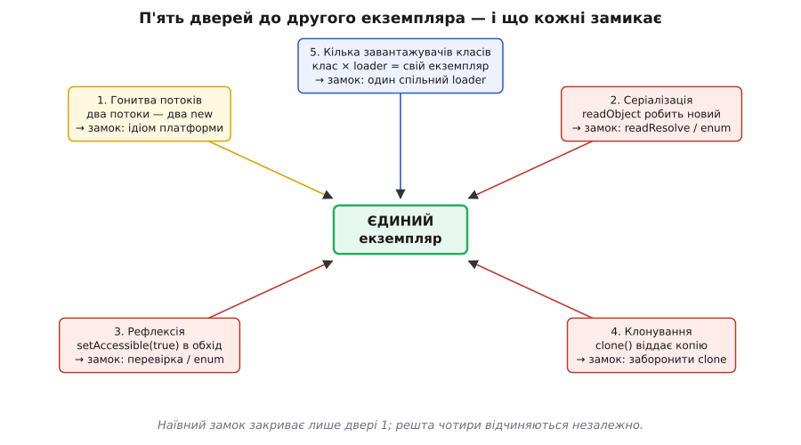

# ⚙️ Потокобезпечний сінглтон: робочі реалізації й граблі кожної

## Задача

«Зроби сінглтон» звучить як робота на п'ять рядків, і в однопотоковій програмі так і є. Але щойно програму торкаються кілька потоків — або серіалізація, або рефлексія, або тестовий фреймворк, що ганяє один клас у сотні прогонів, — той наївний код починає протікати. Об'єктів стає два там, де мав бути один, і кожен такий випадок — окремі граблі з власним корінням.

Мета цього розбору — дати **завершені, компільовані** реалізації потокобезпечного сінглтона для трьох платформ, де він живе найчастіше: Java, C++ і Python. Не заготовки, а код, який можна вставити в проєкт. І, що важливіше за код, — перелік **конкретних дір**, крізь які єдиність тече навіть у, здавалося б, правильній реалізації: серіалізація народжує другий екземпляр, рефлексія викликає приватний конструктор в обхід замку, клонування копіює об'єкт цілком, кілька завантажувачів класів дають по копії на кожен, а стан, що переживає тест, отруює наступний. Для кожної діри — чому вона відкривається й що її закриває.

Наскрізний приклад один: **`Config`** — реєстр налаштувань, прочитаний зі старту раз і на весь час життя програми. Він дорогий на створення (читає файл), тож просто так на кожен виклик його не будують; і він мусить бути один — два конфіги розійшлися б у значеннях, і код у різних кутках програми бачив би різну правду.

## П'ять способів отримати другий екземпляр

Перш ніж лагодити, треба знати, звідки б'є. Наївний захист від багатопотоковості — узгодити перевірку-й-запис — закриває лише **одну** з дір: гонитву двох потоків. Решта чотири не мають до потоків жодного стосунку, і ідіом, що переймається тільки замком, лишає їх усі відчиненими.


*Гонитва потоків — лише одні з п'яти дверей до другого екземпляра; серіалізація, рефлексія, клонування й кілька завантажувачів класів відчиняються незалежно, і кожні треба замикати окремо.*

1. **Гонитва потоків.** Два потоки одночасно бачать порожнє поле й обидва створюють об'єкт. Лікується правильним лінивим ідіомом (класова ініціалізація, `magic statics`, імпорт модуля) — тим, де небезпечний `if` бере на себе платформа.
2. **Серіалізація.** Об'єкт записали в потік байтів і прочитали назад — десеріалізація **завжди будує новий екземпляр**, повз конструктор і повз усі замки. Лікується `readResolve` (Java) або тим, що об'єкт узагалі не роблять серіалізовним.
3. **Рефлексія.** Приватний конструктор — не перепона для рефлексії: `setAccessible(true)`, і його викликають напряму. Народжується другий об'єкт в обхід усього. Лікується перевіркою в конструкторі або enum-ом, чий конструктор рефлексія викликати відмовляється.
4. **Клонування.** Якщо об'єкт випадково клонований (`Cloneable`, конструктор копії), клон — окремий екземпляр. Лікується забороною клонування.
5. **Кілька завантажувачів класів.** Один клас, завантажений двома різними `ClassLoader`-ами, — це для рантайму **два різні класи**, кожен зі своїм статичним полем, отже, зі своїм «єдиним» екземпляром. Лікується контролем над тим, хто вантажить клас.

Далі — реалізації, у кожній з яких видно, які саме з цих дверей вона замикає, а які лишає, і що з рештою робити.

## Java: готова ініціалізація (eager)

Найпростіший потокобезпечний сінглтон у Java — той, що взагалі не лінивий. Статичне поле ініціалізують просто при оголошенні; про потокобезпечність дбає сама JVM.

```java
public final class Config {
    // JVM гарантує: статичне поле ініціалізується рівно раз, під захистом,
    // ще до того, як хтось уперше торкнеться класу
    private static final Config INSTANCE = new Config();

    private final Map<String, String> settings;

    private Config() {                       // приватний — ззовні new не викличеш
        this.settings = loadFromDisk();      // дорога робота, робиться один раз
    }

    public static Config getInstance() {
        return INSTANCE;
    }

    public String get(String key) {
        return settings.get(key);
    }
}
```

**Ідея.** JVM ініціалізує клас рівно перед першим його використанням — і ця ініціалізація за специфікацією проходить під власним замком класу, рівно один раз, навіть якщо в клас одночасно ломляться десять потоків. Поки поле `INSTANCE` присвоюють, усі інші чекають. Тому гонитві (діра 1) тут просто нема де виникнути: на момент, коли перший потік дістане `getInstance()`, поле вже давно заповнене.

**Ціна й межа.** Об'єкт створюється при **першому дотику до класу** — не обов'язково коли ти справді покликав `getInstance()`, а вже коли JVM з якоїсь причини завантажила `Config`. Якщо конфіг дорогий, а програма інколи стартує лише щоб надрукувати версію й вийти, ти заплатив за читання файлу дарма. Коли така плата болить — потрібен лінивий варіант, і в Java найчистіший — не ручний замок, а трюк із класом-тримачем.

## Java: Bill Pugh holder idiom (лінивий через клас-тримач)

Цей ідіом — стандартна відповідь Java на «хочу лінивий сінглтон і не хочу ані замків, ані зламаного `double-checked locking`». Його зазвичай звуть **сінглтоном Білла П'ю** (англ. *Bill Pugh singleton*) або **ідіомом ініціалізації на вимогу через клас-тримач** (англ. *initialization-on-demand holder idiom*) — за іменем Білла П'ю, одного з авторів декларації «Double-Checked Locking is Broken» (2000), що зрештою підштовхнула правки моделі пам'яті Java у версії 5 ([чому голий double-checked locking зламаний](book:programming/singleton/math-double-checked-locking.md)).

```java
public final class Config {
    private final Map<String, String> settings;

    private Config() {
        this.settings = loadFromDisk();      // дорога робота
    }

    // приватний вкладений клас; JVM НЕ вантажить його, поки на нього
    // вперше не пошлються — а це станеться лише в getInstance()
    private static class Holder {
        static final Config INSTANCE = new Config();
    }

    public static Config getInstance() {
        return Holder.INSTANCE;              // ось тут Holder уперше й вантажиться
    }

    public String get(String key) {
        return settings.get(key);
    }
}
```

**Ідея — уся в одному спостереженні.** JVM вантажить клас **ліниво**: не при завантаженні зовнішнього `Config`, а точно тоді, коли на клас уперше по-справжньому пошлються. Поле `Holder.INSTANCE` живе не в `Config`, а у вкладеному `Holder`. Тому просте завантаження `Config` (наприклад, щоб узяти якусь його статичну константу) **не** будує екземпляр — `Holder` спить. Він прокидається лише в рядку `return Holder.INSTANCE`, тобто рівно при першому виклику `getInstance()`. А коли `Holder` вантажиться, JVM ініціалізує його статичне поле під тим самим one-time-замком класу, що й у eager-варіанті.

Виходить лінивість **без жодного власного `if` і без жодного власного замка**: відкладення дає лінива механіка завантаження класів, а потокобезпечність — гарантія «клас ініціалізується рівно раз». Обидві важкі властивості ти отримав задарма, стоячи на плечах платформи.

> 🔧 **Навіщо це.** Тут добре видно загальний прийом, вартий більшого за сам сінглтон: **коли платформа вже дає потрібну гарантію під замком — не будуй свою поверх неї, а перенеси задачу туди, де та гарантія діє**. Лінивість + «рівно раз» — це рівно семантика ініціалізації класу; holder просто ставить наш екземпляр у те місце, щоб успадкувати обидві властивості безплатно. Власноруч написаний `double-checked locking` намагається відтворити те саме — і роками виходив із тонкими багами, бо відтворював неточно.

**Що ця реалізація закриває, а що — ні.** Гонитву (діра 1) — закриває начисто. Але рефлексія, серіалізація й клонування (двері 3, 2, 4) тут так само відчинені, як і в eager-варіанті: приватний конструктор рефлексія все одно викличе, десеріалізація все одно збудує новий об'єкт. Якщо `Config` не серіалізовний і рефлексією в нього ніхто не лізе — цього ідіома досить; коли ж треба стійкість до цих атак, у Java є радикальніша відповідь — enum.

## Java: enum-сінглтон (стійкий до серіалізації й рефлексії)

Джошуа Блох у «Effective Java» (Item 3) називає **одноелементний enum** найкращим способом реалізувати сінглтон — саме тому, що він **єдиний** закриває одразу майже всі двері (гонитву, серіалізацію, рефлексію, клонування) з мінімумом зусиль з нашого боку.

```java
public enum Config {
    INSTANCE;                                // єдина константа = єдиний екземпляр

    private final Map<String, String> settings;

    // конструктор enum викликається JVM рівно раз, потокобезпечно
    Config() {
        this.settings = loadFromDisk();      // дорога робота
    }

    public String get(String key) {
        return settings.get(key);
    }
}

// вживання:  Config.INSTANCE.get("db.host");
```

**Ідея.** Константа enum — це під капотом статичне `final`-поле, яке JVM ініціалізує при завантаженні enum-класу, під тим самим замком «рівно раз». Тобто гонитва (діра 1) закрита тим самим механізмом, що в eager. Але enum дає ще дві речі, яких звичайний клас не дає задарма:

- **Серіалізація (діра 2) вже безпечна.** Java серіалізує enum **особливо**: у потік іде не стан об'єкта, а лише його ім'я (`"INSTANCE"`); при десеріалізації JVM не будує новий об'єкт, а повертає **ту саму** наявну константу через `Enum.valueOf`. Другому екземпляру нема звідки взятися. Жодного `readResolve` писати не треба — це поведінка за замовчуванням.
- **Рефлексія (діра 3) заблокована на рівні мови.** `Constructor.newInstance` явно кидає `IllegalArgumentException` («Cannot reflectively create enum objects»), якщо його наводять на enum. Тобто трюк `setAccessible(true)` + виклик приватного конструктора, що ламає звичайний сінглтон, на enum просто не спрацює.

Клонування (діра 4) теж закрите: enum-и не можна клонувати, `Enum.clone` оголошено `final` і кидає `CloneNotSupportedException`.

**Ціна.** Enum лінивий лише на рівні класу (як eager — створюється при першому дотику до `Config`, не строго при першому `get`), і ти не можеш успадкувати enum від іншого класу (enum уже неявно розширює `java.lang.Enum`). Якщо жодне з цих обмежень не заважає — enum-сінглтон найнадійніший з усіх Java-варіантів: п'ятеро дверей замикаються майже без коду з твого боку. Лишається тільки діра 5 (кілька завантажувачів класів) — але вона не специфічна для сінглтона й лікується не в класі, а в тому, як улаштований загрузник (про неї — нижче).

## C++: сінглтон Меєрса (magic statics)

У C++ ідіоматичний потокобезпечний лінивий сінглтон — **локальна статична змінна функції**. Його звуть **сінглтоном Меєрса** — за Скоттом Меєрсом, який його популяризував; сам механізм часто називають **magic statics** (англ. «чарівні статики»).

```cpp
#include <map>
#include <string>

class Config {
public:
    static Config& instance() {
        static Config inst;   // C++11: ініціалізується рівно раз, потокобезпечно
        return inst;
    }

    // єдиність без заборон нічого не варта: копію й присвоєння — під заборону
    Config(const Config&)            = delete;
    Config& operator=(const Config&) = delete;

    std::string get(const std::string& key) const {
        auto it = settings_.find(key);
        return it != settings_.end() ? it->second : std::string{};
    }

private:
    Config() { settings_ = load_from_disk(); }   // приватний, дорога робота
    std::map<std::string, std::string> settings_;
};

// вживання:  Config::instance().get("db.host");
```

**Ідея.** Локальна статична змінна ініціалізується не при вході в програму, а під час **першого проходу керування через її оголошення** — тобто при першому виклику `instance()`. Це дає лінивість. А від стандарту C++11 (§6.7 [stmt.dcl], п. 4) додано ключову гарантію: **якщо два потоки заходять у це оголошення одночасно, поки змінна ще ініціалізується, другий чекає завершення**. Компілятор ставить прихований однобічний замок (у GCC/Clang — через `__cxa_guard_acquire`/`__cxa_guard_release`); тобі не треба ані `if`, ані `std::mutex`. Гонитва (діра 1) закрита силами компілятора.

> 🔧 **Навіщо це.** До C++11 стандарт мовчав про потоки, і цей ідіом **не був** потокобезпечним — доводилося вручну обкладати ініціалізацію замком або писати той самий крихкий `double-checked locking`. Правки в C++11 (і паралельно в моделі пам'яті Java 5) — це той рідкісний випадок, коли граблі виявилися настільки поширеними й небезпечними, що їх закрили на рівні самої мови. Тому єдина умова коректності тут — **компілятор у режимі C++11 і новіше** (у MSVC це вмикає прапорець `/Zc:threadSafeInit`, увімкнений за замовчуванням від Visual Studio 2015). На старому компіляторі magic statics не «чарівні».

**Граблі, специфічні для C++.** Тут інший набір небезпек, ніж у Java, — серіалізація/рефлексія C++ не турбують, зате з'являються дві свої:

- **Рекурсивний вхід під час ініціалізації — невизначена поведінка.** Якщо конструктор `Config` десь усередині сам покличе `Config::instance()` (напряму чи через ланцюжок), керування вдруге зайде в те саме оголошення, поки перша ініціалізація ще не завершилась. Стандарт це прямо оголошує UB. Не роби так, щоб побудова сінглтона тягла назад до нього ж.
- **Порядок знищення статиків — «фіаско статичного порядку знищення» навпаки.** Локальні статики знищуються у зворотному порядку створення, наприкінці програми. Якщо один сінглтон у своєму деструкторі звертається до іншого, а той уже знищений, — маєш звертання до мертвого об'єкта. Класичний обхід — узагалі **не давати сінглтону деструктора з залежностями**, а якщо об'єкт мусить жити «вічно» — тримати його через `static Config* p = new Config();` і свідомо **не** видаляти (навмисний, керований «витік» на весь час програми — прийнятна ціна за визначеність).

## Python: об'єкт на рівні модуля

У Python найчистіший сінглтон — **не клас із хитрощами, а звичайний об'єкт на рівні модуля**. Річ у тім, що інтерпретатор виконує тіло модуля **рівно один раз** — при першому `import`; усі наступні імпорти дістають той самий уже готовий об'єкт із кешу модулів (`sys.modules`). Ця «рівно раз» — і є вся потрібна нам гарантія.

```python
# config.py — весь файл виконається один раз, при першому import цього модуля

class _Config:
    def __init__(self):
        self._settings = load_from_disk()    # дорога робота, робиться один раз

    def get(self, key):
        return self._settings.get(key)


config = _Config()        # створюється при першому імпорті config.py


# деінде в програмі:
#   from config import config
#   config.get("db.host")
```

**Ідея.** Тобі не потрібні ані приватний конструктор, ані статичне поле, ані замок. Ім'я `config` — модульна змінна; хто б звідки не написав `from config import config`, він отримає той самий об'єкт, бо тіло `config.py` виконалося один-єдиний раз. Клас `_Config` названо з підкресленням лише як знак «не створюй мене напряму» — Python не забороняє це технічно, це домовленість.

**А як же гонитва (діра 1)?** У класичному CPython від неї рятує додатковий засув: імпорт модуля серіалізований **замком імпорту** (англ. *import lock*) — два потоки, що вперше імпортують той самий модуль, не виконають його тіло двічі; другий чекає. Тож `config = _Config()` спрацює рівно раз навіть під потоками.

> 🔧 **Навіщо це.** Тут важливо розуміти **межу** цієї гарантії, бо Python-и бувають різні. Захист спирається на глобальний замок імпорту, і в CPython (з GIL) він надійний. Але не варто плутати його з узгодженням доступу до **стану** об'єкта: замок імпорту гарантує лише, що `_Config()` **збудують один раз**, а не те, що подальші виклики `config.get(...)` та зміни `config._settings` з різних потоків безпечні. Якщо стан сінглтона змінюють у рантаймі кілька потоків — це вже окрема задача синхронізації доступу до полів ([що таке потокова безпека](book:programming/thread-safety)), і модульний трюк її не розв'язує.

**Якщо все ж хочеться класу з `getInstance` — обережно з `__new__`.** Іноді вимагають саме інтерфейс `Config()` → той самий об'єкт. Поширений спосіб — перевизначити `__new__` і кешувати екземпляр у полі класу. Він працює, але потребує **власного замка**, бо тіло `__new__` не серіалізоване замком імпорту:

```python
import threading

class Config:
    _instance = None
    _lock = threading.Lock()

    def __new__(cls):
        if cls._instance is None:            # швидка перевірка без замка
            with cls._lock:                  # у вузьке місце — по одному
                if cls._instance is None:    # друга перевірка вже під замком
                    inst = super().__new__(cls)
                    inst._settings = load_from_disk()
                    cls._instance = inst     # публікуємо ГОТОВИМ, останнім кроком
        return cls._instance
```

Це і є той самий **double-checked locking**, але в Python він, на відміну від наївного Java-варіанта, коректний: присвоєння `cls._instance = inst` атомарне на рівні байткоду (захищене GIL), а сам об'єкт повністю зібрано **до** публікації. Усе ж модульний варіант вище простіший і безпечніший — до `__new__` вдавайся, лише коли інтерфейс `Config()` справді нав'язаний ззовні. І пам'ятай: `__init__` **викликається щоразу** після `__new__`, навіть коли той повернув старий екземпляр, тож дорогу ініціалізацію тримай у `__new__` (як вище), а не в `__init__` — інакше вона перечитуватиме файл на кожен `Config()`.

## Граблі, спільні для всіх: чотири шляхи повз замок

Правильний лінивий ідіом закриває лише **гонитву**. Решта чотири двері відчиняються незалежно від потоків, і про них забувають найчастіше. Розберімо кожні на Java (де вони найгостріші) і скажемо, як стоять справи в C++ і Python.

### Серіалізація створює другий екземпляр

**Задача.** Звичайний Java-сінглтон із приватним конструктором записали в потік (`ObjectOutputStream`) і прочитали назад (`ObjectInputStream`). Десеріалізація **не викликає конструктор** — вона будує об'єкт особливим шляхом і заповнює поля з потоку. Результат: у пам'яті два `Config`-и — старий і щойно прочитаний. Єдиність зламана, хоч жоден потік ні з ким не змагався.

**Ідея лікування — `readResolve`.** Java дає гачок: якщо серіалізовний клас має метод `readResolve()`, движок серіалізації після десеріалізації **замінює** щойно збудований об'єкт на те, що поверне цей метод, а тимчасовий одразу йде на смітник. Повертаємо з нього наявний екземпляр — і другий не виживає:

```java
import java.io.*;
import java.util.Map;

public final class Config implements Serializable {
    private static final Config INSTANCE = new Config();

    // ВАЖЛИВО: усі поля-посилання — transient (пояснення нижче)
    private transient Map<String, String> settings;

    private Config() { this.settings = loadFromDisk(); }

    public static Config getInstance() { return INSTANCE; }

    // движок серіалізації викличе це замість того, щоб віддати новий об'єкт
    private Object readResolve() throws ObjectStreamException {
        return INSTANCE;               // тимчасовий десеріалізований об'єкт викидається
    }
}
```

**Тонкі граблі всередині лікування.** Мало написати `readResolve` — треба ще позначити **всі поля-посилання** словом `transient`, і це не косметика. Якщо поле не `transient`, його вміст десеріалізується **раніше**, ніж запуститься `readResolve`. Зловмисно зібраний потік може в цей проміжок «викрасти» посилання на тимчасовий об'єкт — і в програмі опиниться живий другий екземпляр повз усю нашу оборону (це задокументована атака, MSC07-J у стандарті CERT). Тому: серіалізовний сінглтон + `readResolve` + `transient` на всіх посиланнях — три частини одного замка, поодинці кожна дірява.

**А в C++ і Python?** У C++ серіалізація не вбудована в мову — об'єкти самі себе в потік не пишуть, тож цієї діри немає, поки ти сам не напишеш серіалізатор (і тоді сам відповідаєш за відновлення єдиності). У Python `pickle` цю проблему теж має, але й дає прямий гачок: метод `__reduce__`, що повертає спосіб «відтворити» об'єкт — для сінглтона можна повернути функцію, яка віддає наявний `config`, а не будує новий. Модульний варіант зазвичай і не пікрять — пікрять посилання на модуль-рівневе ім'я, і воно резолвиться в той самий об'єкт.

### Рефлексія викликає приватний конструктор

**Задача.** Приватний конструктор здається неприступним, але рефлексія обходить модифікатори доступу:

```java
Constructor<Config> c = Config.class.getDeclaredConstructor();
c.setAccessible(true);          // «відкриваю» приватний конструктор
Config second = c.newInstance();  // збудували другий екземпляр повз getInstance()
```

Один рядок `setAccessible(true)` — і замок на конструкторі більше не замок. Тепер `second != Config.getInstance()`.

**Лікування — конструктор, що сам себе стереже.** Змусимо конструктор кидати виняток, якщо екземпляр уже є:

```java
private Config() {
    if (INSTANCE != null) {     // хтось уже нас створив — другого не дамо
        throw new IllegalStateException("Config уже існує; користуйся getInstance()");
    }
    this.settings = loadFromDisk();
}
```

Це працює, але має власну ваду: захист залежить від **порядку** — спрацює лише якщо легальний `INSTANCE` створився **раніше**, ніж рефлексійна атака. І взагалі ця гонитва озброєнь (додай перевірку — атакувальник скине поле рефлексією) виграється чистіше одним ходом: **enum-сінглтоном**, чий конструктор рефлексія викликати відмовляється на рівні JVM (див. вище). Саме нездоланність рефлексії й серіалізації для звичайного класу — головний аргумент Блоха на користь enum.

**А в C++ і Python?** У C++ немає рефлексії, що обходила б приватність, — приватний конструктор надійно приватний, цієї діри немає взагалі. У Python приватності теж немає в тому сенсі: підкреслення — домовленість, і будь-хто може викликати `_Config()` напряму. Захист той самий, що в Java: перевірка в `__new__`/`__init__` або, найпростіше, модульний об'єкт плюс дисципліна «клас із підкресленням не чіпають».

### Клонування копіює об'єкт цілком

**Задача.** Якщо сінглтон випадково реалізує `Cloneable`, виклик `clone()` віддасть **новий** об'єкт — точну копію, але окремий екземпляр. Часто це успадковують ненавмисно.

**Лікування** — заборонити клонування явно:

```java
@Override
protected Object clone() throws CloneNotSupportedException {
    throw new CloneNotSupportedException("Config не клонується");
    // або, якщо клон конче потрібен «як посилання»: return getInstance();
}
```

У C++ ту саму роль грає `= delete` на конструкторі копії й операторі присвоєння (він уже стоїть у прикладі Меєрса вище) — без нього `Config a = Config::instance();` тихо зробив би копію, і єдиність злетіла б непомітно. У Python `copy.copy`/`copy.deepcopy` теж можуть зробити копію; щоб цьому запобігти, визначають `__copy__`/`__deepcopy__`, що повертають `self`.

### Кілька завантажувачів класів — по екземпляру на кожен

**Задача — найпідступніша, бо код увесь правильний.** У Java «клас» — це не просто його ім'я, а пара **(ім'я + завантажувач)**. Один і той самий `Config.class`, завантажений двома різними `ClassLoader`-ами (типово в серверах застосунків, плагінних системах, OSGi), — це для JVM **два різні класи**, кожен зі своїм статичним полем `INSTANCE`. Отже, два «єдиних» екземпляри, і жоден замок, жоден enum, жоден `readResolve` тут не зарадить — проблема поза класом.

**Лікування — не в самому сінглтоні, а в тому, хто його вантажить.** Треба забезпечити, щоб `Config` вантажив **один спільний** завантажувач для всіх, хто ним користується (наприклад, підняти клас у батьківський, спільний загрузник згідно з делегаційною моделлю). Це вже питання архітектури розгортання, а не рядка коду в класі. Практичний висновок простий: **у середовищі з кількома завантажувачами класів «глобальна єдиність» перестає бути глобальною** — вона єдина лише в межах одного завантажувача, і на це треба свідомо зважати, вибираючи сінглтон.

У C++ прямого аналога немає (немає завантажувачів класів), але споріднена пастка є: та сама глобальна статика, **вкомпільована у дві різні динамічні бібліотеки** (`.dll`/`.so`), може існувати у двох копіях, якщо символ не спільний. У Python — якщо той самий файл модуля імпортовано під **двома різними іменами** (скажімо, `config` і `pkg.config` через плутанину в шляхах), інтерпретатор виконає його **двічі** й покладе два записи в `sys.modules`, а отже, два об'єкти `config`. Ліки скрізь однакові за духом: один канонічний шлях завантаження — один екземпляр.

## Отруєний стан у тестах

Остання діра не про кількість екземплярів, а про **час їхнього життя**, і б'є вона не в продакшн, а в тести — тому й найпідступніша: код здається справним, а червоніє тестовий прогін.

**Задача.** Сінглтон живе, поки живе програма (чи, у Java, поки завантажений його клас). Тестовий фреймворк ганяє **сотні тестів в одному процесі**, і всі вони бачать **той самий** статичний екземпляр. Тест A щось у ньому наставив і не прибрав — тест B дістає забруднений `Config` і падає. Або, ще підступніше, проходить лише в певному **порядку** запуску, а варто фреймворку перемішати тести — і все розсипається. Тести мали бути незалежні; спільний живучий стан цю незалежність нищить.

**Чому це кара за сам патерн.** Тут видно, що отруєний стан у тестах — не окрема дрібниця, а **прямий наслідок** того, що сінглтон зашиває доступ намертво: підставити свіжий `Config` на кожен тест нема куди, точки підміни немає (та сама «отруєна тестованість», через яку патерн і лають). Тому найчесніша відповідь — **не сінглтон**: зробити `Config` звичайним об'єктом і передавати його через конструктор ([впровадження залежностей](book:programming/dependency-injection)); тоді кожен тест створює свій, ізольований, і діра зникає сама.

**Якщо сінглтон уже вкоренився й переписати важко** — доводиться робити скидання руками, і кожен спосіб має свою ціну:

```java
// у сінглтоні з'являється «чорний хід» лише для тестів
static void resetForTests() {
    INSTANCE = null;        // отже, INSTANCE НЕ може бути final — уже поступка
}
```

Це працює, але тхне: поле більше не `final`, у публічний клас просочився метод, потрібний лише тестам, а якщо тести йдуть **паралельно** — скидання одного зіпсує сусідній, що біжить поруч. Кращі за це два підходи. Перший — **не тримати стан у самому сінглтоні**, а зробити його тонким тримачем змінного нутра, яке тест підмінює цілком (`Config.setBackend(fakeBackend)`). Другий, і найнадійніший, — розв'язати проблему в **корені**: більшість тестових болів сінглтона зникає, коли залежність передають ззовні, а не дістають глобально; тоді ізоляцію тестів забезпечує сама конструкція, без жодних `reset`-милиць.

У C++ і Python картина та сама: `Config::instance()` і модульний `config` так само переживають окремий тест і несуть стан далі. У Python ситуацію інколи рятує те, що тестові раннери вміють **перезавантажувати модулі** між прогонами (`importlib.reload`) — але спиратися на це крихко; надійніше й тут — впровадження залежностей замість глобального доступу.

## Підсумок: що замикає які двері

Звести все докупи допомагає одна думка: **різні реалізації закривають різні підмножини п'яти дверей**, і «найкраща» залежить від того, які двері тобі загрожують.

- **Java, eager або Bill Pugh holder** — закривають гонитву; проти рефлексії/серіалізації/клонування безсилі. Досить, коли сінглтон не серіалізують і рефлексією в нього не лізуть (переважна більшість випадків). Holder бери, коли ініціалізація дорога й лінивість цінна; eager — коли об'єкт однаково завжди потрібен.
- **Java, enum** — закриває гонитву, серіалізацію, рефлексію й клонування майже без коду. Бери, коли потрібна стійкість до цих атак і не заважають обмеження enum (лінивість лише на рівні класу, немає успадкування).
- **C++, сінглтон Меєрса** — закриває гонитву (від C++11) і, з `= delete`, клонування; серіалізації/рефлексії в мові немає, тож ті двері відсутні. Пильнуй рекурсивну ініціалізацію (UB) і порядок знищення статиків.
- **Python, модульний об'єкт** — закриває гонитву (замком імпорту) найпростішим кодом; приватності немає, тож захист від «ручного» другого екземпляра — дисципліна, а не мова. `__new__` із замком — лише коли інтерфейс `Config()` нав'язаний ззовні.
- **Кілька завантажувачів класів (діра 5)** і **отруєний стан у тестах** — не лікуються **всередині** класу жодною з реалізацій: перше — питання архітектури завантаження, друге — привід узагалі відмовитися від сінглтона на користь передавання залежності явно.

І звідси — головне практичне правило цього розбору. Перш ніж шліфувати потокобезпечну реалізацію, спитай, чи потрібен тобі саме сінглтон, а не просто **один екземпляр, який передають руками**. Якщо доступ-звідусіль не обов'язковий (а він майже завжди не обов'язковий) — бери єдиний об'єкт плюс [впровадження залежностей](book:programming/dependency-injection): і жодна з п'яти дверей, і тестова діра просто перестають існувати, бо зникає те, що їх відчиняло. Уся ця обойма замків потрібна лише тоді, коли глобальна точка доступу справді нав'язана — а таких випадків набагато менше, ніж коду, який їх припускає.
