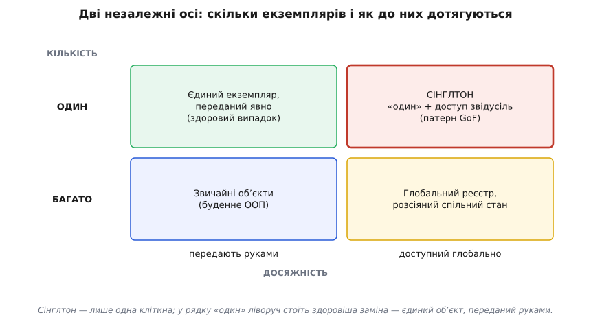
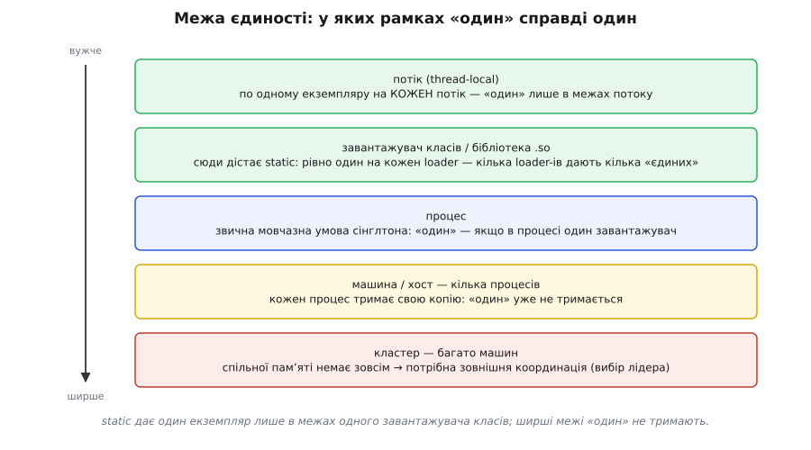
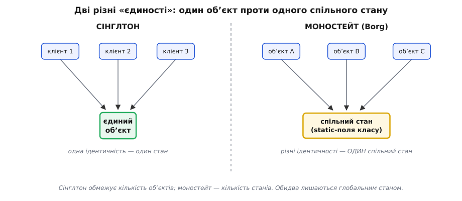
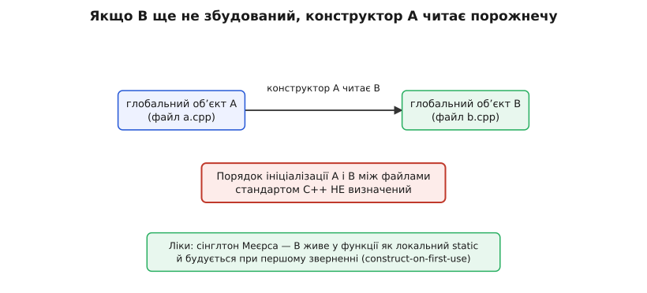

# Сінглтон

<preknowlist>
- [Що таке патерн](topic:programming/what-is-pattern) — патерн проєктування як названий типовий розв'язок повторюваної задачі дизайну, а не готовий шматок коду.
- [Глобальний стан](topic:programming/global-state) — дані, доступні звідусіль, і чому такий доступ ускладнює розуміння, зміну й тестування програми.
- [Інкапсуляція](topic:programming/encapsulation) — як клас ховає нутро за конструктором і методами й керує тим, кого впускати всередину.
- [Впровадження залежностей](topic:programming/dependency-injection) — коли об'єкт отримує потрібне ззовні (через конструктор), а не добуває сам; головна альтернатива сінглтону.
- [Інверсія залежностей](topic:programming/dependency-inversion) — залежності мають приходити ззовні й від абстракцій, а не братися жорстко зсередини.
- [Потокова безпека](topic:programming/thread-safety) — що стається, коли кілька потоків торкаються одних даних одночасно, і звідки береться гонитва.
</preknowlist>

Сінглтон (англ. *single* — єдиний; від латинського *singulus* — одиничний) описують одним реченням: **клас, що має найбільше один екземпляр і дає до нього спільну точку доступу**. Це найвідоміший із двадцяти трьох патернів «банди чотирьох» — і водночас чи не єдиний, від якого один із самих авторів згодом привселюдно відмовився ([як народився сінглтон і чому Еріх Ґамма хотів його викреслити](topic:programming/singleton/hist-singleton-gof.md)). Написати його вміє кожен: приватний конструктор, статичне поле, статичний метод — п'ять рядків.

Саме тому легко проґавити, що ці п'ять рядків тягнуть за собою значно більше, ніж видно. Клопіт сінглтона живе не в коді, а в тому, що́ патерн мовчки склеює в одне й що мовчки припускає. Тому розберемо його не як рецепт, який треба скопіювати, а як точку в просторі рішень: розчепимо дві речі, які він зліплює докупи; спитаємо, що взагалі означає «один» і відносно чого; поставимо його поряд із сусідами, яких з ним постійно плутають; простежимо єдиний об'єкт від народження до смерті; і розплутаємо парадокс, через який те саме слово «сінглтон» називає і антипатерн, і цілком здорову можливість будь-якого серйозного застосунку.

## Дві осі, а не одна відповідальність

Придивімося до означення уважно, бо в ньому зшито **дві незалежні речі**, і майже вся біда патерна саме з цього шва.

Перше — про **кількість**: екземпляр рівно один. Це питання життєвого циклу: хто, коли й скільки разів створює об'єкт. Другe — про **досяжність**: до цього одного можна дотягтися звідусіль, з будь-якого місця коду, без того, щоб хтось тобі його передав. Це вже питання видимості. І ключове спостереження: **ці дві осі ортогональні** — між ними немає жодного логічного зв'язку. Можна мати єдиний об'єкт, який акуратно передають з рук у руки й ніхто не дістає його глобально. Можна мати глобально досяжну річ, якої в пам'яті існує сотня. «Один» і «звідусіль» — не одне поняття у двох словах, а два різні поняття, які сінглтон випадково зв'язав.

Щойно ми бачимо дві осі, простір рішень розкладається на чотири клітини, і сінглтон виявляється лише однією з них.


*Кардинальність (один / багато) і досяжність (передають руками / глобально) незалежні; сінглтон — це саме «один + звідусіль», а його здоровіший сусід у тому ж рядку — «один, але переданий явно».*

Пройдімо клітини. **Багато + передають руками** — це буденне об'єктноорієнтоване програмування: створюєш об'єкти, скільки треба, і роздаєш їх тим, кому вони потрібні. Нічого особливого. **Один + передають руками** — теж цілком звичне: є рівно один об'єкт, але його **явно передають** тим, хто ним користується, найчастіше через конструктор. Це і є [впровадження залежностей](topic:programming/dependency-injection) з єдиним екземпляром — і саме сюди веде більшість чесних відповідей на «мені потрібен один». **Багато + глобально** — рідкісний і зазвичай хворий стан: глобально досяжна купа змінних або розсіяний спільний стан, куди пише хто завгодно. І нарешті **один + глобально** — оце й є сінглтон.

Важить не сама табличка, а те, що вона показує пальцем: **сінглтон нав'язує обидві осі одразу, хоча майже завжди потрібна лише одна з них — «один»**. А «один» чудово живе й у сусідній клітині, без глобального доступу. Друга ось, «звідусіль», приходить у комплекті непроханою — і саме вона приносить основну шкоду. За [принципом інверсії залежностей](topic:programming/dependency-inversion) те, що об'єктові потрібне, має приходити ззовні; сінглтон робить навпаки — навчає об'єкт мовчки лізти по потрібне самому.

Порівняймо два способи дати класу годинник — джерело поточного часу. Це класична перевірка на «звідусіль», бо час усередині логіки хочеться підмінити в тесті на застиглий:

:::tabs
```ts
// «один + глобально»: логіка сама лізе по глобальний годинник
class SystemClock {
  private static inst: SystemClock | null = null;
  static instance(): SystemClock {
    return (SystemClock.inst ??= new SystemClock());
  }
  now(): Date { return new Date(); }
}

class SubscriptionService {
  renew(sub: Subscription) {
    const now = SystemClock.instance().now();   // прихована залежність від часу
    if (now > sub.expiresAt) sub.markExpired();
  }
}

// «один + передають руками»: годинник приходить явно, його видно в конструкторі
interface Clock { now(): Date; }

class SubscriptionService2 {
  constructor(private clock: Clock) {}          // залежність на видноті
  renew(sub: Subscription) {
    if (this.clock.now() > sub.expiresAt) sub.markExpired();
  }
}
// у тесті:  new SubscriptionService2({ now: () => new Date("2030-01-01") })
```
```go
// «один + глобально»: пакетна функція time.Now() — теж глобальний доступ
func (s *SubscriptionService) Renew(sub *Subscription) {
    if time.Now().After(sub.ExpiresAt) {        // прихована залежність від часу
        sub.MarkExpired()
    }
}

// «один + передають руками»: годинник — це інтерфейс, який дають ззовні
type Clock interface{ Now() time.Time }

type SubscriptionService2 struct{ clock Clock }

func (s *SubscriptionService2) Renew(sub *Subscription) {
    if s.clock.Now().After(sub.ExpiresAt) {     // залежність на видноті
        sub.MarkExpired()
    }
}
// у тесті передають застиглий годинник, що завжди повертає 2030-01-01
```
:::

В обох варіантах справжній годинник у програмі, найпевніше, **один**. Різниця лише по осі досяжності — і саме вона вирішує все: у першому випадку `SubscriptionService` неможливо перевірити на конкретній даті, бо час зашитий намертво; у другому тест просто передає інший `Clock`. Ми забрали «звідусіль» і лишили «один» — рівно те, що було потрібно.

> 🔧 **Навіщо це.** Ця дводольність — не гра в терміни, а робочий чек-ліст. Коли ловиш себе на думці «тут потрібен сінглтон», розклади її на дві окремі: *чи справді екземпляр має бути один?* і *чи справді до нього треба дотягуватися з будь-якого місця, оминаючи передавання?* Майже завжди перша відповідь «так», а друга «ні» — і тоді правильний інструмент не сінглтон, а єдиний об'єкт, який передають явно. Друга ось — це і є [глобальний стан](topic:programming/global-state) з усіма його гріхами, лише причепурений методом `instance()`.

## «Один» — відносно чого?

Тепер копнімо саме слово «один», бо воно приховує пастку, про яку не думають, поки вона не спрацює: **«один» безглузде без межі, у якій його рахують**. Один — на що? На потік? На процес? На фізичну машину? На весь розподілений застосунок з десятків машин? Це різні відповіді, і сінглтон мовчки припускає одну з них, ніде цього не проголошуючи.

Щоб побачити межу чітко, згадаймо, чим сінглтон технічно тримає свою єдиність — **статичним полем**. А статичне поле досяжне не «глобально у Всесвіті», а рівно в межах того середовища, що завантажило клас. У Java клас — це насправді пара **(ім'я + завантажувач класів)**: той самий `Config.class`, піднятий двома різними завантажувачами (типово в серверах застосунків, плагінних системах, OSGi), — це для рантайму **два різні класи**, кожен зі своїм статичним полем, отже, зі своїм «єдиним» екземпляром. У C++ споріднена межа — модуль компонування: та сама глобальна статика, вкомпільована у дві динамічні бібліотеки (`.so`/`.dll`), може існувати у двох копіях, якщо символ не спільний. Тобто «один» уже на рівні одного процесу не гарантований — він гарантований лише в межах одного завантажувача.

Викладімо всі межі поспіль, від найвужчої до найширшої, і подивімося, де «один» ще тримається, а де тихо стає «багато».


*Що ширша межа, то менше «один» відповідає дійсності: у межах потоку чи завантажувача він справжній, на рівні машини з кількома процесами розпадається, а на кластері зникає зовсім.*

- **Потік.** Якщо покласти екземпляр у thread-local сховище, вийде по одному об'єкту **на кожен потік** — це теж «сінглтон», але з межею вужчою за процес. Іноді саме це й треба (наприклад, окремий контекст на кожен робочий потік), і тоді «один на потік» — не помилка, а свідомий вибір межі.
- **Завантажувач класів / бібліотека.** Сюди статичне поле дістає **насправді**: рівно один екземпляр на кожен завантажувач. Один завантажувач — один об'єкт; кілька — кілька «єдиних», і жоден замок цьому не зарадить, бо проблема поза класом.
- **Процес.** Оце й є та мовчазна умова, яку припускає майже кожен, хто пише `getInstance()`: «один на весь процес». Вона істинна **лише якщо** в процесі один завантажувач вантажить цей клас — що в простих застосунках так, а в модульних середовищах уже ні.
- **Машина з кількома процесами.** Запусти той самий сервіс двома процесами (типова горизонтальна масштабованість навіть на одному хості) — і кожен процес тримає **свою** копію сінглтона. Лічильник, що мав видавати наскрізні номери, у двох процесах видасть однакові; кеш, що мав бути один, розійдеться. «Один» тут уже неправда.
- **Кластер.** На багатьох машинах спільної пам'яті немає **зовсім**. Внутрішньопроцесний сінглтон тут не значить нічого: якщо тобі потрібен справді єдиний на весь застосунок ресурс (єдиний планувальник, що не має запуститися двічі; єдиний власник блокування), його не зробити статичним полем — потрібна **зовнішня координація**: розподілене блокування або [вибір лідера](topic:programming/leader-election), де вузли домовляються, хто з них зараз «той самий один».

> 🔧 **Навіщо це.** Це не академічна прискіпливість — на цій межі ламаються реальні системи. Класична історія: код роками працює з «єдиним» кешем, бо крутиться в одному процесі; застосунок масштабують на кілька екземплярів заради навантаження — і раптом кеші розходяться, бо кожен процес має свій сінглтон, який усі мовчки вважали спільним. Помилка не в коді сінглтона — вона в тому, що ніхто не записав, у **якій межі** діє його «один», і межу тихо перетнули. Тому, ставлячи сінглтон, назви межу вголос: один — на що саме? І якщо відповідь «на весь застосунок», а застосунок розподілений, — це вже не сінглтон, а задача координації.

## Сусіди, яких плутають із сінглтоном

Навколо сінглтона живе кілька схожих конструкцій, які постійно з ним змішують. Розрізняти їх варто, бо кожна по-своєму відповідає на «щось одне», і плутанина веде до вибору не того інструмента.

**Статичний клас-утиліта.** Найпростіший сусід — клас, у якому взагалі немає екземплярів, лише статичні методи: `Math.max`, `StringUtils.trim`. Його теж іноді називають «сінглтоном», але це помилка: сінглтон — це **об'єкт** (є `this`, є стан, він може реалізовувати інтерфейс і бути підставленим замість іншого), а статичний клас — це просто **іменований простір функцій**, без об'єкта взагалі. Для **безстанових** чистих функцій статичний клас чудовий: підставляти нема чого, стану нема, тестувати нема що ховати. Але щойно з'являється стан або потреба підмінити реалізацію (в тесті чи заради іншого варіанта поведінки), статичний клас стає гіршим за сінглтон: він не має інтерфейсу, його не передати як залежність, не підмінити поліморфно. Правило просте: **немає стану й немає потреби в підміні — статичні функції; є стан або потрібна підміна — об'єкт** (і, найпевніше, переданий, а не глобальний).

**Моностейт (Borg).** А ось цей сусід по-справжньому цікавий, бо він перевертає сінглтон навиворіт. Сінглтон обмежує **ідентичність**: один об'єкт, одне `this`. Моностейт (англ. *monostate* — одностановий; від грецького *mónos* — єдиний) обмежує натомість **стан**: об'єктів можна наробити скільки завгодно, але весь їхній стан лежить у статичних полях, тож усі екземпляри — насправді той самий об'єкт, просто в різних обгортках. Ідею описали Стів Болл і Джон Кроуфорд у статті «Monostate Classes: The Power of One» (журнал *C++ Report*, 1997; передрук у збірці «More C++ Gems» за редакцією Роберта Мартіна, 2000); у світі Python ту саму ідею знають як **Borg** — ідіому, яку запропонував Алекс Мартеллі (назву «Borg», за колективним розумом із «Стар Треку», підказав Девід Ашер). *(Статус: авторство й джерела підтверджені.)*


*Сінглтон робить одну ідентичність зі спільним станом; моностейт — багато ідентичностей з тим самим спільним станом. Зовні перший — один об'єкт, другий — багато, але «правда» в них одна.*

:::tabs
```py
class Borg:
    _shared = {}                       # один словник на весь клас
    def __init__(self):
        self.__dict__ = Borg._shared   # усі екземпляри ділять один і той самий __dict__

class Settings(Borg):
    def __init__(self):
        super().__init__()
        if not hasattr(self, "theme"):
            self.theme = "light"       # ініціалізуємо лише вперше

a = Settings(); b = Settings()
a.theme = "dark"
print(b.theme)        # "dark" — хоча b створювали окремо: стан у них спільний
print(a is b)         # False — це РІЗНІ об'єкти з однаковим станом
```
```ts
class Settings {
  private static shared = { theme: "light" };  // один об'єкт-стан на весь клас
  get theme() { return Settings.shared.theme; }
  set theme(v: string) { Settings.shared.theme = v; }
}

const a = new Settings(), b = new Settings();
a.theme = "dark";
console.log(b.theme);   // "dark" — стан спільний
console.log(a === b);   // false — об'єкти різні
```
:::

Навіщо взагалі така вивернута конструкція? Її принада — в тому, що моностейт **виглядає як звичайний клас**: його створюють через звичайне `new`, він може мати підкласи, його передають як звичайний об'єкт. Немає незручного `getInstance()`, немає приватного конструктора. Тому код, що ним користується, не знає й не мусить знати, що за лаштунками стан спільний. Але тут-таки й криється його вада, ще підступніша за сінглтонову: **спільність стану невидима на місці вжитку**. Коли пишеш `Config.getInstance()`, ти принаймні бачиш слово «instance» і здогадуєшся про глобальність; а коли пишеш звичайне `new Settings()` і несподівано отримуєш чужі зміни — здивування повне. Моностейт лишається тим самим [глобальним станом](topic:programming/global-state), лише краще замаскованим, тож усі його тестові й зв'язковані болі нікуди не діваються — просто їх важче помітити.

**Мультитон (реєстр).** Третій сусід — природне узагальнення сінглтона: не «рівно один об'єкт», а «рівно один об'єкт **на кожен ключ**». Один пул з'єднань **на кожну базу даних**, один логер **на кожен модуль**, один кеш **на кожну область**. Це мультитон (англ. *multiton*, за аналогією до singleton), він же реєстр: усередині — словник, що на перший запит під ключем будує об'єкт, а на всі наступні під тим самим ключем віддає той самий. Сінглтон — окремий випадок мультитона з одним-єдиним ключем. Розібратися варто окремо, бо реєстр і замикає ту саму дірку тестованості, коли його самого **передають як залежність** замість того, щоб дотягуватися до нього глобально; робочі потокобезпечні реалізації, ідіома «get-or-create» під ключем та її пастки — у [проєкті мультитона й реєстру](topic:programming/singleton/proj-multiton-registry.md).

## Життя й смерть єдиного об'єкта

Сінглтон живе довше за майже будь-який інший об'єкт у програмі — типово від першого звертання до кінця процесу. Такий довгий вік означає, що в нього є повноцінна біографія з двома складними кінцями: **як він народжується** і **як помирає**. Обидва кінці ховають пастки, яких у звичайного, короткоживучого об'єкта просто немає.

**Народження: коли платити.** Перший вибір — будувати екземпляр одразу, на старті (готова, англ. *eager*, ініціалізація), чи відкласти до першого звертання (лінива, англ. *lazy*). Різницю легко змусити звучати як дрібницю, але за нею стоїть конкретна ціна, яку можна виписати:

```
готова:  ціна = C_будови                       (платимо ЗАВЖДИ, на старті)
лінива:  ціна = p · C_будови + N · C_перевірки  (платимо, лише якщо знадобиться)
             p — імовірність, що об'єкт узагалі знадобиться в цьому запуску (0…1)
             N — скільки разів гарячий шлях звертається по об'єкт
             C_перевірки — вартість перевірки «чи вже створено» на кожному звертанні
```

Готова ініціалізація платить `C_будови` беззастережно — навіть у запуску, де об'єкт не знадобиться (згадай `--version`, що друкує рядок і виходить). Лінива платить `C_будови`, лише коли `p` спрацював, зате додає дрібний податок `N · C_перевірки` на кожне читання. І ось де сучасність усе спрощує: **правильні ліниві ідіоми платформи роблять `C_перевірки` нульовим**. Коли лінивість дає механіка завантаження класу (клас-тримач у Java) чи локальна статична змінна (magic statics у C++), у рантаймі немає жодного власного `if` — перевірку робить середовище раз і назавжди. Тоді лінива ціна стискається до `p · C_будови`, і вона **строго не більша** за готову `C_будови` при будь-якому `p ≤ 1`. Висновок несподівано чіткий: якщо платформа дає безкоштовну лінивість, лінивий варіант програє готовому хіба тоді, коли ти **свідомо хочеш** заплатити рано — щоб дорога ініціалізація впала на старті (fail-fast), а не посеред першого запиту користувача. Механіку цих потокобезпечних ідіом і те, чому саморобна «оптимізація» з подвійною перевіркою натомість буває зламана, розібрано в [блокуванні з подвійною перевіркою](topic:programming/singleton/math-double-checked-locking.md).

Але з лінивістю приходить пастка, специфічна для мов з окремими одиницями компіляції, — **фіаско порядку статичної ініціалізації** (англ. *static initialization order fiasco*). Вона класична для C++ і варта окремого погляду, бо показує, чому construct-on-first-use — не примха стилю, а ліки.


*Якщо B ще не збудований у мить, коли конструктор A до нього звертається, A прочитає порожнечу; ліки — сховати B у функцію з локальним static, що будує його рівно при першому зверненні.*

Уяви два глобальні об'єкти в різних файлах: `Logger` у `log.cpp` і `Config` у `config.cpp`, і `Logger` у своєму конструкторі читає `Config`. Стандарт C++ гарантує порядок ініціалізації глобальних об'єктів **у межах одного файлу**, але **між файлами** — не визначає. Тобто цілком можливо, що середовище почне будувати `Logger` раніше, ніж `Config`, і конструктор `Logger` звернеться до ще не збудованого `Config` — прочитає сміття або впаде. Найгидкіше, що це залежить від порядку компонування й може роками не проявлятися, а потім зламатися від невинної переміни в збірці.

Ліки — саме **construct-on-first-use**: не робити `Config` глобальним об'єктом, а сховати його в функцію з локальною статичною змінною, яка будується рівно тоді, коли до неї вперше звернуться:

```cpp
// замість глобального Config config; — функція, що будує його ліниво
Config& config() {
    static Config instance;   // збудується при ПЕРШОМУ виклику config(),
    return instance;          // а не в невизначений момент старту
}

// тепер конструктор Logger безпечно кличе config():
Logger::Logger() {
    auto host = config().get("log.host");   // config() гарантовано вже збудований
}
```

Тепер `Config` не існує «десь на старті в невизначену мить» — він народжується точно в перший момент, коли справді знадобився, тож будь-який його користувач гарантовано дістає вже готовий об'єкт. Це і є той самий «сінглтон Меєрса»; від C++11 така локальна статика ще й ініціалізується потокобезпечно. Один прийом закриває дві проблеми одразу — і невизначений порядок, і гонитву потоків.

**Смерть: коли й у якому порядку руйнувати.** Народженням клопіт не закінчується. Об'єкти з локальних статик знищуються наприкінці програми у **зворотному** порядку створення — і тут фіаско повертається дзеркально. Якщо один сінглтон у деструкторі звертається до іншого, а той уже знищений, маємо звертання до мертвого об'єкта. Практика виробила кілька відповідей, і кожна — свідомий компроміс:

- **Свідомий «витік» на весь час програми.** Найпростіше — не давати сінглтону складного деструктора взагалі: тримати його через `static Config* p = new Config();` і навмисно **не** видаляти. Пам'ять повертає операційна система при завершенні процесу; єдина ціна — деструктор не викликається (не скинуться буфери, не закриються з'єднання «красиво»). Для об'єкта, що й так живе весь час програми, це часто прийнятно.
- **Керування тривалістю життя політиками.** Андрій Александреску в «Modern C++ Design» (2001) показав, що тривалість життя сінглтона можна винести в окрему **політику** й вибирати незалежно від решти. Його бібліотека Loki дає `SingletonHolder` із набором політик життя: `DefaultLifetime` (як звичайний глобальний об'єкт), `NoDestroy` (взагалі не руйнувати — той самий свідомий витік), `SingletonWithLongevity` (задати «довговічність», щоб керувати відносним порядком знищення кількох сінглтонів) і найцікавіша — `PhoenixSingleton`. *(Статус: назви й склад політик Loki підтверджені.)*
- **Фенікс.** Політика «фенікс» (англ. *phoenix* — птах, що відроджується з попелу) розв'язує найгостріший випадок: сінглтон знищили при завершенні програми, а потім хтось — наприклад, деструктор іншого статичного об'єкта — знову до нього звернувся. Замість звертання до мертвого об'єкта фенікс **відроджує** екземпляр наново, на тій самій адресі, і той доживає до справжнього кінця процесу. Це радше латка на фундаментальну незручність, ніж елегантність, — але вона показує, наскільки нетривіальним стає навіть «просто один об'єкт», коли він мусить пережити впорядковане руйнування всієї програми.

Ця морока зі смертю — ще один тихий аргумент проти сінглтона там, де він не конче потрібен: об'єкт, який хтось **тримає й передає** явно, має природний, зрозумілий час життя (живе, поки на нього є посилання), тоді як глобальний сінглтон нав'язує собі найдовший і найзаплутаніший життєвий цикл із можливих.

## Той самий «сінглтон», що не патерн: контейнерна область

Тут постає питання, яке щиро бентежить кожного, хто прочитав, що сінглтон — «запах поганого дизайну»: **чому ж тоді реальні застосунки буквально напхані сінглтонами, і досвідчені команди цим задоволені?** Візьми будь-який великий бекенд на Spring, .NET чи Guice — там десятки, сотні «сінглтонів»: один репозиторій, один сервіс, один клієнт до бази, усі в єдиному екземплярі. Якщо патерн такий шкідливий, чому індустрія на ньому стоїть?

Відповідь у тому, що слово «сінглтон» тут означає **зовсім інше**, і плутанина суто термінологічна. Коли контейнер впровадження залежностей каже «цей компонент — сінглтон», він має на увазі лише **область життя** (англ. *scope*): «створи рівно один екземпляр і той самий підставляй усім, хто його попросить». Це чиста ось кардинальності — «один» — **без** осі досяжності. Компонент не має ні приватного конструктора, ні статичного `getInstance()`; він отримує свої залежності через звичайний конструктор і сам роздається іншим так само — через конструктор. Хто дає йому єдиність — не він сам, а **контейнер**, який збирає застосунок докупи.

Порівняй із патерном-сінглтоном по клітинах нашої матриці. Патерн GoF — це «один + глобально»: клас **сам** стежить за єдиністю й **сам** роздає себе через статичний метод. Контейнерний сінглтон — це «один + передають руками»: єдиність забезпечує зовнішній складач, а до компонента дотягуються не глобально, а через явно оголошену залежність. Це **різні клітини матриці**, хоч і звуться одним словом.

```csharp
// .NET: реєструємо ОДИН екземпляр на весь контейнер — це «singleton scope»
services.AddSingleton<IClock, SystemClock>();
services.AddSingleton<ISubscriptionRepository, SqlSubscriptionRepository>();
services.AddScoped<SubscriptionService>();

// але сам сервіс НЕ знає про жодну глобальність — залежності приходять у конструктор:
public class SubscriptionService {
    private readonly IClock clock;
    private readonly ISubscriptionRepository repo;
    public SubscriptionService(IClock clock, ISubscriptionRepository repo) {
        this.clock = clock;                 // хто дав — вирішив контейнер, не сам сервіс
        this.repo = repo;
    }
}
```

Різниця не косметична, вона знімає всі три головні болі патерна. **Прихованої залежності** немає: `SubscriptionService` чесно оголошує в конструкторі, що йому потрібні `IClock` і репозиторій, — це видно з сигнатури. **Тестованість ціла**: у тесті ти не чіпаєш жодного контейнера, а просто передаєш у конструктор фейкові `IClock` і репозиторій; точка підміни є, бо залежність приходить ззовні. **Зв'язаність не прихована**: усі провідники між компонентами зведені в одне місце — конфігурацію контейнера, яку часто називають композиційним коренем.

І тут-таки видно межу, за якою контейнер знову стає отрутою. Якщо замість того, щоб **отримувати** залежності в конструктор, компонент починає **сам смикати** контейнер зсередини — `container.Resolve<IClock>()` посеред методу, — контейнер миттю вироджується назад у глобальну точку доступу, тобто в той самий сінглтон, лише під іншою назвою. Цю ваду знають як [локатор служб](topic:programming/service-locator): об'єкт із порожнім конструктором, що добуває потрібне з глобального реєстру, ховаючи свої залежності точно так само, як сінглтон. Марк Сіман влучно назвав такий клас «нечесним API»: подивишся на його конструктор — і не здогадаєшся, що йому насправді потрібно, поки він не почне кидати винятки в рантаймі. Той самий контейнер, ужитий як композиційний корінь, — благо; ужитий як локатор служб, куди лізуть зсередини, — антипатерн. *(Статус: критика локатора служб як «нечесного API» — з розбору Марка Сімана; підтверджено.)*

> 🔧 **Навіщо це.** Ця відмінність рятує від хибної реакції «сінглтон поганий → викинути всі сінглтони зі Spring». Викидати нічого не треба: контейнерний сінглтон — це здорова клітина «один + передають руками», і саме так більшість систем законно отримує свої єдині екземпляри. Небезпечний лише патерн-сінглтон — «один + глобально» — і його вироджений двійник, локатор служб. Практичний тест простий: *чи отримує компонент свою єдину залежність через конструктор — чи сам лізе по неї в щось глобальне?* Перше — норма; друге — та сама хвороба, від якої всі застереження.

## Коли він справді виправданий

Було б нечесно закінчити самим лише «майже завжди не треба», не окресливши того рідкісного «майже», де справжній сінглтон — з приватним конструктором і глобальним доступом — таки виправданий. Такі випадки є, їх мало, і в кожному працює та сама логіка: **шкода від глобального доступу мала або відсутня саме тут**.

**Єдиність нав'язана самою дійсністю.** Буває, що «один» — не наше проєктне рішення, а факт світу: єдиний фізичний ресурс, якого справді один (набір апаратних регістрів пристрою, єдина точка входу в бібліотеку операційної системи). Тут немає сенсу вдавати, ніби екземплярів може бути багато. Але навіть тоді глобальний доступ не обов'язковий: об'єкт-обгортку над таким ресурсом усе одно краще **передавати**, а не смикати звідусіль, — щоб лишити собі змогу підмінити його заглушкою на машині, де заліза немає.

**Об'єкт незмінний або безстановий.** Найгостріший біль сінглтона — отруєний стан, що тече між тестами й між далекими кутками програми. Але якщо об'єкт **не має змінного стану** — він незмінний після створення (реєстр, прочитаний раз і більше не редагований) або взагалі безстановий (чистий обчислювач), — то текти нема чому: два тести не можуть забруднити одне одному незмінний об'єкт, бо його ніхто не міняє. Тут глобальний доступ коштує майже нічого, і сінглтон стає прийнятним — саме тому такі речі, як пул незмінних дрібних об'єктів чи «нульовий об'єкт», часто й роблять сінглтонами без докорів сумління.

**Наскрізні турботи, які незручно протягувати всюди.** Логування, метрики, трасування — це те, що потрібне буквально в кожному методі, і чесно передавати логер у конструктор кожного класу буває непропорційно нудно. Тут спокуса глобального доступу найсильніша й найзрозуміліша. Розумний компроміс — не чистий сінглтон, а **тонкий глобальний фасад над змінним нутром**: глобальна точка `Log.info(...)` для зручності, але за нею — реалізація, яку можна **підмінити цілком** (`Log.setBackend(fakeSink)`), щоб у тесті перехопити вивід. Так ти лишаєш собі глобальну зручність там, де вона справді окупається, і водночас зберігаєш точку підміни, якої голий сінглтон не дає.

Звідси й підсумкове правило, точніше за наївне «чи потрібен один екземпляр». Питай себе **три** речі по черзі: *чи мусить цей об'єкт бути досяжним звідусіль, а не переданим?* — майже завжди ні; *чи має він змінний стан?* — якщо так, глобальність отруйна; *чи покриваю я цей код тестами?* — якщо так, глобальний доступ забирає точку підміни. Лише коли всі три відповіді складаються на користь глобального доступу — досяжність звідусіль справді потрібна, стану немає або він незмінний, підміна не важлива, — тягнися до справжнього сінглтона. У всіх інших випадках, а їх переважна більшість, бери єдиний екземпляр і **передавай** його явно: ти лишаєш собі «один» і викидаєш шкідливе «звідусіль». Сінглтон найкорисніше вміти **впізнавати** — у чужому коді, у власній спокусі — радше щоб свідомо обійти, ніж щоб потягнутися до нього першим.
