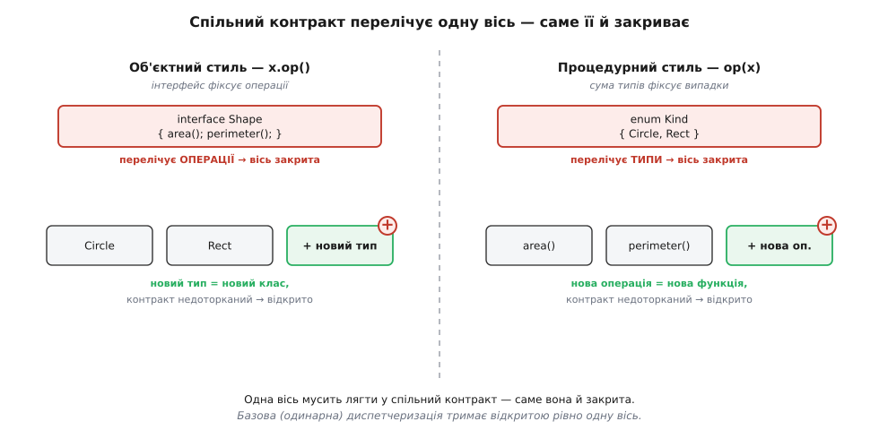

# Проблема вираження: чому одну вісь розширення даровано, а другу оплачено

<preknowlist>
- [Поліморфізм](book:programming/polymorphism) — вибір потрібної реалізації за типом отримувача в момент виклику (динамічна диспетчеризація).
- [Інтерфейс проти реалізації](book:programming/interface-vs-implementation) — межа між тим, що тип обіцяє назовні, і тим, як він улаштований усередині.
- [Проєктування за типами](book:programming/type-driven-design) — сума варіантів і вичерпний розбір випадків як спосіб описати дані.
</preknowlist>

Майже в кожній програмі, що чимось маніпулює, ховається одна й та сама таблиця: набір **видів даних** і набір **операцій** над ними. І з цією таблицею трапляється дивна річ. Додати новий вид даних буває легко — пишеш один новий шматок, старого не чіпаєш; а додати нову операцію боляче — доводиться відкрити й дописати геть усе, що вже написане. Або точно навпаки: нова операція лягає задарма, зате новий вид даних змушує обійти кожен закуток системи. Одна вісь розширення дарована, друга оплачена — і напрямок цієї несиметрії залежить не від акуратності твого коду, а від чогось значно глибшого.

Спокуса — списати біль на невдалу архітектуру: мовляв, спроєктували б інакше, і обидва напрямки були б дешеві. Але несиметрія нікуди не дінеться, хоч як перебудовуй. Вона не в конкретному коді, а в самій задачі — має ім'я, доведення й сорокарічну історію. Зветься вона **проблемою вираження** (англ. *expression problem*). Розберімо її від першопричини: звідки береться те, що одну вісь завжди даровано, а другу оплачено; чому обійти це базовими засобами неможливо; і чим саме платять ті, хто таки обходить.

## Матриця видів і операцій

Почнімо з найчистішого прикладу — обчислювача арифметичних виразів (він же й дав задачі назву). Види даних тут: `Число`, `Сума`, `Добуток`. Операції над ними: `обчислити`, `надрукувати`, `спростити`. Ці двоє наборів утворюють таблицю: рядок — вид даних, стовпець — операція, а клітина на їх перетині відповідає на одне питання — «що робить ця операція з цим видом даних». Виходить матриця 3×3, дев'ять клітин, і кожну треба заповнити: як надрукувати суму, як спростити добуток, як обчислити число.

```
              обчислити   надрукувати   спростити
  Число         n            "n"           n
  Сума          a+b        "(a+b)"      0+x → x
  Добуток       a·b        "(a·b)"      1·x → x
```

**Уся поведінка системи — це заповнена матриця.** Нічого більшого в ній немає: дай відповідь у кожній клітині — і програма готова. А **зростання** системи — це або новий **рядок** (додався вид даних), або новий **стовпець** (додалася операція). Дві осі, і вони незалежні: можна двадцять разів дописувати рядки й жодного разу стовпці, а можна навпаки.

Тепер — головне питання, довкола якого все крутиться. **Скільки вже написаного, вже «закритого» коду доведеться відкрити й переписати, щоб дописати рядок або стовпець?** Саму нову поведінку — вміст нових клітин — доведеться написати в будь-якому разі; тут заощадити нема як. Але питання не про це. Воно про інше число: скільки **наявних** модулів мусиш розкрити й зачепити. І відповідь виявляється разюче несиметричною — саме ця несиметрія і є суть проблеми.

## Дві одиниці коду, дві вартості

Ось першопричина всієї вилки, і вона напрочуд проста. Матриця одна, але **розкласти її на модулі коду** можна лише двома способами — по рядках або по стовпцях, — і мова змушує тебе обрати один.

Об'єктний розклад (той, що в ООП): **одиниця коду — це клас, а клас — це рядок**. Один клас збирає в собі всі операції для одного виду даних. Матрицю розрізано на горизонтальні смуги.

```ts
interface Shape {
  area(): number;
  perimeter(): number;          // набір операцій «зашитий» в інтерфейс — це стовпці
}
class Circle implements Shape {
  constructor(private r: number) {}
  area()      { return Math.PI * this.r ** 2; }
  perimeter() { return 2 * Math.PI * this.r; }
}
class Rect implements Shape {
  constructor(private w: number, private h: number) {}
  area()      { return this.w * this.h; }
  perimeter() { return 2 * (this.w + this.h); }
}
// + новий ТИП: один новий клас, старе не чіпаємо ───────────── дешево
class Triangle implements Shape { /* area(); perimeter(); */ }
// + нова ОПЕРАЦІЯ draw(): метод у інтерфейс і в КОЖЕН клас ──── дорого
```

Функційний розклад (той, що в ФП): **одиниця коду — це функція, а функція — це стовпець**. Одна функція збирає в собі всі види даних для однієї операції. Та сама матриця, але розрізана на вертикальні смуги.

```haskell
data Shape = Circle Double | Rect Double Double   -- набір типів «зашитий» у тип — це рядки

area :: Shape -> Double
area (Circle r) = pi * r * r
area (Rect w h) = w * h

perimeter :: Shape -> Double
perimeter (Circle r) = 2 * pi * r
perimeter (Rect w h) = 2 * (w + h)

-- + нова ОПЕРАЦІЯ: одна нова функція, старе не чіпаємо ──────── дешево
draw :: Shape -> String
draw (Circle _) = "○"
draw (Rect _ _) = "▭"
-- + новий ТИП Triangle: нова гілка в area, perimeter, draw ──── дорого
```

Придивись, як дзеркально стоять ці два шматки. У класовому розкладі клас `Circle` містить **увесь рядок** — усі операції над колом. Тому додати нове коло-подібне (новий рядок) легко: пишеш один клас, і він самодостатній. А додати нову операцію (стовпець) важко: її клітина є в кожному рядку, тобто метод треба вписати в кожен клас. У функційному розкладі — точно навпаки: функція `area` містить **увесь стовпець**, площу для всіх фігур, тому нова операція — це одна нова функція, а новий вид даних змушує дописати гілку в кожну наявну функцію. Дві картини — точний **транспонований** образ одна одної: що для однієї дешево, для другої дорого, і навпаки.


*Одна матриця, два розрізи. Об'єктний код — це рядки (класи), функційний — стовпці (функції). Зелена вісь у кожного розкладу — дарована (чисте додавання), червона — оплачена (правка всього наявного). Осі протилежні: це і є вилка.*

## Модель вартості розширення

Порахуймо ціну точно, бо саме число робить вилку неспростовною. Нехай у системі `n` видів даних (рядків) і `m` операцій (стовпців). Новий вид даних — це новий рядок із `m` клітин (по одній на кожну наявну операцію). Нова операція — це новий стовпець із `n` клітин. Стільки нової поведінки доведеться написати в будь-якому разі; ця робота незборима. А от **скільки наявних модулів доведеться відкрити** — уже несиметричне:

```
                       відкрити наявних модулів    нових модулів
  ООП (модуль = рядок):
    + тип (рядок)                 0                     1        ← дешево: чисте додавання
    + операція (стовпець)         n                     0        ← дорого: правка ВСІХ класів
  ФП (модуль = стовпець):
    + операція (стовпець)         0                     1        ← дешево: чисте додавання
    + тип (рядок)                 m                     0        ← дорого: правка ВСІХ функцій
```

Прочитаймо це повільно. На **дешевій** осі всі нові клітини лягають в **один новий модуль**, а наявних не чіпаємо взагалі — нуль правок у закритому коді. На **дорогій** осі ті самі нові клітини розсипано по всіх наявних модулях, і кожен доводиться відкрити й дописати. Кількість написаного коду та сама (`n` чи `m` клітин), але **локалізація** протилежна: одне — акуратна прибудова збоку, друге — хірургія в живому тілі системи.

> 🔧 **Навіщо це.** Оце й є той самий [принцип відкритости-закритости](book:programming/open-closed) у вигляді числа. «Відкритий до розширення, закритий до зміни» означає рівно нуль у стовпці «відкрити наявних модулів»: приріст має бути новим кодом збоку, а не правкою старого. Проблема вираження каже жорстку річ: у звичайній мові ти можеш отримати цей нуль на **одній** осі — на тій, вздовж якої проходить твій розклад на модулі, — але друга вісь тоді неминуче коштує `Θ(n)` чи `Θ(m)` правок у закритому коді. Обрати парадигму — значить обрати, яка з двох осей розширення тобі дарована, а за яку ти платитимеш щоразу.

## Що саме поставив Вадлер

Тепер, коли несиметрію видно й пораховано, варто почути її канонічне формулювання — бо саме воно перетворює розмите спостереження на строгу планку. Термін увів британський інформатик **Філіп Вадлер** (Philip Wadler) — у записці, розісланій **12 листопада 1998 року** в поштовий список `java-genericity`. Вадлер одразу застеріг, що це «нове ім'я для давньої проблеми»: напругу знали й раніше. Ось його ціль дослівно:

```
The goal is to define a datatype by cases, where one can
add new cases to the datatype and new functions over the
datatype, without recompiling existing code, and while
retaining static type safety (e.g., no casts).
```

Розкладімо цю фразу на вимоги, бо кожна навантажена і жодну не можна тихо викинути:

1. Додати новий **варіант даних** (case) — тобто новий рядок матриці.
2. Додати нову **функцію** над даними — тобто новий стовпець.
3. І перше, і друге — **не перекомпільовуючи наявний код**.
4. Не втрачаючи **статичної типобезпеки** — без приведень типів, без перевірок у рантаймі.

Третя й четверта вимоги — ті, що роблять задачу справді складною. Прибери їх — і задача розсипається на дрібницю: у динамічній мові можна дописувати що завгодно й куди завгодно, платою буде лише те, що пропущений випадок вилізе аварією в рантаймі. Вадлер навмисно **посилив** первісну постановку: замість «не міняючи наявний код» він вимагає «не **перекомпільовуючи**» його (розширення живе в окремій одиниці компіляції), і додає «зі збереженням статичної типобезпеки» — компілятор мусить довести повноту ще до запуску. Саме ці два гвинти й відсікають дешеві псевдорозв'язки.

Саму ж вилку — що дві осі тягнуть у протилежні боки — за два десятиліття до назви побачили інші, і це усталений факт. Американець **Джон Рейнольдс** (John C. Reynolds) 1975 року розрізнив «типи, визначені користувачем» і «процедурні структури даних» як два **доповняльні** підходи до абстракції даних, кожен з яких дає те, чого бракує іншому. А **Вільям Кук** (William R. Cook) 1990 року у праці «Object-Oriented Programming Versus Abstract Data Types» показав, що об'єкти впорядковані навколо конструкторів даних, а абстрактні типи даних — навколо операцій, і сильні місця одного підходу є слабкими місцями другого.

Тут ховається гарна іронія. Той самий Вадлер дев'ятьма роками раніше, у статті зі Стівеном Блоттом (Stephen Blott) «How to make ad-hoc polymorphism less ad hoc» (POPL, 1989), увів **класи типів** — механізм, який виявиться одним із найчистіших розв'язків саме цієї задачі. Спершу він дав інструмент, а вже потім — ім'я проблемі, яку той інструмент розв'язує. Обидва факти документовані працями POPL і добре узгоджені між джерелами.

## Чому одна диспетчеризація закриває рівно одну вісь

Вадлерова планка — чотири умови разом. Природне питання: чому не можна виконати всі чотири базовими засобами, тобто закрити **обидві** осі? Це не спостереження, а наслідок, що строго виводиться з двох простих посилок.

**Посилка перша: розширення без правки старого = нове живе в новому модулі.** Що означає «додати можливість, не чіпаючи наявний код»? Рівно те, що нова поведінка мусить лежати в **окремому модулі**, якого старий код не згадує. Бо якби старий код мусив хоч раз назвати нове поіменно, це вже правка старого. Отже, розширюваність = «нове в новому файлі, старий на нього не дивиться».

**Посилка друга: старий клієнт мусить спиратися на спільний контракт.** Клієнт, що працює з різновидами через єдину точку, не знає конкретних реалізацій — він знає лише **абстракцію**, спільний контракт. І ось вирішальне: цей контракт **мусить перелічити одну з двох осей**. Або він каже «ось повний список операцій» (інтерфейс із методами `area`, `perimeter`) — тоді перелічено вісь операцій. Або він каже «ось повний список варіантів» (сума типів `Circle | Rect | Triangle`) — тоді перелічено вісь типів. Третього базовий засіб не дає: щоб узагалі щось викликати через абстракцію, треба назвати або множину операцій, або множину випадків.

Складаємо дві посилки. **Перелічена вісь — закрита проти розширення**: щоб додати до неї елемент, доведеться відредагувати сам контракт, а на контракт спираються всі, тож правка тягне перекомпіляцію всіх. **Неперелічена вісь — відкрита**: її елементи живуть у нових модулях, старий контракт про них не питає.



*Одна вісь неминуче лягає у спільний контракт — і саме вона закрита; базова одинарна диспетчеризація тримає відкритою рівно одну.*

Тепер видно роль диспетчеризації. Одинарна (single dispatch) диспетчеризація — це вибір коду за **однією** координатою клітини (t, o). Виклик `x.area()` бере рядок t у рантаймі (за динамічним типом отримувача `x`), а стовпець o прибитий статично — його задає ім'я методу, перелічене в інтерфейсі. Одна координата вибирається вільно (рядок — тому додавай типи скільки хочеш), друга зафіксована переліком у контракті (стовпець — тому операції закриті). Симетрично, `area(x)` зі `switch` вибирає стовпець вільно (функція), а рядок фіксує сумою типів. Формально:

```
Розширюваність ⟺ нове живе в НОВОМУ модулі, старий його не згадує.
Старий клієнт згадує СПІЛЬНИЙ контракт.
Контракт перелічує одну вісь:
    інтерфейс   → перелік ОПЕРАЦІЙ (стовпці)  ⇒ стовпці закриті
    сума типів  → перелік ВАРІАНТІВ (рядки)   ⇒ рядки закриті
Одинарна диспетчеризація читає клітину (t,o) за ОДНОЮ координатою:
    x.op()  →  t береться в рантаймі,  o прибите інтерфейсом
⇒ відкрита рівно одна вісь; друга перелічена, отже закрита.  ∎
```

Це **нижня межа**, а не хиба реалізації: доки код вибирається за однією координатою й спирається на один спільний контракт, що перелічує другу координату, друга вісь закрита за побудовою. Щоб відкрити обидві, треба зламати одну з посилок — або змінити, **що** перелічує контракт, або перелічувати не одну координату, або взагалі не перелічувати жодної. Рівно це й роблять чотири відомі виходи, кожен за свою ціну.

## Дуальність, яку побачив Рейнольдс

Перш ніж дивитися виходи, варто зазирнути ще на шар глибше — чому взагалі осі протилежні, а не просто «різні». Тут ми впираємося в дуальність, яку Рейнольдс і Кук описали точніше за метафору таблиці.

Є два способи заховати представлення даних. Перший — **абстракція типу** (абстрактний тип даних): одне приховане внутрішнє представлення, а операції — це зовнішні функції, кожна з яких знає цей єдиний внутрішній вигляд і працює з ним. Другий — **абстракція процедурна** (об'єкти): кожен об'єкт **носить свою поведінку в собі**, а «тип» зводиться до «відповідає на цей набір повідомлень», байдуже, як улаштований усередині. Це та сама межа між тим, що тип обіцяє назовні, і тим, як він це робить, — [різниця між інтерфейсом і реалізацією](book:programming/interface-vs-implementation), доведена до питання «хто володіє клітиною матриці».

І от чому осі протилежні. Коли операція — це зовнішня функція, що знає одне представлення (бік абстрактного типу), додати операцію легко (ще одна функція збоку), зате додати представлення важко (кожна функція припускала старий вигляд). Коли ж поведінка живе всередині об'єкта (об'єктний бік), додати вид даних легко (ще один клас зі своєю поведінкою), зате додати операцію важко (її треба вкласти в кожен клас). **Проблема вираження — це та сама дуальність Рейнольдса, лише перевдягнена в рядки й стовпці.** Вадлерова таблиця — зручний спосіб побачити оком те, що Рейнольдс сформулював як доповняльність двох абстракцій ще 1975 року.

## Чотири виходи — і ціна кожного

Раз вилка неспростовна у звичайній мові, цікаве питання — чим за її обхід платять. Є чотири відомі ходи; кожен ламає одну з посилок доведення і бере за це свою ціну. Розберімо по черзі, від найслабшого до найповнішого.

**Відвідувач (Visitor).** Найперша спокуса — прийом усередині самої ООП: винести операцію в окремий об'єкт-відвідувача, що вміє обійти всі види даних (патерн із каталогу GoF, 1994). Тепер спільний контракт — це інтерфейс відвідувача, і він перелічує **типи** (метод `visitCircle`, `visitAdd` на кожен тип), а не операції.

```ts
interface Visitor<R> { num(n: number): R; add(l: Expr, r: Expr): R; }
interface Expr { accept<R>(v: Visitor<R>): R; }

class Num implements Expr {
  constructor(public n: number) {}
  accept<R>(v: Visitor<R>): R { return v.num(this.n); }   // подвійна диспетчеризація
}
class Add implements Expr {
  constructor(public l: Expr, public r: Expr) {}
  accept<R>(v: Visitor<R>): R { return v.add(this.l, this.r); }
}
// нова ОПЕРАЦІЯ = новий відвідувач; жоден вузол не чіпаємо:
class Eval implements Visitor<number> {
  num(n)    { return n; }
  add(l, r) { return l.accept(this) + r.accept(this); }
}
```

Механізм — **подвійна диспетчеризація**: `expr.accept(v)` спершу вибирає рядок (за типом вузла), тоді `v.add(...)` вибирає стовпець (за типом відвідувача); два одинарні виклики поспіль сходяться в одну клітину. Наслідок: нова операція — це новий клас-відвідувач, наявні вузли недоторкані (**закрито проти осі операцій**). Але придивись, що це насправді робить. Відвідувач **не розчіплює вилку — він повертає об'єкт на 90°**: новий вид даних тепер змушує додати метод `visitMul` у **кожен** наявний відвідувач. Це правильний вибір рівно тоді, коли операції плодяться частіше за типи (класичний приклад — вузли AST компілятора стабільні, а проходів-операцій усе більше); і хибний, коли росте вісь типів. Заплатиш ти протилежним боком.

**Множинна диспетчеризація (мультиметоди).** А що, як вибирати код не за однією координатою, а за **обома** одразу? Це і є множинна диспетчеризація (англ. *multiple dispatch*). Операція стає узагальненою функцією, чиї методи індексуються **кортежем** типів аргументів; жоден клас не «володіє» методом, вони живуть зовні. Так працює CLOS (Common Lisp Object System, стандартизований комітетом X3J13 наприкінці 1980-х) і, як центральний принцип мови, — Julia (Джефф Безансон, Стефан Карпінський, Вірал Шах, Алан Едельман; перший публічний реліз 2012 року).

```julia
abstract type Expr end
struct Num <: Expr; n::Float64 end
struct Add <: Expr; l::Expr; r::Expr end

eval(e::Num) = e.n                          # клітина живе ПОЗА і типом, і операцією
eval(e::Add) = eval(e.l) + eval(e.r)

# нова ОПЕРАЦІЯ — просто нові методи ззовні, наявних не чіпаємо:
show_(e::Num) = string(e.n)
show_(e::Add) = "($(show_(e.l)) + $(show_(e.r)))"

# новий ТИП — новий struct + методи; теж наявних не чіпаємо:
struct Mul <: Expr; l::Expr; r::Expr end
eval(e::Mul) = eval(e.l) * eval(e.r)
# але якщо ЗАБУВ show_(::Mul) — пропущену клітину видно аж у РАНТАЙМІ:
#   ERROR: MethodError: no method matching show_(::Mul)
```

Обидві осі раптом дешеві: і новий тип, і нова операція — це вільні визначення збоку, наявного не редагуємо. Множинна диспетчеризація ще й прибирає окрему незручність одинарної — операції над **двома** аргументами (порівняння, зіткнення двох фігур, додавання чисел різних видів), де single dispatch змушує штучно призначати одного з аргументів «головним». Ціна — **втрата статичної повноти**: компілятор більше не гарантує, що кожну клітину заповнено. Пропущена клітина M[Mul, show_] — не помилка складання, а зрив у рантаймі. Вадлерову вимогу (4) тут принесено в жертву заради обох осей.

**Класи типів і трейти.** Найелегантніший статичний вихід ламає посилку про «один контракт, що перелічує вісь»: він дає **два** роди контрактів, і жоден не перелічує обидві осі. Дані відкриті самі по собі (новий тип — нове оголошення даних), а операції — це **класи типів** (англ. *type classes*, Haskell) чи **трейти** (англ. *traits*, Rust). Ключ у тому, що екземпляр «тип t реалізує операцію o» — окрема самостійна одиниця, яку можна дописати збоку.

:::tabs
```haskell
-- дані відкриті: новий тип — нове data, наявного не чіпаємо
data Circle = Circle Double
data Rect   = Rect Double Double

class Area a where area :: a -> Double          -- операція = клас
instance Area Circle where area (Circle r) = pi * r * r
instance Area Rect   where area (Rect w h) = w * h

-- НОВА операція = НОВИЙ клас + екземпляри; наявного не чіпаємо:
class Perimeter a where perimeter :: a -> Double
instance Perimeter Circle where perimeter (Circle r) = 2 * pi * r

-- НОВИЙ тип = нове data + екземпляри наявних класів:
data Triangle = Triangle Double Double
instance Area Triangle where area (Triangle b h) = 0.5 * b * h
```
```rust
struct Circle { r: f64 }
struct Rect   { w: f64, h: f64 }

trait Area { fn area(&self) -> f64; }           // операція = трейт
impl Area for Circle { fn area(&self) -> f64 { std::f64::consts::PI * self.r * self.r } }
impl Area for Rect   { fn area(&self) -> f64 { self.w * self.h } }

// НОВА операція = НОВИЙ трейт + impl-и; наявного не чіпаємо:
trait Perimeter { fn perimeter(&self) -> f64; }
impl Perimeter for Circle { fn perimeter(&self) -> f64 { 2.0 * std::f64::consts::PI * self.r } }

// НОВИЙ тип = новий struct + impl наявних трейтів:
struct Triangle { b: f64, h: f64 }
impl Area for Triangle { fn area(&self) -> f64 { 0.5 * self.b * self.h } }
```
:::

Обидві осі відкриті, все статично перевірено, а завдяки [монорфізації](book:programming/zero-cost-abstractions) у Rust — без витрат у рантаймі. Це справді дотягує до всіх чотирьох умов Вадлера — і не дивно, що придумав класи типів той самий Вадлер за дев'ять років до того, як назвав вилку. Але й тут є ціна, і в неї є ім'я — **узгодженість** (англ. *coherence*). Щоб компілятор завжди знав, який саме екземпляр застосувати, і щоб цей вибір був єдиним у всій програмі, діє **правило сироти** (англ. *orphan rule*): екземпляр класу для типу можна оголосити лише там, де ти володієш **або** класом, **або** типом. Практичний наслідок: сторонній екземпляр — чужий трейт для чужого типу — заборонений, і щоб його все ж дати, доводиться загортати чужий тип у свій (newtype). Осі відкриті, але не будь-де: розширювати можна лише в модулі, який володіє одним із боків. Це реальна, хоч і невелика, плата за статичну єдиність.

**Об'єктні алгебри й tagless-final.** Останній вихід ламає посилку найглибше: він узагалі **не перелічує** ні типи, ні операції в спільному контракті. Замість зображати дані конкретним деревом (сумою типів), об'єктна алгебра (англ. *object algebra*) подає **конструктори** типу даних як методи узагальненого інтерфейсу, параметризованого носієм результату `A`. Операція стає реалізацією цього інтерфейсу під конкретний `A`; новий варіант — під-інтерфейсом з іще одним методом.

:::tabs
```ts
// «алгебра» — інтерфейс конструкторів, у якого тип продукту — параметр A
interface ExpAlg<A> {
  lit(n: number): A;
  add(a: A, b: A): A;
}
// операція = реалізація під носій A;  + операція — новий клас (СТОВПЕЦЬ задарма)
class Eval implements ExpAlg<number> {
  lit(n: number)            { return n; }
  add(a: number, b: number) { return a + b; }
}
class Print implements ExpAlg<string> {
  lit(n: number)            { return String(n); }
  add(a: string, b: string) { return `(${a}+${b})`; }
}
// + новий ВАРІАНТ mul = під-інтерфейс, старе ціле (РЯДОК задарма)
interface MulAlg<A> extends ExpAlg<A> { mul(a: A, b: A): A; }
```
```haskell
-- те саме як клас типів (tagless-final): конструктори — методи класу
class ExpAlg a where
  lit :: Int -> a
  add :: a -> a -> a

newtype Eval = Eval Int                 -- носій обчислення
instance ExpAlg Eval where
  lit n                 = Eval n
  add (Eval a) (Eval b) = Eval (a + b)
-- + операція (напр. Print) — новий instance, старе ціле (СТОВПЕЦЬ задарма)

class ExpAlg a => MulAlg a where        -- + варіант mul — клас-розширення
  mul :: a -> a -> a                    --   старе ціле (РЯДОК задарма)
```
:::

Обидві осі тут додаються чистим приростом і зі статичною типобезпекою: новий носій `A` дає операцію, під-інтерфейс дає варіант, наявного не чіпаємо. Головне, що це працює у звичайних дженериках Java, C#, TypeScript — без жодних просунутих можливостей системи типів; це й був результат праці Бруно Олівейри та Вільяма Кука «Extensibility for the Masses» (ECOOP, 2012). Той самий прийом у типізованій функційній мові називають **tagless-final** (Жак Каретт, Олег Кисельов, Чун-чє Шань, «Finally Tagless, Partially Evaluated», Journal of Functional Programming, 2009): терми зображають не конструкторами даних, а перевантаженими функціями — методами класу типів. Ціна цього виходу тонша за попередні й ховається в слові «функція». Терм тепер **Church-кодований** (за Алонзо Черчем) — він не дерево, яке можна розібрати, а програма, яку можна лише виконати проти якоїсь алгебри. Тому все, що вимагає **вільно оглянути структуру** терма — зіставити зі зразком, пройтися по піддеревах у довільному порядку, переписати вузол за контекстом сусідів, — стає незручним або неможливим напряму. Ти виграв відкритість обох осей, але змінив саму природу даних: зі «структури, яку інспектуєш», на «побудову, яку інтерпретуєш».

![Площина з двома осями: горизонтальна — чи дешево додати операцію-стовпець, вертикальна — чи дешево додати тип-рядок. Лівий-верхній кут: ООП і абстрактна фабрика — рядки даром, стовпці за плату. Правий-нижній кут: ФП, зіставлення взірців і Відвідувач — навпаки. Правий-верхній кут виділено як мету: мультиметоди, класи типів, tagless-final та object algebras відкривають обидві осі. Діагональна двобічна стрілка між ООП-рогом і ФП-рогом підписана: Відвідувач лише повертає між рогами, а не виводить із вилки](img/escape-quadrants.svg)

*Чотири кути площини «дешево додати тип / операцію». Об'єктний розклад сидить в ООП-розі (рядки даром, стовпці за плату); функційний — навпроти по діагоналі. Відвідувач лише возить між цими двома рогами. Справжній вихід — правий-верхній кут: мультиметоди, класи типів, tagless-final та об'єктні алгебри відчиняють обидві осі, кожен за свою ціну.*

## Коли знаєш ім'я вилки

Практична вага всього цього — ось у чому. Коли ти тягнешся до класового розкладу (успадкування, підтипи, абстрактна фабрика), ти **свідомо обираєш ООП-ріг** проблеми вираження: береш дешеві типи ціною дорогих операцій. Це правильна покупка там, де видів даних багато й вони змінюються, а набір операцій усталений, — теми оформлення, драйвери баз даних, віконні тулкіти, вузли одного стабільного протоколу. І коли одного дня додавання ще однієї операції крізь усі класи починає боліти, ти вже не сплутаєш цей біль із власною помилкою: це рахунок за дешеву вісь, закон, а не недбалість.

А знаючи, що вилка має другий бік і чотири відомі виходи, ти бачиш і куди рухатися, коли ціна стала завеликою. Хочеш дешевих **операцій** замість дешевих типів — розверни об'єкт відвідувачем. Хочеш **обидві** осі й ладен заплатити статичною повнотою — візьми мультиметоди; ладен тримати статику — класи типів, трейти або об'єктні алгебри, кожне за свою скромну плату.

Найглибший висновок — той, що не лежить на поверхні. Асиметрія не завжди хиба, яку треба виправляти. Більшість доменів росте однобічно, і платити за відкритість обох осей, коли реально росте одна, — це складність без віддачі. Проблема вираження не наказує завжди відкривати обидві осі; вона лише чесно виписує рахунок за кожну й доводить, що безкоштовного варіанта немає. Найважливіше вже зроблено в ту мить, коли ти назвав вилку: те, що має ім'я, доведення й карту виходів, перестає бути таємничою незручністю й стає інженерним вибором з відомою ціною по кожному напрямку.
