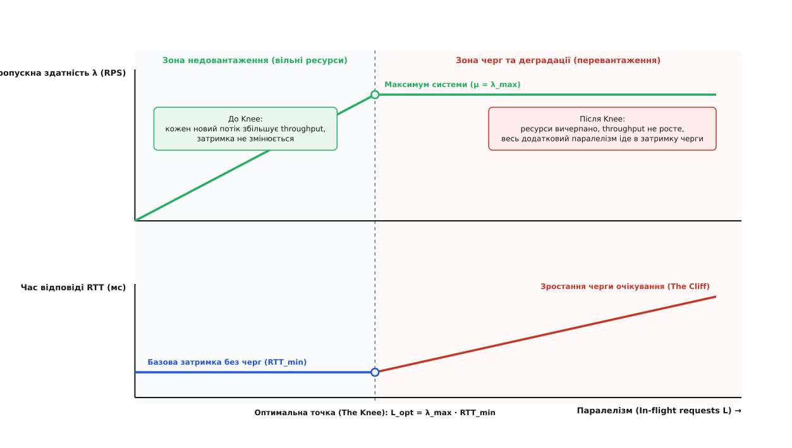
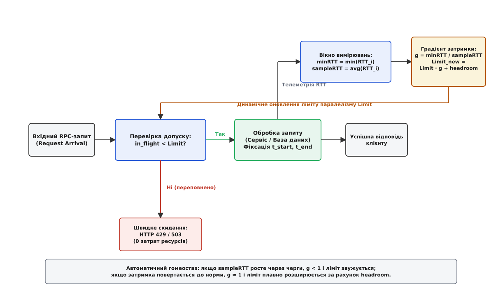
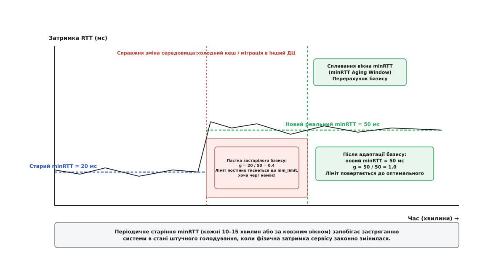

# Адаптивні ліміти конкурентності: динамічне виявлення пропускної здатності

<preknowlist>
- [Контроль допуску](topic:programming/admission-control) — фільтрація та відсікання надлишкових запитів перед пулом обробки.
- [Таймаути й бюджет часу](topic:programming/timeouts-deadlines) — захист від нескінченного блокування ресурсів клієнтом і сервером.
- [Запобіжник](topic:programming/circuit-breaker-pattern) — клієнтський захист від звернень до збійного бекенду.
- [Перебірки](topic:programming/bulkhead-isolation) — ізоляція пулів потоків і пам'яті для локалізації відмов між різними типами завдань.
- [Скидання навантаження](topic:programming/load-shedding) — стратегії відсікання низькопріоритетного трафіку під час дефіциту ресурсів.
- [Черга як вирівнювач](topic:programming/queue-load-leveling) — буферизація піків та ціна затримки очікування.
</preknowlist>

Сервіс проведення онлайн-платежів розгорнуто на кластері з двадцяти інстансів. У нормальних умовах кожен екземпляр обробляє 200 запитів за секунду. Час виконання типової платіжної транзакції становить 25 мілісекунд: запит робить швидке читання з розподіленого кешу, проводить розрахунок у пам'яті та записує фінансову транзакцію в реляційну базу даних. Для захисту від перевантаження інженери налаштували пул робочих потоків веб-сервера на фіксовану кількість — рівно 100 одночасних обробників. Розрахунок здавався бездоганним: 100 потоків, кожен з яких виконує операцію за 0.025 секунди, забезпечують запас пропускної здатності у 4000 операцій на секунду на один сервер, що у двадцять разів перевищує середній трафік.

Аварія трапляється в момент, коли репліка бази даних потрапляє під блокування таблиць через тривалу індексацію. Час запису транзакції миттєво зростає з 25 мілісекунд до 250 мілісекунд — рівно вдесятеро.

Фізична пропускна здатність пулу зі 100 потоків у ту ж секунду падає з 4000 до 400 запитів за секунду (`100 / 0.25 = 400`). Проте клієнтські додатки продовжують надсилати потік у 1000 запитів за секунду. Усі 100 робочих потоків виявляються наглухо заблокованими очікуванням дискових операцій бази. Вхідні запити починають стрімко осідати у черзі очікування сокета операційної системи. За кілька секунд черга розростається до кількох тисяч елементів, а час перебування запиту в черзі перед взяттям у потік досягає 3500 мілісекунд.

Клієнти мають жорсткий таймаут очікування у 1000 мілісекунд. Розірвавши з'єднання за таймаутом, мобільні клієнти та платіжні шлюзи негайно надсилають повторні спроби. Сервери продовжують працювати на 100% завантаження процесора, сумлінно обслуговуючи 400 транзакцій щосекунди, але кожен запит, який потік дістає з голови черги, вже провів у ній понад 3 секунди. Клієнт давно відмовився від результату. Сервери спалюють 100% обчислювальної потужності на обслуговування завдань, результат яких викидається у смітник, тоді як жоден живий користувач не може провести платіж.

Причина катастрофи полягає не у збої алгоритмів чи дефіциті заліза, а в хибній фундаментальній передумові: **статичний ліміт паралелізму не здатний захистити систему, чия внутрішня продуктивність є динамічною величиною**.

## Чому класичного обмеження швидкості та фіксованих пулів недостатньо

Перша інтуїтивна спроба розв'язати проблему перевантаження полягає у встановленні обмежувача швидкості (Rate Limiter), наприклад, алгоритму відра маркерів (Token Bucket), налаштованого на 1000 запитів на секунду (RPS). Проте такий захист є сліпим до внутрішнього стану сервісу з трьох фундаментальних причин:

1. **Гетерогенність вартості запитів (Cost Invariance):**
   Один запит на перевірку балансу виконується за 2 мілісекунди і читає пам'ять. Інший запит — формування звіту або перевірка шахрайських транзакцій (Anti-fraud) — забирає 150 мілісекунд процесорного часу та блокує з'єднання з базою. Обмежувач швидкості рахує події на вході (`count/sec`), але 500 важких запитів спалять сервер дощенту, не перевищивши встановлений ліміт у 1000 RPS.
2. **Динамічна зміна пропускної здатності бекендів:**
   Продуктивність залежних сервісів безперервно коливається. Якщо мікросервіс авторизації або шар кешування сповільнюється вдвічі, фізична ємність нашого сервера скорочується вдвічі. Статичний рейт-лімітер продовжує пропускати колишні 1000 RPS, забиваючи черги та перетворюючи деградацію залежності на повний колапс нашого вузла.
3. **Ілюзія захисту через фіксований пул потоків:**
   Фіксований пул потоків (наприклад, 100 робочих потоків у Tomcat чи Netty) не обмежує кількість запитів у системі — він лише обмежує кількість завдань, що обробляються одночасно. Усі інші запити складаються у внутрішні черги пам'яті (Task Queue). Коли час виконання зростає, черга починає неконтрольовано рости, викликаючи вичерпання оперативної пам'яті (OutOfMemoryError), нескінченні паузи збирача сміття та повну втрату працездатності.

Виникає необхідність керувати не кількістю зовнішніх подій на секунду, а **внутрішнім рівнем конкурентності** (англ. *concurrency*) — кількістю завдань, які одночасно мають право споживати обчислювальні ресурси.

## Сира пропускна здатність, корисна робота та точка перелому

Щоб розібратися, чому фіксовані конфігурації неминуче призводять до відмови, необхідно розглянути взаємозв'язок між трьома базовими характеристиками будь-якої обчислювальної системи:
- **Паралелізм** (англ. *concurrency*, або *in-flight requests* `L`): кількість завдань, які система виконує або буферизує одночасно в дану мить;
- **Пропускна здатність** (англ. *throughput* `λ`): кількість завершених операцій за одиницю часу;
- **Час відповіді** (англ. *latency*, або *Round-Trip Time* `W`): повна тривалість обслуговування одного запиту від його надходження до відправлення відповіді.

Згідно із фундаментальним **законом Літтла** (`L = λ · W`), паралелізм системи строго дорівнює добутку швидкості надходження запитів на середній час їхнього виконання.


*Динаміка пропускної здатності та затримки: після досягнення точки насичення додатковий паралелізм не збільшує корисну роботу, а лише спричиняє зростання затримки в черзі.*

Графік залежності характеристик системи від рівня конкурентності чітко ділиться на дві принципово різні зони, розділені критичною точкою:

### 1. Зона недовантаження (Linear Scaling Zone)
Поки рівень конкурентності `L` менший за фізичну ємність системи `L_opt`, обчислювальні ресурси (ядра процесора, пули з'єднань з базою, дискові канали) мають вільний резерв.
- Кожен новий паралельний запит знаходить вільний потік і негайно береться до виконання;
- Час відповіді залишається постійним і дорівнює мінімальній фізичній затримці обробки: `W = RTT_min`;
- Пропускна здатність зростає строго лінійно зі збільшенням кількості потоків: `λ = L / RTT_min`.

### 2. Точка перелому (The Knee)
Точка перелому — це ідеальний режим функціонування системи:
- Ресурси процесора та підсистем вводу-виводу завантажені на 100% корисної роботи;
- Пропускна здатність досягає свого фізичного максимуму: `λ_max = μ`;
- Час відповіді все ще залишається мінімальним: `W = RTT_min`;
- Внутрішні черги повністю порожні (`W_q = 0`).

Оптимальна кількість паралельних запитів для точки перелому визначається як:

```
L_opt = λ_max · RTT_min
```

### 3. Зона перевантаження та черг (The Cliff)
Що відбувається, якщо збільшувати кількість одночасних запитів понад `L_opt`? Оскільки всі фізичні ядра процесора та канали бази даних уже завантажені на повну потужність, швидкість завершення операцій `λ` більше не може зрости ані на один запит за секунду.

Будь-який додатковий запит, допущений у систему понад `L_opt`, не прискорює роботу, а осідає в черзі очікування. Затримка починає зростати лінійно:

```
W = RTT_min + W_q = RTT_min + (L - L_opt) / λ_max
```

Коли затримка перевищує клієнтський таймаут, корисна пропускна здатність (goodput) стрімко падає до нуля. Додатково виникає явище деградації через конкуренцію (thrashing): тисячі активних потоків безперервно перемикають контексти в ядрі ОС, змагаються за блокування м'ютексів у пам'яті та провокують паузи збирача сміття (Garbage Collection), через що навіть максимальна швидкість обробки `μ` починає фізично зменшуватися.

Головна проблема традиційної розробки полягає в тому, що **точку `L_opt` неможливо раз і назавжди зафіксувати в конфігураційному файлі**. У реальному розподіленому середовищі `RTT_min` та `λ_max` безперервно дрейфують через холодні кеші, блокування таблиць, оновлення сусідніх мікросервісів та мережевий джитер.

Виникає необхідність в автоматичному механізмі, який здатний самостійно виявляти положення точки `L_opt` у реальному часі та підлаштовувати ліміт допуску під поточний стан системи.

## Концепція зворотного зв'язку: перенесення теорії TCP у шар RPC

Ідея динамічного визначення пропускної здатності не є новою для комп'ютерних наук. У 1980-х роках глобальний Інтернет неодноразово зазнавав повного колапсу через перевантаження каналів зв'язку, доки Ван Якобсон та Ларрі Петерсон не розробили математичні алгоритми керування вікном передачі даних у протоколі TCP ([як контроль перевантаження перейшов із транспортного рівня TCP у шар RPC-викликів](topic:programming/adaptive-concurrency/hist-tcp-to-rpc-limits.md)).

Ключовий прорив сучасної архітектури мікросервісів полягає в усвідомленні простого факту: **потік RPC-запитів між бекендами підпорядковується тим самим законам гідродинаміки черг, що й передача IP-пакетів через маршрутизатори**.

Кожен окремий RPC- або HTTP-запит, який клієнт надсилає до сервера, є вимірювальним зондом:
1. Клієнт фіксує точний час відправлення запиту `t_start`;
2. Сервер обробляє запит і повертає відповідь;
3. Клієнт фіксує час отримання відповіді `t_end` та обчислює фактичний час кругового обігу: `RTT = t_end - t_start`.

Якщо затримка `RTT` залишається на рівні мінімальної фізичної норми, це означає, що бекенд має вільний ресурс, і ліміт паралелізму можна безпечно збільшувати. Якщо ж затримка починає зростати, це є прямим математичним доказом того, що запити почали накопичуватися в чергах, і ліміт необхідно негайно звужувати до того, як виникнуть таймаути.


*Архітектура зворотного зв'язку: вимірювання затримки кожного завершеного запиту формує градієнт, який регулює вікно допуску без статичних лімітів.*

Механізм функціонує як замкнений контур автоматичного регулювання (гомеостаз):
1. **Перевірка на вході:** Коли надходить новий запит, атомарний лічильник `in_flight` порівнюється з динамічним значенням `current_limit`;
2. **Раннє відсікання (Fast Drop):** Якщо `in_flight >= current_limit`, запит миттєво відхиляється з кодом `HTTP 429 Too Many Requests` або `gRPC ResourceExhausted`. Сервер не витрачає на нього пам'ять і процесорний час;
3. **Збір телеметрії:** Допущені запити виконуються, а час їхньої обробки додається до ковзного вікна вибірки;
4. **Коригування ліміту:** Після накопичення вибірки алгоритм перераховує новий `current_limit` і передає його на вхідний бар'єр.

## Алгоритми динамічного пошуку пропускної здатності

В інженерній практиці розподілених систем сформувалося чотири основні сімейства адаптивних алгоритмів.

### 1. Алгоритм AIMD (Additive Increase / Multiplicative Decrease)
Найпростіший підхід, що базується на правилі TCP Tahoe/Reno:
- **Адитивне зростання:** Поки запити виконуються успішно і затримка не перевищує порогового значення, ліміт плавно збільшується на фіксовану константу на кожній ітерації: `Limit = Limit + 1`;
- **Мультиплікативне зменшення:** Щойно фіксується сплеск помилок (таймаути, коди 500 або різке зростання часу відповіді), ліміт різко згортається: `Limit = Limit · β` (де `β = 0.5 .. 0.8`).

**Недолік AIMD:** Алгоритм є суто реактивним. Щоб зрозуміти, де знаходиться межа ємності, AIMD зобов'язаний спровокувати перевантаження і дочекатися помилок. Це створює постійні пилоподібні коливання пропускної здатності та періодично призводить до відмов користувацьких операцій.

### 2. Алгоритм TCP Vegas (Delay-based Congestion Control)
Алгоритм Vegas усуває головний недолік AIMD: він виявляє наближення перевантаження **за затримкою**, задовго до появи перших помилок чи відкинутих пакетів.

Алгоритм підтримує дві ключові змінні:
- `minRTT` — мінімальний час відповіді незавантаженої системи;
- `sampleRTT` — поточний середній час відповіді запитів у вибірці.

Порівнюючи очікувану швидкість `Limit / minRTT` з реальною швидкістю `Limit / sampleRTT`, Vegas розраховує точну оцінку кількості запитів, які осіли у внутрішній черзі:

```
Queue = Limit · (1 - minRTT / sampleRTT)
```

Правило оновлення використовує два пороги черги — `α` (нижня межа) та `β` (верхня межа):
- Якщо `Queue < α`: черга занадто мала, система недовантажена → `Limit = Limit + 1`;
- Якщо `Queue > β`: черга перевищила допустимий розмір → `Limit = Limit - 1`;
- Якщо `α <= Queue <= β`: система перебуває в зоні оптимальної рівноваги → `Limit` не змінюється.

Строге математичне обґрунтування та доведення стабільності алгоритму наведено у вставці про [математичне виведення закону Літтла та умов стійкості алгоритму Vegas](topic:programming/adaptive-concurrency/math-little-law-and-vegas.md).

### 3. Алгоритм Gradient та Gradient2 (Netflix / Envoy)
Алгоритм Gradient є сучасним промисловим розвитком ідей Vegas, оптимізованим для роботи в мікросервісних інфраструктурах компаній Netflix та Envoy Proxy.

Замість дискретних кроків `+1/-1` алгоритм обчислює мультиплікативний **градієнт затримки** `g`:

```
g = minRTT / sampleRTT
```

- Якщо затримка нормальна (`sampleRTT ≈ minRTT`), то `g ≈ 1.0`;
- Якщо система починає накопичувати черги (`sampleRTT > minRTT`), градієнт падає (`g < 1.0`).

Цільовий ліміт розраховується як добуток поточного ліміту на градієнт плюс параметр запасу черги (headroom) `h`:

```
Limit_target = Limit · g + h
```

Параметр `h` відіграє критичну роль: він змушує систему створювати невеликий постійний тиск угору, що дозволяє швидко виявляти збільшення пропускної здатності (наприклад, після завершення важких фонових завдань або масштабування кластера).

Щоб уникнути різких стрибків через випадковий шум окремих викликів, застосовується експоненційне згладжування (EMA):

```
Limit_next = (1 - σ) · Limit + σ · Limit_target
```
де `σ ∈ [0.1, 0.3]` — ваговий коефіцієнт згладжування.

### 4. Алгоритм на основі BBR (Bottleneck Bandwidth and RTT)
Алгоритм BBR (розроблений у Google) розділяє вимірювання максимальної пропускної здатності та мінімальної затримки в часі:
- Протягом фази **ProbeBW** алгоритм циклічно збільшує паралелізм для фіксації максимальної швидкості завершення викликів `B_max = max(RPS)`;
- Протягом короткої фази **ProbeRTT** (наприклад, раз на 10 секунд на 200 мілісекунд) алгоритм штучно стискає ліміт до мінімуму, щоб повністю спустошити черги та виміряти справжній фізичний `RTT_min`;
- Робочий ліміт розраховується безпосередньо за законом Літтла: `Limit = B_max · RTT_min + Headroom`.

BBR демонструє максимальну стійкість в умовах великого стохастичного шуму, але вимагає періодичного примусового скидання частини трафіку під час фази ProbeRTT.

## Анатомія вимірювання затримок: фільтрація шуму та дрейф базису

Ефективність адаптивного лімітера безпосередньо залежить від точності вимірювання затримок. У розподілених системах затримка окремого виклику містить велику випадкову компоненту: поодинокі паузи збирача сміття, тимчасові сплески мережевих втрат, оновлення внутрішніх таблиць маршрутизації.

### Яку метрику усереднювати у вікні вибірки?
Якщо розраховувати `sampleRTT` як середнє арифметичне (Average), один аномальний запит тривалістю 5000 мс спотворить усю вибірку з 50 запитів і змусить лімітер безпідставно згорнути пропускну здатність.

Тому сучасні реалізації застосовують перцентильні фільтри:
- **90-й перцентиль (`P90`):** є золотим стандартом для адаптивних контролерів (використовується в Envoy). Він повністю ігнорує 10% випадкових хвостових викидів, але надійно фіксує початок структурного переповнення черги;
- **99-й перцентиль (`P99`):** надто нестабільний для контуру керування і часто провокує паразитні автоколивання;
- **Медіана (`P50`):** надто повільно реагує на перевантаження, оскільки черга повинна заповнити понад половину вибірки, перш ніж медіана зрушиться з місця.

### Пастка хибного базису (False Baseline Trap) та старіння minRTT
Найнебезпечніша інженерна пастка в алгоритмах затримки виникає під час легітимної зміни фізичної продуктивності системи.

Уявімо типовий сценарій:
1. Уночі сервіс працював із гарячим кешем у пам'яті, і алгоритм зафіксував базовий `minRTT = 5 мс`;
2. Удень трафік зріс, кеш частково витіснився, і сервіс почав частіше читати дані з SSD-диска. Нова нормальна затримка сервісу без черг становить `25 мс`;
3. Якщо алгоритм зберігає старий `minRTT = 5 мс` назавжди, він обчислює градієнт `g = 5 / 25 = 0.2`. Алгоритм робить хибний висновок, що система перевантажена на 80%, і стискає ліміт до мінімуму (`min_limit`). Сервіс переходить у стан хронічного штучного голодування, відхиляючи 90% трафіку, хоча процесор завантажений лише на 10%.


*Механізм старіння minRTT: періодичне скидання базису запобігає хронічному голодуванню системи при закономірній зміні умов роботи.*

Для запобігання цій катастрофі використовується **механізм старіння minRTT** (minRTT Aging Window):
- Значення `minRTT` має обмежений час життя (зазвичай від 3 до 10 хвилин);
- Після закінчення вікна старіння значення `minRTT` скидається, і алгоритм ініціалізує новий базис за поточною вибіркою реального трафіку;
- У контролері Envoy для цього кожні кілька хвилин запускається короткочасна фаза калібрування, де ліміт тимчасово затискається, щоб гарантовано очистити черги та виміряти новий актуальний `minRTT`.

## Архітектура розміщення: сервер, клієнт та Service Mesh

Адаптивний лімітер може бути розташований на різних рівнях розподіленої архітектури, вирішуючи різні завдання захисту.

### 1. Серверний лімітер (Server-side Limiter)
Вбудовується безпосередньо в конвеєр обробки вхідних запитів веб-сервера (як middleware або gRPC Interceptor).
- **Ціль:** Захистити власний процес та локальні ресурси (CPU, пам'ять, пули з'єднань до БД) від перевантаження;
- **Дія при переповненні:** Швидка відмова клієнту з кодом `HTTP 429` або `503` без витрат обчислювального часу;
- **Перевага:** Володіє найточнішою інформацією про реальний стан локального інстансу.

### 2. Клієнтський лімітер (Client-side Limiter)
Розміщується в клієнтській бібліотеці або SDK, через яке сервіс звертається до зовнішніх бекендів.
- **Ціль:** Запобігти перевантаженню віддаленого сервісу штормом запитів;
- **Дія при переповненні:** Клієнт локально притримує запити, перенаправляє їх на альтернативні репліки або негайно перемикається на аварійний локальний кеш (Fallback);
- **Перевага:** Трафік відсікається ще до відправлення в мережу, заощаджуючи мережеву смугу пропускання.

### 3. Рівень сервісної сітки (Sidecar Proxy / Service Mesh)
Найбільш гнучкий та універсальний підхід: лімітер реалізовано на рівні інфраструктурного проксі (наприклад, Envoy Proxy), який супроводжує кожен контейнер сервісу.
- Працює прозоро для будь-якої мови програмування (Go, Java, Python, C++, Node.js);
- Дозволяє централізовано оновлювати параметри адаптації через протокол Discovery Service (xDS) без перезбирання сервісів;
- Поєднує переваги як клієнтського, так і серверного регулювання.

## Взаємодія з балансуванням навантаження в кластері

У розподілених кластерах адаптивні лімітери кардинально підвищують ефективність клієнтських балансувальників навантаження (Load Balancers):

### 1. Проблема Round-Robin при нерівномірній деградації
Якщо один із десяти серверів кластера починає сповільнюватися через деградацію диска, класичний алгоритм Round-Robin продовжує надсилати на нього 10% всього трафіку. Повільний сервер швидко переповнюється чергами і стає джерелом 100% клієнтських таймаутів.

### 2. Поєднання адаптивного лімітування з PEWMA та P2C
Коли на кожному сервері або на клієнтському балансувальнику працює адаптивний лімітер:
- На збійному сервері ліміт паралелізму автоматично зменшується з 100 до 15 запитів;
- Алгоритм вибору з двох випадкових альтернатив (Power of Two Choices, P2C) або експоненційного зважування затримок (PEWMA) бачить, що на повільному сервері швидко вичерпується вільний ліміт конкурентності (`in_flight / limit`);
- Балансувальник автоматично і плавно відводить основний потік трафіку на здорові репліки без необхідності повного виключення повільного сервера з пулу працездатності (Health Check).

## Пропагація дедлайнів та очищення черг від прострочених запитів

Адаптивний контроль конкурентності досягає максимальної ефективності, коли поєднується з механізмом передачі дедлайнів (Deadline Propagation).

Коли запит проходить крізь розподілену систему:
1. Клієнт передає залишковий бюджет часу в заголовку (наприклад, `grpc-timeout: 200m` або `X-Request-Deadline: 1771589000`);
2. Якщо через раптовий сплеск навантаження запит змушений чекати у внутрішній черзі перед допуском до пулу обробки, контролер перед виділенням потоку перевіряє умову:
   ```
   t_now + RTT_expected > deadline
   ```
3. Якщо розрахунковий час завершення перевищує залишковий дедлайн клієнта, запит негайно викидається з черги (Early Shedding). Сервер навіть не починає його обробку, рятуючи обчислювальні цикли процесора для тих викликів, які ще можна врятувати.

## Пріоритезація трафіку та скидання некритичного навантаження

Коли адаптивний лімітер виявляє зростання затримки та знижує ліміт паралелізму, вкрай неефективно відхиляти всі запити випадковим чином. Якщо система перевантажена, неприпустимо скинути платіж користувача заради того, щоб згенерувати блок персоналізованої реклами.

Адаптивний контроль інтегрується з багаторівневою моделлю пріоритетів:

```
+-------------------------------------------------------------+
| Рівень 1: Критичний трафік (Critical)                       |
| Доступний завжди, поки in_flight < Limit                    |
+-------------------------------------------------------------+
| Рівень 2: Стандартний трафік (Standard)                     |
| Доступний, лише якщо in_flight < Limit · 0.85               |
+-------------------------------------------------------------+
| Рівень 3: Фоновий / Низькопріоритетний трафік (Background)  |
| Доступний, лише якщо in_flight < Limit · 0.60               |
+-------------------------------------------------------------+
```

Коли через деградацію бази даних ліміт зменшується:
1. Завантаження досягає 60% ліміту: система починає відсікати фонові пакетні завдання, індексацію та аналітику. Критичні транзакції та звичайні користувачі не відчувають жодних проблем;
2. Навантаження зростає до 85%: відсікаються стандартні операції перегляду контенту;
3. Навіть під час найважчої аварії ядра системи залишок пропускної здатності на 100% резервується під життєво важливі функції (авторизація, збереження платежів, health checks).

Детальний приклад побудови коду адаптивного контролера та конфігураційний контракт наведено у вставках про [робочу реалізацію адаптивного лімітера на C та C++](topic:programming/adaptive-concurrency/proj-adaptive-limiter.md) та [конфігураційний контракт та специфікацію API лімітера](topic:programming/adaptive-concurrency/api-concurrency-limiter.md).

> 🔧 **Навіщо це.**
>
> У сучасних хмарних архітектурах мікросервіси функціонують у середовищі з непередбачуваною продуктивністю: віртуальні машини деградують через галасливих сусідів у дата-центрі, бази даних тимчасово блокують таблиці під час оновлення схеми, а мережеві комутатори перенаправляють трафік через резервні маршрути.
>
> Статичні ліміти пулів потоків створюють смертельну ілюзію захисту: налаштовані на один режим роботи, вони перетворюються на каскадну пастку в момент першої ж аномалії. Адаптивні ліміти конкурентності перетворюють сервіс на живу авторегульовану систему. Замість ручного підбору параметрів для сотень мікросервісів інженери отримують автоматичний гомеостаз: система сама знаходить максимальну корисну пропускну здатність і стабільно тримає удар під будь-яким перевантаженням.

## Інженерні пастки та типові помилки впровадження

Практичне розгортання адаптивних лімітерів у високонавантажених системах вимагає врахування кількох неочевидних крайових випадків:

### 1. Змішування легких і важких маршрутів в одному лімітері
Якщо контролер допуску є спільним для всього інстансу веб-сервера, виникає спотворення метрик:
- Ендпоінт `/api/ping` виконується за 0.2 мс;
- Ендпоінт `/api/generate-pdf` виконується за 800 мс.

Якщо клієнти раптово надішлють сплеск важких запитів, середнє значення `sampleRTT` злетить угору, і лімітер різко затисне загальний ліміт, заблокувавши швидкі запити `/api/ping`.
- **Правило:** Адаптивні лімітери повинні розгортатися окремо для кожного кластера маршрутів або ізольованого пулу операцій.

### 2. Ефект шторму повторних запитів (Retry Storm)
Коли адаптивний лімітер починає повертати помилки `429 Too Many Requests`, некоректно налаштовані клієнти можуть негайно повторювати запит без експоненційного відтермінування (Backoff) та випадкового джитера (Jitter). Це багаторазово збільшує вхідний потік навантаження на мережевий шлюз.
- **Правило:** Помилки відсікання обов'язково повинні супроводжуватися протокольними заголовками `Retry-After` з рекомендацією клієнтам щодо паузи перед наступною спробою.

### 3. Конфлікт між горизонтальним автоскейлінгом (HPA) та відсіканням
Коли адаптивний лімітер ефективно відсікає 80% надлишкового трафіку на вході, процесорні ресурси сервера розвантажуються, оскільки генерація швидкої помилки `429` майже не споживає CPU.
Якщо автоскейлер Kubernetes налаштований за стандартною метрикою використання процесора (`targetCPUUtilizationPercentage: 80%`), він побачить, що CPU завантажено лише на 40%, і почне зменшувати кількість подів замість їх збільшення.
- **Правило:** Горизонтальне масштабування кластера повинно базуватися на метриках лімітера (`in_flight / current_limit` або лічильнику відхилених запитів `adaptive_concurrency_dropped_total`), а не суто на завантаженні процесора.

### 4. Трагедія спільного ресурсу (Multi-tenant Fairness)
Якщо перед одним сервісом працює десять клієнтських додатків, а адаптивний лімітер починає скидати трафік, один агресивний клієнт, що надсилає 90% запитів, може повністю витіснити запити інших дев'яти коректних клієнтів.
- **Правило:** Адаптивний контроль паралелізму повинен комбінуватися з квотуванням за клієнтами (Fair Queuing або квоти за токенами авторизації).

## Експлуатаційний чек-лист безпечного впровадження

Щоб уникнути несподіваних деградацій під час переходу зі статичних лімітів на адаптивні, в інженерних командах застосовують поетапний протокол розгортання:

1. **Режим тіньового моніторингу (Shadow / Dry-Run Mode):**
   Лімітер збирає телеметрію, розраховує градієнт `g` та динамічний ліміт `Limit`, але не відхиляє запити при `in_flight >= Limit`, а лише записує подію в лог та експортує метрику. Це дозволяє перевірити стабільність обчислень без ризику для користувачів;
2. **Встановлення широких меж безпеки (`min_limit` та `max_limit`):**
   На початковому етапі нижню межу фіксують на рівні 50% від середнього штатного трафіку, щоб алгоритм у разі збою вимірювань фізично не міг затиснути систему до нуля;
3. **Моніторинг співвідношення `RTT_min / RTT_sample`:**
   Перед увімкненням бойового відсікання переконуються, що у штатному режимі градієнт стабільно коливається в межах `0.95 .. 1.05`;
4. **Увімкнення бойового режиму з низьким пріоритетом:**
   Спершу відсікання вмикають лише для фонового та аналітичного трафіку, поступово поширюючи адаптивний контроль на критичні платіжні бізнес-транзакції.

## Підсумок: від статичних конфігурацій до адаптивної стійкості

Адаптивні ліміти конкурентності докорінно змінюють філософію проектування надійних розподілених систем:

1. **Відмова від магічних чисел:** Замість ворожіння на розмірах пулів потоків система спирається на об'єктивні математичні закони теорії черг (закон Літтла);
2. **Безперервне дослідження пропускної здатності:** Алгоритми затримки (Vegas, Gradient2) постійно підтримують баланс між максимальною корисною роботою та недопущенням черг;
3. **Захист від невідомого:** Незалежно від того, чому саме деградував бекенд (диск, пам'ять, мережа чи зовнішній API), адаптивний лімітер миттєво звужує вікно допуску, зберігаючи 100% працездатність системи та стабільний рівень затримок для допущеного трафіку.
