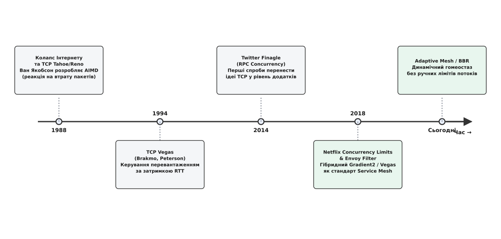

# 📜 Від колапсу TCP 1988 року до Netflix: як контроль перевантаження перейшов у рівень мікросервісів

У жовтні 1986 року пропускна здатність магістрального каналу мережі ARPANET між Національною лабораторією імені Лоуренса в Берклі (LBNL) та Каліфорнійським університетом у Берклі (UC Berkeley), розташованими на відстані лише кількасот метрів один від одного, раптово впала з 32 кілобітів за секунду до мізерних 40 бітів за секунду. Швидкість передачі знизилася у 800 разів. Мережа не розірвала фізичні з'єднання — усі кабелі та шлюзи працювали штатно. Проте жоден пакет не міг досягти отримувача вчасно.

Це явище отримало назву **колапсу перевантаження** (англ. *congestion collapse*). Коли шлюзи (ранні маршрутизатори) вичерпували пам'ять для буферизації транзитних пакетів, вони просто відкидали зайві дані. Хости-відправники, не отримуючи підтверджень доставлення (ACK), сприймали це як втрату окремого байта і негайно надсилали ті самі пакети повторно. У результаті мережевий канал на 99.9% заповнювався агресивними дублікатами пакетів, які знову й знову відкидалися переповненими буферами шлюзів.

Рішення проблеми знайшов Ван Якобсон (Van Jacobson) у 1988 році. Він сформулював фундаментальний принцип мережевої гідродинаміки: **джерело не повинно вливати в трубу новий пакет, доки з протилежного кінця труби не вилився попередній**. Якобсон створив алгоритм керування вікном передачі `cwnd` (Congestion Window) на основі правила AIMD (англ. *Additive Increase / Multiplicative Decrease* — адитивне зростання та мультиплікативне зменшення), втілений у реалізації TCP Tahoe та TCP Reno. Якщо передача успішна, вікно зростає лінійно на 1 пакет за час кругового обігу (`RTT`). Щойно зафіксовано втрату пакета (таймаут або потрійний дублікат ACK), вікно миттєво зменшується вдвічі.

*Еволюція ідей контролю перевантаження: від TCP Tahoe та Vegas до Netflix Concurrency Limits та Envoy.*

## Від реакції на втрати до вимірювання затримки: народження TCP Vegas

Хоча алгоритм Якобсона врятував ранній Інтернет від загибелі, він мав органічну ваду. Алгоритми сімейства Reno були **реактивними на втрати** (англ. *loss-based*). Щоб з'ясувати граничну пропускну здатність каналу, TCP Reno зобов'язаний був безперервно роздувати вікно доти, доки буфер маршрутизатора не переповниться і не почне відкидати пакети. Reno дізнавався про перевантаження лише тоді, коли вже створив його. Це спричиняло явище *Bufferbloat* — велетенські затримки в чергах та пилоподібні стрибки швидкості.

У 1994 році дослідники Лоуренс Бракмо (Lawrence Brakmo) та Ларрі Петерсон (Larry Peterson) з Університету Аризони запропонували революційну альтернативу — алгоритм **TCP Vegas**.

Ідея Vegas полягала у переході від відстеження втрат до відстеження **затримки кругового обігу** (англ. *Round-Trip Time*, RTT):
1. Алгоритм фіксує мінімальний час обігу пакета без черг (`minRTT`), який визначається суто фізичною затримкою поширення сигналу в кабелі;
2. Під час передачі даних алгоритм вимірює фактичний поточний `sampleRTT`;
3. Якщо `sampleRTT > minRTT`, це однозначно свідчить про те, що пакети почали накопичуватися в буфері проміжного вузла;
4. Порівнюючи очікувану швидкість передачі `Expected = cwnd / minRTT` з реальною швидкістю `Actual = cwnd / sampleRTT`, Vegas точно обчислює кількість пакетів, що осіли в черзі: `Queue = cwnd · (1 - minRTT / sampleRTT)`;
5. Якщо розмір черги перевищує поріг `β`, алгоритм завчасно зменшує вікно до того, як буфер переповниться і станеться втрата пакета.

TCP Vegas довів можливість стабільної роботи мережі на піку пропускної здатності без створення черг і без втрати пакетів. Проте в глобальному публічному Інтернеті 1990-х років Vegas програв конкурентну боротьбу: жадібні потоки TCP Reno безжально витісняли коректний Vegas, забиваючи буфери й змушуючи Vegas безпідставно згортати своє вікно до мінімуму.

## Пастка мікросервісної революції (2010–2018)

Через двадцять років проблема, розв'язана Якобсоном і Бракмо на рівні мережевих байтів, у точності відтворилася на прикладному рівні розподілених систем.

На початку 2010-х років монолітні архітектури поступилися місцем мікросервісам. Один запит користувача на веб-сайті тепер породжував дерево з десятків RPC-викликів (Remote Procedure Call) між внутрішніми бекендами. Для захисту від перевантаження інженери налаштовували статичні параметри:
- Максимальний розмір пулу потоків веб-сервера (наприклад, 200 потоків Tomcat чи gRPC);
- Статичні лімітери швидкості (наприклад, 500 запитів на секунду через Token Bucket);
- Клієнтські пули з'єднань фіксованого розміру.

У 2014–2016 роках інженери компаній Twitter, Netflix та Uber зіткнулися з тим, що статичні конфігурації регулярно спричиняли повномасштабні аварії:
- **Ефект галасливого сусіда (Noisy Neighbor):** Коли мікросервіс запускався у хмарі AWS на віртуальній машині зі спільними ресурсами, продуктивність процесора могла впасти на 30% через чуже фонове навантаження. Статичний ліміт у 500 RPS миттєво ставав фатальним надлишком;
- **Каскадне уповільнення бази даних:** Якщо репліка бази даних потрапляла під блокування рядків, час відповіді сервісу зростав із 10 мс до 200 мс. Пропускна здатність пулу з 200 потоків падала з 20 000 RPS до 1 000 RPS. Потік вхідних запитів роздував внутрішні черги, клієнти відвалювалися за таймаутами, надсилали шторм повторів (Retry Storm), і кластер повністю падав;
- **Непосильна підтримка тисяч конфігурацій:** У компанії з 500 мікросервісами інженери фізично не могли вручну підбирати й оновлювати ліміти потоків для кожного сервісу після кожного релізу чи зміни топології заліза.

## Від бібліотеки Finagle до стандарту Envoy

Перший крок до перенесення мережевих принципів у прикладний RPC-рівень зробила команда Twitter у фреймворку **Finagle** (2014), інтегрувавши адаптивне регулювання пулів клієнтських з'єднань на основі вимірювання затримок.

Справжній прорив стався у березні 2018 року, коли інженери Netflix Еран Ландау (Eran Landau), Вільям Терстон (William Thurston) і Тім Бозарт (Tim Bozarth) опублікували відкриту бібліотеку **Netflix Concurrency Limits** для платформи Java/gRPC. Netflix запропонував відмовитися від ручного конфігурування лімітів пулів потоків і реалізував сімейство адаптивних алгоритмів прямо в RPC-інтерцепторах:
- **Vegas Limiter:** пряма адаптація ідеї Бракмо-Петерсона для визначення конкурентності запитів;
- **Gradient Limiter:** регулювання межі паралелізму за співвідношенням поточного часу відповіді до базового мінімуму;
- **AIMD Limiter:** спрощений захист на основі відсотка помилок та переповнення черг.

У 2020 році алгоритм градієнтного адаптивного лімітування було портовано в C++ проксі-сервер **Envoy** у вигляді фільтра `adaptive_concurrency`. Завдяки цьому адаптивний контроль конкурентності став загальноприйнятим стандартом архітектури Service Mesh, захищаючи високонавантажені сервіси від перевантаження автоматично, без ручного втручання та без статичних коефіцієнтів.
