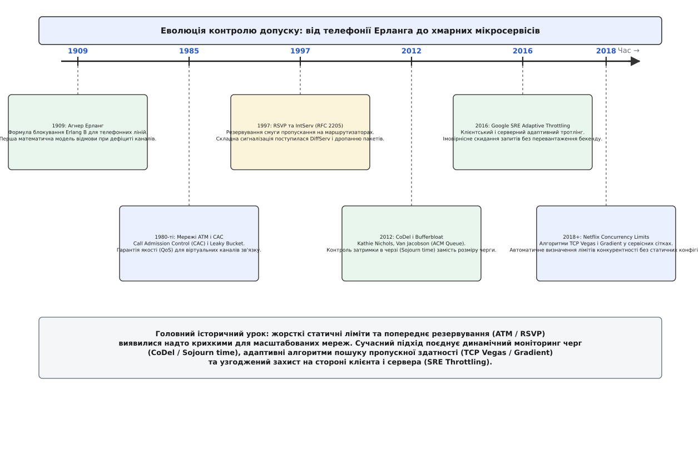

# 📜 Від телефонії Ерланга до хмарних мікросервісів: як народився контроль допуску

Контроль допуску не виник як модна концепція розподілених мікросервісів XXI століття. Він народився понад сто років тому в дротових телефонних мережах із простої фізичної неможливості обслужити два дзвінки через один мідний провід. Розуміння того, чому телефонна станція видає короткі гудки «зайнято», а не намагається з'єднати тисячу абонентів у спільний нерозбірливий шум, прокладає прямий шлях до сучасних алгоритмів захисту хмарних бекендів.


*Еволюція концепції відмови: від жорсткого фізичного браку ліній у комутаторах до динамічного захисту пулів потоків у хмарних архітектурах.*

## 1909 рік: Агнер Ерланг і математика відмови

На початку XX століття Копенгагенська телефонна компанія (дан. *Kjøbenhavns Telefon Aktieselskab*, KTAS) зіткнулася з гострою інженерною дилемою. Якщо прокласти занадто мало мідних кабелів між міськими комутаторами, абоненти постійно чутимуть відмову в з'єднанні й скаржитимуться на якість зв'язку. Якщо ж прокласти кабелі з запасом під будь-яке теоретичне навантаження, компанія збанкрутує на закупівлі міді, яка більшу частину доби простоюватиме без струму.

Данський математик і інженер Агнер Краруп Ерланг (дан. *Agner Krarup Erlang*, 1878–1929), працюючи в науковій лабораторії компанії, у 1909 році опублікував фундаментальну працю «Теорія ймовірностей та телефонні розмови» (*The Theory of Probabilities and Telephone Conversations*). Ерланг уперше математично описав вхідний трафік як пуассонівський потік випадкових подій і вивів закон розподілу зайнятих каналів.

У 1917 році він опублікував знамениту формулу **Erlang B**, яка визначає ймовірність блокування нового дзвінка:

```
B(n, A) = (Aⁿ / n!) / (∑ [k=0..n] (Aᵏ / k!))
```

де `n` — кількість доступних фізичних ліній (транків), а `A = λ · h` — питоме навантаження в ерлангах (інтенсивність надходження викликів `λ`, помножена на середню тривалість розмови `h`).

Головне концептуальне відкриття Ерланга полягало в тому, що телефонний комутатор був **системою з втратами без очікування** (англ. *loss system with no queuing*). Якщо всі `n` ліній зайняті, комутатор не ставить новий виклик у нескінченне очікування. Він миттєво відхиляє виклик, повертаючи сигнал зайнятості. Це рятувало якість звуку в усіх активних розмовах: краще, щоб `n` абонентів говорили з кристальною чіткістю, а `n+1`-й отримав відмову, ніж змішати всі сигнали й перетворити зв'язок на какофонію.

## 1980-ті: Ера ATM та Call Admission Control

Коли телефонні мережі почали переходити на цифрові пакети та комірки фіксованого розміру (технологія ATM — *Asynchronous Transfer Mode*), концепція контролю допуску отримала нове дихання під назвою **CAC** (англ. *Call Admission Control* — контроль допуску з'єднань).

Мережі ATM намагалися об'єднати передачу комп'ютерних даних, телефонного голосу та відео в єдину магістраль. Оскільки голос вимагав суворо обмеженої затримки, а передача файлів потребувала надійності, ATM ввела поняття контрактів якості обслуговування (QoS — *Quality of Service*).

Перед передачею першого байта відправник надсилав сигнальне повідомлення із запитом на створення віртуального каналу (*Virtual Circuit*), вказуючи:
1. Пікову швидкість передачі комірок (PCR — *Peak Cell Rate*);
2. Сталу середню швидкість (SCR — *Sustainable Cell Rate*);
3. Максимальний розмір сплеску (MBS — *Maximum Burst Size*).

Кожен проміжний комутатор на шляху перевіряв власні вільні ресурси (буферну пам'ять і смугу пропускання). Якщо хоча б один комутатор не міг гарантувати виконання контракту без шкоди для вже встановлених з'єднань, у створенні каналу відмовлялося на фазі сигналізації. Контроль допуску виконувався на самому кордоні мережі за допомогою алгоритмів вирівнювання трафіку, таких як діряве відро (англ. *leaky bucket*) та відро маркерів (англ. *token bucket*).

## 1990-ті: Битва за інтернет — IntServ проти DiffServ

З вибуховим зростанням протоколу IP у 1990-х роках Інженерна група Інтернету (IETF) спробувала перенести модель гарантованого допуску на стек TCP/IP.

У 1994–1997 роках з'явилася архітектура **Integrated Services (IntServ)** та сигнальний протокол **RSVP** (RFC 2205, *Resource ReSerVation Protocol*). Додаток перед трансляцією відео надсилав запит резервування, і кожен IP-маршрутизатор виділяв для цього потоку гарантовану смугу в чергах планувальника.

Однак IntServ зазнав нищівної поразки на магістралях Інтернету через фундаментальну ваду масштабування: кожен маршрутизатор мусив пам'ятати стан (англ. *state*) мільйонів окремих користувацьких потоків. Центральні процесори маршрутизаторів перевантажувалися таблицями станів, а протокол сигналізації споживав більше ресурсів, ніж сам корисний трафік.

У 1998 році IETF змінила парадигму, розробивши **Differentiated Services (DiffServ)** (RFC 2475). Замість складного попереднього допуску через сигналізацію, пакети маркувалися класами пріоритету (DSCP — *Differentiated Services Code Point*). Маршрутизатори позбулися стану: вони лише виконували зважене скидання пакетів (WRED — *Weighted Random Early Detection*) у разі локального переповнення буферів. Мережа Інтернет обрала модель статистичного мультиплексування та дропання пакетів замість резервування каналів.

## 2010-ті: Хмарні мікросервіси та буферний роздув

Коли програмна інженерія перейшла від монолітних додатків до мікросервісних розподілених систем, стара проблема телефонії повернулася у новому масштабі.

У 2012 році Кетлін Ніколс (Kathie Nichols) та Ван Джейкобсон (Van Jacobson) опублікували статтю «Керування чергами без налаштувань» (*Controlling Queue Delay*, CoDel) в ACM Queue. Вони звернули увагу на феномен **Bufferbloat** (буферний роздув): надмірно великі черги пам'яті в мережевому обладнанні та пулах потоків додатків не рятують від перевантаження, а лише перетворюють затримку на гігантську неконтрольовану величину. Замість того, щоб міряти довжину черги в штуках, CoDel запропонував вимірювати **час перебування в черзі** (англ. *sojourn time*). Якщо мінімальний час очікування пакета в черзі перевищував 5 мс протягом інтервалу 100 мс, черга вважалася «стоячою водою», і алгоритм починав агресивно відкидати пакети на вході.

Ця ідея миттєво перекочувала в інженерію високонавантажених веб-сервісів:
- **Google Site Reliability Engineering (2016):** У книзі *Site Reliability Engineering* інженери Google детально описали патерн адаптивного клієнтського тротлінгу (англ. *Client-side Adaptive Throttling*). Коли бекенд починає повертати помилки через перевантаження, клієнтські бібліотеки RPC починають імовірнісно відсікати запити ще на стороні відправника, не навантажуючи мережу та вхідні інтерфейси сервера.
- **Netflix Concurrency Limits (2018):** Netflix зіткнувся з тим, що статичні конфігурації пулів потоків у Tomcat і gRPC стабільно призводили до падіння кластерів під час раптових сплесків трафіку. Вони адаптували класичні мережеві алгоритми запобігання заторам (TCP Vegas, Gradient2, AIMD) безпосередньо для сервісних викликів. Замість фіксованого ліміту (наприклад, 200 потоків), бібліотека вимірює зміну затримки RTT: якщо затримка зростає без збільшення пропускної здатності, ліміт конкурентності автоматично звужується.

## Спадковість ідей

Історична дуга замкнулася. Контроль допуску починався як фізичний вимикач у мідних реле, пройшов через надскладну еру попередньої сигналізації в ATM і RSVP, і врешті-решт кристалізувався в сучасній хмарній інженерії як комбінація двох принципів:
1. **Раннє відсікання:** відмовити запиту за частку мікросекунди без виділення пам'яті та потоків, якщо система насичена;
2. **Динамічний зворотний зв'язок:** визначати ліміти на основі живої затримки та часу в черзі, а не статичних здогадок інженера у файлі конфігурації.
