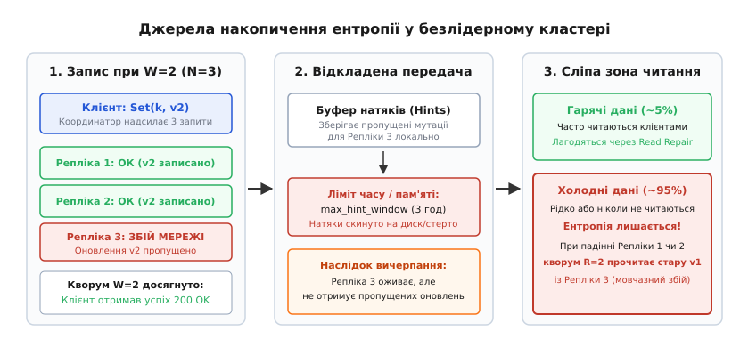
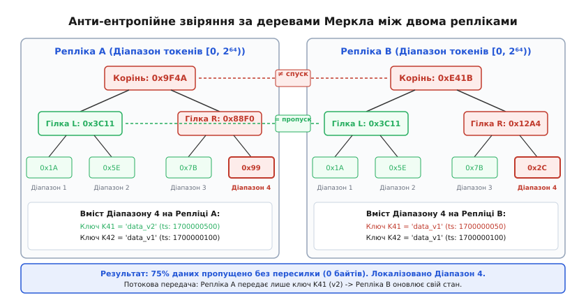
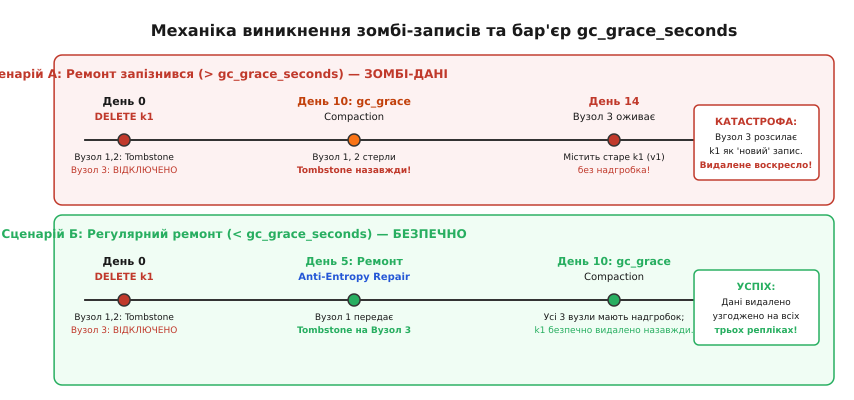

# Анти-ентропія та відновлення узгодженості

<preknowlist>
- [Кворуми та безлідерна реплікація](book:programming/quorum-and-leaderless) — фактор реплікації, кворумні читання та записи, погоджене хешування.
- [Реплікаційний лаг і сесійні гарантії](book:programming/replication-lag) — розсинхронізація реплік у часі та тимчасова неузгодженість.
- [Дерево Меркла](book:algorithms/merkle-tree) — ієрархічні хеш-дерева для швидкої перевірки цілісності та локалізації розбіжностей.
- [LSM-дерево](book:algorithms/lsm-tree) — незмінні дискові таблиці (SSTable), надгробки (tombstones) та фонове ущільнення (compaction).
- [Кінцева узгодженість на практиці](book:programming/eventual-consistency) — модель поступового збігання стану копій за відсутності нових записів.
</preknowlist>

Кластер розподіленого сховища з трьох реплік щодня обслуговує двадцять мільйонів операцій читання й запису. Через десятихвилинний збій мережевого комутатора третій вузол пропустив близько сорока тисяч записів. Запис відбувався з кворумом `W=2`, тому клієнти отримали успішні підтвердження, а координатор записав оновлення на два доступні вузли. Після відновлення зв'язку лише п'ять відсотків пропущених ключів запитуються повторно й лагодяться через механізм відновлення при читанні (read repair). Решта тридцять вісім тисяч записів — це «холодні» архівні дані, до яких клієнти не звертатимуться місяцями. Якщо в цей період відбудеться збій одного з двох актуальних серверів, кворумне читання `R=2` змушене буде звернутися до відновленого вузла, який містить застарілий стан, і клієнт отримає дані кількатижневої давнини, порушуючи базову гарантію надійності.

У цій точці виникає фундаментальна потреба: системі потрібен детермінований фоновий механізм, який без участі клієнтських запитів періодично виявляє розбіжності між репліками та синхронізує їхній стан.

Цей процес називається **анти-ентропією** (від грец. *anti-* «проти» + *en-* «в» + *trope* «поворот, перетворення»), а процедура узгодження копій — **відновленням узгодженості** (англ. *anti-entropy repair*).

---

## Анатомія ентропії: як і чому розходяться репліки

У класичній термодинаміці ентропія визначає ступінь безладу та деградації енергії в замкненій системі. У розподілених базах даних ентропія є мірою накопиченого розходження між станами реплік, що відповідають за спільні діапазони даних.

Щоб зрозуміти неминучість появи розбіжностей, розглянемо фізичні та архітектурні причини, через які вузли втрачають мутації:

```
1. Асинхронні або часткові збої під час запису (W < N):
   Коли клієнт виконує запис із кворумом W = 2 при факторі реплікації N = 3,
   координатор вважає операцію успішною, щойно відповіли два вузли.
   Якщо третій вузол у цей момент повільно відповідав через дисковий сплеск,
   зазнав втрати пакетів або перезавантажувався, він пропускає мутацію.

2. Асиметричні мережеві розриви та «сірі збої» (Gray Failures):
   Вузол може залишатися доступним для моніторингу через ICMP-пінги або протокол Gossip,
   але втрачати TCP-пакети на порту реплікації даних.
   Якщо запис у журнал випереджального запису (CommitLog) блокується диском на 1000 мс,
   координатор фіксує локальний таймаут і відкидає репліку зі списку успішних відповідей.

3. Вичерпання буфера відкладеної передачі (Hinted Handoff):
   Координатор намагається тимчасово зберегти пропущені записи у вигляді локальних «натяків» (hints).
   Проте буфер натяків має жорсткі межі за обсягом дискової пам'яті та часовим вікном (max_hint_window_in_ms, типово 3 години).
   Якщо вузол був недоступний довше цього ліміту, натяки відкидаються,
   щоб запобігти каскадному переповненню дисків на самому координаторі.

4. «Холодні дані» та сліпа зона відновлення при читанні (Read Repair):
   Read repair оновлює застарілі копії виключно під час виконання операції читання.
   Проте у реальних системах понад 90–95% збережених даних є «холодними» —
   до них клієнти можуть не звертатися тижнями або місяцями.
   Усі ці ключі накопичують розбіжності мовчазно.
```


*Три джерела накопичення ентропії: запис при W < N, скидання буфера натяків після тривалого збою та наявність масиву холодних даних, недосяжних для механізму read repair.*

Якщо покладатися лише на випадкові читання та тимчасові натяки, ступінь неузгодженості реплік із часом монотонно зростає. Падіння будь-якого сервера перетворює накопичену приховану ентропію на явну втрату актуальності даних під час кворумного читання.

---

## Три рівні відновлення: пасивний, відкладений та активний

Щоб протистояти деградації узгодженості, архітектура розподілених сховищ вибудовує трирівневу систему захисту:

```
+-------------------------------------------------------------------------------+
| 1. Пасивний рівень (Read Repair):                                            |
|    Спрацьовує: під час клієнтського читання.                                  |
|    Дія: координатор виявляє розбіжні версії серед опитаних R реплік           |
|    і фоново (або блокуюче) надсилає свіже значення вузлам із застарілим станом.|
|    Межа: відновлює лише гарячі дані, збільшує затримку читання.               |
+-------------------------------------------------------------------------------+
                                      ↓
+-------------------------------------------------------------------------------+
| 2. Відкладений рівень (Hinted Handoff):                                       |
|    Спрацьовує: одразу після короткочасного збою вузла (хвилини/години).       |
|    Дія: координатор зберігає мутації на своєму диску та відтворює їх,        |
|    щойно вузол повертається в онлайн.                                         |
|    Межа: діє лише в межах короткого вікна (max_hint_window); безсилий при     |
|    довгих простоях або падінні самого координатора.                           |
+-------------------------------------------------------------------------------+
                                      ↓
+-------------------------------------------------------------------------------+
| 3. Активний рівень (Active Anti-Entropy, AAE):                                |
|    Спрацьовує: за регулярним розкладом або за командою оператора.             |
|    Дія: репліки попарно повністю звіряють увесь масив даних у заданому        |
|    діапазоні токенів і синхронізують виявлені відмінності.                    |
|    Гарантія: повне ліквідування розбіжностей навіть на холодних даних.         |
+-------------------------------------------------------------------------------+
```

### Механіка Read Repair та його ціна

Під час кворумного читання з рівнем `R = 2` координатор надсилає одному вузлу запит на отримання повних даних (Data Read), а другому — запит на отримання компактного контрольного хешу (Digest Read).

Якщо обчислений дайджест даних першого вузла збігається з отриманим дайджестом другого, координатор повертає результат клієнту за один мережевий раунд. Якщо дайджести різняться, координатор запитує повні дані з другого вузла, порівнює часові мітки (timestamps), повертає клієнту новішу версію та ініціює операцію Read Repair:
- **Блокуючий Read Repair:** координатор чекає, поки відсталий вузол запише оновлення, і лише після цього повертає відповідь клієнту (збільшує затримку відповіді);
- **Асинхронний Read Repair:** координатор повертає відповідь негайно, а оновлення надсилає у фоновому потоці.

Попри очевидну корисність, Read Repair створює дві серйозні проблеми: по-перше, він генерує сплески затримок 99-го перцентиля (p99 latency) для клієнтів; по-друге, він повністю безсилий проти розбіжностей у 95% холодних ключів, до яких клієнти не звертаються.

### Механіка Hinted Handoff та його часові межі

Hinted Handoff призначений для швидкого згладжування коротких мережевих коливань або перезавантажень вузлів. Коли координатор не отримує відповіді від однієї з реплік під час запису, він формує спеціальний файл натяку (hint file) на своєму локальному диску. Натяк містить цільовий ідентифікатор вузла, ключ, мутацію та оригінальну часову мітку.

Координатор регулярно опитує стан вузла через протокол пліток (Gossip). Щойно вузол повертається до ладу, координатор відкриває потік передачі збережених натяків і відтворює їх на відновленому сервері.

Однак тримати натяки нескінченно неможливо. Якщо сервер вийшов з ладу на кілька діб, обсяг натяків на інших серверах заповнив би всі дискові накопичувачі кластера. Тому всі системи обмежують час генерації натяків параметром `max_hint_window_in_ms` (зазвичай 3 години). Після вичерпання цього вікна координатор припиняє записувати нові натяки для мертвого вузла. Коли такий вузол нарешті оживає через добу, він перебуває у глибоко застарілому стані, і єдиним порятунком для кластера стає активна анти-ентропія.

Історичний шлях виникнення цих механізмів від перших експериментів Xerox PARC у 1987 році до сучасних хмарних сховищ детально викладено у вставці [історія створення анти-ентропії в Xerox PARC](book:programming/anti-entropy-repair/hist-demers-epidemic.md).

---

## Декомпозиція кільця токенів та віртуальні вузли (vnodes)

У промислових безлідерних сховищах фізичний сервер не володіє одним гігантським неперервним сектором кільця. Натомість кожен сервер представляють десятками або сотнями віртуальних вузлів (vnodes), наприклад `num_tokens: 128` або `num_tokens: 256`, які рівномірно розподілені по всьому простору Murmur3.

Розглянемо кластер із 12 серверів із фактором реплікації `N = 3`, де кожен сервер має 128 vnodes. Усе кільце виявляється розбитим на `12 · 128 = 1536` невеликих діапазонів токенів.

```
Структура володіння токенами:
Кільце [0, 2⁶⁴ - 1] ──► 1536 діапазонів токенів (vnode ranges)
├── Діапазон #1: Репліки [Вузол 1, Вузол 4, Вузол 8]
├── Діапазон #2: Репліки [Вузол 2, Вузол 5, Вузол 9]
│   ...
└── Діапазон #1536: Репліки [Вузол 3, Вузол 7, Вузол 12]
```

Для вибору реплік кожного діапазону система використовує топологічну стратегію (NetworkTopologyStrategy). Алгоритм крокує за годинниковою стрілкою вздовж кільця токенів і обирає перші `N` фізичних серверів, гарантуючи, що копії одного діапазону опиняться в різних серверних стійках (Racks) та зонах доступності (Availability Zones).

Завдяки такій дрібній гранулярності процес анти-ентропії не намагається порівняти весь багатотерабайтний диск між двома серверами цілком. Натомість відновлення розбивається на 1536 незалежних мікро-сесій (Sub-range Repairs). Кожна мікро-сесія охоплює лише 1/1536 частину простору даних, що виключає блокування дисків та дозволяє кластеру паралельно лагодити сотні різних діапазонів на різних серверах одночасно.

---

## Парадигми запуску: Пакетна анти-ентропія проти неперервної (Batch vs Continuous AAE)

В архітектурі розподілених сховищ існують два принципово різні підходи до підтримки актуальності дерев Меркла:

```
1. Пакетна анти-ентропія на вимогу (Batch / On-Demand Repair — Cassandra, Dynamo, ScyllaDB):
   • Дерева Меркла не існують на диску постійно;
   • При запуску сесії ремонту сервер виконує послідовне сканування SSTable,
     будує тимчасове дерево Меркла в пам'яті, виконує обмін і знищує дерево;
   • Перевага: нульові накладні витрати CPU та пам'яті під час штатного клієнтського запису;
   • Недолік: дисковий сплеск читання під час процедури ремонту.

2. Неперервна фонова анти-ентропія (Continuous AAE — Riak KV, Bitcask):
   • Дерева Меркла зберігаються персистентно на диску та оновлюються в режимі реального часу;
   • Кожен клієнтський запис модифікує відповідний лист дерева на льоту;
   • Фонові демони безперервно порівнюють кореневі хеші в фоні;
   • Перевага: миттєва детекція розбіжностей без важкого сканування дисків;
   • Недолік: додаткове споживання CPU та дискових операцій на кожен клієнтський запис.
```

---

## Алгоритм звіряння на деревах Меркла: локалізація розбіжностей за `O(log M)`

Головний інженерний виклик активної анти-ентропії полягає в масштабі даних. Якщо кожен сервер кластера зберігає кілька терабайтів інформації (сотні мільйонів рядків), пряме передавання всіх ключів або їхніх контрольних сум мережею для порівняння заблокувало б мережеві інтерфейси на години й спричинило б катастрофічне вичерпання дискового I/O.

Розв'язанням цієї проблеми є використання дерев Меркла (англ. *Merkle Tree*), винайдених Ральфом Мерклом у 1979 році.

### Принцип квантування простору токенів

Для побудови дерева Меркла обраний vnode-діапазон токенів розбивається на `M = 2^h` однакових ливарних піддіапазонів (де `h` — фіксована глибина дерева, наприклад `h = 15`, що дає `32 768` листків):

```
Квантування кільця:
Діапазон [Token_Min, Token_Max]
├── Листок 0: [Token_Min, Token_Min + Step)
├── Листок 1: [Token_Min + Step, Token_Min + 2·Step)
│   ...
└── Листок (2^h - 1): [Token_Max - Step, Token_Max]
```

### Послідовне сканування та формування хешів

Коли вузол будує дерево Меркла, він виконує послідовне сканування локальних таблиць (SSTable) для відповідного діапазону. Оскільки дані в SSTable уже відсортовані за токенами ключів, сканування відбувається лінійно та з максимальною швидкістю читання накопичувача.

Під час сканування рушій використовує індекси первинних ключів та Bloom-фільтри кожної окремої SSTable, що дозволяє миттєво відкидати ті SSTable-файли, які гарантовано не містять записів для поточного vnode-діапазону токенів. Це скорочує фізичний обсяг прочитаних із накопичувача байтів у рази, вивільняючи ресурси контролера зберігання.

Щоб запобігти вимиванню гарячих даних із системного кешу сторінок (OS Page Cache) під час читання гігабайтів холодних SSTables, дисковий курсор використовує системний виклик `posix_fadvise` із прапорцем `POSIX_FADV_DONTNEED`. Це звільняє пам'ять сторінок одразу після обчислення хешу й не заважає паралельним клієнтським запитам.

Для кожного знайденого запису обчислюється криптографічний хеш від його вмісту:
```
Record_Hash = Hash( Key || Value || Timestamp || Is_Tombstone )
```

Усі записи, що потрапляють у числовий діапазон листка `i`, акумулюються у підсумковий хеш цього листка `Leaf_Hash[i]`.

Після наповнення всіх `M` листків дерево згортається знизу вгору:
```
Hash(Parent) = Hash( Hash(Left_Child) || Hash(Right_Child) )
```

Кореневий хеш `Hash(Root)` є компактним 16- або 32-байтним цифровим відбитком усього багатогігабайтного масиву даних діапазону.

```
                  [ Корінь: 0x9F4A ]               Рівень 0
                     /          \
           [ Гілка L: 0x3C11 ]  [ Гілка R: 0x88F0 ]    Рівень 1
              /         \          /         \
         [0x1A]        [0x5E]   [0x7B]     [0x99]   Рівень 2 (Листя)
         Діап 1        Діап 2   Діап 3     Діап 4
```

### Покроковий протокол діагностики між репліками

Коли координатор ініціює сесію анти-ентропії між двома репліками `A` і `B` для спільного діапазону токенів, взаємодія відбувається за строгою процедурою:

1. **Крок 1 (Порівняння коренів):**
   Репліки `A` і `B` обмінюються своїми кореневими хешами `Hash(Root_A)` та `Hash(Root_B)`.
   - Якщо `Hash(Root_A) == Hash(Root_B)`, репліки гарантовано мають повністю ідентичний стан у всьому діапазоні. Процес негайно завершується. Мережевий трафік склав лише кілька десятків байтів!

2. **Крок 2 (Спуск за розбіжністю):**
   Якщо корені не збігаються, координатор запитує хеші дітей першого рівня (`Left` та `Right`) від обох реплік.
   - Для тих пар гілок, де хеші рівні (`Hash(Left_A) == Hash(Left_B)`), координатор відкидає все піддерево — дані в цій половині простору однакові.
   - Для пар гілок із різними хешами (`Hash(Right_A) != Hash(Right_B)`) алгоритм рекурсивно спускається на наступний рівень.

3. **Крок 3 (Локалізація несинхронізованого листка):**
   Дійшовши до листків (рівень `h`), координатор отримує точний перелік числових піддіапазонів токенів, у яких виявлено розходження.


*Процедура звіряння дерев Меркла між Реплікою A та Реплікою B: гілка L повністю збігається і пропускається; розбіжність локалізовано до єдиного Листка 4, що скорочує обсяг переданих даних на 75%.*

Строгі математичні оцінки комунікаційної складності, виведення верхньої межі ймовірності колізій та формулу розрахунку оптимальної глибини дерева `h*` наведено у вставці [математичний аналіз складності та ймовірності колізій у деревах Меркла](book:programming/anti-entropy-repair/math-merkle-complexity.md).

---

## Потокова передача та вирішення конфліктів (Streaming)

Щойно несинхронізовані піддіапазони токенів локалізовано, система переходить до фази обміну реальними даними — потокової передачі (Streaming):

1. **Формування зрізу даних:**
   Кожна репліка вичитує зі своїх локальних сховищ (SSTable або B-дерев) усі пари «ключ — значення», що належать виявленим несинхронізованим листкам.

2. **Двосторонній обмін записами:**
   Репліка `A` передає репліці `B` свої записи, а репліка `B` паралельно передає репліці `A` свої записи для цих токенів через виділені високошвидкісні неблокуючі сокети.

3. **Компресія блоків та Zero-Copy передача:**
   Потоковий трафік стискається на льоту високошвидкісними алгоритмами LZ4 або ZSTD, що скорочує обсяг передачі ще у 2–4 рази. Використання системного виклику `sendfile` передає дані безпосередньо з дискового файлу в мережевий сокет без копіювання в простір користувача, мінімізуючи споживання процесора.

4. **Вирішення конфліктів на рівні окремих клітинок (Cell-Level LWW):**
   У реальних сховищах запис складається з багатьох колонок. Якщо на репліці `A` оновлено колонку `email`, а на репліці `B` паралельно оновлено колонку `phone`, LWW порівнює часові мітки для кожної клітинки окремо. Результатом стає об'єднаний рядок, де кожна колонка містить найсвіжіше значення.

5. **Робота з конфліктно-вільними типами даних (CRDT):**
   Для складних розподілених структур (наприклад, лічильників PN-Counters або множин Observed-Removed Sets) анти-ентропія застосовує операцію монотонного об'єднання напівґратки (Least Upper Bound, LUB). Для лічильників обирається максимум від позитивних і негативних значень, гарантуючи збіжність без втрати інкрементів.

6. **Проблема зсуву годинників (NTP Clock Skew):**
   При використанні Last-Write-Wins критичним фактором є синхронізація фізичних годинників серверів через NTP. Якщо годинник на одному із серверів поспішає на 500 мс вперед, його записи вважатимуться «новішими» навіть за реальні пізніші оновлення на інших серверах. Тому у високонавантажених кластерах обов'язково контролюється максимальне відхилення годинників (NTP offset < 5 мс).

7. **Фіксація в сховищі:**
   Переможні версії записуються як стандартні нові мутації (в LSM-рушіях вони скидаються в Memtable або формують нові незмінні SSTable-файли).

Повний працюючий рушій побудови дерева Меркла, алгоритм виявлення розбіжностей та синхронізацію даних мовами C та C++ реалізовано у вставці [практична реалізація рушія анти-ентропії на C та C++](book:programming/anti-entropy-repair/proj-merkle-anti-entropy.md).

---

## Скінченний автомат фаз сесії ремонту (Repair State Machine)

Життєвий цикл сесії анти-ентропії керується строгим автоматом станів, що гарантує стійкість до збоїв на кожному кроці:

```
[ INIT ] ──► [ SNAPSHOT ] ──► [ VALIDATION ] ──► [ DIFF ] ──► [ STREAMING ] ──► [ COMMIT ] ──► [ CLEANUP ]
   │              │                 │              │              │                 │              │
   └──────────────┴─────────────────┴──────────────┴──────────────┴─────────────────┴──────────────┘
                                                  │
                                            (Збій мережі)
                                                  ▼
                                             [ FAILED ] ──► [ ROLLBACK & CLEANUP ]
```

1. **Стан INIT:** Координатор перевіряє доступність усіх реплік, формує батьківську сесію (Parent Session) та захоплює блокування діапазону.
2. **Стан SNAPSHOT:** На всіх репліках створюються жорсткі посилання (Hardlinks) на поточні SSTables для забезпечення ізоляції знімка.
3. **Стан VALIDATION:** Паралельно на кожній репліці будуються дерева Меркла над створеним знімком.
4. **Стан DIFF:** Координатор порівнює дерева і складає план потокової передачі (Streaming Plan).
5. **Стан STREAMING:** Відбувається двостороння передача відсутніх SSTable-секцій.
6. **Стан COMMIT:** Двофазна фіксація — переведення SSTable у статус `Repaired`.
7. **Стан CLEANUP:** Звільнення блокувань, видалення тимчасових файлів знімків.

---

## Взаємодія з вторинними індексами та матеріалізованими представленнями

У розподілених базах даних вторинні індекси (Secondary Indexes) та матеріалізовані представлення (Materialized Views) зберігаються як окремі локальні або глобальні таблиці.

Коли репліка пропускає мутацію базової таблиці, її локальний вторинний індекс також виявляється несинхронізованим. Це призводить до небезпечного феномену — **фантомних результатів пошуку**:
- Пошук за первинним ключем повертає старе значення `v1`;
- Пошук за індексованим полем повертає новий запис `v2`.

Процес анти-ентропійного відновлення розв'язує цю проблему автоматично: щойно нова мутація надходить потоком від репліки-партнера, рушій сховища перехоплює запис і автоматично ініціює локальне оновлення всіх прив'язаних вторинних індексів (Index Rebuild Hook). Це гарантує повну внутрішню узгодженість між таблицею та її індексами на кожній машині кластера.

---

## Небезпека зомбі-даних і фатальний бар'єр `gc_grace_seconds`

У розподілених LSM-сховищах видалення даних — це не просто фізичне вилучення байтів із диска, а запис спеціального маркера видалення, який називається **надгробком** (англ. *Tombstone*). Надгробок містить ключ та часову мітку операції видалення.

Присутність надгробка необхідна для того, щоб під час кворумного читання або анти-ентропії факт видалення перемагав старіші версії даних, які все ще лежать на репліках, що відстали внаслідок мережевих збоїв.

Проте надгробки не можуть накопичуватися вічно — інакше база даних заповнила б весь дисковий простір маркерами видалення, а швидкість читання впала б через необхідність перевіряти мільйони порожніх записів. Під час фонової процедури ущільнення (Compaction) LSM-рушій фізично стирає надгробки разом із застарілими версіями даних.

У цій точці виникає найнебезпечніша пастка розподіленого зберігання — **воскресіння видалених даних** (англ. *Zombie Data Resurrection*):

```
Хронологія катастрофи виникнення зомбі-даних:

День 0:
• Ключ K1 записано на Репліках 1, 2 і 3.
• Клієнт виконує команду DELETE(K1).
• Репліки 1 і 2 записують Tombstone(K1) із міткою часу t1.
• Репліка 3 у цей час вимкнена через апаратний збій контролера живлення.

День 10 (Вичерпано ліміт gc_grace_seconds):
• На Репліках 1 і 2 запускається фонове ущільнення (Compaction).
• Оскільки надгробок старіший за 10 днів, Compaction фізично видаляє Tombstone(K1) з диска.
• На Репліках 1 і 2 запис K1 повністю зникає, наче його ніколи не існувало в природі.

День 14 (Повернення мертвого вузла):
• Репліка 3 вмикається після ремонту. Вона все ще містить старе значення K1 (без надгробка).
• Клієнт читає K1 або запускається сесія анти-ентропії.
• Репліки 1 і 2 не мають жодного запису для K1, а Репліка 3 має K1 зі старим timestamp.
• Оскільки значення K1 з Репліки 3 виглядає як "живий" запис проти порожнечі,
  система розповсюджує його на Репліки 1 і 2!
• КАТАСТРОФА: Видалений два тижні тому запис воскрес із мертвих!
```


*Порівняння двох сценаріїв: при запізнілому ремонті (> gc_grace_seconds) видалені дані воскресають як зомбі; при регулярному ремонті (< gc_grace_seconds) надгробки безпечно передаються на всі репліки до фізичного очищення.*

Щоб запобігти появі зомбі-даних, у всіх NoSQL-сховищах введено параметр **`gc_grace_seconds`** (типово 864 000 секунд = 10 діб). Він визначає мінімальний час життя надгробка на диску до моменту, коли Compaction отримає право його знищити.

Звідси випливає фундаментальне залізне правило експлуатації розподілених баз даних:

> **Залізне правило ремонту:**
> Активне анти-ентропійне відновлення (Anti-Entropy Repair) **зобов'язане** успішно виконуватися на кожній репліці кластера принаймні один раз протягом періоду `gc_grace_seconds`.

Якщо вузол був відключений від кластера довше, ніж триває `gc_grace_seconds`, його **суворо заборонено** просто вмикати назад у мережу: його локальні каталоги даних мають бути повністю стерті, а вузол мусить пройти процедуру чистої синхронізації з нуля (Bootstrap / Rebuild).

---

## Повне проти інкрементального відновлення (Full vs Incremental Repair)

У перших поколіннях розподілених баз даних процедура анти-ентропії виконувала так званий **повний ремонт** (Full Repair):
- Вузол сканував **усі** SSTable на диску для заданого діапазону;
- Будував дерево Меркла над сотнями гігабайтів даних;
- Порівнював його із сусідами.

Головний недолік повного ремонту — колосальне невиправдане навантаження на підсистему введення-виведення (I/O Disk Thrashing). Якщо 98% даних у базі є незмінними архівами минулих місяців, повний ремонт змушений раз за разом зчитувати гігабайти тих самих SSTable з накопичувачів лише для того, щоб переконатися, що їхні хеші не змінилися.

Для усунення цієї проблеми було розроблено **інкрементальне відновлення** (Incremental Repair):

```
+-----------------------------------------------------------------------------------+
| 1. Сегрегація SSTable за метаданими:                                              |
|    Усі SSTable на диску позначаються міткою repairedAt:                           |
|    • Unrepaired (repairedAt = 0: свіжі файли, записані клієнтами або Compaction);  |
|    • Repaired (repairedAt = timestamp: файли, що вже пройшли успішний ремонт).    |
+-----------------------------------------------------------------------------------+
                                         ↓
+-----------------------------------------------------------------------------------+
| 2. Анти-ентропія виключно над Unrepaired даними:                                  |
|    Дерева Меркла будуються лише для невідремонтованих SSTable.                    |
|    Обсяг дискового читання скорочується з терабайтів до кількох гігабайтів.        |
+-----------------------------------------------------------------------------------+
                                         ↓
+-----------------------------------------------------------------------------------+
| 3. Двофазна фіксація сесії ремонту (Repair Session Commit):                       |
|    Коли всі репліки успішно синхронізували відмінності для діапазону,             |
|    координатор призначає глобальний ідентифікатор сесії Repair-ID                 |
|    та переводить відповідні SSTable у статус Repaired на всіх вузлах одночасно.   |
+-----------------------------------------------------------------------------------+
```

### Протокол Parent/Child Repair Sessions

Для запобігання гонкам даних під час інкрементального ремонту використовується дворівнева координація сесій:
1. **Батьківська сесія (Parent Repair Session):** координатор резервує заданий діапазон токенів на всіх репліках та фіксує перелік невідремонтованих SSTables.
2. **Дочірні сесії (Child Repair Sessions):** простір токенів розбивається на тисячі дрібних піддіапазонів, для кожного з яких будується компактне дерево Меркла.
3. **Двофазна фіксація (Two-Phase Commit):** після успішного завершення всіх дочірніх сесій координатор розсилає команду `CommitRepair`. Репліки оновлюють метадані SSTable, переносячи їх у категорію `Repaired`.

Інкрементальний ремонт зменшує дискове навантаження на 80–90%, дозволяючи запускати анти-ентропію безперервно навіть під високим клієнтським навантаженням.

---

## Мультидатацентрові кластери та локалізація трафіку (Cross-DC Repair)

У георозподілених системах репліки одного токена зазвичай розташовуються у різних географічних зонах або датацентрах (наприклад, 3 репліки у датацентрі `eu-west` та 3 репліки у `us-east`).

Прямий запуск анти-ентропії між усіма 6 репліками одночасно створює дві критичні проблеми:
- **Міжрегіональний трафік (Cross-Region Egress Cost):** передача гігабайтів SSTables через публічний інтернет або виділені міжконтинентальні канали коштує значних коштів.
- **Вплив затримок WAN-мережі:** через затримку 100–150 мс між Європою та США сесія ремонту триває в десятки разів довше.

Для оптимізації застосовують **Datacenter-Aware Repair (локальний ремонт)**:
1. **Фаза 1 (Внутрішньокластерна синхронізація):** вузли всередині `eu-west` виконують швидку локальну анти-ентропію між собою по високошвидкісній мережі 10–40 Гбіт/с. Паралельно вузли всередині `us-east` синхронізуються між собою.
2. **Фаза 2 (Міжрегіональний міст):** призначаються два вузли-делегати (по одному від кожного ДЦ), які обмінюються деревами Меркла через трансатлантичний канал і передають єдину зведену дельту, яка потім розповсюджується всередині кожного датацентру локально.

Це скорочує міжрегіональний трафік у `N` разів і захищає WAN-канали від перевантаження.

---

## Спостережуваність та діагностика анти-ентропії (Observability & Metrics)

В експлуатації розподілених баз даних стан анти-ентропії контролюється через JMX/Prometheus метрики та аналіз системних журналів:

```
Ключові метрики анти-ентропії (JMX / Prometheus):
• RepairTime (Timer):
  Тривалість успішних сесій відновлення для кожного діапазону токенів.
• ActiveRepairTasks (Gauge):
  Кількість паралельних потоків побудови дерев Меркла та передачі даних.
• EstimatedKeysToRepair (Gauge):
  Оцінка кількості неузгоджених ключів, виявлених під час Merkle Tree Diff.
• OutboundStreamThroughput (Meter):
  Швидкість передачі SSTable у мережу (МБ/с) з урахуванням лімітера швидкості.
```

### Простеження сесії через системні журнали (Logs Trace)

Типовий життєвий цикл сесії анти-ентропії в системному журналі виглядає так:

```
INFO  [Repair#1:1] RepairSession: [repair #7a9f8b1c] Starting repair session for range (-4611686018427387904, -2305843009213693952] with endpoints [10.0.0.1, 10.0.0.2, 10.0.0.3]
DEBUG [Repair#1:1] MerkleTree: Requesting tree generation from node 10.0.0.2 (depth=15, leaves=32768)
DEBUG [AntiEntropyStage:2] MerkleTree: Tree built for keyspace 'ecommerce', table 'orders' in 342ms. Root: 0x9f4a7b12
INFO  [Repair#1:1] RepairSession: [repair #7a9f8b1c] Diff identified: 2 divergent ranges found out of 32768 subranges
INFO  [StreamStage:3] StreamResultFuture: [Stream #c41e89] Streaming 3 SSTable sections (18.4 MB) from 10.0.0.1 to 10.0.0.3
INFO  [Repair#1:1] RepairSession: [repair #7a9f8b1c] Session completed successfully in 1420ms. SSTables committed to 'Repaired' status.
```

Команди адміністратора для оперативного контролю:
- `nodetool netstats` — показує активні процеси потокової передачі SSTables, прогрес передачі байтів та адреси вузлів-партнерів;
- `nodetool compactionstats` — відображає прогрес ущільнення та обробки надгробків;
- `nodetool tpstats` — дозволяє виявити переповнення пулу потоків `AntiEntropyStage` або блокування черги запису.

---

## Крайові випадки та поведінка при екстремальних збоях

1. **Аварійний обрив зв'язку під час потокової передачі (Mid-Stream Abort):**
   Якщо мережа падає в момент, коли репліка `B` отримала 80% нової SSTable від `A`, репліка `B` не може зафіксувати частковий файл, оскільки це призведе до пошкодження індексу первинних ключів. Усі неповні файли у тимчасовому каталозі `.tmp` негайно видаляються, батьківська сесія ремонту переводиться у стан `FAILED`, а зарезервовані діапазони токенів звільняються. Наступний цикл анти-ентропії почне порівняння діапазону наново з чистим станом.

2. **Зміна топології під час активного ремонту (Node Join / Decommission):**
   Коли в кластер додається новий сервер або видаляється старий, кільце погодженого хешування змінює межі діапазонів токенів (Range Movement). Якщо в цей момент виконується сесія анти-ентропії, координатор скасовує поточні сесії для змінених діапазонів через генерацію винятку `TokenRangeMovementException`. Ремонт відновлюється лише після того, як протокол Gossip зафіксує стабільний стан нової топології (`NORMAL`).

3. **Конфлікт між Compaction та Anti-Entropy Repair:**
   Під час фонового ущільнення LSM-рушій видаляє старі SSTables і створює нові об'єднані файли. Щоб анти-ентропія не намагалася читати файли, які видаляються ущільненням, рушій захоплює блокування читання (Read Lock) на рівні посилань файлової системи (File References Refcount). Файли не видаляються з диска фізично, поки сесія генерації дерева Меркла не завершить їхнє сканування.

> 🔧 **Навіщо це на практиці.**
> 
> 1. **Захист від шторму відновлення (Repair Storm):** Ніколи не запускайте команду повного ремонту (`nodetool repair`) на всьому кластері одночасно. Це спричинить одночасне перечитування накопичувачів на всіх серверах і різкий сплеск затримок клієнтських запитів (p99 latency spike). Застосовуйте спеціалізовані планувальники (наприклад, Cassandra Reaper або ScyllaDB Repair Manager), які розбивають простір токенів на тисячі дрібних сегментів і ремонтують їх послідовно з обмеженням швидкості передачі (rate limiting).
> 2. **Правило розрахунку вікна ремонту:** Якщо `gc_grace_seconds = 10 днів`, плануйте повний цикл обходу всіх токенів кластера максимум на **7 днів**. Запас у 3 дні гарантує, що у разі виникнення тимчасових збоїв мережі чи високого навантаження оператори встигнуть перезапустити сесію ремонту до перетину дедлайну появи зомбі-даних.
> 3. **Вимкнення вузлів на тривалий термін:** Якщо сервер виводиться на регламентне обслуговування більше ніж на `gc_grace_seconds` (наприклад, заміна апаратних компонентів або перенесення стійки), перед поверненням у кластер обов'язково виконайте повне очищення каталогу даних (`rm -rf data/*`) та запустіть процедуру ініціалізації з нуля через `nodetool rebuild`.
> 4. **Налаштування лімітів пам'яті та дискового трафіку:** У конфігураційному файлі `cassandra.yaml` завжди встановлюйте `stream_throughput_outbound_megabits_per_sec: 200` (для локальних мереж 10 Гбіт/с) або `50` (для 1 Гбіт/с) та обмежуйте пам'ять сесій через `repair_session_space_in_mb: 64`, щоб уникнути помилок `OutOfMemoryError` при побудові глибоких дерев Меркла.

---

## Зведена таблиця механізмів відновлення

| Характеристика | Відновлення при читанні (Read Repair) | Відкладена передача (Hinted Handoff) | Повна анти-ентропія (Full AAE) | Інкрементальна анти-ентропія (Incremental AAE) |
| :--- | :--- | :--- | :--- | :--- |
| **Тригер запуску** | Клієнтський запит читання | Повернення вузла після короткого збою | Розклад / вручну адміністратором | Безперервний фоновий планувальник |
| **Охоплення даних** | Лише запитуваний ключ (гарячі дані) | Пропущені мутації за вікно `max_hint_window` | Усі ключі в діапазоні токенів | Лише нові (невідремонтовані) SSTable |
| **Вплив на клієнтську латентність** | Прямий (збільшує p99 читання) | Нульовий (фонове досилання) | Непрямий (конкуренція за I/O та CPU) | Мінімальний (сегментований фоновий I/O) |
| **Ефективність для холодних даних** | Нульова (холодні ключі не читаються) | Нульова (якщо збій тривав довше ліміту) | 100% повна синхронізація | 100% повна синхронізація |
| **Захист від зомбі-даних** | Слабкий (лише для прочитаних ключів) | Слабкий (не захищає при тривалих простоях) | Абсолютний (при запуску < `gc_grace`) | Абсолютний (при запуску < `gc_grace`) |
| **Дискове та мережеве навантаження** | Мінімальне (одиничні ключі) | Низьке (послідовний потік мутацій) | Високе (перечитування всіх SSTable) | Помірне (перечитування лише дельти) |

---

## Підсумок: анти-ентропія як гарант термодинамічного порядку

Анти-ентропійне відновлення є фундаментальним наріжним каменем безлідерних та кінцево-узгоджених сховищ. У той час як кворумні операції та механізми hinted handoff зосереджені на миттєвому обслуговуванні клієнтських запитів у реальному часі, анти-ентропія діє як невидимий глобальний стабілізатор:

- Вона ізолює локалізацію розбіжностей через дерева Меркла, скорочуючи обсяг діагностичного мережевого трафіку до `O(log M)`;
- Вона ліквідує накопичену ентропію на холодних масивах даних, які ніколи не потрапляють під дію механізму read repair;
- Вона стоїть на варті безпеки операцій видалення, виступаючи єдиним надійним захисним бар'єром проти катастрофічного воскресіння зомбі-даних після спрацювання `gc_grace_seconds`.
