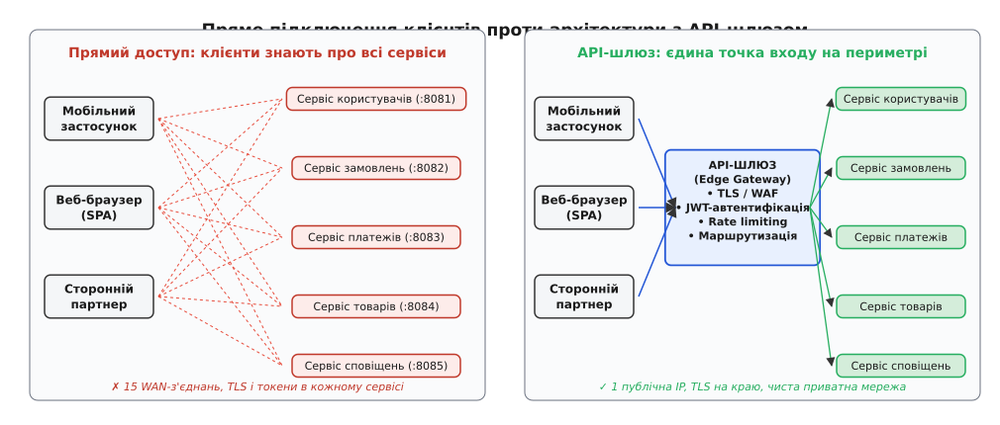
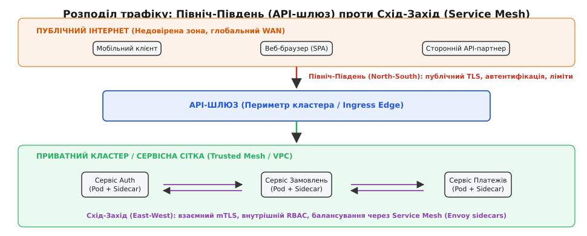
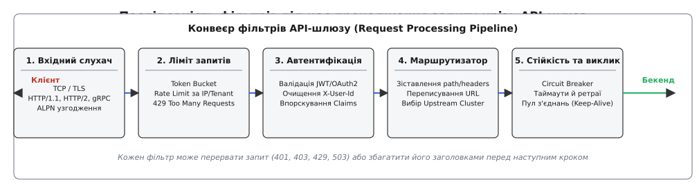
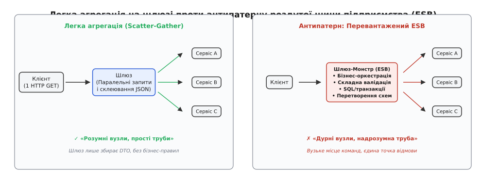

# API-шлюз: єдина вхідна брама розподіленої системи

<preknowlist>
- [Зворотний проксі](topic:programming/reverse-proxy) — пересилання вхідних клієнтських L7-запитів до внутрішніх серверів без прямого доступу клієнта до бекенда.
- [Омани розподілених обчислень](topic:programming/distributed-fallacies) — мережа завжди має затримку, губить пакети та страждає від часткових відмов.
- [Таймаути й бюджет часу](topic:programming/timeouts-deadlines) — обмеження тривалості очікування мережевої відповіді для запобігання каскадному блокуванню ресурсів.
- [Запобіжник (Circuit Breaker)](topic:programming/circuit-breaker-pattern) — розрив ланцюга викликів до несправного сервісу для швидкої відмови без накопичення черги.
</preknowlist>

Користувач відкриває екран мобільного банкінгу. Щоб відмалювати головну сторінку, застосунку потрібні п'ять різних порцій даних: поточний залишок на рахунках, список останніх десяти транзакцій, персоналізовані кешбек-пропозиції, лічильник непрочитаних сповіщень та актуальний курс валют. У мікросервісній системі ці дані належать п'яти повністю незалежним сервісам, розгорнутим усередині приватного кластера на власних портах.

Якщо мобільний телефон звертається до кожного сервісу напряму через публічний інтернет, система миттєво стикається з каскадом фізичних та архітектурних проблем.

По-перше, у мобільній мережі затримка кругового обігу пакетів (англ. *round-trip time*, RTT) становить від 50 до 150 мілісекунд. П'ять послідовних або навіть частково паралельних WAN-запитів через стільникову вежу змушують екран завантажуватися довше секунди — користувач бачить смикання інтерфейсу та порожні блоки.

По-друге, кожен внутрішній мікросервіс мусить мати власну публічну IP-адресу, валідний SSL/TLS-сертифікат, самостійно перевіряти підпис криптографічного токена доступу, вести захист від DDoS-атак та обмежувати частоту запитів. Варто розробнику одного другорядного сервісу пропозицій забути підключити бібліотеку автентифікації — і внутрішня база даних виявляється відкритою на весь інтернет.

По-третє, клієнт стає жорстко прив'язаним до топології бекенда: якщо інженери вирішать розділити монолітний сервіс замовлень на два окремі мікросервіси чи змінити протокол з HTTP/1.1 на gRPC, сотні тисяч застарілих мобільних застосунків у користувачів просто перестануть працювати.


*Зліва: прямий доступ породжує заплутане павутиння з'єднань через повільну публічну мережу та змушує дублювати безпеку в кожному сервісі. Справа: API-шлюз створює єдині двері на захищеному периметрі, ізолюючи внутрішню мережу.*

## Єдині двері на периметрі

Щоб розірвати пряму залежність клієнта від внутрішньої мережі, на зовнішньому периметрі кластера ставлять спеціалізований посередник — **API-шлюз** (англ. *API Gateway*, від *gateway* — брама, шлюз, та грец. *perimetros* — зовнішня окружність, межа).

Шлюз бере на себе роль єдиної точки входу (англ. *single point of entry*). Для зовнішнього світу вся складна розподілена система з десятків чи сотень мікросервісів виглядає як один віртуальний монолітний сервер за єдиним доменним ім'ям `api.example.com`. Клієнтський застосунок знає лише цей єдиний хост і надсилає запити за зрозумілими уніфікованими адресами на кшталт `/api/v1/accounts` або `/api/v1/orders`.

Шлюз приймає вхідне з'єднання, перевіряє його легітимність, застосовує правила безпеки й лише після цього пересилає запит через швидку локальну мережу дата-центру (де затримка RTT становить менше 1 мілісекунди) до відповідного мікросервісу.

Історично ця концепція виросла зі звичайних зворотних проксі-серверів та важких корпоративних сервісних шин епохи SOA ([як розвивалася концепція шлюзів від зворотного проксі та важких корпоративних шин до сучасних легких рішень](topic:programming/api-gateway/hist-api-gateway-origins.md)).

## Північ-Південь проти Схід-Захід: анатомія трафіку

У сучасній системній архітектурі трафік чітко розділяють за просторовими напрямками, оскільки довіра до клієнта кардинально різниться залежно від його положення відносно периметра.

**Трафік «Північ-Південь» (North-South traffic)** — це потік даних між зовнішніми клієнтами (браузери, смартфони, сторонні API-партнери) та внутрішньою інфраструктурою компанії.
* Зовнішнє середовище вважається ворожим і ненадійним: IP-адреси динамічні, пакети можуть перехоплюватися у відкритих Wi-Fi мережах, клієнти генерують невалідний або шкідливий трафік (DDoS, SQL-ін'єкції).
* Головні вимоги тут: завершення публічного TLS-шифрування, перевірка Bearer-токенів користувачів, захист від перевантаження (Rate Limiting), трансляція публічних форматів даних і суворий фаєрвол вебзастосунків (WAF).
* Саме цей потік контролює **API-шлюз**.

**Трафік «Схід-Захід» (East-West traffic)** — це комунікація між самими мікросервісами всередині приватного кластера або дата-центру (наприклад, сервіс замовлень викликає сервіс складського обліку чи платіжний шлюз).
* Внутрішнє середовище захищене фізичним або віртуальним периметром (VPC, Private Subnet), проте вимагає принципу нульової довіри (англ. *Zero Trust*): компрометація одного контейнера не повинна відкривати доступ до всіх інших.
* Тут потрібні інші інструменти: взаємне шифрування сертифікатами (mTLS), внутрішнє виявлення сервісів (Service Discovery), тонкий RBAC на рівні методів gRPC та збір розподілених слідів (Distributed Tracing).
* Цей потік обслуговують процеси-помічники сервісної сітки (**Service Mesh Sidecars**).


*Трафік Північ-Південь перетинає ненадійний кордон через API-шлюз. Трафік Схід-Захід циркулює між внутрішніми контейнерами через локальні проксі-sidecar сервісної сітки.*

## Зняття наскрізного навантаження (Gateway Offloading)

Найбільша практична цінність шлюзу полягає в тому, що він централізує наскрізну інфраструктурну функціональність (англ. *cross-cutting concerns*), звільняючи команди розробників сервісів від повторного написання однакового коду в кожному репозиторії. Цей архітектурний прийом називають **розвантаженням на шлюзі** (англ. *Gateway Offloading*).


*Конвеєр фільтрів шлюзу послідовно виконує транспортну термінацію, захист від спаму, криптографічну перевірку та маршрутизацію до бекенда.*

Розгляньмо кожен крок цього конвеєра детально.

### 1. Термінація TLS та оптимізація протоколів
Встановлення захищеного з'єднання TLS (англ. *Transport Layer Security*) вимагає виконання криптографічного рукостискання (RSA або ECDHE), передачі сертифікатів та узгодження симетричних ключів шифрування. Це затратна операція за процесорним часом.

Шлюз бере все криптографічне навантаження на себе:
* Він завершує публічний TLS-сеанс на своїх оптимізованих процесорних ядрах із підтримкою апаратних інструкцій AES-NI.
* Узгоджує сучасні транспортні протоколи через ALPN (HTTP/2, HTTP/3 QUIC) із клієнтом, стискає відповіді алгоритмами Gzip або Brotli.
* До внутрішніх сервісів шлюз відкриває постійні пули з'єднань із підтримкою збереження активності (англ. *HTTP Keep-Alive*), завдяки чому на кожен запит усередині мережі витрачається нуль мілісекунд на повторні TCP/TLS рукостискання.

### 2. Централізована автентифікація та очищення заголовків
Без шлюзу кожен мікросервіс змушений отримувати публічні ключі авторизаційного сервера (JWKS), парсити складні JWT-токени (англ. *JSON Web Token*) та перевіряти підписи. Якщо в системі працює 50 мікросервісів, написаних різними мовами (Go, Java, Python, Node.js), це вимагає підтримки 50 копій бібліотек безпеки з потенційними вразливостями в кожній.

Шлюз перетворює автентифікацію на єдиний фільтр на краю системи:
1. Клієнт надсилає заголовок `Authorization: Bearer <jwt_token>`.
2. Шлюз перевіряє криптографічний підпис токена, термін його дії (`exp`) та аудиторію (`aud`).
3. Якщо токен недійсний, шлюз негайно повертає код `401 Unauthorized`, навіть не торкаючись внутрішніх сервісів і зберігаючи їхні обчислювальні ресурси.
4. Якщо токен валідний, шлюз витягує з нього корисні дані (ідентифікатор користувача, tenant, список ролей).
5. **Очищення та впорскування (Sanitization & Injection):** Шлюз безумовно видаляє з вхідного запиту будь-які клієнтські заголовки на кшталт `X-User-Id` чи `X-Is-Admin` (щоб запобігти атакам із підробкою особи) та впорскує власні перевірені внутрішні заголовки:
   ```http
   X-Authenticated-User: usr_89412
   X-Tenant-Id: enterprise_corp_42
   X-User-Roles: billing_admin,editor
   ```
6. Внутрішній мікросервіс більше не займається криптографією — він просто довіряє значенню `X-Authenticated-User`, оскільки знає, що доступ до нього можливий виключно через шлюз.

> 🔧 **Навіщо це.** Завдяки підняттю перевірки токенів на край системи, внутрішні мікросервіси повністю позбавляються залежностей від зовнішніх серверів авторизації. Якщо завтра компанія вирішить замінити протокол OAuth2 на Passkeys чи змінити постачальника ідентифікації з Auth0 на Keycloak, зміниться конфігурація лише одного компонента — API-шлюзу, а код ста внутрішніх сервісів залишиться недоторканим.

### 3. Захист від перевантаження та обмеження частоти (Rate Limiting)
Якщо зловмисник запускає скрипт підбору паролів або партнерський застосунок через помилку в циклі надсилає тисячі запитів на секунду, некерований наплив трафіку покладе бази даних бекенда.

Шлюз реалізує захист за алгоритмом **маркерного кошика** (англ. *Token Bucket*) або **дірявого відра** (англ. *Leaky Bucket*):
* Для кожного клієнта (за IP-адресою, API-ключем або ідентифікатором організації) ведеться лічильник доступних запитів.
* Стан лічильників зберігається в локальній пам'яті шлюзу або в швидкому розподіленому сховищі Redis (для синхронізації між кількома репліками шлюзу).
* Щойно ліміт вичерпано, шлюз миттєво відсікає надлишковий трафік відповіддю `429 Too Many Requests` із заголовком `Retry-After: 5`, не створюючи жодного навантаження на глибинні шари архітектури.

### 4. Наскрізне трасування (Correlation ID)
Коли один клієнтський клік викликає ланцюжок із шести викликів між різними сервісами, відстежити причину помилки в загальних логах стає неможливо без єдиного ідентифікатора.

Шлюз перевіряє наявність заголовка розподіленого сліду за стандартом W3C Trace Context (`traceparent`) або генерує новий унікальний `X-Request-ID: req_c98a1f72b`. Цей ідентифікатор передається в усі наступні мікросервіси та записується в кожен рядок структурованих логів, пов'язуючи історію проходження запиту в єдину картину.

## Динамічна маршрутизація та виявлення сервісів

Шлюз має знати, куди саме спрямувати вхідний HTTP-запит. Маршрутизація спирається на гнучкі правила, які зіставляють атрибути запиту з цільовими групами бекенд-серверів (Upstream Clusters).

### Критерії зіставлення (Route Matching)
1. **Префікс або шаблон шляху (Path Prefix / Regex):**
   * `/api/v1/users/*` ──► `users-service`
   * `/api/v1/orders/*` ──► `orders-service`
2. **HTTP-метод:**
   * `GET /api/v1/reports` ──► `reports-read-replica`
   * `POST /api/v1/reports` ──► `reports-writer-service`
3. **Заголовки запиту (Header-based Routing):**
   * Запит із заголовком `X-Beta-Tester: true` шлюз маршрутизує на експериментальну канаркову версію сервісу (`orders-service:v2`), тоді як весь решта трафіку йде на стабільну версію (`orders-service:v1`).
4. **Багатоорендність (Multi-tenant Routing):**
   * Запит до `tenant-a.api.example.com` автоматично скеровується до ізольованого пулу подів конкретного корпоративного клієнта.

### Алгоритми балансування навантаження
Коли цільовий мікросервіс масштабовано до десяти екземплярів, шлюз обирає конкретний вузол за одним із перевірених алгоритмів:
* **Кільцевий перебір (Round Robin):** Рівномірний послідовний розподіл нових з'єднань між екземплярами.
* **Найменша кількість активних запитів (Weighted Least Request):** Запит надсилається тому поду, який наразі обробляє найменше паралельних викликів, що вирівнює час відповіді при нерівномірних затримках.
* **Консистентне хешування (Consistent Hashing / Ring Hash):** Хеш від ідентифікатора користувача чи кукі сесії прив'язує клієнта до конкретного екземпляра бекенда, максимізуючи ефективність локального L1/L2 кешу в пам'яті процесу.

### Переписування шляхів (Path Rewriting)
Публічний контракт API часто не збігається з внутрішньою структурою сервісів. Наприклад, назовні опубліковано гарний шлях `/api/v1/checkout`, але внутрішній контейнер очікує звернення до кореневого ендпоінта `/process`. Шлюз виконує безшовну заміну URL (URL Rewrite), приховуючи внутрішні технічні деталі реалізації від клієнтів.

### Інтеграція з реєстрами сервісів (Service Discovery)
У динамічних хмарних середовищах на кшталт Kubernetes IP-адреси подів постійно змінюються: контейнери перезапускаються, масштабуються горизонтально або переносяться на інші фізичні ноди.

API-шлюз не зберігає жорстко зашитих IP-адрес. Він підписується на події контролера кластера (Kubernetes Endpoints / EndpointSlice або Consul/Eureka):
```
1. Сервіс замовлень масштабується: додано под 10.244.3.45:8080.
2. Реєстр сервісів публікує подію оновлення списку адрес.
3. Шлюз через механізм xDS (Endpoint Discovery Service) за лічені мілісекунди
   додає нову IP-адресу у свій внутрішній пул балансування Round-Robin.
4. Жоден пакет не втрачається, жоден перезапуск шлюзу не потрібен.
```

Детальніше про порівняння внутрішніх рушіїв, архітектурних класів і протоколів площини керування читайте у вставці [порівняння архітектурних класів шлюзів, моделей рушіїв та їхніх компромісів](topic:programming/api-gateway/comp-api-gateways.md).

## Агрегація на шлюзі (Gateway Aggregation) проти пастки ESB

Повернімося до мобільного застосунку з п'ятьма блоками даних на головному екрані. Ми з'ясували, що надсилати 5 запитів через стільникову мережу повільно. Логічне рішення — навчити шлюз приймати **один** клієнтський запит `GET /api/v1/dashboard`, самостійно робити 5 паралельних швидких викликів у внутрішній мережі дата-центру, об'єднувати отримані JSON-документи в один спільний DTO та повертати його мобільному телефону за один мережевий стрибок.

Цей прийом називається **агрегацією на шлюзі** (англ. *Gateway Aggregation* або *Scatter-Gather at the Edge*).

```
Клієнт (1 виклик через WAN) ──► Шлюз
                                  │
      ┌───────────────────────────┼───────────────────────────┐
      ▼ (паралельно по LAN)       ▼ (паралельно по LAN)       ▼ (паралельно по LAN)
   Сервіс Рахунків             Сервіс Транзакцій           Сервіс Пропозицій
   (10 мс)                     (15 мс)                     (12 мс)
      │                           │                           │
      └───────────────────────────┼───────────────────────────┘
                                  ▼
                    Шлюз склеює єдиний JSON (15 мс) ──► Відповідь клієнту
```

Але тут криється одна з найнебезпечніших пасток системного дизайну: **переродження шлюзу в монолітну корпоративну сервісну шину (ESB Antipattern)**.


*Легка агрегація лише склеює DTO без бізнес-правил. Перевантажений ESB концентрує в собі бізнес-оркестрацію і стає головним гальмом розробки.*

### Де проходить межа дозволеного?
* **Легка агрегація (дозволено):** Шлюз діє як простий диспетчер DTO. Він паралельно викликає три ендпоінти й склеює три JSON-об'єкти в одну спільну відповідь. У ньому немає умовної бізнес-логіки, немає звернень до бази даних, немає валідації бізнес-правил.
* **Пастка ESB (заборонено):** Шлюз починає приймати бізнес-рішення: «Якщо користувач має преміум-статус у сервісі A, викликати сервіс B зі знижкою 10%, перерахувати податок за правилами країни X, записати аудит-лог у таблицю Y і трансформувати валюту».

Щойно бізнес-логіка потрапляє в код шлюзу, починається деградація системи:
1. **Команда шлюзу стає організаційним затором (bottleneck):** Будь-яка зміна в логіці замовлень або розрахунку кешбеку вимагає правки коду шлюзу. Розробники мікросервісів більше не можуть самостійно викатувати фічі — вони чекають на реліз платформного шлюзу.
2. **Розмиття меж відповідальності:** Бізнес-правила виявляються розмазаними між кодом сервісу та кодом шлюзу. Ніхто в компанії більше не може точно сказати, чому користувач отримав саме таку ціну.
3. **Падіння надійності:** Помилка в скрипті трансформації одного другорядного віджета призводить до падіння всього шлюзу, блокуючи авторизацію та платежі для всієї компанії.

Золоте правило мікросервісної архітектури: **«Розумні кінцеві вузли, прості канали зв'язку» (Smart endpoints, dumb pipes)**. Шлюз має залишатися швидким і нейтральним трубопроводом.

Якщо клієнтам справді потрібна глибока спеціалізована трансформація даних, створення унікальних агрегатів під конкретні екрани чи підтримка специфічних версій — цю задачу виносять в окремий шар **BFF (Backend-For-Frontend)**.

## Розведення понять: з чим не можна плутати API-шлюз

Через схожі назви в літературі часто виникає плутанина між трьома принципово різними концепціями:

1. **API-шлюз (API Gateway у distributed systems) проти патерна «Шлюз» (Gateway у PoEAA Мартіна Фаулера):**
   * *API Gateway* — це **інфраструктурний вузол** мережі, окремий процес або кластер проксі-серверів на периметрі дата-центру.
   * *Gateway (PoEAA)* — це **об'єктний патерн проектування в коді** (на рівні класів і інтерфейсів), що загортає виклик складної зовнішньої бібліотеки чи чужої платіжної системи (наприклад, клас `StripePaymentGateway`), щоб ізолювати доменну модель програми від деталей чужого API.
2. **API-шлюз проти BFF (Backend-For-Frontend):**
   * *API-шлюз* — один на всю компанію. Він універсальний, нейтральний, належить платформній інфраструктурній команді та оперує загальними системними контрактами.
   * *BFF* — власний мікросервіс конкретної продуктової команди (наприклад, `iOS-BFF` або `SmartTV-BFF`). Він створюється під конкретний користувацький інтерфейс і живе в одному репозиторії з клієнтським застосунком.
3. **API-шлюз проти сервісної сітки (Service Mesh Ingress):**
   * *API-шлюз* орієнтований на бізнес-API, керування життєвим циклом розробників (Developer Portal), публікацію документації OpenAPI, монетизацію API та публічні клієнтські протоколи.
   * *Service Mesh (Ingress Gateway)* орієнтований на низькорівневе транспортне керування всередині інфраструктури контейнерів (mTLS між подами, канареечні релізи через розщеплення ваг трафіку на рівні TCP/HTTP2).

## Підтримка стрімінгових протоколів: WebSocket та gRPC

Сучасні вебзастосунки та мобільні клієнти вимагають двонаправленої передачі даних у реальному часі для чатів, біржових котирувань, ігор та сповіщень. Шлюз зобов'язаний коректно маршрутизувати та утримувати такі з'єднання:

1. **WebSocket Upgrade:** Клієнт надсилає запит з заголовком `Upgrade: websocket`. Шлюз перевіряє автентифікацію, транслює рукостискання до бекенда й переходить у режим прозорого двостороннього тунелювання байтів. Оскільки з'єднання живе годинами, шлюз повинен мати окремо налаштовані тривалі таймаути бездіяльності (`idle_timeout`) та періодичні пінги (Heartbeat Ping/Pong).
2. **gRPC та HTTP/2 Multiplexing:** Шлюз підтримує мультиплексування багатьох паралельних gRPC-викликів у межах одного фізичного TCP-з'єднання. Він коректно обробляє gRPC-заголовки (`content-type: application/grpc`) та передає статус завершення виклику у спеціальних трейлерах (`grpc-status`, `grpc-message`).

## Захист периметра від атак протокольного рівня (DDoS та CVE)

Шлюз є першим бар'єром перед зловмисниками, що атакують систему на мережевому та прикладному рівнях:

1. **Атаки повільного з'єднання (Slowloris / Slow POST):** Зловмисник відкриває тисячі TCP-з'єднань і передає заголовки зі швидкістю 1 байт на 10 секунд, намагаючись вичерпати пул дескрипторів шлюзу. Шлюз захищається за допомогою суворих лімітів часу читання заголовків (`request_headers_timeout: 5s`) та мінімальної швидкості передачі даних.
2. **Атака HTTP/2 Rapid Reset (CVE-2023-44487):** Зловмисник генерує сотні тисяч запитів `HEADERS` у межах одного HTTP/2 з'єднання та миттєво анулює їх фреймами `RST_STREAM`. Уразливі сервери витрачали 100% CPU на створення та миттєве знищення структур потоків. Сучасні шлюзи на базі Envoy обмежують частоту отримання фреймів скидання через спеціальний токен-бакет для службових фреймів (`max_consecutive_inbound_frames_with_empty_payload`).
3. **Канаркові сесії через кукі (Sticky Canary Routing):** Під час поступового викачування нової версії мікросервісу шлюз впорскує клієнту криптографічно підписаний кукі `X-Canary-Cohort=v2`. Це гарантує, що користувач, який потрапив на експериментальну версію сервісу, обслуговуватиметься нею впродовж усього сеансу, уникаючи розбіжності даних між екранами.

## Запобіжники на краю та плавна деградація (Graceful Degradation)

Шлюз є першою лінією оборони від системних збоїв. Якщо глибинний мікросервіс рекомендацій починає відповідати замість звичних 20 мілісекунд по 5 секунд через блокування в базі даних, шлюз ризикує накопичити тисячі завислих з'єднань і вичерпати пам'ять.

Для ізоляції збоїв на шлюзі налаштовують **запобіжники** (англ. *Circuit Breakers*):
* Шлюз веде статистику помилок та таймаутів для кожного upstream-сервісу.
* Якщо відсоток помилок перевищує поріг (наприклад, понад 50% невдалих викликів за останні 10 секунд), запобіжник переходить у стан **«Розірвано» (Open)**.
* Усі наступні запити до цього сервісу негайно відхиляються на рівні шлюзу без відправки в мережу.
* Замість помилки `500 Internal Server Error` шлюз повертає безпечну резервну відповідь (**Fallback Response**): наприклад, віддає закешований вчорашній список популярних товарів або просто порожній масив рекомендацій `{"recommendations": []}`.

У результаті користувач бачить працюючий екран магазину (працює кошик, баланс і каталог), а тимчасова відмова другорядного блоку рекомендацій залишається непоміченою.

Повний приклад коду реалізації конвеєра шлюзу з механізмами автентифікації, rate limiting та запобіжником наведено у вставці [практична реалізація конвеєра обробки запитів, лімітування та маршрутизації](topic:programming/api-gateway/proj-api-gateway-pipeline.md).

Як налаштовуються фільтри, маршрути, таймаути та конфігурація запобіжників у сучасних декларативних системах рівня Envoy та Kubernetes Gateway API, детально описано в довіднику [довідник декларативної конфігурації фільтрів і маршрутів сучасного шлюзу](topic:programming/api-gateway/api-envoy-gateway-config.md).

## Реальна ціна: компроміси та накладні витрати

Впровадження API-шлюзу дає колосальні архітектурні переваги, але за це доводиться платити конкретну ціну в надійності, ресурсах і затримках.

```
Клієнт ──[ WAN: ~50-100 мс ]──► API-Шлюз ──[ LAN Hop: +1-3 мс ]──► Мікросервіс
                                (CPU: TLS + JSON parse)
```

### 1. Додатковий мережевий стрибок (Latency Penalty)
Шлюз — це додатковий проміжний сервер на шляху пакетів. Навіть найшвидший шлюз на базі C++ та `epoll` додає від 0.5 до 3 мілісекунд до загальної затримки запиту. Якщо на шлюзі увімкнено важку інспекцію тіла запиту (WAF, десеріалізація великих JSON-документів розміром у кілька мегабайтів), затримка може зростати до 10–20 мілісекунд.

### 2. Ризик єдиної точки відмови (Single Point of Failure, SPOF)
Якщо падає один мікросервіс відгуків — компанія втрачає лише відгуки. Якщо падає API-шлюз — зупиняється вся система: клієнти не можуть навіть залогінитися.

Тому в промисловому середовищі шлюз ніколи не розгортають як один процес:
* Шлюз працює у вигляді горизонтально масштабованого кластера (щонайменше 3–5 екземплярів, рознесених по різних зонах доступності / Availability Zones).
* Перед кластером шлюзів встановлюють високонадійні апаратні L4-балансувальники (AWS NLB, Google Cloud Maglev, апаратні F5 BIG-IP або Linux IPVS) та налаштовують BGP Anycast маршрутизацію.
* Зміна конфігурації та оновлення версій самого шлюзу проводяться за суворою канарковою схемою з автоматичним відкотом при зростанні помилок.

### 3. Споживання пам'яті на відкриті сесії
Утримувати 200 000 одночасних клієнтських мобільних TCP-з'єднань, що перебувають у режимі очікування, вимагає значного обсягу пам'яті операційної системи під буфери сокетів (`tcp_rmem`, `tcp_wmem`) та структури TLS-сесій. Неправильне налаштування системних лімітів файлових дескрипторів (`nofile`) або використання застарілих блокуючих серверів призводить до миттєвого вичерпання ресурсів машини.

## Багаторегіональна стійкість та Anycast-маршрутизація

Для глобальних розподілених систем API-шлюзи розгортаються у кількох географічних регіонах (наприклад, Франкфурт, Вірджинія, Сінгапур).

Трафік розподіляється на двох рівнях:
1. **Глобальний рівень (BGP Anycast / GeoDNS):** Запит користувача з Варшави маршрутизується до найближчого європейського шлюзу, мінімізуючи довжину трансконтинентального оптичного волокна.
2. **Регіональний рівень відмовостійкості (Failover):** Якщо дата-центр у Франкфурті зазнає повного знеструмлення, глобальний контролер DNS або BGP-маршрутизатор виключає його анонси з глобальної таблиці маршрутизації за 3 секунди, перенаправляючи клієнтів до резервного шлюзу в Дубліні.

## Підсумок: критерії вибору

API-шлюз є обов'язковим компонентом для розподіленої системи, якщо:
* Система складається з трьох або більше незалежних мікросервісів, до яких звертаються зовнішні клієнти.
* Клієнти підключаються через повільні та ненадійні зовнішні канали (мобільний інтернет, публічний веб).
* Потрібна централізація безпеки, уніфікація публічних контрактів API та захист від зловживань.

Водночас шлюз є надмірним ускладненням (англ. *overengineering*), якщо ви будуєте монолітний застосунок або суто внутрішню систему для двох серверів у межах однієї локальної мережі: у такому разі пряме підключення чи звичайний L4/L7 балансувальник навантаження виявляються простішими та дешевшими в експлуатації.
