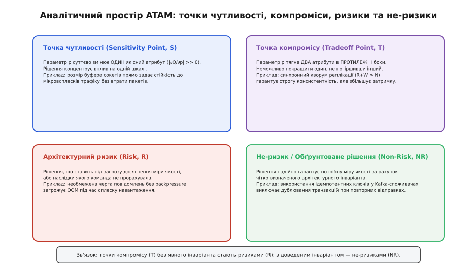
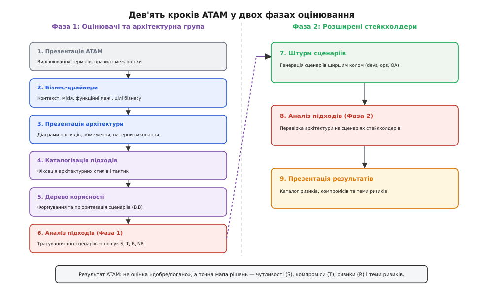
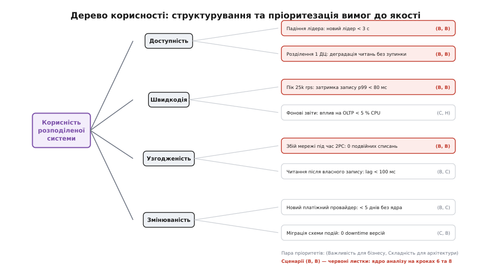
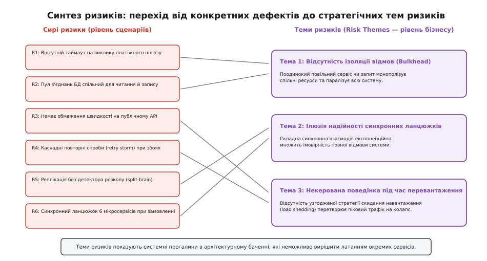

# Метод оцінки архітектури ATAM

<preknowlist>
- [Якісні атрибути](topic:programming/quality-attributes) — властивості системи («наскільки добре вона працює»), такі як швидкодія, доступність, надійність та змінюваність.
- [Сценарії атрибутів](topic:programming/attribute-scenarios) — шестикомпонентна специфікація вимог до якості (джерело, стимул, артефакт, середовище, відгук, міра відгуку).
- [Архітектурні драйвери](topic:programming/architectural-drivers) — ключові бізнес-вимоги та критичні якісні характеристики, які безпосередньо диктують структуру системи.
- [Архітектурні тактики](topic:programming/architectural-tactics) — фундаментальні шаблони та прийоми впливу на якісні атрибути системи.
- [Trade-off-аналіз](topic:programming/tradeoff-analysis) — виявлення та оцінка конфліктів між взаємовиключними архітектурними вимогами.
</preknowlist>

Команда розробки платіжного шлюзу запускає нову розподілену платформу для обробки міжбанківських транзакцій. Архітектуру обрали за типовими рекомендаціями: мікросервіси спілкуються через синхронні HTTP/2-запити, фінансові операції координуються двофазним фіксуванням (2PC), а баланси рахунків блокуються песимістичними блокуваннями в централізованому сховищі. На синтетичних тестах із стабільною локальною мережею система показує відмінний результат. Проте в перший же місяць промислової експлуатації під навантаженням 20 000 запитів за секунду трапляється короткочасна затримка в трансокеанському оптоволоконному каналі зв'язку: час відгуку віддаленого банку зростає з 40 мс до 1500 мс.

Синхронні потоки обробників миттєво вичерпують пул з'єднань, черги переповнюються, а блокування 2PC утримують записи в базі даних. Протягом двох хвилин каскадний колапс паралізує всі 14 мікросервісів компанії. Збитки від простою сягають сотень тисяч доларів, а подальший аналіз показує: виправлення проблеми вимагає відмови від синхронного 2PC, переходу на асинхронні події, саги та шардування сховища, що означає переписування 70 % кодової бази і дев'ять місяців затримки релізу.

Ця криза ілюструє класичну закономірність програмної інженерії: **найдорожчі дефекти розподілених систем закладаються на етапі вибору фундаментальної структури**, коли жодного рядка коду ще не написано. За даними досліджень вартості змін (відома крива Бема), виправлення фундаментальної архітектурної помилки на етапі експлуатації коштує у 50–100 разів дорожче, ніж усунення її на етапі проєктування.

Традиційне тестування та перегляд коду (code review) принципово безсилі проти таких дефектів. Кожен окремий мікросервіс може бути ідеально написаний, покритий модульними тестами на 100 % і позбавлений синтаксичних вад. Але такі якості, як стійкість до мережевих розділень, наскрізна затримка (end-to-end latency) та узгодженість даних, не належать жодному окремому файлу. Вони є **емерджентними властивостями** — якостями, які народжуються винятково із топології зв'язків, протоколів взаємодії та розподілу обов'язків між компонентами.

Щоб виявити приховані вразливості, конфлікти вимог та катастрофічні ризики ще до початку активної розробки, Інститут програмної інженерії (SEI) розробив **метод аналізу архітектурних компромісів — ATAM (Architecture Tradeoff Analysis Method)**.

## Що таке ATAM і чому він шукає саме компроміси

ATAM — це структурований, сценарно-орієнтований метод оцінювання архітектури, призначений для з'ясування того, наскільки запропоновані архітектурні рішення задовольняють специфічні вимоги до якісних атрибутів, і як ці рішення впливають одне на одне.

Головне концептуальне відкриття авторів методу (Ріка Казмана, Марка Кляйна, Пола Клементса та Лена Басса) полягає в тому, що **архітектуру неможливо оцінювати в категоріях «хороша» чи «погана» у відриві від контексту**. Будь-яке сильне архітектурне рішення є компромісом. Якщо архітектор обирає кешування даних у пам'яті, він виграє у швидкодії читання, але програє у консистентності (ризик читання застарілих даних) та збільшує споживання оперативної пам'яті. Якщо архітектор впроваджує строгий кворум Paxos або Raft, він отримує бездоганну надійність даних, але платить за це додатковими затримками на мережевий обіг (RTT) та зниженням доступності на запис під час втрати більшості вузлів.

Тому мета ATAM — не винести оцінку проєкту, а побудувати точну аналітичну мапу взаємозв'язку між бізнес-цілями, архітектурними рішеннями та якісними наслідками цих рішень.

## Чотиривимірний простір відкриттів ATAM

Під час оцінювання системи метод шукає та класифікує чотири фундаментальні типи архітектурних явищ:

1. **Точки чутливості (Sensitivity Points, `S`):**
   Це параметри архітектури чи проєктні рішення, зміна яких критично змінює показник якогось *одного* якісного атрибута. Математично це точка, де частинна похідна функції якості за архітектурним параметром має велике абсолютне значення (`|∂Q / ∂p| >> 0`).
   *Приклад у розподілених системах:* розмір пулу з'єднань клієнта gRPC до бекенд-сервісу. Якщо пул надто малий, пропускна здатність падає через черги; якщо достатній — система працює оптимально. Це точка чутливості для швидкодії.

2. **Точки компромісу (Tradeoff Points, `T`):**
   Це архітектурні параметри чи рішення, які одночасно впливають на *два або більше різних якісних атрибутів*, причому спрямовують їхні показники у протилежні боки (похідні мають протилежні знаки).
   *Приклад у розподілених системах:* вибір стратегії реплікації бази даних. Синхронна реплікація з кворумом `W + R > N` підвищує збереженість даних (RPO=0) і строгу узгодженість, але суттєво збільшує затримку p99 запису і знижує доступність на запис у разі ізоляції дата-центру. Це класична точка компромісу між консистентністю, затримкою та доступністю.

3. **Архітектурні ризики (Risks, `R`):**
   Це прийняті архітектурні рішення (або відсутність чіткого рішення чи невизначеність параметрів), які ставлять під загрозу досягнення критично важливих бізнес-метрик у сценаріях якості.
   *Приклад у розподілених системах:* використання черги повідомлень у пам'яті без дискового журналу (WAL) та без механізму протитиску (backpressure). Під час сплеску трафіку сервіс вичерпає оперативну пам'ять і впаде з помилкою OOM (Out of Memory), втративши всі неповідомлені транзакції.

4. **Не-ризики / Обґрунтовані рішення (Non-Risks, `NR`):**
   Це архітектурні рішення, які після ретельного аналізу визнано надійними та безпечними, оскільки вони гарантовано забезпечують потрібну міру відгуку в межах сформульованого архітектурного інваріанта.
   *Приклад у розподілених системах:* використання ідемпотентних ключів транзакцій (UUIDv7) у заголовках повідомлень Kafka разом із таблицею дедуплікації на стороні споживача. Це гарантує, що повторна доставка повідомлень через тайм-аут мережі ніколи не спричинить подвійного списання коштів.

*Чотиривимірний аналітичний простір ATAM: точки чутливості ізолюють вплив на окремі атрибути, точки компромісу фіксують взаємні конфлікти вимог, а їхній аналіз формує реєстр ризиків та обґрунтованих не-ризиків.*

Зв'язок між цими категоріями безпосередній: **будь-яка точка компромісу, де архітектори не визначили явного інваріанта захисту, автоматично стає архітектурним ризиком**. Навпаки, точка компромісу, для якої обрано свідоме математично вивірене обмеження, перетворюється на задокументований не-ризик.

## Анатомія методу: дві фази та дев'ять кроків

Процедура повного методу ATAM складається з 9 послідовних кроків, розділених на дві основні фази. Такий поділ захищає час учасників: перша фаза концентрується на аналізі архітектурної моделі вузьким колом експертів, а друга підключає широке коло зацікавлених сторін (стейкхолдерів).

*Дев'ять кроків методу ATAM: Фаза 1 присвячена поглибленому вивченню архітектури та дерева корисності, Фаза 2 залучає стейкхолдерів для верифікації та формування підсумкових тем ризиків.*

### Фаза 1: Оцінювачі та архітектурна група

У першій фазі беруть участь група оцінювання (зовнішні або незалежні фасилітатори та експерти), головний архітектор проєкту та ключові технічні лідери.

#### Крок 1. Презентація методу ATAM
Фасилітатор пояснює учасникам правила гри, етапи, поняття чутливостей, компромісів і ризиків. Це знімає захисну реакцію авторів архітектури: ATAM не є іспитом чи спробою знайти винних. Це спільне дослідження меж стійкості системи.

#### Крок 2. Презентація бізнес-драйверів
Представник бізнес-замовника чи продуктовий лідер викладає контекст:
- Яку комерційну чи прикладну задачу вирішує система?
- Які головні функційні обмеження та бізнес-цілі (наприклад, вихід на ринок за 6 місяців, відповідність стандарту PCI-DSS, доступність для мільйона активних користувачів)?
- Які якісні атрибути є життєво критичними для успіху проєкту (high-level quality drivers)?

#### Крок 3. Презентація архітектури
Головний архітектор презентує проєктне рішення на відповідному рівні деталізації:
- Контекстна діаграма та межі системи (System Boundaries).
- Модульні види (Module Views) — декомпозиція на сервіси, пакети, рівні абстракції.
- Компонентно-конекторні види (C&C Views) — клієнт-серверні зв'язки, брокери повідомлень, канали синхронізації, протоколи взаємодії.
- Види розгортання (Deployment Views) — географічний розподіл вузлів, кластеризація, топологія мережі, резервування баз даних.
- Технічні обмеження: обраний стек технологій, обмеження апаратного забезпечення, зовнішні API партнерів.

#### Крок 4. Каталогізація архітектурних підходів і тактик
Оцінювачі фіксують перелік використаних архітектурних стилів, патернів та тактик:
- Стилі: мікросервісна архітектура, подієво-орієнтована архітектура (EDA), CQRS, шардовані сховища.
- Тактики: автоматичне вимикання навантаження ([Circuit Breaker](topic:programming/circuit-breaker-pattern)), реплікація з плаваючим лідером (Raft), розподілений кеш із політикою write-through, [наскрізний протитиск](topic:programming/backpressure-end-to-end).

#### Крок 5. Побудова дерева корисності (Quality Attribute Utility Tree)
Дерево корисності — це центральний інструмент структурування вимог до якості в ATAM. Воно будує міст між абстрактними бізнес-бажаннями («система має бути швидкою та надійною») і конкретними вимірними інженерними сценаріями.

Структура дерева розгортається від кореня до листків:
- **Корінь:** Загальна корисність системи (Utility).
- **Перший рівень:** Головні якісні атрибути (Доступність, Швидкодія, Змінюваність, Безпека, Тестованість).
- **Другий рівень:** Підкатегорії атрибута (наприклад, для Швидкодії: затримка запитів, пропускна здатність, час відновлення після піків).
- **Листки:** Конкретні шестикомпонентні [сценарії атрибутів якості](topic:programming/attribute-scenarios), що містять чіткі числові пороги.

Кожен листок дерева корисності оцінюється двома рангами за шкалою **Високо (В) / Середньо (С) / Низько (Н)**:
1. **Важливість для бізнесу (Business Importance):** наскільки цей сценарій критичний для виживання продукту та бізнес-цілей.
2. **Складність для архітектури (Architectural Difficulty / Risk):** наскільки важко команді гарантувати цю вимогу, і наскільки високим є ризик технічної невдачі.

*Дерево корисності розподіленої системи: декомпозиція глобальної корисності на атрибути та конкретні сценарії з парами пріоритетів (Важливість, Складність). Сценарії з позначкою (В, В) формують фокус аналізу.*

Усі сценарії, що отримали ранг **(В, В)** (висока важливість для бізнесу і висока технічна складність), стають першочерговим об'єктом аналізу. Сценарії з низьким пріоритетом відкладаються.

#### Крок 6. Аналіз архітектурних підходів за топ-сценаріями
Оцінювачі разом з архітекторами беруть кожен сценарій з рангом (В, В) і «проганяють» його крізь архітектурні діаграми, розглядаючи крок за кроком:
- Які компоненти активуються при надходженні стимулу?
- Якими протоколами передається повідомлення?
- Що станеться при збої на кожному проміжному етапі?
- Які архітектурні тактики забезпечують цільовий відгук?

На цьому етапі виявляються перші точки чутливості, точки компромісу, ризики та не-ризики. Вони заносяться до структурованих форм аналізу сценаріїв.

---

### Фаза 2: Розширені стейкхолдери

Друга фаза зазвичай проводиться через кілька днів після першої. До неї залучають розширене коло зацікавлених осіб: розробників, інженерів тестування (QA), DevOps/SRE-фахівців, співробітників підтримки, системних адміністраторів, аналітиків даних та представників користувачів.

#### Крок 7. Мозковий штурм та пріоритезація сценаріїв
Широкому колу стейкхолдерів пропонують висловити власні сценарії, які часто залишаються поза увагою архітекторів. Сценарії класифікують на три категорії:
1. **Сценарії використання (Use Case Scenarios):** типова робота системи у штатних умовах (наприклад, «10 000 користувачів одночасно оновлюють профілі»).
2. **Сценарії зростання / змін (Growth / Change Scenarios):** плановані модифікації протягом наступних 1–3 років (наприклад, «додавання другого хмарного регіону в іншій юрисдикції», «перехід на нову версію протоколу фінансового обміну»).
3. **Дослідницькі / стресові сценарії (Exploratory Scenarios):** екстремальні, непередбачувані ситуації, які перевіряють межі стійкості (наприклад, «одночасне відключення двох із трьох дата-центрів під час масованої DDoS-атаки»).

Після генерації списку (зазвичай 20–40 сценаріїв) кожен стейкхолдер отримує обмежену кількість голосів (наприклад, 5 наліпок чи балів) для голосування. За результатами голосування формується топ-список сценаріїв спільноти.

Далі топ-сценарії стейкхолдерів зіставляються з деревом корисності з Кроку 5. Якщо з'ясовується, що важливий для інженерів експлуатації сценарій був повністю відсутній у початковому дереві корисності архітекторів, це сигналізує про небезпечну сліпу зону проєктування.

#### Крок 8. Повторний аналіз архітектурних підходів
Найвище оцінені сценарії з мозкового штурму проганяються крізь архітектурні види за процедурою Кроку 6. Архітектори пояснюють, які рішення системи забезпечують реакцію на ці несподівані стимули. У процесі виявляються додаткові компроміси та ризики.

#### Крок 9. Презентація результатів
Команда оцінювачів систематизує всі зібрані дані та презентує їх керівництву, архітекторам та стейкхолдерам.

Головні артефакти підсумкового звіту ATAM:
- Каталог задокументованих архітектурних підходів.
- Повне дерево корисності з пріоритетами.
- Зведений список згенерованих сценаріїв стейкхолдерів.
- Таблиці аналізу сценаріїв із зазначенням чутливостей (S) та компромісів (T).
- Реєстр архітектурних ризиків (Risks) та не-ризиків (Non-Risks).
- **Синтезовані теми ризиків (Risk Themes).**

## Синтез окремих ризиків у стратегічні теми ризиків

Сирий список із 20 чи 30 окремих ризиків мало що дає вищому керівництву чи технічному директору. Якщо в звіті просто записано: «у сервісі А немає таймауту, у черзі Б немає обмеження розміру, у сервісі В не налаштовано повторні спроби», виникає спокуса сприйняти це як список дрібних багів для джуніорів.

Справжня сила методу ATAM полягає у **синтезі ризиків у теми ризиків (Risk Themes)**. Тема ризику — це виявлена системна закономірність, архітектурний патерн мислення або системна прогалина, яка породжує множину окремих ризиків по всій системі.

*Синтез ризиків: об'єднання локальних технічних знахідок у системні теми ризиків (Risk Themes), які безпосередньо загрожують стратегічним бізнес-драйверам.*

Розглянемо приклад синтезу для розподіленої платформи:
- *Окремі ризики (рівень коду та сервісів):*
  1. Сервіс обробки замовлень викликає сервіс перевірки залишків через блокуючий RPC без таймауту на клієнтському сокеті.
  2. Пул з'єднань до бази даних використовується спільно для важких аналітичних запитів і для критичних транзакцій користувачів.
  3. Провайдери повідомлень надсилають сповіщення через спільний неізольований пул потоків.
- *Синтезована тема ризику (стратегічний рівень):*
  **«Повна відсутність ізоляції відмов (Bulkhead pattern)».**
  *Вплив на бізнес-драйвери:* Поодинока затримка у другорядній сторонній системі (наприклад, сервісі розсилки SMS) неминуче вичерпає системні ресурси і призведе до зупинки прийому платежів від клієнтів компанії.

Формулювання тем ризиків дозволяє керівництву спрямувати інженерні бюджети не на точкове замазування тріщин, а на системну зміну архітектурних правил (наприклад, введення обов'язкового каркаса ізоляції ресурсів та наскрізних таймаутів у всіх базових бібліотеках компанії).

## Наскрізний приклад: аналіз сценарію в розподіленому клірингу

Щоб побачити, як аналіз працює на практиці, розберемо один сценарій рангу (В, В) для системи розподіленого фінансового клірингу.

### Специфікація сценарію
- **Якісний атрибут:** Доступність та Узгодженість (CAP-компроміс).
- **Джерело стимулу:** Відмова апаратного маршрутизатора в основному центрі обробки даних (ЦОД-1).
- **Стимул:** Повна втрата зв'язку між ЦОД-1 та репліками в ЦОД-2 і ЦОД-3 під час активного пікового навантаження 15 000 tps.
- **Артефакт:** Розподілений журнал транзакцій та координатор консенсусу.
- **Середовище:** Промислова експлуатація, стан високого навантаження.
- **Відгук:** Система автоматично обирає нового лідера у вцілілих ЦОД, продовжує прийом фінансових операцій без зупинки, не допускає розколу мозку (split-brain) та не втрачає жодної підтвердженої транзакції.
- **Міра відгуку:** Час вибору нового лідера < 2.5 с; втрата підтверджених даних RPO = 0; частка успішних транзакцій під час ізоляції ≥ 99.5 %.

### Таблиця аналізу архітектурного підходу (ATAM Analysis Table)

| Поле аналізу | Запис аналізу |
| :--- | :--- |
| **Архітектурний підхід** | Кластер консенсусу на основі протоколу Raft із 5 вузлів, розподілених за схемою: 2 вузли в ЦОД-1, 2 вузли в ЦОД-2, 1 вузол-арбітр у ЦОД-3. Синхронний запис у кворум більшості (`W = 3`). |
| **Точки чутливості (S)** | 1. `S1`: Інтервал heartbeat-повідомлень лідера (`T_hb = 150` мс) та таймаут виборів (`T_elect = 450–900` мс). Прямо визначає час виявлення збою та затримку перемикання. 2. `S2`: Пропускна здатність мережевого каналу між ЦОД для передачі журналів Raft. |
| **Точки компромісу (T)** | `T1`: Розмір кворуму більшості `W=3` є точкою компромісу між **узгодженістю даних** (RPO=0, виключає подвійні витрати) та **затримкою запису** (кожна транзакція чекає на відповідь через міжцентрову мережу `+1.8` мс) і **доступністю на запис** під час подвійних ізоляцій. |
| **Ризики (R)** | `R1`: Якщо ЦОД-1 втратить зв'язок з іншими ЦОД, його 2 вузли залишаться в меншості (2 з 5), але клієнти, що підключені до ЦОД-1 через локальний балансувальник, будуть отримувати таймаути замість негайного перенаправлення на ЦОД-2, оскільки відсутній механізм автоматичного оновлення DNS/Anycast маршрутизації для клієнтських шлюзів. |
| **Не-ризики (NR)** | `NR1`: Завдяки вимозі кворуму більшості (`3 з 5`), 2 вузли в ЦОД-1 не зможуть самостійно зафіксувати жодну транзакцію, що строго запобігає виникненню split-brain за будь-якого розриву зв'язку між дата-центрами. |

З цієї таблиці видно, що метод чітко розкриває структуру рішення: архітектура захищена від втрати даних (NR1), проте виявлено конкретний архітектурний ризик (R1) у мережевому шарі клієнтської маршрутизації, який вимагає доопрацювання до початку розробки.

## Як архітектурні компроміси описуються математично та перевіряються в коді

Глибший аналіз того, як походження ATAM змінювало парадигму інженерного мислення від простих монолітних сценаріїв SAAM до сучасних хмарних каркасів, висвітлено в матеріалі [еволюція методів оцінювання архітектури](topic:programming/atam-architecture-evaluation/hist-atam-evolution.md).

Математичний апарат аналізу чутливостей функцій якості, побудова матриць Якобі архітектурного відгуку та формальне доведення неможливості безкоштовного руху за межею Парето розглянуто у спеціалізованому виведенні: [математична формалізація аналізу чутливості та компромісів](topic:programming/atam-architecture-evaluation/math-sensitivity-tradeoff.md).

Практичну програмну модель симулятора архітектурних компромісів розподіленого кворуму мовами C та C++ з автоматичною класифікацією ризиків реалізовано у вставці: [програмний симулятор та оцінювач архітектурних рішень](topic:programming/atam-architecture-evaluation/proj-distributed-eval-harness.md).

> 🔧 **Навіщо це.** Без систематичного оцінювання команда завжди обирає архітектуру за найгучнішим голосом в кімнаті або за свіжими статтями у блогах технологічних гігантів. ATAM повертає проєктування в русло інженерного розрахунку: він змушує явно назвати ціну кожного компромісу («ми платимо двома мілісекундами затримки за нульову ймовірність втрати грошей») і перевірити, чи згоден бізнес платити цю ціну.

## Межі методу: коли потрібен повний ATAM, а коли легкі адаптації

Повний класичний ATAM — потужний, але дорогий інструмент. Проведення обох фаз вимагає від 3 до 5 робочих днів, залучення від 10 до 25 ключових спеціалістів компанії та ретельної підготовки документації.

Застосування повного ATAM є безумовно виправданим у таких умовах:
- Розробка систем із високою ціною збою (critical mission systems): фінансові процесинги, медичні платформи, енергетичні системи, авіоніка, критична інфраструктура.
- Масштабні корпоративні платформи з очікуваним життєвим циклом понад 5–10 років, де вартість переписування архітектури вимірюється мільйонами доларів.
- Системи з жорсткими регуляторними вимогами або взаємодією багатьох незалежних організацій.

Для невеликих команд, стартапів або окремих сервісів у зрілій мікросервісній екосистемі повний ATAM може бути надлишковим. У таких випадках застосовують адаптовані легкі формати, такі як [ATAM-лайт](topic:programming/atam-lite) (стиснений до однієї півторагодинної сесії для 4–6 осіб) або інтеграцію сценарного аналізу в архітектурні записи рішень (ADR) та автоматизовані фітнес-функції безперервної перевірки архітектури.

Головне надбання ATAM — це не формальні бланки чи багатоденні сесії. Це **дисципліна мислення через сценарії якості, точки чутливості та усвідомлені компроміси**, яка дозволяє інженеру бачити систему як цілісний динамічний організм задовго до того, як компілятор збере перший виконуваний бінарник.
