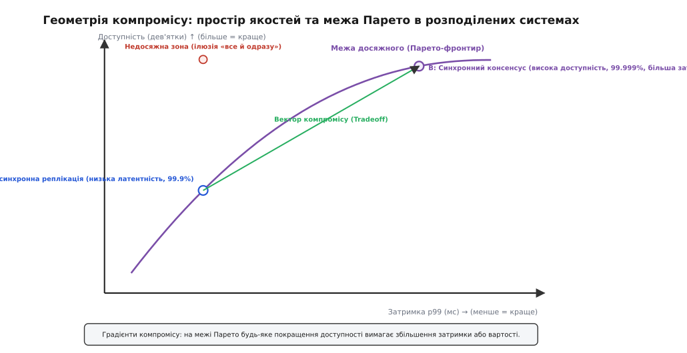

# 🧮 Математична формалізація аналізу чутливості та компромісів в ATAM

Метод ATAM часто сприймають як якісний фасилітаційний процес — набір нарад та обговорень сценаріїв за круглим столом. Проте за фасадом організаційних кроків лежить строга математична модель простору архітектурних параметрів, векторної оптимізації та аналізу чутливості багатовимірних функцій відгуку.

Коли архітектор приймає структурне рішення (наприклад, обирає розмір кворуму в розподіленій базі даних, таймаут виявлення збоїв чи глибину буфера повідомлень), він фіксує вектор параметрів у просторі рішень. Математичний апарат аналізу компромісів дозволяє точно формалізувати, чому одні параметри є нейтральними, інші — критично чутливими, а треті утворюють неминучі компроміси на межі Парето, де будь-який виграш у надійності вимагає неминучої плати затримкою або вартістю.

## Простір параметрів та вектор відгуку якості

Позначимо множину всіх керованих архітектурних параметрів системи як вектор у багатовимірному просторі конфігурацій:

```
p = (p₁, p₂, ..., pₘ) ∈ P ⊂ ℝᵐ
```

де `P` — область допустимих конфігурацій архітектури, обмежена фізичними, апаратними та бюджетними рамками. Архітектурні параметри поділяються на два класи:
- **Неперервні параметри:** таймаути мережевих сокетів, інтервали відправки heartbeat-пакетів, коефіцієнти експоненційного відступу (backoff), розміри виділеної оперативної пам'яті.
- **Дискретні параметри:** загальна кількість вузлів у кластері `N`, розмір кворуму запису `W`, розмір кворуму читання `R`, кількість шардів, рівень реплікації.

Множину вимірних якісних атрибутів системи (затримка, доступність, пропускна здатність, вартість супроводу, ймовірність збереження даних) представимо як векторну функцію відгуку:

```
Q(p) = (Q₁(p), Q₂(p), ..., Qₙ(p)) ∈ ℝⁿ
```

де кожна скалярна функція `Qᵢ(p)` відображає архітектурну конфігурацію `p` у числове значення міри відгуку для `i`-го якісного сценарію (наприклад, `Q₁` — затримка p99 у мілісекундах, `Q₂` — коефіцієнт доступності системи від 0 до 1, `Q₃` — ймовірність читання застарілого значення).

Оскільки різні метрики мають різні одиниці вимірювання (мілісекунди, відсотки, долари, кількість операцій за секунду) та різні цільові напрямки (затримку прагнуть мінімізувати, а доступність — максимізувати), у математичній моделі ATAM застосовують нормовані функції корисності (utility functions):

```
Uᵢ(p) = fᵢ(Qᵢ(p)),  де Uᵢ: ℝ → [0, 1]
```

Функція `fᵢ` монотонно зростає для бажаних метрик (`∂Uᵢ / ∂Qᵢ > 0` для доступності та пропускної здатності) і монотонно спадає для небажаних характеристик (`∂Uᵢ / ∂Qᵢ < 0` для затримки та витрат ресурсів).

## Матриця чутливості та точки чутливості (Sensitivity Points)

Локальна чутливість `i`-го якісного атрибута до зміни `k`-го архітектурного параметра визначається частинною похідною функції корисності за цим параметром:

```
S_{i,k}(p) = ∂Uᵢ(p) / ∂pₖ
```

Для дискретних параметрів (таких як розмір кворуму `W` чи кількість вузлів `N`) неперервна похідна замінюється на скінченну різницю першого порядку:

```
S_{i,k}(p) = [ Uᵢ(p₁,..., pₖ + 1,..., pₘ) - Uᵢ(p₁,..., pₖ,..., pₘ) ] / 1
```

Повний відгук архітектури на малі збурення параметрів конфігурації описується матрицею Якобі розміру `n × m` (матрицею архітектурної чутливості):

```
J(p) = [ ∂Uᵢ / ∂pₖ ] = [ S_{i,k}(p) ]
```

**Означення точки чутливості (Sensitivity Point):**
Архітектурний параметр `pₖ` називається **точкою чутливості** для якісного атрибута `Uᵢ` у робочій точці `p*`, якщо абсолютне значення нормованої еластичності перевищує заданий поріг значущості `ε > 0`:

```
E_{i,k}(p*) = | (pₖ* / Uᵢ(p*)) · (∂Uᵢ(p*) / ∂pₖ) | ≥ ε
```

Якщо значення еластичності `E_{i,k}` близьке до нуля, система демонструє стійкість (інваріантність): зміна параметра `pₖ` практично не впливає на цей сценарій якості. Якщо ж `E_{i,k} >> 1`, навіть незначна зміна параметра (наприклад, зменшення таймауту сокета на 50 мс) здатна обвалити показник сценарію або викликати лавиноподібну деградацію сервісу.

## Точка компромісу (Tradeoff Point)

У реальних розподілених системах архітектурні параметри рідко впливають лише на один атрибут ізольовано. Більшість ключових рішень зв'язують якісні характеристики перехресними залежностями.

**Означення точки компромісу (Tradeoff Point):**
Архітектурний параметр `pₖ` є **точкою компромісу** між двома якісними атрибутами `Uᵢ` та `Uⱼ` у точці `p*`, якщо він одночасно є точкою чутливості для обох атрибутів (`E_{i,k} ≥ ε` та `E_{j,k} ≥ ε`), а його градієнти спрямовані в протилежні боки:

```
(∂Uᵢ(p*) / ∂pₖ) · (∂Uⱼ(p*) / ∂pₖ) < 0
```

Це означає, що будь-який приріст параметра `Δpₖ > 0`, який покращує першу якість `Uᵢ`, неминуче погіршує другу якість `Uⱼ`:

```
ΔUᵢ ≈ (∂Uᵢ / ∂pₖ) · Δpₖ > 0   ⇒   ΔUⱼ ≈ (∂Uⱼ / ∂pₖ) · Δpₖ < 0
```

Параметр `pₖ` є неподільною ручкою налаштування: архітектор фізично позбавлений можливості оптимізувати обидва сценарії одночасно за допомогою цієї ручки.

## Багатокритеріальна оптимізація та межа Парето

Розглянемо дві архітектурні конфігурації `p_A, p_B ∈ P`. Кажуть, що конфігурація `p_A` домінує над `p_B` за Парето (позначається `p_A ≻ p_B`), якщо вона не гірша за всіма показниками якості й строго перевершує за хоча б одним:

```
∀ i ∈ {1, ..., n}: Uᵢ(p_A) ≥ Uᵢ(p_B)   та   ∃ j ∈ {1, ..., n}: Uⱼ(p_A) > Uⱼ(p_B)
```

**Межа Парето (Pareto Frontier) `P*`** — це множина всіх недомінованих архітектурних рішень:

```
P* = { p ∈ P | ¬∃ p' ∈ P: p' ≻ p }
```

Якщо система спроєктована неефективно (архітектурна точка лежить глибоко всередині допустимої області під межею Парето), команда може покращувати затримку, пропускну здатність і надійність одночасно без жодних компромісів — просто прибираючи очевидні дефекти, зайві блокування та неоптимальний код.

Проте коли система досягає межі Парето `P*`, простір оптимізації підпорядковується фундаментальному закону збереження якості:

```
∑_{i=1}^{n} λᵢ · d Uᵢ(p) = 0,   де λᵢ > 0   [диференціал на межі Парето]
```


*Геометрична ілюстрація простору двох якостей: рух від точки A (асинхронна реплікація) до точки B (синхронний кворум) відбувається строго вздовж межі Парето. Спроба отримати властивості точки B без сплати збільшенням затримки веде в математично недосяжну зону.*

## Агрегація глобальної корисності та економіка вибору

Для порівняння альтернативних архітектурних конфігурацій на межі Парето метод ATAM та його економічне розширення CBAM (Cost Benefit Analysis Method) використовують зважену адитивну функцію глобальної корисності:

```
U_total(p) = ∑_{i=1}^{n} wᵢ · Uᵢ(p),   де ∑_{i=1}^{n} wᵢ = 1,  wᵢ ≥ 0
```

Вагові коефіцієнти `wᵢ` визначаються на кроці 5 ATAM за результатами побудови дерева корисності: сценарії з рангом (В, В) отримують найбільшу вагу `wᵢ`, тоді як сценарії з рангами (Н, Н) мають мінімальну або нульову вагу.

Оптимальна архітектурна конфігурація `p_opt` є розв'язком задачі оптимізації на допустимій множині `P`:

```
p_opt = argmax_{p ∈ P} [ ∑_{i=1}^{n} wᵢ · Uᵢ(p) - C(p) ]
```

де `C(p)` — нормована функція вартості впровадження та підтримки даної архітектури (апаратні витрати, ліцензії, людино-години інженерів).

## Покроковий чисельний розрахунок: кворумна реплікація в кластері

Розглянемо розподілений кластер із `N = 5` вузлів, розташованих у трьох дата-центрах.
Вхідні параметри системи:
- `W` — розмір кворуму запису (`1 ≤ W ≤ 5`).
- `R` — розмір кворуму читання (`1 ≤ R ≤ 5`).
- `T_net` — базова середня затримка міжвузлового обігу RTT (`T_net = 2.0` мс).
- `p_fail` — ймовірність тимчасового збою окремого вузла (`p_fail = 0.05`).

Аналізуємо три якісні атрибути:
1. `Q_lat(W)` — затримка операції запису: клієнт надсилає запити до всіх `N` вузлів і чекає на відповіді від `W` найшвидших.
2. `Q_stale(W, R)` — ймовірність читання застарілих даних (порушення лінеаризовності).
3. `Q_avail(W)` — доступність системи на запис при випадкових збоях вузлів.

### Крок 1. Розрахунок затримки запису як функції від W

Для експоненційного розподілу мережевих затримок математичне сподівання часу очікування `W`-го найшвидшого вузла з `N` доступних обчислюється через гармонійний ряд:

```
Q_lat(W) = T_net · ∑_{k=1}^{W} (1 / (N - k + 1))
```

Обчислимо затримку для різних розмірів кворуму запису при `N = 5`:

```
Для W = 1:
Q_lat(1) = 2.0 · (1/5) = 0.40 мс

Для W = 3 (кворум більшості):
Q_lat(3) = 2.0 · (1/5 + 1/4 + 1/3)
         = 2.0 · (0.200 + 0.250 + 0.333)
         = 2.0 · 0.783 = 1.57 мс

Для W = 5 (запис у всі вузли):
Q_lat(5) = 2.0 · (1/5 + 1/4 + 1/3 + 1/2 + 1/1)
         = 2.0 · (0.200 + 0.250 + 0.333 + 0.500 + 1.000)
         = 2.0 · 2.283 = 4.57 мс
```

### Крок 2. Розрахунок узгодженості читань (Staleness Rate)

Згідно з теоремою кворумів Гіффорда, суворе перекриття множин запису та читання гарантується за умови `W + R > N`.

Якщо `W + R ≤ N`, кворуми можуть не перетинатися. Ймовірність того, що всі `R` обраних для читання вузлів не містять останнього оновлення (тобто потрапляють у множину `N - W` незаписаних вузлів), дорівнює:

```
Q_stale(W, R) = ∏_{j=0}^{R-1} ( (N - W - j) / (N - j) )   [для W + R ≤ N]
Q_stale(W, R) = 0.00                                      [для W + R > N]
```

Розрахуємо ймовірність застарілого читання при `R = 2`:

```
Для W = 1, R = 2 (W + R = 3 ≤ 5):
Q_stale(1, 2) = ( (5 - 1 - 0) / (5 - 0) ) · ( (5 - 1 - 1) / (5 - 1) )
              = (4/5) · (3/4) = 12 / 20 = 0.60  (60 % ймовірність прочитати старі дані)

Для W = 3, R = 2 (W + R = 5 ≤ 5):
Q_stale(3, 2) = ( (5 - 3 - 0) / 5 ) · ( (5 - 3 - 1) / 4 )
              = (2/5) · (1/4) = 2 / 20 = 0.10   (10 % ймовірність прочитати старі дані)

Для W = 4, R = 2 (W + R = 6 > 5):
Q_stale(4, 2) = 0.00  (гарантія строгої узгодженості, 0 % збоїв)
```

### Крок 3. Розрахунок доступності на запис

Ймовірність успішного запису дорівнює ймовірності того, що щонайменше `W` вузлів із `N` є працездатними. За біноміальним розподілом для `p_fail = 0.05`:

```
Q_avail(W) = ∑_{k=W}^{N} C(N, k) · (1 - p_fail)ᵏ · (p_fail)ᴺ⁻ᵏ
```

Обчислимо доступність для різних значень `W`:

```
Для W = 1:
Q_avail(1) = 1.0 - (p_fail)⁵
           = 1.0 - (0.05)⁵ = 1.0 - 0.0000003125 = 0.99999968  (6 дев'яток)

Для W = 3:
Q_avail(3) = C(5,3)·(0.95)³·(0.05)² + C(5,4)·(0.95)⁴·(0.05)¹ + C(5,5)·(0.95)⁵·(0.05)⁰
           = 10·(0.857375)·(0.0025) + 5·(0.814506)·(0.05) + 1·(0.773781)·(1.0)
           = 0.021434 + 0.203627 + 0.773781 = 0.998842  (99.88 %)

Для W = 5:
Q_avail(5) = (0.95)⁵ = 0.773781  (доступність лише 77.38 %, система вразлива до падіння будь-якого 1 вузла)
```

### Підсумковий аналіз матриці компромісу

Зведемо отримані розрахунки в аналітичну таблицю компромісів для зміни параметра `W`:

| Кворум W | Затримка запису `Q_lat` | Доступність запису `Q_avail` | Узгодженість при R=2 `Q_stale` |
| :--- | :--- | :--- | :--- |
| `W = 1` | 0.40 мс (відмінно) | 99.9999 % (6 дев'яток) | 60.0 % помилок (неприпустимо) |
| `W = 3` | 1.57 мс (допустимо) | 99.88 % (3 дев'ятки) | 10.0 % помилок (ризик) |
| `W = 4` | 2.57 мс (підвищена) | 97.74 % (2 дев'ятки) | 0.0 % помилок (строга) |
| `W = 5` | 4.57 мс (висока) | 77.38 % (неприпустимо) | 0.0 % помилок (строга) |

Математичний висновок очевидний: перехід від `W=1` до `W=4` повністю ліквідує застарілі читання (`Q_stale: 60% → 0%`), але ціною цього стає зростання затримки у 6.4 раза (`0.40 мс → 2.57 мс`) та зниження доступності з 99.9999% до 97.74%. Математична формалізація ATAM перетворює суб'єктивні архітектурні суперечки на точний чисельний аналіз ціни кожного рішення.
