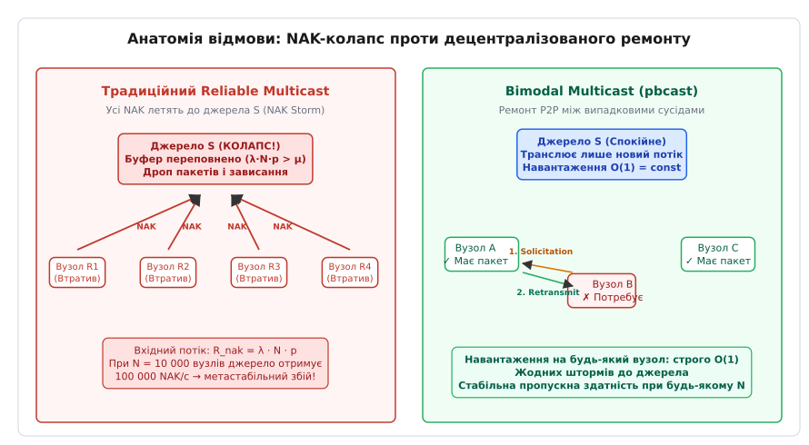
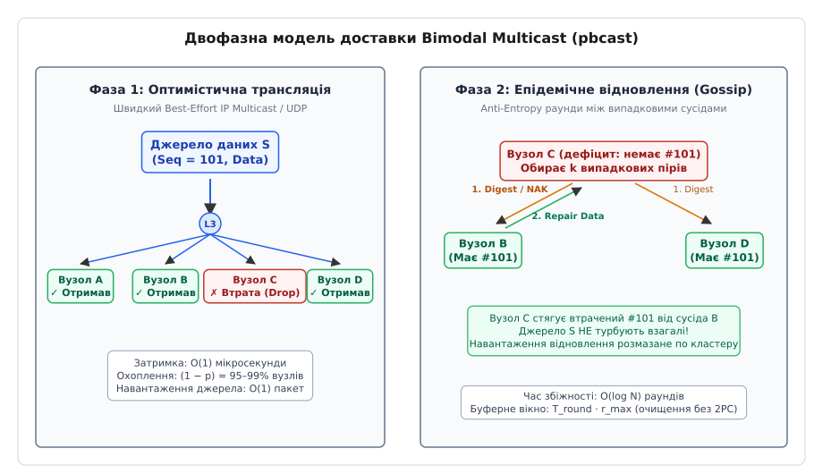
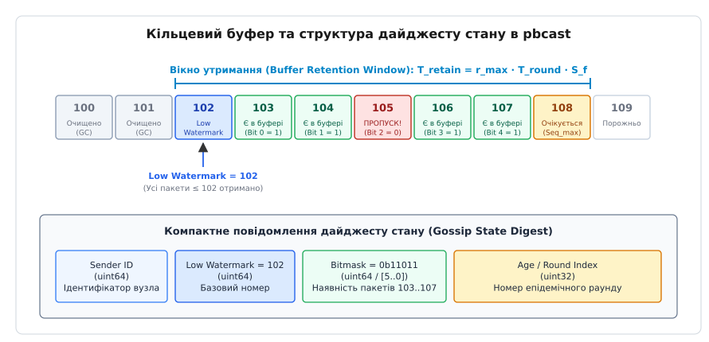
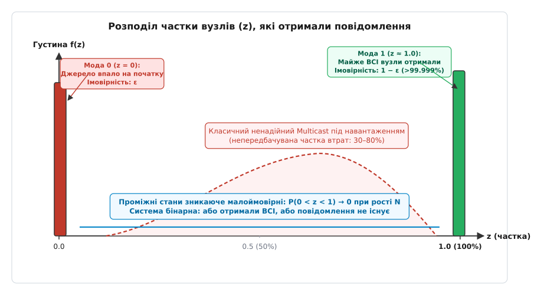

# Bimodal Multicast (pbcast)

<preknowlist>
- [Gossip vs IP Multicast](topic:programming/gossip-vs-multicast) — порівняння апаратного L3 та прикладного L7 оверлею.
- [Анти-ентропія](topic:programming/anti-entropy-repair) — фонове узгодження розбіжностей через періодичний обмін дайджестами.
- [Гарантії доставки у розподілених системах](topic:programming/delivery-guarantees) — класифікація семантик від At-most-once до надійного мовлення.
- [Метастабільні відмови](topic:programming/metastable-failures) — механізми самопідтримуваного перевантаження під час каскадних ретраїв і штормів запитів.
- [Плітки й членство в кластері](topic:programming/gossip-membership) — випадковий вибір пірів та децентралізоване відстеження живих вузлів.
</preknowlist>

Коли розподілений кластер із тисяч серверів транслює безперервний потік критичних повідомлень — оновлення фінансових котирувань, стан реплікації або конфігурацію топології — спроба побудувати абсолютно надійну доставку через традиційні механізми квитування неминуче призводить до повної зупинки системи. Якщо навіть один комутатор чи перевантажений вузол втрачає пакет, потік негативних підтверджень миттєво затоплює буфер мережевої карти відправника. Джерело витрачає всі обчислювальні ресурси на обробку лавини запитів ретрансляції замість надсилання нових даних, через що корисна пропускна здатність кластера падає до нуля.

Проблема полягає у фундаментальній суперечності: класичні детерміновані протоколи вимагають гарантії «доставити всім без винятку або зупинити конвеєр», тоді як фізична мережа постійно зазнає випадкових затримок, пачкових втрат і тимчасової деградації каналів. Протокол Bimodal Multicast (також відомий як pbcast — імовірнісне мовлення, англ. *probabilistic broadcast*) розв'язує цю суперечність через поєднання двох фаз: швидкої оптимістичної розсилки дейтаграм та децентралізованого епідемічного довиправлення втрат між випадковими сусідами.


*Анатомія відмови: централізований NAK-шторм на джерелі у традиційному Reliable Multicast проти децентралізованого попарного ремонту між сусідами в pbcast.*

---

## Анатомія краху детермінованої надійності

Традиційні системи групового зв'язку (як-от ранні реалізації віртуальної синхронії в ISIS або протоколи SRM і PGM) намагалися надати сувору гарантію надійності: кожне надіслане повідомлення має отримати кожен справний вузол групи. 

Для реалізації цієї семантики в ненадійному середовищі IP/UDP застосовують схему негативних квитанцій (NAK, Negative Acknowledgment). Одержувачі відстежують монотонні порядкові номери пакетів (`SeqNum`). Якщо сервер отримує пакет `#105` одразу після `#103`, він фіксує втрату номера `#104` і надсилає джерелу запит на повторне передавання.

Коли втрата пакета відбувається на магістральному комутаторі стійки (спільній ланці дерева розсилки), пакет одночасно не доходить до всіх `M` вузлів, розташованих за цією ланкою. Усі `M` серверів синхронно генерують пакети `NAK` і спрямовують їх до єдиного відправника:

```
R_nak = λ · N · p

де:
R_nak — інтенсивність вхідного потоку NAK на відправника (пакетів/с)
λ     — частота генерації нових повідомлень джерелом (пакетів/с)
N     — кількість вузлів у групі мовлення
p     — імовірність втрати пакета на мережевому інтерфейсі
```

Якщо мережевий стек ядра на вузлі-джерелі здатен обробляти лише `μ` запитів на секунду, а системний буфер сокета вміщує `B` пакетів, час до повного колапсу черги становить:

```
T_overflow = B / (λ · N · p - μ)   [час вичерпання буфера при λ · N · p > μ]
```

При зростанні кластера до `N = 10 000` вузлів за швидкості потоку `λ = 1000` пакетів/с та втраті лише `p = 0.01` (1%), інтенсивність NAK досягає `100 000` запитів на секунду. Буфер сокета розміром 64 КБ переповнюється менш ніж за секунду. Операційна система відправника починає скидати як вхідні `NAK`, так і нові дані. Інші сервери також помічають розрив у послідовностях і генерують нові запити, занурюючи кластер у незворотну [метастабільну відмову](topic:programming/metastable-failures).

Друга вада детермінованих схем — «проблема найповільнішого одержувача» (англ. *slowest receiver problem*). Щоб гарантувати можливість ретрансляції, джерело зобов'язане утримувати кожне повідомлення у пам'яті доти, доки абсолютно всі `N` вузлів не підтвердять його успішний прийом. Якщо один вузол у кластері підвисає через довгу паузу збирача сміття (GC Pause) або перевантаження диска, буфери ретрансляції на всіх відправниках переповнюються, і трансляція зупиняється для всієї розподіленої системи.

---

## Двофазна архітектура: поєднання швидкості та епідемічної стійкості

Bimodal Multicast розриває залежність відправника від розміру кластера, розділяючи життєвий цикл кожного повідомлення на дві чітко розмежовані фази:

1. **Фаза 1 (Оптимістична трансляція):** Джерело одноразово транслює дейтаграму в групу через стандартний ненадійний протокол IP Multicast (або просте дерево розсилки Unicast UDP). Навантаження на процесор відправника становить строго `O(1)` і не залежить від кількості одержувачів.
2. **Фаза 2 (Децентралізоване відновлення втрат через Gossip):** Вузли кластера періодично проводять раунди фонового обміну історією отриманих повідомлень (дайджестами) з невеликою кількістю випадково обраних партнерів. Якщо вузол виявляє, що пропустив повідомлення, він надсилає запит на ремонт (`Solicitation`) безпосередньо тому партнеру, який повідомив про наявність пакета, або випадковому сусіду, але **ніколи не звертається до первинного джерела**.


*Архітектура двох фаз: оптимістична трансляція дейтаграм через UDP та фоновий епідемічний ремонт втрат між випадково обраними пірами.*

Завдяки такій структурі джерело повністю звільняється від обслуговування ретрансляцій. Обов'язок ремонту розсіюється по всій популяції вузлів: будь-який сервер, який успішно отримав повідомлення у фазі 1, стає потенційним постачальником копії для тих сусідів, які зазнали локальних втрат.

---

## Механізм роботи протоколу: крок за кроком

Розглянемо внутрішній алгоритм вузла pbcast при надсиланні, прийомі та виправленні втрат.

### 1. Прийом та буферизація у фазі 1
Кожен вузол підтримує локальний кільцевий буфер отриманих повідомлень для кожного відомого джерела. Повідомлення містить ідентифікатор джерела `SenderId`, монотонний номер `SeqNum` та корисне навантаження.

При отриманні пакета через груповий сокет:
1. Вузол перевіряє, чи не є пакет дублікатом.
2. Якщо пакет новий, він зберігається в буфері ретрансляції та негайно передається прикладному застосунку (оптимістична доставка).
3. Вузол оновлює локальну бітову маску отриманих пакетів.

### 2. Епідемічний раунд анти-ентропії (Фаза 2)
Через фіксований проміжок часу `T_round` (типово від 20 до 100 мс) на кожному вузлі спрацьовує таймер анти-ентропії:

1. Вузол випадковим чином обирає `k` партнерів зі свого списку членства групи (типово `k = 2` або `k = 3`).
2. Для кожного активного джерела формується компактний дайджест стану:
   - `LowWatermark` — номер пакета, до якого всі попередні повідомлення отримані послідовно без жодних пропусків.
   - `Bitmask` — бітовий масив фіксованої довжини (наприклад, 64 біти), де біт `i` вказує на наявність пакета з номером `LowWatermark + 1 + i`.
3. Вузол надсилає цей дайджест обраним партнерам у короткому одноадресному UDP-пакеті (Gossip message).

```
Приклад структури дайджесту вузла:
LowWatermark = 100
Bitmask      = 0b00000000...00010111

Розшифровка стану:
- Пакети з номерами 1..100 отримані повністю (без пропусків).
- Пакети 101, 102, 103 отримані (біти 0, 1, 2 встановлені в 1).
- Пакет 104 ВТРАЧЕНО (біт 3 дорівнює 0).
- Пакет 105 отримано (біт 4 встановлений в 1).
- Пакети 106 і далі очікуються.
```

### 3. Реакція на отриманий дайджест (Solicitation та Retransmission)
Коли вузол `B` отримує дайджест від вузла `A`:

```
Порівняння станів на вузлі B:

Випадок 1: Вузол A має пакети, яких немає у B
B помічає, що LowWatermark_A або біти в масці A вказують на новіші пакети.
B надсилає вузлу A запит на надсилання: Solicitation(MissingSeqNums).

Випадок 2: Вузол B має пакети, які відсутні у A
B бачить, що у дайджесті A біт для номера #104 скинутий у 0, тоді як у буфері B цей пакет присутній.
B надсилає пакет #104 вузлу A через одноадресний UDP (Retransmission).
```

Щоб запобігти надлишковим повторним трансляціям, коли кілька сусідів одночасно намагаються виправити дефіцит вузла `A`, у протоколі застосовують лічильники спроб та обмеження частоти (Rate Limiting) ретрансляцій.


*Організація кільцевого буфера послідовностей та структура компактного Gossip-дайджесту для виявлення пропущених дейтаграм.*

---

## Бімодальна гарантія: чому саме «Bimodal»

Назва протоколу походить від математичної форми функції розподілу ймовірностей кінцевої кількості одержувачів, які збережуть надіслане повідомлення.

У класичних ненадійних протоколах розподіл частки одержувачів `z` (де `0 ≤ z ≤ 1`) є розмитим: за високого навантаження або мережевих збоїв повідомлення може дійти до 40%, 65% чи 80% серверів. Така поведінка є найгіршим сценарієм для прикладного коду, оскільки породжує розходження стану, які важко діагностувати.

У Bimodal Multicast густина ймовірності `f(z)` має рівно **два дельта-подібні піки (моди)**:


*Розподіл частки вузлів, що зберегли повідомлення: дві дельта-подібні моди (повна доставка або чистий нуль) виключають непередбачувані часткові стани.*

1. **Мода 1 (`z ≈ 1.0`):** Майже 100% справних вузлів кластера отримують і зберігають повідомлення. Імовірність цієї події становить `1 - ε` (де `ε < 10⁻⁹` для типових налаштувань). Якщо хоча б невелика критична маса серверів отримала пакет у фазі 1, епідемічний процес гарантує повне зараження всієї популяції.
2. **Мода 0 (`z ≈ 0.0`):** Майже жоден вузол не отримує повідомлення. Це стається виключно в тому разі, якщо вузол-відправник зазнав апаратного краху в перші мікросекунди передачі фази 1, встигнувши випустити дейтаграму лише на свій локальний мережевий порт до виходу з ладу.
3. **Зона проміжних значень (`0 < z < 1`):** Імовірність того, що повідомлення осяде лише на частині кластера (наприклад, рівно на половині серверів), експоненційно прямує до нуля при зростанні розміру системи `N`.

Математичне виведення швидкості згасання дефіциту інформації та доведення бімодального розподілу наведено у вставці [🧮 Математика бімодальності: виведення епідемічної збіжності та згасання дефіциту](topic:programming/bimodal-multicast/math-epidemic-convergence.md).

---

## Керування пам'яттю: очищення буферів без консенсусу

Критична перевага Bimodal Multicast над класичними протоколами надійності полягає у способі очищення буферів пам'яті (Garbage Collection).

У детермінованих алгоритмах для видалення повідомлення з пам'яті необхідний глобальний бар'єр: джерело мусить переконатися, що абсолютно кожен вузол зафіксував отримання. Це вимагає протоколу двофазного узгодження (2PC) або підтримки повного вектора підтверджень розміром `O(N)`.

У pbcast видалення базується на **часовому вікні утримання** (англ. *Buffer Retention Window*). Оскільки ймовірність того, що вузол потребуватиме пакет після `r` раундів анти-ентропії, спадає надзвичайно швидко, кожен вузол зберігає пакет у буфері рівно протягом розрахункового часу `T_retain`:

```
T_retain = S_f · r_max · T_round

де:
T_round — тривалість одного раунду пліток (наприклад, 50 мс)
r_max   — кількість раундів, необхідна для збіжності з імовірністю 1 - 10⁻⁹ (типово 3–5 раундів)
S_f     — коефіцієнт безпеки на мережевий джитер (типово S_f = 2..3)
```

Для раунду `T_round = 50` мс та `r_max = 4` за коефіцієнта `S_f = 3`:

```
T_retain
= 3 · 4 · 50 мс               [підстановка параметрів: S_f = 3, r_max = 4, T_round = 50 мс]
= 600 мс                      [гарантований час утримання пакета в пам'яті]
```

Кожен вузол гарантовано утримує отримані пакети в кільцевому буфері протягом 600 мілісекунд, після чого монотонно зсуває вказівник `LowWatermark` і звільняє пам'ять без жодних опитувань кластера чи мережевих блокувань. Якщо інтенсивність трансляції становить 5000 пакетів на секунду розміром по 512 байтів, необхідний обсяг кільцевого буфера на кожному сервері складає лише:

```
Buffer_RAM
= 5000 пакетів/с · 0.6 с · 512 байтів [добуток інтенсивності потоку, часу утримання та розміру пакета]
= 1 536 000 байтів ≈ 1.46 МБ         [розмір пам'яті під кільцевий буфер]
```

Це дозволяє підтримувати екстремальну швидкість обробки даних без деградації за пам'яттю.

---

## Джитер, масштабування та ієрархічні структури

При розгортанні pbcast у великих центрах обробки даних розробники стикаються з двома специфічними мережевими ефектами: синхронізацією хвиль пліток та навантаженням на міжстійкові комутатори.

### Рандомізація таймерів (Anti-Entropy Jitter)
Якщо всі сервери запустити одночасно з жорстким періодом `T_round = 50` мс, через деякий час їхні таймери синхронізуються (явище фазового захоплення). Кластер починає генерувати періодичні сплески трафіку кожні 50 мс, створюючи мікрозатори в чергах комутаторів.

Для усунення цього ефекту час наступного спрацьовування таймера обирають випадково з діапазону з додаванням рівномірного джитеру:

```
Next_Round_Delay = T_round · (1.0 + Uniform(-0.2, +0.2))
```

### Ієрархічний Bimodal Multicast (LAN/WAN)
У глобальних мережах трансляція пліток між випадковими вузлами через дорогі міжрегіональні WAN-канали створює надлишковий транзитний трафік. Для оптимізації кластер розбивають на регіональні підгрупи:

```
[Дата-центр 1: Регіон Франкфурт]          [Дата-центр 2: Регіон Вірджинія]
  ┌─────────────────────────┐               ┌─────────────────────────┐
  │ [Вузол 1] ⇄ [Вузол 2]   │               │ [Вузол 5] ⇄ [Вузол 6]   │
  │     ⇅           ⇅       │               │     ⇅           ⇅       │
  │ [Вузол 3] ⇄ [Координатор]│◄─(WAN Gossip)─►│ [Координатор] ⇄ [Вузол 7]│
  └─────────────────────────┘               └─────────────────────────┘
   Інтенсивні плітки в LAN                   Інтенсивні плітки в LAN
   (T_round = 20 мс, k = 3)                  (T_round = 20 мс, k = 3)
```

Вузли всередині одного дата-центру обмінюються плітками з високою частотою (`T_round = 20` мс) по локальній мережі з низькою затримкою. Міжрегіональний обмін покладається на виділені координатори, які агрегують дайджести та передають їх через WAN із меншою частотою (`T_round = 200` мс).

Детальний аналіз історії створення протоколу та переходу від системи Isis до pbcast наведено у вставці [📜 Від крихкої віртуальної синхронії до імовірнісного консенсусу: як Кен Бірман створив pbcast](topic:programming/bimodal-multicast/hist-birman-and-pbcast.md).

Повну реалізацію циклу анти-ентропії, обробки дайджестів та кільцевого буфера наведено у вставці [⚙️ Практична реалізація рушія Bimodal Multicast на C та C++](topic:programming/bimodal-multicast/proj-pbcast-engine.md).

Формати бінарних заголовків, специфікацію мережевих пакетів та конфігураційний контракт описано у вставці [📋 Специфікація бінарного протоколу та конфігураційний контракт pbcast](topic:programming/bimodal-multicast/api-pbcast-protocol.md).

---

> 🔧 **Навіщо це.**
>
> Парадигма Bimodal Multicast змінила підхід до проєктування розподілених сховищ та систем координації масштабу інтернет-інфраструктури:
>
> 1. **Бази даних NoSQL (Cassandra, Dynamo, ScyllaDB):** Механізм фонової анти-ентропії для усунення розбіжностей реплік без блокування клієнтських запитів безпосередньо походить від ідей pbcast.
> 2. **Служби виявлення та координації (HashiCorp Consul, Serf, Memberlist):** Поширення інформації про стан вузлів та зміни в кластері поєднує швидку трансляцію з епідемічним виправленням.
> 3. **Швидкісні фінансові шини (Market Data Distribution):** Поширення котирувань на тисячі торгових терміналів без ризику NAK-колапсу джерела під час ранкових сплесків активності.
> 4. **Розподілена доставка бінарних оновлень (BitTorrent / P2P Deployment):** Одночасне розгортання образів контейнерів розміром у гігабайти на 50 000 серверів одночасно без перевантаження центрального реєстру.
