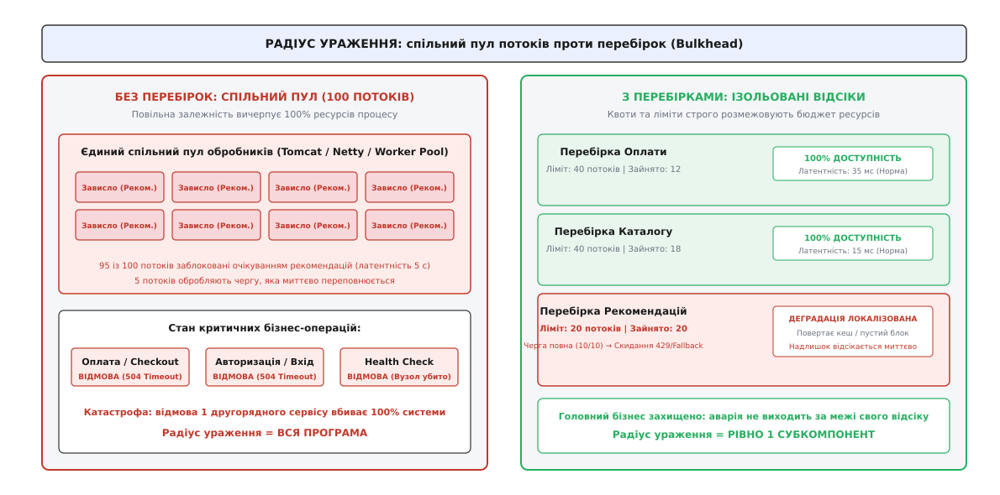
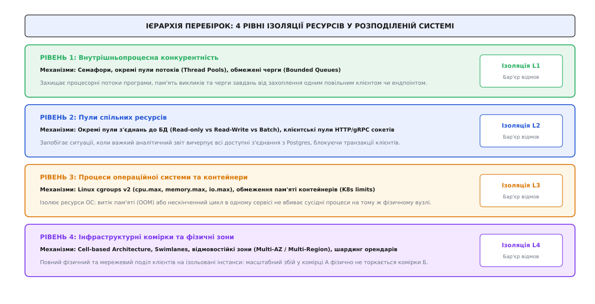
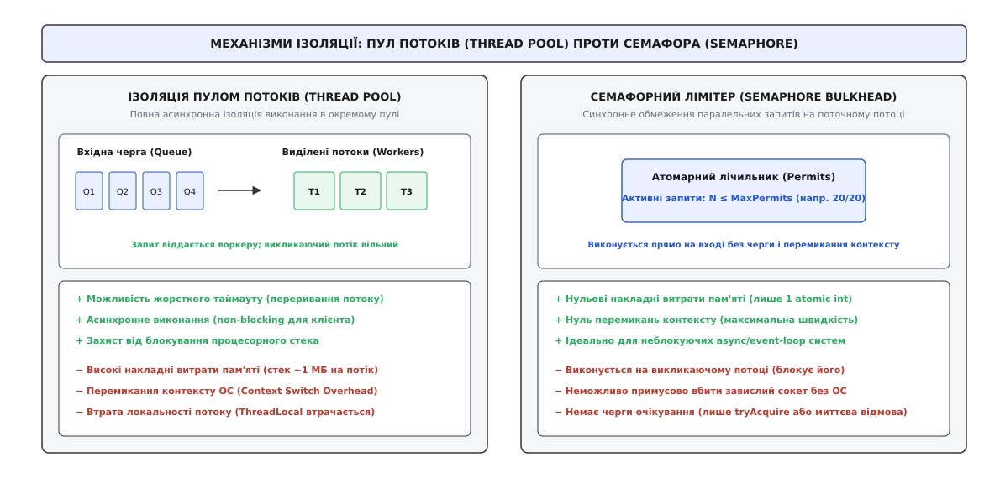
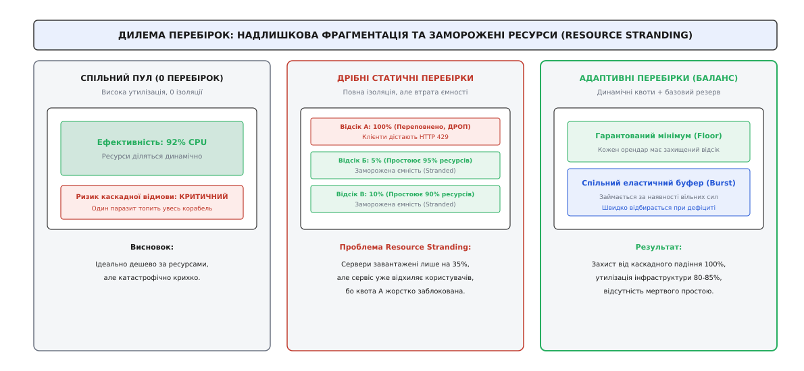

# Перебірки (Bulkhead): архітектурна ізоляція ресурсів та локалізація радіуса ураження

<preknowlist>
- [Омани розподілених обчислень](topic:programming/distributed-fallacies) — мережа ненадійна, затримки плавають, а повільна залежність небезпечніша за ту, що впала миттєво.
- [Таймаути і бюджет часу](topic:programming/timeouts-deadlines) — навіть за наявності таймаутів запит утримує системні ресурси протягом усього часу очікування.
- [Запобіжник](topic:programming/circuit-breaker-pattern) — розмикає ланцюг після фіксації серії збоїв, але до моменту спрацьовування спільні ресурси потребують локалізації.
- [Скидання навантаження і плавна деградація](topic:programming/load-shedding) — контрольоване відхилення надлишкових запитів на межі переповнення черг.
</preknowlist>

Шлюз електронної комерції приймає 600 запитів на секунду. Пул обробників налічує 200 робочих потоків. У звичайному стані авторизація займає 10 мілісекунд, оформлення замовлення — 30 мілісекунд, а блок персональних рекомендацій у нижній частині сторінки — 20 мілісекунд. Кожен потік звільняється за 40 мілісекунд, і пул завантажений лише на 12 відсотків.

Потім у сервісі рекомендацій стається збій: після оновлення індексу база даних переходить на повне сканування таблиці, і латентність виклику підскакує з 20 мілісекунд до 4 секунд.

Клієнтський HTTP-таймаут налаштовано на 5 секунд. За перші 300 мілісекунд до шлюзу надходить 180 запитів, які викликають сервіс рекомендацій. Усі 180 потоків виявляються заблокованими на читанні мережевого сокета. Ще за 50 мілісекунд решта 20 потоків також потрапляють на виклик рекомендацій. У цей момент вільних потоків у системі стає нуль.

Наступний клієнт намагається оплатити кошик на суму дві тисячі доларів. Його запит взагалі не потребує блоку рекомендацій, проте він стає у вхідну чергу вебсервера, де вже накопичилося 500 запитів. Черга переповнюється за пів секунди. Шлюз починає повертати помилку `HTTP 504 Gateway Timeout` на абсолютно всі виклики: авторизацію користувачів, перегляд кошика, списання коштів та перевірку працездатності `/healthz`. Оркестратор контейнерів бачить, що перевірка здоров'я перестала відповідати, вважає вузол завислим і перезавантажує його, перенаправляючи всю лавину запитів на сусідній екземпляр, який гине за наступні три секунди.

Через уповільнення другорядного віджета, відсутність якого покупець навіть не помітив би, весь торговельний майданчик зазнав повного знеструмлення.

## Анатомія спільного корпусу та поняття радіуса ураження

Катастрофа сталася тому, що система мала єдиний неподільний пул виконання для всіх типів операцій. Всі запити — критичні й другорядні, швидкі й важкі — черпали потоки з одного «казана».

У кораблебудуванні подібна проблема була усвідомлена сотні років тому. Якщо трюм корабля є єдиним відкритим простором, будь-яка пробоїна нижче ватерлінії затоплює весь корпус. Вода поширюється без перешкод, корабель втрачає плавучість і йде на дно.

Щоб запобігти цьому, судноділи розділили корпус на серію герметичних водонепроникних відсіків поперечними стінками — **перебірками (англ. *bulkhead*)**. Якщо обшивка пробита рифом або торпедою, вода заливає лише один чи два пошкоджені відсіки. Суміжні перебірки витримують гідростатичний тиск, судно зберігає плавучість і доходить до берега на решті відсіків.


*Радіус ураження: спільний пул обробників перетворює локальну затримку на системну катастрофу, тоді як перебірки обмежують втрати наперед визначеною квотою.*

У розподілених системах **патерн «Перебірка» (англ. *Bulkhead Pattern*)** означає примусовий поділ спільних ресурсів системи (пулів потоків, з'єднань з базами даних, оперативної пам'яті, процесорних квантів часу та черг) на строго ізольовані пули з фіксованими лімітами.

Головна мета перебірки — обмежити **радіус ураження (лат. *radius* — промінь, англ. *blast radius*)**. Якщо сторонній сервіс або внутрішній мікросервіс уповільнюється чи зазнає аварії, він може вичерпати лише ту квоту ресурсів, яка була явно виділена для його відсіку. Решта системи продовжує функціонувати у штатному режимі.

Про те, як морська інженерія від китайських джонок епохи Сун і уроків «Титаніка» трансформувалася в правила стійкості розподіленого коду, розповідає [Історія перебірок: від китайських джонок і «Титаніка» до хмарної ізоляції](topic:programming/bulkhead-isolation/hist-bulkhead-origin.md).

## Чотири фундаментальні ресурси, за які конкурують запити

Щоб правильно побудувати захисні перебірки, необхідно розуміти, які саме фізичні та операційні ресурси комп'ютера стають об'єктом вичерпання під час навантаження.

### 1. Потоки операційної системи та планувальник (OS Threads)
У класичній моделі обробки «один потік на запит» (англ. *thread-per-request*, наприклад Tomcat, gRPC sync workers, Ruby Puma, Python WSGI) кожен потік операційної системи є важким об'єктом.
- Кожен потік вимагає виділення власного стека пам'яті (зазвичай від 512 КБ до 8 МБ віртуальної пам'яті).
- Створення тисяч потоків перевантажує планувальник ядра Linux (`Completely Fair Scheduler`, CFS), через що процесор витрачає значну частку часу не на виконання бізнес-коду, а на перемикання контексту (англ. *context switching overhead*) та інвалідацію кешів процесора (L1/L2/L3 D-Cache).
- Якщо 200 потоків заблоковані в очікуванні сокета, вони не споживають CPU, проте утримують пам'ять і ліміт пулу.

### 2. Дескриптори сокетів та пули мережевих з'єднань (Connection Pools)
Встановлення TCP-з'єднання з TLS-рукостисканням вимагає обміну пакетами та витрат часу. Тому клієнти використовують пули з'єднань (англ. *connection pools*).
- Якщо пул клієнта містить 50 відкритих TCP-з'єднань до бази даних PostgreSQL, і важкий повільний SQL-запит займає всі 50 з'єднань, жодна інша транзакція не зможе виконатися, навіть якщо вона полягає у зчитуванні одного рядка за первинним ключем за 0.5 мс.
- На рівні операційної системи відкриті сокети споживають файлові дескриптори (`file descriptors`, обмежені `ulimit -n`) та пам'ять буферів сокетів (`SO_RCVBUF`, `SO_SNDBUF`).

### 3. Пам'ять купи та буфери черг (Heap & Queue Buffers)
Коли потік блокується, запити, що продовжують надходити, осідають у пам'яті.
- Якщо перед пулом потоків стоїть нескінченна черга (англ. *unbounded queue*), у ній накопичуються десятки тисяч об'єктів запитів із тілами JSON/Protobuf.
- Це викликає стрімке зростання споживання пам'яті, що призводить або до неконтрольованих пауз збирача сміття (`Stop-The-World GC` у Java/Go), або до примусового вбивства процесу операційною системою через нестачу пам'яті (**OOM Killer** у Linux).

### 4. Процесорний час та черги очікування на синхронізації (CPU & Lock Contention)
Навіть в асинхронних архітектурах на базі циклу подій (англ. *event loop*, наприклад Node.js, Netty, Rust Tokio, Go runtime) один важкий запит, що виконує складну криптографію, парсинг гігантського XML або регулярний вираз із катастрофічним поверненням (англ. *catastrophic backtracking*), монополізує процесорне ядро. У результаті тисячі легких асинхронних завдань у черзі очікують своєї черги і відмирають за таймаутом.

## Чотири архітектурні рівні ізоляції перебірок

Ізоляція перебірками не обмежується програмним кодом окремої функції. Вона будується ієрархічно на чотирьох рівнях системи: від внутрішніх структур даних процесу до фізичного поділу інфраструктури.


*Ієрархія перебірок у розподіленій системі: кожен рівень стримує свій клас каскадних збоїв — від зависання окремого потоку до падіння всього датацентру.*

### Рівень 1: Внутрішньопроцесна конкурентність (In-process Concurrency)

На рівні коду програми застосовують два фундаментальні механізми ізоляції: пули потоків та семафори.


*Пул потоків проти семафора: вибір між ізоляцією виконання з можливістю асинхронного таймауту та нульовими накладними витратами на перемикання контексту.*

#### 1. Ізоляція пулом потоків (Thread Pool Isolation)
Кожен зовнішній виклик або клієнтська бібліотека отримує власний виділений пул потоків з обмеженою вхідною чергою.
- **Як це працює:** головний потік, що прийняв запит, відправляє завдання у чергу потрібного пулу і негайно звільняється (або чекає на завершення майбутнього результату через `std::future`, `Promise` чи `CompletableFuture`).
- **Переваги:** повна ізоляція процесорного виконання. Якщо віддалений сервіс зависає, зависають лише потоки цього виділеного пулу. Викликаючий сервіс може перервати очікування за власним таймаутом, не блокуючи свої ресурси.
- **Ціна:** накладні витрати на виділення пам'яті для стеків потоків та перемикання контексту операційної системи.

#### 2. Семафорний лімітер (Semaphore / Concurrency Limiter)
Синхронне обмеження кількості паралельних виконань за допомогою атомарного лічильника дозволів (англ. *permits*).
- **Як це працює:** перед початком виконання запиту потік намагається атомарно зменшити лічильник семафора (`try_acquire`). Якщо значення більше нуля, лічильник декрементується, і запит виконується на **поточному** потоці. Після завершення операції дозвіл повертається (`release`). Якщо вільних дозволів немає, запит відхиляється негайно (або після короткого очікування).
- **Переваги:** практично нульові накладні витрати пам'яті (одне атомарне ціле число) і нуль перемикань контексту. Ідеально підходить для неблокуючих реактивних клієнтів (Netty, gRPC async, Go goroutines).
- **Обмеження:** виконання відбувається на викликаючому потоці. Якщо віддалений виклик є блокуючим і не має внутрішнього таймауту сокета, він заблокує викликаючий потік.

Повний інженерний код обох підходів із захистом від витоків наведено у вставці [Реалізація перебірки: семафорний та пуловий захист ресурсів](topic:programming/bulkhead-isolation/proj-resilient-bulkhead.md).

#### Політики поведінки при переповненні перебірки (Rejection Policies)
Коли ліміт дозволів або черга пулу вичерпані, перебірка повинна миттєво відреагувати. Існує чотири стратегії:
1. **Миттєве відхилення (Abort / Fast Rejection):** запит відкидається за 0.1 мілісекунди зі статусом `429 Too Many Requests` або `503 Service Unavailable`. Це рятує клієнта від очікування та інформує про перевантаження.
2. **Запасний результат (Fallback):** повернення статичної відповіді за замовчуванням, порожнього списку або застарілих даних із локального кешу.
3. **Безшумний скид (Discard):** ігнорування запиту (застосовується виключно для некритичної фонової аналітики та збору метрик).
4. **Виконання викликачем (Caller-Runs):** антипатерн для вебсерверів. Потік, що приніс запит, змушений виконувати його сам. Це миттєво блокує вхідний цикл подій вебсервера і знищує захисний ефект перебірки.

### Рівень 2: Ізоляція пулів спільних ресурсів (Connection Pools & IO)

На рівні роботи зі сховищами даних та зовнішніми мережевими клієнтами перебірки організують через сегментацію пулів з'єднань.

Типовою помилкою є використання єдиного пулу з'єднань з реляційною базою даних (наприклад, 100 з'єднань у пулі HikariCP або pgxpool) для всього додатку. Якщо адміністратор запускає важкий аналітичний звіт або пакетне вивантаження замовлень за минулий рік, ці тривалі транзакції займають усі 100 з'єднань. У цей час звичайні клієнти не можуть перевірити баланс чи авторизуватися.

Архітектурно правильне рішення — поділ на незалежні пули:
- **Транзакційний пул (OLTP Write Pool):** 40 з'єднань, зарезервованих виключно для швидких операцій запису та фінансових проводок.
- **Пул читання (OLTP Read Pool):** 40 з'єднань, зарезервованих для швидких вибірок за первинними та вторинними індексами.
- **Аналітичний/Пакетний пул (Batch / Report Pool):** 10 з'єднань із жорстким обмеженням тривалості SQL-запиту (`statement_timeout = 5s`).
- **Службовий пул (Admin / Migration Pool):** 10 з'єднань для міграцій схеми та внутрішніх перевірок здоров'я сервісу.

Аналогічний поділ застосовують для вихідних HTTP/gRPC-клієнтів: замість єдиного глобального клієнта створюють окремі екземпляри клієнтів з власними пулами з'єднань для кожного віддаленого домену.

### Рівень 3: Ізоляція на рівні ядра ОС та контейнерів (cgroups v2)

На рівні операційної системи та контейнеризації (Docker, Kubernetes) перебірки реалізуються за допомогою контрольних груп ядра Linux (**cgroups v2**).

Якщо два процеси запущені на одному фізичному сервері без обмежень, один процес із витоком пам'яті змусить ядро активувати OOM Killer, який може вбити сусідній критичний процес. Процес із нескінченним циклом обчислень захопить 100% усіх ядер процесора, спричинивши голодування сусідів.

Контрольні групи cgroups v2 встановлюють жорсткі межі:
- `cpu.max` — обмежує максимальну частку процесорного часу (квота в мікросекундах за період, наприклад `200000 100000` = максимум 2 ядра CPU);
- `memory.max` — жорстка стеля оперативної пам'яті. Перевищення викликає локальний OOM-кілер виключно всередині цієї групи, не торкаючись сусідніх контейнерів;
- `memory.high` — м'яка межа пам'яті, при досягненні якої ядро починає агресивно скидати сторінковий кеш і пригальмовувати виділення пам'яті процесу, запобігаючи аварійній зупинці;
- `io.max` — квотування кількості операцій вводу-виводу (IOPS) та пропускної здатності диска (байт/с), що не дозволяє одному процесу паралізувати диск записом великих файлів.

У Kubernetes це транслюється у директиви `resources.limits` та `resources.requests`, які оркестратор перетворює у конфігурацію відповідних псевдофайлів у файловій системі `/sys/fs/cgroup/`.

### Рівень 4: Інфраструктурні комірки та смуги (Cell-Based Architecture & Swimlanes)

Найвищим рівнем реалізації перебірок є фізичний поділ інфраструктури — **коміркова архітектура (англ. *Cell-based Architecture*)** або **смуги руху (англ. *swimlanes*)**.

У класичній централізованій хмарі всі користувачі обслуговуються єдиним гігантським кластером. Помилка конфігурації, збій маршрутизації або отруйне повідомлення (англ. *poison pill*), надіслане одним користувачем, здатне покласти всю глобальну платформу.

У комірковій архітектурі система розбивається на десятки повністю незалежних і самодостатніх екземплярів — «комірок» (англ. *cells*).
- Кожна комірка містить власний API-шлюз, мікросервіси, бази даних та черги повідомлень. Комірки не мають спільних точок відмови у площині даних.
- Спеціальний тонкий маршрутизатор на вході (англ. *cell router*) зіставляє ідентифікатор користувача (або організації) з номером його комірки.
- Якщо платформа розбита на 20 комірок, і в комірці №7 стається катастрофічний збій бази даних, радіус ураження становить строго **5% користувачів**. Решта 95% користувачів навіть не помітять наявності аварії.

Аналогічний принцип застосовують для ізоляції орендарів у SaaS-системах (мультиарендність): преміальні клієнти корпоративного рівня отримують виділені комірки обчислень, тоді як безкоштовні користувачі ділять спільний ізольований пул з жорсткими квотами (докладніше див. [Мультиарендність](topic:programming/tenant-isolation)).

## Математика розрахунку та дилема «заморожених ресурсів» (Resource Stranding)

Скільки саме потоків, з'єднань чи семафорних дозволів необхідно виділити на кожну перебірку?

Базовий розрахунок спирається на **закон Літтла**: кількість активних викликів `L` дорівнює добутку швидкості запитів `λ` на час виконання `W`:

```
L = λ · W
```

Якщо пікове навантаження на платіжний сервіс становить `λ_peak = 500` запитів на секунду, а 99-й перцентиль латентності дорівнює `W_p99 = 80` мс (0.080 с), базовий рівень необхідної конкурентності становить:

```
C_base = 500 · 0.080 = 40 слотів
```

З урахуванням випадкових пуассонівських сплесків вхідного потоку додається коефіцієнт безпеки `k_burst = 2.33` (для покриття 99% сплесків):

```
C = ⌈C_base + k_burst · √(C_base)⌉
  = ⌈40 + 2.33 · √(40)⌉            [підстановка: C_base = 40, k_burst = 2.33]
  = ⌈40 + 2.33 · 6.3245⌉          [обчислення кореня: √40 ≈ 6.3245]
  = ⌈54.73⌉                        [множення: 2.33 · 6.3245 ≈ 14.73]
  = 55                             [округлення до найближчої стелі]
```

Детальний математичний вивід з використанням теорії черг `M/M/c/K` та формул Ерланга викладено у вставці [Математика перебірок: теорія черг, закон Літтла і розрахунок місткості](topic:programming/bulkhead-isolation/math-bulkhead-sizing.md).

### Дилема перебірок: заморожування місткості (Resource Stranding)

Під час розділення системи на велику кількість статичних перебірок виникає фундаментальний інженерний компроміс: **дилема «заморожених ресурсів» (англ. *resource stranding*)**.


*Дилема перебірок: дрібні статичні відсіки створюють заморожену ємність, яку розв'язують через адаптивні ліміти та еластичні спільні буфери.*

Якщо розбити загальний пул із 100 потоків на 5 ізольованих перебірок по 20 потоків:
- Якщо у відсіку А відбувається сплеск трафіку, і йому потрібно 25 потоків, він почне відхиляти запити клієнтів (помилка 429), досягнувши ліміту 20.
- У цей самий час відсіки Б, В, Г і Д завантажені лише на 2 потоки кожен, і 72 потоки на сервері простоюють.
- Загальна утилізація сервера становить лише 28%, але сервіс уже відмовляє користувачам у бізнес-операціях.

Цей ефект описується законом додавання дисперсій: сумарний захисний буфер, необхідний для `N` незалежних перебірок, у `√N` разів більший за буфер, необхідний єдиному спільному пулу.

### Розв'язання: адаптивні перебірки (Dynamic / Adaptive Bulkheads)

Щоб подолати неефективність статичного поділу, сучасні системи використовують **адаптивні ліміти конкурентності (англ. *Adaptive Concurrency Limits*)**.

Замість фіксованих чисел ліміт перебірки динамічно підлаштовується в реальному часі за алгоритмами керування перевантаженням (подібно до алгоритму TCP Vegas):
1. Алгоритм безперервно вимірює мінімальну базову латентність віддаленого сервісу в ненавантаженому стані (`RTT_no_load`).
2. Якщо поточна латентність `RTT_actual` починає зростати вище базової (ознака накопичення черги на стороні бекенда), ліміт перебірки плавно зменшується за правилом мультиплікативного зменшення (AIMD).
3. Коли латентність нормалізується, ліміт поступово збільшується.
4. Для кожного відсіку гарантується захищений мінімальний поріг (англ. *floor allocation*), нижче якого квота не падає ніколи, а доступ до верхнього спільного буфера надається динамічно.

Докладніше про алгоритми динамічного регулювання див. [Адаптивні ліміти конкурентності](topic:programming/adaptive-concurrency).

## Симбіоз захисних шаблонів: як перебірка працює з запобіжником

Перебірка не працює у вакуумі. Вона є складовою тріади архітектурної стійкості разом із [Запобіжником (Circuit Breaker)](topic:programming/circuit-breaker-pattern) та [Скиданням навантаження (Load Shedding)](topic:programming/load-shedding).

Між перебіркою та запобіжником існує чіткий розподіл часових обов'язків:

| Характеристика | Перебірка (Bulkhead) | Запобіжник (Circuit Breaker) |
| :--- | :--- | :--- |
| **Головна мета** | Квотування та ізоляція ресурсів процесу | Припинення трафіку до мертвої залежності |
| **Час реакції** | Миттєво на кожному окремому запиті | З затримкою (після накопичення вікна помилок) |
| **Що контролює** | Кількість паралельно активних запитів (`Concurrency`) | Відсоток невдалих відповідей за інтервал часу (`Failure Rate`) |
| **Поведінка при збої** | Відсікає лише ті запити, що перевищують ліміт | Повністю блокує 100% запитів у стані `OPEN` |

### Хронологія спільної роботи під час аварії

Розглянемо, як перебірка та запобіжник взаємодіють під час падіння залежного сервісу:

```
Хронологія аварії:
t = 0.0 с:  Сервіс B уповільнюється з 20 мс до 5000 мс.
t = 0.2 с:  Перебірка Сервісу B заповнюється до ліміту (20/20 слотів).
            Вхідні потоки Сервісу A захищені: решта 180 потоків вільно
            обслуговують інші операції.
t = 0.2..3с:Перебірка миттєво відхиляє 21-й і наступні запити до B,
            повертаючи fallback або помилку 429.
t = 3.0 с:  Запобіжник підраховує статистику ковзного вікна: 90% викликів
            завершилися таймаутом або помилкою. Запобіжник переходить у стан OPEN.
t = 3.0..30с:Запобіжник розімкнено: запити до B відхиляються взагалі БЕЗ
            спроби взяти слот у перебірці (нульові витрати ресурсів).
t = 30.0 с: Запобіжник переходить у стан HALF-OPEN для перевірки одужання B.
            Перебірка гарантує, що пробні запити не перевантажать сервіс B.
```

Без перебірки за перші три секунди (доки запобіжник накопичить статистику помилок) система встигла б повністю вичерпати спільний пул потоків і загинути. Перебірка захищає ресурси у «сірій зоні» на початку аварії.

Практичні конфігурації для налаштування цих порогів у проксі Envoy та бібліотеці Resilience4j наведено у довіднику [Специфікація та конфігурація перебірок: Envoy, Resilience4j та хмарні шлюзи](topic:programming/bulkhead-isolation/api-bulkhead-config.md).

## Підводні камені, приховані зв'язки та крайові випадки

Навіть бездоганно налаштовані перебірки можуть бути знешкоджені прихованими архітектурними зв'язками.

### 1. Приховане блокування нижче за течією (Hidden Downstream Contention)
Сервіс створює два строго ізольовані пули потоків: один для обробки вебзамовлень, другий для фонової генерації чеків. Обидва пули ізольовані семафорами.
Проте обидва обробники звертаються до однієї таблиці бази даних `orders` і виконують вираз `SELECT ... FOR UPDATE` на одному рядку. Потік фонової генерації захоплює ексклюзивне блокування рядка на 5 секунд.
У результаті потік вебзамовлень, маючи вільний слот у своїй перебірці, зависає на рівні блокування всередині СУБД. Ізоляція на рівні клієнта виявилася марною через спільне блокування на рівні сховища.

### 2. Роздуття пам'яті на виділених пулах потоків (Thread Stack Bloat)
Архітектор створює 30 окремих перебірок на базі виділених пулів потоків по 30 потоків у кожному.
Загальна кількість потоків у процесі сягає `30 · 30 = 900` потоків операційної системи. При стандартному розмірі стека 1 МБ лише під стеки потоків виділяється 900 МБ оперативної пам'яті. Крім того, перемикання контексту між 900 потоками з'їдає до 25% процесорної потужності сервера.
**Правило:** для великої кількості перебірок всередині одного процесу слід використовувати семафори або віртуальні потоки (Loom у Java, Goroutines у Go, Task у C#), а виділені пули потоків ОС резервувати лише для найбільш критичних важких ізоляцій.

### 3. Небезпека довгих черг перед перебіркою
Черга очікування перед перебіркою, що перевищує 10–20 елементів, перетворюється на фабрику застарілих запитів (англ. *stale requests*).
Якщо час обслуговування запиту становить 100 мс, а черга містить 200 елементів при 10 потоках, час очікування в черзі складе `(200 · 100) / 10 = 2000` мс (2 секунди). Клієнт давно отримає таймаут у браузері, але сервер витратить ресурси на обробку непотрібного запиту. Черги перебірок повинні бути мінімальними, а надлишок повинен відхилятися негайно.

### 4. Інверсія пріоритетів і пастка CallerRunsPolicy
Політика `CallerRunsPolicy` (виконання відхиленого завдання безпосередньо викликаючим потоком) є однією з найпідступніших мін в архітектурі бекендів.
Розглянемо вебсервер, де пул з 8 потоків циклу подій (Netty EventLoop) приймає всі вхідні HTTP-з'єднання і перенаправляє бізнес-логіку у виділений пул воркерів. Якщо пул воркерів переповнюється, і увімкнено `CallerRunsPolicy`, один із потоків EventLoop бере повільне завдання і починає самостійно виконувати блокуючий мережевий виклик.
У цю мить потік циклу подій перестає обробляти TCP-події `EPOLLIN` для сотень інших активних клієнтів. Коли всі 8 потоків EventLoop захоплюються повільними завданнями, сервер припиняє навіть приймати нові TCP SYN-пакети. Захисний механізм перебірки обертається повною паралізацією мережевого введення-виведення.

## Віртуальні потоки та перебірки: ілюзія нескінченних ресурсів

Поява легковагових потоків виконання — віртуальних потоків (англ. *Virtual Threads / Project Loom* у Java 21+), горутин (англ. *Goroutines* у Go) та корутин (у Kotlin, C# та Python) — породила небезпечну інженерну ілюзію: «Якщо створення мільйона віртуальних потоків займає лише кілька гігабайтів пам'яті, то пули потоків і перебірки більше не потрібні».

Це твердження є критичною оманою.

Віртуальні потоки розв'язують проблему вартості **потоків операційної системи**, але вони не змінюють законів взаємодії з фізичним світом:
1. **Зовнішні сервіси мають скінченну місткість:** якщо віддалений платіжний сервіс витримує 200 одночасних запитів, створення 10 000 віртуальних потоків, які одночасно вдарять по ньому, миттєво спричинить відмову в обслуговуванні (DDoS власної залежності).
2. **Пули з'єднань з базами даних обмежені:** сервер СУБД PostgreSQL не може підтримувати 10 000 одночасних активних транзакцій через обмеження оперативної пам'яті на контекст процесу та конкуренцію за блокування сторінок у Shared Buffers.
3. **Сокетні буфери ядра Linux споживають реальну пам'ять:** 50 000 відкритих TCP-з'єднань утримують гігабайти пам'яті ядра на рівні сокетних буферів (`tcp_rmem`, `tcp_wmem`), навіть якщо вони прив'язані до невагомих віртуальних горутин.

У світі віртуальних потоків перебірки трансформуються з **пулів виконання** на **семафорні лімітери та квоти ресурсів**. Замість виділення фіксованого пулу потоків ОС сервіс використовує віртуальні потоки для обчислень, але обмежує доступ до кожної залежності суворим асинхронним семафором.

## Простеження та діагностика перебірок через procfs, sysfs та eBPF

Надійність перебірок у виробничому середовищі повинна безперервно верифікуватися на рівні операційної системи.

### 1. Перевірка cgroups v2 через `/sys/fs/cgroup/`
Для контейнеризованих додатків стан перебірок процесора та пам'яті перевіряють безпосередньо через файловий інтерфейс ядра Linux:

```bash
# Перевірка тротлінгу процесора контейнера (CPU Throttling)
cat /sys/fs/cgroup/system.slice/docker-*.scope/cpu.stat
# nr_periods 125400      — загальна кількість квантів часу
# nr_throttled 3420      — кількість квантів, коли процес було примусово призупинено
# throttled_usec 4502300 — сумарний час перебування в тротлінгу (мікросекунди)

# Перевірка наближення до межі пам'яті (Memory Pressure)
cat /sys/fs/cgroup/system.slice/docker-*.scope/memory.pressure
# some avg10=2.45 avg60=1.12 avg300=0.45 total=1230490
```

Якщо показник `nr_throttled` перевищує 5–10% від загальної кількості періодів, квота перебірки `cpu.max` встановлена занадто агресивно і спричиняє штучну затримку обробки запитів.

### 2. Діагностика сокетів через `/proc/net/`
Вичерпання сокетних перебірок відстежують через системну статистику дескрипторів:

```bash
# Кількість відкритих файлових дескрипторів процесу
ls -l /proc/<PID>/fd | wc -l

# Стан сокетів процесу та розмір заповнення буферів черги
cat /proc/net/tcp
```

### 3. Низькорівневе простеження затримок через eBPF
За допомогою інструментів BCC та `bpftrace` інженери можуть спостерігати затримку очікування в черзі перебірки без модифікації коду програми, перехоплюючи точки входу ядра:

```text
// Відстеження часу перебування потоків у блокуванні на семафорах futex
bpftrace -e 'tracepoint:syscalls:sys_enter_futex /pid == target_pid/ { @start[tid] = nsecs; }
             tracepoint:syscalls:sys_exit_futex /@start[tid]/ {
                 @wait_ns = hist(nsecs - @start[tid]);
                 delete(@start[tid]);
             }'
```

Це дозволяє точно зафіксувати, скільки мілісекунд запити проводять в очікуванні слота перебірки на рівні системних викликів.

> 🔧 **Навіщо це.**
>
> 1. **Класифікуйте операції за бізнес-критичністю:** виділіть гарантовані перебірки для операцій, що приносять гроші (Checkout, Login, Payment), та жорстко обмежте ресурси для декоративних і фонових функцій (Recommendations, Reviews, Analytics).
> 2. **Розділяйте пули бази даних:** ніколи не використовуйте єдиний пул з'єднань СУБД для читання, запису та важких звітів.
> 3. **Утримуйте черги перебірок короткими:** краще миттєво повернути `429 Too Many Requests` на 20-му запиті, ніж змусити 500 запитів чекати 5 секунд і померти за таймаутом.
> 4. **Налаштовуйте cgroups limits у контейнерах:** кожен мікросервіс у Kubernetes зобов'язаний мати прописані `limits` за пам'яттю та CPU, щоб локалізувати аварію всередині контейнера.
> 5. **Комбінуйте перебірку з запобіжником:** перебірка локалізує навантаження в перші мілісекунди, а запобіжник повністю відсікає трафік після фіксації стабільного збою.

## Інженерний синтез

Надійність розподіленої системи визначається не відсутністю аварій, а здатністю системи виживати в умовах, коли окремі її компоненти неминуче деградують або зазнають краху.

Єдиний спільний простір ресурсів є найдешевшим з погляду утилізації обладнання, проте він перетворює будь-яку локальну несправність на фатальну системну подію.

Перебірки змінюють цю парадигму: вони впроваджують суворі архітектурні кордони між підсистемами. Поділ ресурсів на ізольовані відсіки — на рівні семафорів коду, пулів сокетів, обмежень cgroups або цілих інфраструктурних комірок — гарантує, що жоден збій не зможе поширитися за межі свого радіуса ураження. Ціною незначного резервування потужностей інженерія перебірок забезпечує безперервну життєздатність головного бізнесу системи.
