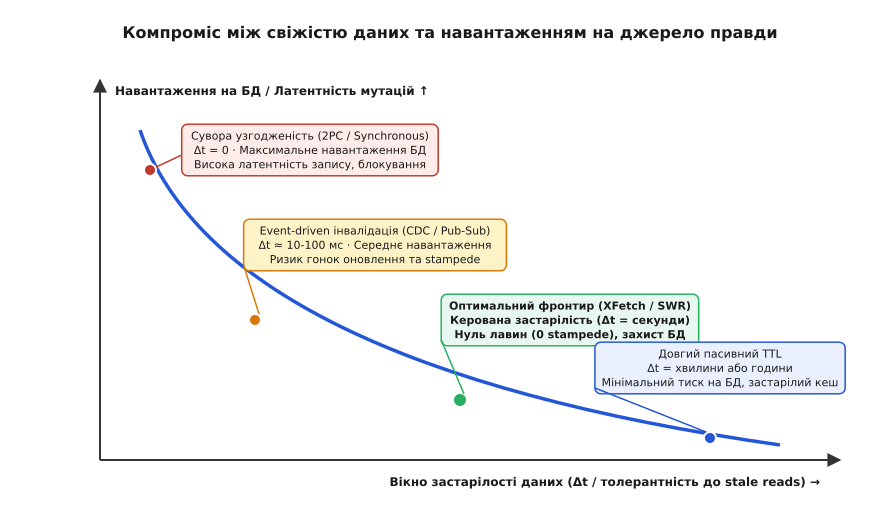
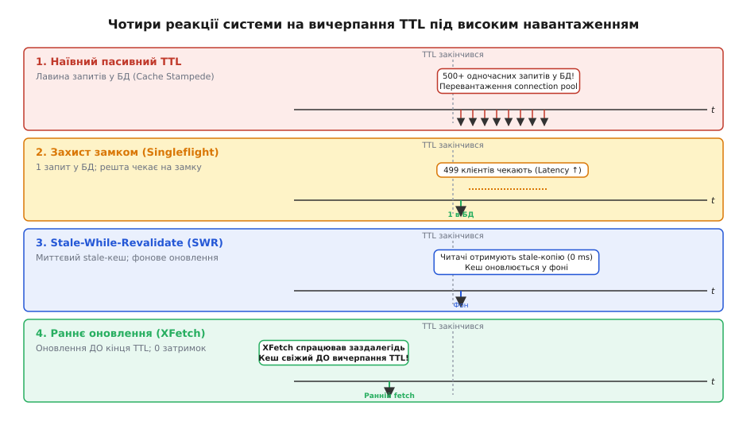
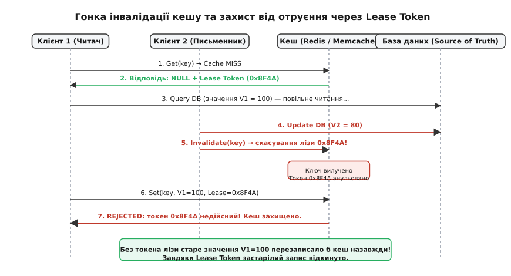

# Свіжість проти навантаження: компроміс узгодженості кешу

<preknowlist>
- [Кеш](book:programming/cache) — ієрархія пам'яті, збереження гарячих копій даних для швидкого повторного доступу.
- [Патерни кешування](book:programming/caching-strategies) — cache-aside, write-through, write-behind та їхня поведінка під час запису.
- [Кеш вводить друге джерело правди](book:programming/cache-invalidation-intro) — дублювання стану, проблеми подвійного запису та механіка інвалідації.
- [Теорема CAP та PACELC](book:programming/cap-theorem) — фундаментальний компроміс між узгодженістю, доступністю та латентністю в розподілених системах.
- [Статистика Пуассона](book:math/poisson-statistics) — математична модель випадкового потоку незалежних подій у часі.
</preknowlist>

Інтернет-магазин під час святкового розпродажу обслуговує 50 000 запитів за секунду на сторінки товарів. Щоб захистити реляційну базу даних PostgreSQL, перед нею встановлено розподілений кеш Redis із часткою влучань 99.8 %: до дисків бази доходить лише 100 запитів на секунду. Менеджер змінює ціну акційного смартфона з 500 до 350 доларів. Якщо запис у кеші має фіксований час життя (TTL) 10 хвилин, протягом наступних 600 секунд сотні покупців оформлюють замовлення за старою ціною, що призводить до тисяч конфліктних скасувань. Якщо ж сервіс миттєво видаляє ключ із кешу в момент оновлення ціни, перші ж 500 паралельних запитів у наступні 10 мілісекунд стикаються з промахом, одночасно б'ють важкими SQL-вибірками в один рядок таблиці, вичерпують пул з'єднань і кладуть базу даних із завантаженням процесора 100 %.

Ця ситуація демонструє нерозв'язну дилему розподіленої архітектури: прагнення до абсолютної свіжості даних руйнує первинне сховище лавиною запитів, тоді як ізоляція сховища довгим кешуванням змушує клієнтів читати застарілий або спотворений стан.

У розподілених системах цей баланс називають компромісом між свіжістю та навантаженням (англ. *cache consistency tradeoff*, від лат. *consistere* — «стояти разом, узгоджуватися»).

## Анатомія компромісу: чому виникає часовий розрив

Будь-який кеш за своєю фізичною природою є вторинною, асинхронно оновлюваною реплікою даних. Існує первинне джерело правди (англ. *Source of Truth*, найчастіше транзакційна СУБД) та оперативна пам'ять кешу (Redis, Memcached, локальний LRU-буфер), яка зберігає копію для швидких повторних читань.

Щойно стан об'єкта в базі даних змінюється, виникає часовий інтервал розходження, який називають **вікном застарілості** (англ. *staleness window*):

```
Δt = t_cache_updated − t_db_committed
```

У межах цього інтервалу `Δt` будь-яке читання з кешу повертає застаріле значення (англ. *stale read*).


*Крива Парето-фронтиру між свіжістю даних (вікном застарілості Δt) та навантаженням на базу даних. Намагання звести Δt до абсолютного нуля вимагає синхронних двофазних блокувань і різко підвищує латентність мутацій. Збільшення Δt захищає базу, але підвищує ризик читання розбіжного стану.*

Розгляньмо зв'язок між вікном застарілості та навантаженням на джерело правди кількісно. Нехай потік запитів на читання деякого ключа має інтенсивність `Q` (запитів на секунду). Якщо ключ кешується на час `TTL`, то кожні `TTL` секунд стається щонайменше один промах, який генерує запит до бази даних. Середня частота запитів до джерела правди становить:

```
Q_db ≈ 1 / TTL    (за відсутності паралельних лавин)
```

Якщо для досягнення високої свіжості ми зменшуємо `TTL` із 600 секунд (10 хвилин) до 1 секунди, навантаження на базу даних для одного ключа зростає в **600 разів**. Для каталогу з 100 000 активних товарів це означає стрибок від 166 запитів/с до 100 000 запитів/с до СУБД.

Кожна точка на кривій компромісу — це інженерний вибір між двома крайніми полюсами системи.

## Два крайні полюси: сувора узгодженість проти повного екранування

Щоб зрозуміти простір рішень, розгляньмо поведінку системи на двох екстремальних межах.

### Полюс 1: Сувора узгодженість (Zero Staleness, Δt = 0)
Вимога: жоден клієнт за жодних обставин не повинен прочитати з кешу значення, відмінне від останнього підтвердженого коміту в базі даних.

Для досягнення цієї гарантії систему змушують працювати за протоколом розподіленої транзакції (двофазний коміт, 2PC) або синхронного наскрізного запису (Write-Through з ексклюзивним розподіленим блокуванням):
1. Письменник бере розподілений замок на ключ у базі даних і в кеші.
2. Письменник оновлює рядок у базі.
3. Письменник оновлює або видаляє запис у кеші.
4. Письменник відпускає замки та повертає успіх клієнту.

Ціна цього підходу катастрофічна:
- **Латентність запису** зростає в 5–10 разів через необхідність мережевих раундтріпів до кількох систем під блокуванням.
- **Доступність (Availability за CAP/PACELC)** різко падає: падіння або мережеве розділення вузла Redis блокує всі операції запису в базу даних.
- **Масштабованість читань:** якщо кожна мутація інвалідує кеш, а частота запису висока, частка влучань (`hit rate`) падає до нуля, і кеш перетворюється на дорогу та безкорисну прокладку.

### Полюс 2: Максимальне екранування (High Staleness, Δt ≫ 0)
Вимога: первинна база даних взагалі не повинна відчувати навантаження від читань, а час відповіді клієнту має бути меншим за 1 мілісекунду.

Рішення: встановлення пасивного TTL тривалістю в кілька годин або повна відмова від інвалідацій на користь фонового нічного перерахунку.

Ціна:
- Користувачі спостерігають розбіжності між різними сторінками сайту (наприклад, товар додано в кошик за новою ціною, а в каталозі відображається стара).
- У разі збоїв або відкатів транзакцій кеш продовжує роздавати скасовані дані до повного вичерпання TTL.

Більшість систем не можуть дозволити собі жоден із цих полюсів. Вони працюють у зоні компромісу, де головним викликом стає поведінка системи в момент оновлення даних.

## Катастрофа наївного TTL: лавина промахів (Cache Stampede)

Найпоширеніша помилка при проектуванні кешування — спроба регулювати свіжість простим скороченням детермінованого часу життя `TTL`.

Уявімо гарячий ключ новинної статті або котирування акції, до якого надходить `Q = 10 000` запитів за секунду. Час виконання запиту в базі даних (вибірка, об'єднання таблиць, серіалізація в JSON) становить `δ = 50` мілісекунд (0.05 с).

Поки `TTL` діє, кеш повертає відповідь за 0.2 мс. Але рівно в мить `t = T_expiry` запис зникає з пам'яті. У наступні 50 мілісекунд, поки перший потік іде в базу по свіжі дані, до кешу надходить:

```
N_concurrent = Q · δ = 10 000 · 0.05 = 500 запитів
```

Усі 500 клієнтських потоків бачать промах (`cache miss`). Не маючи координації між собою, усі 500 потоків одночасно відправляють 500 однакових важких SQL-запитів до бази даних.


*Порівняння чотирьох архітектурних реакцій на закінчення терміну дії ключа. Наївний TTL породжує шквал із 500 запитів. Singleflight скорочує тиск до одного запиту, але змушує клієнтів чекати. SWR повертає застаріле значення без затримок. XFetch оновлює кеш заздалегідь, поєднуючи нульову затримку з нульовим ризиком лавини.*

Наслідки лавини промахів (англ. *cache stampede*, або *thundering herd*):
1. **Вичерпання пулу з'єднань (Connection Pool Exhaustion):** пул на 100 з'єднань миттєво забивається, інші 400 запитів стають у чергу очікування в пам'яті бекенда.
2. **Деградація часу відповіді:** час виконання запиту базою даних стрибає від 50 мс до 5–10 секунд через конкуренцію за процесорні ядра та блокування таблиць.
3. **Каскадна відмова (Cascading Failure):** вебсервери вичерпують ліміти пам'яті та таймаутів, клієнти починають надсилати повторні запити (retry storms), що остаточно добиває базу даних.

Збільшення кількості серверів бази даних не рятує від лавини: проблема полягає в синхронному характері пробою. Щоб посунути криву компромісу в бік одночасної свіжості та низького навантаження, інженерія розподілених систем виробила п'ять спеціальних стратегій.

## Стратегія 1: Дедуплікація викликів (Singleflight та м'ютекси)

Перший бар'єр захисту — примусова дедуплікація однакових запитів під час промаху кешу.

Ідея полягає в тому, що коли 500 потоків одночасно бачать промах на ключ `product:123`, право піти в базу даних отримує рівно **один** потік (лідер). Решта 499 потоків підвішуються на умовній змінній або м'ютексі. Коли лідер повертається з результатом і записує його в кеш, він пробуджує всі очікуючі потоки й роздає їм отримане значення.

Плюси:
- Навантаження на базу даних строго обмежене: рівно **1 запит** на кожен прострочений ключ незалежно від того, чи надходить 100, чи 100 000 звернень за секунду.

Мінуси та компроміси:
- **Затримка для читачів:** усі 499 очікуючих клієнтів змушені чекати повний час виконання запиту базою `δ = 50` мс. Їхній час відповіді стрибає від мікросекунд до десятків мілісекунд (зростає p99 latency).
- **Ризик зависання черги:** якщо потік-лідер зависає через повільний сокет або зазнає збою (panic), усі підвішені клієнти ризикують чекати до вичерпання глобального таймауту.

Повний розбір внутрішньої побудови механізму дедуплікації та його безпечної синхронізації наведено у вставці: [реалізація Singleflight та XFetch](book:programming/cache-consistency-tradeoff/proj-singleflight-xfetch.md).

## Стратегія 2: Імовірнісне раннє оновлення (Алгоритм XFetch)

Якщо ми не хочемо, щоб клієнти взагалі відчували затримку очікування на базі, запис необхідно оновити **до того**, як настане його номінальний час смерті `T_expiry`.

Проте детерміноване оновлення «за 100 мс до кінця» створює ту саму проблему: перший же клієнт рівно за 100 мс оновить запис, що фактично просто скоротить TTL. Якщо ж трафік низький, у це 100-мілісекундне вікно може взагалі не потрапити жоден запит, і пробій все одно відбудеться.

У 2015 році дослідники Андреа Ваттані, Флавіо К'єрікетті та Кіган Ловенштайн запропонували алгоритм **XFetch** (ймовірнісне випереджальне вичерпання).

Під час кожного читання клієнт генерує випадкове число `U ∈ (0, 1]` і перевіряє умову:

```
−β · δ · ln(U) > T_expiry − t
```

де:
- `t` — поточний астрономічний час;
- `T_expiry − t` — час, що залишився до номінального вичерпання TTL;
- `δ` — час виконання останнього обчислення в базі даних (зберігається поруч із даними в кеші);
- `β > 0` — коефіцієнт агресивності оновлення (за замовчуванням `β = 1.0`);
- `ln(U)` — натуральний логарифм випадкової величини `U`.

Математична магія алгоритму полягає в тому, що:
1. Далеко від закінчення терміну дії ймовірність спрацювання умови прямує до нуля.
2. У міру наближення до `T_expiry` ймовірність плавно зростає, наче м'яка нелінійна пружина.
3. Для пуассонівського потоку будь-якої інтенсивності ймовірність того, що хоча б один запит викличе оновлення до настання пробою, прямує до `1.0` (на практиці `1 − 10^(−200)`), а очікувана кількість викликів бази становить приблизно `β` (рівно 1 виклик).

Клієнт, який спіймав умову XFetch, запускає фоновий потік оновлення, а сам **миттєво віддає користувачу поточне валідне значення з кешу**. Затримка для клієнта залишається нульовою!

Повне математичне виведення, аналіз густини розподілу Ґумбеля та теорему сталості навантаження наведено окремо: [математичне виведення XFetch](book:programming/cache-consistency-tradeoff/math-probabilistic-expiration.md).

## Стратегія 3: Асинхронне оновлення (Stale-While-Revalidate)

Стандарт RFC 5861 формалізував підхід до контрольованої застарілості через дві директиви протоколу HTTP:

```http
Cache-Control: max-age=60, stale-while-revalidate=30
```

Механіка роботи:
1. **Інтервал свіжості (`t ≤ max-age`):** кеш вважається ідеально свіжим, повертається миттєво.
2. **Інтервал толерантної застарілості (`max-age < t ≤ max-age + stale-while-revalidate`):** кеш вважається застарілим, але **придатним для повернення клієнту**. Кеш негайно повертає старе значення (затримка 0 мс), а у фоновому неблокуючому процесі відправляє асинхронний запит до джерела правди для оновлення.
3. **Інтервал повного прострочення (`t > max-age + stale-while-revalidate`):** запис повністю непридатний, клієнт блокується до отримання свіжих даних із бази.

Цей патерн є основою сучасних вебфреймворків (Next.js, TanStack Query) та глобальних CDN (Cloudflare, Fastly). Він свідомо приносить у жертву ідеальну узгодженість заради абсолютно стабільного часу відповіді (p99 latency < 5 мс) та повного екранування бекенда від лавин.

## Стратегія 4: Push-інвалідація через CDC та гонка отруєння кешу

Замість пасивного очікування закінчення TTL багато систем переходять до активної інвалідації за подіями (англ. *event-driven invalidation*): щойно в базі відбувається транзакція, сервіс захоплення змін (Change Data Capture, наприклад Debezium, або тригери `binlog`) публікує подію в чергу повідомлень (Kafka/RabbitMQ), а підписник видаляє відповідний ключ із Redis.

На перший погляд, це дає ідеальне вікно застарілості `Δt ≈ 10–50` мс (час доставки повідомлення по мережі). Але саме тут виникає класична розподілена гонка, що призводить до перманентного отруєння кешу.


*Хронологія асинхронної гонки. Повільний читач отримує промах і читає старе значення V1=100. Тим часом письменник змінює базу на V2=80 та видаляє ключ із кешу. Якщо після цього повільний читач запише V1 назад у кеш без перевірки лізи, кеш назавжди залишиться отруєним застарілим значенням.*

Сценарій гонки:
1. **Потік 1 (Читач):** звертається до кешу, отримує промах.
2. **Потік 1:** іде в базу, читає старе значення `V1 = 100`, але зависає на 100 мс через паузу збирача сміття (GC pause) або мережеву затримку.
3. **Потік 2 (Письменник):** змінює значення в базі на `V2 = 80` і надсилає в кеш команду `DEL key`.
4. Кеш успішно видаляє ключ.
5. **Потік 1 (прокидається):** повертається зі своїм застарілим значенням `V1 = 100` і виконує команду `SET key 100`.

Результат: у базі лежить актуальне значення `80`, а в кеші назавжди застрягло застаріле `100`! Оскільки операція запису вже завершилася, більше ніхто не надішле команду видалення.

### Розв'язання через токени ліз (Lease Tokens)
У 2013 році інженери Facebook опублікували фундаментальний досвід боротьби з цим явищем у Memcached.

Рішення полягає у впровадженні **токенів ліз**:
- Коли Потік 1 отримує промах, кеш повертає йому спеціальний 64-бітний токен лізи (наприклад, `lease_id = 0x8F4A`).
- Коли Потік 2 інвалідує ключ, кеш анулює всі видані раніше токени ліз для цього ключа.
- Коли Потік 1 намагається записати старе значення `V1`, він передає свій токен `0x8F4A`. Кеш бачить, що токен скасовано, і **відхиляє збереження**. Кеш залишається порожнім, захищаючи систему від отруєння.

Історичний шлях створення цієї системи описано у вставці: [історія масштабування Memcached у Facebook](book:programming/cache-consistency-tradeoff/hist-scaling-memcache.md).

## Стратегія 5: Умовна валідація (Conditional Validation)

Якщо об'єкт у кеші завеликий (наприклад, згенерований HTML-документ або великий масив на 5 МБ), регулярне повне перезавантаження з бази марнує пропускну здатність мережі.

Для скорочення навантаження використовують умовну валідацію метаданих за допомогою хешів версій (ETag) або часових міток останньої зміни (Last-Modified):
1. Клієнт або кеш відправляє легковикий запит:
   `If-None-Match: "v14_8f9a2b"`
2. Джерело правди перевіряє лише версію в індексі (без читання всього тіла об'єкта з диска).
3. Якщо версія не змінилася, база повертає статус `304 Not Modified` без корисного навантаження (розмір відповіді ~50 байтів замість 5 МБ).
4. Кеш просто продовжує TTL існуючого запису.

Це дозволяє часто перевіряти свіжість даних (наприклад, щосекунди), витрачаючи мінімальну кількість процесорного часу та мережевого трафіку.

## Проблема подвійного запису (Dual-Write Dilemma) та порядок операцій

Найчастіша архітектурна дилема при спробі утримати свіжість кешу — це вибір послідовності дій під час зміни стану. Коли сервіс отримує команду оновлення, йому необхідно модифікувати два незалежні мережеві сховища: базу даних і кеш.

Оскільки між базою даних і Redis немає спільного координатора транзакцій (і використання важкого двофазного коміту 2PC вбиває пропускну здатність), розробники обирають між чотирма можливими порядками операцій:

### 1. Оновити кеш, потім оновити базу даних (Update Cache, then Update DB)
Найнебезпечніший підхід. Якщо запис у кеш пройшов успішно, а транзакція в базі даних зазнала збою (порушення обмеження унікальності `UNIQUE constraint`, збій диска або відкат транзакції `ROLLBACK`), кеш уже містить нові, але насправді неіснуючі «фантомні» дані. Клієнти починають читати стан, якого ніколи не було в системі.

### 2. Оновити базу даних, потім оновити кеш (Update DB, then Update Cache)
Здається логічним, але створює фатальну гонку за участі двох паралельних письменників:
- Потік A записує в базу значення `X = 1`.
- Потік B записує в базу значення `X = 2`.
- Через мережеві затримки Потік B швидше дістається кешу і записує `X = 2`.
- Потім Потік A із запізненням дістається кешу і записує `X = 1`.
Результат: у базі даних лежить фінальне значення `X = 2`, а в кеші назавжди застрягло `X = 1`. Саме тому пряме **оновлення** кешу (`SET`) під час мутацій у розподілених системах вважається антипатерном.

### 3. Видалити з кешу, потім оновити базу даних (Delete Cache, then Update DB)
Якщо видалити ключ із кешу до коміту в базі, виникає гонка з паралельним читачем:
- Потік A (письменник) видаляє ключ `X` із кешу.
- Потік B (читач) приходить за ключем `X`, бачить промах і читає з бази **старе** значення (бо Потік A ще не закомітив транзакцію).
- Потік B записує старе значення назад у кеш.
- Потік A нарешті комітить нове значення в базі.
Кеш знову назавжди отруєний старим значенням.

### 4. Оновити базу даних, потім видалити з кешу (Update DB, then Delete Cache)
Це класичний індустріальний стандарт обхідного кешування (Cache-Aside).
Чому він надійніший за інші? Гонка можлива лише в одному вкрай рідкісному випадку: якщо читач встиг прочитати старе значення між початком транзакції і видаленням, але його запис у кеш відбувся **після** видалення письменника. Оскільки читання з бази зазвичай набагато швидше за транзакцію запису на диск, ймовірність такого перетину мізерна. А за наявності токенів ліз (Lease Tokens) цей ризик зводиться до строгого нуля.

## Багаторегіональна реплікація (Multi-Region Replication) та міжрегіональний лаг

Коли система масштабується на кілька географічних дата-центрів (наприклад, `us-east` у Північній Америці та `eu-west` у Європі), компроміс узгодженості загострюється через фізичну швидкість світла у волоконно-оптичних кабелях. Затримка передачі сигналу через Атлантику становить 70–100 мілісекунд.

У типовій архітектурі з одним регіоном-лідером (Primary) та локальними репліками читання (Read Replicas):
1. Користувач у Нью-Йорку змінює налаштування профілю. Запит іде в `us-east` Primary DB і там комітиться.
2. Сервіс у `us-east` публікує подію інвалідації через глобальну чергу повідомлень.
3. База даних починає асинхронну реплікацію журналу змін (PostgreSQL Streaming Replication) до бази в `eu-west`.

Тут виникає географічна гонка інвалідації:
- Черга повідомлень доставляє подію інвалідації в європейський Redis за 30 мілісекунд.
- Реплікація бази даних відстає через завантаження каналу і триває 120 мілісекунд (міжрегіональний реплікаційний лаг).
- Європейський користувач через 40 мілісекунд робить запит. Він бачить промах у європейському Redis, іде в **локальну європейську базу даних**, яка ще НЕ отримала реплікацію, читає старе значення і записує його назад у європейський Redis!

Для боротьби з цим явищем застосовують техніку **дистанційного маркування інвалідації** (Remote Invalidation Marker):
- Під час інвалідації в локальний європейський Redis записують спеціальний маркер-заглушку: `user:123:stale_marker` із коротким TTL (наприклад, 2 секунди).
- Коли європейський сервіс бачить промах на ключ `user:123`, він перевіряє наявність маркера. Якщо маркер існує, сервіс розуміє, що локальна база даних ще не наздогнала лідера, і примусово перенаправляє читання через трансатлантичний канал безпосередньо до Primary DB у `us-east`, або чекає завершення реплікаційного лагу.

## Клієнтське кешування в пам'яті процесу (Client-Side Tracking)

Щоб досягти субмікросекундної швидкості читання, навіть 1 мілісекунда на запит до мережевого Redis стає вузьким місцем. Сучасні архітектури додають перший рівень (L1) кешу прямо в оперативну пам'ять процесу додатка (in-process memory, наприклад локальний Go-словник або C++ LRU-буфер).

Проте локальний кеш у пам'яті процесу взагалі не має власного мережевого інтерфейсу, тому класична інвалідація не може видалити з нього ключ безпосередньо.

У протоколі Redis версії 6 (RESP3) було реалізовано механізм **відстеження клієнтського кешування** (Client-Side Caching Tracking):
1. Додаток під час читання повідомляє серверу Redis: «Я зберіг у себе в локальній пам'яті ключ `config:main`».
2. Сервер Redis запам'ятовує ідентифікатор клієнтського з'єднання в таблиці відстеження (Invalidation Table).
3. Щойно будь-який інший клієнт змінює ключ `config:main`, сервер Redis автоматично надсилає асинхронне push-повідомлення по спеціальному каналу зв'язку:
   `INVALIDATE config:main`
4. Додаток отримує сповіщення і миттєво очищає ключ зі своєї локальної пам'яті процесу.

Компроміс тут полягає в навантаженні на сервер Redis: зберігання таблиці відстеження на мільйони ключів для тисяч клієнтських з'єднань вимагає гігабайтів оперативної пам'яті на самому сервері. Для оптимізації застосовують **відстеження за префіксами** (Broadcasting Mode): клієнт підписується не на кожен окремий ключ, а на цілий простір назв `config:*`, що зменшує пам'ять таблиці відстеження на 99 %.

## Систематика патологій кешу: пробій, просочування та лавина

Для точного проектування захисних механізмів необхідно чітко розрізняти три споріднені, але принципово різні аварійні режими кешу:

### 1. Пробій кешу (Cache Stampede / Breakdown)
Смерть **одного надпопулярного (гарячого) ключа**, до якого одночасно звертаються тисячі клієнтів.
- *Причина:* вичерпання TTL або раптова інвалідація одного об'єкта.
- *Лікування:* Singleflight, XFetch, Stale-While-Revalidate, токени ліз.

### 2. Лавина кешу (Cache Avalanche)
Одночасне вичерпання терміну дії **тисяч різних ключів**, які були збережені в кеш в один і той самий момент (наприклад, під час нічного перезапуску сервісу або масового імпорту каталогу).
- *Причина:* однаковий статичний TTL для великої множини записів. У мить `t = T + 3600` усі 100 000 ключів одночасно зникають із пам'яті, і весь потік запитів падає на базу даних.
- *Лікування:* додавання випадкового шуму (TTL Jitter): `TTL_actual = TTL_base ± random(0, 0.2 · TTL_base)`. Завдяки джитеру моменти смерті ключів плавно розмазуються в часі, перетворюючи піковий сплеск на пласке фонове навантаження.

### 3. Просочування крізь кеш (Cache Penetration)
Потік запитів на **неіснуючі ключі** (наприклад, запити на `user:999999999`, яких немає ані в кеші, ані в базі даних).
- *Причина:* зловмисники або помилки клієнтських додатків, які сканують випадкові ідентифікатори. Оскільки записів немає в базі, вони ніколи не зберігаються в кеш, і 100 % запитів пробивають кеш наскрізь, перевантажуючи базу пошуком по порожніх індексах.
- *Лікування:*
  - **Негативне кешування (Negative Caching):** збереження факту відсутності об'єкта (`NULL` або пустий маркер) у кеш із коротким TTL (30–60 секунд);
  - **Фільтр Блума (Bloom Filter):** компактна ймовірнісна структура даних, яка стоїть перед кешем і гарантовано відсікає 100 % запитів до неіснуючих ключів без звернення до сховищ.

## Матриця прийняття рішень: вибір робочої точки

Вибір конкретної комбінації механізмів на кривій компромісу диктується бізнес-вимогами до предметної області:

| Тип даних та сценарій | Допустима застарілість (Δt) | Стратегія інвалідації | Механізм захисту від лавин |
|---|---|---|---|
| **Фінансові баланси, залишки на складі** | 0 мс (сувора узгодженість) | Без кешування або двофазний коміт (Write-Through) | Розподілені замки / Singleflight |
| **Профілі користувачів, налаштування** | 1–10 секунд | Event-driven CDC (Kafka) + Lease Tokens | Singleflight + короткий TTL |
| **Каталог товарів, ціни, списки статей** | 10–60 секунд | XFetch (`β = 1.0`) + TTL 5 хв | XFetch (випереджальний) |
| **Стрічки новин, рекомендації** | Хвилини або години | Stale-While-Revalidate (RFC 5861) | Фоновий асинхронний воркер |
| **Агреговані аналітичні звіти, лічильники** | Доби | Періодичний батч-перерахунок (Batch Cron) | Заміна атомарного покажчика таблиці |

> 🔧 **Навіщо це.** Свіжість кешу ніколи не налаштовують «на око» одним числом у конфігурації. У зрілій інженерній практиці для кожного типу сутностей встановлюють чіткий контракт рівня обслуговування щодо застарілості (Service Level Objective, SLO): наприклад, «99 % читань каталогу повинні відставати від бази не більше ніж на 5 секунд».
>
> На дашбордах моніторингу завжди тримають три пов'язані графіки:
> 1. **Частка влучань (Cache Hit Rate):** падіння нижче 95 % під час деплоїв або піків трафіку — прямий симптом лавини промахів або неправильно налаштованої інвалідації.
> 2. **Затримка черги Singleflight (Leader Wait Duration):** зростання часу очікування підвішених потоків сигналізує про деградацію дискової підсистеми джерела правди.
> 3. **Відхилення токенів ліз (Lease Rejections Rate):** сплеск відхилених операцій `SET` свідчить про часті гонки запису, коли читачі не встигають за швидкістю оновлення бази даних.
>
> Додатково до всіх фіксованих TTL завжди додають випадковий шум (англ. *TTL jitter*) у межах ±10–15 %, щоб сотні ключів, збережених під час ранкового старту сервісу, не померли одночасно в одну й ту саму секунду.

## Архітектура на фронтирі Парето

Компроміс між свіжістю даних та навантаженням на первинне сховище — це фундаментальний закон розподілених обчислень, що випливає з неможливості миттєвої передачі інформації між незалежними вузлами через мережу.

Спроба розв'язати проблему узгодженості виключно адміністративним вибором фіксованого TTL приречена на провал: вона або перевантажує базу даних під час лавинних пробоїв, або змушує клієнтів читати безнадійно застарілий стан.

Сучасна архітектура будується на поєднанні взаємодоповнюючих механізмів:
- **XFetch та Stale-While-Revalidate** переносять момент оновлення у фоновий простір, забезпечуючи нульову клієнтську затримку та ліквідуючи лавини промахів;
- **Singleflight** гарантує апаратний бар'єр захисту первинного сховища, зводячи будь-яку кількість паралельних запитів до строго одного звернення;
- **Токени ліз (Leases)** унеможливлюють тихе отруєння пам'яті старими значеннями під час асинхронних гонок запису.

Поєднуючи ці патерни, інженер переводить систему з нестійких крайніх точок на оптимальний фронтир Парето — туди, де база даних працює з передбачуваним і сталим навантаженням, а користувачі отримують найсвіжіші дані за частки мілісекунди.

