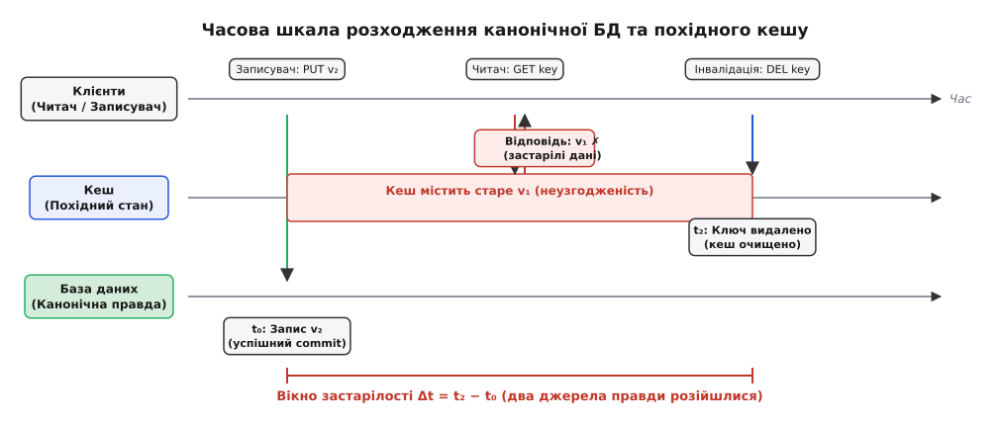
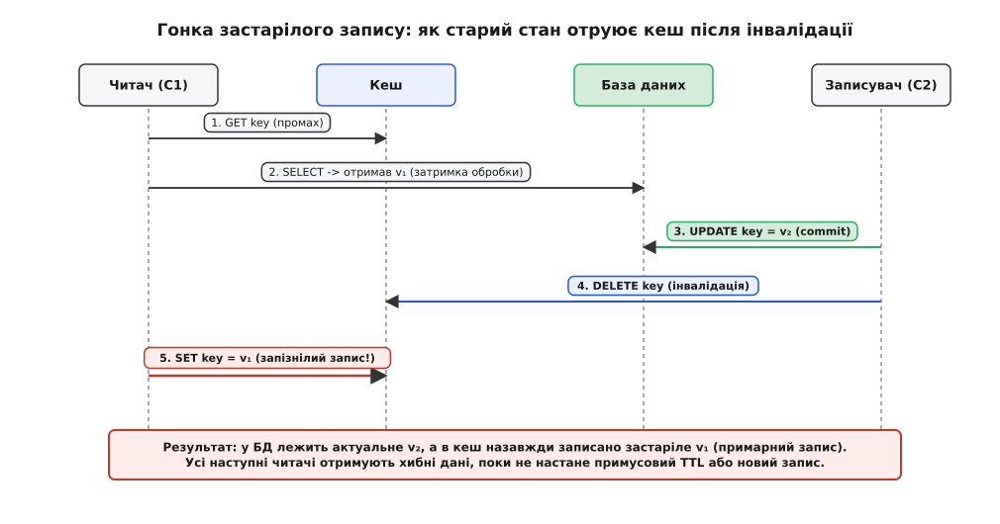
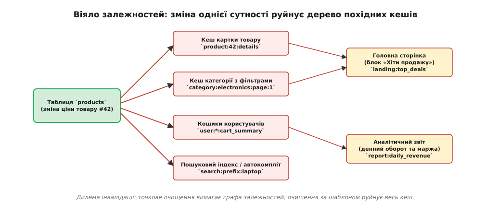
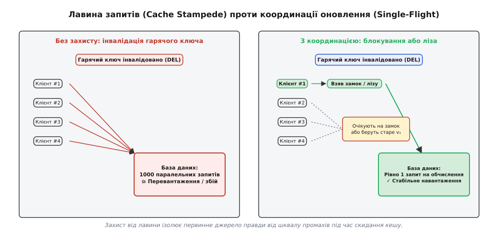

# Кеш вводить друге джерело правди (ціна)

<preknowlist>
- [Кеш](topic:programming/cache) — призначення швидкого сховища для гарячих даних ціною оперативної пам'яті.
- [Когерентність кешів](topic:programming/cache-coherence) — проблема узгодженості кількох копій одного стану.
- [Політики витіснення кешу](topic:programming/cache-eviction-policies) — вивільнення пам'яті за браку місця (LRU, LFU) на відміну від інвалідації застарілих даних.
- [Кінцева узгодженість на практиці](topic:programming/eventual-consistency) — модель, де копії сходяться з часом, але допускають тимчасове розходження.
- [Реплікаційний лаг і сесійні гарантії](topic:programming/replication-lag) — затримка поширення оновлень між первинним сховищем і копіями.
</preknowlist>

Інтернет-магазин запускає розпродаж останніх 5 одиниць товару. Користувач оформлює замовлення, і сервіс складського обліку виконує SQL-транзакцію `UPDATE inventory SET stock = 0 WHERE item_id = 42`. База даних фіксує зміну на диску за 2 мілісекунди й повертає статус успіху. Проте перед базою даних встановлено швидкий Redis-кеш, який усе ще містить попередній знімок: `stock = 5`. Протягом наступних кількох секунд сотні покупців одночасно додають товар у кошик і переходять до оплати, оскільки веб-сервери читають стан із кешу. Система приймає оплату за неіснуючий товар, створюючи конфлікт оверселінгу (overselling), ручне скасування платежів і фінансові збитки.

Ця аварія сталася не через баг у коді чи збій заліза, а через фундаментальний архітектурний факт: введення кешу ніколи не є суто локальним прискоренням читання. Щойно в системі з'являється кеш, вона перестає бути системою з єдиним джерелом правди й перетворюється на повноцінну розподілену систему з двома фізично незалежними репліками стану, зв'язок між якими є асинхронним і ненадійним.

## Первинний та похідний стан: народження дуалізму

Щоб зрозуміти ціну кешування, необхідно чітко розмежувати дві природи збережених даних:

1. **Канонічний стан (Canonical / Primary State):** Первинне джерело правди (Single Source of Truth, SSOT). Зазвичай це реляційна або документоорієнтована база даних, яка забезпечує строгі транзакційні гарантії (ACID), надійне збереження на енергонезалежному диску (WAL, Write-Ahead Logging) та лінеаризований порядок модифікацій.
2. **Похідний стан (Derived / Secondary State):** Тимчасова копія, створена виключно для оптимізації доступу. Це дані, завантажені в оперативну пам'ять (Memcached, Redis, локальний in-process cache), денормалізовані агрегати, готові HTML-фрагменти чи результати важких SQL-обчислень.

Поки система працює виключно з первинним джерелом, операція читання завжди повертає стан, зафіксований останньою завершеною транзакцією запису. Послідовність дій строга:

```
Клієнт ──(1. Запис v₂)──> [ База даних ] ──(2. OK)──> Клієнт
Клієнт ──(3. Читання)───> [ База даних ] ──(4. v₂)───> Клієнт (гарантовано свіже)
```

Щойно між клієнтом і базою даних з'являється кеш, виникає роздвоєння реальності. Будь-яка зміна даних у первинному сховищі миттєво створює стан розбіжності (divergence): база даних уже живе в майбутньому (версія `v₂`), тоді як кеш продовжує віддавати минуле (версія `v₁`).

Процес скасування чинності застарілої копії в кеші називають **інвалідацією** (*інвалідація* — від лат. *invalidus*, безсилий, недійсний; переведення збереженої копії в статус нечинної).

## Часова шкала розходження та вікно неузгодженості

Інвалідація не може відбутися миттєво. У фізичному світі передача інформації між двома комп'ютерними вузлами обмежена затримкою мережі, чергами повідомлень та планувальником операційної системи.


*Часова шкала розходження: від моменту коміту в БД (t₀) до обробки інвалідації в кеші (t₂) існує вікно Δt, коли будь-яке читання кешу повертає застарілий стан.*

Розглянемо фази розходження в часі:
- У момент `t₀` записувач успішно фіксує новий стан `v₂` у первинній базі даних. З цього моменту старе значення `v₁` є юридично нечинним.
- У проміжку `[t₀, t₂]` записувач (або фоновий сервіс) формує та надсилає команду інвалідації `DELETE key` до вузла кешу.
- У момент `t₁` сторонній клієнт надсилає запит на читання. Оскільки кеш ще не отримав команду інвалідації, він віддає старе значення `v₁`.
- Лише в момент `t₂` команда інвалідації досягає кешу й видаляє ключ.

Інтервал `Δt = t₂ − t₀` називають **вікном застарілості** (staleness window). Будь-який читач, що звернувся до кешу всередині цього вікна, гарантовано отримає брудні або неактуальні дані.

Математичне моделювання цього процесу показує, що ймовірність натрапити на застарілий стан лінійно зростає зі збільшенням частоти записів `λ_w` та тривалості мережевої затримки `Δt`. Повне ймовірнісне виведення, аналіз пуассонівського потоку запитів та оцінку ризиків наведено в матеріалі [модель вікна застарілості](topic:programming/cache-invalidation-intro/math-staleness-bound.md).

## Чому апаратний досвід підвів інженерів

Багато розробників-початківців ставлять запитання: чому в процесорах кешування працює абсолютно прозоро для програміста, а в розподілених веб-системах вимагає колосальних інженерних зусиль?

Це історичне непорозуміння виникло через те, що в багатоядерних процесорах (SMP) когерентність кешів забезпечується апаратними протоколами (наприклад, MESI) поверх спільної фізичної шини пам'яті. Апаратна шина забезпечує миттєве широкомовлення (broadcast) та глобальний арбітраж транзакцій: кожен процесор бачить кожен запис у тому самому порядку за частки наносекунди.

У розподілених мережах спільної шини пам'яті не існує. Мережеві пакети зазнають непередбачуваних затримок, губляться, дублюються й перевпорядковуються. Спроба реалізувати строгу синхронну когерентність між базою даних і кешем вимагала б двофазного коміту (2PC) або розподіленого консенсусу на кожен запис, що повністю знищило б головну перевагу кешу — швидкість.

Історію того, як Філ Карлтон сформулював свій знаменитий афоризм, і чому індустрія відмовилася від спроб сліпо копіювати апаратні протоколи, викладено в історичному нарисі [історія вислову Карлтона](topic:programming/cache-invalidation-intro/hist-karlton-and-coherence.md).

## Анатомія гонок: примарні записи та подвійний запис

Найнебезпечніші дефекти кешування виникають через конкуренцію (race conditions) між паралельними потоками читання та запису.

### 1. Збій подвійного запису (Dual-Write Failure)

У патерні Cache-Aside прикладний сервер бере на себе обов'язок оновити два незалежні сховища:

```
[Застосунок] ──(1. UPDATE)──> [ База даних ] (OK)
[Застосунок] ──(2. DELETE)──> [ Кеш ]        (💥 Мережевий збій / Падіння процесу)
```

Якщо крок 1 успішний, а на кроці 2 процес застосунку впав через нестачу пам'яті (OOM) або мережевий комутатор скинув TCP-з'єднання, інвалідація **не виконається ніколи**. База даних оновить стан, а кеш залишиться назавжди отруєним старим значенням (якщо не налаштовано примусовий TTL).

Спроба змінити порядок кроків (спочатку видалити кеш, потім записати в БД) лише погіршує ситуацію: між видаленням і записом з'являється вікно, у якому будь-який паралельний читач прочитає старе значення з БД і поверне його назад у щойно очищений кеш.

### 2. Гонка застарілого запису (Stale-Read Race)

Навіть якщо всі мережеві виклики завершуються без помилок, звичайне асинхронне чергування операцій призводить до утворення так званого **примарного запису** (ghost entry).


*Гонка застарілого запису: читач із промахом завантажує старе значення з БД, записувач оновлює БД й очищає кеш, після чого запізнілий читач записує застаріле значення назад у кеш.*

Розберемо покрокову динаміку цієї аварії:

1. **Читач (Клієнт 1)** звертається до кешу за ключем `product:42`. Відбувається промах (`CACHE_MISS`).
2. **Читач** надсилає запит до бази даних і отримує старе значення `v₁` (наприклад, ціна 100 грн).
3. У цей момент **Читач** зазнає затримки: його потік витісняється планувальником ОС, зупиняється на паузу збирача сміття (GC pause) або зависає на повільному парсингу JSON.
4. Поки Читач «спить», **Записувач (Клієнт 2)** оновлює ціну товару в базі даних до `v₂` (ціна 150 грн) і успішно фіксує транзакцію.
5. **Записувач** надсилає команду `DELETE product:42` у кеш. Кеш успішно видаляє ключ.
6. **Читач** прокидається. Він не знає, що база змінилася, а його копія застаріла. Читач бере отримане раніше старе значення `v₁` і виконує команду `SET product:42 v₁`.

Результат: у первинній базі даних ціна товару становить 150 грн, а в кеші назавжди зафіксовано 100 грн. Усі наступні користувачі купуватимуть товар за заниженою ціною.

Для повного усунення цієї гонки застосовують спеціальний механізм **версійних ліз та токенів покоління** (Leases / Generation Tokens), алгоритм якого та реалізацію на C і C++ наведено в проекті [захист від гонки за допомогою версійних ліз](topic:programming/cache-invalidation-intro/proj-stale-race-and-leases.md).

## Стратегії інвалідації та їхня архітектурна ціна

В інженерній практиці сформувалося кілька основних підходів до підтримки свіжості кешу. Кожен із них вимагає специфічного компромісу між складністю, навантаженням на сховище та гарантіями узгодженості.

### 1. Пасивне протухання за часом (Time-To-Live, TTL)

Найпростіший підхід: кожному запису в кеші призначається фіксований строк життя `TTL` (наприклад, 60 секунд). Після закінчення цього часу кеш автоматично видаляє ключ, і наступний запит завантажує свіжий стан із бази даних.

- **Перевага:** Гранична простота. Повна відсутність коду інвалідації на стороні записувача; стійкість до збоїв мережі (будь-яка помилка розсмокчеться сама після закінчення таймера).
- **Ціна та обмеження:** TTL не є справжньою інвалідацією — це лише гарантія верхньої межі застарілості. Протягом усього періоду `TTL` клієнти бачать застарілі дані. Крім того, виникають так звані «паразитні промахи» (spurious misses): якщо дані не змінювалися роками, кеш усе одно видаляє їх кожні 60 секунд, змушуючи базу даних повторно виконувати важкі обчислення.

### 2. Синхронне очищення при записі (Cache-Aside Delete)

Застосунок оновлює базу даних і негайно надсилає команду `DELETE key` у кеш.

- **Чому `DELETE`, а не `UPDATE`:** Якщо під час запису намагатися перезаписати значення в кеші (`SET key new_val`), два одночасні записувачі (А і Б) можуть оновити базу в порядку `А -> Б`, а кеш — у порядку `Б -> А` через мережеву асиметрію. У результаті в базі залишиться стан Б, а в кеші — стан А. Команда `DELETE` ідемпотентна: обидва записувачі просто очищають кеш, залишаючи завантаження свіжого стану наступному читачу.
- **Ціна:** Ризик збою подвійного запису та вразливість до гонки застарілого запису (Stale-Read Race).

### 3. Наскрізний запис (Write-Through) та відкладений запис (Write-Behind)

Застосунок звертається виключно до кеш-сервісу, делегуючи йому запис у первинне сховище:

- **Write-Through:** Кеш синхронно оновлює власний стан і записує дані в базу даних в одній операції.
- **Write-Behind (Write-Back):** Кеш негайно оновлює значення в оперативній пам'яті й повертає клієнту успіх, а запис у базу відкладає у фонову чергу (асинхронний батчинг).

- **Ціна:** Write-Through додає латентність запису в базу до кожного звернення до кешу. Write-Behind створює критичний ризик втрати даних: якщо вузол кешу втратить живлення до того, як скине чергу на диск, зафіксовані клієнтом зміни зникнуть назавжди. Крім того, Write-Behind робить неможливим використання зовнішніх транзакцій БД.

### 4. Інвалідація на основі транзакційного журналу (CDC та Transactional Outbox)

Найбільш надійний промисловий підхід, що повністю усуває проблему подвійного запису.

Замість того, щоб покладатися на прикладний код, інвалідація прив'язується безпосередньо до журналу транзакцій бази даних (Write-Ahead Log у PostgreSQL, binlog у MySQL). Спеціальний сервіс захоплення змін (Change Data Capture, CDC, наприклад Debezium) або патерн [Transactional Outbox](topic:programming/outbox-pattern) вичитує журнал комітів і публікує події інвалідації в чергу повідомлень (Kafka, RabbitMQ), звідки воркери очищають кеш.

```
[Застосунок] ──(1. Транзакція: UPDATE + Outbox)──> [ База даних (WAL) ]
                                                            │
                                                     (2. CDC / Debezium)
                                                            ▼
[ Кеш ] <──(4. DELETE key)── [ Worker ] <──(3. Подія)── [ Kafka ]
```

- **Перевага:** Якщо транзакція в БД зафіксована, інвалідація гарантовано відбудеться (гарантія At-Least-Once). Падіння застосунку більше не призводить до розсинхронізації.
- **Ціна:** Асинхронний лаг черги повідомлень (від кількох мілісекунд до секунд під навантаженням), необхідність розгортання та підтримки важкої інфраструктури CDC та Kafka.

## Каскадна складність: граф залежностей та віяло інвалідацій

У реальних системах кешують не просто окремі рядки таблиць за первинним ключем (`user:42`), а складні агрегати, денормалізовані структури, списки та пошукові зрізи.

Це породжує проблему **віяла інвалідацій** (Invalidation Fan-out): модифікація одного поля в одній таблиці вимагає каскадного видалення десятків пов'язаних ключів у різних форматах.


*Граф залежностей: зміна одного поля в первинній таблиці товарів викликає каскадну інвалідацію картки товару, сторінок категорій, кошиків користувачів та агрегованих вітрин.*

Розглянемо випадок, коли адміністратор змінює ціну товару `#42`:
1. Необхідно інвалідувати кеш картки товару: `product:42:details`.
2. Необхідно інвалідувати всі кешовані сторінки категорій, де присутній цей товар: `category:electronics:page:1`, `category:electronics:page:2`...
3. Необхідно інвалідувати кеш пошукових автокомплітів та фільтрів за ціною.
4. Необхідно інвалідувати кошики всіх активних користувачів, які додали цей товар: `user:*:cart_summary`.
5. Необхідно перерахувати агреговані кеші вітрини: `landing:top_deals` та аналітичні звіти.

### Дилема деталізації інвалідації (Granularity Dilemma)

Перед розробником постає важкий вибір:

1. **Груба інвалідація (Coarse-Grained):** Очищати кеш цілими просторами або шаблонами (наприклад, `DEL category:*`). Це гарантує свіжість, але повністю руйнує коефіцієнт влучань (Cache Hit Ratio). Кеш постійно перебуває в холодному стані, а база даних зазнає постійних перевантажень.
2. **Точна інвалідація (Fine-Grained):** Відстежувати прямі залежності між сутностями за допомогою сурогатних ключів (Cache Tags / Surrogate Keys). Кожен кешований об'єкт маркується набором тегів (наприклад, сторінка категорії отримує теги `tag:cat:electronics`, `tag:prod:42`, `tag:prod:99`). Під час оновлення товару `#42` надсилається команда очищення за тегом `INVALIDATE tag:prod:42`.

Ціна точної інвалідації — висока складність підтримки індексу тегів у пам'яті, витрати процесорного часу на перетин множин і ризик «мертвих зон»: якщо розробник забуде прив'язати тег хоча б до одного складеного агрегату, цей агрегат роками віддаватиме застарілі дані. Для збереження записів, стан яких плавно оновлюється без жорсткого скидання, застосовують модель [м'який стан](topic:programming/soft-state).

## Багаторівневе кешування: множення вікон застарілості

У сучасних веб-системах кеш рідко буває одним ізольованим шаром. Зазвичай архітектура формує **ієрархію з трьох рівнів** (Multi-Tier Caching):

1. **Рівень 1 (L1 — In-Process Cache):** Локальна пам'ять процесу застосунку (наприклад, Go `sync.Map`, Java Caffeine, Node.js LRU-мапа всередині кожного пода). Доступ миттєвий (наносекунди), оскільки немає мережевого виклику.
2. **Рівень 2 (L2 — Distributed Cache):** Спільний кластер Redis або Memcached для всіх екземплярів сервісу. Доступ швидкий (1–3 мілісекунди через локальну мережу ДЦ).
3. **Рівень 3 (L3 — Edge / CDN Cache):** Географічно розподілені прикордонні сервери (Cloudflare, Fastly, AWS CloudFront), що кешують HTTP-відповіді поблизу користувачів.

```
[ Клієнт ] ──> [ L3: CDN (Edge) ] ──> [ L1: Пам'ять пода ] ──> [ L2: Redis ] ──> [ База даних ]
```

### Проблема «глухих» локальних кешів

Найбільш підступна пастка багаторівневої системи полягає в тому, що **локальний кеш L1 нічого не знає про оновлення, виконані іншими подами**.

Припустимо, у системі працює 50 екземплярів бекенд-сервісу. Користувач надсилає запит на зміну свого профілю, який потрапляє на Под #1:
1. Под #1 оновлює базу даних.
2. Под #1 видаляє ключ із спільного L2 (Redis).
3. Под #1 очищає свій власний локальний L1 кеш.

Але решта 49 подів продовжують тримати старий профіль у своїй локальній оперативній пам'яті L1! Коли цей самий користувач через секунду надсилає наступний запит, балансувальник навантаження спрямовує його на Под #2. Под #2 заглядає у свою пам'ять L1, знаходить там старий стан і віддає його користувачеві. Користувач бачить, що його щойно збережені зміни «зникли».

Щоб вирішити цю проблему, доводиться будувати додаткову розподілену шину сповіщень:
- **Pub/Sub інвалідація:** Під час будь-якої зміни Под #1 публікує повідомлення в Redis Pub/Sub або Kafka-топік `cache:invalidation:user:42`.
- Усі 50 подів підписуються на цей канал і під час отримання повідомлення очищають свій локальний кеш L1.

Ціна такого рішення — суттєве ускладнення архітектури: з'являються накладні витрати на фонові потоки прослуховування, ризик переповнення черг під час шторму оновлень та необхідність обробки розривів з'єднання із шиною Pub/Sub (під час розриву зв'язку поди мусять превентивно скидати весь L1 кеш).

## Пастки транзакційного контексту в ORM-фреймворках

У прикладній розробці найпоширенішим джерелом розсинхронізації кешу є неправильне розміщення виклику інвалідації відносно межі транзакції бази даних (Transaction Boundary).

Розглянемо дві класичні помилки, які щодня роблять розробники при роботі з Spring, Django, Rails або TypeORM:

### Помилка 1: Інвалідація ДО завершення транзакції (Inside Transaction)

Розробник пише код усередині транзакційного блоку:

```
START TRANSACTION;
UPDATE users SET name = 'Bob' WHERE id = 42;
redis.delete("user:42"); -- 💥 ПОМИЛКА: інвалідація всередині транзакції!
-- тривалі обчислення або очікування інших блокувань...
COMMIT;
```

Що відбувається:
1. Застосунок надсилає `DELETE user:42` у кеш, поки транзакція в БД ще відкрита і не зафіксована.
2. Паралельний читач приходить через мілісекунду, бачить промах кешу й робить `SELECT` до бази даних.
3. Оскільки транзакція ще не зафіксована (`READ COMMITTED`), база даних повертає читачеві **старе значення** `Alice`.
4. Читач записує старе значення `Alice` назад у кеш.
5. Записувач нарешті виконує `COMMIT`.

Результат: транзакція зафіксована, але в кеші назавжди осів старий стан `Alice`.

### Помилка 2: Інвалідація в колбеках збереження замість коміту (`after_save` vs `after_commit`)

Багато ORM надають хуки життєвого циклу моделі (`after_save`, `post_save`). Проте ці хуки зазвичай викликаються одразу після виконання SQL-команди `UPDATE`, але **до** того, як база даних виконає фізичний `COMMIT`.

Якщо після виклику хука транзакція відкочується (Rollback через помилку валідації зовнішнього ключа або тайм-аут), виникає абсурдна ситуація: база даних повернулася до початкового стану, а кеш уже інвалідовано (або навпаки, заповнено неіснуючими даними, якщо застосовувався `SET`).

> **Залізне правило інвалідації:** Виклик команди очищення кешу повинен відбуватися **виключно після успішного фізичного підтвердження транзакції** (хук `after_commit` або явний виклик після закриття блоку транзакції).

## Інвалідація в подійно-орієнтованих мікросервісах (EDA)

У мікросервісній архітектурі сервіс, який володіє даними (наприклад, `OrderService`), часто не має прямого мережевого доступу до кешу іншого сервісу (наприклад, `ReportingService` або `SearchService`).

Оновлення кешів відбувається асинхронно через обмін подіями (Event-Driven Architecture):
1. `OrderService` змінює статус замовлення й публікує подію `OrderCompleted` у брокер Kafka.
2. `ReportingService` вичитує подію з Kafka й скидає свій кеш агрегованих звітів.

Тут виникає фундаментальна проблема **перевпорядкування подій** (Event Ordering):

- Припустимо, користувач спочатку створив замовлення (`OrderCreated`), а через секунду скасував його (`OrderCancelled`).
- Якщо партиції Kafka або черги споживача обробляються кількома паралельними потоками, потік Б може обробити подію `OrderCancelled` раніше, ніж потік А обробить `OrderCreated`.
- Сервіс спочатку інвалідує кеш для скасованого замовлення, а потім потік А завантажує в кеш стан «створено»!

Щоб уникнути подібних аномалій, події інвалідації обов'язково повинні містити монотонно зростаючий **номер версії сутності** (Monotonic Entity Version) або логічний годинник Лампорта. Споживач кешу оновлює стан лише тоді, коли версія в події строго більша за версію, збережену в кеші:

```
if event.version <= cache.get_version(key):
    ignore_stale_event(event)
```

## Аудит та активне виявлення розсинхронізації

Найгірша властивість проблем інвалідації полягає в тому, що вони є **тихими аваріями**. Система не кидає винятків (exceptions), моніторинг помилок HTTP 500 мовчить, але користувачі бачать спотворені дані.

Для виявлення розходжень між первинною базою даних та кешем у зрілих інфраструктурах розгортають системи **активного аудиту та звірки** (Cache Reconciliation):

1. **Тіньове порівняння (Shadow Checking / Reconciliation Worker):**
   Фоновий процес випадковим чином вибирає 0.1% активних ключів з Redis, зчитує відповідні рядки з первинної бази даних, обчислює контрольні суми (MD5 / SHA-256) обох станів і порівнює їх. Якщо виявлено розбіжність, воркер фіксує метрику `cache_inconsistency_detected` та примусово очищає збійний ключ.
2. **Перевірка на стороні клієнта (Client-Assisted Verification):**
   Разом із даними кеш повертає клієнту версію запису або ETag. Якщо користувач виконує дію мутації (наприклад, надсилає коментар), клієнт передає заголовок `If-Match: version_4`. Якщо сервер виявляє, що клієнт спирався на застарілий стан, запит відхиляється з кодом `HTTP 412 Precondition Failed`, запобігаючи руйнуванню даних.

## Системні та експлуатаційні ризики інвалідації

Крім порушення узгодженості, процес інвалідації несе кілька важких інфраструктурних загроз.

### 1. Лавина запитів під час інвалідації (Cache Stampede / Thundering Herd)

Коли з кешу видаляється надзвичайно популярний («гарячий») ключ, до якого надходять тисячі запитів на секунду (наприклад, конфігурація системи, курс валют або головна сторінка новинного сайту), виникає ефект лавини.


*Лавина запитів проти координації: одночасна інвалідація популярного ключа спрямовує шквал промахів на базу даних, якщо система не використовує блокування або достроковий підігрів.*

У момент `t₂`, коли ключ інвалідовано:
- Усі 5000 одночасних клієнтів отримують промах кешу.
- Усі 5000 клієнтів одночасно надсилають важкий SQL-запит до первинної бази даних.
- Пул з'єднань бази даних миттєво переповнюється, дискова підсистема захлинається, запити стають у чергу за тайм-аутом, і вся система падає (Cascading Failure).

Для захисту від лавини застосовують три механізми:
- **М'ютекс / Single-Flight:** Лише перший клієнт, що отримав промах, отримує блокування (або версійну лізу) і йде в базу даних. Решта 4999 клієнтів чекають на звільнення замка або віддають попереднє значення.
- **Імовірнісне дострокове оновлення (XFetch):** Клієнти починають фонове оновлення значення в базі даних за імовірнісним законом за кілька секунд **до** фактичного закінчення строку життя або запланованої інвалідації.
- **Stale-While-Revalidate:** Сервер кешу негайно віддає клієнту старе значення з позначкою застарілості, одночасно запускаючи один асинхронний фоновий потік для перерахунку свіжого стану в базі даних.

### 2. Шторм інвалідацій (Invalidation Storm)

Якщо в системі відбувається масове оновлення (наприклад, нічний перерахунок цін на 1 000 000 товарів або деплой нової схеми даних), одночасна відправка мільйона команд `DELETE` у брокер повідомлень або кластер Redis може переповнити черги та спричинити мережеве голодування. Для захисту застосовують пакетне групування (batching), затримку видалення (delayed invalidation) та лімітування темпу (rate limiting).

### 3. Накладні витрати на облік метаданих

Підтримка надійної інвалідації вимагає значних ресурсів:
- Збереження версій, токенів ліз та списків тегів збільшує обсяг оперативної пам'яті кешу на 20–40%.
- Серіалізація та десеріалізація складних агрегатів створюють постійне навантаження на процесори серверів застосунків.

> 🔧 **Навіщо це в реальній розробці.**
> Розуміння ціни другого джерела правди рятує від головної помилки початківців: лікувати повільні неоптимізовані SQL-запити встановленням Redis-кешу. Кеш не виправляє погану схему даних — він лише консервує її ціною внесення розподіленої неузгодженості, гонок запису та ризику лавинного колапсу бази даних.
> 
> Професійний підхід полягає в тому, щоб спочатку оптимізувати первинне джерело (індекси, покривні запити, денормалізація, пули з'єднань), і вводити кешування лише тоді, коли вичерпано фізичні можливості масштабування бази даних, а бізнес-домен явно дозволяє узгодженість у кінцевому підсумку (Eventual Consistency).

## Критерії вибору: коли кешування варте своєї ціни

Щоб визначити, чи виправдовує прискорення читання витрати на інвалідацію та ризики неузгодженості, використовують інженерний чекліст:

1. **Співвідношення читань до записів (Read-to-Write Ratio):**
   Кешування ефективне лише тоді, коли дані читають значно частіше, ніж змінюють (`R/W ≥ 10:1`, в ідеалі `100:1` або `1000:1`). Якщо дані змінюються з частотою читання (`R/W ≈ 1:1`), кеш постійно інвалідується, коефіцієнт влучань прямує до нуля, а система платить подвійну ціну за кожен запис (у БД та в кеш).
2. **Бюджет допустимої застарілості (Staleness Budget):**
   Якщо бізнес-логіка вимагає абсолютної лінеаризованості (фінансовий баланс, залишок коштів на банківському рахунку, аутентифікація одноразових паролів), читання **повинно йти безпосередньо з транзакційної бази даних** або використовувати строгі версійні лізи. Якщо бізнес допускає затримку в кілька секунд (стрічка соцмережі, лічильник переглядів статті, рейтинг товарів), кешування є виправданим і безпечним.
3. **Незмінність даних (Immutability):**
   Найкращий кеш — це кеш для даних, які ніколи не змінюються. Фотографії, статичні ассети, історичні звіти за минулі місяці, закриті замовлення, хешовані за вмістом файли (Content-Addressed Storage) мають нескінченний час життя і потребують **нуль рядків коду інвалідації**. Заміна змінюваних структур на незмінні (append-only моделі) — найефективніший спосіб знизити ціну другого джерела правди.

## Підсумок

Кеш — це не магічна оптимізація, а архітектурний компроміс. Створюючи копію даних в оперативній пам'яті, інженер отримує субмілісекундну швидкість відповіді та розвантаження первинного сховища, але сплачує за це виникненням другого джерела правди, розширенням вікна неузгодженості, ризиком гонок запису та необхідністю координації інвалідації.
