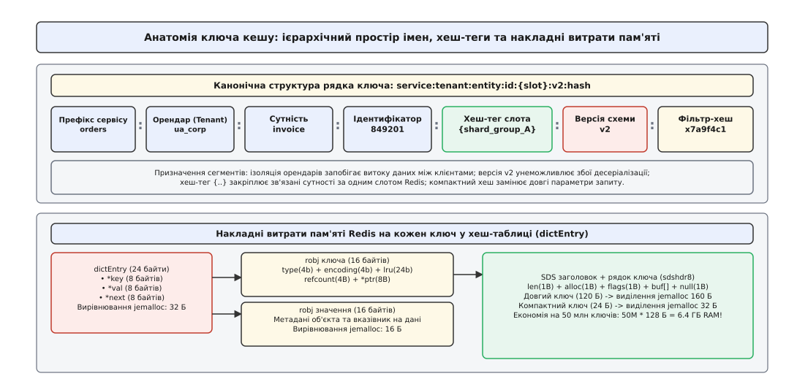
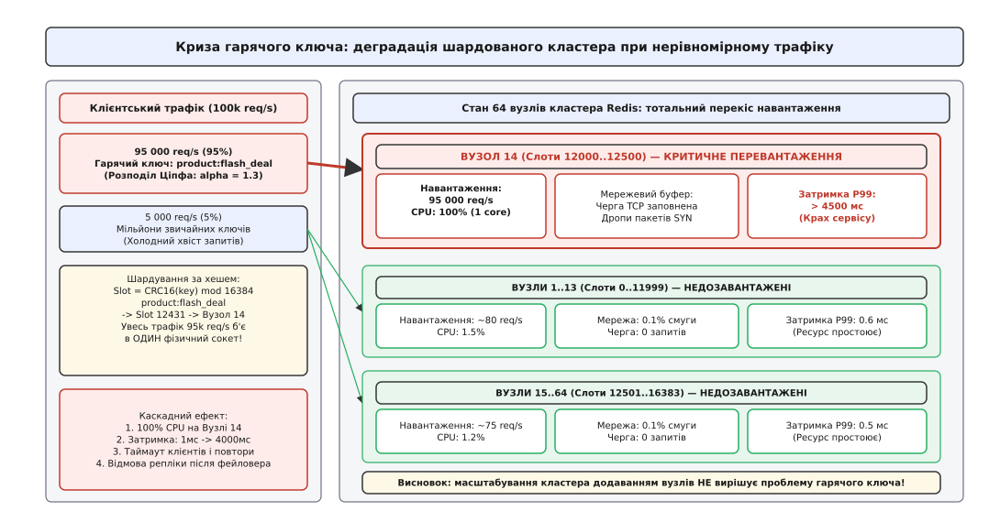
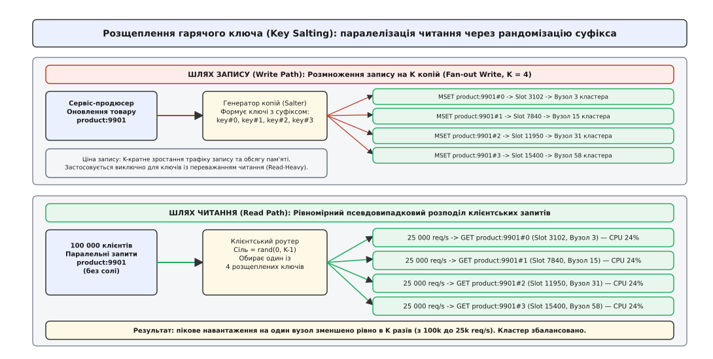
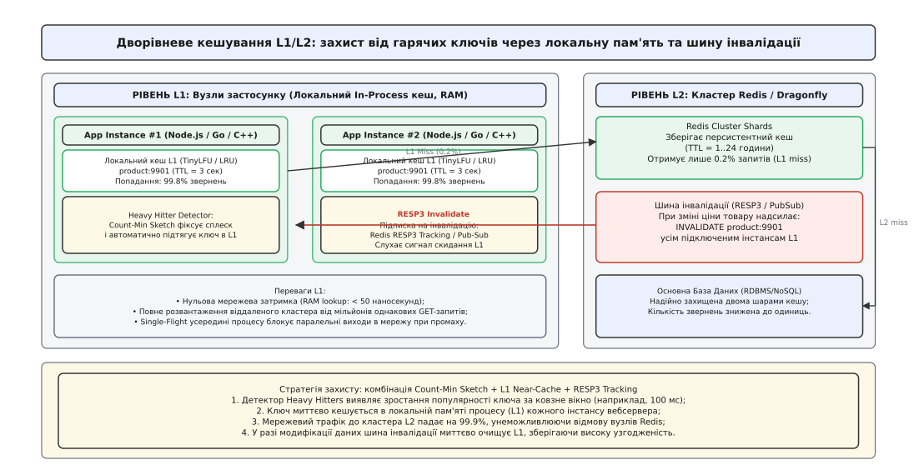

# Дизайн ключів кешування та подолання гарячих ключів у розподілених кластерах

<preknowlist>
- [Стратегії кешування](topic:programming/caching-strategies) — шаблони Cache-Aside, Read-Through та ціна мережевих викликів.
- [Шардування та партиціонування](topic:programming/partitioning-sharding) — розподіл даних за хешем, консистентне хешування та хеш-слоти.
- [Інвалідація кешу](topic:programming/cache-invalidation-intro) — механізми витіснення за TTL та явне скидання ключів.
- [Об'єднання однакових запитів](topic:programming/request-coalescing) — дедуплікація викликів (Single-Flight) для захисту від шторму промахів.
- [Ізоляція відсіками](topic:programming/bulkhead-isolation) — захист пулів з'єднань від вичерпання під час збоїв сусідніх сервісів.
</preknowlist>

Опівночі під час старту святкового розпродажу інтернет-магазин публікує акційний смарт-годинник зі знижкою 90%. За перші двісті мілісекунд шлюзи API отримують сто тисяч паралельних запитів на отримання картки товару за ключем `product:flash_deal_9901`. Розподілений кластер Redis складається з 64 потужних серверів, проте алгоритм шардування обчислює хеш-слот за формулою `CRC16("product:flash_deal_9901") mod 16384` і отримує число `12431`, яке закріплене виключно за 14-м вузлом кластера.

Усі 100 000 клієнтських з'єднань одночасно надсилають запити на IP-адресу єдиного сервера. Поки 63 сусідні вузли кластера простоюють із завантаженням процесора у 2%, єдине робоче ядро процесора 14-го вузла завантажується на 100%. Вхідний мережевий буфер TCP переповнюється, затримка обробки запитів зростає з 0.5 мілісекунди до 4.5 секунди, тайм-аути клієнтів провокують лавину повторних спроб, і 14-й вузол випадає з кластера через відсутність відповідей на діагностичні пінг-пакети. 

Кластер автоматично ініціює перемикання на репліку (англ. *failover*), проте щойно репліка стає новим мастером, той самий потік у 100 000 запитів за секунду обрушується вже на неї, виводячи з ладу другий сервер поспіль.

Традиційне горизонтальне масштабування кластера додаванням нових серверів виявляється абсолютно безсилим: скільки б десятків чи сотень вузлів не було додано в топологію, запити до одного конкретного ключа фізично не можуть бути оброблені іншими машинами, оскільки за правилами шардування один ключ завжди живе рівно на одному вузлі. 

Це явище має назву **гарячий ключ** (англ. *hot key*, де лат. *calidus* — «гарячий, розпечений») — стан, за якого концентрація звернень до одиничного елемента даних перевищує пропускну здатність одного процесорного ядра або мережевого інтерфейсу сервера кешу.


*Анатомія ієрархічного ключа кешування: структура просторів імен, ізоляція орендарів, керування хеш-слотами та розкладка накладних витрат пам'яті в структурах dictEntry.*

Шлях, який пройшла інженерна індустрія від наївного шардування перших версій Memcached до сучасних багатошарових архітектур із трекінгом у протоколі RESP3, детально викладено в нарисі про [історію еволюції кластерного кешування та боротьби з гарячими точками](topic:programming/cache-key-design/hist-redis-cluster-hotkeys.md).

## Анатомія та архітектура просторів імен ключів

Ключ кешу в розподіленій системі — це не довільний рядок, а точний адресний дескриптор, що визначає контекст безпеки, тип сутності, версію схеми даних та алгоритм маршрутизації в кластері.

### Канонічна ієрархія просторів імен

Для запобігання колізіям між різними мікросервісами та забезпечення суворої мультитенантності (ізоляції даних різних клієнтів) застосовують стандартизовану схему сегментації через розділювач двокрапки (`:`):

```
<сервіс>:<орендар>:<сутність>:<ідентифікатор>[:{хеш-тег}]:<версія>[:<дайджест>]
```

1. **Префікс сервісу (`service`):** локалізує володіння даними (`billing`, `catalog`, `orders`). Запобігає випадковому перезапису ключів сусідніми мікросервісами в спільному інстансі Redis.
2. **Ідентифікатор орендаря (`tenant`):** обов'язковий сегмент у SaaS-архітектурах (`tenant_ua`, `corp_42`). Гарантує, що клієнт А ні за яких обставин не отримає доступ до закешованого звіту клієнта Б при збігу числових ID.
3. **Тип сутності (`entity`) та ідентифікатор (`id`):** вказують на конкретний бізнес-об'єкт (`invoice:849201`, `user:1029`).
4. **Версія схеми даних (`v<N>`):** номер релізу моделі даних (`v1`, `v2`).
5. **Хеш параметрів запиту (`digest`):** компактний числовий відбиток складних фільтрів вибірки.

Детальні інтерфейсні контракти, правила екранування спеціальних символів та граматику валідації зібрано у [специфікації інтерфейсу та контракті побудовника ключів кешування](topic:programming/cache-key-design/api-key-builder-contract.md).

### Ціна довжини ключа та накладні витрати оперативної пам'яті

Поширена помилка архітекторів-початківців — створення надмірно довгих, самодокументованих рядків ключів на кшталт `production:microservice:ecommerce:catalog:categories:electronics:smartphones:filters:brand_apple_color_black_storage_256gb_sort_price_asc`.

Оперативна пам'ять у сховищах типу Redis або Memcached є найдорожчим ресурсом. Розглянемо внутрішню організацію пам'яті Redis для кожного ключа:

1. **Запис хеш-таблиці (`dictEntry`):** займає 24 байти (три 64-бітні вказівники: `*key`, `*val`, `*next`). У зв'язку з квантуванням виділення пам'яті алокатором `jemalloc` це виділення округлюється до 32 байтів.
2. **Об'єкт ключа (`robj`):** метадані типу, кодування та лічильника посилань — 16 байтів.
3. **Рядок ключа (SDS — Simple Dynamic String):** містить заголовок `sdshdr8` (3 байти: довжина, виділений розмір, прапорці), сам нуль-термінований рядок та додатковий байт завершення.

Якщо ключ має довжину 120 байтів, `jemalloc` округлює виділення під рядок SDS до найближчого розмірного класу — 160 байтів. Сумарні накладні витрати пам'яті на збереження одного такого ключа (без урахування корисного значення!) становлять:

```
Пам'ять на ключ = 32 (dictEntry) + 16 (robj) + 160 (SDS) = 208 байтів
```

Якщо в кеші зберігається 50 мільйонів записів, лише метадані та рядки довгих ключів забирають:

```
50 000 000 · 208 байтів ≈ 10.4 ГБ оперативної пам'яті
```

Якщо ж оптимізувати ключ до компактного канонічного вигляду довжиною 24 байти (`cat:t1:prod:9901:v2`), SDS-рядок разом із заголовком вкладається в розмірний клас 32 байти. Сумарні витрати складають:

```
32 (dictEntry) + 16 (robj) + 32 (SDS) = 80 байтів
50 000 000 · 80 байтів ≈ 4.0 ГБ оперативної пам'яті
```

Проста оптимізація структури ключів звільняє 6.4 ГБ дорогоцінної RAM без будь-якої втрати функціональності.

### Детермінізм серіалізації та згортання параметрів

Коли кешується результат складного пошукового запиту з множинними фільтрами (сортування, діапазони цін, масиви тегів), рядок параметрів необхідно перетворити на частину ключа.

Якщо серіалізувати параметри безпосередньо через JSON або конкатенацію рядків URL, виникає фундаментальна пастка неідентичності:

```
Запит 1: { "category": "shoes", "size": 42, "color": "red" }
Запит 2: { "color": "red", "size": 42, "category": "shoes" }
```

Обидва запити повертають абсолютно однаковий набір даних із бази, проте через різний порядок полів у стандартному JSON рядки будуть відрізнятися:
- Рядок 1: `{"category":"shoes","size":42,"color":"red"}`
- Рядок 2: `{"color":"red","size":42,"category":"shoes"}`

Кеш зафіксує два різні ключі, виконає два важкі SQL-запити до бази даних та збереже дублікат результату в оперативній пам'яті, знижуючи коефіцієнт попадання (англ. *cache hit ratio*).

Правило канонізації вимагає:
1. **Лексикографічного сортування ключів:** усі параметри фільтрації перед серіалізацією нормалізуються за алфавітом.
2. **Нормалізації типів:** числа приводяться до єдиного формату (без зайвих нулів у дробовій частині `42.00` → `42`), рядки приводяться до нижнього регістру (якщо пошук нечутливий до регістру).
3. **Згортання в некриптографічний хеш:** відсортований нормалізований рядок фільтрів хешується за допомогою надшвидких алгоритмів MurmurHash3, xxHash64 або CityHash у компактне 64-бітне шістнадцяткове число (16 символів):

```
search:shoes:{ua}:v2:9a4f1c80e72b3d11
```

> 🔧 **Навіщо це.** Застосування 64-бітного некриптографічного хешу (xxHash64) замість довгого відкритого рядка параметрів скорочує довжину ключа в 4–8 разів, стабілізує розмірний клас `jemalloc`, ліквідує фрагментацію пам'яті та прискорює пошук у внутрішній хеш-таблиці сховища.

### Версіонування схеми: захист від отруєння кешу

Під час безперервного розгортання мікросервісів (англ. *rolling deployment*) у кластері одночасно працюють екземпляри старої версії застосунку (v1) та нової версії (v2).

Якщо розробники додали в DTO сутності обов'язкове поле `discount_cents` або змінили тип поля `id` з `int32` на `string`, а ключ кешу залишається неверсіонованим (`product:9901`), відбувається **отруєння кешу** (англ. *cache poisoning*):

1. Інстанс v2 оновлює товар і записує в кеш новий JSON-документ або бінарний Protobuf/MessagePack із новою схемою.
2. Інстанс v1 зчитує цей запис із кешу і зазнає аварійного завершення (англ. *crash*) через виняток десеріалізації (англ. *deserialization failure*).
3. Якщо ж інстанс v1 перезапише ключ старим форматом, уже інстанси v2 отримуватимуть помилки або порожні поля (`null`), що призведе до некоректного відображення цін клієнтам.

Включення версії схеми в тіло ключа (`product:9901:v2`) повністю ізолює старі та нові сервіси: версія v2 читає і пише тільки в простори `v2`, а при виведенні з експлуатації старої версії застосунку ключі `v1` автоматично видаляються з кешу за природним TTL.

### Хеш-теги в Redis Cluster: сила та загроза

У кластері Redis ключі розподіляються за 16384 хеш-слотами. Для виконання мультиключових операцій (`MGET`, `MSET`, виконання Lua-скриптів та транзакцій `MULTI/EXEC`) вимагається, щоб **усі задіяні ключі належали до одного хеш-слота**. Якщо ключі належать різним слотам на різних вузлах, Redis Cluster повертає помилку `CROSSSLOT Keys in request don't hash to the same slot`.

Для розв'язання цієї проблеми використовують **хеш-теги** (англ. *hash tags*): якщо в ключі є фігурні дужки `{...}`, для обчислення хеш-слота використовується виключно вміст між першою відкритою `{` та першою закритою `}` дужкою:

```
user:{1001}:profile   -> хешується "1001" -> Слот 5124
user:{1001}:orders    -> хешується "1001" -> Слот 5124
user:{1001}:settings  -> хешується "1001" -> Слот 5124
```

Усі три ключі гарантовано потраплять на один фізичний вузол, що дозволяє виконувати над ними атомарні операції.

**Пастка штучного гарячого слота (Hot Slot Trap):** Якщо недосвідчений інженер встановить статичний тег для широкої групи сутностей (наприклад, `{all_products}:prod_1`, `{all_products}:prod_2`, ..., `{all_products}:prod_1000000`), мільйон товарів злипнеться в один слот. Увесь масив даних каталогу та весь трафік до нього сконцентрується на одному вузлі кластера, породжуючи штучну кризу гарячого шарду.

---

## Природа виникнення кризи гарячих ключів

Розподіл інтересу користувачів до контенту в мережі підпорядковується емпіричному закону Ціпфа (англ. *Zipf's law*): частота звернення до об'єкта обернено пропорційна його рангу в списку популярності.


*Дисбаланс кластера під час виникнення гарячого ключа: 95% усього трафіку концентрується на Вузлі 14, спричиняючи 100% завантаження CPU та відмову обслуговування, поки 63 інші вузли простоюють.*

Строгий математичний аналіз схилу розподілу Ціпфа, доведення теореми редукції дисперсії та розрахунок ймовірностей колізій хешів наведено в [математичній моделі розподілу Ціпфа та ймовірнісних оцінках колізій хешів](topic:programming/cache-key-design/math-zipf-hotkey.md).

Типові сценарії генерації гарячих ключів:
1. **Товари-бестселери та флеш-сейли:** товар із гігантською знижкою або відкриття продажу квитків на стадіонний концерт.
2. **Акаунти інфлюенсерів:** новина або публікація в профілі зірки з десятками мільйонів підписників.
3. **Глобальні системні конфігурації:** ключ із курсами валют, прапорами функцій (англ. *feature flags*) або глобальними метаданими каталогу, який вичитується на кожен вхідний HTTP-запит системи.
4. **Гарячі лічильники запису (Hot Write Keys):** лічильник переглядів вірусного відео або глобальний лімітер запитів (англ. *rate limiter*) для публічного API.

Коли потік запитів до одного ключа перевищує 50 000 – 100 000 операцій на секунду, вузол вичерпує пропускну здатність ядра або мережевого стека, створюючи затримки для всіх інших звичайних ключів, які випадково опинилися на цьому ж сервері (проблема «галасливого сусіда», англ. *noisy neighbor*).

---

## Тактика 1: Розщеплення ключа (Key Salting / Sharding)

Найпростішим та високоефективним методом розподілу навантаження на рівні розподіленого кластера є **розщеплення ключа** або додавання випадкової солі (англ. *Key Salting* або *Key Sharding*).

### Принцип роботи

Замість збереження єдиного ключа `product:9901` система розмножує його на `K` незалежних копій (підключів) із числовим суфіксом:

```
product:9901#0,  product:9901#1,  product:9901#2,  ...,  product:9901#(K-1)
```

Оскільки хеш-функція шардування Redis Cluster (`CRC16`) сприймає рядки з різними суфіксами як абсолютно різні ключі, кожен із `K` підключів потрапляє у випадковий хеш-слот і розподіляється між різними фізичними вузлами кластера.


*Архітектура розщеплення ключів (Key Salting): шлях запису виконує паралельне розмноження даних на K шардових вузлів, а клієнти читання рівномірно розподіляють запити за допомогою псевдовипадкового суфікса.*

### Шлях читання (Read Path)

Клієнтський застосунок, знаючи, що сутність є гарячою (або застосовуючи соління для всіх ключів даного типу), генерує випадкове число `salt = rand(0, K-1)` і формує запит:

```
GET product:9901#<salt>
```

Якщо до товару надходить 100 000 запитів на секунду, а коефіцієнт розщеплення становить `K = 16`, кожен із 16 вузлів кластера отримує лише:

```
Навантаження на шард = 100 000 / 16 = 6 250 req/s
```

Пікове навантаження на один сокет зменшується у 16 разів, повністю усуваючи перевантаження процесора.

### Шлях запису та інвалідації (Write Path)

Головний архітектурний компроміс розщеплення — ускладнення операцій запису. При оновленні даних у базі сервіс-продюсер зобов'язаний оновити або інвалідувати **всі `K` копій**:

1. **Синхронний мульти-запис (Multi-Write):** надсилання команди `MSET` або конвеєра (англ. *pipeline*) до всіх `K` ключів.
2. **Асинхронна інвалідація:** публікація події в шину повідомлень (Kafka/RabbitMQ), споживачі якої видаляють усі ключі `product:9901#0..K-1`.
3. **Короткий TTL:** якщо запис рідкісний, а дані допускають хвилинну неактуальність, копії записуються з коротким строком життя і заповнюються на вимогу (Cache-Aside).

> ⚠️ **Де розщеплення ламається:** Розщеплення ідеально працює для операцій читання (Read-Heavy). Якщо ж ключ є **гарячим на запис** (наприклад, лічильник покупок квитків `INCR product:9901:inventory`), читання випадкового суфікса не дасть актуального загального залишку. Для гарячих записів застосовують агреговані шардовані лічильники (розділення балансу на 10 підлічильників із періодичною фоновою реконсиляцією).

---

## Тактика 2: Дворівневий кеш (L1 In-Process + L2 Distributed)

Якщо інтенсивність звернень до ключа перевищує сотні тисяч або мільйони операцій на секунду (наприклад, прапори конфігурації або глобальні довідники), навіть розщеплення на рівні кластера Redis починає споживати надмірну пропускну здатність мережі.

Найпотужнішим захистом стає організація **дворівневого кешу** (англ. *Two-Tier Caching* або *Near-Cache*).


*Дворівнева архітектура кешування L1/L2: локальна пам'ять процесу (L1 Near-Cache) поглинає 99.8% звернень до гарячого ключа, а шина інвалідації (RESP3 Tracking) миттєво синхронізує стан при змінах.*

### Складові шари дворівневого кешу

1. **Рівень L1 (Локальний In-Process кеш):** пам'ять процесу кожного окремого інстансу бекенду (`Caffeine` у Java, `sync.Map` або TinyLFU в Go, `std::unordered_map` із захистом блокуваннями в C++).
   - Час доступу: менше 50 наносекунд.
   - Мережеві витрати: нуль.
   - Термін життя (TTL): дуже короткий (від 500 мілісекунд до 5 секунд).
2. **Рівень L2 (Розподілений кластер):** кластер Redis / Memcached / Dragonfly.
   - Час доступу: 0.5–2 мілісекунди.
   - Термін життя: від годин до діб.
   - Слугує джерелом правди для швидкого наповнення локальних L1-кешів.

Повну реалізацію дворівневого рушія з потоковим детектором гарячих точок наведено в [робочій реалізації рушія адаптивного розщеплення гарячих ключів](topic:programming/cache-key-design/proj-hotkey-mitigation.md).

### Механізми інвалідації L1 через RESP3 Client-Side Tracking

Головний виклик локального кешу — ризик читання застарілих даних (англ. *stale data*), якщо один із бекендів оновив інформацію в L2, а сусідні інстанси продовжують віддавати старе значення з L1.

Протокол Redis RESP3 вирішує це за допомогою вбудованого **клієнтського трекінгу** (англ. *Client Tracking*):

```
CLIENT TRACKING on bcast PREFIX product:
```

1. Клієнт при старті підключає TCP-з'єднання з прапорцем `bcast` (широкомовне сповіщення) та вказує префікси просторів імен, які він кешує локально в L1.
2. Сервер Redis фіксує підписку клієнта на рівні внутрішньої таблиці інвалідації.
3. Коли будь-який процес виконує команду модифікації (`SET product:9901 "new_price"` або `DEL product:9901`), Redis автоматично надсилає асинхронне push-повідомлення `INVALIDATE` усім підключеним клієнтам.
4. Клієнтська бібліотека, отримавши повідомлення інвалідації, миттєво видаляє `product:9901` зі свого локального L1-словника.
5. Наступний клієнтський запит фіксує промах L1, звертається до L2-кластера, отримує свіже значення та знову зберігає його в L1.

---

## Тактика 3: Потокове виявлення гарячих точок (Online Hot Key Detection)

Статичне налаштування розщеплення для всіх ключів є шкідливим, оскільки воно збільшує обсяг запису в `K` разів для мільйонів холодних ключів, які цього не потребують. Система повинна вміти **динамічно ідентифікувати** гарячі ключі безпосередньо в потоці запитів.

### 1. Клієнтський аналіз: Count-Min Sketch та алгоритм Space-Saving

Клієнтська бібліотека або локальний сайдкар (англ. *sidecar proxy*) пропускає кожен запитуваний ключ через ймовірнісну структуру **Count-Min Sketch**:

1. Матриця розміром `4 × 2048` лічильників займає лише кілька десятків кілобайтів пам'яті.
2. При кожному `GET key` інкрементуються 4 комірки за відповідними хеш-функціями.
3. Якщо мінімальне значення серед 4 комірок перевищує поріг (наприклад, 100 звернень за останні 500 мілісекунд), ключ автоматично позначається як «гарячий».
4. Ключ миттєво підтягується в локальний L1-кеш або починає зчитуватися із солінням.
5. Щоб лічильники не накопичувалися вічно, раз на секунду застосовується згасання (усі значення в таблиці діляться на 2).

### 2. Серверний моніторинг Redis

1. **Команда `redis-cli --hotkeys`:** сканує простір ключів у режимі вибірки (вимагає ввімкнення політики витіснення LFU — Least Frequently Used, наприклад `allkeys-lfu`). Дозволяє виявити хронічно гарячі ключі в режимі офлайн-аудиту.
2. **Моніторинг сокетів через eBPF / Проксі:** мережевий проксі (Envoy або Twemproxy) відстежує кількість однакових команд у черзі запитів і генерує метрики телеметрії для системи автоскейлінгу.

---

## Зведена порівняльна таблиця стратегій захисту від гарячих ключів

| Стратегія | Складність реалізації | Вплив на затримку (Latency) | Накладні витрати на запис (Write Overhead) | Узгодженість даних (Consistency) |
| :--- | :--- | :--- | :--- | :--- |
| **Базове шардування (без захисту)** | Нульова | Критична деградація (P99 > 4000 мс) | `O(1)` (відсутні) | Строга (в межах одного вузла) |
| **Розщеплення ключів (Key Salting)** | Низька / Середня | Відмінна (P99 < 1 мс на шарді) | `O(K)` (K-кратне розмноження запису) | Кінцева (можливий розсинхрон копій) |
| **Дворівневий кеш L1/L2 (Near-Cache)** | Середня / Висока | Екстремально низька (P99 < 50 нс) | `O(1)` + інвалідаційні повідомлення | Висока (з RESP3 Tracking) або керована (за TTL) |
| **Single-Flight (Дедуплікація запитів)** | Низька | Відмінна при промахах кешу | Нульові на рівні сховища | Строга |
| **Динамічне виявлення (Count-Min Sketch)** | Середня | Нульова (працює в фоновому потоці) | Кілька кілобайтів RAM на інстанс | Адаптивне перемикання стратегій |

---

## Реєстр антипатернів дизайну ключів

1. **Антипатерн «Безрозмірний ключ-смітник» (Kitchen Sink Key):** конкатенація сотень символів невідсортованих параметрів запиту в тіло ключа. Призводить до гігабайтних перевитрат оперативної пам'яті та постійних промахів через різний порядок аргументів.
2. **Антипатерн «Конфіденційність у відкритому тексті» (PII Leakage):** включення паролів, токенів авторизації, номерів банківських карток або персональних даних у відкритий рядок ключа. Ключі кешу постійно логуються в slowlog Redis, моніторингових системах і дампах пам'яті. Конфіденційні параметри повинні замінюватися HMAC-хешем або сесійним ідентифікатором.
3. **Антипатерн «Глобальні статичні хеш-теги» (Mega Slot Pinning):** використання єдиного тегу `{catalog}` для всіх сутностей мікросервісу, що зливає мільйони записів в один хеш-слот і повністю руйнує кластерний розподіл навантаження.
4. **Антипатерн «Сліпе соління холодних ключів» (Blind Salting):** розмноження ключів, які оновлюються 1000 разів на секунду, а читаються раз на годину. Розмноження запису на `K` копій перевантажує мережу та диски кластера без будь-якої користі для продуктивності.
5. **Антипатерн «Неверсіонована міграція» (Unversioned Schema Drift):** оновлення бізнес-моделі без зміни суфікса версії в ключі, що призводить до падіння старих інстансів сервісу під час плавного розгортання.

Правильно спроєктований простір імен у поєднанні з адаптивним виявленням аномалій та дворівневою моделлю кешування гарантує безперебійну роботу розподіленої системи за будь-яких пікових сплесків трафіку.
