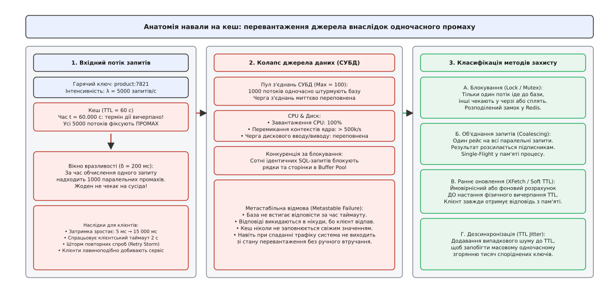
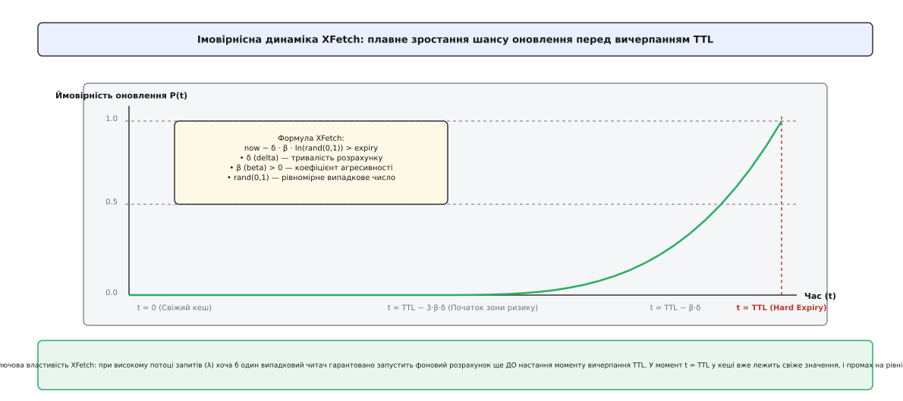
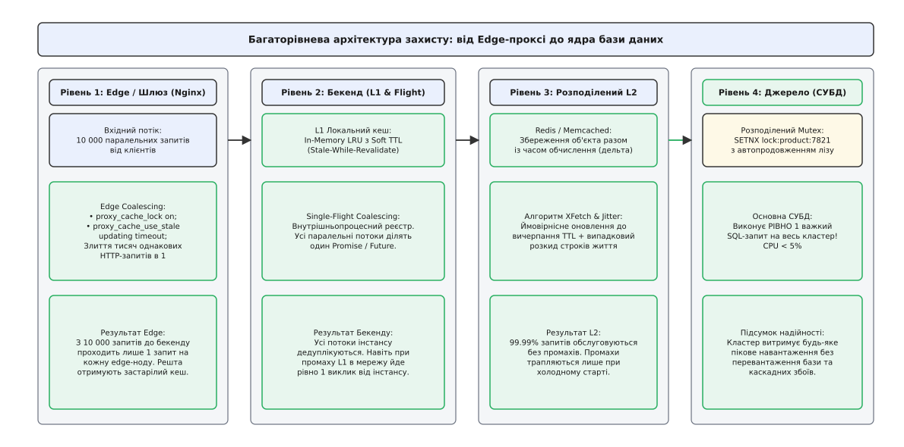

# Навала на кеш: Thundering Herd, блокування та злиття запитів

<preknowlist>
- [Стратегії кешування](topic:programming/caching-strategies) — шаблони Cache-Aside, Read-Through та ціна промаху повз оперативну пам'ять.
- [Інвалідація кешу](topic:programming/cache-invalidation-intro) — вичерпання TTL, витіснення ключів та узгодженість під час зміни даних.
- [Розподілені замки](topic:programming/distributed-locks) — механізми взаємного виключення, оренда лізу та захист від стану гонитви.
- [Об'єднання запитів (Single-Flight)](topic:programming/request-coalescing) — локальна дедуплікація викликів у пам'яті процесу.
- [Метастабільні відмови](topic:programming/metastable-failures) — лавиноподібні перевантаження систем через повторні спроби та черги.
</preknowlist>

Користувачі масово оновлюють розклад руху транспорту в перші хвилини сильного снігопаду. Протягом ста мілісекунд API-шлюз отримує десять тисяч паралельних HTTP-запитів за маршрутом `route:city:741`. Рівно о 08:00:00 п'ятихвилинний термін життя запису (TTL) у розподіленому кеші Redis добігає кінця. 

Усі десять тисяч обробників одночасно перевіряють кеш, фіксують промах і спрямовують десять тисяч однакових SQL-запитів із геопросторовою агрегацією до основної реляційної СУБД PostgreSQL. 

Пул з'єднань СУБД, обмежений значенням `max_connections = 200`, вичерпується за чотири мілісекунди. Черга очікування нових підключень переповнюється, ядро операційної системи витрачає 95% процесорного часу на перемикання контекстів між конкуруючими потоками та очікування spin-lock у буферному пулі, а затримка відповіді стрибає з десяти мілісекунд до двадцяти секунд. 

Мобільні застосунки, не дочекавшись відповіді через спрацьовування таймауту у дві секунди, автоматично повторюють виклики. Система входить у стан незворотного колапсу (метастабільної відмови): база даних перевантажена, жоден запит не встигає виконатися до таймауту, а кеш ніколи не отримує свіжих даних, бо всі відповіді викидаються клієнтами в нікуди.

Цей сценарій каскадного збою зветься **навалою на кеш** (англ. *cache stampede*, від *stampede* — «панічна втеча, некерований біг отари тварин»), або **штормом пробудження** (англ. *thundering herd*, «гримуча отара»), або **ефектом собачої купи** (англ. *dogpile effect*). 


*Анатомія навали на кеш: одночасний промах тисяч паралельних клієнтів створює вибухове навантаження на базу даних, викликаючи черги, таймаути та колапс системи.*

Еволюцію цієї проблеми — від пробудження сокетів у ранніх версіях ядер BSD UNIX та перших криз масштабування LiveJournal до масштабних блекаутів Вікіпедії — детально викладено в нарисі про [історію виникнення та розвитку методів боротьби з навалою на кеш](topic:programming/cache-stampede/hist-cache-stampede.md).

## Механізм виникнення та вікно вразливості

Фундаментальна вразливість класичного патерна Cache-Aside полягає в наявності несинхронізованого часового розриву між моментом вичерпання терміну дії даних і моментом збереження оновленого значення.

Нехай:
- `λ` — інтенсивність вхідного потоку запитів до певного ключа (кількість операцій читання на секунду);
- `δ` (дельта) — тривалість виконання запиту до первинного джерела даних (час вибірки з СУБД, агрегації чи виклику зовнішнього API);
- `T` — номінальний термін життя кешованого запису (TTL).

Коли настає момент `t = T`, перший потік фіксує промах кешу й вирушає до бази даних. Ця операція триватиме рівно `δ` секунд. Упродовж усього цього часового вікна `δ` запис у кеші залишається недійсним або відсутнім.

Оскільки всі паралельні запити надходять незалежно, кількість потоків `N`, які зафіксують промах кешу за час виконання першого обчислення, дорівнює:

```
N = λ · δ
```

Якщо популярний товар переглядають з інтенсивністю `λ = 4000` запитів на секунду, а складний розрахунок залишків на складі триває `δ = 0.3` секунди, то в базу даних полетить:

```
N = 4000 · 0.3 = 1200 паралельних важких запитів
```

Замість захисту бази даних кеш у мить свого вичерпання перетворюється на каталізатор перевантаження: навантаження на джерело зростає не лінійно, а вибухоподібно, генеруючи імпульс у 1200 разів вищий за звичайну пропускну здатність сховища.

### Хвиля синхронізованого згоряння (Synchronized Expiry Wave)

Навала стає ще руйнівнішою, коли в системі одночасно протухає не один ключ, а ціла група пов'язаних записів.

Типовий приклад — нічний запуск фонового завдання (cron) о 00:00:00, який оновлює ціни для ста тисяч товарів і записує їх у Redis з однаковим фіксованим терміном життя `TTL = 3600 с` (рівно 1 година). 

Рівно о 01:00:00 усі 100 000 ключів одночасно стають недійсними. Будь-який запит користувача, що торкається каталогу, спричиняє масовий промах, і навантаження на базу даних зростає на кілька порядків у межах однієї мілісекунди.

## Спектр архітектурних стратегій захисту

Для подолання навали на кеш у розподілених архітектурах застосовують чотири взаємодоповнюючі стратегії, кожна з яких має власний баланс між простотою, затримкою та гарантіями свіжості.


*Порівняння архітектурних патернів захисту: блокування (Lock), об'єднання викликів (Coalescing), м'який TTL (Stale-While-Revalidate) та ймовірнісне раннє оновлення (XFetch).*

### 1. Взаємне виключення через розподілене блокування (Distributed Lock)

Ідея полягає в тому, щоб дозволити доступ до бази даних **рівно одному потоку в усьому кластері**, змусивши решту запитів очікувати або відступити.

Коли потік фіксує промах кешу:
1. Він намагається атомарно захопити замок у розподіленому сховищі (наприклад, команда `SET lock:product:7821 token NX PX 3000` у Redis).
2. Якщо замок успішно захоплено, потік стає **виконавцем**: він іде до бази даних, обчислює свіже значення, записує його в кеш і атомарно звільняє замок.
3. Якщо замок уже зайнятий іншим процесом, поточний потік переходить у режим очікування: він засинає на короткий інтервал (наприклад, 50 мілісекунд з випадковим тремтінням) і повторно перевіряє наявність даних у кеші.

```
Схема поведінки потоку з блокуванням:
[Промах кешу]
      │
[Спроба взяти замок (SETNX)]
      ├──────► Успіх: Читання з СУБД ──► Запис у кеш ──► Звільнення замка ──► Відповідь
      │
      └──────► Зайнято: Сон 50 мс ──► Повторне читання кешу ──► Відповідь
```

**Критичні пастки та крайові випадки блокування:**
- **Зависання власника замка (Deadlock upon crash):** Якщо потік-лідер аварійно завершується або зависає в тривалій паузі збирача сміття (GC Pause), замок без терміну оренди (lease TTL) заблокує читання ресурсу назавжди. Тому замок завжди повинен мати обмежений строк життя (`PX timeout`).
- **Передчасне вичерпання оренди (Lease Expiry Race):** Якщо важкий запит до бази виконується 4 секунди при таймауті оренди в 3 секунди, Redis автоматично видалить замок. Другий потік захопить новий замок і теж піде в базу, що призведе до гонитви записів і дублювання навантаження. Для усунення цієї проблеми застосовують фонове автопродовження оренди (*heartbeat renewal*) або монотонні токени огородження (*fencing tokens*).
- **Шторм опитування замка (Spin-Lock Thundering Herd):** Якщо 5000 потоків кожні 50 мілісекунд надсилають запити `GET` і `SETNX` до Redis, сам Redis відчуває перевантаження процесора. Замість активного опитування часто використовують механізм Pub/Sub: очікувачі підписуються на канал `cache:ready:key` і сплять до моменту публікації сигналу готовності лідером.

### 2. Об'єднання однакових запитів (Request Coalescing / Single-Flight)

Якщо блокування серіалізує запити через зовнішнє сховище, то патерн Single-Flight об'єднує паралельні виклики безпосередньо в оперативній пам'яті вузла застосунку.

Усередині процесу ведеться потокобезпечна таблиця активних рейсів (`map[Key]*Future`). Коли десять горутин або потоків одночасно звертаються за одним ключем:
1. Перший потік створює структуру рейсу, реєструє її в таблиці під ключем операції та запускає виконання єдиного виклику до бази даних.
2. Решта дев'ять потоків виявляють наявність активного рейсу і блокуються на спільному примітиві очікування (`std::shared_future` у C++, каналі в Go або `Promise` у TypeScript/JavaScript).
3. Після завершення операції лідер записує результат у структуру рейсу і сповіщає всіх підписників. Усі десять потоків одночасно отримують копію результату.

Single-Flight має нульовий мережевий оверхед, проте діє лише в межах одного запущеного інстансу процесу. У кластері з 50 реплік мікросервісу до бази надійде максимум 50 запитів (по одному від кожної репліки), що вже усуває 99% навантаження.

### 3. М'який термін життя та фонове оновлення (Stale-While-Revalidate)

Найкращий спосіб уникнути затримки під час промаху кешу — ніколи не змушувати користувача чекати відповіді від бази даних.

У цій схемі кожен запис у кеші наділяється двома часовими порогами:
- **М'який термін (Soft TTL):** номінальний час актуальності даних (наприклад, 60 секунд).
- **Жорсткий термін (Hard TTL):** максимальний час фізичного зберігання застарілого значення (наприклад, 600 секунд).

Коли надходить запит у момент часу `now`:
1. Якщо `now < Soft TTL` — кеш абсолютно свіжий, повертається значення (0 мс затримки).
2. Якщо `Soft TTL ≤ now < Hard TTL` — кеш вважається застарілим (*stale*). Застосунок **миттєво віддає клієнту старе значення з пам'яті**, а в асинхронну чергу завдань додає фонову задачу на оновлення цього ключа з бази даних.
3. Якщо `now ≥ Hard TTL` — кеш повністю протух, запит виконується синхронно або через блокування.

Цей принцип закріплено в міжнародному стандарті RFC 5861 для HTTP-заголовка `Cache-Control: max-age=60, stale-while-revalidate=540`. Користувачі взагалі не відчувають затримок, а база даних плавно оновлюється у фоновому режимі.

### 4. Імовірнісне раннє оновлення: Алгоритм XFetch

Традиційне фонове оновлення вимагає наявності черги або фонових воркерів. Якщо в системі зберігаються мільйони ключів, постійно перевіряти кожен із них у фоні занадто накладно. До того ж фонове оновлення марно витрачає ресурси на ті ключі, які після першого запису більше ніхто ніколи не запитає.

Для вирішення цієї дилеми було створено алгоритм **XFetch** (Ваттані, К'єрікетті, Ловенштейн, VLDB 2015).

Суть XFetch полягає в тому, що необхідність оновлення оцінюється під час кожного звичайного читання клієнтом за ймовірнісною формулою:

```
t − δ · β · ln(U) > t_expiry
```

де:
- `t` — поточний час надходження запиту;
- `δ` (дельта) — час, витрачений на останній розрахунок цього значення (зберігається в метаданих запису);
- `β > 0` — коефіцієнт агресивності (зазвичай `1.0`);
- `U` — випадкове дійсне число, рівномірно розподілене на інтервалі `(0, 1]`;
- `ln(U)` — натуральний логарифм (завжди від'ємне або нульове число).

Оскільки `ln(U) ≤ 0`, доданок `-δ · β · ln(U)` завжди є додатним числом, розподіленим за експоненційним законом.


*Динаміка XFetch: чим ближче час до вичерпання TTL і чим важчим є запит (δ), тим вища ймовірність, що випадковий читач запустить фонове оновлення до настання промаху.*

Математичну строгість алгоритму, виведення показникового розподілу та розрахунок ймовірності нульового промаху детально розібрано в [математичному виведенні та аналізі алгоритму XFetch](topic:programming/cache-stampede/math-xfetch-derivation.md).

## Дезсинхронізація ключів за допомогою TTL Jitter

Коли тисячі записів потрапляють у кеш одночасно (наприклад, після перезавантаження сервісу, прогріву або масової міграції), фіксований TTL гарантує їхнє одночасне згоряння.

Щоб розмити пік навантаження в часі, до номінального терміну життя додають псевдовипадковий шум — **TTL Jitter** (від англ. *jitter* — «тремтіння, флуктуація»):

```
TTL_actual = TTL_base + Uniform(-Jitter, +Jitter)
```

Або у відносному форматі:

```
TTL_actual = TTL_base · (1 + Uniform(-0.15, +0.15))
```

Якщо 100 000 товарів кешуються з базовим `TTL = 3600 с` та випадковим відхиленням ±15% (±540 секунд), то моменти їхньої інвалідації рівномірно розподіляються у вікні довжиною 18 хвилин. Замість катастрофічного стрибка в 100 000 промахів за секунду база даних отримує спокійні 92 промахи на секунду, з якими легко справляється будь-який сервер.

## Ешелонована багаторівнева архітектура захисту

У високонавантажених промислових системах жоден окремий механізм не застосовується ізольовано. Найкращу надійність забезпечує комбінація рівнів:


*Багаторівнева ешелонована оборона: об'єднання запитів на Edge-шлюзі, локальний Single-Flight на бекенді, алгоритм XFetch у Redis та розподілений замок перед СУБД.*

1. **Рівень Edge / API Gateway (Nginx / Envoy):**
   - На рівні зворотного проксі вмикають директиви `proxy_cache_lock on` та `proxy_cache_use_stale updating`. Якщо на шлюз одночасно б'ють 5000 однакових HTTP-запитів, проксі пропускає на бекенд лише один запит, а іншим негайно повертає застарілий кеш.
2. **Рівень застосунку (App Instances):**
   - Кожен інстанс застосунку використовує локальний in-memory L1 кеш з підтримкою `Single-Flight`. Усі потоки всередині процесу дедуплікуються, запобігаючи генерації дублюючого трафіку в локальну мережу.
3. **Рівень спільного кешу (Distributed Redis / Memcached L2):**
   - Об'єкти зберігаються разом із метаданими часу обчислення (`delta`). Читання виконується через алгоритм `XFetch` із застосуванням `TTL Jitter`, що забезпечує автоматичне фонове оновлення 99.9% гарячих ключів до їхнього згоряння.
4. **Рівень бази даних (Source of Truth):**
   - Як останній захисний рубіж перед виконанням важкого SQL-запиту застосовується розподілений замок у Redis із лізом. Якщо через збій мережі або холодний старт промах таки стався, база даних гарантовано отримає лише одне звернення на весь кластер.

Готовий для використання код рушія із синхронізацією на C++, C, Go та TypeScript наведено в [практичній реалізації надійного захисту StampedeGuard](topic:programming/cache-stampede/proj-stampede-defense.md).

Специфікацію метаданих, конфігураційні директиви для Nginx, Varnish і Envoy, а також Lua-скрипти безпечної оренди замків зібрано в [довіднику API та конфігурації захисту від навали](topic:programming/cache-stampede/api-stampede-control.md).

> 🔧 **Навіщо це в реальній розробці.**
> У будь-якій системі під навантаженням понад 1000 запитів на секунду просте додавання кешу Cache-Aside без захисту від навали створює ілюзію стабільності, яка руйнується в момент першого ж піку трафіку або релізу. 
> Впровадження Single-Flight на рівні бекенду усуває 90% локальних сплесків, додавання TTL Jitter захищає від наслідків нічних крон-завдань, а алгоритм XFetch зводить затримку читання для користувачів до нуля без побудови громіздких фонових черг.
