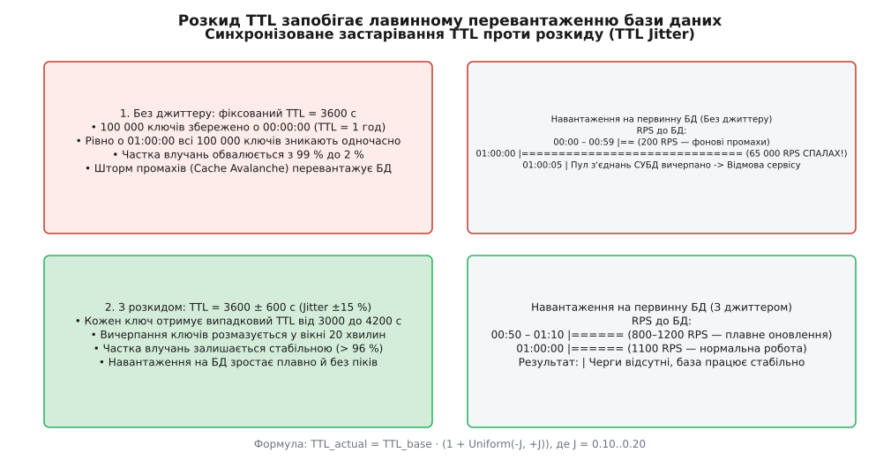
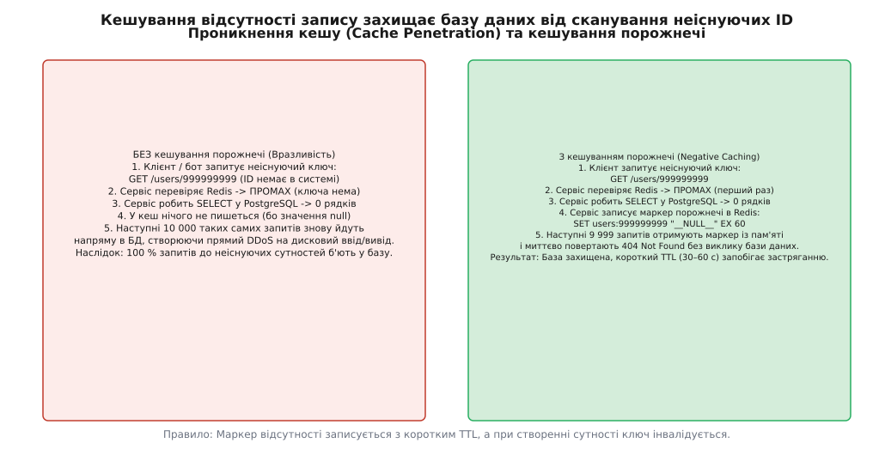
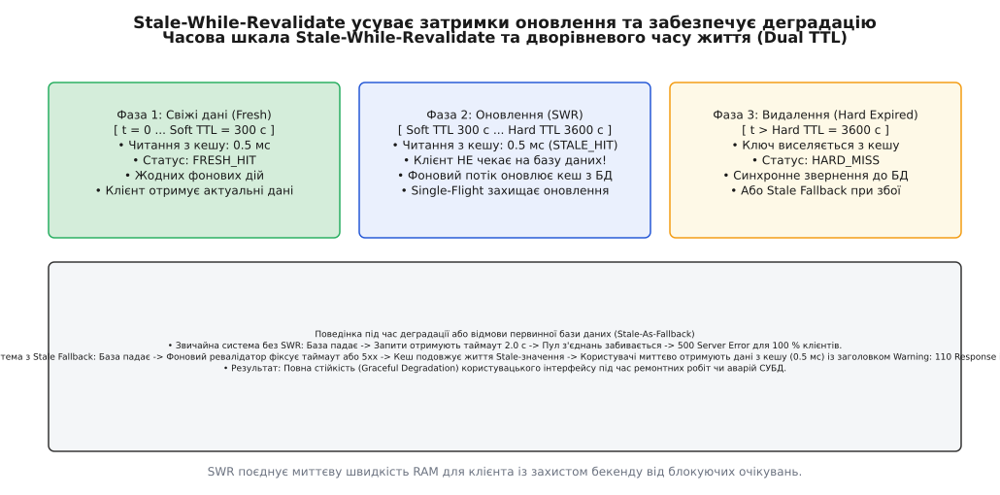
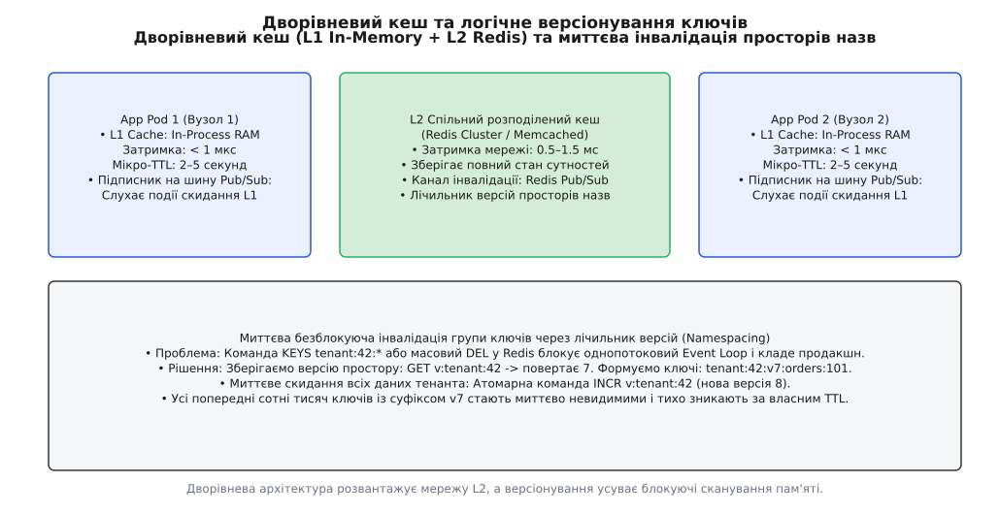

# Дрібні кеш-тактики, що рятують проди

<preknowlist>
- [Стратегії кешування](topic:programming/caching-strategies) — шаблони Cache-Aside, Read-Through, Write-Through та ціна мережевого запиту.
- [Інвалідація кешу](topic:programming/cache-invalidation-intro) — вичерпання TTL та розходження стану між кешем і джерелом правди.
- [Що НЕ кешувати і чому](topic:programming/what-not-to-cache) — точка беззбитковості hit ratio та ризики засмічення пам'яті.
- [Об'єднання однакових запитів](topic:programming/request-coalescing) — Single-Flight для усунення дублювання запитів на гарячих ключах.
</preknowlist>

Команда великого інтернет-магазину готується до опівнічного старту розпродажу. Щоб гарантувати швидку віддачу сторінок, нічний фоновий воркер о 00:00:00 завантажує в кластер Redis 500 000 карток найпопулярніших товарів із фіксованим часом життя одна година (`TTL = 3600 с`). Протягом перших шістдесяти хвилин система працює бездоганно: частка влучань у кеш перевищує 99.2 %, затримка відповіді API становить менше 2 мс, а первинна реляційна база даних PostgreSQL завантажена лише на 4 %.

Рівно о 01:00:00 настає катастрофа: усі 500 000 ключів вичерпують свій термін придатності в межах однієї й тієї самої мілісекунди. За частку секунди частка влучань у кеш обвалюється з 99.2 % до 4.1 %. Мільйон активних покупців одночасно генерують 80 000 SQL-запитів на секунду до первинної бази даних. Пул з'єднань СУБД миттєво вичерпується, черга дискового вводу/виводу переповнюється, затримка запитів злітає з 2 мс до 15 секунд, і весь сервіс оформлення замовлень падає через каскадні таймаути. Одночасно боти-парсери починають масово опитувати неіснуючі артикули товарів (`product:random_uuid`), спричиняючи стовідсоткові промахи кешу, які безперешкодно проходять крізь Redis і добивають базу даних.

Ця типова виробнича аварія демонструє прірву між академічним розумінням кешу як простої таблиці `get(key)/set(key, value)` та реальною фізикою розподілених систем під навантаженням. У високонавантажених продах стандартні патерни Cache-Aside самі по собі не рятують від синхронізації вичерпання, сканування неіснуючих ключів, сплесків затримок на гарячих записах чи відмов бекенду. Щоб кеш став надійним бронежилетом для бази даних, застосовують набір спеціалізованих інженерних тактик: розкид часу життя (TTL Jitter), кешування порожнечі (Negative Caching), асинхронне оновлення Stale-While-Revalidate, раннє імовірнісне оновлення XFetch, стійкий відкат (Stale Fallback), дворівневу ієрархію та логічне версіонування просторів назв.

## 1. Синхронізація вичерпання: фізика лавиноподібного застарівання та розкид TTL (Jitter)

Найпоширенішою причиною раптового падіння баз даних є **лавиноподібне застарівання кешу** (англ. *Cache Avalanche*). Воно виникає щоразу, коли велика група записів записується в кеш одночасно з однаковим значенням часу життя (англ. *Time To Live*, TTL).

### Механізм виникнення лавини
Синхронізація часу створення ключів відбувається у трьох типових сценаріях:
1. **Нічні фонові задачі (Batch Warming / Cron Jobs)**: воркер щогодини зчитує каталог або залишки на складі й записує сотні тисяч ключів із фіксованим `TTL = 3600 с`.
2. **Перезапуск сервісу або кеш-вузла**: після падіння або рестарту pod'а в Kubernetes холодний кеш починає масово заповнюватися в перші хвилини роботи.
3. **Хвиля користувацького трафіку**: публікація новини чи розсилка сповіщень викликає одночасне звернення мільйонів користувачів до схожих категорій даних.

Коли настає час `t = t_0 + TTL`, усі ці записи одночасно зникають із пам'яті кешу. Графік кількості промахів перетворюється на дельта-функцію Дірака: вузький, колосальний за амплітудою пік навантаження на первинну базу даних.


*Синхронізоване вичерпання фіксованого TTL спричиняє спалах промахів і колапс бази даних. Впровадження розкиду часу життя (TTL Jitter) розмазує вичерпання у часі, утримуючи навантаження на СУБД у межах безпечної норми.*

### Механізм розкиду: рівномірний та гауссів джиттер
Щоб зруйнувати фазову синхронізацію вичерпання, до номінального часу життя кожного ключа додають псевдовипадкову складову — **розкид часу життя** (англ. *TTL jitter*, від англ. *jitter* — «тремтіння, коливання»).

Базова формула рівномірного джиттеру розраховує фактичний час життя `TTL_actual`:

```
TTL_actual = TTL_base · (1 + Uniform(−J, +J))
```

де:
- `TTL_base` — номінальний базовий час життя (наприклад, 3600 с);
- `J` — коефіцієнт розкиду (зазвичай `J ∈ [0.10, 0.20]`, тобто `±10–20 %`);
- `Uniform(−J, +J)` — неперервна випадкова величина, рівномірно розподілена на відрізку `[−J, +J]`.

Якщо для 100 000 ключів встановлено `TTL_base = 3600 с` із коефіцієнтом `J = 0.15`, час життя кожного ключа розподіляється в інтервалі від 3060 до 4140 секунд. Замість миттєвого зникнення всіх ключів на 3600-й секунді, процес їх вичерпання рівномірно розтягується на вікно тривалістю `2 · J · TTL_base = 1080` секунд (18 хвилин).

Оцінимо пікове навантаження на базу даних під час вичерпання 100 000 ключів за секунду:

```
RPS_peak_sync
= N_keys / T_window_sync
= 100000 / 1 c
= 100000 запитів/с               [миттєвий шторм запитів без джиттеру]
```

```
RPS_peak_jitter
= N_keys / (2 · J · TTL_base)
= 100000 / 1080 c
≈ 92.6 запитів/с                  [плавне фонове навантаження з джиттером]
```

Завдяки додаванню двох рядків коду генерації випадкового коефіцієнта піковий тиск на базу даних знижується у **1080 разів**, перетворюючи смертельний спалах на непомітний фоновий потік запитів.

## 2. Проникнення кешу: кешування порожнечі (Negative Caching) та фільтри допуску

Другою критичною вразливістю є **проникнення кешу** (англ. *Cache Penetration*). Воно виникає, коли клієнти запитують дані за ключами, які взагалі відсутні в системі (наприклад, неіснуючі ідентифікатори користувачів, застарілі артикули або зловмисний перебір випадкових UUID ботами-сканерами).

### Чому класичний Cache-Aside безсилий проти проникнення
Розглянемо стандартний алгоритм обробки запиту `GET /orders/99999999`:
1. Застосунок перевіряє кеш Redis за ключем `order:99999999` і отримує промах (ключ відсутній).
2. Застосунок надсилає SQL-запит `SELECT * FROM orders WHERE id = 99999999` до PostgreSQL.
3. База даних виконує пошук за індексом і повертає порожній результат (0 рядків).
4. Оскільки замовлення не існує, наївний сервіс нічого не записує в кеш і повертає клієнту відповідь `404 Not Found`.
5. Коли бот надсилає 50 000 таких запитів із різними неіснуючими номерами, **100 % запитів пробивають кеш наскрізь** і навантажують дисковий ввід/вивід бази даних.


*Без кешування порожнечі кожен запит до неіснуючого ID навантажує базу даних. Збереження маркера відсутності з коротким TTL миттєво віддає 404 з оперативної пам'яті, блокуючи сканування.*

### Кешування відсутності (Negative Caching)
Щоб захистити базу даних, у кеші зберігають спеціальний маркер порожнечі — **негативний запис** (англ. *negative caching* або *tombstone record*).

Механізм роботи:
1. Якщо первинне джерело повертає порожній результат (або помилку «сутність не знайдена»), сервіс записує в кеш маркер `__NULL__` (або `std::nullopt` у бінарному форматі).
2. Для негативного запису встановлюють **короткий час життя** `TTL_negative` (зазвичай від 30 до 120 секунд).
3. Наступні тисячі запитів до цього неіснуючого ID знаходять маркер у пам'яті кешу й миттєво повертають `404 Not Found` за 0.3 мс без звернення до СУБД.

### Підводний камінь: гонка створення сутності
Головний ризик негативного кешування — ситуація, коли сутність створюється одразу після запису маркера порожнечі:
1. О 12:00:00 користувач намагається відкрити профіль `user:42` до завершення його реєстрації -> кеш зберігає `__NULL__` на 60 секунд.
2. О 12:00:02 завершується реєстрація користувача `42` в базі даних.
3. До 12:01:00 користувач бачить помилку `404 Not Found`, оскільки кеш віддає збережений маркер порожнечі.

Щоб запобігти цьому розходженню, операція створення нової сутності зобов'язана виконувати **явну інвалідацію або перезапис ключа в кеші** (`cache.delete("user:42")` або `cache.set("user:42", new_data)`). Навіть якщо повідомлення про інвалідацію загубиться в мережі, короткий `TTL_negative = 60 с` гарантує швидке відновлення актуального стану без втручання людини.

Додатковим бар'єром перед кешем для великих обсягів даних виступають імовірнісні структури фільтрації допуску — фільтри Блума (англ. *Bloom Filter*) або фільтри Кукушки (англ. *Cuckoo Filter*), які дають змогу перевірити факт відсутності ключа в системі за частки мікросекунди без читання Redis.

## 3. Усунення затримок оновлення: Stale-While-Revalidate та раннє імовірнісне оновлення (XFetch)

Навіть якщо база даних захищена від дублювання запитів за допомогою Single-Flight, у момент вичерпання TTL гарячого ключа перший клієнтський запит неминуче стикається із затримкою: йому доводиться чекати повний час виконання важкого SQL-запиту чи агрегації `T_origin` (наприклад, 150–300 мс). Для ультра-гарячих ключів це створює періодичні «зубці» на графіках 99-го перцентиля затримки (p99 latency).

Щоб усунути затримку очікування для користувачів, застосовують асинхронні тактики завчасного оновлення.

### Дворівневий час життя: Soft TTL та Hard TTL (Stale-While-Revalidate)
Патерн **Stale-While-Revalidate (SWR)** розділяє концепцію логічної свіжості даних та фізичного видалення запису з пам'яті за допомогою двох часових меж:
- **Soft TTL (М'який термін життя)**: час, протягом якого дані вважаються абсолютно свіжими (наприклад, 5 хвилин). Після його завершення дані стають застарілими (англ. *stale*), але все ще безпечними для читання.
- **Hard TTL (Жорсткий термін життя)**: час абсолютного видалення запису з пам'яті (наприклад, 1 година).


*Життєвий цикл запису з SWR: у зоні між Soft TTL та Hard TTL користувач миттєво отримує застаріле значення з кешу (0.5 мс), а оновлення з бази даних виконується асинхронно у фоновому потоці.*

Алгоритм обробки читання під час SWR:
1. Запит перевіряє кеш. Якщо `t < Soft TTL`, значення повертається як свіже (Fresh Hit, 0.5 мс).
2. Якщо `Soft TTL ≤ t < Hard TTL`, клієнт **негайно отримує поточне значення з кешу** (Stale Hit, 0.5 мс) без жодного блокування.
3. Одночасно клієнтський модуль ініціює асинхронне фонове завдання (у горутині чи пулі воркерів), яке виконує запит до бази даних, отримує свіжі дані та оновлює запис у кеші.
4. Фоновий рейс обов'язково захищається локальним Single-Flight, щоб лише один фоновий потік звертався до бази даних.

### Раннє імовірнісне оновлення: алгоритм XFetch
У розподілених системах із сотнями незалежних мікросервісів детермінований поріг `Soft TTL` може призвести до того, що кілька інстансів одночасно побачать застарілість ключа й ініціюють паралельні фонові ревалідації.

Для вирішення цієї проблеми застосовують алгоритм **раннього імовірнісного оновлення (XFetch)**, запропонований дослідниками Ваттані, К'єрікетті та Левенштейном.

Ідея XFetch полягає в тому, що під час кожного читання запису ймовірність запуску фонового оновлення плавно зростає в міру наближення до моменту вичерпання TTL і пропорційно до часу виконання операції `Δ`.

Умова перевірки в коді під час читання:

```
current_time − (Δ · β · ln(U)) > expiry_time
```

де:
- `Δ` — час останнього обчислення значення в базі даних (у секундах);
- `β > 0` — коефіцієнт агресивності (зазвичай `β = 1.0`);
- `U ~ Uniform(0, 1]` — випадкове число, згенероване під час запиту;
- `expiry_time` — часова мітка вичерпання номінального TTL.

Якщо умова виконується, сервіс віддає поточне значення з пам'яті й паралельно оновлює запис у фоні. Що частіше запитують ключ і що важче обчислюється значення `Δ`, то вища ймовірність, що фонове оновлення успішно завершиться **до того, як ключ фізично згасне**, зводячи частку синхронних промахів до нуля.

Детальне математичне виведення функції ймовірності, доказ збіжності пуассонівського потоку та формули розрахунку втрат викладено в матеріалі: [математичне виведення та ймовірнісний аналіз алгоритму XFetch](topic:programming/cache-tactics/math-early-refresh.md).

## 4. Застарілий кеш як захисний контур при аваріях (Stale-As-Fallback)

У разі збою первинного сховища (падіння репліки PostgreSQL, блокування таблиць через тривалу міграцію, мережева ізоляція кластера) звичайна система починає масово повертати користувачам помилки `500 Internal Server Error` або `504 Gateway Timeout`.

Тактика **Stale-As-Fallback** (або заголовок HTTP `stale-if-error`) перетворює кеш на автономний контур живучості.

### Принцип роботи захисного контуру
1. Під час читання сервіс виявляє, що термін дії ключа вичерпався (минув `Hard TTL`), або ключа немає в свіжому стані.
2. Сервіс надсилає запит до первинної бази даних.
3. Якщо база даних повертає помилку з'єднання, таймаут або якщо запобіжник (англ. *Circuit Breaker*) перебуває у відкритому стані, кеш-клієнт **не повертає помилку користувачу**.
4. Замість цього клієнт витягує з пам'яті застарілий стан (навіть якщо він протермінований на кілька годин чи діб), подовжує термін його життя на аварійний інтервал (наприклад, 60 секунд) і повертає клієнту дані з позначкою `Warning: 110 Response is Stale`.

> 🔧 **Навіщо це.** Під час збою головної бази даних користувачі інтернет-магазину продовжують переглядати картки товарів, читати описи та бачити ціни без жодного збою в інтерфейсі. Робота з перегляду каталогу повністю зберігається (Graceful Degradation), а інженери отримують запас часу для спокійного перезапуску СУБД без паніки та втрати клієнтів.

## 5. Дворівневий кеш: L1 In-Memory + L2 Redis та боротьба з розходженням

Коли навантаження на окремий мікросервіс досягає сотень тисяч запитів на секунду, звернення до централізованого кластера Redis через TCP-сокет стає вузьким місцем. Кожен мережевий round-trip додає від 0.5 до 2.0 мс затримки, а процесор витрачає значні ресурси на серіалізацію та десеріалізацію JSON чи Protobuf.

Для подолання цього бар'єра впроваджують **дворівневу архітектуру кешування (Two-Tier Caching)**:
- **Рівень L1 (In-Process Memory)**: локальна оперативна пам'ять процесу (структура `std::unordered_map`, `Ristretto` у Go або `Caffeine` у Java). Затримка звернення — **менше 1 мікросекунди**, нульові мережеві витрати.
- **Рівень L2 (Distributed Cache)**: спільний кластер Redis або Memcached. Затримка — 1.0 мс, гарантує єдиний спільний стан для всіх подів застосунку.


*Дворівнева топологія: локальний рівень L1 усуває мережеві затримки, кластер L2 забезпечує спільний стан, а версіонування просторів назв дозволяє миттєво інвалідувати групи ключів без блокування Redis.*

### Проблема розходження стану (L1 Drift) та тактики її вирішення
Головна небезпека локального кешу L1 полягає в тому, що різні поди одного сервісу мають незалежні копії даних у своїй пам'яті. Якщо користувач оновлює ім'я на Pod 1, Pod 2 продовжує віддавати старе ім'я зі своєї локальної пам'яті.

Для вирішення цієї проблеми застосовують дві стратегії:
1. **Мікро-TTL для L1 (Micro-caching)**: записи в локальній пам'яті процесу зберігаються із надкоротким часом життя — **від 1 до 5 секунд**. Навіть якщо дані змінилися, розходження між подами триває максимум пару секунд, тоді як навантаження на мережу та L2 Redis для ультра-гарячих ключів знижується на 95–99 %.
2. **Шина інвалідації через Pub/Sub (Client-Side Caching)**: під час запису мутації на Pod 1, він надсилає коротке повідомлення в канал `cache:invalidate:user:42` через Redis Pub/Sub або RESP3 Tracking. Усі інші поди, отримавши подію з сокета, миттєво виселяють відповідний ключ зі своєї локальної пам'яті L1.

## 6. Миттєва безблокуюча інвалідація груп ключів (Logical Namespacing & Key Versioning)

У багатьох бізнес-сценаріях виникає потреба інвалідувати не один ключ, а цілу категорію даних: усі замовлення конкретного клієнта, увесь каталог товарів магазину після зміни курсу валют або всі налаштування організації-орендаря (мультитенантність).

### Чому масовий `KEYS` або `SCAN + DEL` убиває прод
Початківці часто намагаються видалити групу ключів через команду Redis `KEYS tenant:42:*` з наступним викликом `DEL`.
Оскільки Redis є однопотоковим сервером подій (Event Loop), виконання команди `KEYS` на базі з 20 мільйонами ключів блокує Redis на 3–8 секунд. У цей час жоден інший клієнт не може прочитати жодного ключа: з'єднання зависають, черги мікросервісів переповнюються, і система зазнає повної зупинки.

### Механізм логічного версіонування ключів
Тактика **версіонування просторів назв (Key Namespacing / Versioning)** забезпечує миттєву інвалідацію будь-якої кількості ключів за час `O(1)` без жодного сканування пам'яті.

Алгоритм реалізації:
1. Для кожного простору назв (наприклад, організації `tenant:42`) у Redis зберігається окремий лічильник поточної версії: `v:tenant:42 -> 1`.
2. Під час формування будь-якого ключа сутності всередині цього простору до назви ключа додається поточна версія:
   `key = "tenant:42:v1:orders:992"`
3. Коли адміністратор змінює налаштування тенанта і вимагає скинути весь його кеш, сервіс виконує єдину атомарну операцію інкременту лічильника версії:
   `INCR v:tenant:42` (значення стає `2`).
4. Наступні операції читання починають шукати ключі з префіксом `tenant:42:v2:...`, фіксують промах і зчитують свіжі дані з бази.
5. Усі сотні тисяч старих ключів із префіксом `v1` стають миттєво недосяжними для читання й тихо та безпечно видаляються механізмом витіснення Redis за своїм природним `TTL` без жодних стрибків навантаження на процесор.

## 7. Практична реалізація та специфікація

Повний програмний код завершеного клієнта, що поєднує випадковий розкид часу життя, негативне кешування, Stale-While-Revalidate та захист від блокувань, наведено у відповідній проектній вставці: [повноцінний потокобезпечний клієнт стійкого кешування мовами C та C++](topic:programming/cache-tactics/proj-resilient-cache.md).

Повний довідковий опис усіх полів конфігурації, статусів результату та словника метрик для систем моніторингу Prometheus наведено у довіднику інтерфейсу: [специфікація конфігураційних параметрів, статусів та метрик Prometheus](topic:programming/cache-tactics/api-cache-policy.md).
