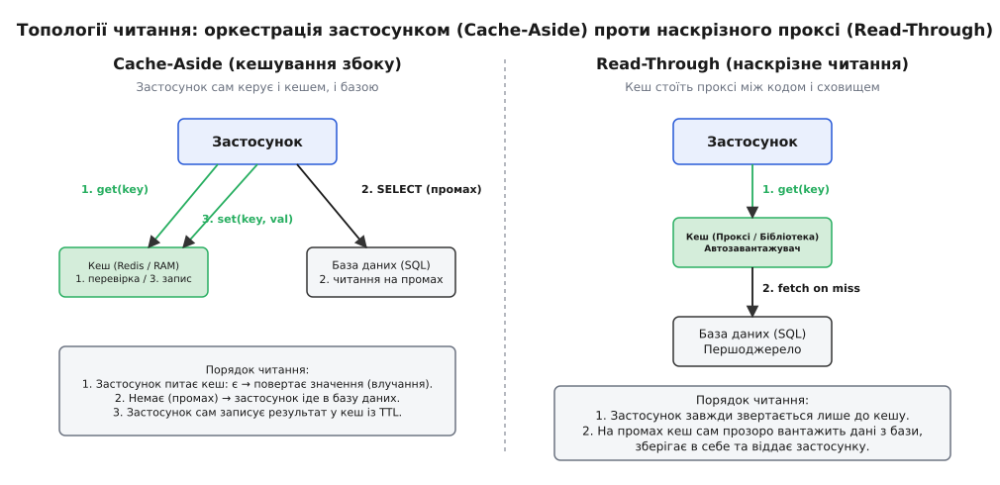
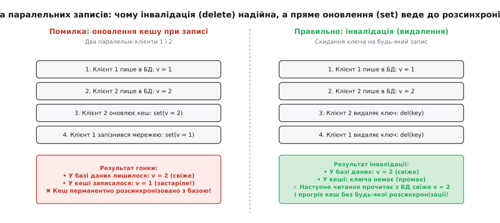
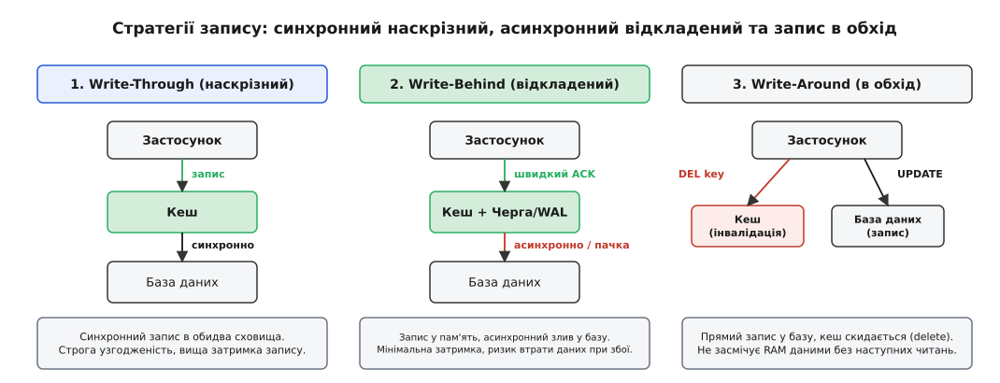

# Патерни кешування

<preknowlist>
- [Кеш](topic:programming/cache) — мала швидка пам'ять із копіями гарячих даних; влучання, промах, локальність звернень.
- [Транзакції та ACID](topic:programming/transactions-acid) — атомарність, узгодженість, ізоляція та довговічність змін у сховищі.
- [Політики витіснення кешу](topic:programming/cache-eviction-policies) — правила звільнення пам'яті (LRU, LFU, Clock), коли ліміт вичерпано.
- [Черги повідомлень](topic:programming/message-queue) — асинхронна передача повідомлень між компонентами без блокування відправника.
</preknowlist>

Сервіс інтернет-магазину обробляє 40 000 запитів на читання карток товарів щосекунди й близько 300 операцій оновлення цін і залишків. Реляційна база даних на виділеному сервері починає задихатися вже на 2 500 читаннях за секунду: дискові черги зростають, процесорні ядра зайняті синтаксичним розбором SQL-виразів та скануванням індексів, а затримка відповіді (latency) стрибає з 4 мілісекунд до півтори секунди. Поставити поруч швидкий кеш в оперативній пам'яті (наприклад, Redis або Memcached) — очевидне рішення, яке дозволяє віддавати 95 % запитів за 0.5 мілісекунди.

Але щойно в системі з'являється друге сховище даних, виникає фундаментальний архітектурний розкол: **хто саме координує рух даних між застосунком, кешем і базою даних?**

Якщо застосунок спершу оновить базу даних, а потім спробує записати нове значення в кеш, два паралельні запити через мережеву затримку можуть дістатися кешу у зворотному порядку — і в кеші назавжди осяде застаріле значення. Якщо ж оновити кеш першим, а транзакція в базі відкотиться через помилку або збій живлення, клієнти читатимуть дані-фантоми, яких ніколи не існувало в дійсності. Ці правила та протоколи взаємодії називають **патернами кешування** (або стратегіями кешування, від грец. *στρατηγία* — «мистецтво полководця, загальний план дій»).

## Топологія правди: хто з ким розмовляє

Будь-яка схема взаємодії з кешем зводиться до двох принципових топологічних моделей.

У **наскрізній моделі (Inline Caching)** кеш стає прозорим посередником (проксі) між кодом застосунку та первинною базою даних. Застосунок навіть не знає про існування бази: він надсилає всі запити на читання та запис виключно до кеш-сервісу або уніфікованої клієнтської бібліотеки. Кеш сам вирішує, коли звертатися до диска, як завантажувати відсутні значення і як синхронізувати мутації. До цього сімейства належать патерни *Read-Through*, *Write-Through* та *Write-Behind*.

У **моделі кешування збоку (Side-by-side / Application-Orchestrated Caching)** кеш і база даних є абсолютно незалежними сусідами. Вони нічого не знають один про одного і не обмінюються жодними пакетами. Усю логіку координації бере на себе сам застосунок: він вирішує, коли перевірити пам'ять, коли виконати SQL-запит і як саме очистити застарілі копії при модифікації. Головним представником цієї моделі є патерн *Cache-Aside* (і його напарник *Write-Around*).


*Зліва — Cache-Aside: застосунок самостійно координує всі виклики між кешем і базою даних. Справа — Read-Through: кеш стоїть наскрізним проксі, самостійно звертаючись до бази при промахах.*

Вибір між цими двома підходами визначає стійкість системи до аварій, навантаження на мережу, транзакційну безпеку та складність супроводу коду.

## Cache-Aside: лінива оркестрація застосунком

Патерн Cache-Aside (кешування збоку, або ліниве завантаження за вимогою) є найпоширенішим підходом у сучасних розподілених системах. Його суть полягає в тому, що первинне джерело правди (база даних) повністю відділене від тимчасового сховища копій.

### Читання: покроковий алгоритм
Коли застосунку потрібні дані за ключем `K`, він виконує чітку послідовність кроків:
1. Застосунок звертається до кешу: `GET K`.
2. **Влучання (Hit):** Якщо ключ є в пам'яті, кеш миттєво повертає значення `V`. Застосунок віддає його клієнту. Час операції — менше 1 мс.
3. **Промах (Miss):** Якщо ключа немає (або термін його дії закінчився), кеш повертає `null`.
4. Застосунок звертається до первинної бази даних: `SELECT ... WHERE id = K`.
5. Отримавши результат із бази, застосунок сам записує копію в кеш із встановленням часу життя: `SET K V EX 300` (TTL 300 секунд).
6. Застосунок повертає значення клієнту.

Головна властивість такого читання — **лінивість (lazy loading)**. У кеш потрапляють виключно ті об'єкти, які реально запитуються користувачами. Якщо в базі зберігається 10 мільйонів товарів, але клієнти купують лише 50 000 найпопулярніших, пам'ять кешу не витрачається на 9.95 мільйона «холодних» записів.

### Запис: чому видалення перемагає пряме оновлення
Коли клієнт змінює дані (наприклад, ціну товару), застосунок мусить зберегти новий стан. У розробників-початківців часто виникає спокуса оновити обидва місця: `db.update()` та `cache.set(K, new_val)`.

Це катастрофічна помилка у багатопотоковому або розподіленому середовищі. Погляньмо на послідовність подій, коли два клієнти одночасно змінюють той самий товар:

```
Клієнт 1: db.set("item:5", 100)
Клієнт 2: db.set("item:5", 200)
Клієнт 2: cache.set("item:5", 200)
Клієнт 1: [затримка мережі] ... cache.set("item:5", 100)
```

База даних зафіксувала транзакції в порядку 1 → 2, тому в ній зберігається актуальна ціна `200`. Але через мережеву затримку пакет від клієнта 1 дістався сервера Redis останнім. У кеші записалася ціна `100`. Відтепер усі користувачі годинами читатимуть застарілу ціну `100`, хоча в базі лежить `200`. Сталося непоправне **розходження даних (data divergence)**.

Саме тому золотим правилом Cache-Aside є **інвалідація (видалення) замість перезапису**:
1. Застосунок фіксує зміну в базі даних: `db.update(...)`.
2. Застосунок видаляє ключ із кешу: `cache.del(K)`.


*Зліва — пряме оновлення кешу призводить до перманентної неузгодженості через зміну порядку пакетів. Справа — інвалідація (видалення) змушує наступне читання взяти свіже значення з бази даних.*

Якщо два клієнти одночасно оновлюють запис і обидва виконують `DEL K`, порядок їхніх запитів не має значення. Ключа в кеші більше немає. Наступний клієнт, який прийде за цим товаром, отримає гарантований промах, прочитає з бази свіже значення `200` і збереже його в кеш.

Історичний шлях створення цього патерну Бредом Фіцпатріком у проекті LiveJournal та його подальше масштабування інженерами Facebook детально описано в історичній довідці: [історія появи cache-aside та memcached](topic:programming/caching-strategies/hist-cache-aside-memcached.md).

### Переваги та ціна Cache-Aside
- **Стійкість до відмов (Resilience):** Якщо вузол кешу падає або вимикається, система продовжує працювати. Усі запити отримують промах і йдуть у базу даних. Звісно, база відчує різке зростання навантаження, але функціональність сервісу збережеться.
- **Гнучкість структури даних:** Застосунок може денормалізувати дані перед записом у кеш (наприклад, склеїти профіль користувача, його налаштування та список прав у єдиний готовий JSON-блоб).
- **Ціна промаху (Miss Penalty):** Якщо ключа немає в кеші, клієнт сплачує потрійну затримку мережі: виклик до кешу + важкий запит до бази даних + запис у кеш.

```
T_miss = T_cache_read + T_db_read + T_cache_write
```

## Read-Through: кеш як єдина точка входу на читання

Патерн Read-Through переносить усю логіку обробки промахів усередину самого кешу або спеціалізованого проксі-шару.

Клієнтський код звертається виключно до кеш-провайдера: `cache.get(key)`. Застосунок не містить жодного рядка коду з викликами `db.query()` у своїх бізнес-сервісах читання.

Механізм роботи Read-Through складається з таких ланок:
1. Застосунок викликає `cache.get(key)`.
2. Кеш перевіряє власну оперативну пам'ять.
3. У разі влучання кеш повертає дані безпосередньо.
4. У разі промаху кеш самостійно активує зареєстрований плагін завантаження (англ. *CacheLoader*), звертається до бази даних, вичитує рядок, зберігає його у своїй пам'яті та повертає застосунку.

### Дедуплікація запитів (Singleflight)
Головна архітектурна перевага Read-Through над наївним Cache-Aside — це можливість легко реалізувати **дедуплікацію паралельних промахів (Singleflight)**.

Якщо популярний ключ протухає, у системі з сотнею потоків у Cache-Aside всі 100 потоків одночасно зафіксують відсутність ключа й разом побіжать до бази даних, створюючи [навалу на кеш (Cache Stampede)](topic:programming/cache-stampede).

У Read-Through внутрішній менеджер кешу блокує паралельні виклики за тим самим ключем через м'ютекс або умовну змінну:
- Перший потік ініціює виклик `loader(key)` до бази даних.
- Решта 99 потоків стають у чергу очікування на цьому ключі.
- Коли перший потік отримує відповідь від бази й оновлює комірку пам'яті, кеш «будить» усі очікуючі потоки й роздає їм однаковий результат. База даних виконує рівно **один** SQL-запит замість сотні.

### Обмеження Read-Through
Read-Through вимагає жорсткої прив'язки кешу до моделі даних бази. Кеш-сервіс мусить підтримувати драйвери підключення до реляційної бази, знати облікові дані, вміти серіалізувати SQL-рядки та підтримувати пули з'єднань. У мікросервісній архітектурі це часто призводить до небажаного зв'язування компонентів (tight coupling).

## Стратегії запису: Write-Through, Write-Behind та Write-Around

Коли йдеться про збереження нових або змінених даних, архітектура мусить дати відповідь на три дилеми: швидкість проти надійності, узгодженість проти затримки та захист від кеш-забруднення.


*Три фундаментальні стратегії запису: 1. Write-Through (синхронний), 2. Write-Behind (асинхронний із чергою), 3. Write-Around (прямий запис у базу зі скиданням кешу).*

### 1. Write-Through: синхронна строга узгодженість
У патерні Write-Through запис відбувається синхронно в обидва рівні сховища:
1. Застосунок надсилає виклик `cache.set(K, V)`.
2. Кеш спершу відкриває з'єднання з базою даних і виконує запис: `db.save(K, V)`.
3. База даних фіксує транзакцію на диску й повертає успіх.
4. Кеш зберігає нове значення `V` у своїй оперативній пам'яті.
5. Кеш повертає підтвердження `OK` клієнту.

Головна перевага — **гарантія свіжості даних**. Будь-яке читання, що відбудеться через наносекунду після повернення `set()`, прочитає з кешу найновіший стан. Дані ніколи не розходяться, а ризик втрати інформації відсутній, бо база зафіксувала зміну до повернення відповіді.

Ціна цього — **найвища затримка запису**. Загальний час операції дорівнює сумі затримок:

```
T_write = T_cache + T_db
```

Якщо запис у пам'ять займає 0.2 мс, а `fsync` на диск бази — 15 мс, клієнт чекатиме повні 15.2 мс. Крім того, якщо запис у базу завершується помилкою (наприклад, збій унікального індексу), кеш мусить скасувати збереження в пам'яті, щоб не створити фантомний стан.

### 2. Write-Behind (Write-Back): екстремальна пропускна здатність ціною довговічності
Патерн Write-Behind перевертає логіку Write-Through: запис у базу стає **асинхронним**.

Механізм роботи:
1. Застосунок викликає `cache.set(K, V)`.
2. Кеш негайно оновлює оперативну пам'ять і додає запис про мутацію у внутрішню буферну чергу.
3. Кеш миттєво повертає підтвердження `OK` клієнту (затримка ~0.2 мс).
4. Окремий фоновий потік-воркер періодично вичитує накопичені події з черги, формує пакет (батч) і скидає його в базу даних груповим запитом.

```
Клієнт ──[ set(K, V) ]──> Кеш-пам'ять + Черга мутацій ──> Миттєвий ACK (0.2 мс)
                                │
                                ▼ (у фоні кожні 100 мс)
                           Пакетний злив у Базу Даних (Batch UPDATE)
```

Цей патерн дає два феноменальні виграші:
- **Миттєвий відгук:** Затримка запису для користувача скорочується на два порядки.
- **Коалесценція записів (Write Coalescing):** Якщо протягом 100 мілісекунд лічильник переглядів відео оновився 500 разів, у черзі ці 500 оновлень зливаються в один фінальний запис. Замість 500 важких дискових транзакцій база даних виконує рівно **один** пакетний запит. Дискове навантаження падає в сотні разів.

**Смертельний ризик Write-Behind — втрата даних (Data Loss Window).** Якщо сервер кешу втратить живлення або впаде з критичною помилкою пам'яті до того, як фоновий воркер скине буфер у базу даних, усі накопичені зміни зникнуть назавжди. Клієнт уже отримав HTTP 200 OK і вважає дані збереженими, але їх більше немає ніде.

Тому Write-Behind ніколи не використовують для фінансових проводок, замовлень чи облікових записів. Його ідеальна ніша — лічильники аналітики, телеметрія інтернету речей (IoT), стан ігрових персонажів та логи активності, де втрата останніх кількох секунд даних не є критичною.

### 3. Write-Around: захист кешу від одноразових записів
Write-Around означає, що потік запису оминає кеш:
1. Застосунок пише дані безпосередньо в базу даних: `db.save(K, V)`.
2. Одночасно застосунок видаляє ключ із кешу: `cache.del(K)`.
3. У сам кеш нові дані під час запису не завантажуються.

Це запобігає явищу **забруднення кешу (Cache Pollution)**. Якщо система виконує масовий нічний імпорт 500 000 нових товарів, які ніхто не читатиме до ранку, запис їх у кеш за схемою Write-Through витіснив би з пам'яті всі дійсно гарячі активні дані користувачів. Write-Around гарантує, що пам'ять заповнюватиметься лише тоді, коли користувач дійсно надішле перший запит на читання.

## Refresh-Ahead та імовірнісне раннє оновлення (XFetch)

Класичні патерни чекають, поки ключ протухне за таймером TTL, після чого перший же користувач стикається з холодною затримкою промаху.

Патерн **Refresh-Ahead (випереджальне оновлення)** вирішує цю проблему завдяки передбаченню:
1. Кеш фіксує не лише час життя ключа (наприклад, TTL = 60 с), а й частоту звернень до нього.
2. Якщо до ключа регулярно звертаються (наприклад, кожні 2 секунди), то при зверненні на 52-й секунді кеш повертає клієнту поточне значення з пам'яті, але водночас **у фоні ініціює асинхронне читання з бази даних**.
3. Фоновий потік оновлює значення в пам'яті та скидає лічильник TTL ще на 60 секунд.

### Алгоритм XFetch: математика імовірнісного оновлення
У 2015 році вчені Андреа Ваттані, Флавіо К'єрікетті та Кіган Ловенштайн (Andrea Vattani, Flavio Chierichetti, Keegan Lowenstein) опублікували на конференції VLDB алгоритм **XFetch**, який вирішує проблему раннього оновлення без фонових демонів.

При кожному читанні клієнт обчислює ймовірнісний вираз:

```
потрібно_оновити = ( -β · δ · ln(rand()) > (TTL_expiry - now) )
```

де `δ` — час, необхідний для обчислення або вибірки значення з бази даних (у секундах), `rand()` — рівномірно розподілене випадкове число від 0 до 1, а `β > 0` — коефіцієнт агресивності оновлення (зазвичай `β = 1.0`).

Математична властивість XFetch полягає в тому, що чим ближче час закінчення TTL і чим вища частота звернень до ключа, тим вища ймовірність, що **рівно один із читачів** ініціює асинхронне перезавантаження значення з бази до того, як ключ протухне. Усі інші читачі паралельно отримують дійсні дані з пам'яті. Це повністю усуває провали продуктивності при протуханні гарячих ключів.

## Дворівневе кешування (L1 In-Process + L2 Distributed)

У системах із наднизькими вимогами до затримки (наприклад, торгові системи або рекомендаційні рушії) навіть мережевий стрибок до віддаленого Redis (0.5–1 мс) стає занадто довгим.

У таких архітектурах застосовують **дворівневе кешування (Multi-Tier Caching)**:
1. **Рівень L1 (In-Process Cache):** Локальна пам'ять процесу застосунку (наприклад, бібліотека Caffeine у Java, `sync.Map` у Go або хеш-таблиця в C++). Доступ відбувається за **10–50 наносекунд** без будь-яких мережевих викликів.
2. **Рівень L2 (Distributed Cache):** Спільний кластер Redis або Memcached, доступний усім інстансам сервісу по мережі (0.5–1.5 мс).
3. **Рівень L3 (Database):** Первинна дискова база даних (10–50 мс).

```
Запит ──> [ L1: Локальна RAM (50 нс) ]
                 │ (промах)
                 ▼
          [ L2: Кластер Redis (0.8 мс) ]
                 │ (промах)
                 ▼
          [ L3: База даних SQL (15 мс) ]
```

Головна складність дворівневої моделі — **синхронізація інвалідації L1 між сотнею різних серверів застосунку**. Коли сервер А оновлює дані й видаляє запис зі свого локального L1 та віддаленого L2, сервери Б і В продовжують тримати старе значення у власній пам'яті L1.

Для вирішення цієї проблеми шар L2 налаштовують на розсилку сповіщень через шину **Pub/Sub** або механізм відстеження на стороні клієнта (**Client-Side Caching / RESP3 Tracking** у Redis 6+). При зміні ключа в Redis сервер автоматично надсилає короткий пакет інвалідації всім підключеним клієнтам, змушуючи їх очистити відповідний слот у локальному L1.

## Кеш-пробиття, кеш-лавина та негативне кешування

Навіть ідеально налаштований патерн кешування може бути зруйнований специфічними аномаліями розподіленого трафіку.

### 1. Кеш-пробиття (Cache Penetration) та негативне кешування
Що станеться, якщо зловмисник або збійний скрипт почне генерувати 50 000 запитів на секунду за неіснуючими ідентифікаторами: `/items/-9999` або `/items/random_uuid_xyz`?

Усі ці запити шукатимуть ключ у кеші, отримуватимуть промах і **наскрізно транслюватимуться прямо в базу даних**. Оскільки такого рядка в базі немає, кеш не наповнюється, і кожен наступний запит знову б'є в базу. База даних зазнає 100 % навантаження, ніби кешу взагалі не існує.

**Методи захисту:**
- **Негативне кешування (Negative Caching / Null Object Pattern):** Якщо база даних повернула порожній результат (`not found`), застосунок записує в кеш спеціальне значення-маркер `NULL` із коротким часом життя (наприклад, TTL = 30 секунд). Наступні запити за цим самим неіснуючим ID отримуватимуть швидке влучання з кешу `null` і не турбуватимуть базу даних.
- **Фільтр Блума (Bloom Filter):** Перед зверненням до кешу чи бази запит перевіряється через компактний імовірнісний фільтр Блума, який містить множину всіх наявних ID. Якщо фільтр повертає «точно немає», запит відхиляється негайно без звернень до мережі.

### 2. Кеш-лавина (Cache Avalanche) та джитер TTL
Кеш-лавина виникає, коли сотні тисяч ключів протухають в **одну й ту саму секунду**.

Типовий сценарій: опівночі запускається фонова синхронізація каталогу й записує в кеш 200 000 товарів із фіксованим `TTL = 3600` секунд. Рівно о 01:00:00 усі 200 000 ключів одномоментно зникають із пам'яті. Усі наступні запити масово промахуються й одночасно обрушуються на базу даних, викликаючи її падіння.

**Методи захисту:**
- **Джитер (TTL Jitter / рандомізація часу життя):** До базового часу життя завжди додають випадкове псевдовипадкове зміщення:

```
TTL_actual = TTL_base + random(0, TTL_delta)
```

Наприклад, замість фіксованих 3600 секунд встановлюють `3600 + rand(0, 600)` секунд. Протухання ключів рівномірно розмазується на 10-хвилинний інтервал, запобігаючи стрибкам навантаження.

## Тонкі гонки та пастки узгодженості (Race Conditions)

На стику швидкої пам'яті та дискової бази даних виникає цілий клас розподілених аномалій, які неможливо відтворити на локальному комп'ютері розробника, але які щодня виникають під промисловим навантаженням.

### 1. Гонка читання-промаху та паралельного запису (Read-Miss Stale Race)
Розглянемо витончену послідовність подій у патерні Cache-Aside:
1. Клієнт 1 читає ключ `K`. У кеші промах. Клієнт 1 іде в базу даних і вичитує значення `v1`.
2. Клієнт 2 змінює ключ `K` у базі на значення `v2` і надсилає команду `DEL K` у кеш. Кеш очищено.
3. Клієнт 1 через затримку GC або перемикання контексту операційної системи запізнюється й виконує свій відкладений крок: записує в кеш раніше прочитане значення `cache.set(K, v1)`.

Результат: у базі лежить свіже `v2`, а в кеші на весь час життя TTL застрягло старе `v1`.

```
Клієнт 1 (читання)       Клієнт 2 (запис)               База Даних        Кеш
      │                          │                           │              │
 1. get(K) ── miss ──────────────┼───────────────────────────┼──────────────┘
 2. SELECT ──────────────────────┼─────────────────────────> │ (має v1)
      │                          │                           │
      │                     3. UPDATE ─────────────────────> │ (записано v2)
      │                     4. DEL(K) ───────────────────────┼────────────> ✗ (видалено)
      │                          │                           │
 5. set(K, v1) ──────────────────┼───────────────────────────┼────────────> [v1] (старе!)
```

У реальних системах ця гонка трапляється рідко, оскільки читання з пам'яті та бази зазвичай відбувається швидше за дисковий запис транзакції, але за наявності реплікаційного лагу або важких запитів вона стає постійною загрозою.

**Методи захисту:**
- **Орендні токени (Lease Tokens):** При промаху кеш видає клієнту унікальний токен. Будь-яка операція `DEL` анулює раніше видані токени. Коли запізнілий клієнт 1 приходить із `set(K, v1, token)`, кеш відхиляє запис.
- **Відкладене подвійне видалення (Delayed Double Delete):** При оновленні бази даних застосунок видаляє ключ із кешу, оновлює базу, а через 500 мс у фоновому потоці повторно виконує `DEL K`, зачищаючи будь-які запізнілі записи від паралельних читачів.

### 2. Подвійний запис і межі транзакцій (Dual-Write Failure)
Ще одна класична проблема — неатомарність змін у двох незалежних системах:
1. Застосунок відкриває транзакцію в PostgreSQL, оновлює баланс користувача й успішно виконує `COMMIT`.
2. Застосунок намагається надіслати команду інвалідації `cache.del("user:balance")`.
3. У цю саму наносекунду падає мережевий комутатор або процес веб-сервера аварійно вбиває OOM Killer.

Транзакція в базі зафіксована, але кеш не скинуто. Застосунок годинами показуватиме старий баланс.

Спроба поміняти місцями кроки (спершу `cache.del()`, потім `db.commit()`) ситуацію не рятує: якщо транзакція в базі впаде через порушення констрейнту, кеш уже очищено, а паралельний читач може встигнути знову підняти з бази старе значення до того, як транзакція відкотиться.

**Системне вирішення:**
Використання патерну [Transactional Outbox](topic:programming/outbox-pattern) у поєднанні з Change Data Capture (CDC):
- Застосунок записує зміни сутності та подію інвалідації в спеціальну таблицю `outbox` у межах **однієї локальної ACID-транзакції бази даних**.
- Окремий надійний демон (наприклад, Debezium) вичитує журнал транзакцій (WAL) бази даних і гарантовано надсилає команди видалення ключів у кеш через брокер повідомлень із повторними спробами при збоях.

Повні робочі приклади коду з реалізацією захищеного Cache-Aside, Write-Through та багатопотокового Write-Behind наведено в практичній вставці: [робочі реалізації патернів кешування](topic:programming/caching-strategies/proj-caching-patterns.md).

> 🔧 **Навіщо це.** У реальному продакшені 90 % інцидентів із «примарними даними» (коли користувач відредагував профіль, оновив сторінку й знову побачив старе ім'я) спричинені наївним оновленням кешу замість інвалідації або відсутністю захисту від реплікаційного лагу. Якщо ваш бекенд читає дані з репліки бази даних (Read Replica), яка відстає від лідера на 100 мс, то після запису в лідер і видалення ключа з кешу наступне швидке читання піде на репліку, прочитає з неї ще не оновлене старе значення і знову надовго прогріє ним кеш. Розуміння механіки патернів кешування змушує інженера або читати щойно змінені дані з лідера (Read-Your-Writes Consistency), або додавати затримку на повторну інвалідацію (Delayed Double Delete).

## Розрахунок місткості пам'яті та ціна кешування

При проектуванні кешувального шару обсяг необхідної оперативної пам'яті ніколи не дорівнює «чистому розміру корисних даних». Кожен запис у кеші потребує накладних витрат структури даних (заголовки ключів, покажчики хеш-таблиці, таймери TTL, вирівнювання пам'яті розподільника).

Формула розрахунку пам'яті для `N` записів:

```
Memory_total = N · (Size_key + Size_val + Overhead_entry) · (1 + Fragmentation_factor)
```

У системі Redis для пари `ключ (32 байти) -> значення (200 байтів)` реальний розмір комірки в пам'яті становить близько 320 байтів через внутрішні структури `dictEntry` та `robj`. При коефіцієнті фрагментації пам'яті (jemalloc) 1.25 кешування 10 000 000 таких об'єктів вимагатиме:

```
Memory = 10 000 000 · 320 B · 1.25 = 4 000 000 000 B ≈ 3.72 GB RAM
```

Якщо розмір гарячої множини перевищує доступну пам'ять, кеш починає примусово витісняти записи за обраною політикою витіснення (LRU, LFU чи W-TinyLFU), перетворюючи кожну помилку планування на додатковий дисковий промах до бази даних.

## Порівняльна матриця стратегій кешування

Зведемо фундаментальні характеристики розглянутих патернів в єдину інженерну таблицю:

| Патерн | Затримка читання | Затримка запису | Ризик втрати даних | Узгодженість | Коли застосовувати |
| :--- | :--- | :--- | :--- | :--- | :--- |
| **Cache-Aside** | Мін. на влучання / Висока на промах | Низька (DB + DEL) | Відсутній (база первинна) | Кінцева (Eventual, ризик Stale Set) | Універсальний дефолт для вебу та мікросервісів з домінуванням читання |
| **Read-Through** | Мінімальна (влучання) | Не регламентує | Відсутній | Кінцева / Строга (з Singleflight) | Спільні клієнтські бібліотеки, захист від Cache Stampede |
| **Write-Through** | Мінімальна | Висока (Cache + DB fsync) | Відсутній | Строга (Immediate consistency) | Фінансові дані, критичні профілі, де неприпустимі застарілі читання |
| **Write-Behind** | Мінімальна | Екстремально низька (RAM) | **Високий** (вікно до зливу в базу) | Кінцева (Eventual) | Лічильники переглядів, IoT-метрики, сесії, ігровий стан |
| **Write-Around** | Залежить від патерну читання | Середня (тільки DB) | Відсутній | Кінцева | Дані, які пишуться масово, але читаються вкрай рідко |
| **Refresh-Ahead** | Стабільно мінімальна (без промахів) | Не регламентує | Відсутній | Висока | Передбачуваний гарячий трафік, критичні SLA на p99-затримку |

## Дерево ухвалення рішень

Щоб обрати правильну стратегію для конкретного бізнес-сценарію, скористайтеся простим алгоритмом вибору:

1. **Чи є втрата останніх кількох секунд даних абсолютно неприпустимою?**
   - *Ні (метрики, кліки, статистика, тимчасові лічильники):* Обирайте **Write-Behind** з агрегацією в пам'яті та пакетним збереженням.
   - *Так:* Переходьте до наступного кроку.

2. **Яке співвідношення читань і записів (Read/Write Ratio)?**
   - *Переважна більшість записів із рідкісним читанням:* Обирайте **Write-Around** (запис прямо в базу з видаленням старого ключа з кешу).
   - *Багато читань, помірні записи:* Переходьте до наступного кроку.

3. **Чи вимагає бізнес негайної строгої узгодженості після запису (Read-Your-Writes)?**
   - *Так (критичні транзакції, права доступу):* Обирайте **Write-Through** або зв'язку Cache-Aside із примусовим читанням з лідера після запису.
   - *Ні (допускається затримка в кілька мілісекунд або оновлення за вимогою):* Обирайте стандартний **Cache-Aside** з обов'язковою інвалідацією через `DEL`, обмеженим TTL і захистом від лавин через джитер.
