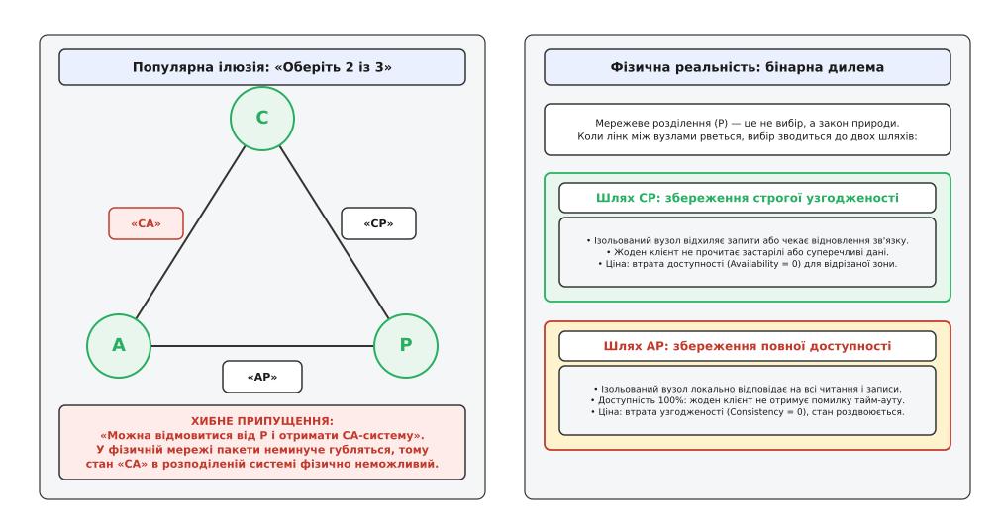
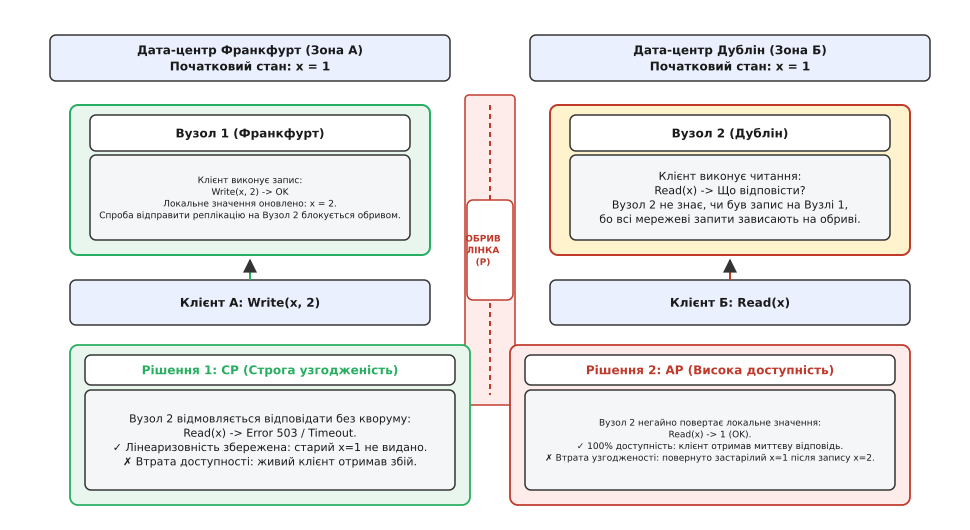
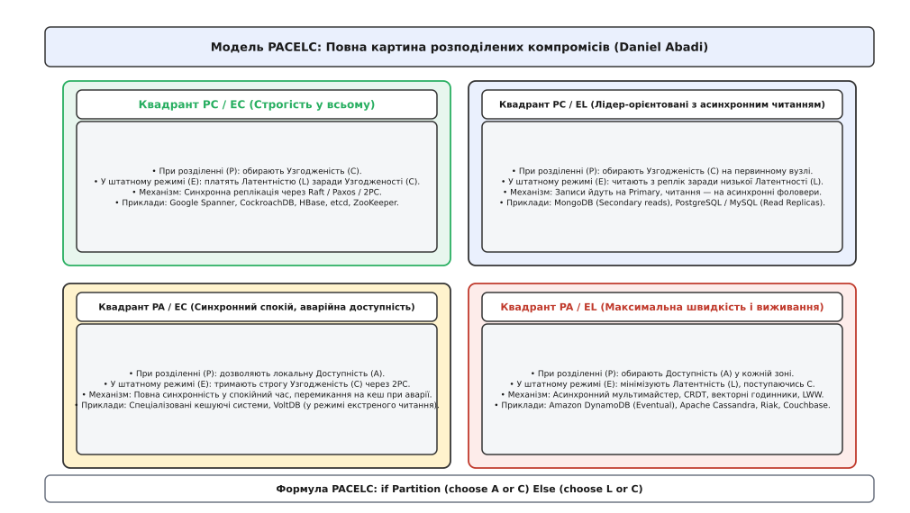
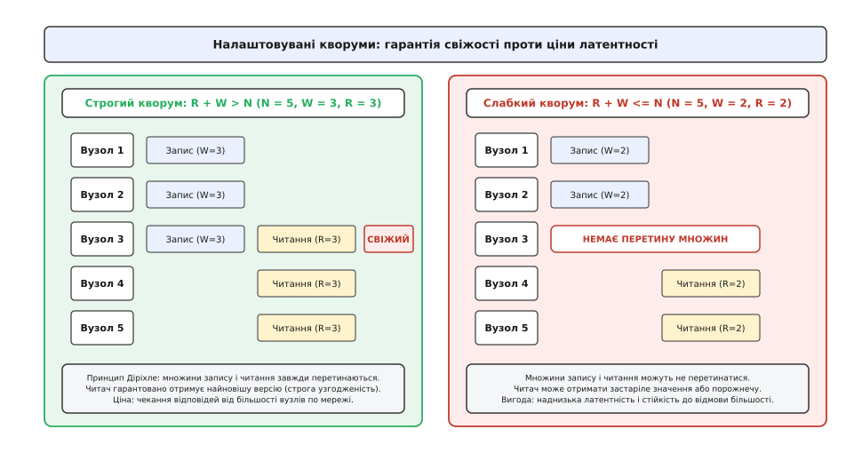

# CAP-теорема й компроміс PACELC

<preknowlist>
- [Омани розподілених обчислень](topic:programming/distributed-fallacies) — мережа затримує й губить пакети, а латентність зв'язку фізично обмежена швидкістю світла.
- [Лідер-фоловер реплікація](topic:programming/replication-leader-follower) — синхронна й асинхронна передача журналу оновлень між репліками.
- [Таймаути й бюджет часу](topic:programming/timeouts-deadlines) — спливання таймауту є суб'єктивним рішенням спостерігача за умов неповноти інформації.
- [Кворуми](topic:programming/quorum-and-leaderless) — правило перетину більшостей для узгодження стану без виділеного лідера.
- [Failover і розщеплення мозку](topic:programming/split-brain) — небезпека паралельного існування двох центрів ухвалення рішень під час розриву зв'язку.
</preknowlist>

У системі продажу квитків на футбольний фінал залишається рівно одне вільне місце в секторі VIP (`місце #1042`). Сервери сервісу розгорнуті у двох географічно віддалених дата-центрах: один працює у Франкфурті, інший — у Дубліні. О 10:00:00.000 уболівальник у Франкфурті натискає кнопку «Оплатити квиток #1042». За п'ять мілісекунд, о 10:00:00.005, інший покупець у Дубліні відкриває сторінку того самого матчу й натискає «Придбати квиток #1042».

Рівно за мить до цього якір вантажного судна на дні Ірландського моря розриває магістральний оптоволоконний кабель. Усі мережеві пакети між Франкфуртом і Дубліном починають безповоротно зникати в комутаторах провайдера.

Франкфуртський сервер списує кошти першого покупця, локально фіксує місце #1042 як зайняте й надсилає повідомлення про зміну стану до Дубліна. Повідомлення зникає на обриві кабелю. Коли дублінський сервер отримує запит від другого покупця, він намагається звернутися до Франкфурта для підтвердження актуального статусу крісла, але сокет мовчить, черги TCP переповнюються, а таймер зворотного відліку наближається до таймауту.

Дублінський сервер опиняється перед неминучим вибором без правильної відповіді:
1. **Відмовити дублінському покупцю:** зафіксувати спливання таймауту й повернути системну помилку HTTP 503 «Сервіс тимчасово недоступний». Система зберігає строгу узгодженість (жодне зайняте місце не буде продано двічі), але втрачає доступність: повністю справний дублінський сервер відмовляє в обслуговуванні платоспроможному клієнту.
2. **Продати квиток дублінському покупцю:** відповісти «Успішно оплачено», опираючись на свій локальний знімок даних, де місце ще позначене як вільне. Система зберігає 100% доступність, але руйнує узгодженість: на стадіон із двома дійсними квитками на одне й те саме крісло прийдуть двоє людей, що спричинить юридичний скандал і фінансові збитки.

Це протиріччя не є наслідком поганого програмного коду, помилок у налаштуванні операційної системи чи невдалого вибору фреймворку. Воно є фундаментальним фізичним законом розподілених обчислень, відомим як **теорема CAP**.

## Анатомія трикутника: що стверджує CAP і чому трикутник вводить в оману

Назву теореми утворено від перших літер трьох фундаментальних характеристик розподіленого сховища:
- **Consistency (узгодженість, консистентність, від лат. *consistere* — стояти разом, узгоджуватись):** кожен клієнт під час читання завжди отримує результат останнього успішного запису або явну помилку. Усі вузли кластера в будь-який момент часу виглядають для зовнішнього спостерігача як єдиний неподільний комп'ютер.
- **Availability (доступність, від лат. *habilis* — зручний, придатний):** кожен справний (незакритий) вузол кластера зобов'язаний повернути успішну, ненульову відповідь на будь-який отриманий запит читання чи запису без блокування на нескінченний час.
- **Partition Tolerance (стійкість до розділення, від лат. *partitio* — поділ, розчленування):** здатність кластера продовжувати функціонувати навіть тоді, коли довільна кількість мережевих повідомлень між вузлами губиться або затримується через фізичні обриви каналів чи збої комутаторів.


*Популярна концепція вибору двох властивостей із трьох є фізично неможливою: оскільки мережеві розділення неминучі, вибір зводиться до дилеми між узгодженістю (CP) та доступністю (AP) під час аварії.*

Упродовж багатьох років в індустрії побутувала наївна ілюстрація теореми у вигляді трикутника з вершинами C, A, P, під яким ставили маркетинговий слоган: «Оберіть будь-які два з трьох: CA, CP або AP».

Ця інтерпретація є принципово хибною та шкідливою для інженерного проектування. Вона створює небезпечну ілюзію, ніби архітектор програмного забезпечення може обрати варіант **CA** (узгодженість і доступність), свідомо відмовившись від **P** (стійкості до розділення).

Відмовитися від стійкості до розділення у розподіленій системі фізично неможливо:
- Оптоволоконні магістралі регулярно пошкоджуються під час дорожніх чи підводних робіт.
- Трансивери оптичних комутаторів зазнають деградації лазера й починають односпрямовано скидати пакети.
- Комутатори Top-of-Rack зазнають переповнення буферів пам'яті через спалахи трафіку (англ. *microbursts*) і скидають черги TCP.
- Сервери застигають на десятки секунд під час пауз збирання сміття у віртуальних машинах Java або Go (англ. *Stop-the-World GC pauses*), що з погляду сусідніх вузлів виглядає як повна втрата мережевої зв'язності.
- Маршрутизація протоколу BGP між автономними системами зазнає коливань (англ. *BGP flapping*), розриваючи міжрегіональні канали на хвилини.

Мережеве розділення — це не пункт у конфігураційному файлі, який можна вимкнути, а фізична властивість реального світу. Єдиний спосіб отримати справжню систему «CA» — це розмістити всю базу даних на одному-єдиному фізичному сервері без мережі. Але щойно в архітектурі з'являється другий сервер і мережевий кабель між ними, система **зобов'язана** мати справу з розділеннями.

Тому реальне формулювання теореми CAP є суворо бінарним:

> За наявності мережевого розділення (Partition) розподілена система зобов'язана обрати рівно один із двох шляхів: або зберегти строгу узгодженість, пожертвувавши доступністю (**CP**), або зберегти доступність, пожертвувавши узгодженістю (**AP**).

Як виникла ця концепція, як вона подолала спротив класичної школи реляційних баз даних і чому спричинила бум NoSQL-сховищ, докладно викладено в [історії формулювання та еволюції CAP](topic:programming/cap-theorem/hist-cap-origins.md).

## Формалізація Гілберта і Лінч: точні математичні межі

Початкове формулювання, запропоноване Еріком Брюером у 2000 році, було інтуїтивною евристичною здогадкою. Через неформальність термінів академічна спільнота тривалий час ставила твердження під сумнів. У 2002 році дослідники Массачусетського технологічного інституту (MIT) Сет Гілберт і Ненсі Лінч опублікували суворе математичне доведення теореми, давши однозначні визначення кожному поняттю.

### Що таке Consistency за Гілбертом і Лінч?
В академічному доведенні термін Consistency означає виключно **лінеаризовність** (англ. *Linearizability*, або атомарну узгодженість у сенсі Герліхі та Вінга, 1990).

Лінеаризовність вимагає виконання двох суворих умов:
1. Кожна операція повинна здаватися виконаною миттєво в точці лінеаризації між моментом її виклику клієнтом `t_start` та моментом отримання відповіді `t_finish`.
2. Якщо операція запису `Write(v)` успішно завершилася в абсолютному фізичному часі раніше, ніж будь-який клієнт у будь-якій точці планети розпочав операцію читання `Read()`, то це читання зобов'язане повернути значення `v` або ще новіше значення наступного запису:

```
t_finish(Write(v)) < t_start(Read()) ⇒ val(Read()) = v
```

Це найсуворіша модель консистентності з усіх існуючих. Вона виключає будь-яке читання застарілих даних, навіть якщо затримка становить одну мікросекунду.

### Що таке Availability за Гілбертом і Лінч?
Доступність у математичному сенсі теореми CAP означає, що **кожен незакритий (справний) вузол кластера зобов'язаний повернути успішну відповідь на кожен отриманий запит**.

Важливо підкреслити суворість цього критерію:
- Відповідь із кодом помилки HTTP 500, HTTP 503 або системною помилкою бази даних `TransactionAbortedException` вважається **відмовою в доступності**.
- Зависання запиту на необмежений час таймауту вважається **відмовою в доступності**.
- Якщо 99 із 100 серверів відповіли успішно, але один ізольований сервер відповів помилкою на запит підключеного до нього клієнта, система формально вважається **недоступною** (Availability = 0).


*При обриві зв'язку запис на вузлі 1 не може бути доставлений до вузла 2. Читання на вузлі 2 або повертає помилку (CP), зберігаючи лінеаризовність, або повертає старий стан x=1 (AP), втрачаючи узгодженість.*

### Математичний механізм доведення
Доведення Гілберта і Лінч спирається на нерозрізненність локальних станів ізольованих вузлів.

Нехай кластер розбито на дві ізольовані групи: `G₁` та `G₂`. Клієнт записує `x = 2` на вузол у групі `G₁`. Вузол у `G₁` зобов'язаний відповісти `OK` за скінченний час (вимога доступності). Але жоден пакет від `G₁` не може досягти `G₂` через розрив зв'язку.

Якщо після цього інший клієнт надсилає запит на читання `x` до вузла в групі `G₂`, цей вузол не має жодного способу дізнатися, чи відбувався запис у групі `G₁`. Його локальний стан ідентичний стану системи, у якій запису взагалі не було.

Якщо вузол у `G₂` поверне відповідь клієнту, він поверне старе значення `x = 1`, грубо порушивши лінеаризовність. Якщо ж він відмовиться відповідати або чекатиме на відновлення мережі, він порушить доступність.

Покрокове виведення теореми через автомати введення-виведення, аналіз імовірнісних протоколів та частково синхронних мереж наведено у [формальному математичному доведенні теореми Гілберта — Лінч](topic:programming/cap-theorem/math-gilbert-lynch.md).

## Спектр моделей консистентності: що дозволено під час розділення

Теорема CAP стверджує неможливість лінеаризовності (строгої консистентності) разом із доступністю. Проте консистентність не є бінарним вимикачем «все або нічого». Між абсолютною лінеаризовністю та повним хаосом існує неперервний спектр моделей узгодженості:

```
Строгі (неможливі в AP)       Слабкі (досяжні в AP)
Linearizable ──> Sequential ──> Causal ──> Read-Your-Writes ──> Monotonic Reads ──> Eventual
```

1. **Лінеаризовність (Linearizability):** операції впорядковані за абсолютним фізичним годинником реального часу. Потребує CP.
2. **Послідовна узгодженість (Sequential Consistency):** усі вузли бачать однакову послідовність операцій, але вона не прив'язана до абсолютного фізичного часу. Також неможлива в системі з повною AP-доступністю під час розділення.
3. **Причинна узгодженість (Causal Consistency):** операції, пов'язані причинно-наслідковим зв'язком (як-от відповідь на повідомлення в чаті), упорядковані однаково для всіх клієнтів. Конкурентні операції (не пов'язані між собою) можуть спостерігатися в різному порядку. **Фундаментальний результат (Mahajan et al., 2011):** причинна узгодженість є найсильнішою моделлю узгодженості, яку теоретично можливо реалізувати в повністю доступній системі (AP) під час розділення мережі.
4. **Сесійні гарантії (Session Guarantees):**
   - *Read-Your-Writes:* користувач завжди бачить власні оновлення.
   - *Monotonic Reads:* користувач ніколи не бачить відкату часу назад при повторних читаннях.
5. **Кінцева узгодженість (Eventual Consistency):** найслабша гарантія. Якщо нові записи припиняються, усі репліки колись у майбутньому зійдуться до однакового стану.

## Світ за межами аварій: чому з'явилася теорема PACELC

Теорема CAP має суттєвий практичний недолік: вона описує поведінку розподіленої системи виключно в момент **аварії** — коли мережа вже розділена.

Проте в сучасних хмарних дата-центрах (AWS, Google Cloud, Azure) магістральні канали зв'язку залишаються справними `99.9%` часу або навіть більше. Що відбувається в розподіленій системі протягом цих `99.9%` штатного часу, коли жодного розділення немає?

У 2012 році професор Єльського університету Даніель Абаді сформулював розширення, яке усунуло цю білу пляму, — **теорему PACELC**.

Абаді довів, що в штатному режимі розподілена система стикається з не менш суворим компромісом: **між латентністю (Latency) та узгодженістю (Consistency)**.

### Фізична природа латентності
Швидкість поширення світла у вакуумі становить `300 000` км/с, а в оптоволоконному склі — приблизно `200 000` км/с (200 км на кожну мілісекунду). З урахуванням маршрутизації в комутаторах затримка туди-назад (Round-Trip Time, RTT) становить:
- Між зонами доступності в одному місті: `1–2` мс.
- Між Франкфуртом і Дубліном: `15–20` мс.
- Між Франкфуртом і Сінгапуром: `160–180` мс.

Якщо система вимагає абсолютної узгодженості (лінеаризовності), операція запису у Франкфурті не може повернути клієнту підтвердження, доки дані не будуть синхронно скопійовані на репліку в Сінгапурі. Кожна транзакція запису неминуче сплачує затримку щонайменше в `160` мс.

Якщо ж бізнес вимагає надшвидкого відгуку (наприклад, `5` мс на запит), система зобов'язана зафіксувати запис локально у Франкфурті й відпустити клієнта, відправивши реплікацію до Сінгапуру асинхронно у фоні. Але впродовж наступних `160` мс будь-який клієнт у Сінгапурі читатиме застарілі дані.

### Формула PACELC
Абревіатура розшифровується як логічне правило:

```
if Partition (P):
    choose between Availability (A) and Consistency (C)
else (E):
    choose between Latency (L) and Consistency (C)
```

> **PACELC:** Якщо сталося розділення мережі (**P**), оберіть між доступністю (**A**) та узгодженістю (**C**); інакше (**E**), у штатному режимі, оберіть між низькою латентністю (**L**) та строгою узгодженістю (**C**).


*Повна класифікація розподілених сховищ за Даніелем Абаді: поведінка під час мережевого розділення (вісь X) та ціна латентності у штатному режимі (вісь Y).*

## Класифікація сучасних сховищ за моделлю PACELC

Модель PACELC ділить усі розподілені бази даних на чотири чіткі квадранти:

### 1. Квадрант PC / EC (Строгість за будь-яку ціну)
- **При розділенні (P):** обирають Узгодженість (**C**), ізольована меншість відхиляє запити.
- **У штатному режимі (E):** платять Латентністю (**L**) заради Узгодженості (**C**), застосовуючи синхронну реплікацію через Raft або Paxos.
- **Представники:** Google Cloud Spanner, CockroachDB, Apache HBase, etcd, Apache ZooKeeper.
- **Сфера застосування:** банківські транзакції, облік складських залишків, керування конфігурацією та розподілені замки.

### 2. Квадрант PA / EL (Максимальна швидкість і виживання)
- **При розділенні (P):** обирають Доступність (**A**), приймаючи читання й записи у кожній відрізаній зоні.
- **У штатному режимі (E):** мінімізують Латентність (**L**), повертаючи відповіді з локальної пам'яті за частки мілісекунди й реплікуючи дані асинхронно.
- **Представники:** Amazon DynamoDB (у режимі Eventual Consistency), Apache Cassandra, Riak, Couchbase.
- **Сфера застосування:** лічильники переглядів, кошики інтернет-магазинів, стрічки активності користувачів, збір телеметрії з IoT-пристроїв.

### 3. Квадрант PC / EL (Лідер із швидкими асинхронними репліками)
- **При розділенні (P):** обирають Узгодженість (**C**) на головному вузлі (Primary). Якщо Primary ізольований, він перестає приймати записи.
- **У штатному режимі (E):** клієнти спрямовують читання на асинхронні фоловери заради наднизької Латентності (**L**), погоджуючись читати з затримкою реплікації (Replication Lag).
- **Представники:** MongoDB (за конфігурації за замовчуванням: Primary writes, Secondary reads), кластери PostgreSQL / MySQL із пулом асинхронних реплік для читання.
- **Сфера застосування:** веб-додатки з переважанням читання над записом, де припустиме короткочасне відставання оновлення профілю користувача.

### 4. Квадрант PA / EC (Синхронний спокій, аварійна доступність)
- **При розділенні (P):** дозволяють аварійну локальну Доступність (**A**), обслуговуючи читання з локального кешу.
- **У штатному режимі (E):** тримають строгу синхронну Узгодженість (**C**) між усіма серверами через двофазну фіксацію.
- **Представники:** спеціалізовані фінансові платформи, розподілені кешуючі шари з аварійним перемиканням на локальний знімок.
- **Сфера застосування:** системи, які вимагають абсолютної точності в робочий час, але повинні забезпечувати довідкову інформацію клієнтам під час глобальних аварій магістралі.

## Налаштовувана узгодженість і кворуми

Багато сучасних розподілених баз даних (Cassandra, ScyllaDB, DynamoDB, MongoDB) відмовилися від жорсткої фіксації в одному квадранті й дозволяють розробнику обирати положення на спектрі PACELC **індивідуально для кожного запиту**.

### Механізм кворумів у Cassandra та DynamoDB
Механізм налаштовуваної узгодженості спирається на три параметри:
- `N` (Replication Factor) — загальна кількість реплік, на яких зберігається кожен ключ.
- `W` (Write Consistency Level) — кількість реплік, які повинні успішно записати дані й надіслати квитанцію, перш ніж запис буде визнано завершеним.
- `R` (Read Consistency Level) — кількість реплік, які опитуються під час читання перед поверненням результату клієнту.


*При R + W > N множини запису та читання гарантовано містять щонайменше один спільний вузол, який повертає найсвіжішу версію запису. При R + W ≤ N читач може опитувати вузли, які не бачили останнього запису.*

### Математичне правило кворуму
Строга узгодженість (Strong Consistency) досягається тоді й лише тоді, коли множини реплік запису та читання мають непустий перетин. За принципом Діріхле для цього необхідне виконання нерівності:

```
R + W > N
```

Розглянемо типовий кластер із фактором реплікації `N = 5`:

#### 1. Строгий кворум: W = 3, R = 3
`W + R = 3 + 3 = 6 > 5`. Будь-яка трійка вузлів запису і будь-яка трійка вузлів читання мають щонайменше один спільний вузол. Координатор читання порівнює мітки версій і гарантовано повертає клієнту найсвіжіший стан.
- **Ціна латентності:** запис і читання вимагають очікування відповідей від 3 серверів.

#### 2. Оптимізація запису: W = 1, R = 5
`W + R = 1 + 5 = 6 > 5`. Запис виконується миттєво (`0` мс додаткової затримки), але читання стає вкрай дорогим і повільним, оскільки вимагає одностайної відповіді від усіх 5 вузлів. Відмова одного вузла блокує всі операції читання.

#### 3. Слабкий кворум: W = 1, R = 1
`W + R = 1 + 1 = 2 ≤ 5`. Запис і читання працюють із наднизькою затримкою (`0` мс мережевих раундів), але система гарантує лише кінцеву узгодженість (Eventual Consistency): клієнт може прочитати старий стан.

### Налаштування узгодженості в MongoDB
У MongoDB положення на матриці PACELC контролюється комбінацією двох параметрів драйвера:
- `Write Concern` (`w: 1` — підтвердження лише від Primary [PA/EL]; `w: "majority"` — підтвердження від більшості реплік [PC/EC]).
- `Read Concern` (`"local"` — читання з локальної пам'яті репліки; `"majority"` — читання даних, зафіксованих більшістю; `"linearizable"` — читання з перевіркою чинності лідера через кворумний раунд).

Як самостійно змоделювати ці сценарії, виміряти затримки та відтворити поведінку під час ін'єкції аварії мережі, показано в практичному матеріалі — [програмний симулятор налаштовуваної узгодженості та латентності](topic:programming/cap-theorem/proj-tunable-consistency.md).

## Життєвий цикл розділення мережі: що відбувається після відновлення зв'язку

Мережеве розділення ніколи не триває вічно. Рано чи пізно оптичний кабель зварюють, комутатор перезавантажується, а правила iptables очищуються.

Справжня складність проектування розподілених систем полягає не стільки у виборі між CP та AP під час аварії, скільки в **процедурі примирення (Reconciliation)** після зростання зв'язку.

### 1. Поведінка в CP-системі після злиття
У системі класу CP (Raft / Paxos) ізольована меншість відмовлялася приймати записи під час розділення. Коли зв'язок відновлюється:
- Ізольовані вузли виявляють, що їхній терм (Term) або епоха лідерства застаріли.
- Вони скидають непідтверджені локальні логи й перекачують актуальний транзакційний журнал із лідера більшості.
- Дані залишаються 100% цілісними без необхідності ручного втручання.

### 2. Поведінка в AP-системі після злиття
У системі класу AP обидві ізольовані половини продовжували приймати записи від користувачів. Після з'єднання лінка в системі виявляються конфліктні записи одного й того самого ключа з однаковими або паралельними версіями.

Кластер зобов'язаний розв'язати конфлікт одним із механізмів:
1. **Last-Write-Wins (LWW):** порівняння фізичних міток часу NTP і збереження пізнішого запису. Небезпечно: дрейф годинників між серверами призводить до тихого затирання важливих транзакцій.
2. **Векторні годинники (Vector Clocks):** система зберігає обидві гілки історії як «сіблінги» (англ. *siblings*) і делегує злиття клієнтському коду або показує конфлікт користувачеві.
3. **CRDT (Conflict-free Replicated Data Types):** автоматичне детерміноване злиття на основі математичних напівґраток.

## Як консенсус підтримує інваріант CP: межі Raft і Paxos

Для забезпечення строгої узгодженості (CP) розподілені системи застосовують алгоритми консенсусу (Raft, Multi-Paxos). Механізм консенсусу спирається на три фундаментальні правила:

1. **Неподільна більшість (Strict Majority):** будь-яке рішення (обрання лідера або фіксація запису в лог) вимагає згоди строгої більшості вузлів:

```
Q = ⌊N / 2⌋ + 1
```

2. **Монотонні терми лідерства (Term / Epoch):** кожен раунд виборів має унікальний номер терму. Вузол із меншим термом автоматично втрачає право координувати записи, щойно отримує повідомлення з вищим термом.
3. **Захист від фантомного лідера (Leader Lease & ReadIndex):** перш ніж відповісти на запит читання, чинний лідер зобов'язаний або перевірити свій кворум через раунд легковажних серцебиттів (ReadIndex), або спиратися на гарантований часовий інтервал лізи (Leader Lease).

Якщо в кластері з 5 вузлів стається розділення на групи `{2 вузли}` та `{3 вузли}`:
- Група з трьох вузлів (більшість) продовжує успішно обирати лідера, фіксувати транзакції та обслуговувати клієнтів.
- Група з двох вузлів (меншість) не може набрати необхідні 3 голоси для кворуму. Усі спроби запису та лінеаризовного читання в цій зоні блокуються або відхиляються з помилкою.
- **Ціна моделі CP:** доступність системи зберігається лише доти, доки працює більшість вузлів (`N_failed ≤ ⌊(N - 1) / 2⌋`). При втраті більшості кластер повністю припиняє обробку запитів на зміну стану.

## Практична деградація в мікросервісах: концепція Harvest проти Yield

У складних сервіс-орієнтованих архітектурах компроміс CAP часто вирішують не на рівні єдиної бази даних, а на рівні **деградації бізнес-функцій** (концепція Harvest and Yield, сформульована Фоксом і Брюером):

1. **Yield (доступність бізнес-процесу):** частка користувацьких запитів, на які сервіс зміг завершити базовий сценарій.
2. **Harvest (повнота даних):** частка допоміжних сервісів і даних, які вдалося задіяти під час формування відповіді.

Під час мережевого розділення між мікросервісами замість повернення системної помилки HTTP 503 (втрата Yield) сучасні платформи (Netflix, Amazon, Uber) застосовують вибіркову деградацію Harvest:
- **Інтернет-магазин:** якщо сервіс персоналізованих рекомендацій відрізаний мережевим збоєм, сторінка товару завантажується зі статичним списком популярних товарів або без блоку рекомендацій взагалі. Основна кнопка «Купити» залишається доступною (Yield = 100%, Harvest = 85%).
- **Стримінговий сервіс:** якщо сервіс обліку історії переглядів недоступний, відеопотік запускається без збереження поточної секунди зупинки, замість повної відмови в перегляді фільму.
- **Поїздки на таксі:** під час обриву зв'язку мобільний додаток водія зберігає GPS-координати поїздки в локальному сховищі SQLite на смартфоні й надсилає їх на сервер пачкою після відновлення зв'язку (AP-модель із компенсаційним розрахунком вартості).

## Підступні крайові випадки промислових мереж

У реальних дата-центрах мережеві збої рідко бувають простим і чистим розрізанням кластера на дві рівні половини. Найбільшу небезпеку становлять складні аномалії:

### 1. Асиметричне розділення (Asymmetric Partition)
Вузол `A` успішно відправляє пакети до вузла `B`, але зворотні пакети від `B` до `A` губляться (наприклад, через збій одного напрямку оптичного волокна або помилку в правилах iptables). Вузол `A` вважає вузол `B` мертвим, тоді як `B` вважає `A` живим і справним. Якщо протокол вимагає двосторонньої згоди, система потрапляє в стан постійних конфліктних таймаутів.

### 2. Мерехтіння зв'язку (Flapping Link)
Канал зв'язку не вмирає остаточно, а періодично вмикається і вимикається кожні кілька секунд. Це спричиняє лавину постійних виборів лідера (англ. *election storm*): сервери безперервно скидають кеші, передають ролі та перезапускають реплікацію, що призводить до повного колапсу пропускної здатності як у CP-, так і в AP-системах.

### 3. Часткова деградація (Packet Loss 20–30%)
Мережа не розірвана, але через перевантаження буферів комутаторів 25% пакетів губляться. Стек TCP починає експоненціально збільшувати таймери повторної передачі (RTO), через що затримка викликів зростає з 1 мс до кількох секунд. CP-системи починають масово скидати кворуми за таймаутами, вважаючи живі сервери відмовленими.

## Як сучасні інженерні системи пом'якшують компроміси

Хоча теореми CAP і PACELC є абсолютними математичними законами, сучасна інженерія розробила витончені методи, що дозволяють мінімізувати їхню практичну ціну.

### 1. TrueTime у Google Cloud Spanner
Google Spanner є базою даних квадранта **PC/EC**, яка забезпечує строгу зовнішню узгодженість (External Consistency / Serializable ACID) у глобальному масштабі між дата-центрами на різних континентах.

Щоб мінімізувати затримку блокувань під час розподілених транзакцій, Google оснастив кожен дата-центр атомними годинниками (рубідієвими стандартами частоти) та GPS-приймачами. Програмний API **TrueTime** гарантує, що похибка між годинниками будь-яких двох серверів у світі не перевищує відомого вікна `ε` (зазвичай `ε ≈ 1–7` мс).

Для фіксації транзакції Spanner очікує інтервал часу `2ε` (англ. *commit wait*), гарантуючи, що мітка часу наступної транзакції буде строго більшою за мітку попередньої в абсолютному фізичному часі. Це не порушує теорему CAP, але звужує ціну узгодженості з сотень мілісекунд до лічених мілісекунд.

### 2. CRDT: безконфліктні репліковані типи даних
Для систем квадранта **PA/EL** найболючішою проблемою є злиття конфліктних записів після відновлення зв'язку.

Типи даних **CRDT** спираються на абстрактну алгебру (напівґратки / semilattices). Будь-які дві операції або стани над структурою даних є комутативними, асоціативними та ідемпотентними.

Завдяки цим властивостям розподілені лічильники (PN-Counters), множини додавання/видалення (OR-Sets) та спільні текстові документи (використовувані в Google Docs і Figma) збігаються до однакового стану автоматично, без необхідності блокувань і без втрати даних під час розділення мережі.

### 3. Поліглотна персистенція (Polyglot Persistence)
Зрілі архітектури ніколи не намагаються побудувати всю систему на одній базі даних:
- **Фінансовий облік, баланси, авторизаційні токени:** зберігаються у сховищах класу **PC/EC** (PostgreSQL з синхронною реплікацією, CockroachDB, Spanner).
- **Кошики покупців, сесії користувачів, аналітика кліків:** зберігаються у сховищах класу **PA/EL** (Cassandra, DynamoDB, Redis Cluster).

## Чекліст архітектора: як обирати модель для свого проекту

Перш ніж обирати базу даних чи налаштовувати рівні кворумів, дайте відповіді на чотири запитання:

```
+──────────────────────────────────────────────────────────────────────────+
| 1. Чи допускає бізнес-домен тимчасове читання застарілих даних?          |
|    • ТАК -> обирайте PA / EL (DynamoDB Eventual, Cassandra QUORUM/ONE).  |
|    • НІ  -> обирайте PC / EC (Spanner, CockroachDB, PostgreSQL Sync).     |
+──────────────────────────────────────────────────────────────────────────+
| 2. Що завдасть більших фінансових збитків під час аварії провайдера?     |
|    • Простій сервісу (HTTP 503) -> пріоритет Availability (AP).          |
|    • Продаж неіснуючого товару -> пріоритет Consistency (CP).            |
+──────────────────────────────────────────────────────────────────────────+
| 3. Яка географічна топологія розгортання?                                |
|    • Один дата-центр: затримка RTT < 1 мс -> ціна моделі EC мізерна.     |
|    • Мультирегіон (США - Європа - Азія): RTT > 150 мс -> синхронна       |
|      модель EC сповільнить кожен запис користувача.                      |
+──────────────────────────────────────────────────────────────────────────+
| 4. Яка природа операцій над даними?                                      |
|    • Сліпі перезаписи (Blind Writes) -> достатньо кворуму R + W > N.     |
|    • Модифікація з перевіркою (Read-Modify-Write / CAS) -> потрібен      |
|      повноцінний консенсус Raft / Paxos.                                 |
+──────────────────────────────────────────────────────────────────────────+
```

Теорема CAP та модель PACELC вчать головного інженерного принципу: у розподілених системах не існує ідеальних рішень — існують лише усвідомлені компроміси, розраховані під конкретні бізнес-ризики та фізичні обмеження мережі.

