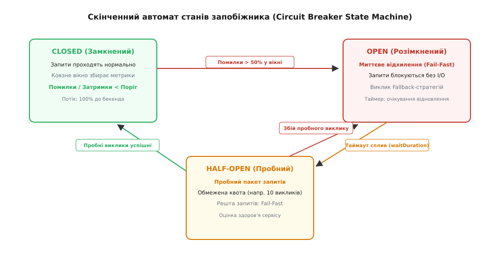
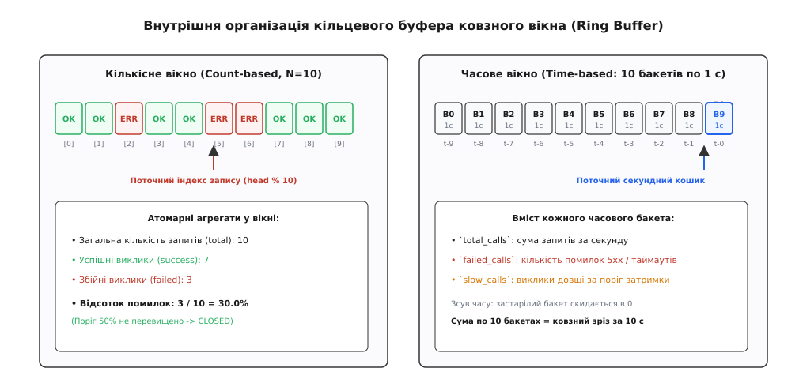
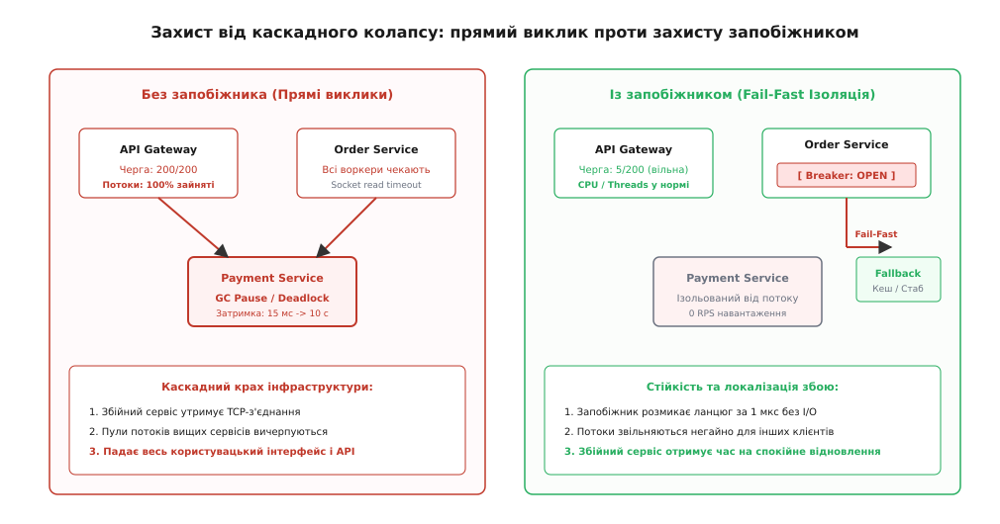

# Запобіжник

<preknowlist>
- [Вісім оман розподілених обчислень](topic:programming/distributed-fallacies) — часткова відмова, ненадійність мережі та відмінність RPC від локальних викликів.
- [Таймаути і бюджет часу](topic:programming/timeouts-deadlines) — запобігання нескінченному блокуванню потоків та визначення критерію завислого запиту.
- [Повторні спроби та експоненційний відступ](topic:programming/retries-backoff) — відновлення після тимчасових збоїв та небезпека шторму повторів.
- [Перебірки (bulkhead)](topic:programming/bulkhead-isolation) — ізоляція пулів потоків і семафорних квот для захисту спільних ресурсів.
</preknowlist>

У великому сервісі електронної комерції під час розпродажу «Чорної п'ятниці» вхідний шлюз обробляє 15 000 запитів на секунду. Для кожного замовлення сервіс оформлення покупок надсилає паралельний RPC-виклик до другорядного сервісу нарахування бонусних балів. На сервері бази даних бонусного сервісу трапляється блокування таблиці через важкий аналітичний звіт, через що час обробки одного запиту стрибає з 12 мілісекунд до 8500 мілісекунд. Клієнтські пули потоків сервісу замовлень мають ліміт у 200 робочих потоків вебсервера Tomcat. За 200 мілісекунд усі 200 потоків виявляються наглухо заблокованими у виклику читання сокета `read()`, очікуючи відповіді від бонусного сервісу. Черга вхідних запитів сервісу замовлень миттєво переповнюється, ядро операційної системи починає скидати нові TCP-з'єднання, перевірки працездатності (Kubernetes Liveness Probes) не отримують відповіді за 3 секунди, і оркестратор починає циклічно перезапускати абсолютно здорові поди сервісу замовлень. Протягом двох хвилин відмова другорядного бонусного сервісу знищує весь бізнес-процес покупки товарів, призводячи до мільйонних фінансових збитків.

Ця аварія розкриває фундаментальну властивість розподілених систем: **повільна відповідь залежності є на порядки небезпечнішою за її повне і миттєве падіння**. Миттєва помилка (наприклад, скидання з'єднання TCP RST або відмова у відкритті сокета `ECONNREFUSED`) вивільняє системні ресурси за мікросекунди; затримка ж утримує відкриті сокети, дескриптори файлів ядра, пам'ять стеків і потоки операційної системи, спричиняючи каскадний колапс усієї інфраструктури.

Архітектурний шаблон **запобіжника (англ. *circuit breaker*, від лат. *circuitus* — колообіг, обхід та давньоангл. *brecan* — ламати, розбивати)** розв'язує цю проблему: він відстежує стан віддаленої залежності і, коли відсоток збоїв чи затримок перевищує поріг, миттєво **розмикає ланцюг**, припиняючи виконання фізичних мережевих запитів і перемикаючи систему на аварійний захисний режим (Fail-Fast).

## Анатомія розподіленої катастрофи: фізика виснаження ресурсів

Щоб зрозуміти необхідність запобіжника, простежимо покроковий шлях вичерпання ресурсів операційної системи Linux на рівні ядра та прикладного процесу, коли залежний вузол починає деградувати за швидкістю відповіді:

1. **Зависання вводу-виводу (I/O Blocking):** робочий потік вебсервера надсилає HTTP-запит у вихідний сокет і переходить у стан блокуючого очікування `sys_read()` або опитування дескриптора `epoll_wait()`. Якщо таймаут читання сокета встановлено за замовчуванням у 30 секунд (типова помилка багатьох HTTP-клієнтів), потік застигає в пам'яті ядра на пів хвилини.
2. **Вичерпання пулу потоків (Thread Starvation):** за інтенсивності вхідного потоку 1000 запитів на секунду пул із 200 воркерів заповнюється за 200 мілісекунд. Нові вхідні запити більше не можуть отримати вільний потік для початку обробки.
3. **Переповнення черги очікування (Queue Saturation):** запити починають накопичуватися у внутрішній пам'яті черги завдань вебконтейнера (`TaskQueue`). Коли черга сягає ліміту (наприклад, 1000 завдань), процес починає відмовляти у прийомі нових завдань, а час затримки черги додається до часу виконання навіть тих запитів, які не мають жодного стосунку до збійного сервісу.
4. **Переповнення черги сокетів ядра Linux (`listen backlog`):** нові TCP-з'єднання від клієнтів потрапляють у чергу `TCP_SYN_RECV` та чергу готових з'єднань `accept()`. Коли черга переповнюється, ядро починає ігнорувати пакети `SYN` або повертати `SYN-ACK` із затримкою, викликаючи масові таймаути на балансувальниках навантаження.
5. **Ефект доміно для оркестратора (Cascading Restarts):** системні проби Kubernetes (`/healthz` або `/readyz`), що опитують HTTP-ендпоінт контейнера, самі стають у переповнену чергу воркерів. Не отримавши відповіді за відведені 2 секунди, Kubernetes робить висновок, що под завис, і примусово надсилає сигнал `SIGKILL`. Перезапуск подів лише погіршує ситуацію: холодний старт вимагає часу на ініціалізацію JVM/рантайму, а хвиля накопиченого трафіку миттєво вбиває щойно створені контейнери.

Запобіжник запобігає цій катастрофі на найпершому кроці: він відсікає виклик за частки мікросекунди всередині клієнтського процесу ще до того, як буде виділено мережевий сокет або заблоковано потік операційної системи.

## Фізична аналогія та її межі

Термін «Circuit Breaker» запозичено з електротехніки. Автоматичний вимикач (електричний запобіжник) у квартирному щитку встановлюється послідовно в електричне коло для захисту мідної проводки від перегріву та займання. Коли сила струму перевищує допустиму межу (унаслідок короткого замикання або перевантаження приладами), біметалева пластина вигинається від тепла, механічний контакт розмикається, і подача струму припиняється за кілька мілісекунд, рятуючи будинок від пожежі.

Проте програмний запобіжник суттєво відрізняється від свого електричного предка в чотирьох фундаментальних аспектах:

1. **Критерій спрацьовування:** електричний вимикач спрацьовує на миттєве перевищення фізичної сили струму (ампер); програмний запобіжник аналізує **статистичну частку помилок і повільних відповідей** у ковзному вікні часу або викликів.
2. **Самовідновлення:** електричний автомат після розмикання вимагає фізичного втручання людини (підняття важеля); програмний запобіжник є **автономним адаптивним автоматом станів**, який самостійно вичікує інтервал відновлення і зондує залежність пробними запитами.
3. **Реакція на розмикання:** електричне коло просто знеструмлюється; програмний запобіжник виконує **аварійну деградацію (Fallback)** — повертає заздалегідь заготовлені дані, читає локальний кеш або відправляє завдання у чергу асинхронної обробки.
4. **Ступінь проникності:** електричний вимикач є суто бінарним (або проводить 100% струму, або 0%); програмний запобіжник має проміжний напівпровідний стан `HALF-OPEN`, що діє як регульований дросель, пропускаючи тонкий цівковий потік тестових запитів.

## Скінченний автомат станів (State Machine)

Запобіжник функціонує як детерміністичний скінченний автомат із трьома базовими станами та двома спеціальними режимами операційного управління.


*Скінченний автомат станів запобіжника: переходи між станами CLOSED, OPEN та HALF-OPEN на основі порогів статистики, таймера відновлення та результатів пробних викликів.*

### 1. Стан CLOSED (Замкнений)

У нормальному режимі запобіжник перебуває у стані **CLOSED (замкнений)**. Усі прикладні виклики безперешкодно транслюються через мережу до віддаленої служби.

Під час проходження викликів запобіжник фіксує результати виконання (успіх, помилка 5xx, вичерпання таймауту або перевищення порогу затримки) у ковзному вікні метрик. Якщо за умови накопичення мінімального обсягу викликів (`minimumNumberOfCalls`) розрахований відсоток збоїв перевищує встановлений поріг (`failureRateThreshold`, зазвичай 50%), автомат негайно здійснює перехід у стан `OPEN`.

### 2. Стан OPEN (Розімкнений)

Після переходу в стан **OPEN (розімкнений)** запобіжник повністю блокує прямі мережеві звернення до віддаленого сервісу.

Усі вхідні виклики миттєво перериваються за схемою **швидкої відмови (англ. *fail-fast*, від лат. *fallere* — зникати, обманювати)**:
* Клієнтський потік не чекає на відкриття TCP-сокета чи читання даних; час виконання методу становить частки мікросекунди.
* Якщо розробник налаштував аварійну заглушку (`fallback`), виконується альтернативна локальна логіка. Якщо заглушки немає, клієнт негайно отримує виняток `CallNotPermittedException` (або HTTP `503 Service Unavailable`).
* Одночасно запускається внутрішній монотонний таймер сну (`waitDurationInOpenState`, наприклад 60 секунд). Поки цей таймер активний, збійний бекенд повністю ізольований від навантаження, що дає йому змогу завершити скидання з'єднань, провести збирання сміття чи перезапуститися.

### 3. Стан HALF-OPEN (Напіврозімкнений / Пробний)

Коли таймер очікування в стані `OPEN` спливає, запобіжник переходить у стан **HALF-OPEN (напіврозімкнений)**. Це фаза зондування та оцінки здоров'я реабілітованої залежності.

У стані `HALF-OPEN` запобіжник формує обмежену квоту пробних викликів (`permittedNumberOfCallsInHalfOpenState`, наприклад, 10 викликів):
* Перші 10 запитів, що надходять від клієнтів, отримують дозвіл на реальне мережеве виконання.
* Усі інші паралельні запити, що надходять понад цю квоту, продовжують відхилятися за схемою fail-fast.
* Якщо всі 10 пробних викликів (або їхня частка, що задовольняє пороговий критерій) завершуються успішно, запобіжник вважає залежність повністю відновленою і переходить у стан `CLOSED`, очищуючи статистику ковзного вікна.
* Якщо ж серед пробних викликів фіксується повторний збій, запобіжник миттєво повертається в стан `OPEN` і перезапускає таймер очікування (часто зі збільшеним інтервалом).

### Спеціальні стани: DISABLED та FORCED_OPEN

У промисловій експлуатації виникає потреба в ручному управлінні поведінкою запобіжника черговими інженерами:
* **DISABLED (Вимкнений):** автомат примусово вимикає захисну логіку; усі запити проходять до бекенда незалежно від помилок. Використовується для тестування або тимчасового обходу захисту.
* **FORCED_OPEN (Примусово розімкнений):** автомат блокує 100% трафіку до віддаленої служби без жодних переходів у `HALF-OPEN`. Застосовується під час планового обслуговування бекенда (Maintenance Window) або за відомої глобальної аварії в стороннього провайдера.

## Механіка ковзного вікна: кількісне проти часового

Точність та швидкість реакції запобіжника визначаються алгоритмом організації пам'яті його ковзного вікна (Sliding Window).


*Організація пам'яті ковзного вікна: кількісний кільцевий буфер фіксованого розміру проти часового вікна з круговими секундними бакетами.*

### 1. Кількісне ковзне вікно (Count-based Sliding Window)

Кількісне вікно зберігає результати останніх `N` викликів (наприклад, `N = 100`) у кільцевому буфері (Ring Buffer).
* Кожен новий результат записується за циклічним індексом `head_index % N`.
* Буфер зберігає бінарні прапорці успіху чи невдачі, або компактні бітові маски.
* При високій інтенсивності трафіку кількісне вікно адаптується миттєво: 100 помилок при 10 000 RPS надійдуть за 10 мілісекунд, і запобіжник розімкнеться майже миттєво.
* Проте при низькому або нерівномірному трафіку кількісне вікно страждає від «ефекту застарілої пам'яті»: якщо сервіс збирав 100 запитів протягом трьох годин, збій, що стався дві години тому, продовжуватиме враховуватися в розрахунках.

### 2. Часове ковзне вікно (Time-based Sliding Window)

Часове вікно оцінює статистику за фіксований проміжок часу `T` (наприклад, останні 60 секунд).
* Для запобігання неконтрольованому зростанню пам'яті період `T` ділиться на `K` рівних часових кошиків (бакетів) тривалістю `Δt = T / K` (наприклад, 10 бакетів по 6 секунд, або 60 бакетів по 1 секунді).
* Кожен бакет містить два лічильники: загальну кількість викликів та кількість збоїв за свій секундний квант.
* Коли час зміщується вперед, найстаріший бакет обнуляється і перезаписується новими даними.
* Часове вікно ідеально підходить для сервісів із добовими коливаннями навантаження, оскільки старі помилки автоматично вимиваються з пам'яті після завершення вікна.

Математичні моделі дисперсії оцінок збоїв, розрахунок довірчих інтервалів, обчислення ймовірностей помилкового спрацьовування та порівняння з експоненційним згладжуванням EWMA наведено у вставці [🧮 Статистика ковзного вікна та ймовірнісні оцінки збоїв у запобіжниках](topic:programming/circuit-breaker-pattern/math-sliding-window-statistics.md).

## Відстеження повільних викликів (Slow Call Thresholds)

Класичні реалізації запобіжників реагували виключно на явні помилки (винятки, статуси `5xx`). Проте на практиці найтяжчі аварії спричинені сервісами, які повертають статус `200 OK`, але роблять це із затримкою у 5–10 секунд.

Сучасні запобіжники реалізують двовимірний критерій розмикання:
1. **Відсоток відвертих збоїв (`failureRateThreshold`):** частка викликів, що завершилися мережевим розривом, винятком або HTTP 5xx.
2. **Відсоток повільних викликів (`slowCallRateThreshold`):** частка викликів, час виконання яких перевищив поріг `slowCallDurationThreshold`.

Якщо час виконання 60% запитів перевищує 1.5 секунди (при нормальному базовому часі 30 мс), запобіжник розмикає ланцюг, навіть якщо жоден виклик формально не завершився кодом помилки. Це рятує клієнтські пули потоків від виснаження ще до того, як віддалений бекенд почне падати під лавиною застряглих з'єднань.

## Локалізація аварій та каскадні ланцюги

Головна функція запобіжника у мікросервісній топології полягає у **локалізації радіуса ураження (Blast Radius)**. Без запобіжника навіть локальний збій бази даних викликає ланцюгову деградацію всієї вертикалі сервісів.


*Захист від каскадного колапсу: прямий виклик призводить до вичерпання пулів потоків і падіння API Gateway, тоді як запобіжник ізолює збійний сервіс та активує детерміністичний fallback.*

Розглянемо динаміку ресурсів системи в обох випадках:

### Сценарій без запобіжника: каскадна смерть системи

1. **Виникнення латентності:** сервіс платежів починає зависати через блокування таблиці бази даних; час відповіді зростає з 15 мс до 10 секунд.
2. **Блокування клієнтських потоків:** воркери сервісу замовлень чекають на сокетах. Оскільки потік вхідних замовлень триває зі швидкістю 100 RPS, за 2 секунди всі 200 потоків пулу виявляються зайнятими очікуванням.
3. **Вичерпання черги шлюзу:** API Gateway, не отримуючи відповідей від сервісу замовлень, накопичує клієнтські HTTP-з'єднання у своїй вхідній черзі сокетів Linux `listen backlog`.
4. **Загальний колапс:** пам'ять процесу вичерпується, процесор витрачає весь час на перемикання контексту заблокованих потоків, і шлюз падає, відмовляючи в обслуговуванні всім користувачам системи.

### Сценарій із запобіжником: ізоляція та плавна деградація

1. **Фіксація аномалії:** перші 15–20 повільних викликів перевищують поріг `slowCallDurationThreshold`.
2. **Миттєве розмикання:** запобіжник переходить у стан `OPEN`.
3. **Економія ресурсів:** наступні 10 000 запитів відхиляються за 1 мікросекунду без виділення мережевих сокетів і без блокування потоків вебсервера.
4. **Збереження працездатності шлюзу:** пули потоків сервісу замовлень та API Gateway залишаються вільними (завантаження менше 5%). Користувачі продовжують переглядати каталог товарів, шукати продукти та наповнювати кошики.
5. **Аварійна заглушка:** сервіс замовлень тимчасово зберігає платіж у локальній черзі для відкладеного списання після відновлення зв'язку.

## Ієрархія стратегій аварійної деградації (Fallback Strategies)

Розмикання запобіжника не означає, що користувач обов'язково повинен бачити сторінку помилки. Професійна архітектура передбачає чотири рівні аварійних заглушок:

```
[ Запит клієнта ]
        │
        ▼
[ Запобіжник OPEN? ] ─── ТАК ───► [ Стратегія Fallback ]
        │                                  │
        НІ                                 ├──► 1. Статичне значення (Default Value)
        │                                  ├──► 2. Читання застарілого кешу (Stale Cache)
        ▼                                  ├──► 3. Деградація інтерфейсу (UI Degradation)
[ Мережевий RPC-виклик ]                   └──► 4. Асинхронна черга (Outbox Buffer)
```

1. **Статичне безпечне значення (Static Default):** повернення детерміністичного порожнього списку або фіксованої відповіді. Наприклад, якщо сервіс персоналізованих знижок недоступний, клієнту повертається нульова знижка, що дозволяє оформити замовлення за стандартною ціною.
2. **Читання застарілої копії з локального кешу (Stale Cache / Cache Aside):** якщо сервіс профілів користувачів розімкнений, застосунок читає дані профілю з локального кешу Redis або пам'яті процесу, навіть якщо час життя кешу (TTL) уже сплив. Для більшості користувацьких сценаріїв застарілі на 10 хвилин дані є повністю прийнятними.
3. **Функціональна деградація інтерфейсу (Graceful UI Degradation):** приховання другорядних блоків інтерфейсу. Якщо відмовляє рекомендаційний сервіс «З цим товаром також купують», вебсторінка рендериться без цього блоку, зберігаючи повну функціональність кнопки «Купити».
4. **Асинхронна буферизація (Transactional Outbox / Queue Buffering):** якщо відмовляє сервіс відправки електронних листів чи аудиту, запит не відхиляється, а зберігається в локальній таблиці бази даних або надійній черзі брокера (Kafka/RabbitMQ) для фонової доставки після відновлення зв'язку.

### Каскадні аварійні заглушки (Chained Fallbacks)

Якщо сама аварійна заглушка звертається до стороннього ресурсу (наприклад, вторинного кешу Redis), вона також може зазнати невдачі. Тому надійні системи будують каскадні ланцюги fallback-методів:

```
Первинний RPC (Мікросервіс) 
    ↳ Fallback 1 (Читання з розподіленого Redis)
        ↳ Fallback 2 (Читання з локального In-Memory кешу)
            ↳ Fallback 3 (Статичний DTO за замовчуванням)
```

Останній елемент у ланцюзі заглушок повинен бути абсолютно детерміністичною операцією в пам'яті процесу, яка в принципі не може згенерувати виняток чи заблокуватися.

## Неблокуюча багатопотокова синхронізація (Lock-Free Concurrency)

У системах із навантаженням понад 100 000 RPS використання стандартних блокуючих примітивів (`std::mutex`, `synchronized`) для обліку кожного виклику є неприпустимим, оскільки створює вузьке горло синхронізації процесорних ядер.

Сучасні запобіжники проєктуються як **неблокуючі структури даних (Lock-Free)** на основі атомарних операцій та оптимізації кешу процесора:
* **Атомарний автомат переходів:** перехід між станами здійснюється через атомарну інструкцію порівняння з обміном `compare_exchange_strong` (CAS).
* **Семантика пам'яті (Memory Ordering):** оновлення буфера використовує бар'єри звільнення пам'яті (`memory_order_release`), а перевірка стану — бар'єри здобуття (`memory_order_acquire`), що виключає апаратне перевпорядкування інструкцій конвеєром процесора без накладних витрат важких між'ядерних бар'єрів `mfence`.
* **Захист від помилкового розділення ліній кешу (False Sharing):** змінні лічильників вирівнюються на межу 64-байтових кеш-ліній процесора за допомогою директив `alignas(64)`, що запобігає спустошенню кешів L1/L2 на сусідніх ядрах.

Повний вихідний код промислової неблокуючої реалізації на C, C++20 та Go з детальним аналізом моделі пам'яті та апаратної оптимізації наведено у вставці [⚙️ Високопродуктивний неблокуючий запобіжник на C++ та Go](topic:programming/circuit-breaker-pattern/proj-lockfree-circuit-breaker.md).

## Архітектурні топології розміщення запобіжника

Запобіжник може бути інтегрований у розподілену систему на одному з трьох рівнів:

| Топологія розміщення | Механізм реалізації | Переваги | Обмеження |
| :--- | :--- | :--- | :--- |
| **Внутрішньопроцесна бібліотека (Client Library)** | Resilience4j (Java), Polly (.NET), go-breaker (Go), custom C++ | Нульова мережева затримка; доступ до багатих бізнес-заглушок (читання доменного кешу, підміна DTO). | Прив'язка до мови програмування; необхідність оновлення коду бібліотек у кожному сервісі. |
| **Сайдкар-проксі / Сервісна сітка (Service Mesh)** | Envoy Outlier Detection, Istio, Linkerd | Повна мовна незалежність; централізоване управління політиками; автоматичне вилучення несправних подів. | Відсутність доменної логіки fallback (повертає лише стандартний HTTP 503); додатковий хоп через локальний сокет loopback. |
| **Вхідний API Gateway** | Kong, Envoy Gateway, Spring Cloud Gateway | Захист бекенд-кластера від шторму зовнішніх клієнтських запитів на вході в периметр. | Захищає лише вхідну межу; не запобігає каскадним відмовам у внутрішніх зв'язках між мікросервісами. |

Історичну еволюцію від раннього бібліотечного підходу Netflix Hystrix до сучасних сервісних сіток та функціональних декораторів розглянуто у вставці [📜 Від каскадного краху Netflix до Resilience4j: історія виникнення та еволюції запобіжників](topic:programming/circuit-breaker-pattern/hist-hystrix-to-resilience4j.md).

## Композиція з іншими шаблонами стійкості

Запобіжник ніколи не застосовується ізольовано: максимальна стійкість досягається завдяки суворій послідовності вкладеності декораторів стійкості навколо RPC-виклику.

```
Вхідний виклик
      │
      ▼
┌────────────────────────────────────────────────────────┐
│ 1. Обмеження частоти (Rate Limiter)                    │
│    Перевіряє ліміт допустимих RPS від клієнта          │
└──────────────────────────┬─────────────────────────────┘
                           ▼
┌────────────────────────────────────────────────────────┐
│ 2. Перебірки (Bulkhead Isolation)                      │
│    Виділяє ізольовану квоту потоків або семафорів      │
└──────────────────────────┬─────────────────────────────┘
                           ▼
┌────────────────────────────────────────────────────────┐
│ 3. Запобіжник (Circuit Breaker)                        │
│    Перевіряє, чи не розімкнено ланцюг через збої       │
└──────────────────────────┬─────────────────────────────┘
                           ▼
┌────────────────────────────────────────────────────────┐
│ 4. Повторні спроби (Retry with Exponential Backoff)    │
│    Повторює короткочасні збої із джитером              │
└──────────────────────────┬─────────────────────────────┘
                           ▼
┌────────────────────────────────────────────────────────┐
│ 5. Таймаут і бюджет дедлайну (Timeouts & Deadlines)    │
│    Обмежує максимальний час очікування сокета          │
└──────────────────────────┬─────────────────────────────┘
                           ▼
                 [ Мережевий виклик ]
```

Порядок шарів має вирішальне значення:
* **Запобіжник стоїть НАД повторними спробами (Retry):** якщо залежність впала, запобіжник розмикається і блокує виконання запитів ще до того, як шар `Retry` почне генерувати шторм повторних викликів. Якщо поміняти їх місцями (поставити Retry над Circuit Breaker), кожен окремий запит генеруватиме 3–5 спроб розімкнути запобіжник, що зведе нанівець захисний ефект і помножить навантаження на систему.
* **Перебірки (Bulkhead) стоять НАД запобіжником:** виділений пул потоків або ліміт семафорів гарантує, що навіть у фазі розпізнавання аварії (коли запобіжник ще перебуває в `CLOSED`, накопичуючи метрики завислих викликів) вичерпання ресурсів обмежиться виділеною квотою (наприклад, 10 потоків із 200) і не зачепить сусідні операції.
* **Таймаут (Timeout) стоїть у найглибшому шарі:** саме він перетворює застрягле TCP-читання на детерміністичну помилку, яку запобіжник фіксує у своєму ковзному вікні. Без жорсткого таймауту сокета запобіжник ніколи не дізнається, що виклик зазнав невдачі, доки не спливе 15-хвилинний таймаут ядра Linux.

## Взаємодія з протоколами нового покоління: HTTP/2 та gRPC

Поява мультиплексованих транспортних протоколів (HTTP/2 та HTTP/3 / QUIC) суттєво змінила характер взаємодії запобіжників із мережевим стеком:

### 1. Мультиплексування проти пулів TCP-з'єднань

У протоколі HTTP/1.1 клієнт відкривав пул із 10–50 паралельних TCP-з'єднань. Коли віддалений сервер зависав, заповнювався пул з'єднань, що обмежувало кількість паралельно заблокованих запитів розміром пулу сокетів.

У HTTP/2 сотні паралельних логічних запитів (Streams) передаються крізь **одне спільне TCP-з'єднання**. Якщо один віддалений сервіс починає зависати, відсутність запобіжника призводить до вичерпання вікна керування потоком (Flow Control Window `WINDOW_UPDATE`) на рівні всього TCP-з'єднання. У результаті одне зависле замовлення блокує передачу пакетів для сотень інших незалежних потоків даних у межах того самого фізичного з'єднання.

### 2. Скасування потоків через `RST_STREAM`

Запобіжник при переході в стан `OPEN` або при спрацьовуванні локального таймауту в HTTP/2 надсилає фрейм `RST_STREAM` із кодом помилки `CANCEL` або `REFUSED_STREAM`. Це дозволяє клієнту миттєво відмовитися від очікування завислої відповіді та вивільнити смугу пропускання без необхідності розривати базове TCP-з'єднання, зберігаючи прогрітий TLS-сеанс для наступних пробних викликів.

## Розрахунок оптимальних параметрів: від SLA до конфігурації

Налаштування параметрів запобіжника не повинно бути інтуїтивним: воно виводиться з бізнес-вимог до надійності (SLA/SLO) та пропускної здатності каналу.

### 1. Визначення розміру вікна `slidingWindowSize`

Розмір ковзного вікна `N` обирається з урахуванням середньої інтенсивності трафіку `RPS` та бажаного часу реакції системи на аварію `T_react`:

```
N = RPS · T_react
```

Якщо сервіс обробляє `RPS = 500`, і ми вимагаємо розмикання ланцюга не пізніше ніж через `T_react = 200 мс` (0.2 с) після початку лавини збоїв, розмір вікна має складати:

```
N = 500 · 0.2 = 100 викликів
```

### 2. Розрахунок порогу затримки `slowCallDurationThreshold`

Поріг повільного виклику розраховується на основі історичного 99-го процентиля часу відповіді (p99 Latency) здорового сервісу з урахуванням трикратного стандартного відхилення `3σ`:

```
slowCallDurationThreshold = p99_latency + 3 · σ
```

Якщо у штатному режимі p99 складає 45 мілісекунд, а `σ = 15 мс`, поріг встановлюється на рівні `45 + 3 · 15 = 90 мс`. Будь-який виклик, що триває довше 90 мс, розглядається як аномальне відхилення.

## Виробничі стандарти конфігурації та телеметрії

Повний опис конфігураційних параметрів, системи подій життєвого циклу, специфікації метрик Prometheus та структури заголовків HTTP/gRPC наведено у вставці [📋 Інтерфейс конфігурації, станів та телеметрії виробничого запобіжника](topic:programming/circuit-breaker-pattern/api-circuit-breaker-config.md).

## Підводні камені, крайові випадки та виробничі пастки

### 1. Пастка холодного старту та низького трафіку (Cold Start Anomaly)

Якщо сервіс після розгортання отримує всього кілька запитів на хвилину, один випадковий збій DNS або скидання з'єднання при вибірці з двох запитів дає розрахунковий рівень помилок `1 / 2 = 50%`. Запобіжник негайно розмикає ланцюг, блокуючи нормальну роботу.

*Правило захисту:* обов'язкове налаштування параметра `minimumNumberOfCalls` на рівні не менше 20–50 викликів. Доки вікно не заповниться мінімальною вибіркою, автомат зобов'язаний ігнорувати процентний поріг.

### 2. Голодування циклів подій у неблокуючих архітектурах (Event Loop Starvation)

У сучасних асинхронних стеках на базі Netty, Node.js, Go або Kotlin Coroutines запити обробляються невеликою кількістю потоків циклу подій (Event Loop, зазвичай за кількістю ядер процесора).

Якщо розробник реалізує fallback-метод, який виконує блокуючу дискову операцію, синхронне читання з бази даних або важке обчислення JSON безпосередньо в потоці виконання, потік циклу подій блокується. У результаті затримка зростає для тисяч інших паралельних з'єднань, що обслуговуються цим самим потоком.

*Правило захисту:* fallback-заглушки в реактивних системах повинні бути суто неблокуючими операціями в пам'яті (читання `ConcurrentHashMap` або атомарних змінних) або явно делегуватися в окремий ізольований пул потоків для блокуючого I/O.

### 3. Циклічне коливання станів (Flapping / Oscillation)

Небезпечний режим роботи, коли запобіжник кожні 60 секунд переходить із `OPEN` у `HALF-OPEN`, пропускає пачку запитів на не до кінця відновлений сервер, миттєво перевантажує його, фіксує нові збої та повертається в `OPEN`. Це створює циклічні пульсації навантаження, що не дають бекенду стабілізуватися.

*Правило захисту:* використання адаптивного експоненційного відступу для часу очікування `waitDurationInOpenState` (60 с → 120 с → 240 с → 480 с) та додавання випадкового шуму (джитера) для розсинхронізації клієнтів.

### 4. Синхронізований шторм пробних викликів (Thundering Herd on Probe)

Якщо 100 інстансів клієнтських мікросервісів мають незалежні локальні запобіжники до одного збійного бекенда, після завершення спільного таймауту `waitDurationInOpenState = 60s` усі 100 запобіжників одночасно переходять у стан `HALF-OPEN`. Якщо кожен із них пропустить по 10 пробних запитів, на щойно відроджений бекенд у ту саму мілісекунду обвалиться шквал із 1000 запитів, що гарантовано призведе до його повторного краху.

*Правило захисту:* рандомізація інтервалу сну в стані `OPEN` за формулою:

```
t_wait = t_base + random(0, t_jitter)
```

Це рівномірно розподіляє моменти переходу клієнтів у стан `HALF-OPEN` у часі, забезпечуючи плавне і безпечне нарощування навантаження на відновлювану службу.


