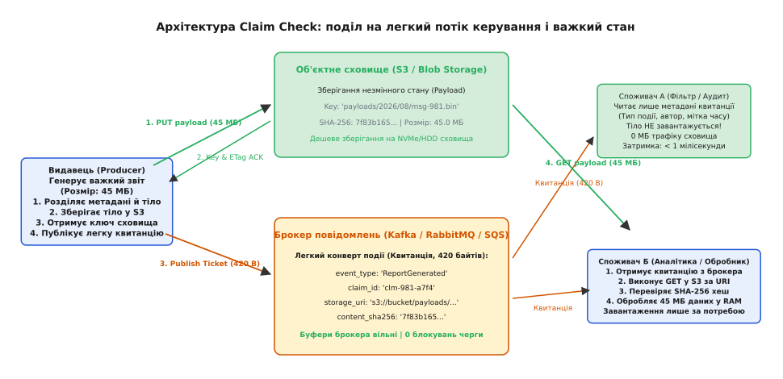
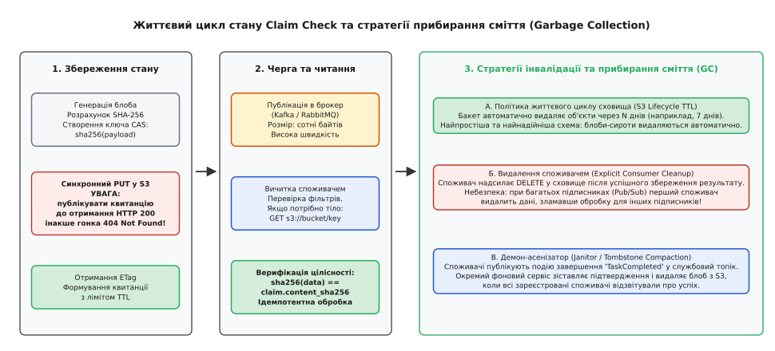
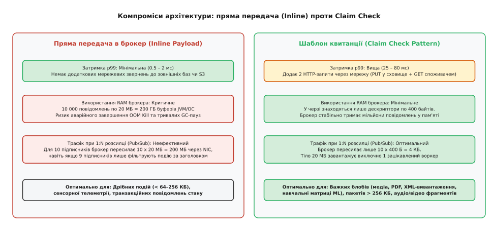

# Квитанція в камері схову (Claim Check)

<preknowlist>
- [Брокер повідомлень](book:programming/message-broker) — централізований посередник для маршрутизації та буферизації подій.
- [Черга повідомлень](book:programming/message-queue) — буфер доставки за принципом FIFO з підтримкою конкурентних споживачів.
- [Ідемпотентність](book:programming/idempotency) — властивість операції давати однаковий результат при повторних викликах.
- [Гарантії доставки](book:programming/delivery-guarantees) — семантики At-Least-Once, At-Most-Once та обробка дублікатів.
</preknowlist>

Коли черга повідомлень отримує пакет розміром у п'ятдесят мегабайтів — скажімо, сирий медичний знімок, звіт у форматі PDF чи пакет фінансових транзакцій у XML — внутрішня механіка брокера зазнає миттєвої деградації. Брокери розподілених повідомлень проєктуються в розрахунку на мільйони дрібних записів розміром від кількох сотень байтів до кількох десятків кілобайтів. У цьому діапазоні операційна система ефективно утилізує сторінковий кеш (англ. *page cache*), структури пам'яті залишаються компактними, а мережеві сокети прокачують пакети без дроблення на тисячі кадрів. Поява навіть одного масивного тіла в загальному потоці ламає ці припущення, перетворюючи швидкісну магістраль на заблокований затор.

На рівні пам'яті брокера велике повідомлення вимагає виділення неперервного або масивного фрагментованого буфера в кеші чи купі процесу (англ. *heap*). Якщо тисяча клієнтів одночасно опублікує по одному повідомленню розміром 50 МБ, брокеру знадобиться 50 ГБ оперативної пам'яті виключно на транзитні буфери. У середовищах із керованими збирачами сміття (як-от JVM у системах Apache Kafka чи Apache ActiveMQ) це спричиняє раптові тривалі паузи збирання сміття (*Stop-the-World GC*), які перевищують таймаути контрольних сигналів серцебиття (*heartbeat*) і призводять до хибного виключення брокера з кластера. На рівні дискової підсистеми скидання таких об'єктів у сегменти журналу вимиває гарячі кешовані сторінки дрібних повідомлень, змушуючи паралельні потоки споживачів зчитувати свої дані безпосередньо з повільних блокових накопичувачів.

Мережева підсистема страждає не менше. При прямому проходженні важкого корисного навантаження через брокер виникає класичне блокування початку черги (англ. *head-of-line blocking*): сокетний буфер передавача заповнюється фрагментами гігантського пакета, і всі легкі, критичні до затримок керівні події (наприклад, сигнали авторизації, скасування або зміни статусу), які стоять у черзі позаду, чекають повної передачі мегабайтного масиву. Ба більше, у топологіях видавець-підписник (*Publish-Subscribe*), де повідомлення транслюється десятьом різним сервісам, брокер змушений десять разів реплікувати 50 МБ через свій мережевий інтерфейс, передаючи сумарно 500 МБ трафіку, навіть якщо вісьмом із цих сервісів для ухвалення рішення були потрібні лише ідентифікатор клієнта та підсумкова сума.

```
[Видавець] ──(50 МБ через чергу)──> [Брокер пам'ять/диск] ──(10 × 50 МБ)──> [10 Споживачів]
  Проблема: пам'ять брокера переповнена, мережа перевантажена, черга заблокована
```

Вирішення цієї кризи полягає в архітектурному розділенні двох принципово різних сутностей: **сигналу про подію** (сигналу керування) та **стану події** (важкого бінарного корисного навантаження). Патерн **Квитанція в камері схову** (англ. *Claim Check*, від англійського терміна, що позначає номерок або жетон у гардеробі чи багажній камері) розриває монолітний пакет. Важкі дані виносяться в спеціалізоване зовнішнє сховище великих об'єктів, а через брокер передається лише мініатюрний конверт, який містить маршрутні метадані та криптографічно стійке посилання на збережений об'єкт — квитанцію.

## Принцип квитанції: поділ на потік керування і важкий стан

Метафора патерна безпосередньо відтворює роботу залізничної камери схову або театрального гардероба. Відвідувач не носить із собою важку дорожню валізу до глядацької зали. Він віддає валізу на збереження до спеціалізованого приміщення, натомість отримує легкий пластиковий номерок із числовим ідентифікатором комірки. З цим номерком відвідувач вільно пересувається коридорами, займає своє місце і показує номерок на виході, щоб отримати багаж назад тоді, коли він дійсно потрібен.

У розподілених системах роль гардероба виконує масштабоване об'єктне сховище (як-от Amazon S3, Google Cloud Storage, Azure Blob Storage або розподілена інсталяція MinIO чи Ceph), оптимізоване для збереження великих блобів із високою пропускною здатністю читання та запису за низькою вартістю зберігання гігабайта. Роль номерка виконує структурований дескриптор повідомлення, який містить уніфікований покажчик ресурсу (*URI*), криптографічний хеш вмісту, розмір у байтах, мітку часу та ідентифікатор сесії.

Повна схема взаємодії компонентів складається з чітко розмежованих кроків:

1. **Екстракція та збереження стану**: Видавець (*Producer*) отримує або формує об'єкт для відправки. Логіка клієнтської бібліотеки аналізує розмір даних. Якщо розмір перевищує встановлений ліміт або тип повідомлення завжди кваліфікується як важкий, тіло відокремлюється від заголовків і завантажується в об'єктне сховище за унікальним ключем.
2. **Отримання підтвердження сховища**: Сховище повертає успішний код відповіді (*HTTP 200 OK*) разом із метаданими фіксації (наприклад, `ETag` або версію об'єкта). Тільки після отримання цього підтвердження формується квитанція.
3. **Публікація квитанції в брокер**: Видавець створює легке повідомлення (зазвичай розміром 300–600 байтів), яке містить бізнес-заголовки, необхідні для фільтрації та маршрутизації (тип події, ідентифікатор клієнта, категорія, пріоритет), а також вкладену секцію дескриптора квитанції. Це повідомлення публікується в штатний топік чи чергу брокера.
4. **Транзит через брокер**: Брокер обробляє легкий конверт на максимальній швидкості ядра, без навантаження на дискові буфери великих сегментів і без ризику вичерпання пулів пам'яті.
5. **Селективне вичитування споживачами**: Споживачі (*Consumers*) отримують легкий конверт із черги. Кожен споживач самостійно вирішує, чи потрібне йому повне тіло об'єкта для виконання своєї бізнес-функції, чи достатньо лише атрибутів із заголовка.


*Архітектура Claim Check: продюсер виносить важке тіло в об'єктне сховище, а брокер передає лише компактну квитанцію з метаданими для селективного читання.*

Детальна структура полів конверта, валідація схем та правила формування дескрипторів квитанцій зафіксовані в окремому [контракті дескрипторів квитанцій](book:programming/claim-check/api-claim-check-contract.md).

## Часова узгодженість і гонка випередження повідомлення

Найпідступніша інженерна помилка під час реалізації патерна Claim Check полягає у виникненні часового розриву, відомого як **гонка читання до запису** (англ. *Read-Before-Write Race Condition*). 

Якщо клієнтська бібліотека видавця ініціює асинхронне вивантаження об'єкта у фоновий пул потоків і одночасно (або до завершення мережевого підтвердження запису) відправляє квитанцію в брокер повідомлень, виникає небезпечний збій. Брокер повідомлень, працюючи в оперативній пам'яті, здатний доставити повідомлення споживачу за частки мілісекунди (0.2–1.5 мс). Натомість запис об'єкта розміром 50 МБ через протокол HTTP/REST у віддалений сервіс S3 вимагає встановлення TLS-з'єднання, передачі потоку даних та синхронізації метаданих на боці кластера сховища, що займає від 30 до 300 мілісекунд.

У результаті споживач отримує квитанцію з черги, робить запит `GET s3://bucket/payload-uuid` і натрапляє на помилку `404 Not Found` або `NoSuchKey`. Якщо споживач не має спеціальної логіки повторних спроб (*retries*) з експоненційним відступом, повідомлення негайно маркується як збійне і скидається в чергу мертвих листів (*Dead Letter Queue*, DLQ), хоча через двадцять мілісекунд файл успішно записується у сховище.

```
Видавець:   ──[Початок PUT в S3 (40 МБ)]───────────────────────[S3 ACK 200]─>
                    │
                    └──[Публікація квитанції в Kafka]─>
                                 │
Брокер:                          └──(Доставка за 1 мс)──>
                                                             │
Споживач:                                                    └──[GET з S3] ──> 💥 404 Not Found!
```

Щоб гарантувати строгу послідовність подій, видавець зобов'язаний дотримуватися інваріанта: **жодна квитанція не може бути передана в транспортний шар брокера доти, доки від сховища не отримано підтвердження фіксації стану (HTTP 200/201 або відповідний системний виклик fsync)**.

Додатковим фактором є модель консистентності самого сховища об'єктів. Сучасні хмарні сховища (як-от Amazon S3 з грудня 2020 року) надають строгу узгодженість після запису (*Strong Read-After-Write Consistency*) для операцій `PUT` та `DELETE`. Однак у разі використання георозподілених реплікованих сховищ або сторонніх кластерів із кінцевою узгодженістю (*Eventual Consistency*) читання з репліки в іншому регіоні може повертати застарілий або відсутній стан протягом інтервалу реплікації. У таких середовищах до квитанції додають версію об'єкта або очікують підтвердження кворумного запису.

### Адресація за вмістом (CAS) та природне дедуплікування

Критично важливим інженерним рішенням є спосіб генерації ключа для збереження об'єкта. Найпростіший шлях — генерація випадкового UUID (`payloads/f47ac10b-58cc-4372-a567-0e02b2c3d479.bin`). Проте він породжує проблему надлишкового дублювання простору при повторних відправках однакових файлів або повторних спробах збійних завдань.

Професійна архітектура застосовує **адресацію за вмістом** (англ. *Content-Addressable Storage*, CAS). Перед збереженням корисного навантаження клієнт обчислює криптографічний хеш від усього масиву байтів (наприклад, алгоритмом SHA-256):

```
Ключ = "blobs/" + HexEncode(SHA-256(корисне_навантаження))
```

Це дає одразу три системні переваги:

1. **Ідемпотентність запису**: Якщо процес видавця впаде після запису в сховище, але до публікації в брокер, механізм повторної спроби згенерує той самий ключ і безпечно перезапише ідентичний вміст без створення сміттєвих дублікатів.
2. **Дедуплікування на рівні сховища**: Якщо тисяча користувачів завантажують один і той самий типовий документ чи оновлення прошивки, у сховищі зберігатиметься рівно один фізичний блоб, а в брокері циркулюватимуть різні квитанції, що посилаються на один незмінний ключ.
3. **Наскрізний контроль цілісності**: Споживач після завантаження блоба знову обчислює SHA-256 від отриманого масиву і порівнює його зі значенням, зазначеним у квитанції. Будь-яке пошкодження даних у мережі або несанкціонована підміна блоба в сховищі фіксується до початку обробки.

Повний програмний код потокового розрахунку хешу та клієнтської обгортки наведено в практичній [реалізації конвеєра з детермінованим хешуванням](book:programming/claim-check/proj-claim-check-pipeline.md).

## Інтеграція з патерном Transactional Outbox

У розподілених транзакційних системах публікація квитанції стикається з класичною проблемою подвійного запису (англ. *Dual-Write Problem*). Сервіс повинен одночасно оновити свій локальний стан у реляційній базі даних (наприклад, зберегти замовлення) та відправити квитанцію з важким вкладенням у брокер повідомлень.

Якщо сервіс спершу збереже файл у S3, оновить базу даних, а потім впаде до відправки повідомлення в Kafka, транзакція в базі зафіксується, але інші системи ніколи не дізнаються про подію. Якщо ж сервіс спочатку відправить квитанцію в брокер, а фіксація транзакції в базі завершиться помилкою унікальності, споживачі почнуть обробляти квитанцію для сутності, якої юридично не існує в базі даних.

Вирішенням є поєднання Claim Check із патерном **Transactional Outbox**:

1. **Транзакційний запис метаданих**: Сервіс вивантажує важкий блоб у сховище S3 за адресою CAS `sha256(payload)`.
2. **Атомарна локальна транзакція**: Сервіс відкриває транзакцію в базі даних. В одній неподільній транзакції він записує бізнес-сутність у таблицю `orders` і записує підготовлений дескриптор квитанції в службову таблицю `outbox`.
3. **Асинхронний релей**: Окремий процес зчитування журналу транзакцій (CDC, наприклад Debezium) або фоновий релей вичитує записи з таблиці `outbox` і публікує готові квитанції в топік брокера.
4. **Аварійна стійкість**: Якщо сервіс аварійно завершується на етапі вивантаження в S3, у базі даних не створюється жодних записів. Блоб у сховищі безпечно видаляється автоматичною політикою очищення або перевикористовується наступною ідемпотентною спробою.

```
Сервіс:
  1. PUT s3://bucket/blobs/hash-abc (40 МБ)
  2. BEGIN TRANSACTION
       INSERT INTO orders (id, total, ...) VALUES (...);
       INSERT INTO outbox (topic, payload_ref, hash) VALUES ('orders.v1', 's3://...', 'hash-abc');
     COMMIT;

Outbox Relay (CDC / Debezium):
  3. Читає транзакційний лог БД ──> Публікує квитанцію (400 Б) в Kafka
```

Ця комбінація гарантує, що важкі бінарні дані не засмічують реляційну базу даних (яка не призначена для зберігання гігабайтів блобів у стовпчиках `BLOB`/`BYTEA`), брокер не перевантажується великими пакетами, а узгодженість між станом бази та подіями черги залишається абсолютно строгою.

## Селективне вичитування та мережева економія у Pub/Sub

Найбільший коефіцієнт економічної та обчислювальної ефективності патерн Claim Check демонструє в архітектурах із багатьма підписниками. Розглянемо типовий корпоративний конвеєр обробки відеоматеріалів або великих страхових претензій.

Коли видавець фіксує нову подію (наприклад, надходження пакета документів обсягом 120 МБ), на подію підписані чотири незалежні сервіси:
- **Сервіс аудиту та безпеки**: перевіряє лише IP-адресу, сертифікат відправника та час надходження;
- **Сервіс білінгу**: зчитує ідентифікатор облікового запису та тарифну сітку для списання коштів;
- **Сервіс маршрутизації та сповіщень**: надсилає короткий пуш-сигнал користувачу;
- **Сервіс оптичного розпізнавання (OCR)**: завантажує графічні скани документів і виконує розпізнавання тексту за допомогою нейромереж.

При традиційній передачі даних всередині брокера (*Inline*) брокер змушений передати `4 × 120 МБ = 480 МБ` через мережеві інтерфейси. Три з чотирьох споживачів витрачають такти процесора та пам'ять на десеріалізацію 120 МБ JSON/Protobuf-конверта лише для того, щоб прочитати два рядкові поля в корені структури і викинути решту даних зі своєї пам'яті.

```
Традиційна передача (Inline):
Продюсер ──(120 МБ)──> [Брокер] ┬──(120 МБ)──> Сервіс аудиту     (використовує 200 байтів, решту викидає)
                                ├──(120 МБ)──> Сервіс білінгу    (використовує 100 байтів, решту викидає)
                                ├──(120 МБ)──> Сервіс сповіщень  (використовує 50 байтів, решту викидає)
                                └──(120 МБ)──> Сервіс OCR        (використовує всі 120 МБ)
Сумарний мережевий трафік брокера: 600 МБ!

Схема Claim Check:
Продюсер ──(120 МБ)──> [S3 Сховище]
    │
(Квитанція 400 Б)
    ▼
[Брокер] ┬──(400 Б)──> Сервіс аудиту     (читає квитанцію, в S3 НЕ йде)
         ├──(400 Б)──> Сервіс білінгу    (читає квитанцію, в S3 НЕ йде)
         ├──(400 Б)──> Сервіс сповіщень  (читає квитанцію, в S3 НЕ йде)
         └──(400 Б)──> Сервіс OCR        (читає квитанцію ──GET (120 МБ)──> [S3])
Сумарний мережевий трафік брокера: 1.6 КБ + один спрямований запит до S3 на 120 МБ!
```

Завдяки патерну Claim Check брокер реплікує лише кілька кілобайтів метаданих. Перші три сервіси отримують потрібну інформацію миттєво з заголовків квитанції без жодного мережевого виклику до сховища. Єдиний сервіс, якому насправді потрібен масив пікселів (OCR), самостійно завантажує його безпосередньо з хмарного сховища за виділеним високошвидкісним каналом. Це знижує навантаження на мережевий стек брокера у сотні разів і запобігає деградації сусідніх черг.

## Життєвий цикл та прибирання сміття (Garbage Collection)

Винесення стану повідомлення за межі брокера створює новий системний виклик: **хто, коли і як повинен видаляти дані зі сховища об'єктів?**

У монолітному брокері життєвий цикл повідомлення детермінований: після підтвердження отримання (*ACK*) всіма споживачами (у чергах на кшталт RabbitMQ) або після закінчення періоду ретенції сегмента (у логах на кшталт Apache Kafka) брокер автоматично звільняє дисковий простір. У патерні Claim Check брокер нічого не знає про існування фізичного файлу в бакеті S3. Якщо видалення не автоматизоване, сховище перетворюється на сміттєзвалище «мертвих блобів», за які компанія щомісяця сплачує провайдеру реальні кошти.


*Життєвий цикл квитанції: синхронізація запису до публікації, транзит чергою та варіанти автоматичного чи скоординованого прибирання застарілих блобів.*

В інженерній практиці застосовують три стратегії очищення сховища, кожна з яких має свої обмеження:

### 1. Автоматична політика життєвого циклу сховища (TTL-Based Lifecycle Policy)

Бакет або контейнер сховища налаштовується на автоматичне видалення або архівацію об'єктів через фіксований час після створення (наприклад, через 7, 14 або 30 днів):

```
Правило S3 Lifecycle:
  Prefix: "payloads/"
  Status: Enabled
  Expiration: Days = 7
```

- **Переваги**: Нульова складність коду в додатках; абсолютна стійкість до збоїв видавців і споживачів; гарантоване видалення «осиротілих» блобів (*orphaned blobs*), які були записані у сховище продюсером, що впав до відправки квитанції в брокер.
- **Недоліки**: Якщо черга простоює через аварію споживачів довше встановленого TTL (наприклад, черга накопичувалася 8 днів під час аварії бази даних), старі квитанції після відновлення вичитаються з черги, але спроба завантажити тіло поверне помилку `NoSuchKey`. Час життя повинен розраховуватися із суттєвим запасом відносно максимального очікуваного часу простою системи (MTTR).

### 2. Явне видалення останнім споживачем (Explicit Consumer Deletion)

Споживач, отримавши квитанцію та успішно завершивши збереження результату обробки в кінцеву базу даних, виконує явний API-виклик `DELETE s3://bucket/key`.

- **Переваги**: Миттєве звільнення простору сховища відразу після споживання; мінімальні витрати на зберігання даних.
- **Критична небезпека**: Цей підхід придатний **виключно для черг типу «один до одного» (Point-to-Point Queue)**. У топології Pub/Sub з багатьма підписниками перший споживач, який завершить свою роботу, видалить блоб з S3, прирікаючи всіх повільніших паралельних споживачів на фатальну помилку відсутності даних.

### 3. Демон-асенізатор з обліком підтверджень (Janitor Service & Tombstones)

Для складних систем із динамічною кількістю підписників застосовується координаційний сервіс очищення. Кожен споживач після завершення обробки публікує службову подію `ClaimConsumed(claim_id, consumer_name)` у координаційний топік.

Фоновий демон-асенізатор збирає ці квитанції, веде лічильник завершень або зіставляє їх із реєстром обов'язкових підписників і відправляє команду `DELETE` у сховище лише тоді, коли всі зареєстровані споживачі підтвердили успішне вичитування. Блоби, для яких квитанція не надійшла протягом максимального таймауту, видаляються фоновим сканером як сміття.

## Георозподілена реплікація та асинхронні затримки сховищ

Коли система розгортається у мультирегіональній топології (наприклад, активний дата-центр у Франкфурті та резервний або аналітичний дата-центр у Вірджинії), виникає проблема асинхронного розриву реплікації між брокером та об'єктним сховищем.

Брокери повідомлень (як-от кластер Kafka з MirrorMaker 2 або інструментами на кшталт Confluent Cluster Linking) реплікують легкі метадані квитанцій за лічені мілісекунди (10–40 мс транс'атлантичного пінгу). Водночас асинхронна міжрегіональна реплікація об'єктних сховищ (наприклад, AWS S3 Cross-Region Replication, CRR) для великих блобів розміром 50–200 МБ може тривати від кількох секунд до кількох хвилин.

Якщо споживач у вторинному регіоні зчитує квитанцію з дзеркального топіка брокера одразу після її появи, його локальний бакет ще не містить відповідного блоба.

```
Регіон A (Франкфурт):  PUT S3 ──(CRR реплікація 5 с)────────────> Регіон B S3 (Блоб з'явився)
                         │                                                 ▲
                Publish Ticket (400 Б)                                     │
                         │                                                 │
                         ▼                                                 │
Kafka MirrorMaker:    ──(Міжрегіональний транзит 30 мс)──> Kafka Топік B   │
                                                                 │         │
Споживач B:                                                Зчитує квитанцію за 35 мс
                                                                 │         │
                                                           GET з S3 B ─────┘ 💥 404 (CRR ще триває!)
```

Для запобігання збоям у георозподілених середовищах застосовують одну з трьох тактик:

1. **Крос-регіональний відкат (Cross-Region Fallback GET)**: Квитанція містить як глобальний ідентифікатор блоба, так і посилання на первинний регіон створення (`s3://bucket-eu-central-1/...`). Якщо локальний запит у регіоні B повертає `404`, клієнтська бібліотека виконує прямий виклик до первинного бакета в регіоні A, сплачуючи невелику ціну за міжрегіональний трафік, але уникаючи затримки обробки.
2. **Адаптивний експоненційний відступ споживача**: При отриманні `404` споживач відкладає повторне вичитування повідомлення (*Retry Topic / Delay Queue*) на 5–10 секунд, надаючи механізму CRR час завершити реплікацію об'єкта.
3. **Синхронізація через події сховища (S3 Event Notifications)**: Видавець публікує квитанцію не безпосередньо, а дозволяє самому сховищу згенерувати подію `ObjectCreated` у топік брокера після того, як блоб зафіксовано в цільових регіонах.

## Безпека, розмежування доступу та одноразові підписані посилання

Переміщення корисного навантаження з захищеного внутрішнього контуру брокера в зовнішнє сховище змінює периметр безпеки. Виникає питання авторизації: чи повинен кожен мікросервіс у кластері мати повні права читання та запису (`s3:GetObject`, `s3:PutObject`) до центрального сховища подій?

Надання широких IAM-прав усім сервісам порушує **принцип найменших привілеїв** (англ. *Principle of Least Privilege*). Якщо скомпрометовано один другорядний сервіс звітності, зловмисник отримує прямий доступ до викачування всіх історичних корисних навантажень кластера.

Для усунення цієї вразливості застосовують дві взаємодоповнюючі моделі захисту:

### Тимчасові підписані посилання (Presigned URLs / Shared Access Signatures)

Замість передачі статичного внутрішнього шляху (`s3://internal-bucket/payload.bin`) видавець або виділений сервіс авторизації генерує **підписаний одноразовий URL** (*Presigned URL* у AWS S3 або *SAS Token* у Azure Blob Storage).

Підписаний URL містить у рядку запиту криптографічний підпис, обмежений чіткими параметрами:
- Дозволено виключно операцію `GET`;
- Термін дії посилання обмежений (наприклад, 15 або 60 хвилин);
- Посилання дійсне лише для одного конкретного файлу.

```
https://s3.eu-central-1.amazonaws.com/events-store/blobs/7f83b165...?X-Amz-Algorithm=AWS4-HMAC-SHA256&X-Amz-Credential=...&X-Amz-Date=20260820T120000Z&X-Amz-Expires=900&X-Amz-Signature=a98f7b...
```

Споживачу взагалі не потрібні власні хмарні облікові дані для роботи з S3. Він виконує стандартний HTTP GET-запит за підписаним посиланням і завантажує дані. Після закінчення терміну дії підпису посилання стає недійсним, що виключає несанкціонований доступ до даних у разі витоку старих повідомлень із логів аудиту.

### Клієнтське конвертне шифрування (Envelope Encryption)

Якщо дані містять банківську таємницю чи персональні дані (PII), зберігання їх у сховищі навіть із закритими бакетами може не відповідати регуляторним вимогам.

У цьому разі видавець:
1. Генерує одноразовий симетричний ключ шифрування даних (*Data Encryption Key*, DEK);
2. Зашифровує корисне навантаження алгоритмом AES-256-GCM за допомогою DEK;
3. Зберігає зашифрований шифротекст у сховищі об'єктів;
4. Зашифровує сам ключ DEK публічним ключем системи управління ключами (*KMS*) або асиметричним ключем споживача;
5. Вкладає зашифрований DEK безпосередньо в тіло квитанції брокера.

Тільки авторизований споживач, який має доступ до відповідного ключа розшифрування в KMS, зможе розшифрувати DEK з квитанції і потім розшифрувати завантажений з S3 масив даних. Адміністратори хмарного сховища бачать лише бінарний шифротекст і не мають змоги відновити оригінальні дані.

## Архітектурні компроміси та гібридні пороги

Застосування патерна Claim Check не є безкоштовним. Воно вимагає ретельного інженерного аналізу компромісів між надійністю, затримками та вартістю інфраструктури.


*Порівняння компромісів: наскрізна затримка, навантаження на пам'ять брокера та мережевий трафік при різних розмірах корисного навантаження.*

### Ціна додаткових мережевих стрибків (Latency Penalty)

Пряма передача даних всередині брокера (*Inline*) вимагає рівно двох мережевих переходів: `Видавець → Брокер` та `Брокер → Споживач`. Обидва з'єднання зазвичай тримаються постійно відкритими через TCP-сокети із бінарними мультиплексованими протоколами. Наскрізна затримка (*End-to-End Latency*) становить лічені мілісекунди.

Шаблон Claim Check додає два повноцінних HTTP/REST-запити до зовнішнього сервісу:
1. `PUT` від видавця до S3 (20–100 мс залежно від розміру та регіону);
2. `GET` від споживача до S3 (15–80 мс).

Сумарна затримка обробки події зростає на порядок. Якщо система вимагає ультранизьких затримок обробки на рівні часток мілісекунди (наприклад, у високонавантаженому біржовому трейдингу), патерн Claim Check є неприйнятним.

### Пороговий гібридний підхід (Dynamic Threshold Routing)

Щоб отримати переваги обох підходів, сучасні корпоративні конвеєри впроваджують **порогову маршрутизацію**:

```
Розмір повідомлення (S):
  ┌─ S ≤ 64 КБ  ───> Пряма передача в брокер (Inline Payload, нульова затримка HTTP)
  └─ S > 64 КБ  ───> Патерн Claim Check (Збереження в S3 + генерація квитанції)
```

Поріг у 64–256 КБ є емпірично вивіреним балансом: повідомлення до 64 КБ не створюють відчутного навантаження на сторінковий кеш і пам'ять сучасних брокерів, забезпечуючи мінімальну затримку обробки 99-го перцентиля (p99). Усі аномально великі пакети прозоро перенаправляються в об'єктне сховище, захищаючи кластер від перевантаження.

### Економічна модель зберігання

Фінансова доцільність Claim Check базується на радикальній різниці вартості зберігання гігабайта даних:
- **Швидкісні сховища брокерів (NVMe SSD / EBS io2)**: від $0.12 до $0.25 за ГБ на місяць із додатковою платою за виділений IOPS.
- **Стандартне об'єктне сховище (Amazon S3 Standard)**: близько $0.023 за ГБ на місяць.
- **Холодні рівні зберігання (S3 Infrequent Access / Glacier Instant Retrieval)**: від $0.004 до $0.0125 за ГБ на місяць.

Зберігання мільйона 10-мегабайтних повідомлень (10 ТБ) у топіку Kafka з ретенцією в 30 днів обходиться в $1200–$2500 щомісяця лише за дисковий масив кластера. Перенесення цих тіл у S3 скорочує витрати на диски до $230 (або до $40 при автоматичній міграції в холодні класи), повністю окупаючи мізерну вартість операцій `PUT`/`GET` запитів.

| Критерій оцінки | Пряма передача в брокер (Inline) | Квитанція в камері схову (Claim Check) |
| :--- | :--- | :--- |
| **Наскрізна затримка (p99)** | 0.5 – 3 мс (ультранизька) | 25 – 120 мс (висока через HTTP/S3 стрибки) |
| **Навантаження на пам'ять брокера** | Пропорційне розміру корисного навантаження (критичне) | Мінімальне та стабільне (сотні байтів на подію) |
| **Ефективність у Pub/Sub (1:N)** | Неефективна (N-кратна реплікація мегабайтів) | Ідеальна (реплікується лише квитанція) |
| **Граничний розмір даних** | Жорстко обмежений лімітами брокера (1–4 МБ) | Практично необмежений (терабайти в S3) |
| **Складність прибирання сміття** | Відсутня (керується брокером) | Вимагає політик TTL, демонів або бар'єрів |
| **Ізоляція збоїв (Blast Radius)** | Низька (одне гігантське тіло блокує всю чергу) | Висока (важкі дані ізольовані в об'єктному сховищі) |

Детальний аналіз історичних передумов виникнення патерна в корпоративних системах IBM MQ та MSMQ описано в статті про [історію виникнення шаблону в корпоративних шинах](book:programming/claim-check/hist-eip-claim-check.md).

> 🔧 **Навіщо це.**
> У продакшн-системах патерн Claim Check — це головний запобіжник від каскадних аварій (*Cascading Failures*) брокерів повідомлень. Без нього раптовий викид важких аналітичних звітів чи бінарних логів у загальну шину призводить до вичерпання дискових квот топіка, деградації IOPS і аварійної зупинки критичних мікросервісів, які обробляють дрібні транзакції. Винесення важкого стану в дешеве об'єктне сховище із збереженням адресації за вмістом (CAS) забезпечує передбачувану роботу черг, строгу ізоляцію навантаження та зниження витрат на реплікацію трафіку в розподіленій системі.

Розділення сигналу керування та важкого стану перетворює брокер повідомлень на те, чим він має бути за своєю природою: наднадійний, низьколатентний комутатор сигналів керування, залишаючи зберігання гігабайтів даних підсистемам, спеціально спроєктованим для масивного паралельного збереження блобів.

