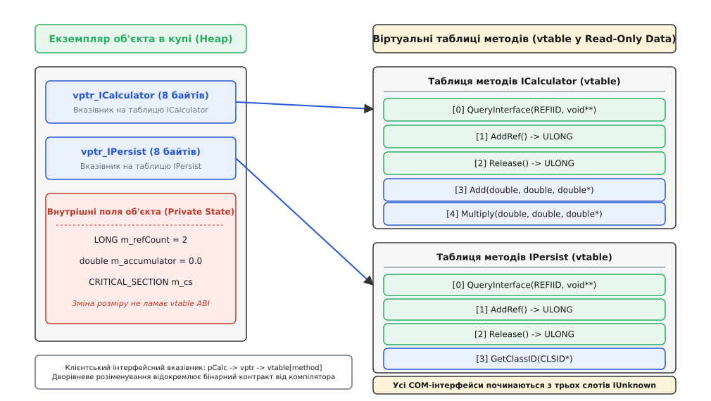
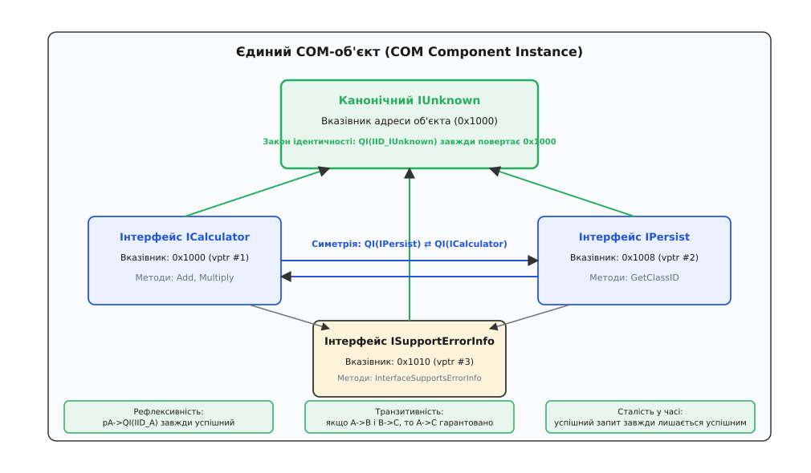
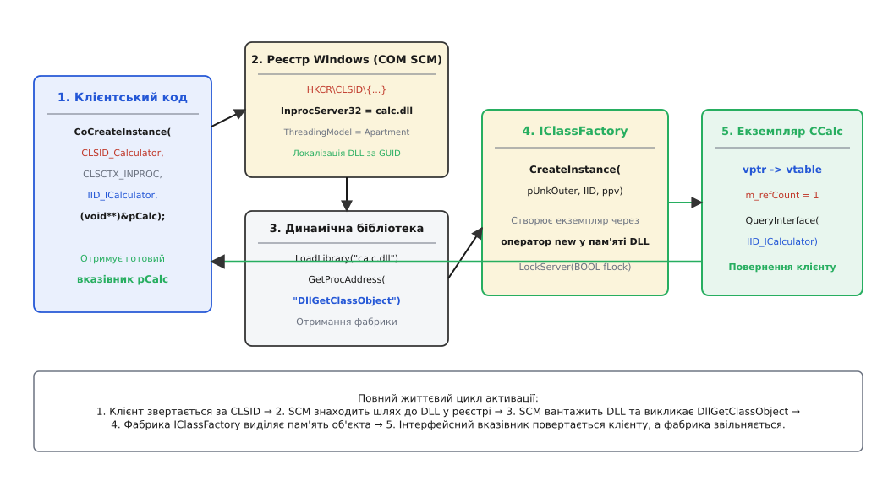
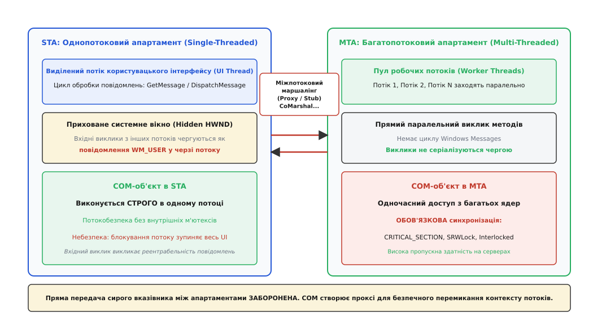
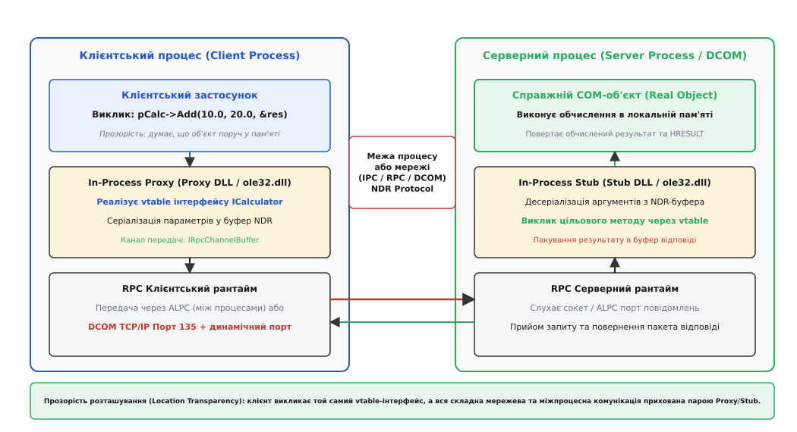

# COM: бінарна модель компонентів Windows

<preknowlist>
- [Угода про виклик (ABI)](book:programming/calling-convention) — правила передачі аргументів через регістри й стек та очищення стекового фрейму.
- [Таблиця віртуальних методів C++](book:programming/virtual-dispatch-cpp) — непряма диспетчеризація методів через покажчик на масив адрес у пам'яті.
- [RPC і серіалізація](book:programming/rpc) — виконання процедур на віддаленому вузлі через маршалінг параметрів.
- [Вісім оман розподілених обчислень](book:programming/distributed-fallacies) — чому локальний виклик у пам'яті принципово відрізняється від мережевого звернення.
- [Віртуальна пам'ять](book:programming/virtual-memory) — ізоляція адресних просторів процесів та механіка спільної пам'яті динамічних бібліотек.
</preknowlist>

Комерційний графічний редактор, скомпільований 1995 року компілятором Borland C++ 5.0, завантажує динамічну бібліотеку фільтрів зображень `filters.dll`, зібрану командою сторонніх розробників за допомогою Microsoft Visual C++ 4.0. Програма намагається викликати віртуальний метод обробки кадру на експортованому класі `CImageProcessor`. Замість обробки пікселів операційна система негайно аварійно завершує процес із фатальною помилкою порушення прав доступу до пам'яті `EXCEPTION_ACCESS_VIOLATION` (`0xC0000005`).

Розслідування аварії виявляє три фундаментальні розбіжності на рівні машинного коду:
1. **Декорування імен (Name Mangling):** Borland згенерував ім'я методу `@CImageProcessor@Process$qv`, тоді як MSVC експортував `?Process@CImageProcessor@@QAEXXZ`. Лінкер взагалі не зміг зв'язати виклик без ручного хаку таблиці експорту.
2. **Зсув у таблиці віртуальних методів (vtable mismatch):** Компілятор MSVC розмістив покажчик на службову інформацію про типи RTTI за від'ємним зсувом відносно початку vtable і додав прихований деструктор, через що індекс виклику методу `Process()` у Borland змістився рівно на 4 байти, влучивши у випадкову адресу пам'яті.
3. **Конфлікт купових алокаторів (Heap Corruption):** Звільнення пам'яті всередині деструктора викликало функцію `free()` зі статичної бібліотеки CRT Borland для блоку, виділеного алокатором `MSVCRT.DLL`, що миттєво зруйнувало системні дескриптори купи.

Ця аварія ілюструє фундаментальну проблему індустрії початку 1990-х років: **мова C++ не має стандартизованого бінарного інтерфейсу (Application Binary Interface, ABI)**. Експорт сирих C++ класів із динамічних бібліотек робив неможливим повторне використання бінарних модулів між різними компіляторами, різними мовами програмування і навіть різними версіями того самого інструменту.

Відповіддю компанії Microsoft на цю кризу стала **Component Object Model (COM)** — сувора специфікація бінарного стандарту взаємодії компонентів на рівні машинних інструкцій та макета пам'яті, що не залежить від мови програмування, компілятора та фізичного розташування коду.

## Анатомія крихкого бінарного зв'язку: чому сирий C++ не придатний для компонентів

Щоб зрозуміти інженерні рішення COM, необхідно розібрати чотири бар'єри, які роблять мову C++ непридатною для створення незалежних бінарних компонентів.

### 1. Хаос декорування імен (Name Mangling)
Для підтримки перевантаження функцій (Function Overloading), просторів імен (Namespaces) та шаблонів компілятор C++ перетворює сигнатуру функції у внутрішній унікальний рядок символів. Оскільки стандарт C++ ніколи не визначав правила цього перетворення, кожен виробник компіляторів створив власний алгоритм:
- Сигнатура `void CMath::Calculate(int, double)` у MSVC перетворюється на `?Calculate@CMath@@QAEXHN@Z`.
- У компіляторі GCC та Clang (згідно зі стандартом Itanium ABI) та сама функція перетворюється на `_ZN5CMath9CalculateEid`.
- У компіляторі Borland C++ генерується `@CMath@Calculate$qind`.

У результаті скомпільована бібліотека DLL, що експортує C++ клас, може бути підключена виключно клієнтом, зібраним тією самою мажорною версією того самого компілятора з ідентичними прапорцями збірки.

### 2. Проблема крихкого базового класу (Fragile Base Class Problem)
Уявімо постачальника бібліотеки, який експортує базовий клас `CDataEngine`:

```cpp
class CDataEngine {
public:
    virtual void Connect();
    virtual void Query();
private:
    int m_timeout;
};
```

Клієнт створює похідний клас `CMyEngine : public CDataEngine` і розміщує власне поле `int m_customFlag`. Компілятор клієнта жорстко зашиває в машинний код зсув: поле `m_customFlag` лежить за адресою `this + 8` (4 байти на покажчик `vptr` + 4 байти на `m_timeout` на 32-бітній платформі).

Через місяць постачальник випускає версію 1.1 бібліотеки, додавши у приватну секцію базового класу нове поле діагностики: `int m_retryCount`. Розмір базового класу зростає з 8 до 12 байтів.

Клієнтський додаток не перекомпільовують — він просто завантажує нову версію DLL. Коли клієнт записує значення у `m_customFlag`, машинний код записує дані за старим зсувом `this + 8`, затираючи нове внутрішнє поле базового класу `m_retryCount`. Виникає невидиме пошкодження пам'яті, яке призводить до непередбачуваної поведінки або падіння в довільний момент часу. Додавання нового віртуального методу в середину списку базового класу спричиняє ще гірший ефект — зміщення індексів усіх наступних функцій у таблиці `vtable`.

### 3. Межі менеджерів пам'яті (CRT Fragmentation)
Кожен скомпільований модуль може мати власну копію C Runtime Library (CRT) зі своїм внутрішнім пулом пам'яті (Heap). Якщо об'єкт створюється викликом `new` усередині DLL, а клієнт викликає для нього `delete` у власному коді, системний дескриптор купи клієнта не впізнає адресу чужого блоку пам'яті, що призводить до негайного краху процесу.

### 4. Кросмовний бар'єр
У середині 1990-х років корпоративні інтерфейси писалися на Visual Basic 4.0/5.0, Delphi, C та макросах Excel. Жодна з цих систем не підтримувала складні конструкції C++: шаблони, множинне успадкування чи виключення. Необхідний був універсальний спільний знаменник, який би підтримувався будь-якою мовою, здатною виконувати непрямі виклики функцій за адресою покажчика.

## Фундамент COM: інтерфейс як чистий бінарний контракт (vtable ABI)

COM розв'язує кризу сумісності радикальним архітектурним рішенням: **клієнтський код ніколи не має доступу до екземпляра класу напряму; взаємодія здійснюється виключно через інтерфейсні вказівники на віртуальні таблиці методів**.

Інтерфейс у COM — це строго типізована таблиця покажчиків на функції у пам'яті. Бінарний формат COM-інтерфейсу на машинному рівні точно відповідає структурі віртуальних таблиць (vtable), що генеруються компіляторами C++ для чисто абстрактних класів без полів даних.


*Бінарна розкладка COM-об'єкта: клієнт володіє вказівником на покажчик віртуальної таблиці; додавання внутрішніх полів не змінює бінарний зсув слотів vtable.*

### Механіка дворівневого розіменування

Коли клієнт отримує інтерфейсний покажчик `ICalculator* pCalc`, у пам'яті виникає дворівнева структура:
1. Змінна `pCalc` містить адресу в купі, де розташовано перше поле екземпляра об'єкта — покажчик `vptr`.
2. `vptr` вказує на статичний масив адрес функцій у сегменті даних (`.rdata`).
3. Виклик методу `pCalc->Add(10.0, 20.0, &res)` транслюється компілятором у машинну інструкцію непрямого виклику:

```
; x86 Assembly виклику методу Add (слот 3):
mov eax, [pCalc]       ; EAX = адреса екземпляра об'єкта
mov edx, [eax]         ; EDX = vptr (адреса віртуальної таблиці)
lea ecx, [res]         ; підготовка вихідного параметра &res
push ecx               ; параметр 3
push 20.0              ; параметр 2 (double)
push 10.0              ; параметр 1 (double)
push eax               ; прихований параметр "This" (вказівник на об'єкт)
call [edx + 12]        ; непрямий виклик функції за адресою vtable[3] (12 = 3 * 4 байти)
```

Завдяки цьому внутрішні поля об'єкта (`m_refCount`, кеші, м'ютекси) розташовуються в пам'яті **після** покажчиків `vptr`. Розробник компонента може додавати, видаляти або змінювати приватні змінні класу в нових версіях DLL: бінарні зсуви слотів віртуальної таблиці залишаються абсолютно стабільними, повністю ліквідуючи проблему крихкого базового класу.

### Узгодження `this`-покажчика та thunk-перехідники

Коли C++ клас реалізує кілька інтерфейсів через множинне успадкування:

```cpp
class CCalculator : public ICalculator, public IPersist {
    // ...
};
```

У пам'яті екземпляр містить два незалежні покажчики `vptr`: перший для `ICalculator` за зсувом `+0`, другий для `IPersist` за зсувом `+8` (на 64-бітній платформі).

Коли клієнт викликає метод `IPersist::GetClassID()`, у якості прихованого першого параметра передається адреса `this + 8`. Проте реалізація класу очікує базову адресу `this + 0`. Компілятор вирішує це за допомогою **перехідників (thunks)** у віртуальній таблиці: слот vtable вказує на крихітну машинну інструкцію `sub rcx, 8; jmp CCalculator::GetClassID`. Це повністю приховує внутрішню структуру пам'яті від клієнта.

### Угода про виклики та обробка помилок (HRESULT)

Усі методи COM зобов'язані підпорядковуватися трьом залізним правилам:
1. **Угода `__stdcall` (`STDMETHODCALLTYPE`):** Очищення параметрів зі стека покладається на викликану функцію. Це усуває дублювання коду очищення в кожному місці виклику та гарантує сумісність із Visual Basic і Delphi.
2. **Обов'язковий статус `HRESULT`:** Метод не має права викидати виключення C++ (C++ Exceptions) за межі свого бінарного модуля, оскільки стек-анвайндінг між різними компіляторами призводить до фатального краху. Кожен метод повертає 32-бітний числовий код завершення `HRESULT`.
3. **Вихідні дані через покажчики:** Якщо метод повинен повернути значення клієнту, воно передається через останній аргумент як покажчик із маркером `[out, retval]`.

### Незмінність контрактів (Interface Immutability)

Фундаментальна аксіома COM стверджує: **опублікований інтерфейс є вічно незмінним**. Якщо інтерфейс `ICalculator` з ідентифікатором `IID_ICalculator` було випущено в реліз, розробник не має права додати до нього жодного нового методу, змінити порядок функцій або змінити типи параметрів.

Якщо виникає потреба розширити функціонал (наприклад, додати операцію обчислення квадратного кореня), розробник створює **новий** інтерфейс `ICalculator2` з унікальним `IID_ICalculator2`:

```cpp
struct __declspec(novtable) ICalculator2 : public ICalculator {
    virtual HRESULT STDMETHODCALLTYPE Sqrt(double a, double *result) = 0;
};
```

Старі клієнти продовжують запитувати `ICalculator` і працювати без збоїв, тоді як нові клієнти запитують `ICalculator2`. Цей принцип гарантує 100% зворотну бінарну сумісність на десятиліття вперед.

Повний перелік системних сигнатур та структуру статусів викладено у довіднику [Специфікація інтерфейсів та системних функцій COM](book:programming/distributed-systems/com-component-model/api-iunknown-and-apartments.md).

## Три кити IUnknown: ідентичність, навігація та життєвий цикл

Кожен без винятку COM-інтерфейс зобов'язаний починатися з трьох методів фундаментального інтерфейсу `IUnknown`. Він забезпечує поліморфізм, динамічне приведення типів та автоматичний контроль життєвого циклу об'єктів у пам'яті.


*Аксіоми навігації QueryInterface: рефлексивність, симетрія, транзитивність та єдина канонічна адреса IUnknown, що визначає ідентичність екземпляра.*

### 1. Навігація між гранями: `QueryInterface`

У COM немає оператора `dynamic_cast`, оскільки він спирається на RTTI конкретного компілятора. Замість цього клієнт запитує нові інтерфейси у самого об'єкта через виклик `QueryInterface`:

```cpp
HRESULT QueryInterface(REFIID riid, void **ppvObject);
```

Під час реалізації `QueryInterface` діють чотири математичні інваріанти:
- **Рефлексивність (Reflexivity):** Запит інтерфейсу `A` від покажчика на інтерфейс `A` завжди повинен повертати успіх `S_OK`.
- **Симетричність (Symmetry):** Якщо з інтерфейсу `A` вдалося отримати інтерфейс `B`, то з отриманого покажчика `B` гарантовано можна повернутися до `A`.
- **Транзитивність (Transitivity):** Якщо з `A` можна отримати `B`, а з `B` можна отримати `C`, то запит інтерфейсу `C` безпосередньо з `A` гарантовано поверне успіх.
- **Сталість у часі (Predictability):** Якщо об'єкт відповів ствердно на запит інтерфейсу одного разу, він зобов'язаний відповідати ствердно протягом усього свого життя.

#### Закон ідентичності об'єкта (Object Identity)

Найважливіше правило COM стосується запиту базового інтерфейсу `IID_IUnknown`: **запит `QueryInterface` із параметром `IID_IUnknown` від БУДЬ-ЯКОГО інтерфейсу об'єкта повинен завжди повертати абсолютно однакове числове значення адреси пам'яті**.

Оскільки об'єкт може реалізовувати п'ять різних інтерфейсів через множинне успадкування, адреси покажчиків на `ICalculator` (`this + 0`), `IPersist` (`this + 8`) та `IDispatch` (`this + 16`) фізично різняться через зсув покажчиків `vptr`. Єдиний надійний спосіб перевірити, чи належать два інтерфейсні покажчики одному фізичному екземпляру в пам'яті — запросити в обох `IUnknown*` і порівняти адреси покажчиків як звичайні числа.

### 2. Керування пам'яттю: `AddRef` та `Release`

COM використовує розподілений підрахунок посилань (Reference Counting). Об'єкт самостійно стежить за кількістю клієнтів, які тримають його інтерфейсні покажчики:
- `AddRef()`: Атомарно інкрементує внутрішній лічильник `m_refCount`.
- `Release()`: Атомарно декрементує лічильник. Якщо після декременту значення дорівнює нулю, об'єкт викликає `delete this` (або `free(this)` у чистому C) і повертає пам'ять операційній системі.

#### Канонічні правила передачі прав власності на покажчики

Порушення правил володіння покажчиками — головне джерело помилок Use-After-Free та витоків пам'яті в системному коді:
1. **Вхідні параметри (`[in]`):** Викликач гарантує, що покажчик залишається дійсним протягом усього часу виконання функції. Викликана функція не повинна викликати `AddRef`/`Release`, якщо не зберігає покажчик у глобальних структурах.
2. **Вихідні параметри (`[out]`):** Функція, яка повертає новий інтерфейс, зобов'язана викликати `AddRef()` перед поверненням результату. Викликач бере на себе повне володіння і зобов'язаний викликати `Release()`.
3. **Локальні змінні:** Будь-яке копіювання інтерфейсного покажчика (`p2 = p1`) вимагає негайного виклику `p2->AddRef()`.

### Повторне використання коду: Включення (Containment) проти Агрегації (Aggregation)

У класичному C++ повторне використання коду будується через успадкування реалізації (`class Derived : public Base`). У бінарному світі COM успадкування реалізації між різними DLL заборонене через проблему крихкого базового класу. Замість цього COM надає два механізми композиції:

1. **Включення (Containment / Delegation):** Зовнішній об'єкт створює внутрішній об'єкт у своїй пам'яті і тримає на нього покажчик. Коли клієнт викликає метод зовнішнього об'єкта, той явно делегує виклик внутрішньому компоненту. Це надійно, просто, але вимагає ручного перенаправлення кожного методу.
2. **Агрегація (Aggregation):** Зовнішній об'єкт напряму віддає клієнту інтерфейсний покажчик внутрішнього об'єкта, уникаючи накладних витрат на посередництво.
   
   Щоб не порушити закон ідентичності, внутрішній об'єкт реалізує спеціальний механізм **Non-delegating IUnknown**:
   - Усі зовнішні виклики `QueryInterface`, `AddRef`, `Release` на внутрішньому об'єкті безумовно перенаправляються зовнішньому контролюючому об'єкту (`pUnkOuter`).
   - Клієнт взагалі не підозрює, що отриманий інтерфейс належить зовсім іншому екземпляру в пам'яті.

Повний код робочого сервера та клієнта з ручним створенням таблиць та RAII-обгортками наведено у практичному посібнику [Реалізація COM-об'єкта та фабрики класів з нуля мовами C та C++](book:programming/distributed-systems/com-component-model/proj-com-server-client.md).

## Глобальна ідентифікація: GUID, CLSID, IID та активація компонентів

Як знайти та завантажити бінарний компонент, не знаючи його фізичного шляху на жорсткому диску і не ризикуючи зіткнутися з конфліктом імен бібліотек?

COM вирішує це завдання через використання **глобально унікальних ідентифікаторів (GUID / UUID)** — 128-бітних псевдовипадкових чисел, згенерованих за стандартом RFC 4122 (на основі MAC-адреси мережевої карти, мікросекундного системного часу та криптографічного генератора). Завдяки простору у $2^{128}$ комбінацій розробники в усьому світі створюють ідентифікатори без будь-якої централізованої реєстрації з нульовою ймовірністю колізії.

- **CLSID (Class ID):** Ідентифікує конкретну реалізацію компонента (наприклад, `{E4A28B10-53D2-4A73-98D1-9B5A2D6E4310}`).
- **IID (Interface ID):** Ідентифікує бінарний контракт інтерфейсу.


*Конвеєр активації COM: від системного виклику CoCreateInstance через реєстр Windows до отримання фабрики класів та інстанціювання об'єкта.*

### Системний конвеєр активації

Коли клієнт викликає високорівневу функцію створення об'єкта:

```cpp
ICalculator *pCalc = nullptr;
HRESULT hr = CoCreateInstance(
    CLSID_Calculator,
    nullptr,
    CLSCTX_INPROC_SERVER,
    IID_ICalculator,
    reinterpret_cast<void**>(&pCalc)
);
```

Операційна система розгортає багатоетапний конвеєр:
1. **Звернення до реєстру Windows:** Підсистема COM Service Control Manager (SCM) перевіряє гілку реєстру `HKEY_CLASSES_ROOT\CLSID\{E4A28B10-...}\InprocServer32`. Значення за замовчуванням містить абсолютний шлях до файлу бібліотеки: `C:\Windows\System32\calcengine.dll`.
2. **Динамічне завантаження:** SCM завантажує бібліотеку в адресний простір процесу за допомогою системного виклику `LoadLibrary("calcengine.dll")`.
3. **Отримання фабрики класів:** Через `GetProcAddress` викликається обов'язкова експортована функція DLL: `DllGetClassObject(CLSID_Calculator, IID_IClassFactory, &pFactory)`.
4. **Інстанціювання:** SCM викликає метод `pFactory->CreateInstance(nullptr, IID_ICalculator, &pCalc)`. Фабрика виділяє пам'ять під об'єкт `CCalculator` у власній купі, викликає `AddRef()` та повертає інтерфейсний покажчик.
5. **Очищення:** SCM викликає `pFactory->Release()`, повертаючи готовий покажчик `pCalc` клієнту.

> 🔧 **Навіщо це.** Фабрика класів (`IClassFactory`) повністю ізолює клієнта від оператора `new`. Клієнт взагалі не знає, як саме компонент виділяє пам'ять: у локальній купі, у пулі попередньо виділених об'єктів COM+ чи взагалі повертає єдиний статичний сінглтон.

## Апартаменти та багатопоточність: STA, MTA та невидимий маршалінг

Найскладнішою частиною COM є модель багатопоточності. Як дозволити графічному інтерфейсу (UI), що працює в однопотоковому режимі з чергою віконних повідомлень Win32, безпечно взаємодіяти з багатопотоковим фоновим сервером баз даних без виникнення взаємних блокувань і гонитви за ресурсами?

COM ввів фундаментальну концепцію **апартаментів (Apartments)**. Апартамент — це логічний контейнер усередині процесу, що оточує COM-об'єкти та визначає правила конкурентного доступу до їхніх методів.


*Апартаменти COM: однопотоковий STA серіалізує виклики через чергу Windows Messages; багатопотоковий MTA пропускає виклики паралельно; перетин межі апартаменту вимагає маршалінгу.*

### 1. Однопотоковий апартамент (Single-Threaded Apartment, STA)
- **Правило:** В одному STA може жити рівно один потік операційної системи, проте в процесі може існувати безліч незалежних STA.
- **Механізм захисту:** Під час виклику `CoInitializeEx(NULL, COINIT_APARTMENTTHREADED)` COM створює невидиме системне вікно (`HWND`).
- **Синхронізація:** Коли потік з іншого апартаменту намагається викликати метод об'єкта, що живе в STA, виклик перехоплюється проксі-об'єктом, упаковується у віконне повідомлення `WM_USER` і відправляється в чергу повідомлень потоку STA (`PostMessage`). Потік STA дістає повідомлення у своєму стандартному циклі `GetMessage`/`DispatchMessage` і послідовно викликає метод об'єкта.
- **Перевага:** Розробник компонента STA не повинен писати жодного м'ютекса чи критичної секції. Об'єкт гарантовано виконується строго в одному потоці.
- **Пастка реентрабельності (Reentrancy):** Якщо об'єкт усередині STA викликає зовнішній сервіс, а той робить зворотний виклик (callback), потік STA під час очікування відповіді продовжує крутити цикл обробки повідомлень, що може призвести до повторного входу в метод об'єкта до завершення попереднього виклику.

### 2. Багатопотоковий апартамент (Multi-Threaded Apartment, MTA)
- **Правило:** У процесі існує рівно один спільний MTA, у якому можуть одночасно виконуватися десятки робочих потоків.
- **Синхронізація:** Виклики на об'єктах MTA виконуються паралельно безпосередньо в потоці викликача без жодних черг повідомлень.
- **Вимоги:** Розробник об'єкта MTA зобов'язаний самостійно забезпечити 100% потокобезпеку: захищати поля критичними секціями (`CRITICAL_SECTION`), читач-письменник блокуваннями (`SRWLock`) та використовувати атомарні інструкції для лічильника посилань.

### 3. Нейтральний апартамент (Thread-Neutral Apartment, TNA)
Введений у COM+ та Windows 2000, TNA усунув накладні витрати на перемикання потоків: об'єкт у TNA виконується безпосередньо в тому потоці, який його викликав (будь то STA чи MTA), але синхронізація доступу керується легковаговими контекстними блокуваннями (Context Locks) рантайму COM.

### Заборона сирих міжпотокових покажчиків

Пряма передача сирого вказівника `ICalculator*` між потоками різних апартаментів (наприклад, збереження адреси у спільній глобальній змінній) є **фатальною помилкою**. Якщо потік MTA викличе метод за сирим покажчиком на об'єкт, створений в STA, виклик відбудеться на чужому потоці без проходження крізь віконну чергу повідомлень. Це миттєво зруйнує несинхронізований внутрішній стан об'єкта STA.

Для безпечної передачі інтерфейсу між апартаментами застосовується маршалінг:
1. Потік-власник викликає `CoMarshalInterThreadInterfaceInStream`, серіалізуючи посилання на об'єкт у системний потік пам'яті.
2. Потік-отримувач викликає `CoGetInterfaceAndReleaseStream`, отримуючи згенерований **проксі-об'єкт (Proxy)**.
3. Починаючи з Windows 2000, для цього використовується системна таблиця **Global Interface Table (GIT)**.

## Розподілений COM (DCOM), проксі, стаби та прозорість розташування

Одним із найвеличніших досягнень COM стала концепція **прозорості розташування (Location Transparency)**. Для клієнтського коду виклик методу виглядає абсолютно ідентично незалежно від того, де фізично виконується компонент:
- у поточному процесі як DLL (`CLSCTX_INPROC_SERVER`);
- в іншому процесі на тій самій машині як EXE (`CLSCTX_LOCAL_SERVER`);
- на віддаленому сервері в іншій країні через мережу (`CLSCTX_REMOTE_SERVER`).


*Архітектура розподіленого DCOM: клієнт викликає локальний проксі, параметри серіалізуються у формат NDR та передаються мережею через MS-RPCE до серверного стаба.*

### Архітектура Proxy / Stub та протокол NDR

Як операційна система забезпечує прозорість виклику через межу процесів або комп'ютерів?

1. **Мова опису інтерфейсів (MIDL):** Розробник описує контракт у файлі `.idl` (Interface Definition Language). Компілятор `midl.exe` генерує дві бінарні частини:
   - **In-Process Proxy DLL:** Завантажується в процес клієнта. Вона реалізує віртуальну таблицю інтерфейсу `ICalculator`. Коли клієнт викликає `pCalc->Add(10.0, 20.0, &res)`, проксі перехоплює значення аргументів зі стека.
   - **Серіалізатор NDR (Network Data Representation):** Проксі упаковує типи даних у двійковий апаратний буфер (враховуючи endianness та вирівнювання).
   - **RPC Channel Buffer (`IRpcChannelBuffer`):** Передає сформований бінарний пакет крізь межу процесу за допомогою механізму ALPC (Advanced Local Procedure Call) або через мережевий сокет TCP/IP (протокол DCOM / MS-RPCE, стандартний порт 135).
   - **In-Process Stub DLL:** Виконується на боці сервера. Стаб десеріалізує параметри з буфера NDR, розгортає їх на реальному стеку процесора і викликає метод справжнього об'єкта `CCalculator`.
   - **Шлях повернення:** Результат обчислення та фінальний статус `HRESULT` упаковуються стабом у зворотний пакет, повертаються проксі, і проксі записує значення у вихідну змінну клієнта `*result`.

### Динамічне зв'язування та автоматизація (IDispatch)

Для інтерпретованих мов (VBScript, JScript, VBA), які не можуть працювати з прямими компільованими віртуальними таблицями, COM запропонував механізм **пізнього зв'язування (Late Binding)** через універсальний інтерфейс `IDispatch` (OLE Automation).

Методи об'єкта викликаються у два кроки:
1. Клієнт передає текстове ім'я методу `"Add"` у функцію `IDispatch::GetIDsOfNames`, отримуючи числовий числовий ідентифікатор диспетчеризації (`DISPID`).
2. Клієнт викликає `IDispatch::Invoke`, передаючи `DISPID` та масив універсальних структур `VARIANT` (тип-значення, що здатні пакувати цілі числа, рядки `BSTR`, дати або інші інтерфейси).
3. Хоча Automation на порядки повільніший за прямий виклик через vtable, він дозволив вбудовувати COM-компоненти в будь-яке скриптове середовище.

### Омани розподіленості: ціна прозорості

Хоча DCOM забезпечив бездоганну ілюзію локального виклику, практика розподілених систем швидко виявила межі цієї ілюзії:
1. **Затримка (Latency Cliff):** Локальний виклик через vtable забирає менше 2 наносекунд (прямий перехід за вказівником). Міжпроцесний виклик через ALPC забирає близько 20 мікросекунд (у 10 000 разів довше). Віддалений мережевий виклик DCOM забирає від 1 до 50 мілісекунд (у мільйони разів повільніше). Код, написаний у стилі дрібнозернистих гетерів/сетерів (`obj->SetName()`, `obj->SetAge()`), чудово працював у вигляді DLL, але повністю вбивав продуктивність при перенесенні компонента на віддалений сервер через мережевий DCOM.
2. **Розподілений збирач сміття (Distributed Garbage Collection):** Щоб підтримувати підрахунок посилань через мережу, DCOM використовував протокол пінгів (Delta Pinging). Клієнт періодично надсилав пінги на сервер, підтверджуючи, що він усе ще живий. У разі падіння мережевого комутатора сервери марно утримували ресурси в пам'яті до спливання таймаутів (зазвичай 6–10 хвилин).

Детальний аналіз історичного шляху від ранніх протоколів Windows до розподіленого COM викладено в нарисі [Історія розвитку COM: від DDE та OLE до DCOM і WinRT](book:programming/distributed-systems/com-component-model/hist-com-evolution.md).

## Від C++ до сучасних систем: спадщина та еволюція COM

Component Object Model залишила фундаментальний слід у сучасній індустрії програмної інженерії:

1. **Еволюція мовних обгорток:**
   - **ATL (Active Template Library):** Замінила написання сотень рядків бойлерплейту `IUnknown` потужними шаблонами C++ (`CComObject<T>`, `CComPtr<T>`).
   - **C++/WinRT та WRL:** Сучасні системні бібліотеки Microsoft повністю абстрагували COM через сучасні стандарти C++17/20, перетворивши виклики `AddRef`/`Release` на детерміновану роботу деструкторів `winrt::com_ptr`.

2. **Фундамент Windows Runtime (WinRT / UWP):**
   Усі сучасні системні компоненти Windows 10 та Windows 11 — від графічного рушія DirectX 12 та медіа-стека до інтерфейсу користувача XAML — спроєктовані як сучасний COM. Інтерфейс `IInspectable` розширив `IUnknown`, додавши рефлексію метаданих у форматі `.winmd` (ECMA-335).

3. **Спадщина в кросмовних середовищах:**
   Принципи, розроблені в COM — чітке відокремлення бінарного інтерфейсу від реалізації, незмінність контрактів, ідентифікація через UUID та диспетчеризація через vtable — лягли в основу інтеграції середовища .NET CLR, плагінних систем Mozilla XPCOM і надихнули сучасну компонентну модель WebAssembly (Wasm Component Model).

COM довів фундаментальну інженерну істину: **довговічні та надійні програмні системи будуються не навколо синтаксичного цукру конкретної мови програмування, а на базі чітких, математично строгих бінарних протоколів взаємодії в пам'яті**.
