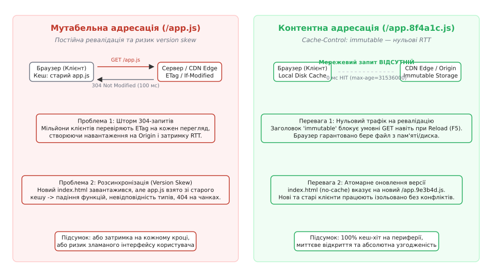
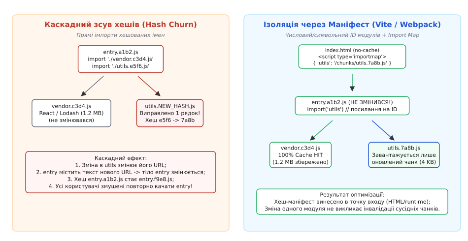
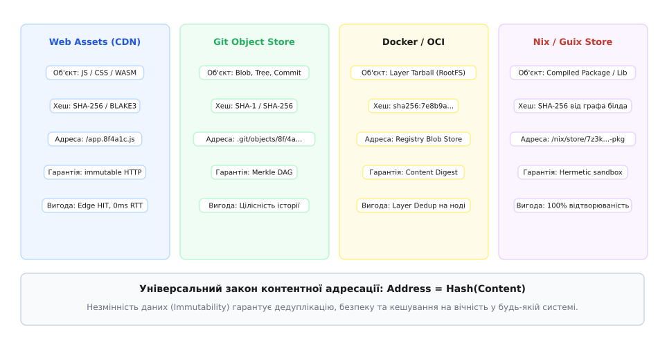
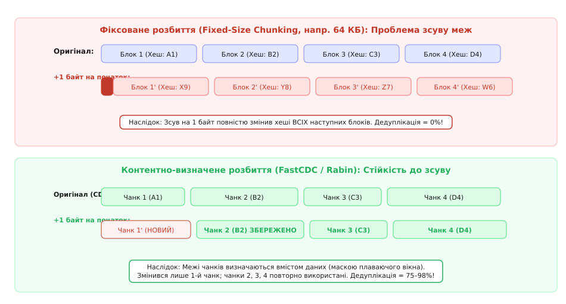

# Незмінна статика: відбиток вмісту в адресі

<preknowlist>
- [Патерни кешування](topic:programming/caching-strategies) — кешування на клієнті та проміжних проксі, стратегії витіснення й час життя записів.
- [Патерни інвалідації кешу](topic:programming/cache-invalidation-patterns) — активне очищення, сурогатні ключі (Cache-Tags) та проблема другого джерела правди.
- [Мережі доставки вмісту (CDN)](topic:programming/cdn) — периферійні вузли, термінація з'єднань, кешування статичних ресурсів на Edge.
- [Фільтр Блума (Bloom Filter)](topic:programming/bloom-filter-in-hardware) — властивості односторонніх функцій, стійкість до колізій та фіксований розмір дайджесту.
- [Дизайн ключів кешування](topic:programming/cache-key-design) — формування однозначних ключів та уникнення колізій просторів імен.
</preknowlist>

О 14:00 інтернет-магазин із мільйоном активних сесій розгортає нову версію фронтенду. У старому бандлі `app.js` модуль кошика викликав функцію `calculateTotal(items)`, а в новому — `calculateTotal(items, currency, discount)`. Сервер оновлює файли на диску за фіксованими шляхами `/static/app.js` та `/static/cart.js`, налаштованими зі стандартним HTTP-заголовком `Cache-Control: max-age=3600`. 

Протягом наступних двадцяти хвилин служба підтримки отримує тисячі звернень про збій оплати: у користувачів, чий браузер уже завантажив оновлений HTML, але зберіг у дисковому кеші старий `app.js`, виникає аварійна помилка виконання `TypeError: undefined is not a function`. Водночас у користувачів зі старим HTML завантажується новий `cart.js`, де очікується інший набір параметрів. 

Якщо ж команда намагається запобігти такій розсинхронізації, встановивши `Cache-Control: no-cache` для всіх статичних ресурсів, кожен перегляд сторінки мільйоном покупців генерує шторм із 40–60 умовних HTTP-запитів `If-None-Match`. Сервери джерела (Origin) перевантажуються перевіркою `ETag` для повернення статусів `304 Not Modified`, а користувачі втрачають сотні мілісекунд корисної мережевої затримки (RTT) на кожній сторінці.

Ця криза не узгоджується з традиційною моделлю файлових систем, де файл ідентифікується місцем його розміщення (Location Addressing). Єдиним архітектурним вирішенням цієї суперечності є перехід до контентної адресації — CAS (англ. *Content-Addressable Storage*, від лат. *continere* — містити та *ad* + *dirigere* — спрямовувати), де унікальна адреса ресурсу жорстко визначається криптографічним відбитком (англ. *fingerprint*) його власного вмісту.


*Зіставлення моделей доставки статики: мутабельні адреси генерують шторми 304-запитів та призводять до розсинхронізації версій, тоді як контентна адресація гарантує миттєвий 0 мс кеш-хіт і повну узгодженість.*

---

### Принцип контентної адресації (CAS): від місця до суті

Традиційна адресація веб-ресурсів та файлів у класичних операційних системах спирається на просторове або ієрархічне розміщення:
```
https://cdn.example.com/assets/scripts/main.js
/var/www/html/bundle.js
```

Такий URL описує виключно те, **де** лежить ресурс, але нічого не повідомляє про те, **що саме** в ньому записано. Якщо файл за цією адресою змінюється, адреса залишається незмінною. Це створює фундаментальний розрив між ідентифікатором та станом: система кешування не може знати, чи відповідає копія в локальній пам'яті поточному стану на сервері, без додаткового звернення до авторитетного джерела.

Контентна адресація кардинально змінює цей базис: адреса ресурсу формується шляхом обчислення детермінованої криптографічної хеш-функції над послідовністю його байтів:

```
Адреса = Базовий_шлях + "/" + Назва + "." + Хеш(Вміст) + "." + Розширення
```

Наприклад, якщо файл `main.js` містить певний скомпільований код, його криптографічний дайджест SHA-256 дорівнює `8f4a1c9b...`, і його адресою стає:
```
https://cdn.example.com/assets/main.8f4a1c9b.js
```

Фундаментальний інваріант контентної адресації формулюється так: **однаковий вміст завжди породжує однакову адресу, а зміна хоча б одного біта інформації неминуче породжує іншу адресу**.

```
Вміст_A = Вміст_B  ==>  Адреса(Вміст_A) ≡ Адреса(Вміст_B)
Вміст_A ≠ Вміст_B  ==>  Адреса(Вміст_A) ≠ Адреса(Вміст_B)
```

З цього інваріанта випливають чотири системні властивості:

1. **Абсолютна незмінність (Immutability, від лат. *immutabilis* — незмінний):** Ресурс за адресою `main.8f4a1c9b.js` не може бути модифікований або перезаписаний. Якщо розробник виправляє друкарську помилку або змінює логіку компонента, створюється абсолютно новий ресурс із новою адресою `main.3e7d2a1f.js`. Старий файл залишається незмінним.
2. **Посилання за значенням (Referential Transparency):** Посилання на контентну адресу еквівалентне володінню самими даними. У системі зникає невизначеність часу читання: звернувшись за адресою через секунду, день або рік, клієнт гарантовано отримає той самий набір байтів.
3. **Автоматична дедуплікація (Deduplication, від лат. *de-* — скасування та *duplicare* — подвоювати):** Якщо десять різних сервісів або сторінок компілюють однакову версію бібліотеки (наприклад, React 18.2.0), вона отримає ідентичний хеш і займе рівно один слот у кеші CDN та сховищі об'єктів.
4. **Самоверифікація цілісності (Self-Verification):** Клієнт або проміжний проксі-вузол може перевірити автентичність даних без звернення до центрального сертифікаційного центру: достатньо обчислити хеш від отриманого тіла байтів і звірити його з URL.

Історичний шлях розвитку цих ідей — від системного архіву Venti у лабораторіях Bell Labs до промислових сховищ EMC Centera та розподіленого графа Git — детально простежено в [історії виникнення контентної адресації та стандартизації незмінного вебу](topic:programming/content-addressed-assets/hist-cas-origins.md).

---

### Чому умовні запити ETag деградують на масштабі

До масового переходу на CAS веб-системи намагалися вирішувати проблему свіжості через умовні HTTP-заголовки валідації: `Last-Modified` з `If-Modified-Since` та `ETag` з `If-None-Match`.

У розподіленому середовищі з багатьма серверами ці механізми стикаються з трьома непереборними обмеженнями:

1. **Неузгодженість годинників та файлових дескрипторів:** Заголовок `Last-Modified` спирається на системний час модифікації файлу (`mtime`). Коли один і той самий бандл розгортається на кластері з 50 серверів, мікросекундні розбіжності системних годинників або неоднаковий час копіювання файлу на диск створюють різні значення `Last-Modified`. Клієнт, потрапляючи через балансувальник на іншу ноду, отримує хибні перезавантаження замість кеш-хіта.
2. **Формування ETag у кластерах:** За замовчуванням багато веб-серверів (зокрема Apache і Nginx) формують `ETag` як комбінацію трьох параметрів: номера іноди на диску (`inode`), розміру файлу та `mtime`. Оскільки на різних серверах один і той самий файл має різні номери `inode`, значення `ETag` між нодами кластера не збігаються, зводячи ефективність кешування нанівець.
3. **Накладні витрати мережевого обігу (RTT Overhead):** Навіть якщо `ETag` налаштовано правильно (як хеш від вмісту), умовний запит змушує клієнт встановити з'єднання (або використати наявне) і передати повні HTTP-заголовки. На трансконтинентальних маршрутах із затримкою RTT 100–180 мс очікування відповіді `304 Not Modified` додає секунди до часу відтворення сторінки (First Contentful Paint), попри те, що самі дані не передаються.

---

### Архітектура HTTP-кешування: розщеплення точок входу та асетів

Впровадження контентної адресації докорінно змінює дизайн HTTP-заголовків веб-додатку. Уся система розділяється на дві суворо розмежовані категорії ресурсів:

```
                  ┌───────────────────────────────────────────────┐
                  │                 Веб-додаток                   │
                  └───────────────────────┬───────────────────────┘
                                          │
                 ┌────────────────────────┴────────────────────────┐
                 ▼                                                 ▼
   ┌───────────────────────────┐                     ┌───────────────────────────┐
   │ Точка входу (Entrypoint)  │                     │ Незмінні асети (Assets)   │
   │ HTML, SSR-відповіді, SW   │                     │ JS, CSS, WASM, WebP, WOFF2│
   ├───────────────────────────┤                     ├───────────────────────────┤
   │ Мутабельний URL: /        │                     │ CAS URL: /app.8f4a1c.js   │
   │ max-age=0, must-revalidate│                     │ max-age=31536000,immutable│
   │ Завжди свіжа точка правди │                     │ 100% локальний кеш-хіт    │
   └───────────────────────────┘                     └───────────────────────────┘
```

#### 1. Незмінні асети (Fingerprinted Assets)
Для всіх файлів, назви яких містять хеш вмісту (JavaScript-чанки, CSS-таблиці, зображення, векторна графіка, шрифти, WASM-модулі), сервер віддає максимально агресивний заголовок кешування:

```http
HTTP/1.1 200 OK
Content-Type: application/javascript; charset=utf-8
Cache-Control: public, max-age=31536000, immutable
ETag: "8f4a1c9b"
```

Значення `max-age=31536000` (один рік у секундах) вказує браузеру та проміжним вузлам зберігати файл у кеші практично назавжди.

Критичним елементом тут є директива `immutable`, стандартизована в RFC 8246. Без директиви `immutable` стандартний механізм браузера при звичайному оновленні сторінки користувачем (F5 або комбінація `Cmd+R`) надсилає на сервер умовний HTTP-запит `GET` із заголовком `If-None-Match: "8f4a1c9b"`. Браузер перевіряє, чи не змінився файл, отримує у відповідь `304 Not Modified` і витрачає час кругового обігу пакетів (RTT).

Директива `immutable` повністю блокує ці запити. Вона гарантує рушію браузера: доки не спливе `max-age`, ресурс за цим URL не зміниться за жодних умов. Браузер миттєво піднімає файл із пам'яті (Memory Cache) або локального NVMe-диска (Disk Cache) за 0 мілісекунд, не торкаючись мережевого сокета.

#### 2. Мутабельні точки входу (Entrypoints)
Файли, до яких користувач звертається напряму — насамперед кореневий HTML-документ (`/index.html`), конфігураційні маніфести та Service Worker (`/sw.js`), — **не можуть мати хеш у своєму URL**, оскільки користувач вводить у браузер постійний домен `https://example.com/`.

Для точок входу встановлюється діаметрально протилежний режим кешування:

```http
HTTP/1.1 200 OK
Content-Type: text/html; charset=utf-8
Cache-Control: public, max-age=0, must-revalidate
ETag: W/"v2.4.1-html-hash"
```

Директива `max-age=0, must-revalidate` (або її синонім `no-cache`) наказує браузеру: HTML можна зберегти локально, але **перед кожним відображенням обов'язково виконати валідацію на сервері**.

#### Механізм миттєвого атомарного релізу
Коли користувач відкриває сайт:
1. Браузер робить швидкий запит за легковагим HTML-документом (кілька кілобайтів).
2. Якщо на сервері розгорнуто нову версію, сервер повертає свіжий HTML, у тілі якого прописано нові контентні адреси:
   ```html
   <link rel="stylesheet" href="/assets/styles.9e3b4d.css">
   <script type="module" src="/assets/app.7a1b2c.js"></script>
   ```
3. Браузер парсить HTML і виявляє нові URL. Він завантажує лише ті файли, яких ще немає в його локальному сховищі. Усі незмінені модулі (наприклад, важкий бандл вендорів `vendor.d4c3b2.js` на 2 МБ) беруться зі старого локального кешу, оскільки їхній хеш не змінився.
4. Якщо ж на сервері нічого не змінювалося, сервер миттєво повертає `304 Not Modified`, і браузер рендерить сторінку з наявного HTML-кешу.

Повний перелік HTTP-заголовків, статусів відповідей та стандартизовану схему маніфесту асетів систематизовано у [довіднику специфікації контрактів CAS, OCI та ідентифікаторів CID](topic:programming/content-addressed-assets/api-cas-storage-contract.md).

---

### Взаємодія з CDN та ліквідація операцій Purge

У традиційній архітектурі з мутабельними статичними файлами розгортання релізу вимагає обов'язкової інвалідації кешу на периферійних серверах CDN (операція *Cache Purge* або *Invalidation*).

```
Традиційний реліз з Purge:
[Деплой коду] ──> [API виклик: CDN Purge /*] ──> [Очікування розповсюдження 1-5 хв] ──> [Cache Stampede на Origin]
```

Цей процес має три критичні вразливості:
- **Затримка розповсюдження інвалідації:** Очищення сотень Edge PoP по всьому світу займає від 30 секунд до 5 хвилин. У цей період різні периферійні вузли віддають різним клієнтам суміш старих і нових файлів, викликаючи збої інтерфейсу.
- **Шторм запитів до джерела (Cache Stampede / Thundering Herd):** Після повного скидання кешу перший мільйон користувачів одночасно звертається до CDN. На всіх Edge-вузлах фіксується промах кешу (Cache Miss), і шквал паралельних запитів пробиває Origin-сервери, що нерідко призводить до відмови в обслуговуванні.
- **Вартість та ліміти API:** Провайдери CDN обмежують частоту викликів API інвалідації або стягують за них додаткову плату.

Контентна адресація повністю ліквідує потребу в операціях Cache Purge:

```
Реліз у моделі CAS:
[Завантаження нових файлів на S3/CDN] ──> [Атомарне оновлення index.html] ──> [100% узгодженість без Purge]
```

Оскільки нові версії файлів мають нові імена, вони записуються у сховище поруч зі старими (*side-by-side deployment*). CDN нічого не видаляє і не скидає:
- Старі клієнти продовжують безпечно читати старі хешовані файли зі 100% кеш-хітом.
- Нові клієнти, отримавши новий `index.html`, запитують нові хешовані URL. 
- На периферії CDN старі та нові версії співіснують природно. Коефіцієнт попадання в кеш (Cache Hit Ratio) на Edge-серверах стабільно перевищує 99.5%, а навантаження на джерело залишається близьким до нуля.

---

### Граф модулів, збирачі та проблема каскадної інвалідації (Hash Churn)

У сучасних веб-додатках тисячі вихідних модулів TypeScript/JavaScript за допомогою збирачів (Webpack, Vite, Rollup, Turbopack, esbuild) трансформуються у граф чанків. Формування відбитків усередині такого графа наражається на проблему каскадного зсуву хешів (*Cascade Hash Invalidation* або *Hash Churn*).


*Механізм каскадного тремтіння хешів: прямі текстові імпорти хешованих файлів змушують оновлювати весь ланцюг батьківських модулів; вирішення досягається через винесення карти імпортів у маніфест.*

Розглянемо ланцюг залежностей трьох модулів:
```
entry.js ──> dashboard.js ──> formatCurrency.js
```

Якщо розробник виправляє помилку у функції `formatCurrency.js`, байти цього файлу змінюються. Його хеш змінюється з `a1` на `a2`, утворюючи файл `formatCurrency.a2.js`.

Якщо модуль `dashboard.js` містить пряму інструкцію імпорту:
```javascript
import { formatCurrency } from './formatCurrency.a2.js';
```
то сам текст файлу `dashboard.js` змінився (замість рядка `a1` у ньому з'явився рядок `a2`). Відповідно, змінюється хеш `dashboard.js` (стає `b2`). Це, своєю чергою, змінює текст кореневого модуля `entry.js` (стає `c2`).

У результаті зміна одного рядка в глибокому допоміжному модулі призводить до повної інвалідації кешу абсолютно всіх модулів додатку. Мільйони клієнтів змушені заново завантажувати мегабайти незміненого коду.

#### Рішення: Детерміновані ID та винесення маніфесту
Сучасні системи збирання розривають цей каскад за допомогою трирівневої ізоляції:

1. **Детерміновані ідентифікатори модулів (Deterministic Module IDs):** Замість числових індексів або фізичних шляхів модулі всередині збірки ідентифікуються стабільними хешами відносного шляху вихідного коду (наприклад, 4-значними хешами `xxhash`).
2. **Розмежування типів хешів у збирачі:**
   - `[fullhash]` — хеш усього процесу компіляції (заборонений для продакшн-чанків, оскільки змінюється при будь-якому читанні конфігурації чи зміні дати збірки).
   - `[chunkhash]` — хеш вхідної точки з урахуванням усього підграфа (використовується для групування зв'язаних модулів).
   - `[contenthash]` — строгий хеш фінальних скомпільованих та мінімізованих байтів конкретного вихідного файлу після вилучення рантайм-коду.
3. **Вилучення середовища виконання (Runtime Chunk / Import Map):** Таблиця відповідності між логічними ідентифікаторами модулів та їхніми хешованими URL виноситься в окремий крихітний чанк `runtime.js` або безпосередньо вбудовується в HTML у вигляді нативного веб-стандарту `<script type="importmap">`:

```html
<script type="importmap">
{
  "imports": {
    "formatCurrency": "/assets/formatCurrency.a2f81c.js",
    "dashboard": "/assets/dashboard.99d3e4.js",
    "vendor": "/assets/vendor.77a1b0.js"
  }
}
</script>
```

Модуль `dashboard.js` містить лише абстрактний виклик `import('formatCurrency')`. Його власні байти не змінюються, його хеш залишається `99d3e4`, і він береться зі 100% клієнтського кеш-хіта. Змінюється лише відповідний рядок у маніфесті, який завантажується разом із некешованим HTML.

Працюючий вихідний код контентно-адресованого репозиторію з атомарним записом, верифікацією та конвеєром збирання наведено у [проекті реалізації CAS-сховища та пайплайну збирання статики](topic:programming/content-addressed-assets/proj-cas-bundler.md).

---

### Контентна адресація у розподілених системах та інфраструктурі

Принцип CAS є універсальним інженерним шаблоном, що лежить в основі надійності сучасного системного та розподіленого програмного забезпечення.


*Контентна адресація як спільний фундамент розподілених систем: єдиний інваріант Address = Hash(Content) у веб-асетах, системі Git, контейнерах OCI та пакетному менеджері Nix.*

#### 1. Об'єктне сховище Git (Merkle DAG)
У Git кожен об'єкт — це файл у каталозі `.git/objects/`, адресований за першими двома символами шістнадцяткового SHA-1 або SHA-256 хешу (наприклад, `.git/objects/8f/4a1c9b...`). 

Усі сутності проєкту декомпонуються на 4 примітиви:
- `blob` — тіло файлу;
- `tree` — список записів із правами доступу, іменами файлів та хешами відповідних `blob` або піддерев `tree`;
- `commit` — метадані автора, повідомлення, хеш кореневого `tree` та хеші батьківських комітів;
- `tag` — посилання на конкретний коміт.

Завдяки CAS злиття гілок (*merge*) та порівняння дерев (*diff*) виконуються за частки мілісекунди: якщо два дерева каталогів мають однаковий хеш, Git миттєво знає, що тисячі вкладених файлів і папок є абсолютно ідентичними, не читаючи жодного байта з диска.

#### 2. Контейнерні образи Docker та специфікація OCI
Образ контейнера в OCI (Open Container Initiative) складається з маніфесту та набору шарів файлової системи (*Layers*). Кожен шар упаковується в архів `tar.gz` і адресується за його дайджестом:

```
sha256:7f8a9e1d2c3b4a5f6e7d8c9b0a1f2e3d4c5b6a7f8e9d0c1b2a3f4e5d6c7b8a9f
```

Коли нода Kubernetes завантажує новий образ додатку, демон контейнеризації перевіряє локальне сховище. Якщо базовий шар Ubuntu або Node.js уже присутній на ноді (навіть якщо він належить іншому образу чи іншому проєкту), нода не завантажує ці 300 МБ через мережу. Виконується миттєве локальне зв'язування шарів через механізм OverlayFS.

#### 3. Герметичні системи збирання: Nix та Guix
Пакетні менеджери Nix та GNU Guix підносять контентну адресацію до рівня операційної системи. Кожен компільований пакет встановлюється в ізольований глобальний каталог:

```
/nix/store/7z3k9p8q7a1b2c3d4e5f6g7h8i9j0k1l-openssl-3.0.8/
/nix/store/9x2m1n0b8v7c6x5z4a3s2d1f0g9h8j7k-glibc-2.35/
```

Хеш у шляху формується з повного графа залежностей вихідного коду (Input-Addressed Derivation): вихідних файлів, точних прапорців компілятора, змінних середовища та хешів усіх залежних бібліотек. Якщо хоча б один біт у залежностях відрізняється, пакет компілюється в окремий каталог. Це усуває конфлікти версій (*DLL Hell*) та гарантує 100% бінарну відтворюваність збірок.

Еволюцією цього підходу у сучасних версіях Nix є перехід до Content-Addressed Derivations (CA Derivations, RFC 62): хеш каталогу виходу обчислюється не від вхідних специфікацій, а безпосередньо від отриманого бінарного результату. Якщо зміна коментаря у вихідному файлі C++ не змінила скомпільований машинний код, Nix зупиняє каскадну перебудову залежних пакетів (Early Cutoff).

#### 4. Децентралізовані сховища: IPFS та Content Identifiers (CID)
У розподіленій мережі IPFS замість доменних імен використовується самоописовий ідентифікатор CID (Content Identifier). CID поєднує в єдиному рядку версію протоколу, код формату серіалізації контенту (Multicodec) та сам криптографічний хеш (Multihash):

```
bafybeic56t6nn7r3zvd5jkvvj4e6k3o2p2l5b2p3j5e5d3c2b1a0f9e8d7
```

Запит на отримання файлу надсилається в розподілену геш-таблицю (DHT). Будь-який вузол мережі, що зберігає цей CID, може віддати байти. Клієнт самостійно обчислює хеш отриманих даних і верифікує їхню автентичність. Підробка або компрометація проміжного вузла стає неможливою: сфальсифіковані байти ніколи не зійдуться з контентним хешем.

---

### Блокова дедуплікація: фіксоване розбиття проти FastCDC

Коли контентна адресація застосовується до великих масивів даних (файлові системи ZFS, резервні копії Restic, BorgBackup, дедуплікація в об'єктних сховищах S3), виникає питання оптимального розбиття великих файлів на блоки.


*Вплив зсуву байтів на дедуплікацію: фіксовані блоки руйнують повторне використання хешів при найменшій вставці, тоді як контентно-визначені межі (CDC) локалізують зміну в межах одного чанка.*

1. **Фіксований крок (Fixed-size Chunking):** Файл розрізається на рівні шматки по 64 КБ або 1 МБ. Якщо користувач додає один байт на початок файлу розміром 10 ГБ, усі наступні межі блоків зміщуються на 1 байт. Усі хеші змінюються, і дедуплікація падає до 0%.
2. **Контентно-визначене розбиття (Content-Defined Chunking, CDC):** Межа блоку визначається не лічильником байтів, а вмістом даних у ковзному вікні за допомогою полінома Рабіна (*Rabin Fingerprint*) або алгоритму FastCDC. Коли значення хешу у вікні задовольняє певну бітову маску (`H mod 2^m == 0`), фіксується межа чанка.

Якщо додати байт на початок файлу в моделі CDC, зміниться лише перший чанк. Щойно ковзне вікно дійде до характерної послідовності незміненого тексту, воно відновить колишню межу, і всі наступні гігабайти блоків отримають старі ідентичні хеші. Коефіцієнт дедуплікації зберігається на рівні 95–99%.

Математичне виведення ймовірності колізій (парадокс днів народження для 128-, 160- та 256-бітних хешів) і строгий аналіз геометричного розподілу довжини чанків CDC викладено в [математиці колізій та ефективності дедуплікації в CAS](topic:programming/content-addressed-assets/math-collision-and-dedup.md).

---

### Експлуатаційні пастки, крайові випадки та ціна рішення

Попри бездоганну математичну модель, впровадження контентної адресації у промислову експлуатацію пов'язане з низкою прихованих пасток.

#### 1. Проблема «мертвої вкладки» (Zombie Tab / Stale Client Problem)
Користувач відкриває вкладку Single Page Application (SPA) у п'ятницю ввечері та залишає ноутбук відкритим. У суботу команда проводить реліз нової версії і за допомогою скрипта очищення видаляє старі JS-файли з S3/CDN.

У понеділок користувач повертається до браузера і натискає кнопку в інтерфейсі. Додаток намагається асинхронно завантажити динамічний модуль:
```javascript
const AdminPanel = await import('./chunks/admin.8f4a1c9b.js');
```
CDN повертає статус `404 Not Found`, оскільки старий файл видалено під час деплою. Веб-додаток падає з помилкою `ChunkLoadError`.

**Стратегії захисту:**
- **Вікно перекриття збереження (Retention Window):** Файли попередніх версій ніколи не видаляються синхронно з деплоєм. Старі асети зберігаються на CDN протягом мінімум 7–30 днів після випуску нової версії.
- **Автоматичне перехоплення та перезавантаження (ChunkLoadError Boundary):** Глобальний обробник помилок у JavaScript-додатку відловлює помилки динамічного імпорту, перевіряє версію через швидкий запит до `index.html` і виконує примусове перезавантаження сторінки (`window.location.reload()`), оновлюючи кореневий маніфест.
- **Кешування Service Worker:** Service Worker перехоплює запити до старих чанків і може віддавати їх із власного локального кешу або коректно повідомляти користувача про необхідність оновлення інтерфейсу.

#### 2. Канаркові релізи та багатоверсійне співіснування
У складних розподілених системах нові релізи розгортаються не одномоментно, а канарочно (Canary Deployments) або через A/B-тестування: 5% користувачів спрямовуються на версію B, а 95% залишаються на версії A.

У традиційній системі з мутабельними URL такий підхід вимагає складного розщеплення шляхів або ізольованих піддоменів. У моделі CAS канарковий реліз реалізується елементарно:
- Обидва бандли (і версії A, і версії B) одночасно присутні у сховищі асетів CDN.
- Балансувальник навантаження або Edge Worker лише вирішує, яку саме версію HTML віддати конкретному користувачу: `index-v1.html` чи `index-v2.html`.
- Обидві групи користувачів отримують 100% кеш-хіти на периферії без найменшого конфлікту між версіями модулів.

#### 3. Нескінченне розростання сховища та збирання сміття (Garbage Collection)
Якщо ніколи не видаляти старі файли, контентно-адресоване сховище з сотнями щоденних збірок розростається до терабайтів за лічені місяці.

Видалення не можна проводити за датою останньої модифікації файлу (mtime), оскільки незмінений файл бібліотеки вендора `vendor.9e3b.js`, створений три місяці тому, може бути активним і необхідним прямо зараз у найсвіжішому релізі.

Єдиним надійним підходом є **Mark-and-Sweep Garbage Collection**:
1. Скануються кореневі точки входу (`index.html`, активні маніфести) за останні `K` днів або `N` останніх релізів.
2. Будується транзитивне замикання графа досяжності: усі хеші, на які є посилання, помічаються як живі (*Live Set*).
3. Усі блоби у сховищі CAS, яких немає у *Live Set*, безпечно видаляються фоновим процесом.

#### 4. Безпека: компрометація CDN та Subresource Integrity (SRI)
Якщо контентно-адресовані файли роздаються через сторонню CDN, зловмисник, отримавши доступ до периферійного сервера CDN, може підмінити вміст `app.8f4a1c9b.js`, впровадивши туди шкідливий код (XSS, викрадення кредитних карток). Браузер виконає цей скрипт, оскільки вважає адресу легітимною.

Для захисту від компрометації CDN контентна адресація поєднується зі стандартом **Subresource Integrity (SRI)**:
```html
<script 
  src="https://cdn.example.com/assets/app.8f4a1c9b.js"
  integrity="sha384-oqVuAfXRKap7fdgcCY5uykM6+R9GqQ8K/uxy9rx7HNQlGYl1kPzQho1wx4JwY8wC"
  crossorigin="anonymous">
</script>
```

Браузер, завантаживши скрипт із CDN, самостійно обчислює криптографічний хеш SHA-384 отриманого тіла байтів і звіряє його зі значенням в атрибуті `integrity`, отриманому з захищеного HTML-документа. Якщо CDN підмінила хоча б один символ, браузер блокує виконання скрипта і викидає виняток безпеки в консоль.

---

### Підсумковий баланс інженерних компромісів

| Характеристика | Мутабельна адресація (`/app.js`) | Контентна адресація (`/app.8f4a.js`) |
| :--- | :--- | :--- |
| **Кеш-політика асетів** | `no-cache` або короткий `max-age` | `public, max-age=31536000, immutable` |
| **Латентність перегляду** | 50–200 мс на умовні запити 304 RTT | **0 мс** (миттєве підняття з дискового кешу) |
| **Узгодженість версій** | Високий ризик розсинхронізації та збоїв | **100% атомарна ізоляція релізів** |
| **Навантаження на Origin** | Шторми запитів при кожному деплої | Мінімальне (запитується лише точка входу) |
| **Операції з CDN** | Повільний і дорогий Cache Purge | **Нульовий Purge** (паралельне зберігання) |
| **Складність конвеєра** | Мінімальна (копіювання файлів) | Висока (топологічний обхід графа, маніфести, GC) |

Контентна адресація переносить складність із площини рантайм-експлуатації (інвалідація кешів, аварійні збої клієнтів, перезавантаження серверів) у площину детермінованого збирання. Зв'язуючи адресу даних із їхнім криптографічним відбитком, розподілена система отримує математичну гарантію незмінності, що перетворює мережу доставки на стабільне, швидке та самоверифіковане сховище.
