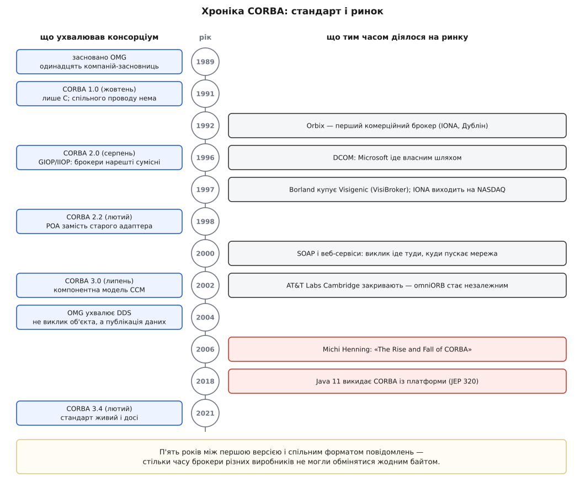

# 📜 Злет і падіння CORBA: хроніка стандарту, який ухвалювали раніше, ніж писали

CORBA не програла в чесному технічному змаганні — вона програла власному способу ухвалювати рішення, і хроніка з 1989 по 2021 рік показує це точніше за будь-який перелік вад. Нижче — дати, компанії й публічна сварка учасників, з позначкою біля кожного твердження: що звірене за джерелами, що є оцінкою зацікавленої сторони, а що я перевірити не зміг.

<preknowlist>
- [Виклик віддаленої процедури](topic:programming/rpc) — ідея змусити функцію виконатися в чужому процесі й дістати результат назад.
- [Прив'язка до платформи](topic:programming/vendor-lock-in) — ціна, яку платить покупець, коли єдиний постачальник володіє і продуктом, і форматом.
</preknowlist>



*Ліва колонка йде повільно й рівно, права — ривками. Ключовий проміжок видно одразу: перша версія стандарту і перший спільний формат повідомлень розділені п'ятьма роками, і весь цей час брокери продавали, купували й розгортали.*

## Одинадцять компаній, серед яких є авіакомпанія

Object Management Group заснували 1989 року — це число повторюють усі джерела, і його можна вважати твердим. Із поіменним списком гірше: усталено кажуть про **одинадцять** компаній-засновниць, але Вікіпедія, називаючи це число, перелічує лише сім імен — Hewlett-Packard, IBM, Sun Microsystems, Apple Computer, American Airlines, iGrafx і Data General. У ходових описах трапляються ще 3Com, Canon, Philips Telecommunications та Unisys; звірити ці чотири за первинним документом OMG мені не вдалося, тож поіменний список тут — слабке місце, а не встановлений факт. Сама ця розбіжність показова: організацію запам'ятали за наслідками, а не за протоколом установчих зборів.

Але навіть у безсумнівній частині списку є деталь, варта окремої уваги. **American Airlines не продає програмного забезпечення.** Авіакомпанія опинилася серед засновників консорціуму, що мав описати міжпрограмну взаємодію, з боку покупця — і це пояснює, навіщо консорціум узагалі знадобився. Наприкінці 1980-х велика компанія мала десятки систем від різних постачальників, і кожна пара мусила з'єднуватися окремою саморобною ниткою. Купити готовий засіб інтеграції в одного виробника означало віддати йому ключ від власної внутрішньої архітектури — саме та [прив'язка до платформи](topic:programming/vendor-lock-in), від якої великий покупець тікає найдужче. Спільний стандарт, який зобов'язані підтримувати кілька конкурентів, — єдина відома відповідь на це.

Так у самій ДНК CORBA опинилася вимога, яка згодом виявилася смертельною: **жоден учасник не мав права програти голосування настільки, щоб піти геть.** Стандарт мусив улаштовувати всіх, хто сидів за столом.

За тим столом бракувало одного гравця. Microsoft пішла власним шляхом — DCOM, розширення COM на мережу, публічно вийшло бета-версією для Windows 95 **18 вересня 1996 року** (дата звірена). Два табори років десять описували себе як дві можливі майбутні основи для повторного вживання коду через мережу, і жоден із них зрештою не виграв.

## П'ять років, поки брокери не могли сказати одне одному нічого

Ланцюг версій звірено за таблицею історії CORBA; дати подаю так, як їх фіксують джерела.

```
жовтень 1991   CORBA 1.0   перша версія; відображення лише на C
лютий   1992   CORBA 1.1   IDL і програмні інтерфейси; відображення на C++
серпень 1996   CORBA 2.0   GIOP/IIOP — спільний формат повідомлень
лютий   1998   CORBA 2.2   відображення на Java; POA
липень  2002   CORBA 3.0   компонентна модель CCM
лютий   2021   CORBA 3.4   анотації; чинна редакція
```

Найважливіше в цій таблиці — не рядки, а **проміжок між першим і третім**. Версія 1.0 описала мову контракту й поведінку брокера, але не сказала жодного слова про те, які байти летять проводом. Наслідок арифметичний: із жовтня 1991 по серпень 1996 два продукти могли обидва чесно називатися реалізаціями CORBA — і не мати ані найменшої змоги обмінятися повідомленням. Стандарт п'ять років гарантував **переносність коду**, а не **сумісність систем**, хоча купували його саме заради другого.

П'ять років — це не пауза в порожнечі. Перший комерційний брокер, Orbix, з'явився на ринку 1992 року, тобто за чотири роки до появи спільного проводу. На момент, коли IIOP нарешті став обов'язковою умовою називатися сумісним із CORBA 2.0, у світі вже стояли працюючі системи, зібрані з несумісних між собою реалізацій. Стандарт наздоганяв власний ринок — і надалі робив це щоразу.

## Ринок, який справді існував

CORBA не була папером. Гроші, компанії й люди за нею — цілком конкретні, і саме тому процесна вада виявилася невиліковною: кожен виробник приходив на голосування вже з проданим продуктом, який треба захистити.

**IONA Technologies** (Дублін) заснували 1991 року троє науковців із Триніті-коледжу — Кріс Горн (Chris Horn), Шон Бейкер (Sean Baker) та Аннрай О'Тул (Annrai O'Toole), склавши по тисячі ірландських фунтів початкового капіталу. Їхній Orbix вийшов 1992 року. IONA стала першою ірландською компанією, що вийшла на американську біржу NASDAQ, і той дебют, за її життєписом, був п'ятим за розміром в історії біржі на той час; пікова ринкова оцінка — **1.75 мільярда доларів**. (Рік виходу на біржу — 1997; сама дата в джерелі, яке я перевіряв, не наведена, тож беріть її як загальновідому, а не звірену.)

Кінець цієї арки вартий того, щоб побачити його числами поруч:

```
пік ринкової оцінки IONA           ≈ 1 750 000 000 $
продаж компанії Progress (2008)    ≈   162 000 000 $
продаж лінійки Orbix, Orbacus,
Artix компанії Micro Focus (2012)  ≈    15 000 000 $
```

Продуктова лінійка, що колись тримала багатомільярдну компанію, через двадцять років перейшла з рук у руки за суму, меншу за річний бюджет однієї середньої команди. Обидві останні цифри звірені.

**VisiBroker** компанії Visigenic був другим полюсом комерційного ринку. У листопаді 1997 року Visigenic купила Borland; у квітні 1998 Borland перейменувалася на Inprise (обидві дати звірені), і брокер об'єктних запитів кілька років подавали як серце корпоративної платформи цієї компанії.

Поруч ріс вільний бік, і він виявився витривалішим за комерційний. **TAO** (The ACE ORB) — дослідницький брокер групи Дугласа Шмідта (Douglas C. Schmidt), зроблений насамперед заради передбачуваних затримок, через що його брали в системи реального часу й вбудовані. **omniORB** розробив Дункан Ґрізбі (Duncan Grisby) у AT&T Laboratories Cambridge; коли 2002 року лабораторію закрили, проєкт став незалежним і живе далі — C++ і Python, здебільшого відповідність CORBA 2.6 (звірено за сайтом проєкту). **JacORB** дав те саме для Java.

Отже, картина 1998 року: кілька конкурентних реалізацій, спільний провід, справжні гроші, справжні розгортання в авіації, банках і телекомі. Технологія працювала. Ламалося те, як ухвалювали рішення про неї.

## Як саме ухвалювали

Механіка була така: OMG випускає запит на пропозиції, зацікавлені компанії подають свої, члени голосують. Дві властивості цієї механіки визначили все інше.

Перша — **що саме треба показати, щоб пропозицію ухвалили**. За описом самої OMG, від команди-подавача вимагали зобов'язання вивести на ринок відповідний продукт **протягом року після ухвалення**. Прочитайте це уважно: вимагали *обіцянки продукту*, а не *демонстрації працюючої реалізації в момент голосування*. Різниця не формальна. Коли специфікацію ухвалюють після того, як хтось її втілив, реальність устигає викреслити з неї те, що красиво лише на папері. Коли ухвалюють до того — у текст потрапляє все, що ніхто ще не спробував зламати.

Друга — **що робити з двома пропозиціями на те саме місце**. Голосування виробників має власну логіку: найдешевший спосіб зібрати більшість — не перемогти конкурента, а домовитися з ним і подати спільну редакцію. Спільна редакція майже завжди виходить об'єднанням можливостей обох, бо викидати чиюсь частину означає втратити його голос. Так у специфікації накопичуються механізми, у кожного з яких є свій автор і жодного — у цілого.

> 🔧 **Навіщо це.** З цієї історії випливає одне практичне питання, яке варто ставити будь-якому новому стандартові взаємодії, перш ніж будувати на ньому систему: **що саме треба було показати, щоб текст ухвалили** — обіцянку продукту чи дві незалежні реалізації, які на очах у всіх обмінялися повідомленням? Відповідь передбачає більше, ніж елегантність специфікації. Стандарт, куди вимога взаємної сумісності вбудована в саму процедуру ухвалення, доводиться читати рідше, бо він частіше просто працює.

Перший великий рахунок за цю процедуру виставила серверна половина. Ранній адаптер об'єктів описали настільки нечітко, що серверний код доводилося переписувати під кожного виробника. Заміну — **POA**, переносний адаптер об'єктів — увели у версії 2.2 в лютому 1998 року. (Тут одна обережність: таблиця версій, яку я звіряв, позначає 2.2 передусім відображенням на Java; поява POA саме в 2.2 — усталений виклад літератури про CORBA, і одне одному не суперечить, бо версія несла обидва.) Вийшло, що **сім років після 1.0** серверна половина стандарту не була переносною — і на момент, коли її полагодили, у всіх уже лежали кодові бази, написані під старий адаптер конкретного постачальника.

## Компонент, що спізнився

CORBA 3.0 вийшла в липні 2002 року і принесла компонентну модель CCM — спробу описати не лише виклик, а й контейнер, у якому об'єкт живе: розгортання, налаштування, життєвий цикл. Задум розумний, момент — програний. На той час світ Java вже кілька років жив із власною компонентною моделлю, а Microsoft того самого 2002 року випустила .NET. Специфікація відповіла на питання, на яке ринок відповів раніше й без неї; повних реалізацій CCM практично не з'явилося.

Це та сама вада, показана в масштабі цілої версії. Процедура, що вимагає домовленості всіх, працює повільно за побудовою — а швидкість ухвалення рішень і є те, чим стандарт конкурує з чужим продуктом.

## Сварка учасників (2006)

Найвідоміший текст про кінець CORBA написав Мікі Геннінґ (Michi Henning) — «The Rise and Fall of CORBA», ACM Queue, 2006. Його право говорити підтверджене: **з 1995 по 2002 рік він працював над CORBA як член архітектурної ради OMG** (звірено). Він же — співавтор канонічної книжки про програмування CORBA на C++.

Його претензії лягають у два шари. Технічний: роздуті й непослідовні інтерфейси — за його оцінкою, на опис адаптера об'єктів пішло понад **двісті рядків** там, де вистачило б близько **тридцяти**; відображення на C++ із пастками в керуванні пам'яттю; відсутність убудованих засобів захисту й версіонування. Наголошу на статусі цього числа: **це оцінка учасника у полемічній статті, а не незалежний вимір** — самої публікації я не зміг відкрити для звіряння через платний доступ, тож числа подаю так, як їх переказує вторинна література.

Другий шар глибший і стосується рівно того, про що йшлося вище: не якості тексту, а процедури, яка цей текст породжує.

Публічна відповідь існує, і її корисно прочитати саме як другу сторону. На сайті Дугласа Шмідта у Вандербілтському університеті лежить сторінка «Response to "The Rise and Fall of CORBA"» — прямий і поіменний відгук на статтю. (Одразу про статус: сторінка не має підпису автора, тож приписувати авторство конкретній людині я не буду; певне лише те, що вона розміщена на сайті Шмідта.) Її аргументи: консорціумний стандарт справді виходить брудніший, але живучіший за рішення одного постачальника, і сам Геннінґ колись писав, що не хотів би бути в такого постачальника на ласці; проблеми з .NET і мережевими екранами закривали окремі рішення; за швидкістю CORBA виграє у SOAP; засоби захисту в специфікаціях є; специфікації взагалі писані для виробників брокерів, а не для прикладних програмістів, тому міряти їх складністю для останніх нечесно; а розгортань в авіації, фінансах і телекомі на той момент більше, ніж у найкращі роки.

Тепер найважливіше для чесного читання цієї сварки: **зацікавлені обидві сторони.** Геннінґ на момент публікації був головним науковцем компанії ZeroC (заснована 2002 року) і відповідав за розробку її системи Ice — тобто конкурентного засобу міжпрограмної взаємодії (звірено). Шмідт — автор TAO, тобто людина, чия праця десятиліття будувалася довкола CORBA. Це не робить жодного з них нещирим, але означає одне: перед нами **суперечка учасників, а не вимір**. Твердою в ній є хіба та частина, де сторони не сперечаються: обидві погоджуються, що специфікації складні, — і розходяться в тому, кому й чого це коштувало.

## Чим усе скінчилося на папері

Витіснення відбулося не через якість. SOAP, а згодом і звичайний [HTTP](topic:programming/http) із текстовими тілами, були багатослівніші й повільніші — і виграли, бо розгорталися там і тоді, де брокер об'єктних запитів вимагав окремих перемовин. Це визнає навіть стороння оцінка тієї епохи: у Вікіпедії про DCOM про обидва табори, CORBA й DCOM, сказано просто — труднощі з роботою через мережеві екрани призвели до того, що звичайні HTTP-запити разом із браузерами перемогли обох. Механіку самої заміни розібрано в [SOAP і веб-сервісах](topic:programming/soap-web-services).

Формальний кінець добре видно за однією платформою. Java 9 (вересень 2017) оголосила модулі CORBA і Java EE застарілими, а Java 11 (25 вересня 2018) вилучила їх — рішенням **JEP 320**. Формулювання самої заявки варте цитати за змістом: **окремої, самостійної версії CORBA не буде, якщо треті сторони не візьмуть на себе супровід** інтерфейсів, реалізації брокера й служби імен. Причина названа прямо: стандарт належить OMG, а не JDK, тож платформа не може ані розвивати його, ані відповідати за нього.

Сам же стандарт нікуди не подівся: чинна редакція CORBA 3.4 датована лютим 2021 року. Живий текст, майже мертвий ужиток.

І тут — найнесподіваніша частина хроніки. Консорціум пережив свій флагман. OMG нараховує понад 260 специфікацій, п'ятнадцять із яких ухвалено як стандарти ISO, і тримається сьогодні зовсім не на віддаленому виклику: UML і SysML — мови моделювання; BPMN — опис бізнес-процесів; DDS — обмін даними, першу версію якого OMG опублікувала 2004 року (усі чотири напрямки звірено за матеріалами самої OMG). DDS показовий особливо: це знову міжпрограмна взаємодія, знову від тієї самої організації — але побудована на протилежному припущенні. Там немає віддаленого об'єкта, якому дзвонять; є дані, які публікують у теми, і той, кому вони потрібні, читає їх сам.

Організація, створена 1989 року, щоб змусити чужі об'єкти відповідати на виклик, у 2020-х живе зі стандартів, де виклику немає взагалі. Пережила не технологія й не архітектура — пережила звичка кількох конкурентів сідати за один стіл. Саме та звичка, яка колись і зробила специфікацію нездоланно складною.
