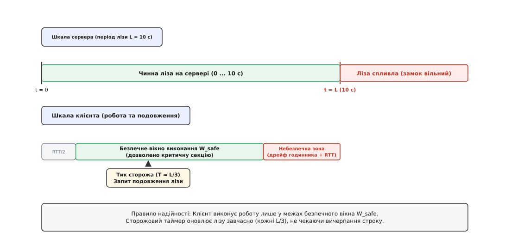
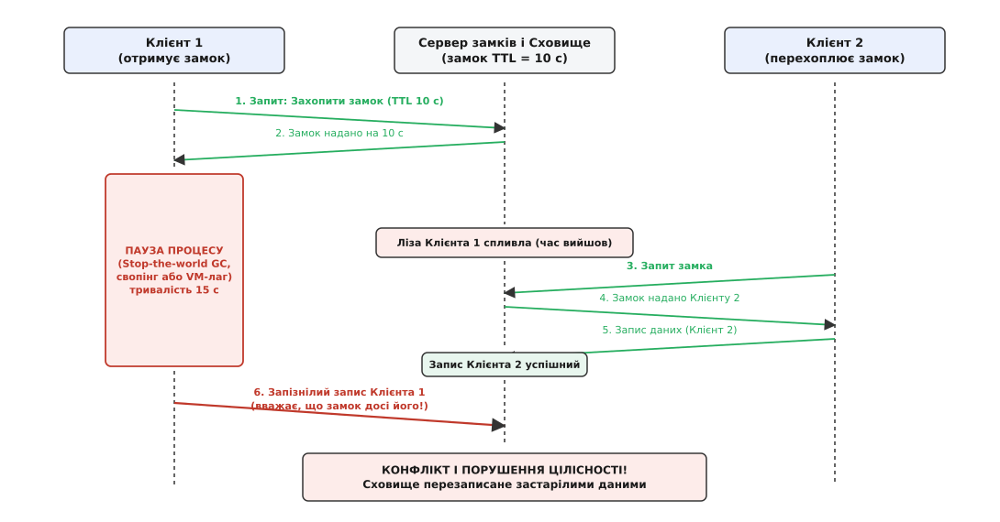
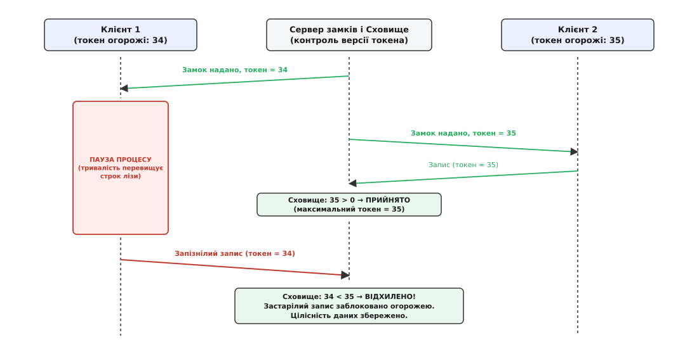
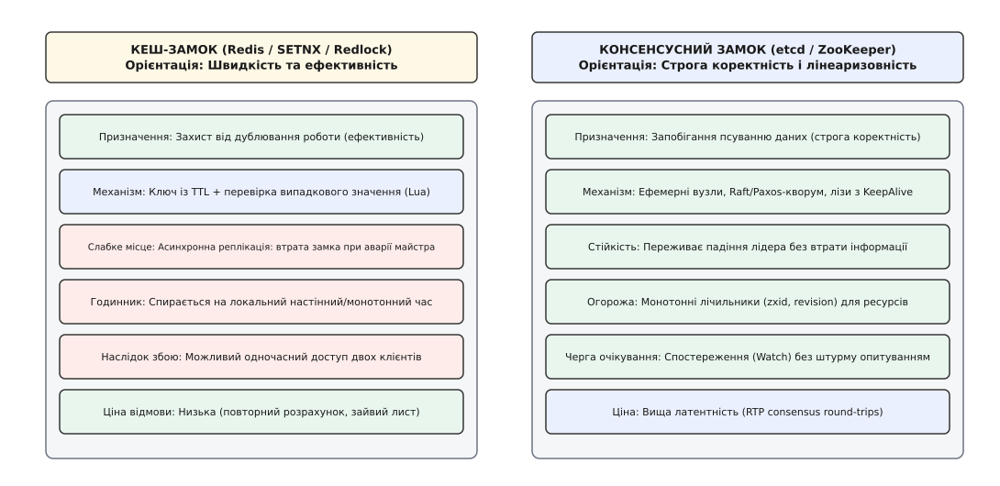

# Розподілені замки й лізи: взаємне виключення без спільної пам'яті

<preknowlist>
- [Омани розподілених обчислень](topic:programming/distributed-fallacies) — мережа губить і затримує повідомлення, а вузол може зависнути або впасти без жодного попередження; часткова відмова тут норма, а не аварія.
- [М'який стан](topic:programming/soft-state) — стан без оновлення розпливається сам; оренда ресурсу спирається на часове обмеження, а не на обіцянку звільнити.
- [Монотонний проти настінного часу](topic:programming/monotonic-vs-wall-time) — інтервали й дедлайни вимірюють лише монотонним таймером, бо настінний годинник між машинами не синхронний і може стрибати назад чи вперед.
- [Виявлення відмов](topic:programming/failure-detection) — неможливо локально відрізнити вмерлий процес від процесу, що надовго завмер у паузі збирача сміття чи перевантаження.
</preknowlist>

Два фонові воркери розподіленої білінгової системи одночасно отримують завдання оновити баланс одного й того самого користувача. Початковий баланс у спільній базі даних становить $1000. Перший воркер читає це число, планує списати $800 і починає перевірку транзакції через зовнішній банківський шлюз. У цей самий момент віртуальна машина першого воркера потрапляє у тридцятисекундну паузу Stop-the-world збирача сміття або зависає через витіснення пам'яті у swap на повільному диску. Поки перший воркер «спить», другий воркер читає той самий початковий баланс $1000, списує $700 і успішно фіксує в базі новий залишок $300. Коли перший воркер нарешті прокидається, він не підозрює, що минув час: його локальний потік продовжує виконання, обчислює свій залишок як $1000 − $800 = $200 і записує його у базу, безповоротно затираючи результат транзакції другого воркера. Компанія втратила $700, а база даних отримала некоректний стан лише через те, що два вузли одночасно вважали себе єдиними господарями одного ресурсу.

## Чому звичайний м'ютекс ядра безсилий у мережі

На рівні однієї операційної системи взаємне виключення (англ. *mutual exclusion*) забезпечується апаратними інструкціями процесора та структурами ядра ОС. Коли кілька потоків змагаються за звичайний м'ютекс (англ. *mutex*, від *mutual exclusion* — «взаємне виключення»):

1. **Спільна пам'ять і кеш-когерентність**: процесор виконує атомарні інструкції порівняння з обміном (англ. *Compare-And-Swap*, CAS) безпосередньо над лінійкою фізичної пам'яті. Шинний протокол кеш-когерентності гарантує, що всі ядра процесора бачать стан замка миттєво та узгоджено.
2. **Єдиний арбітр і захист від смерті**: операційна система відстежує стан кожного потоку. Якщо потік, який утримував м'ютекс, зазнає фатального збою (`SIGSEGV` чи `abort`), ядро негайно звільняє замок або переводить його в аварійний стан (*robust mutex*), запобігаючи вічному блокуванню.
3. **Єдиний еталон часу**: монотонний лічильник тактів процесора (TSC) є спільним для всіх ядер одного кристала, тому поняття «минуло 5 секунд» інтерпретується всіма потоками абсолютно однаково.

Коли процеси рознесені по різних серверах через локальну чи глобальну мережу, усі три опори зникають одночасно.

По-перше, **спільної пам'яті немає**. Будь-яка взаємодія перетворюється на передачу мережевих пакетів. Мережа є асинхронною: повідомлення можуть губитися, затримуватися на непередбачуваний час або доставлятися у зміненому порядку.

По-друге, **немає всевидючого арбітра**. Якщо віддалений вузол раптово знеструмили, операційна система інших серверів не отримує про це жодного сигналу. Для стороннього спостерігача вмерлий сервер виглядає так само, як сервер, який просто перевантажений або застряг у мережевому затишші. Якщо вузол захопив замок назавжди й раптово помер, уся система залишається паралізованою у вічному очікуванні (англ. *deadlock*).

По-третє, **фізичний час розходиться**. Кожен сервер має власний кварцовий генератор, який має температурний дрейф. Настінні годинники на різних машинах не йдуть синхронно і можуть стрибати вперед або назад під час коригування демоном NTP.

Звідси випливає фундаментальна вимога: розподілений замок не може бути безстроковим. Будь-яке право на ексклюзивне володіння ресурсом у розподіленій системі зобов'язане мати обмежений строк дії.

## Ліза: замок, який розпливається сам

Щоб вирішити проблему раптової смерті власника замка, механізм блокування інвертують: замок видають не назавжди, а на тимчасовий інтервал `L`. Таку тимчасову оренду ресурсу називають **лізою** або **орендою** (англ. *lease*, від латинського *laxare* через старофранцузьке *laissier* — «відпускати, надавати в користування»).

Ліза переводить стан замка у площину [м'якого стану](topic:programming/soft-state): право власності не лежить вічно, а вимагає регулярного активного підтвердження.

Механізм лізи спирається на такі правила:
1. Клієнт звертається до координатора замків (наприклад, etcd, ZooKeeper чи Redis) із запитом на оренду ресурсу на строк `L` (наприклад, 10 секунд).
2. Якщо ресурс вільний, координатор фіксує ідентифікатор клієнта і дедлайн за своїм локальним монотонним годинником: `deadline = now() + L`.
3. Доки дедлайн не минув, координатор відхиляє запити всіх інших претендентів.
4. Якщо клієнт успішно завершив роботу раніше строку, він надсилає запит добровільного звільнення (`release`), і замок стає вільним негайно.
5. Якщо клієнт раптово вмирає, зависає чи втрачає зв'язок, координатор не робить жодних активних дій. Він просто чекає спливання інтервалу `L`. Щойно час вийшов, замок вважається вільним, і наступний клієнт може безпечно його захопити.


*Життєвий цикл розподіленої лізи: координатор автоматично звільняє ресурс після вичерпання строку L, запобігаючи дедлоку, тоді як живий клієнт безперервно підтримує оренду через сторожовий таймер.*

Якщо клієнту потрібно утримувати замок довше за початковий строк `L` (наприклад, тривала пакетна обробка великого файлу), клієнт запускає фоновий потік — **сторожовий таймер** (англ. *watchdog timer* / *keep-alive*). Сторож періодично надсилає координатору запит на подовження лізи: `renew()`. 

Щоб випадкова втрата одного мережевого пакета не призвела до передчасного випаровування замка, період подовження обирають значно меншим за тривалість лізи: зазвичай `T_renew = L / 3` або `L / 4`. Це дає клієнту змогу повторити спробу 2–3 рази у разі виникнення мережевого збою, як це детально обґрунтовує [математичний аналіз безпечного вікна лізи та дрейфу годинників](topic:programming/distributed-locks/math-lease-expiry.md).

## Пастка локального часу: чому клієнт не знає, що ліза спливла

На перший погляд здається, що ліза повністю вирішує задачу взаємного виключення. Проте саме тут прихована найнебезпечніша пастка розподілених систем, яка десятиліттями породжувала важковловимі баги у промисловому софті.

Уявімо наївну логіку клієнта:
```text
1. Отримати замок на строк L = 10 с.
2. Прочитати поточний час: t_start = monotonic_now().
3. Виконати важку роботу:
     підготувати дані для запису.
4. Перевірити свій таймер:
     якщо (monotonic_now() - t_start < 10 с):
         відправити запис у спільне сховище.
5. Звільнити замок.
```

Цей код виглядає коректним, але він **не захищає від порушення ізоляції**.

Причина полягає в тому, що між кроком 4 (перевірка локального часу на клієнті) і кроком 5 (фізична фіксація байтів на диску сховища) лежить мережа та операційна система клієнта. У цей вузький проміжок може вклинитися будь-яка асинхронна затримка:
- **Пауза збирача сміття (GC Pause)**: віртуальні машини Java (JVM), Go, Node.js чи .NET можуть у будь-яку мить зупинити всі прикладні потоки для фази маркування чи прибирання пам'яті на десятки секунд.
- **Сторінковий обмін пам'яті (Page Fault / Swap)**: якщо сервер відчуває дефіцит RAM, звернення до пам'яті викликає блокуюче зчитування сторінки з повільного диска, заморожуючи процес на сотні мілісекунд.
- **Призупинення гіпервізором (Hypervisor Steal Time)**: у публічних хмарах (AWS, GCP, Azure) гіпервізор може забрати процесорні такти віртуальної машини для обслуговування сусідів або живої міграції контейнера.
- **Мережева черга комутатора**: пакет запису може бути сформований вчасно, але застрягти у буфері перевантаженого комутатора на кілька секунд.


*Анатомія збою без огорожі: перевірка часу на клієнті безсила проти пауз процесу. Запізнілий пакет від Клієнта 1 прибуває до сховища тоді, коли ресурсом уже володіє Клієнт 2.*

Клієнт перевірив годинник на 9-й секунді й вирішив, що замок чинний. У наступну мікросекунду процес завис у GC-паузі на 15 секунд. За цей час координатор чесно визнав лізу мертвою і надав замок Клієнту 2. Клієнт 2 виконав зміну стану. Потім Клієнт 1 прокинувся і надіслав уже сформований пакет у сховище. Сховище сумлінно прийняло запис, знищивши роботу Клієнта 2.

Як показала [історична суперечка довкола алгоритму Redlock](topic:programming/distributed-locks/hist-redlock-debate.md), **жоден розподілений замок не здатен захистити ресурс лише силами самого клієнта або координатора**. Будь-який клієнт може стати повільним або «зомбі», який щиро вірить, що володіє замком, тоді як замок давно віддано іншому.

## Огорожа: порятунок на боці спільного ресурсу

Єдиний математично доведений спосіб запобігти пошкодженню даних запізнілими записами від «зомбі-клієнтів» — перенести перевірку повноважень безпосередньо на бік самого сховища даних.

Цей патерн називають **огорожею** або **токенами огорожі** (англ. *fencing tokens* / *fencing* — «огородження, встановлення бар'єра»).

Механізм огорожі працює за такими правилами:

1. **Монотонна епоха координатора**: щоразу, коли координатор надає комусь замок (чи то новий замок, чи перехоплення після мертвої лізи), він інкрементує свій глобальний 64-бітний лічильник і повертає клієнту число — **токен огорожі** (наприклад, токен `34` для Клієнта 1, токен `35` для Клієнта 2).
2. **Передача токена з кожним запитом**: клієнт зобов'язаний додавати отриманий токен огорожі до кожної операції запису або мутації даних, яку він надсилає у спільне сховище (базу даних, файлову систему, чергу повідомлень).
3. **Контроль версії на стороні сховища**: спільне сховище зберігає у своїх метаданих значення найбільшого токена, який воно коли-небудь бачило (`highest_fencing_token`).

Коли сховище отримує запит на запис із токеном `T_req`:
- Якщо `T_req >= highest_fencing_token`: сховище приймає запис, фіксує нові дані й оновлює `highest_fencing_token = T_req`.
- Якщо `T_req < highest_fencing_token`: сховище **негайно відхиляє запит** із помилкою `STALE_FENCING_TOKEN`.


*Огорожа в дії: сховище перевіряє монотонний токен запиту. Навіть якщо Клієнт 1 прокинувся після паузи і вважає себе лідером, його токен 34 менший за зафіксований токен 35, тож сховище блокує небезпечну операцію.*

Повернімося до нашого аварійного сценарію:
1. Клієнт 1 отримав замок із токеном `34` і заснув у GC-паузі.
2. Ліза спливла. Клієнт 2 отримав замок із токеном `35`.
3. Клієнт 2 виконав запис: сховище прийняло токен `35`, зафіксувало нові дані й запам'ятало `highest_fencing_token = 35`.
4. Клієнт 1 прокинувся від паузи й надсилає свій запис із токеном `34`.
5. Сховище порівнює: `34 < 35`. Запис відхиляється. Дані Клієнта 2 врятовано, цілісність системи збережено.

Огорожа замінює ненадійний фізичний час на строгий дискретний логічний порядок цілих чисел. Навіть якщо пакети переплутаються в мережі або затримаються на три дні, старий пакет ніколи не зможе змінити стан після нового.

## Два світи: ефективність проти коректності

Обираючи технологію та архітектуру розподіленого блокування, інженер зобов'язаний дати відповідь на головне питання: **якою є ціна помилки, якщо замок одночасно захоплять два клієнти?**

Мартін Клеппман сформулював фундаментальну класифікацію розподілених замків за їхнім призначенням:

### 1. Замки для ефективності (Efficiency)
Ціль замка — уникнути марного дублювання дорогої обчислювальної роботи.
- *Приклади*: генерація щоденного звіту у форматі PDF, розрахунок агрегованої аналітики, стиснення відео чи відправка листа розсилки користувачу.
- *Наслідок збою*: якщо через короткочасний мережевий збій два сервери одночасно згенерують один і той самий звіт або відправлять користувачу два однакових сповіщення, компанія втратить кілька копійок на електроенергії або отримає незначне нарікання від клієнта. База даних не розвалиться, гроші з рахунку не зникнуть.
- *Вимоги до замка*: висока швидкість, простота, низька латентність. Огорожа тут не потрібна.
- *Технології*: одинарний вузол Redis, команда `SET key uuid NX PX 10000`, реплікація без консенсусу.

### 2. Замки для коректності (Correctness)
Ціль замка — зберегти строгу узгодженість даних, не допустити порушення фінансових інваріантів або пошкодження стану сховища.
- *Приклади*: призначення активного лідера кластера (Active/Standby Primary), списання коштів з балансу, виділення унікальних серійних номерів у виробництві, розподілені транзакції.
- *Наслідок збою*: якщо два клієнти одночасно вважатимуть себе господарями, відбудеться подвійне списання коштів, пошкодження файлової системи, розрив реплікації бази даних чи незворотне пошкодження бізнес-даних.
- *Вимоги до замка*: лінеаризовність, стійкість до розділення мережі, монотонні токени епохи (огорожа) та підтримка перевірки версій сховищем.
- *Технології*: консенсусні координатори на базі Raft/Paxos (etcd, Apache ZooKeeper, HashiCorp Consul), умовні транзакції в базі даних.


*Вибір замка визначається ціною збою: для запобігання дублюванню завдань обирають швидкий Redis, для захисту цілісності фінансових транзакцій — строгий консенсусний координатор з огорожею.*

## Де живе замок: Кеш проти Консенсусу

Розглянемо внутрішню будову та поведінку двох головних класів систем розподіленого блокування.

### Кеш-замки на базі Redis (`SETNX` та Lua-скрипти)

У найпростішому варіанті замок у Redis захоплюють за допомогою атомарної команди:
```text
SET resource_lock_key client_random_uuid NX PX 10000
```
- `NX` (англ. *Not eXists*) — встановити ключ лише тоді, коли його ще немає в базі.
- `PX 10000` — встановити таймаут лізи у 10 000 мілісекунд (10 секунд).
- `client_random_uuid` — унікальне випадкове значення, згенероване клієнтом.

Звільнення замка вимагає атомарної перевірки того, що ключ утримується саме цим клієнтом, а не перехоплений іншим після спливання лізи. Для цього використовують скрипт на мові Lua:

```lua
-- Атомарне звільнення замка в Redis
if redis.call("get", KEYS[1]) == ARGV[1] then
    return redis.call("del", KEYS[1])
else
    return 0
end
```

**Слабке місце кеш-замка — асинхронна реплікація**:
Якщо Redis налаштовано у кластерній конфігурації з репліками (Master-Replica), реплікація даних відбувається асинхронно заради продуктивності.
1. Клієнт 1 успішно захоплює замок на Master-вузлі.
2. Master-вузол падає (аварія заліза чи знеструмлення) до того, як встиг передати команду `SET` на свою репліку.
3. Механізм Sentinel або Cluster обирає репліку новим Master-вузлом.
4. Новий Master не має запису про замок.
5. Клієнт 2 запитує той самий замок і негайно його отримує.
6. **Взаємне виключення порушено**: Клієнт 1 і Клієнт 2 одночасно утримують замок.

Саме тому замки на Redis належать до класу систем **для ефективності**. Для систем строгої коректності потрібен консенсус.

### Консенсусні координатори (etcd та Apache ZooKeeper)

Консенсусні координатори будуються поверх алгоритмів Raft (etcd, Consul) або Paxos/ZAB (Chubby, ZooKeeper). Кожна операція фіксується на диску більшості (кворуму) вузлів перед тим, як клієнт отримає підтвердження. Падіння лідера чи розрив мережі не можуть призвести до втрати зафіксованого замка.

#### Apache ZooKeeper: Ефемерні послідовні вузли та Watchers
ZooKeeper організовує дані у вигляді ієрархічного дерева вузлів (znodes). Алгоритм блокування будується на двох фундаментальних властивостях:
1. **Ефемерність (Ephemeral)**: вузол існує лише доти, доки триває активна клієнтська сесія. Якщо клієнт падає, ZooKeeper автоматично видаляє його znode через таймаут сесії (аналог лізи).
2. **Послідовність (Sequential)**: ZooKeeper автоматично додає до імені створеного вузла монотонно зростаючий суфікс: `/locks/job-0000000001`, `/locks/job-0000000002`.

**Алгоритм захоплення без штурму (No Thundering Herd)**:
- Клієнт створює свій ефемерний послідовний вузол: `create("/locks/job-", EPHEMERAL_SEQUENTIAL)`.
- Клієнт запитує список усіх дітей у каталозі `/locks/`.
- Якщо створений клієнтом вузол має найменший порядковий номер серед усіх присутніх — клієнт володіє замком.
- Якщо його номер не найменший, клієнт **не опитує сервер циклом**. Він встановлює тригер спостереження (`Watcher`) на подію видалення вузла з **безпосередньо попереднім номером** (наприклад, вузол із номером 34 підписується на вузол 33).
- Коли вузол 33 звільняє замок (або вмирає), ZooKeeper надсилає сповіщення лише вузлу 34. Інші 100 претендентів у черзі продовжують спокійно спати. Це повністю запобігає [штурму опитуванням і гримучій отарі](topic:programming/thundering-herd).

#### etcd v3: Лізи, ревізії та транзакції
В etcd версії 3 кожна зміна стану є глобально впорядкованою через 64-бітну монотонну **ревізію** (англ. *revision*).
- Клієнт створює об'єкт лізи з таймаутом `TTL` через API `clientv3.Grant()`.
- Клієнт запускає фоновий потік оновлення лізи через постійний двонаправлений gRPC-стрім `clientv3.KeepAlive()`.
- Клієнт створює м'ютекс (`concurrency.NewMutex`), який атомарно створює ключ у etcd, прив'язаний до ідентифікатора лізи.
- Поле `CreateRevision` або `Header.Revision` цього ключа виступає природним, абсолютно надійним **токеном огорожі**, який клієнт передає у своє сховище.

## Дорадчі замки в реляційних базах даних (Advisory Locks)

Якщо архітектура системи вже спирається на реляційну базу даних (наприклад, PostgreSQL або MySQL), часто виникає спокуса уникнути розгортання окремого кластера etcd чи ZooKeeper і використати вбудовані механізми СУБД.

У PostgreSQL для цього існують **дорадчі замки** (англ. *Advisory Locks*). На відміну від стандартних блокувань таблиць чи рядків, дорадчий замок блокує довільне 64-бітне ціле число (ідентифікатор бізнес-ресурсу):

```sql
-- Захоплення дорадчого замка з очікуванням
SELECT pg_advisory_lock(42);

-- Неблокуюча спроба захоплення (повертає true/false)
SELECT pg_try_advisory_lock(42);

-- Звільнення замка
SELECT pg_advisory_unlock(42);
```

PostgreSQL надає два варіанти дорадчих замків, які мають принципово різний життєвий цикл:

1. **Транзакційні замки (`pg_advisory_xact_lock`)**: живуть строго до завершення поточної транзакції (`COMMIT` або `ROLLBACK`). Вони автоматично звільняються ядром СУБД, якщо сесія розірвалася або сталася помилка. Це найбільш безпечний варіант блокування для SQL-операцій.
2. **Сесійні замки (`pg_advisory_lock`)**: прив'язані до відкритого TCP-з'єднання з базою і живуть до явного виклику `pg_advisory_unlock()` або фізичного закриття сокета клієнтом.

### Пастка пулу з'єднань (Connection Pooling)
Головна системна небезпека сесійних дорадчих замків виникає при використанні проміжних пулерів з'єднань (наприклад, *PgBouncer* у режимі транзакційного пулінгу `pool_mode = transaction`).

У такому режимі пулер повертає фізичне з'єднання в загальний пул одразу після закінчення транзакції. Якщо застосунок викликав `pg_advisory_lock(42)`, а потім виконав `COMMIT`, наступний HTTP-запит від зовсім іншого клієнта може отримати те саме фізичне з'єднання з базою, де замок `42` все ще залишається захопленим. Перший клієнт втрачає контроль над замком, а другий несподівано стає його власником без явного захоплення.

Правило використання: у високонавантажених сервісах із пулерами з'єднань дозволено використовувати **виключно транзакційні дорадчі замки** (`pg_advisory_xact_lock`), або виділяти окремий пул виділених сесійних з'єднань без транзакційного перемикання.

## Патерн виборів лідера (Leader Election)

Найпоширенішим практичним застосуванням розподілених замків є **вибори активного лідера** (англ. *Leader Election*). Коли в системі працює кілька однакових екземплярів мікросервісу, лише один екземпляр повинен виконувати роль координатора (наприклад, планувати фонові завдання в cron чи керувати шардингом), тоді як решта перебуває у гарячому резерві (*standby*).

Життєвий цикл лідера складається з чотирьох фаз:

1. **Змагання за лідерство**: усі вузли під час старту намагаються захопити спільний замок `/services/order-processor/leader`. Переможець отримує статус Primary і монотонний токен епохи `E`. Решта вузлів стають Standby і підписуються на сповіщення про зміну стану замка.
2. **Утримання лідерства**: активний лідер запускає фоновий потік оновлення лізи. Доки ліза успішно подовжується, лідер обробляє бізнес-логіку і додає токен `E` до всіх вихідних команд.
3. **Зниження рангу (Demotion / Resignation)**: якщо потік оновлення лізи повідомляє про збій зв'язку з координатором, активний лідер зобов'язаний негайно перевести свій стан у режим очікування (`standby`), зупинити всі фонові воркери та скасувати незавершені транзакції.
4. **Захист від незворотних зовнішніх дій**: якщо лідер повинен виконати дію над зовнішньою системою без підтримки токенів (наприклад, відправити HTTP POST у сторонній платіжний шлюз чи надіслати SMS), він зобов'язаний згенерувати **ключ ідемпотентності** на основі токена епохи: `Idempotency-Key: leader-epoch-35-tx-10042`. Якщо лідер зазнає паузи й операція повториться новим лідером з токеном 36, зовнішній шлюз або заблокує дублікат, або збереже чіткий слід операцій для подальшого аудиту.

## Архітектура надійного клієнта: сторож, відкат і скасування

Розробка клієнта розподіленого блокування вимагає суворого дотримання правил керування життєвим циклом ресурсів. Як детально розібрано в окремій статті [Fencing-токени розподілених блокувань](topic:programming/fencing-tokens), правильна архітектура клієнта тримається на трьох принципах:

1. **Інкапсуляція життєвого циклу через RAII**:
   Захоплення замка має повертати об'єкт-охоронець (`FencedLockGuard`). Звільнення замка та зупинка сторожового потоку мають відбуватися автоматично в деструкторі при виході з області видимості, незалежно від того, чи завершилася функція успішно, чи вилетів виняток.

2. **Асинхронний прапорець скасування (Cancellation Token)**:
   Якщо сторожовий таймер не зміг оновити лізу (мережевий розрив на 3 секунди, збій координатора), він негайно переводить прапорець `active` у стан `false`. Робочий потік, який виконує бізнес-логіку, зобов'язаний періодично перевіряти стан цього прапорця. Якщо замок втрачено, потік повинен негайно перервати виконання, не намагаючись завершити важку транзакцію.

3. **Стійкість до незворотних зовнішніх дій**:
   Якщо операція всередині критичної секції включає незворотну зовнішню дію (наприклад, надсилання HTTP POST-запиту у сторонній банківський шлюз), клієнт зобов'язаний згенерувати **ключ ідемпотентності** на основі отриманого токена огорожі: `Idempotency-Key: lock-epoch-35-tx-42`. Це гарантує, що якщо перший лідер зазнає паузи під час відправлення запиту, а другий лідер з токеном 36 спробує повторити операцію, зовнішній шлюз не виконає списання вдруге, опираючись на механізми [ідемпотентності](topic:programming/idempotency).

## Спостережуваність і діагностика у виробничому середовищі

Експлуатація розподілених замків у промисловому кластері вимагає безперервного моніторингу метрик та розподіленого трасування:

1. **Критичні метрики блокування**:
   - `lock_acquisition_latency_seconds` (гістограма): час, який клієнт проводить в очікуванні отримання замка. Різке зростання свідчить про утворення черг або надмірно довгі критичні секції.
   - `lock_hold_duration_seconds` (гістограма): тривалість утримання замка робочим потоком. Якщо медіана наближається до `TTL`, ризик виходу за безпечне вікно експоненційно зростає.
   - `watchdog_renew_failures_total` (лічильник): кількість збоїв при подовженні лізи сторожем. Дозволяє виявити нестабільність мережі задовго до виникнення аварії.
   - `fencing_token_rejections_total` (лічильник): кількість запитів, відхилених сховищем через застарілий токен. Будь-яке ненульове значення є прямим доказом того, що огорожа щойно запобігла реальному пошкодженню даних після зависання одного з воркерів.

2. **Контекст розподіленого трасування (OpenTelemetry)**:
   При отриманні замка токен огорожі та ідентифікатор лізи повинні додаватися як атрибути до поточного спана трасування:
   ```text
   span.SetAttributes(
       attribute.Int64("lock.fencing_token", token),
       attribute.String("lock.resource_id", "account-123"),
       attribute.String("lock.owner_id", clientID),
   )
   ```
   Це дозволяє інженеру під час аналізу інциденту точно простежити весь шлях запиту через мікросервіси та побачити, який саме вузол і з яким номером епохи модифікував стан бази даних.

## Системні загрози та інженерні крайові випадки

Навіть у коректно спроектованій системі на стику мережі та операційної системи виникають крайові ситуації, які можуть порушити роботу замків:

### 1. Стрибки системного часу NTP (Time Jumps)
Якщо клієнтський або серверний код використовує функцію настінного часу (`gettimeofday()`, `CLOCK_REALTIME`, `System.currentTimeMillis()`), системний годинник може бути миттєво переведений демоном NTP на 5 секунд назад або вперед під час планової корекції.
- Стрибок часу вперед миттєво оголошує чинну лізу мертвою.
- Стрибок часу назад змушує клієнта вірити, що його ліза діятиме на 5 секунд довше, ніж на сервері.
- **Рішення**: вимірювати тривалості та дедлайни ліз виключно через монотонний таймер ядра (`CLOCK_MONOTONIC_RAW` у Linux, `std::chrono::steady_clock` у C++), який за фізичною побудовою ніколи не робить стрибків назад.

### 2. Розщеплення мозку при аварійному перемиканні (Split-Brain)
Якщо координатор замків сам складається з кількох вузлів, розрив мережі між датацентрами може призвести до ситуації, коли обидві половини кластера вважають себе дієздатними.
- Якщо сховище замків спирається на просту більшість (кворум `N/2 + 1`), меншість вузлів втрачає кворум і відмовляється видавати або подовжувати замки, що захищає від [розщеплення мозку](topic:programming/split-brain).
- Якщо ж система налаштована в режимі AP (доступність понад узгодженість) або використовує асинхронну реплікацію, обидві половини мережі видадуть замок різним клієнтам одночасно.

### 3. Резонансний шторм оновлень (Reconnection Storm)
Якщо після аварії координатора 10 000 клієнтів одночасно відновлюють з'єднання і захоплюють замки у момент `t = 0`, усі їхні сторожові таймери з інтервалом `T = 3.0` с надішлють запити на подовження одночасно на 3-й, 6-й та 9-й секунді. Це створює періодичні хвилі пікового навантаження, які можуть викликати штучні таймаути сокетів.
- **Рішення**: додавати до періоду оновлення випадковий розкид (джитер, англ. *jitter*): `T_actual = T_renew * (1 + random(-0.2, +0.2))`. Це рівномірно розмазує навантаження по часовій осі.

## Синтез

Розподілений замок принципово відрізняється від локального м'ютекса ядра. У розподіленому середовищі без спільної пам'яті та з ненадійними годинниками неможливо гарантувати взаємне виключення силами одного лише клієнта або одного лише сервера блокувань.

Надійна архітектура розподіленого взаємного виключення завжди спирається на триєдність:

1. **Ліза (Lease)**: захищає систему від дедлоків і гарантує відновлення живості (Liveness) у разі раптової аварії чи смерті процесу.
2. **Сторожовий таймер (Watchdog)**: дозволяє живому клієнту безперервно та завчасно подовжувати оренду, контролюючи стан власного здоров'я.
3. **Огорожа (Fencing Tokens)**: детермінований монотонний бар'єр на боці спільного сховища, який гарантує безпеку (Safety) та ізоляцію даних, відкидаючи запізнілі запити від процесів, що пережили непередбачувану паузу.
