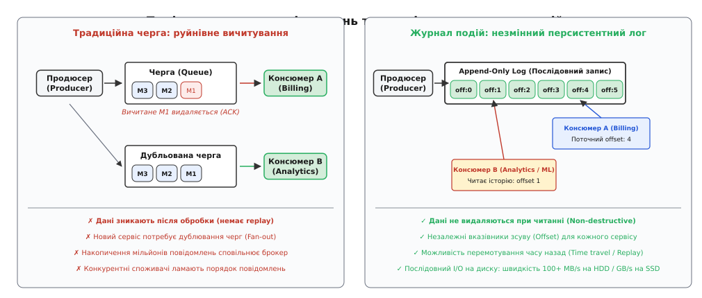
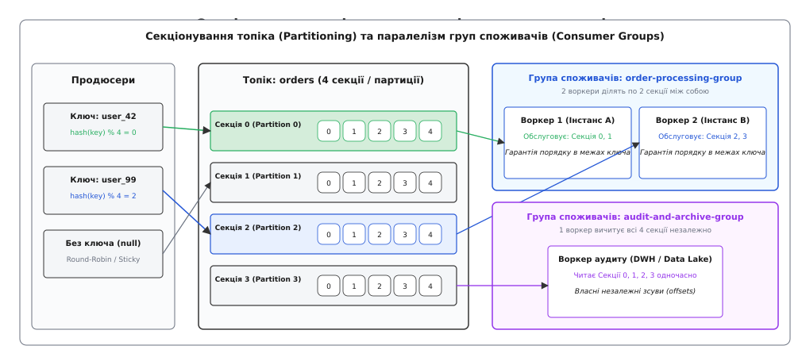
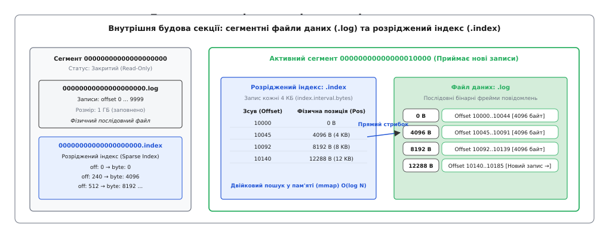
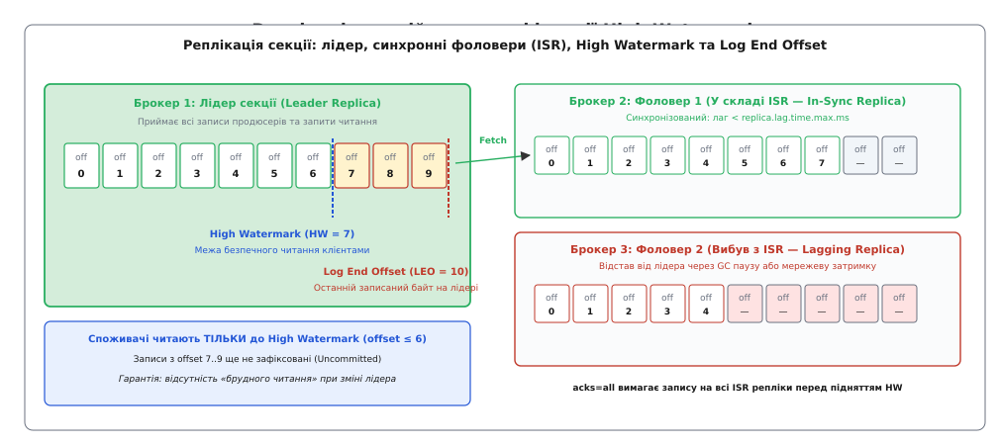

# Журнал подій (Kafka-модель)

<preknowlist>
- [Черга повідомлень (point-to-point)](topic:programming/message-queue) — передача повідомлень між одним відправником та одним отримувачем із видаленням після підтвердження.
- [Pub/sub (тема)](topic:programming/publish-subscribe) — розсилка повідомлень від видавця багатьом підписникам без збереження історії.
- [Гарантії доставки](topic:programming/delivery-guarantees) — семантика обробки повідомлень: щонайбільше один раз, щонайменше один раз або ефективно один раз.
- [Ідемпотентність](topic:programming/idempotency) — здатність операції давати однаковий результат при повторному виконанні.
- [Реплікація лідер-фоловер](topic:programming/replication-leader-follower) — синхронізація стану між основним вузлом і репліками для забезпечення відмовостійкості.
</preknowlist>

Інтернет-магазин із щоденним навантаженням у 50 000 замовлень на хвилину обробляє кожну покупку через десяток внутрішніх систем: платіжний сервіс списує гроші з картки, складський сервіс резервує товар на полиці, антифрод-система аналізує транзакцію на предмет шахрайства, поштовий сервіс надсилає клієнту фіскальний чек, а аналітичний модуль оновлює рекомендаційну модель у реальному часі. У традиційній архітектурі на базі черг повідомлень сервіс замовлень змушений відправляти кожну подію в п'ять окремих черг.

Щойно аналітичний сервіс зупиняється на планове тригодинне оновлення, його персональна черга в оперативній пам'яті брокера розростається до 9 000 000 повідомлень. Пам'ять брокера вичерпується, інші чотири черги починають деградувати через витіснення кешу на диск, а коли аналітики виявляють критичну помилку в коді розрахунку конверсії за минулий тиждень, виявляється, що перечитати старі події неможливо — брокер безповоротно знищив їх у момент підтвердження доставки (ACK).

Якщо ж розробники намагаються прискорити вичитування черги, підключивши десять паралельних воркерів, система стикається з руйнуванням порядку: воркер 1 бере повідомлення «Створити замовлення #101», але зависає на тривалій перевірці кредитного ліміту, тоді як воркер 2 миттєво підхоплює наступне повідомлення «Скасувати замовлення #101» і виконує його першим. База даних отримує команду скасування неіснуючого замовлення, а через секунду воркер 1 створює замовлення, залишаючи списані кошти в підвішеному стані.


*Зліва: традиційна черга знищує дані при читанні, дублює повідомлення для кожного нового споживача та втрачає послідовність при конкурентній обробці. Справа: незмінний журнал подій зберігає історію, надає кожному клієнту власний числовий вказівник зсуву та гарантує порядок запису.*

## Журнал як єдине джерело істини

Щоб подолати обмеження традиційних черг, архітектура розподілених систем спирається на іншу парадигму — **журнал подій** (англ. *event log* або *commit log*, від англ. *to commit* — фіксувати, та грец. *logos* — слово, звіт).

Журнал подій — це строго впорядкована, незмінна (англ. *immutable*) послідовність бінарних записів, доступна виключно для послідовного додавання нових даних у кінець (англ. *append-only*). У цій моделі брокер повідомлень відмовляється від відстеження складного індивідуального стану кожного споживача і більше ніколи не видаляє дані під час їхнього читання.

Кожне повідомлення, що потрапляє в журнал, отримує постійний монотонічно зростаючий 64-бітний цілочисельний порядковий номер — **зсув** (англ. *offset* — зміщення, дистанція від початку). Зсув є незмінною координатою повідомлення в просторі й часі: запис з `offset = 42` завжди залишається записом номер 42 і ніколи не змінює своєї позиції.

Процес читання даних перестає бути руйнівним (англ. *non-destructive read*). Споживач (англ. *consumer*) не забирає повідомлення з журналу, а лише тримає в пам'яті власний числовий показник — свій поточний зсув (англ. *consumer offset*). Щоб прочитати наступне повідомлення, консюмер надсилає брокеру простий запит: «віддай мені байти, починаючи зі зсуву 42». Брокер зчитує запис і відправляє його мережею, а консюмер локально інкрементує свій лічильник до 43.

Такий підхід дає три фундаментальні архітектурні властивості:
1. **Мульти-споживання з нульовими накладними витратами (Zero-Cost Fan-Out):** Десятки абсолютно різних сервісів — білінг реального часу, пошуковий індекс, антифрод та повільний нічний аналітичний процес — можуть паралельно читати той самий журнал. Кожен рухається зі своєю швидкістю: швидкий білінг читає свіжий зсув `offset = 950000`, а нічний аналітик вичитує історичний зсув `offset = 120000`. Наявність другого, третього чи десятого споживача не вимагає виділення додаткової пам'яті на брокері чи дублювання файлів.
2. **Подорож у часі та повторне відтворення (Time Travel / Replayability):** Якщо сервіс упав через помилку або розробники викатили виправлену версію алгоритму, споживач може скинути свій вказівник зсуву назад на довільну кількість позицій (наприклад, переставити `offset` на початок дня) і заново перечитати та переобробити всі події бізнесу.
3. **Фізична швидкість послідовного вводу-виводу (Sequential I/O):** Додавання даних виключно в кінець файлу дозволяє диску писати байти безперервно, уникаючи руйнівного для продуктивності випадкового переміщення головок HDD чи внутрішнього перевпорядкування блоків SSD.

Історично ця концепція перенесла принципи внутрішніх журналів транзакцій (Write-Ahead Log) класичних реляційних СУБД на рівень загальносистемної архітектури підприємств ([як інфраструктурна криза в LinkedIn та переосмислення журналу транзакцій баз даних породили Apache Kafka](topic:programming/event-log/hist-kafka-origins.md)).

## Секціонування: паралелізм та локальний порядок

Один нероздільний файл журналу фізично обмежений пропускною здатністю диска та мережевої карти одного сервера (приблизно 200–500 МБ/с). Щоб масштабувати систему горизонтально на десятки серверів у кластері, логічний потік подій — **топік** (англ. *topic* — тема, категорія) — розбивають на кілька незалежних паралельних журналів, які називаються **секціями** або **партиціями** (англ. *partitions*, від лат. *partitio* — поділ).


*Продюсер маршрутизує події за хешем ключа. Кожна секція є незалежним журналом із суворим внутрішнім порядком. Воркери всередині групи споживачів ділять секції між собою.*

### Маршрутизація повідомлень за ключем

Коли продюсер (англ. *producer*) публікує повідомлення в топік, він передає пару: ключ (англ. *key*) та корисне навантаження (англ. *value*). Вибір цільової секції визначається стратегією партиціювання:

1. **Запис із ключем (Key-based Partitioning):** Якщо ключ задано (наприклад, `user_id = "usr_8492"` або `order_id = "ord_101"`), клієнтська бібліотека продюсера обчислює 32-бітний хеш ключа за стабільним алгоритмом (наприклад, MurmurHash2 або xxHash) і бере залишок від ділення на кількість доступних секцій:
   ```
   partition_index = murmurhash2(key) % total_partitions
   ```
   Оскільки функція хешування є детерміністичною, усі повідомлення з однаковим ключем гарантовано потрапляють у ту саму секцію топіка.
2. **Запис без ключа (Round-Robin / Sticky Partitioning):** Якщо ключ відсутній (`key = null`), продюсер розподіляє повідомлення між усіма секціями рівномірно. Сучасні клієнти використовують «липке партиціювання» (англ. *Sticky Partitioner*): продюсер заповнює один пакет (batch) повідомлень для секції 0, потім перемикається на секцію 1, максимізуючи ступінь стиснення даних та ефективність мережевих фреймів.

### Фундаментальна теорема про порядок

Секціонування вносить найважливіший компроміс у розподілені журнали подій:
* **У межах однієї секції гарантується суворий тотальний порядок (Strict Total Ordering):** Якщо подія A була записана зі зсувом `offset = 12`, а подія B зі зсувом `offset = 13`, будь-який споживач у світі прочитає подію A раніше за подію B.
* **Між різними секціями порядок НЕ гарантується (No Global Ordering):** Подія в секції 0 з `offset = 100` і подія в секції 1 з `offset = 100` є повністю незалежними; жоден механізм не гарантує, яка з них надійшла фізично раніше.

> 🔧 **Навіщо це.** У реальному бізнесі глобальний порядок усіх подій усього світу непотрібний і фізично неможливий без централізованого блокування, яке знищує масштабованість. Бізнесу потрібен порядок подій **для конкретного користувача або конкретного банківського рахунку**. Обираючи ідентифікатор сутності (`account_id`) як ключ повідомлення, інженери гарантують: усі транзакції одного рахунку йдуть в одну секцію в суворому хронологічному порядку, тоді як мільйони інших рахунків обробляються паралельно на сотнях інших серверів.

## Будова на диску: сегменти та розріджений індекс

На рівні файлової системи кожна секція топіка представлена окремою текою на диску (наприклад, `/data/kafka/orders-0/` для секції 0 топіка `orders`).

Всередині цієї теки дані не зберігаються єдиним нескінченним монолітом. Замість цього секція нарізається на окремі файлові **сегменти** (англ. *segments*) фіксованого розміру (за замовчуванням 1 ГБ). Сегмент складається з трьох основних компонентів:
* **Файл логу `.log`:** Сирий бінарний файл, куди послідовно записуються байти повідомлень (заголовок, CRC32, timestamp, ключ, значення).
* **Файл індексу зсувів `.index`:** Розріджений індекс (англ. *Sparse Index*), що зіставляє логічний зсув із фізичним байтовим зміщенням усередині файлу `.log`.
* **Файл часового індексу `.timeindex`:** Розріджений індекс, що зіставляє Unix-час створення повідомлення з його відносним логічним зсувом.


*Сегмент містить двійкові повідомлення у файлі .log та індексний файл .index. Двійковий пошук у відображеній пам'яті знаходить дискову сторінку за мікросекунди.*

### Двофазний пошук через розріджений індекс

Якби брокер зберігав у індексі зміщення кожного окремого повідомлення, розмір індексного файлу зрівнявся б із розміром логу даних. 

Замість цього застосовується розрідження: запис розміром 8 байтів (`relative_offset: 4B`, `physical_pos: 4B`) додається в `.index` лише через кожні 4096 байтів записаних даних (параметр `index.interval.bytes`):

```
Крок 1: Двійковий пошук в .index (у пам'яті mmap)
  target_offset = 10072
  index entry [relative_offset = 45 -> physical_position = 4096 B]

Крок 2: Одноразовий стрибок на диск (seek) на 4096 B у файлі .log
Крок 3: Послідовне сканування максимум 4 КБ даних до зсуву 10072
```

Оскільки індексний файл для сегмента в 1 ГБ займає всього близько 2 МБ, операційна система повністю тримає його в оперативній пам'яті через механізм відображення файлів `mmap(2)`. Пошук виконується за алгоритмом `O(log N)` у процесорному кеші L3, а фізичне читання з диска зводиться до витягування однієї 4-кілобайтної сторінки ([як влаштована низькорівнева реалізація сегментованого журналу з розрідженим індексом та бінарним фреймуванням на C та C++](topic:programming/event-log/proj-append-log.md)).

### Технологія нульового копіювання (Zero-Copy)

Коли споживач запитує порцію даних, традиційний вебсервер виконує чотири перемикання контексту ядра (User ↔ Kernel space) і тричі копіює байти через шину пам'яті процесора (Disk → Page Cache → JVM Buffer → Socket Buffer → Network Card).

У моделі журналу подій байти на диску збережені в тому самому мережевому бінарному форматі, у якому їх очікує клієнт. Це дозволяє брокеру використовувати системний виклик ядра Linux **`sendfile(2)`** (або системний виклик `splice(2)`):
```
Диск (через DMA) → Сторінковий кеш ядра (Page Cache) → Мережевий адаптер (NIC Buffer)
```
Дані передаються контролерами прямого доступу до пам'яті (DMA) безпосередньо з дискового кешу ядра в мережеву карту без залучення ядер процесора та без завантаження даних у користувацьку пам'ять JVM. Завдяки цьому брокер Kafka може роздавати гігабайти трафіку на секунду, утилізуючи менше ніж 5% процесорного часу.

## Групи споживачів та управління зсувами

Для паралельної обробки даних у мікросервісних середовищах використовується абстракція **групи споживачів** (англ. *Consumer Group*).

Група споживачів об'єднує кілька незалежних екземплярів процесу під єдиним груповим ідентифікатором (наприклад, `group.id = "billing-workers"`). Брокер автоматично розподіляє всі секції топіка між членами групи так, щоб виконувалося фундаментальне правило масштабування:
* **Кожну секцію топіка одночасно читає рівно один споживач усередині цієї групи.**
* Якщо топік має 4 секції, а в групі працює 2 воркери, кожен воркер отримує по 2 секції.
* Якщо в групу додати ще 2 воркери (разом 4), брокер призначить кожному воркеру по 1 секції.
* Якщо додати 5-й воркер, він залишатиметься в режимі очікування (idle), оскільки секцій лише 4.

> ⚠️ **Максимальний ступінь паралелізму групи споживачів обмежений кількістю секцій топіка.** Якщо ви хочете одночасно обробляти потік замовлень на 50 незалежних серверах, топік повинен мати щонайменше 50 секцій.

### Механізм фіксації зсувів (Offset Commit)

Щоб знати, на якому місці зупинився кожен консюмер у разі аварійного падіння контейнера, прогрес читання періодично записується (фіксується) назад у брокер.

Сучасні брокери зберігають ці дані не у зовнішніх базах даних типу ZooKeeper, а у власному внутрішньому ущільненому топіку під назвою **`__consumer_offsets`**. Кожен запис у ньому має вигляд:
```
Ключ:   [group_id: "billing-workers", topic: "orders", partition: 0]
Значення: [committed_offset: 42890, metadata: "host-prod-4", timestamp: 1718000000]
```

Залежно від моменту надсилання команди фіксації зсуву досягаються різні рівні [гарантій доставки](topic:programming/delivery-guarantees):
1. **Щонайбільше один раз (At-Most-Once):** Консюмер вичитує повідомлення, негайно фіксує `offset = 43` у брокері, а потім починає обробку бізнес-логіки. Якщо під час запису в базу даних процес вбиває операційна система (OOM), повідомлення вважається прочитаним і після перезапуску пропускається. Втрата даних можлива, дублікати виключені.
2. **Щонайменше один раз (At-Least-Once):** Консюмер вичитує повідомлення, успішно записує результат у базу даних і лише після цього надсилає підтвердження зсуву брокеру. Якщо процес падає до надсилання зсуву, після перезапуску він заново вичитає те саме повідомлення. Втрата даних виключена, проте виникають дублікати, які вимагають [ідемпотентності](topic:programming/idempotency) споживача.
3. **Ефективно один раз (Effectively-Once):** Досягається шляхом комбінації ідемпотентних продюсерів, транзакційного API Kafka або патернів [вхідної скриньки (inbox)](topic:programming/inbox-pattern) та [транзакційного outbox](topic:programming/outbox-pattern).

### Перебалансування групи (Consumer Group Rebalance)

Коли новий споживач приєднується до групи (наприклад, під час автоскейлінгу в Kubernetes) або наявний споживач помирає (не надсилає періодичні сигнали життя — heartbeats протягом `session.timeout.ms`), група запускає процедуру **перебалансування** (англ. *rebalance*).

* **Класичне жадібне перебалансування (Eager Rebalance):** Усі споживачі групи тимчасово зупиняють вичитування («Stop-the-World»), відмовляються від призначених їм секцій і перереєструються в координатора групи (Group Coordinator Broker). Після цього координатор перепризначає секції заново. Це спричиняло неприємні сплески затримок у завантажених кластерах.
* **Кооперативне липке перебалансування (Cooperative Sticky Rebalance):** Споживачі продовжують безперервно читати ті секції, призначення яких не змінилося, а зупиняються й мігрують лише ті поодинокі секції, які фізично перейшли від одного воркера до іншого.

## Розподілена реплікація та High Watermark

Щоб вихід із ладу окремого сервера чи диска не призводив до втрати даних, кожна секція топіка реплікується на кілька незалежних брокерів (зазвичай коефіцієнт реплікації `replication.factor = 3`).


*Лідер секції приймає записи. Синхронні фоловери входять до списку ISR. Споживачі бачать повідомлення лише до межі High Watermark, що захищає від читання незафіксованих даних.*

### Лідер та список синхронних реплік (ISR)

Для кожної секції один брокер обирається **лідером** (англ. *Leader Replica*), а інші стають **фоловерами** (англ. *Follower Replicas*):
* Усі запити на запис від продюсерів та всі запити на читання від споживачів за замовчуванням спрямовуються виключно на лідера.
* Фоловери виступають у ролі спеціальних внутрішніх споживачів: вони безперервно надсилають лідеру запити витягування даних (Fetch Requests), отримують нові бінарні пакети та записують їх у свої локальні сегменти.

Брокер-лідер постійно контролює швидкість синхронізації фоловерів. Репліки, які встигають вичитувати дані без відставання за часом (за замовчуванням затримка менше ніж `replica.lag.time.max.ms = 30000`), включаються до динамічного списку **синхронних реплік** — **ISR** (англ. *In-Sync Replicas*). Якщо фоловер зависає через збирання сміття в Java чи мережевий збій, лідер виключає його зі складу ISR.

### Межі LEO та High Watermark

Для забезпечення узгодженості та запобігання «брудним читанням» (англ. *dirty reads*) у журналі діють два фундаментальні показники зміщення:

1. **Log End Offset (LEO):** Зсув наступного запису, який буде додано до журналу. На лідері LEO зсувається вперед у момент отримання нового повідомлення від продюсера.
2. **High Watermark (HW):** Зсув останнього повідомлення, яке було успішно скопійоване на **всі** активні репліки зі списку ISR.

> ⚡ **Залізне правило видимості даних:** Споживачам дозволено читати повідомлення **лише до позначки High Watermark**. Записи між HW та LEO вважаються незафіксованими (англ. *uncommitted*). Якщо лідер зненацька згорить до того, як повідомлення скопіюється на фоловерів, новий лідер буде обраний зі складу ISR, і клієнти ніколи не побачать фантомних даних, які могли б зникнути під час аварійного перемикання.

### Рівні надійності підтверджень (Producer acks)

Продюсер може самостійно налаштовувати баланс між затримкою та надійністю запису за допомогою параметра `acks`:
* **`acks = 0` (Вогонь і забуття):** Продюсер вважає запис успішним, щойно байти пішли в мережевий сокет. Максимальна швидкість, але втрата даних неминуча при будь-якому збої.
* **`acks = 1` (Тільки лідер):** Продюсер чекає, поки лідер запише дані у свій локальний журнал. Захищає від втрати пакетів у мережі, але якщо лідер згорить до того, як фоловери витягнуть дані, запис буде втрачено.
* **`acks = all` або `acks = -1` (Повний консенсус ISR):** Продюсер чекає, поки лідер та всі актуальні репліки зі списку ISR запишуть дані у свої журнали й піднімуть значення High Watermark. У комбінації з параметром `min.insync.replicas = 2` цей режим забезпечує математичну гарантію стійкості до втрати даних навіть при раптовому виході з ладу серверів.

## Ущільнення журналу (Log Compaction)

У багатьох сценаріях дані являють собою не потік одноразових подій (кліків), а зміни стану конкретних бізнес-об'єктів (наприклад: залишок грошей на балансі користувача або статус посилки).

За звичайної політики видалення даних за часом (англ. *time-based retention*, наприклад, зберігати логи 7 днів), запис про користувача, який не заходив на сайт тиждень, буде видалено з журналу. Щоб використовувати журнал подій як повноцінну постійну базу даних стану, застосовують **ущільнення журналу** (англ. *Log Compaction*).

### Як працює фоновий клінер

При ущільненні журнал гарантує: для кожного унікального ключа (`key`) у топіку зберігається **щонайменше останнє відоме значення** (`latest value`):

```
До ущільнення (усі зміни стану замовлення):
[key: "ord_1", val: "CREATED"] -> [key: "ord_2", val: "CREATED"] -> [key: "ord_1", val: "PAID"] -> [key: "ord_1", val: "SHIPPED"]

Після ущільнення фоновим потоком (Cleaner Thread):
[key: "ord_2", val: "CREATED"] -> [key: "ord_1", val: "SHIPPED"]
```

Фонові потоки брокера (Cleaner Threads) періодично переглядають закриті сегменти, будують хеш-таблицю останніх зсувів для кожного ключа і переписують старі сегменти, викидаючи проміжні версії записів, для яких уже з'явився новіший `offset` із тим самим ключем.

### Видалення через надгробки (Tombstones)
Щоб повністю видалити ключ із ущільненого журналу, продюсер публікує спеціальне повідомлення-надгробок (англ. *tombstone record*), де ключ заповнено, а тіло повідомлення дорівнює нулю (`value = null`). Під час чергового циклу ущільнення клінер видаляє всі попередні версії цього ключа, залишає надгробок на короткий час `delete.retention.ms` (щоб усі споживачі встигли дізнатися про видалення), після чого фізично видаляє надгробок із диска.

### Подвійність потоку й таблиці (Stream-Table Duality)

Ущільнення журналу є практичним втіленням фундаментального архітектурного принципу **подвійності потоку й таблиці** (англ. *Stream-Table Duality*):
* **Потік подій (Stream) — це журнал змін (Changelog):** Він фіксує історію всіх мутацій стану в часі.
* **Таблиця (Table) — це стан на поточний момент (Snapshot):** Вона містить поточні значення для кожного ключа.

Якщо послідовно застосувати всі події з потоку до порожнього стану, ми отримаємо таблицю. Якщо зафіксувати всі зміни в таблиці, ми отримаємо потік. Це дозволяє створювати високонадійні сервіси на базі локальних вбудованих сховищ (RocksDB у Kafka Streams / Flink): при перезапуску контейнера стан таблиці в пам'яті повністю відновлюється з ущільненого топіка без звернення до зовнішніх баз даних.

## Багаторівневе сховище (Tiered Storage)

У класичній архітектурі зберігання журналу подій усі сегменти — як гарячі свіжі дані, так і холодні архіви тримісячної давнини — зберігаються на локальних дисках брокерів. Це створює важкий економічний дисбаланс: компанії змушені купувати дорогі масиви NVMe SSD лише для того, щоб зберігати терабайти пасивних історичних логів. Більше того, додавання нового брокера до кластера вимагає багатогодинного копіювання терабайтів даних (перебалансування секцій), що створює колосальне навантаження на мережу.

Для розв'язання цієї проблеми в сучасних розподілених журналах впроваджено **багаторівневе сховище** (англ. *Tiered Storage*):
1. **Локальний рівень (Local Tier):** Активні сегменти та свіжі закриті сегменти (наприклад, за останні 24–48 годин) зберігаються на локальних високошвидкісних NVMe/SSD дисках брокера. Цей рівень обслуговує 99% трафіку споживачів реального часу з субмілісекундною затримкою через Page Cache та `sendfile(2)`.
2. **Віддалений рівень (Remote Tier):** Щойно сегмент закривається і його вік перевищує поріг локального зберігання, брокер у фоновому режимі асинхронно вивантажує файл даних `.log`, розріджений індекс `.index` та часовий індекс `.timeindex` у дешеве безрозмірне об'єктне сховище (Amazon S3, Google Cloud Storage або Ceph). Після успішного завантаження локальний файл видаляється, залишаючи в пам'яті брокера лише компактні метадані посилань.

Коли історичний аналітичний процес або бекфіл-джоба запитує читання зі старого зсуву річної давнини, брокер прозоро для клієнта зчитує діапазон байтів (HTTP Range Request) безпосередньо з об'єктного сховища. Завдяки багаторівневому зберіганню журнал подій перетворюється на практично нескінченне озеро даних (Data Lake), а час відновлення та масштабування брокерів скорочується з годин до кількох секунд.

## Транзакції та обробка «ефективно один раз» (EOS)

У потоковій обробці типу «вичитати з вхідного топіка A → оновити стан у БД → записати результат у вихідний топік B» аварійне падіння процесу між кроками призводить або до втрати даних, або до появи дублікатів.

Для забезпечення наскрізної атомарності модель журналу подій підтримує **розподілені транзакції** за схемою двофазної фіксації (Two-Phase Commit, 2PC):
* **Координатор транзакцій (Transaction Coordinator):** Спеціальний брокер, який фіксує етапи виконання транзакції у внутрішньому системному журналі `__transaction_state`.
* **Маркери фіксації (Control Batch / Commit Markers):** Коли продюсер викликає `commitTransaction()`, координатор записує в усі залучені секції топіків спеціальні службові маркери фіксації (`COMMIT` або `ABORT`).
* **Рівні ізоляції читання споживачів (Isolation Levels):**
  * `read_uncommitted` (за замовчуванням): Консюмер читає всі повідомлення підряд до High Watermark, включно з незавершеними або згодом скасованими транзакціями.
  * `read_committed`: Консюмер буферизує вхідні повідомлення і віддає їх прикладній логіці **лише після отримання маркера `COMMIT`**. Якщо транзакцію було скасовано маркером `ABORT`, брокер прозоро відкидає відповідні повідомлення з потоку споживача.

Це дозволяє будувати детерміністичні замкнені потокові конвеєри без накопичення помилок узгодженості.

## Пастки, крайові випадки та системна ціна

Попри високу надійність та продуктивність, неправильне використання журналу подій може призвести до важких системних аварій:

### 1. Перекіс гарячої секції (Hot Partition Skew)
Якщо під час вибору ключа партиціювання розробники обирають поле з низькою ентропією (наприклад, країну користувача `country = "UA"`) або стикаються з проблемою «зіркового акаунта» (відомий блогер генерує 80% усіх повідомлень системи), 80% трафіку буде спрямовано в одну-єдину секцію.
* Один сервер кластера виявляється перевантаженим на 100% за процесором та диском, тоді як решта брокерів простоюють.
* Один воркер у групі споживачів накопичує колосальне відставання (англ. *consumer lag*), тоді як інші воркери чекають на роботу.
* *Виправлення:* Додавання рандомізованого суфікса (солі) до популярного ключа (англ. *Key Salting*: `user_celebrity_42_part_3`) або використання окремих топіків для високоінтенсивних сутностей.

### 2. Блокування початку черги отруйною пігулкою (Head-of-Line Blocking)
Якщо в секцію потрапляє повідомлення з пошкодженим форматом або невалідною схемою бізнес-даних, яку консюмер не може розпарсити, виникає критичний тупик:
* Консюмер викидає виняток (Exception), не може зафіксувати `offset` і після перезапуску знову намагається прочитати те саме бите повідомлення.
* Оскільки порядок усередині секції є суворим, **усі наступні валідні повідомлення в цій секції зупиняються** й не обробляються.
* *Виправлення:* Використання патерну [мертвої черги (Dead Letter Queue, DLQ)](topic:programming/dead-letter-queue) — перехоплення помилки після кількох ретраїв, запис битого повідомлення в окремий топік помилок та примусовий зсув `offset` вперед.

### 3. Перевпорядкування при повторних спробах (Retry Reordering)
Якщо продюсер налаштований на паралельне надсилання кількох запитів без очікування відповіді (`max.in.flight.requests.per.connection = 5`) і виникає короткочасний мережевий збій:
* Пакет 1 не доходить до брокера через таймаут.
* Пакет 2 успішно доходить і записується зі зсувом 10.
* Продюсер отримує таймаут для Пакета 1, виконує повторну спробу (Retry), і Пакет 1 записується зі зсувом 11.
* Порядок повідомлень у журналі виявляється безповоротно спотвореним.
* *Виправлення:* Увімкнення режиму **ідемпотентного продюсера** (`enable.idempotence = true`). Брокер призначає кожному продюсеру унікальний 64-бітний Producer ID (PID) і відстежує послідовні номери Sequence Numbers для кожного пакета, автоматично відкидаючи дублікати та вимагаючи строгого порядку запису в межах з'єднання.

### 4. Шторм перебалансування (Rebalance Storm)
Якщо обробка одного пакета повідомлень на консюмері займає занадто багато часу (наприклад, важкий запит до зовнішньої СУБД триває довше ніж `max.poll.interval.ms = 300000` — 5 хвилин), брокер вважає воркер мертвим і запускає перебалансування всієї групи.
* Секція забирається у підвислого воркера і передається іншому екземпляру.
* Інший екземпляр знову береться за важке повідомлення і знову зависає на 5 хвилин.
* Група споживачів входить у нескінченний цикл каскадних перебалансувань (Rebalance Storm), повністю зупиняючи обробку всього топіка.
* *Виправлення:* Винесення важкої обчислювальної роботи у внутрішній асинхронний пул потоків воркера з регулярним викликом `poll()` у фоновому циклі, або оптимізація розміру порції вичитування (`max.poll.records`).
