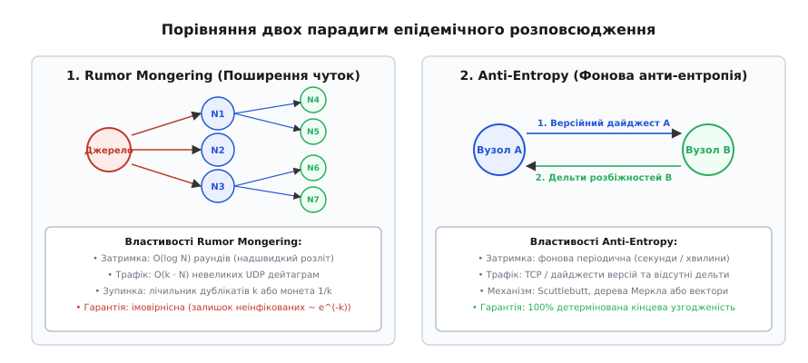
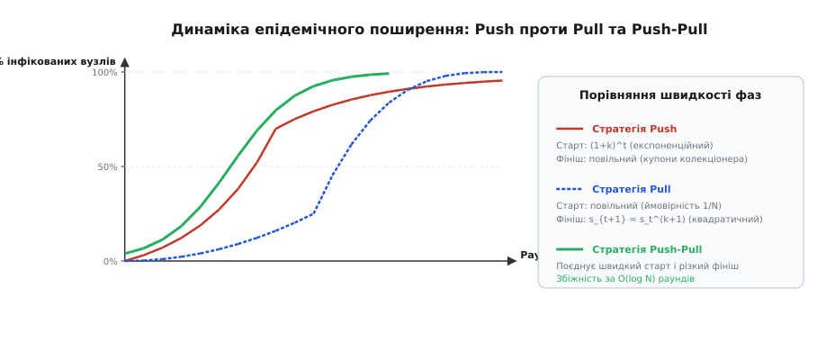
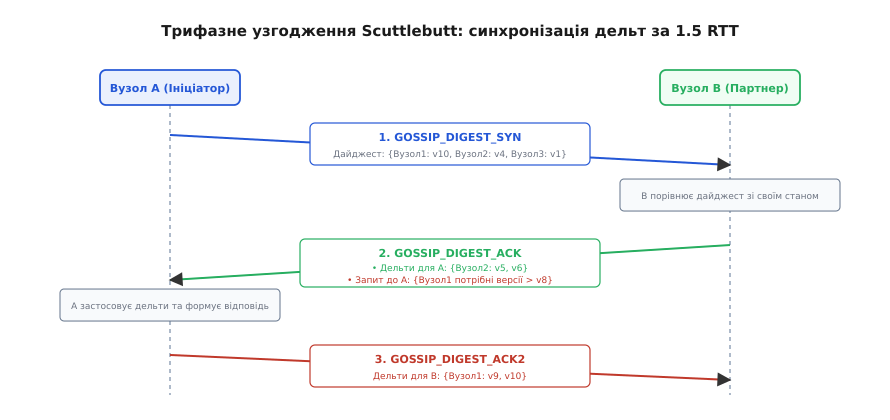
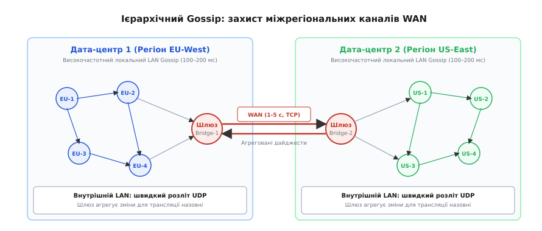

# Розповсюдження інформації через плітки: anti-entropy та rumor-mongering

<preknowlist>
- [Вісім оман розподілених обчислень](topic:programming/distributed-fallacies) — ненадійність мережі, ненульові затримки та наслідки часткових збоїв вузлів.
- [Кінцева узгодженість на практиці](topic:programming/eventual-consistency) — модель асинхронної збіжності реплік без глобальних блокувань.
- [Перевірки живості й готовності](topic:programming/health-checks) — механізми активного зондування, пульсу (heartbeat) та оцінки доступності.
- [Кворуми та безлідерна реплікація](topic:programming/quorum-and-leaderless) — топології збереження та читання даних без виділеного майстра.
- [Векторні годинники](topic:algorithms/vector-clocks) — відстеження причинно-наслідкових зв'язків між подіями у розподілених вузлах.
- [Розділення мозку (split-brain)](topic:programming/split-brain) — стан кластера при розриві мережевої зв'язності на ізольовані сегменти.
</preknowlist>

Розподілений кластер із 12 000 серверів, розгорнутий у чотирьох хмарних регіонах, повинен оновити глобальну таблицю маршрутизації та список заблокованих IP-адрес менш ніж за секунду. Якщо спробувати вирішити це завдання через централізований координатор або пряме розсилання (Point-to-Point Broadcast), виникає системний колапс: лідер намагається одночасно відкрити 12 000 TCP-з'єднань, що миттєво вичерпує ліміт файлових дескрипторів операційної системи (`EMFILE`), переповнює мережеві буфери ядра (`SO_SNDBUF`), а тисячі скинутих з'єднань (`ECONNRESET`) породжують лавину повторних спроб. Якщо ж обрати топологію лавинного затоплення (Flooding), коли кожен вузол пересилає оновлення всім відомим сусідам, комутатори стійок (Top-of-Rack Switches) захлинаються від широкомовного шторму (`O(N²)` пакетів), що паралізує передачу корисного трафіку. Спроба побудувати дерево розповсюдження (Spanning Tree) виявляється крихкою: падіння кореневого або проміжного комутатора відрізає від оновлень цілі підмережі.

Для масштабування до десятків і сотень тисяч машин необхідна модель зв'язку, у якій навантаження на окремий сервер залишається строго обмеженим (`O(1)`), мережевий трафік масштабується лінійно (`O(N)`), а збій будь-якої довільної кількості проміжних вузлів не зупиняє розповсюдження.

Цю задачу вирішує клас **епідемічних протоколів розповсюдження** (відомих як **gossip-dissemination**, від англ. *gossip* «плітки» або *dissemination* «розсіювання, поширення»).

---

## Дві парадигми: Rumor Mongering проти Anti-Entropy

В інженерії розподілених систем епідемічне розповсюдження спирається на дві фундаментальні взаємодоповнюючі парадигми:

1. **Поширення чуток (Rumor Mongering або Dissemination):**
   Швидкий, реактивний і легкий механізм доставки свіжих змін. Коли на вузлі з'являється нове значення або подія (наприклад, зміна статусу вузла чи прапорця конфігурації), вузол починає активно транслювати цю новину невеликій кількості `k` випадково обраних партнерів. Процес має обмежений час життя: через кілька раундів вузол вважає плітку «застарілою» і замовкає, запобігаючи нескінченному циркулюванню трафіку.
2. **Фонова анти-ентропія (Anti-Entropy):**
   Періодичний, важкий і детермінований процес повного попарного вирівнювання станів. Навіть коли в кластері немає нових подій, кожен вузол раз на кілька секунд обирає одного випадкового сусіда і звіряє з ним повний перелік версій своїх даних. Анти-ентропія гарантує усунення будь-яких прогалин, що виникли через втрату UDP-пакетів або тимчасові розриви зв'язку.

```
+-----------------------------------------------------------------------------------+
|                        ПОВНИЙ КОНВЕЄР РОЗПОВСЮДЖЕННЯ (GOSSIP)                    |
+-----------------------------------------------------------------------------------+
|                                                                                   |
|  [Гаряча подія] ───► [Rumor Mongering / Плітки] ────────────────► 99.9% кластера  |
|                      • Протокол: швидкий UDP                      за 200–500 мс   |
|                      • Трафік: O(k · N) дейтаграм                                 |
|                      • Зупинка: лічильник дублікатів k                            |
|                                                                                   |
|  [Залишок 0.1%] ───► [Anti-Entropy / Анти-ентропія] ────────────► 100% кластера  |
|                      • Протокол: Scuttlebutt / TCP або дайджести  (детерміновано) |
|                      • Трафік: обмін версіями та дельтами                         |
|                      • Період: раз на 1–2 секунди у фоні                          |
+-----------------------------------------------------------------------------------+
```


*Порівняння архітектурних підходів: швидке ймовірнісне мовлення свіжих чуток (Rumor Mongering) та детерміноване попарне вирівнювання розбіжностей через анти-ентропію (Anti-Entropy).*

Історичний шлях створення цих алгоритмів у дослідницькому центрі Xerox PARC та їхній розвиток у роботах Корнелльського університету детально описано у вставці [Епідемічні алгоритми у Xerox PARC: від Clearinghouse до Scuttlebutt](topic:programming/gossip-dissemination/hist-rumor-mongering-xerox.md).

---

## Механіка Rumor Mongering: динаміка інфекції та правила зупинки

Поширення чуток моделюється за аналогією з класичною епідеміологічною моделлю SIR (Susceptible — Infectious — Removed):
- **Сприйнятливий (Susceptible, `S`):** вузол ще не отримав оновлення.
- **Інфікований (Infectious, `I`):** вузол отримав оновлення і активно переказує його `k` випадковим сусідам у кожному раунді.
- **Вилучений / Замовклий (Removed, `R`):** вузол припинив поширення чутки.

Головна проблема Rumor Mongering полягає у визначенні критерію переходу зі стану `I` у стан `R`. Якщо вузли переходять у стан `R` занадто швидко, епідемія згасає до того, як інформація досягне всіх учасників. Якщо ж вони продовжують пліткувати довго, система марнує пропускну здатність каналів.

### Критерії замовкання пліток

Використовують дві базові стратегії зупинки:
1. **Сліпе ймовірнісне замовкання (Blind Coin-Toss):** після кожного раунду поширення вузол кидає монету з імовірністю `1 / k_stop` перейти у стан `R`. Ця стратегія проста, але не враховує реального стану сусідів.
2. **Зворотнісне замовкання (Feedback Counter):** коли вузол надсилає плітку партнеру, а той відповідає, що **вже знає** цю версію (або повертає новіший стан), лічильник дублікатів інкрементується. Коли кількість отриманих дублікатів досягає порога `k_feedback` (зазвичай `k = 3..5`), вузол розуміє, що новина поширилася серед більшості сусідів, і переходить у стан `R`.

```
[Подія] ──► Стан I (Infectious)
                 │
                 ├──[Відправив k сусідам]──► Сусід відповів "Я вже знаю"
                 │                                   │
                 │                            [Лічильник + 1]
                 │                                   │
                 │                           Лічильник >= k_feedback?
                 │                                ├── ТАК ──► Стан R (Removed)
                 ▼                                └── НІ  ──► Залишається в I
         Наступний раунд
```

### Залишкова частка неінфікованих вузлів

Математичний аналіз доводить, що за будь-якого скінченного коефіцієнта зупинки `k` залишкова частка неінфікованих вузлів `s_∞` описується трансцендентним рівнянням:

```
s_∞ = e^(-(k + 1) · (1 - s_∞))
```

При значенні порога `k = 3` частка вузлів, які ніколи не дізнаються новину через плітки, становить приблизно `1.8%`, а при `k = 5` — близько `0.14%`. У кластері з 10 000 серверів це означає, що від 14 до 180 машин гарантовано залишаться у застарілому стані.

Строге математичне виведення швидкості збіжності, розв'язок через W-функцію Ламберта та аналіз задачі про купони колекціонера наведено у вставці [Математичне моделювання зупинки пліток та динаміки Push-Pull](topic:programming/gossip-dissemination/math-rumor-stopping.md).

---

## Динаміка Anti-Entropy: асиметрія Push проти Pull

Оскільки плітки мають імовірнісний залишок `s_∞ > 0`, для забезпечення абсолютної кінцевої узгодженості ([eventual consistency](topic:programming/eventual-consistency)) використовується фонова анти-ентропія.

Існує три стратегії попарного обміну станами під час анти-ентропії:

```
1. Стратегія Push:
   Вузол A (інфікований) ───[Відправляє свій стан]───► Вузол B (неінфікований)

2. Стратегія Pull:
   Вузол A (неінфікований) ───[Запитує стан]───► Вузол B (інфікований)
   Вузол A (оновлюється)  ◄───[Повертає стан]──── Вузол B

3. Стратегія Push-Pull:
   Вузол A ◄───[Двосторонній обмін дайджестами та дельтами]───► Вузол B
```


*Асиметрія фаз поширення: експоненційний старт Push та швидке квадратичне вирівнювання залишку через Pull забезпечують логарифмічний час збіжності O(log N).*

### Чому Push неефективний на фініші, а Pull — на старті

Різниця між Push та Pull має фундаментальну асиметрію:

- **Фаза старту (інфіковано < 10% вузлів):**
  - **Push:** Надзвичайно ефективний. Інфікований вузол активно розмножує копії стану. Кількість інфікованих вузлів зростає експоненційно як `(1 + k)^t`.
  - **Pull:** Вкрай неефективний. Коли оновлення є лише на одному сервері з 10 000, ймовірність того, що випадковий неінфікований вузол натрапить саме на це єдине джерело, становить `1 / 10000`. Мережа витрачає тисячі марних запитів.
- **Фаза фінішу (інфіковано > 90% вузлів):**
  - **Push:** Сповільнюється через «проблему купонів колекціонера». Інфіковані вузли обирають випадкових партнерів і майже завжди влучають у тих, хто вже інфікований. Знайти останні кілька неінфікованих серверів вимагає `O(N · log N)` зайвих повідомлень.
  - **Pull:** Демонструє надшвидку квадратичну збіжність (`s_{t+1} = (s_t)^(k+1)`). Оскільки 90% кластера вже оновлено, будь-який неінфікований вузол з першої ж спроби обирає оновленого сусіда і миттєво підтягує свіжий стан.

Найкращі результати забезпечує **Push-Pull**: система починає поширення через Push (миттєвий спалах інфекції), а залишкові розбіжності зачищаються через Pull за детермінований час `O(log N)` раундів.

---

## Протокол Scuttlebutt: узгодження за 1.5 RTT

Традиційна анти-ентропія, що пересилає повний перелік ключів і їхніх версій, породжує неприйнятний обсяг трафіку у великих кластерах. Якщо кожен із 10 000 вузлів зберігає 50 ключів конфігурації, передача 500 000 записів у кожному раунді перевантажує процесор і мережу.

Цю проблему вирішує протокол **Scuttlebutt**, розроблений Роббертом ван Ренессе.

### Ключова ідея: максимальна версія на вузол

У Scuttlebutt кожен вузол кластера призначає своїм локальним записам строго монотонний числовий лічильник версій (наприклад, версія 1, 2, 3...). Будь-яка зміна будь-якого локального параметра збільшує максимальну версію цього вузла:

```
Вузол 101:
  • max_version = 14
  • records:
      - "status"   = "active"    (v12)
      - "load_avg" = "0.42"      (v13)
      - "weight"   = "100"       (v14)
```

Завдяки цьому для повного опису стану всього вузла 101 сусіднім машинам не потрібно передавати всі три ключі — достатньо передати лише одне число: `(NodeID: 101, MaxVersion: 14)`.

### Трифазний протокол узгодження

Синхронізація між вузлом `A` та вузлом `B` виконується за півтора обороти повідомлень (1.5 Round-Trip Time):

```
Крок 1 (A ──► B): GOSSIP_DIGEST_SYN
   Вузол A відправляє стислий вектор максимальних версій для всіх відомих йому вузлів:
   Дайджест A: { Вузол1: v10, Вузол2: v4, Вузол3: v1 }

Крок 2 (B ──► A): GOSSIP_DIGEST_ACK
   Вузол B порівнює отриманий дайджест зі своїм локальним станом:
   • Де B випереджає A: Вузол B пакує дельти (наприклад, для Вузла 2 у B є версії v5 та v6).
   • Де A випереджає B: Вузол B додає запит (наприклад, для Вузла 1 у B є лише v8, тому B просить версії > v8).

Крок 3 (A ──► B): GOSSIP_DIGEST_ACK2
   Вузол A отримує дельти від B і застосовує їх до свого сховища.
   Одночасно A бере запит від B і надсилає відсутні дельти (версії v9 та v10 Вузла 1).
```


*Трифазний протокол Scuttlebutt: обмін стислими дайджестами максимальних версій дозволяє виявити та передати тільки відсутні дельти за півтора обороти повідомлень.*

Переваги Scuttlebutt:
1. **Мінімальний трафік:** Дайджест із 500 вузлів займає менше 4 КБ і легко вміщується в UDP-пакети.
2. **Точність дельт:** Мережею передаються тільки ті значення, які дійсно змінилися.
3. **Хронологічний порядок:** Дельти передаються послідовно у порядку зростання номерів версій, усуваючи проміжні аномалії стану.

Повноцінний математичний аналіз, специфікацію та реалізацію алгоритму Scuttlebutt наведено в окремій статті [Протокол узгодження Scuttlebutt](topic:programming/scuttlebutt-protocol).

Специфікацію бінарних форматів пакетів `SYN`, `ACK` та `ACK2` наведено у вставці [Протокольний інтерфейс та двійкові формати повідомлень Gossip Dissemination](topic:programming/gossip-dissemination/api-gossip-disseminator.md).

---

## Практика розповсюдження: «навішування» на Heartbeat та бюджет MTU

У промислових системах (таких як HashiCorp Consul / Serf та Apache Cassandra) рідко виділяють окремі мережеві потоки під кожен тип пліток. Замість цього розповсюдження комбінується з протоколом моніторингу доступності вузлів ([SWIM-подібними зондами живості](topic:programming/gossip-membership)).

### Механізм Piggybacking (навішування)

Коли вузол надсилає регулярний UDP-пінг (`PING`) обраному партнеру для перевірки його працездатності, він прикріплює до хвоста дейтаграми кілька гарячих чуток із локальної черги:

```
+───────────────────────────────────────────────────────────────────────────+
|                           ЄДИНИЙ UDP ПАКЕТ (MTU <= 1400 БАЙТІВ)           |
+───────────────────────────┬───────────────────────────────────────────────+
| Заголовок зонда SWIM      | Гарячі плітки з черги розповсюдження (Rumors) |
| • OpCode: PING            | • Подія 1: Node 42 changed IP to 10.0.1.5     |
| • Seq: 10485              | • Подія 2: Node 18 set drain=true             |
+───────────────────────────┴───────────────────────────────────────────────+
```

Це дає дві колосальні переваги:
- **Нульовий додатковий оверхед на сокети:** системі не потрібно відкривати нові мережеві з'єднання для передачі новин.
- **Миттєвий розліт:** оскільки перевірки живості відбуваються постійно (кожні 100–200 мс), нова подія оббігає тисячі серверів за частки секунди.

### Контроль розміру пакета та захист від фрагментації

Стандартний розмір кадру Ethernet (MTU) становить 1500 байтів. За вирахуванням заголовків IP (20 байтів) та UDP (8 байтів), безпечний розмір корисного навантаження становить **1472 байти** (на практиці беруть ліміт 1400 байтів для врахування тунелів GRE/VXLAN чи VPN-заголовків).

Якщо розмір пліток перевищує 1400 байтів, IP-пакет фрагментується на рівні ядра ОС. При втраті хоча б одного фрагмента мережевий комутатор відкидає весь пакет цілком. Тому черга пліток суворо обмежує розмір корисного навантаження, пакуючи дельти за пріоритетами (спочатку критичні зміни топології та членства, потім другорядні метрики).

---

## Видалення даних: проблема відродження та Tombstones

У системах із кінцевою узгодженістю операція видалення ключа не може бути виконана звичайним стиранням запису з локальної пам'яті.

Розглянемо аварійний сценарій:
1. Вузол `A` видаляє ключ `"user_42"`, очищаючи свою хеш-таблицю.
2. Через 500 мс вузол `B` ініціює раунд анти-ентропії з вузлом `A`.
3. Вузол `B` бачить, що у нього є запис `"user_42"` (версія 5), а у вузла `A` цього запису взагалі немає.
4. Вузол `B` помилково робить висновок, що вузол `A` просто пропустив створення цього користувача, і надсилає йому стару копію.
5. Запис `"user_42"` **відроджується** (Resurrection Bug) на вузлі `A`.

```
[Помилкове видалення]:
  Вузол A: видалив запис "X" (пам'ять порожня)
  Вузол B: зберігає старий "X" (v1)
  
  Анти-ентропія (B -> A): "У мене є X (v1), а у тебе немає. Тримай!"
  Вузол A: знову записує "X" (v1)  <── КЛЮЧ ВОСКРЕС!
```

### Механізм надгробків (Tombstones) та лічильники поколінь (Generations)

Правильне видалення запису в епідемічних протоколах виконується за правилами:

1. **Запис надгробка (Tombstone):** замість фізичного видалення в полі значення записується спеціальний маркер `TOMBSTONE`, а версія лічильника монотонно збільшується:
   ```
   "user_42" = { value: TOMBSTONE, version: 6 }
   ```
2. **Поширення надгробка:** надгробок розповсюджується як звичайна плітка. Отримавши надгробок із версією 6, всі вузли перезаписують свої старі версії 5.
3. **Вікно утримання (Tombstone Grace Period):** надгробок залишається в пам'яті протягом фіксованого часу (наприклад, `GCGraceSeconds = 86400` секунд у Cassandra). За цей час гарантовано завершаться всі раунди анти-ентропії навіть між віддаленими дата-центрами.
4. **Збирання сміття (Garbage Collection):** після завершення вікна утримання надгробок безпечно вилучається з пам'яті.

Для розрізнення стану вузла після повного перезапуску використовується **номер покоління** (`Generation` — зазвичай Unix-час старту процесу). Якщо вузол перезапустився і скинув свій лічильник версій з 10 000 до 1, новий `Generation` повідомляє іншим вузлам, що стару історію версій слід скинути і перечитати стан наново.

---

## Ієрархічний розповсюджувач: захист міжрегіональних каналів WAN

Коли кластер розміщено у кількох географічно віддалених дата-центрах (наприклад, Франкфурт, Вірджинія та Токіо), випадковий вибір партнерів для пліток без урахування топології створює критичні проблеми:
- **Фінансові витрати:** передача гігабайтів міжрегіонального трафіку через інтернет коштує дорого.
- **Високі затримки (Latency):** час пінгу всередині стійки дата-центру становить < 0.5 мс, тоді як міжрегіональний пінг між Європою та Азією перевищує 200 мс. Повільні міжконтинентальні запити гальмують чергу пліток.


*Ієрархічна організація розповсюдження: високочастотний локальний UDP-обмін у межах дата-центру та агреговані мости через шлюзи для захисту міжрегіональних каналів WAN.*

### Розділення на рівні LAN та WAN

Для захисту зовнішніх каналів застосовують двошарову ієрархію:

1. **Локальний рівень (LAN Gossip):**
   - Вузли всередині одного дата-центру обмінюються плітками з високою частотою (кожні 100–150 мс) через UDP.
   - Використовується агресивний коефіцієнт розгалуження `k = 3..4`.
2. **Глобальний рівень (WAN Gossip / Bridge Gateways):**
   - У кожному дата-центрі обирається невелика кількість виділених вузлів-мостів (Bridge Gateways).
   - Міжрегіональний обмін відбувається з нижчою частотою (раз на 1–5 секунд) через надійні TCP-з'єднання.
   - Події агрегуються: замість надсилання сотень дрібних UDP-пакетів шлюз збирає всі зміни за останню секунду в один стиснутий батч, передає його шлюзу віддаленого регіону, а той транслює дельти всередині свого LAN через локальний gossip.

---

## Порівняння промислових реалізацій

```
+-------------------+---------------------------+---------------------------+---------------------------+
| Характеристика    | Apache Cassandra          | HashiCorp Serf / Consul   | Redis Cluster             |
+-------------------+---------------------------+---------------------------+---------------------------+
| Базовий алгоритм  | Scuttlebutt (Generation + | SWIM + Broadcast Queue    | Cluster Bus Gossip        |
|                   | HeartbeatState + Version) | (Lambda-Retransmit)       | (Попарний обмін вузлів)   |
| Транспорт         | Постійні TCP-з'єднання    | Ненадійний UDP +          | Окремий TCP порт          |
|                   | між вузлами (порт 7000)   | резервний TCP (порт 8301) | (Base Port + 10000)       |
| Періодичність     | 1 раз на секунду          | 200–500 мс (налаштовується)| 100 мс (випадковий вузол) |
| Що передається    | ApplicationState (схема,  | Статуси членства, теги,   | Слоти хешування (16384),  |
|                   | токени кільця, DC/Rack)   | кастомні події користувача| прапорці збоїв (PFAIL)    |
| Розмір кластера   | До 1 000–3 000 серверів   | До 5 000–10 000 серверів  | До 1 000 серверів         |
+-------------------+---------------------------+---------------------------+---------------------------+
```

---

## Інженерні пастки та захисні бар'єри

1. **Шторми каскадних змін (Gossip Storms):**
   Якщо при масовому перезапуску 1 000 серверів кожен вузол одночасно генерує 10 нових подій розповсюдження, буфер пліток вибухає тисячами повідомлень, перевантажуючи CPU розбором пакетів.
   *Захист:* Впровадження коалесценції (Coalescing) — об'єднання кількох послідовних змін одного ключа в одну фінальну версію перед відправкою в мережу.
2. **Асинхронний зсув локальних годинників (Clock Skew):**
   Використання системного астрономічного часу (`gettimeofday()`) для версіонування неминуче призводить до втрати оновлень, якщо годинник одного сервера відстає на кілька секунд через дрейф NTP.
   *Захист:* Номери версій повинні бути **строго логічними лічильниками** (`uint64_t seq++`), що збільшуються локально без прив'язки до фізичного часу, або використовувати гібридні логічні годинники.
3. **Атаки посилення трафіку та підробка пліток (Amplification & Poisoning):**
   Оскільки gossip спирається на UDP, зловмисник може надсилати пакети з підробленою IP-адресою жертви (IP Spoofing), змушуючи кластер атакувати цільовий сервер потоком дайджестів.
   *Захист:* Обов'язкова аутентифікація всіх дейтаграм через HMAC-SHA256 зі спільним симетричним ключем кластера та перевірка поля `ClusterID` у заголовку кадру.

---

> 🔧 **Навіщо це.**
>
> Епідемічне розповсюдження (Gossip Dissemination) є фундаментальним інженерним інструментом для будь-якої системи, розмір якої перевищує межі однієї стійки. Воно дозволяє без виділених лідерів і без ризику єдиної точки відмови (SPOF) підтримувати узгодженість конфігурацій, маршрутів, списків доступу та кільцевих топологій у розподілених базах даних (Cassandra, ScyllaDB, DynamoDB), сервісних сітках (Consul, Envoy) та платформах оркестрації. Розуміння компромісу між швидкістю чуток і надійністю анти-ентропії дозволяє проектувати стійкі кластери, що витримують 50% втрат пакетів та масові аварії мережевих каналів без деградації сервісу.
