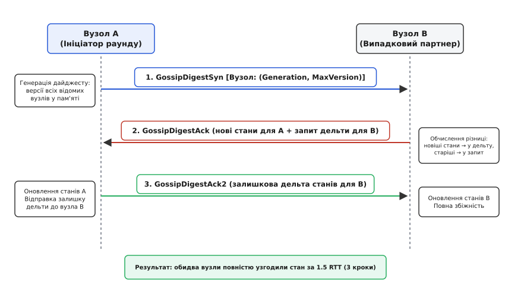
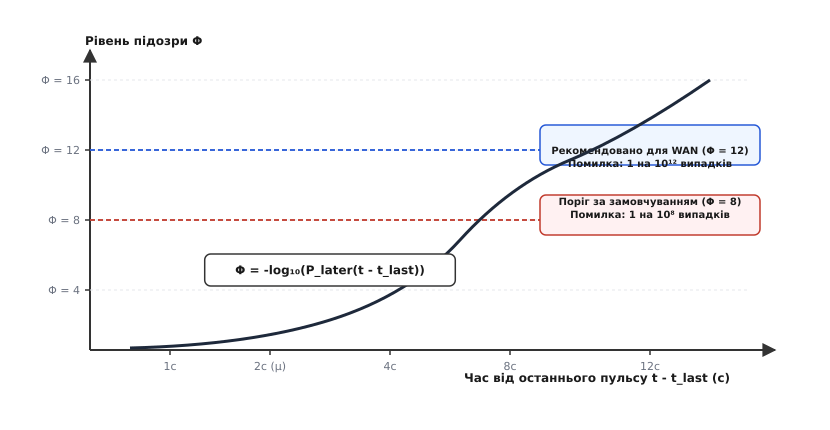
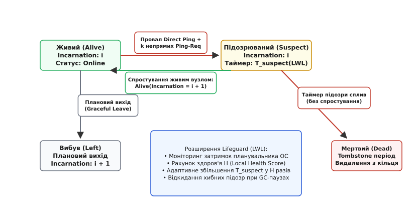
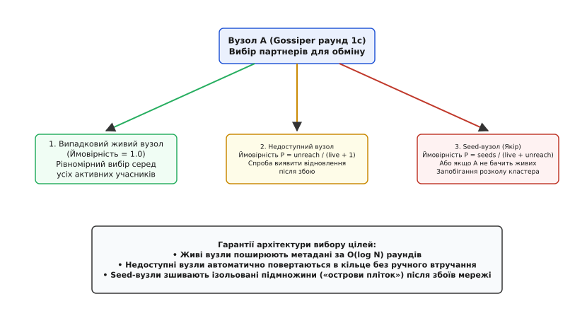

# Gossip на практиці (Cassandra, Consul, Dynamo, Memberlist)

<preknowlist>
- [Gossip-протоколи](topic:programming/gossip-protocols) — загальні принципи епідемічного поширення (dissemination проти anti-entropy, push/pull).
- [Членство в групі та детекція збоїв: SWIM](topic:programming/gossip-membership) — протокол SWIM, механізм підозр та непрямий пінг.
- [Кінцева узгодженість на практиці](topic:programming/eventual-consistency) — модель збіжності реплік у часі без синхронного блокування.
- [Виявлення сервісів](topic:programming/service-discovery) — реєстри адрес, реєстрація вузлів та децентралізоване балансування навантаження.
- [Антиентропія та дерева Меркла](topic:programming/anti-entropy-repair) — виявлення розбіжностей у даних за допомогою геш-дерев.
- [Кворуми та безлідерна реплікація](topic:programming/quorum-and-leaderless) — топології збереження даних без виділеного майстра.
</preknowlist>

Розподілений кластер бази даних із 600 вузлів у трьох регіонах публічної хмари обслуговує понад 400 000 транзакцій читання й запису на секунду. Коли один із серверів зазнає 400-мілісекундної паузи збирача сміття JVM (Stop-the-World GC) або стикається з короткочасним сплеском мережевого джиттеру на каналі між дата-центрами, наївна система моніторингу на основі фіксованого таймауту пульсу (heartbeat timeout у 500 мс) миттєво оголошує вузол мертвим. Координатори виключають його з хеш-кільця, перенаправляють гігабайти клієнтського трафіку на сусідні репліки, запускають лавину мутацій hinted handoff та ініціюють шторм реплікації. Щойно пауза GC завершується, вузол знову відповідає на пінг і повертається в кільце — лише для того, щоб під наступним сплеском навантаження знову випасти з кластера через 30 секунд. Такий циклічний стан нестабільності (flapping) перевантажує мережеві комутатори, виснажує пам'ять серверів і врешті призводить до каскадної відмови всього кластера.

Спроба вирішити цю проблему через централізований координатор (такий як etcd чи ZooKeeper) створює нову точку відмови: під час масових мережевих розривів між зонами доступності тисячі клієнтських сесій одночасно намагаються оновити стан у лідера, переповнюють чергу транзакцій Raft і блокують виконання запитів.

Щоб витримувати роботу в неідеальних виробничих мережах без єдиної точки відмови та без центральних координаторів, промислові розподілені системи використовують децентралізовані **gossip-протоколи** (від англ. *gossip* «плітки»). У реальних інженерних реалізаціях — таких як Apache Cassandra, HashiCorp Consul/Serf (бібліотека Memberlist) та оригінальний дизайн Amazon Dynamo — абстрактна математична теорія епідемічного поширення перетворюється на комплекс високооптимізованих механізмів: трифазні протоколи узгодження станів, імовірнісні детектори відмов на основі неперервних розподілів та зворотні контури захисту від локальних затримок планувальника операційної системи.

---

## 1. Архітектура Cassandra Gossiper: модель Scuttlebutt

У розподіленій базі даних Apache Cassandra підсистема `Gossiper` відповідає за підтримання глобальної карти кластера в пам'яті кожного вузла. Вона поширює інформацію про членство, статус доступності, діапазони токенів кільця (vnodes), завантаження дисків та версії схеми таблиць.

Замість надсилання повної копії своїх метаданих при кожному контакті, Cassandra використовує 3-фазний протокол узгодження версій **Scuttlebutt** (розроблений Робом ван Ренессе у 2008 році).

### Структуризація стану: Generation та Version

Кожен вузол кластера ідентифікується своєю IP-адресою та описується структурою `EndpointState`, яка складається з двох ключових рівнів:

```
EndpointState
├── HeartBeatState
│   ├── Generation (Unix timestamp старту процесу JVM)
│   └── Version (монотонний лічильник локальних змін)
└── ApplicationStateMap
    ├── STATUS -> "NORMAL,-9223372036854775808" (Version 16)
    ├── LOAD -> "14285928340"                   (Version 35)
    ├── SCHEMA -> "9b8f2d5e-4c1a-4d3b-..."      (Version 4)
    ├── DC -> "us-east-1"                       (Version 2)
    └── RACK -> "rack1"                         (Version 3)
```

1. **`Generation` (епоха):** Фіксується як мітка часу Unix (секунди або мілісекунди) у момент старту процесу `cassandra`. Змінюється виключно під час повного перезапуску вузла. Якщо вузол перезапустився і скинув свій внутрішній лічильник версій до 0, новий `Generation` буде строго більшим за попередній, що сигналізує всім іншим учасникам про необхідність повністю перезаписати застарілий кеш стану для цієї адреси.
2. **`Version` (версія):** Цілочисельний лічильник, який збільшується на одиницю щосекунди (під час чергового раунду пульсу), а також щоразу, коли вузол змінює будь-яке поле своїх метаданих (наприклад, перейшов зі стану `JOINING` у `NORMAL` або оновив обсяг зайнятого дискового простору).
3. **`ApplicationState`:** Словник типізованих полів, де кожне значення `VersionedValue` зберігає власний номер версії моменту його останньої мутації.

Повна специфікація внутрішніх структур даних та конфігураційних ключів наведена у довіднику [Контракт та структури даних підсистеми Cassandra Gossiper](topic:programming/gossip-in-action/api-cassandra-gossipinfo.md).

### 3-фазне узгодження: Syn -> Ack -> Ack2

Кожну секунду (інтервал за замовчуванням) вузол `A` ініціює раунд пліткування, обираючи випадкового партнера `B`. Обмін виконується за 3 кроки (1.5 RTT) поверх надійного TCP-з'єднання:


*Трифазний цикл узгодження станів Scuttlebutt: вузол A надсилає дайджест найвищих відомих версій, вузол B відповідає дельтою нових станів та списком запитів, а вузол A надсилає залишкову дельту, забезпечуючи повну двосторонню збіжність за 1.5 RTT.*

1. **Фаза 1: Надсилання `GossipDigestSyn` (Вузол A -> Вузол B).**
   Вузол `A` формує компактний список дайджестів для всіх відомих йому вузлів кластера:
   ```
   [Вузол_1: (Gen_A1, MaxVer_A1)], [Вузол_2: (Gen_A2, MaxVer_A2)], ...
   ```
   Розмір цього повідомлення мінімальний, оскільки воно не містить самих даних полів, а лише ідентифікатори та пари чисел.
2. **Фаза 2: Обчислення різниці та відповідь `GossipDigestAck` (Вузол B -> Вузол A).**
   Вузол `B` по черзі порівнює кожен отриманий дайджест зі своєю локальною картою станів:
   - Якщо для певного вузла `B` має більший `Generation` або при однакових `Generation` має більший `MaxVer` (`MaxVer_B > MaxVer_A`), це означає, що `B` знає новіші дані. Він вибирає всі поля `ApplicationState`, версія яких перевищує `MaxVer_A`, і пакує їх у секцію дельти `Ack.delta`.
   - Якщо для певного вузла `A` має новіші дані (`MaxVer_A > MaxVer_B`), вузол `B` додає цей вузол до списку запитів `Ack.requests` із зазначенням своєї версії `MaxVer_B`.
   - Повідомлення `GossipDigestAck` відправляється назад вузлу `A`.
3. **Фаза 3: Застосування оновлень та фінальний `GossipDigestAck2` (Вузол A -> Вузол B).**
   - Вузол `A` застосовує отримані з `Ack.delta` нові значення безпосередньо до своєї оперативної пам'яті.
   - Запити зі списку `Ack.requests` аналізуються: для кожного з них вузол `A` витягує зі своєї пам'яті всі поля, чия версія перевищує версію партнера, і формує повідомлення `GossipDigestAck2`.
   - Вузол `B` отримує `Ack2` і застосовує дельту до своєї пам'яті.

В результаті за три кроки обидва вузли досягають повної узгодженості, передавши мережею виключно модифіковані поля.

Повний вихідний код реалізації трифазного узгодження наведено в окремій статті [Протокол узгодження Scuttlebutt](topic:programming/scuttlebutt-protocol).

---

## 2. Ймовірнісне виявлення відмов: Phi Accrual Failure Detector

Традиційні детектори відмов працюють бінарно: вони повертають булеве значення `true` (вузол живий) або `false` (вузол вийшов з ладу). У реальних мережах із непередбачуваним розподілом затримок бінарне рішення неминуче помиляється під час тимчасових сплесків затримок.

Cassandra реалізує **Phi Accrual Failure Detector** (від грец. *accrual* «накопичення», алгоритм Наото Хаясібари). Замість бінарного статусу детектор видає неперервну шкалу підозри `Φ` (число з плаваючою крапкою від 0 до нескінченності), яка відображає ступінь неправдоподібності того, що вузол усе ще функціонує за умови поточної затримки пульсу.


*Динаміка зростання рівня підозри Φ залежно від часу, що минув з останнього пульсу: нормальний інтервал перебуває в зоні математичного сподівання μ, а перетин порогів Φ=8 та Φ=12 сигналізує про відмову з експоненційно зникаючою ймовірністю помилки.*

### Принцип обчислення метрики Phi

1. Для кожного вузла система зберігає ковзне вікно з останніх `W = 1000` інтервалів між надходженням повідомлень пульсу (`Δt`).
2. На основі вибірки обчислюється вибіркове середнє `μ` та стандартне відхилення `σ`.
3. Коли з моменту останнього контакту минає час `t_diff = t_now - t_last`, детектор обчислює ймовірність `P_later(t_diff)` того, що черговий пульс запізниться на такий або більший час за умови, що вузол насправді живий і підпорядковується спостережуваному розподілу.
4. Значення `Φ` обчислюється як від'ємний десятковий логарифм цієї ймовірності:

```
Φ = -log₁₀(P_later(t_diff))
```

Якщо `Φ = 1`, ймовірність випадкового запізнення становить `10⁻¹ = 0.1` (10%). Якщо `Φ = 8`, ймовірність становить `10⁻⁸` (один шанс на сто мільйонів).

Параметр `phi_convict_threshold` у файлі `cassandra.yaml` задає поріг, при досягненні якого вузол маркується як `DOWN`.
- Для локальних дата-центрів із передбачуваною мережею за замовчуванням використовується `phi_convict_threshold = 8`.
- Для кластерів у хмарах (AWS EC2, GCP) та міжрегіональних з'єднань (WAN) рекомендується встановлювати поріг `12`, що практично усуває хибні спрацьовування під час мережевих флуктуацій.

Строгі математичні формули та покрокове аналітичне виведення наведені в статті [Детектор відмов Phi Accrual](topic:programming/phi-accrual-failure-detector).

---

## 3. HashiCorp Consul та Memberlist: Lifeguard SWIM

У стеку HashiCorp (Consul, Nomad, Serf) підсистема управління членством побудована на відкритій бібліотеці `memberlist` (написаній мовою Go). На відміну від Cassandra, яка фокусується на передачі великих обсягів метаданих за допомогою TCP, `memberlist` розроблена для керування десятками тисяч агентів за допомогою легковагого протоколу UDP.

В основі `memberlist` лежить протокол **SWIM** (*Structured Weakly-Consistent Infection-Style Process Group Membership Protocol*), доповнений розширеннями **Lifeguard**.


*Автомат станів вузла в Memberlist: прямий пінг дублюється k непрямими запитами ping-req; у стані підозри (Suspect) таймер масштабується за допомогою Lifeguard LWL, а вузол спростовує підозру через інкремент Incarnation Number.*

### Контур виявлення збоїв та спростування підозр

Кожен період зондування (за замовчуванням 1 секунда) вузол виконує наступну послідовність дій:

1. **Direct Ping:** Вузол надсилає UDP-повідомлення `ping` випадковому сусідові та очікує відповіді `ack` протягом таймауту (наприклад, 200 мс).
2. **Indirect Ping (`ping-req`):** Якщо пряма відповідь не надійшла (можлива локальна втрата пакетів або асиметричний обрив маршруту), вузол обирає `k = 3` інших випадкових вузлів і надсилає їм запит `ping-req` з адресою цільового вузла. Ці три посередники паралельно намагаються надіслати прямий `ping` до цілі. Якщо хоча б один із них отримує `ack`, він пересилає його ініціатору, і перевірка вважається успішною.
3. **Стан Suspect (Підозра):** Якщо всі `k` непрямих спроб зазнали невдачі, цільовий вузол не оголошується мертвим одразу. Замість цього ініціатор транслює в мережу повідомлення `suspect` із зазначенням номера інкарнації цілі (`Incarnation`).
4. **Спростування (Refutation):** Цільовий вузол, дізнавшись через плітки про те, що його підозрюють, інкрементує свій локальний номер інкарнації (`Incarnation = Incarnation + 1`) і транслює повідомлення `alive`. Оскільки вища інкарнація завжди перемагає підозру з нижчою інкарнацією, підозра миттєво скасовується по всьому кластеру.
5. **Стан Dead:** Якщо протягом таймера підозри `T_suspect` спростування не надійшло, вузол оголошується мертвим (`dead`) і виключається зі списків маршрутизації.

### Покращення Lifeguard: Local Warning Loop (LWL)

У високонавантажених системах виникає проблема: якщо сам вузол-спостерігач зазнає високого навантаження на процесор (CPU throttling) або зупиняється через збирач сміття, його власні таймери затримуються. Такий «хворий» вузол починає хибно підозрювати здорових сусідів, оскільки не встигає вчасно прочитати відповіді з сокета.

Розширення **Lifeguard** (впроваджене HashiCorp у 2017 році) вирішує цю проблему за допомогою зворотного зв'язку **Local Warning Loop (LWL)**:
- Вузол регулярно вимірює затримку власного планувальника Go (наскільки реальний інтервал спрацьовування таймера перевищує очікуваний).
- Якщо планувальник запізнюється, вузол збільшує свій внутрішній штрафний рахунок `Local Health Score (LHS)`.
- Базовий таймаут підозри динамічно множиться на коефіцієнт нездоров'я:
  ```
  T_suspect_actual = T_suspect_base · (1 + LHS · suspect_multiplier)
  ```
- Якщо непрямий зонд зміг успішно зв'язатися з підозрюваним вузлом, він негайно повертає повідомлення `nack` (negative acknowledgment), що скасовує таймер очікування на ініціаторі.

Завдяки Lifeguard частота хибних відключень вузлів під час пікових навантажень знизилася практично до нуля.

Історія виникнення цих архітектурних рішень від раннього Dynamo до сучасного Memberlist детально описана у вставці [Еволюція виробничих Gossip-систем: від Dynamo до Cassandra і Memberlist](topic:programming/gossip-in-action/hist-dynamo-cassandra-consul.md).

---

## 4. Двоканальний транспорт Memberlist та WAN-федерація

Для забезпечення мінімальної затримки доставки за низького використання мережевих ресурсів `memberlist` реалізує комбінований двоканальний транспорт:

```
+-------------------------------------------------------------------------------+
| Канал 1: Швидке розповсюдження (Rumor Mongering через UDP)                    |
| • Малий розмір дейтаграм (< 1400 байтів для уникнення IP-фрагментації)        |
| • Вкладення оновлень (Piggybacking): повідомлення про зміну стану додаються    |
|   до стандартних пакетів періодичного зондування (ping/ack)                   |
| • Черга пріоритетів передачі: нові події транслюються k разів із високим      |
|   пріоритетом, витісняючи старі                                               |
+-------------------------------------------------------------------------------+
| Канал 2: Повна періодична синхронізація (Push/Pull через TCP)                 |
| • Кожні 30 секунд вузол обирає випадкового партнера для встановлення TCP-сесії|
| • Відбувається повний двосторонній обмін усіма відомими списками членства     |
| • Гарантує ліквідацію ентропії та відновлення стану після втрати UDP-пакетів  |
+-------------------------------------------------------------------------------+
```

### Розподіл Serf LAN та Serf WAN у Consul

У глобальних архітектурах Consul використовує два ізольовані пули пліток:
1. **Serf LAN:** Окремий пул у кожному дата-центрі. Об'єднує всі клієнтські агенти та сервери. Оптимізований для високої швидкості (інтервал зондування 1 с, таймаут 200 мс) та швидкого виявлення відмов сервісів локальної локальної мережі.
2. **Serf WAN:** Окремий пул, до якого входять **виключно сервери Consul** з усіх дата-центрів світу. Працює з консервативнішими таймаутами (інтервал зондування 5 с, таймаут 1 с), забезпечуючи маршрутизацію міжрегіональних RPC-запитів без навантаження клієнтських агентів трафіком міжконтинентальних ліній зв'язку.

---

## 5. Amazon Dynamo: членство кільця проти даних

Оригінальний дизайн системи Amazon Dynamo (2007) чітко розмежовує дві площини відповідальності:

```
Площина членства (Gossip):
  • Поширення карти хеш-кільця (Consistent Hashing tokens)
  • Виявлення приєднання (Join) та виходу (Leave) вузлів
  • Детекція недоступності вузлів

Площина зберігання даних (Data Plane):
  • Пряма безлідерна реплікація (Sloppy Quorums: N, R, W)
  • Асинхронна передача тимчасово збережених записів (Hinted Handoff)
  • Фоновий ремонт розбіжностей за допомогою дерев Меркла (Anti-Entropy Repair)
```

Gossip у Dynamo ніколи не використовується для синхронізації призначених для користувача даних (ключ-значення). Це фундаментальне проектне рішення: дані мають обсяг у терабайти, тоді як метадані членства вимірюються кілобайтами. Спроба передавати призначені для користувача записи через gossip призвела б до миттєвого колапсу мережевого стека.

---

## 6. Вибір цілей для пліткування та подолання ізоляції (Seed Nodes)

Якщо вузол під час кожного раунду обиратиме партнерів суто рівномірно випадковим чином серед живих вузлів, кластер стикається з двома небезпеками:
1. **«Острови пліток» (Gossip Islands):** Після тимчасового розділення мережі (network partition) кластер розпадається на дві ізольовані підгрупи. Навіть після відновлення фізичного зв'язку вузли з групи 1 не знають IP-адрес вузлів із групи 2 і не можуть ініціювати з ними контакт.
2. **Неможливість виявлення відновлення:** Якщо вузол впав, його виключають зі списку активних цілей. Якщо його ніколи більше не пінгувати, система ніколи не дізнається, що сервер перезавантажився і готовий до роботи.

Для подолання цих обмежень у Cassandra Gossiper реалізовано детерміновано-ймовірнісний алгоритм вибору цілей:


*Тригілковий алгоритм вибору цілей Cassandra Gossiper: обов'язковий контакт із живим вузлом, ймовірнісна перевірка недоступного вузла для фіксації відновлення та регулярний запит до seed-вузла для зшивання ізольованих сегментів кластера.*

У кожному 1-секундному раунді вузол обирає до трьох партнерів:

1. **Ціль 1 (Обов'язкова):** 1 випадковий живий вузол із відомого списку `liveEndpoints` (ймовірність `1.0`).
2. **Ціль 2 (Ймовірнісна перевірка мертвих):** 1 випадковий недоступний вузол зі списку `unreachableEndpoints`. Ймовірність вибору становить:
   ```
   P_unreach = count(unreachableEndpoints) / (count(liveEndpoints) + 1)
   ```
   Це дозволяє автоматично фіксувати відновлення працездатності серверів без надмірного спаму на відключені машини.
3. **Ціль 3 (Seed-вузол / Якір):** Якщо вузол не має жодного живого сусіда, або з ймовірністю:
   ```
   P_seed = count(seeds) / (count(liveEndpoints) + count(unreachableEndpoints))
   ```
   вузол надсилає плітку на один із заздалегідь сконфігурованих **Seed-вузлів**.

Seed-вузли слугують фіксованими точками зустрічі. Оскільки їхні адреси статично прописані в конфігурації кожного сервера, будь-який новий або ізольований вузол завжди зв'язується з seed-вузлом і через нього миттєво отримує інформацію про весь інший кластер.

---

## 7. Пастки, крайові випадки та експлуатація у продакшені

### Зомбі-вузли та атака воскресіння (Resurrection Problem)

Якщо вузол було виведено з експлуатації або вимкнено, інші сервери зберігають запис про нього зі статусом `DEAD` або `LEFT` разом із міткою часу видалення (Tombstone).
- Якщо такий вузол увімкнути через кілька місяців, не очистивши його локальні каталоги даних, він спробує приєднатися до кластера зі старим `Generation` або старим `Incarnation`.
- Інші вузли, якщо на них уже сплив термін зберігання надгробка (за замовчуванням 3 дні у Cassandra), можуть сприйняти цей вузол як новий діючий сервер зі застарілими версіями схеми, що призведе до розсинхронізації метаданих.
- **Виробниче правило:** Виведення вузла з кластера має виконуватися виключно через штатні команди (`nodetool decommission` або `consul leave`). Якщо вузол згорів, виконується `nodetool removenode <HostID>` або примусове знищення надгробка `nodetool assassinate <IP>`.

### Розмір дейтаграми та фрагментація UDP

У Memberlist розмір одного UDP-пакета пліток строго обмежений MTU (Maximum Transmission Unit, зазвичай 1400 байтів). Якщо в кластері одночасно відбувається масова зміна станів (наприклад, масове розгортання або перезапуск 200 сервісів), черга оновлень переповнюється:
- При перевищенні ліміту пакети фрагментуються на рівні IP. Якщо хоча б один фрагмент губиться проміжним маршрутизатором, весь UDP-пакет відкидається ядром операційної системи.
- Для запобігання цьому Memberlist реалізує пріоритезацію: події членства (`Alive`, `Dead`) мають найвищий пріоритет і передаються першими, тоді як метадані сервісів пакуються за залишковим принципом.

### Діагностика стану Gossip

Для аналізу стану кластера інженери використовують спеціалізований інструментарій:

```bash
# Перевірка версій метаданих та лічильників пульсу кожного вузла Cassandra
nodetool gossipinfo

# Перевірка розподілу токенів та відповідності адрес
nodetool ring

# Детальний стан членства та протоколу в Consul
consul members -detailed

# Моніторинг затримок та втрат пліток у Memberlist
# Метрика: memberlist.gossip.messages_received
# Метрика: memberlist.health.score (LWL рахунок)
```

> 🔧 **Навіщо це.**
> Розуміння внутрішньої механіки gossip-протоколів критично необхідне при проектуванні та експлуатації великих розподілених систем. Під час аварій у публічних хмарах (деградація міжрегіональних каналів, затримки дискового введення-виведення, зупинки віртуальних машин гіпервізором) інженер не повинен піддаватися спокусі просто збільшити таймаут до 60 секунд. Коригування параметрів детектора (наприклад, перехід на `phi_convict_threshold = 12` у Cassandra або тюнінг коефіцієнта `suspect_multiplier` у Consul) дозволяє зберегти блискавичне виявлення реальних збоїв серверів (за 2–3 секунди) без ризику хибних каскадних відключень.
