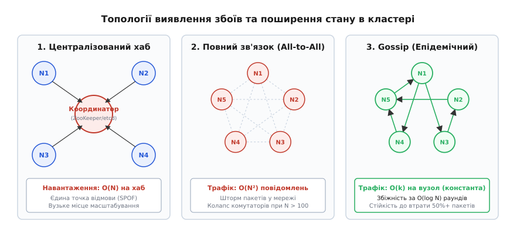
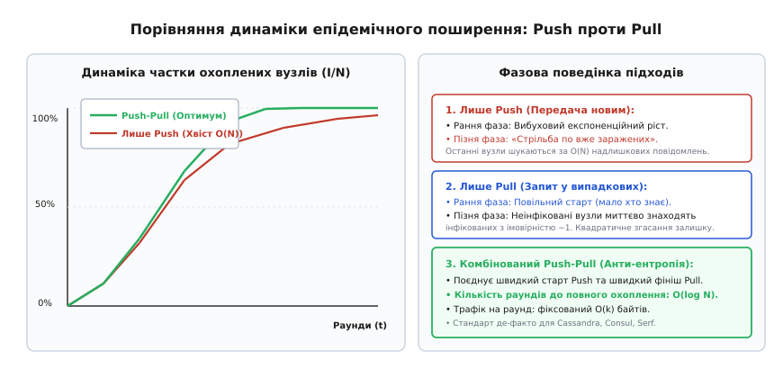
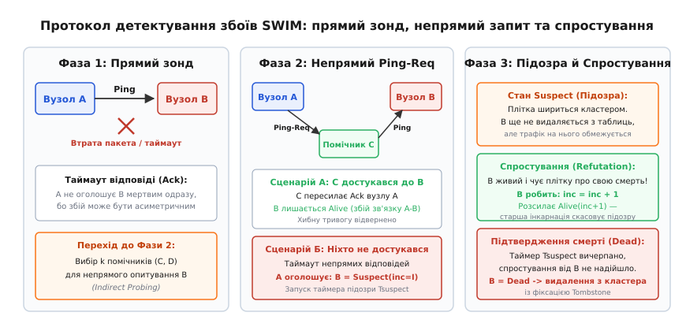

# Gossip-протоколи

<preknowlist>
- [Вісім оман розподілених обчислень](book:programming/distributed-fallacies) — ненадійність мережевих каналів, ненульові затримки та наслідки часткових відмов.
- [Кінцева узгодженість на практиці](book:programming/eventual-consistency) — модель збіжності реплік у часі без синхронного блокування.
- [Перевірки живості й готовності](book:programming/health-checks) — механізми активного зондування, пульсу (heartbeat) та детектування збоїв.
- [Кворуми та безлідерна реплікація](book:programming/quorum-and-leaderless) — топології збереження даних без виділеного майстра.
- [Виявлення сервісів](book:programming/service-discovery) — реєстри адрес, реєстрація вузлів та балансування навантаження.
</preknowlist>

Розподілений кластер із 3000 серверів у трьох дата-центрах керується централізованим координатором (таким як ZooKeeper або etcd). Кожен вузол щосекунди надсилає один UDP-пульс (heartbeat) на лідера для підтвердження свого статусу. За такого навантаження координатор отримує 3000 запитів на секунду, що становить помірний трафік. Проте під час планового масштабування до 30 000 серверів лідер стикається з повномасштабним колапсом: 30 000 мережевих переривань щосекунди переповнюють сокетний буфер ядра операційної системи (`SO_RCVBUF`), через що третина пульсів мовчки відкидається. Координатор помилково вирішує, що тисячі здорових серверів вийшли з ладу, і запускає лавину каскадних перевиборів, переналаштування маршрутизації та реплікаційних штормів, що повністю зупиняє роботу всієї системи.

Якщо ж відмовитися від координатора і змусити кожен вузол безпосередньо пінгувати кожного сусіда (топологія повного зв'язку або All-to-All), сумарна кількість повідомлень у раунді масштабується квадратично як `N · (N - 1)`. Для кластера з 30 000 серверів це створює майже 900 мільйонів пакетів на секунду, що миттєво перевантажує мережеві комутатори стійок (Top-of-Rack Switches) та викликає повну ізоляцію кластера.

У цій точці виникає фундаментальна потреба: системі потрібен протокол децентралізованого поширення інформації та виявлення збоїв, у якому навантаження на окремий вузол залишається строго постійним (`O(1)`), а час досягнення узгодженості між усіма учасниками зростає лише логарифмічно (`O(log N)`).

Такий клас розподілених алгоритмів отримав назву **gossip-протоколи** (від англ. *gossip* «плітки», у науковій літературі також відомі як *епідемічні протоколи* від грец. *epidemia* «повальна хвороба»).

---

## Анатомія масштабування: глухий кут координаторів та All-to-All штормів

Щоб зрозуміти, чому епідемічний обмін є єдиним математично стійким рішенням для надвеликих кластерів, зіставимо три фундаментальні топології зв'язку:

```
1. Централізований координатор (Хаб-топологія):
   • Навантаження на звичайний вузол: O(1) повідомлень.
   • Навантаження на лідера: O(N) повідомлень.
   • Проблема: Лідер є єдиною точкою відмови (SPOF) та пляшковим горлом процесора й мережі.

2. Повний зв'язок (All-to-All Mesh):
   • Навантаження на вузол: O(N) повідомлень.
   • Сумарний трафік у мережі: O(N²) повідомлень.
   • Проблема: Неможливість масштабування понад 100–200 серверів через шторм пакетів.

3. Gossip / Епідемічна топологія:
   • Навантаження на вузол: O(k) повідомлень (де k — фіксований fanout, зазвичай 2–4).
   • Сумарний трафік у мережі: O(k · N) повідомлень (лінійне масштабування).
   • Час доставки оновлення: O(log N) раундів.
```


*Порівняння архітектур зв'язку: централізований координатор створює вузьке місце O(N), повне з'єднання all-to-all генерує O(N²) повідомлень, а епідемічний gossip забезпечує O(1) навантаження на вузол за O(log N) раундів.*

Принцип роботи gossip нагадує поширення вірусу в біологічній популяції або чуток у людському суспільстві: вузол, який дізнався нову інформацію (наприклад, зміну IP-адреси або падіння сусіда), не намагається повідомити всіх. Він обирає невелику кількість `k` випадкових партнерів і передає оновлення їм. Ті, своєю чергою, обирають своїх випадкових партнерів. Завдяки експоненційному лавиноподібному розширенню кількість інфікованих вузлів подвоюється на кожному кроці.

Детальний опис зародження епідемічного підходу в дослідницькому центрі Xerox PARC наведено у вставці [Історія епідемічних алгоритмів: від Xerox PARC до SWIM і Dynamo](book:programming/gossip-protocols/hist-epidemic-algorithms.md).

---

## Дві парадигми Gossip: Dissemination проти Anti-Entropy

У розподіленій інженерії термін «gossip» об'єднує два принципово різні механізми, які вирішують відмінні завдання та мають різну ціну виконання:

```
+-------------------------------------------------------------------------------+
| 1. Поширення подій / Плітки (Rumor Mongering / Dissemination):               |
|    • Мета: Миттєва доставка коротких транзитних подій (членство, конфігурація)|
|    • Протокол: Ненадійний UDP, малий розмір дейтаграми (< 1400 байтів).       |
|    • Поведінка: Вузол пліткує фіксовану кількість раундів, після чого замовкає|
+-------------------------------------------------------------------------------+
                                       ▲
                                       │ доповнюють один одного
                                       ▼
+-------------------------------------------------------------------------------+
| 2. Анти-ентропія (Anti-Entropy Repair):                                      |
|    • Мета: Гарантована повна синхронізація застарілих або холодних даних.    |
|    • Протокол: Надійний TCP, порівняння хеш-дайджестів або дерев Меркла.     |
|    • Поведінка: Фоновий процес із низькою періодичністю (раз на 30–60 секунд).|
+-------------------------------------------------------------------------------+
```

### Динаміка фаз: Push, Pull та комбінований Push-Pull

Поширення інформації між вузлами реалізується трьома стратегіями вибору напрямку передачі:

1. **Стратегія Push:** Вузол, що володіє свіжим станом, обирає `k` випадкових вузлів і «заштовхує» їм дані.
   - *Перевага:* Надзвичайно швидкий старт. У перші раунди кількість інфікованих вузлів зростає як `(1 + k)^t`.
   - *Недолік:* Деградація на фініші. Коли 95% вузлів уже знають новину, інфіковані сервери продовжують штурмувати один одного, марно витрачаючи трафік на пошук останніх 5% неінфікованих («проблема купонів колекціонера»).
2. **Стратегія Pull:** Вузол періодично опитує `k` випадкових сусідів, запитуючи їхній поточний стан.
   - *Перевага:* Експоненційний фініш. Коли більшість кластера інфікована, будь-який неінфікований вузол із першої ж спроби знаходить оновленого сусіда. Залишок неінфікованих згасає квадратично: `s_{t+1} = (s_t)^(k+1)`.
   - *Недолік:* Повільний старт. Поки оновлення є лише в одного вузла, ймовірність натрапити на нього становить `1 / N`.
3. **Комбінована стратегія Push-Pull:**
   - Вузол відправляє свій короткий дайджест версій і одночасно приймає дайджест партнера. Якщо локальний стан новіший — виконується Push; якщо стан партнера свіжіший — виконується Pull.


*Порівняння динаміки поширення: експоненційний старт Push та швидке вирівнювання залишку через Pull забезпечують логарифмічний час збіжності O(log N).*

Суворе математичне виведення швидкості збіжності та розрахунок формул імовірності неінфікованих вузлів наведено у вставці [Математичне моделювання епідемічного поширення](book:programming/gossip-protocols/math-epidemic-spread.md).

Механізми попарного звіряння великих масивів даних через ієрархічні структури розглянуто в статті [Анти-ентропія та відновлення узгодженості](book:programming/anti-entropy-repair).

---

## Детектування збоїв та членство: протокол SWIM

Найдосконалішим стандартом децентралізованого керування членством у кластері є протокол **SWIM** (*Scalable Weakly-Consistent Infection-Style Process Group Membership Protocol*), створений у Корнелльському університеті.

SWIM вирішує дві ключові проблеми наївного пінгування:
- Як відрізнити реальну смерть вузла від тимчасової втрати окремого UDP-пакета?
- Як уникнути каскадних помилок через асиметричну маршрутизацію (коли вузол `A` не може відправити пакет вузлу `B`, але вузли `C` і `D` мають із `B` ідеальний зв'язок)?

```
     1. Прямий зонд (Direct Probe)             2. Непрямий зонд (Indirect Ping-Req)
   ┌─────────┐             ┌─────────┐       ┌─────────┐  Ping-Req   ┌─────────┐
   │ Вузол A │──── Ping ──>│ Вузол B │       │ Вузол A │────────────>│ Поміч. C│
   │         │<── [Drop] ──│ (збій?) │       │         │             └────┬────┘
   └─────────┘             └─────────┘       └────▲────┘                  │ Ping
                                                  │          Ack          ▼
                                                  └──────────────────┌─────────┐
                                                     (переслано через│ Вузол B │
                                                      помічника C)   └─────────┘
```

### Чотири фази життєвого циклу SWIM

1. **Фаза прямого зондування (Direct Probe):**
   Кожні `T_probe` мілісекунд вузол `A` обирає випадкового учасника `B` зі списку членства і надсилає дейтаграму `Ping`. Вузол чекає на відповідь `Ack` протягом часу `T_timeout` (зазвичай 500 мс). Якщо `Ack` отримано, раунд завершується успішно.
2. **Фаза непрямого зондування (Indirect Probing via Ping-Req):**
   Якщо прямий `Ack` не надійшов, вузол `A` не оголошує `B` несправним. Він обирає `k` випадкових посередників (`C, D, E`) і надсилає їм повідомлення `Ping-Req(target=B)`.
   Посередники пінгують `B` від свого імені. Якщо хоча б один посередник отримує `Ack` від `B`, він негайно пересилає його вузлу `A`. Це повністю нівелює локальні дропи на каналі між `A` та `B`.
3. **Механізм підозри (Suspicion Mechanism):**
   Якщо протягом дедлайну жоден із `k` помічників не зміг достукатися до `B`, вузол `A` переводить `B` у статус `Suspect` (підозрюваний) і розсилає плітку: `Suspect(node=B, incarnation=I)`.
   Вузол у стані `Suspect` продовжує перебувати в системі, але операційні системи обмежують спрямування клієнтського трафіку на нього. Одночасно запускається таймер підозри `T_suspect`.
4. **Спростування (Refutation) та лічильник інкарнацій:**
   Якщо вузол `B` насправді живий (наприклад, він не відповідав через важку паузу Stop-the-World збирача сміття JVM), він обов'язково отримає плітку про те, що його оголосили `Suspect`.
   Вузол `B` здійснює самоспростування: збільшує свій монотонний лічильник інкарнації `incarnation = I + 1` і розсилає кластером повідомлення `Alive(node=B, incarnation=I+1)`. Оскільки старша інкарнація завжди має вищий пріоритет, плітка `Alive` миттєво скасовує всі підозри в усіх вузлах кластера.
5. **Підтвердження смерті (Dead State):**
   Якщо таймер `T_suspect` спливає, а спростування з більшим номером інкарнації так і не надійшло, вузол остаточно переводиться у стан `Dead` та видаляється з активної таблиці маршрутизації.


*Послідовність SWIM: прямий зонд, непряме опитування через k помічників, запуск таймера підозри та спростування через підвищення номера інкарнації.*

Повний двійковий формат пакетів, коди операцій та часові параметри Memberlist описано у вставці [Специфікація протоколу Memberlist та формат пакетів](book:programming/gossip-protocols/api-memberlist-protocol.md).

Робочу реалізацію вузла SWIM мовами C та C++ наведено у вставці [Реалізація розподіленого SWIM-кластера з виявленням збоїв](book:programming/gossip-protocols/proj-swim-cluster.md).

---

## Адаптивне детектування збоїв: Phi Accrual Failure Detector

У глобальних мережах (WAN) або хмарних середовищах із віртуалізацією затримки проходження пакетів постійно коливаються. Жорстко закодований статичний таймаут (наприклад, `timeout = 1000 ms`) створює фатальну дилему:
- Зробиш таймаут малим (200 мс) — отримаєш постійні хибні спрацьовування під час мережевих сплесків;
- Зробиш таймаут великим (10 с) — система витрачатиме десятки секунд на виявлення реальної аварії.

Щоб подолати цей глухий кут, Наохіро Хаяшібара (Naohiro Hayashibara) у 2004 році розробив алгоритм **Phi Accrual Failure Detector** (впроваджений у Cassandra та Akka).

Замість бінарного рішення «вузол живий або мертвий» алгоритм видає неперервну ймовірнісну оцінку підозри `phi` (`φ`):

```
φ = -log10(P_later(t_now - t_last))
```

Вузол зберігає ковзне вікно (наприклад, останні 1000 інтервалів) між надходженнями пульсу від конкретного сервера, обчислює середнє значення `μ` та дисперсію `σ²`. Якщо черговий пакет затримується, `φ` плавно зростає:
- `φ = 1`: імовірність того, що пакет запізнився випадково, становить 10% (хибна тривога раз на 10 перевірок);
- `φ = 8`: імовірність випадкового запізнення становить `10^(-8)` (орієнтовно одна помилка на кілька місяців роботи);
- `φ = 12`: запізнення є аномальним із шансом `10^(-12)` — система негайно виключає вузол з обслуговування.

```
       Детектор зі статичним порогом            Адаптивний детектор Phi Accrual
   ┌───────────────────────────────────┐    ┌───────────────────────────────────┐
   │ Таймаут: фіксовані 1000 мс        │    │ φ = -log10(P_later)               │
   │                                   │    │                                   │
   │ Відповідь 1050 мс -> ВУЗОЛ МЕРТВИЙ│    │ При високому джитері σ поріг      │
   │ (Хибна тривога!)                  │    │ розсувається автоматично.         │
   └───────────────────────────────────┘    └───────────────────────────────────┘
```

Такий підхід дозволяє різним підсистемам кластера самостійно обирати агресивність реакції: балансувальник може тимчасово не слати запити на вузол вже при `φ = 5`, тоді як повне перерозподілення шардованих даних починається лише при досягненні `φ = 12`.

---

## Промислові архітектури та порівняльний аналіз

У сучасній інженерії виділяються три провідні архітектурні школи впровадження gossip:

```
+-------------------+-----------------------+-----------------------+-----------------------+
| Характеристика    | Apache Cassandra      | HashiCorp Memberlist  | Redis Cluster Bus     |
+-------------------+-----------------------+-----------------------+-----------------------+
| Транспорт         | TCP (періодичний sync)| UDP (probe) + TCP sync| TCP (+10000 порт)     |
| Детектор збоїв    | Phi Accrual           | SWIM (PingReq+Suspect)| Фіксований cluster-   |
|                   |                       |                       | node-timeout          |
| Що передається    | Токени, покоління,    | Членство, метадані    | Слоти (0-16383),      |
|                   | версії схеми, статус  | сервісів, події Serf  | прапорці master/slave |
| Період раунду     | 1000 мс               | 200–1000 мс           | 100 мс (активні)      |
| Захист від затримок| Покоління (generation)| Інкарнації (incarnation)| Епохи (configEpoch) |
+-------------------+-----------------------+-----------------------+-----------------------+
```

### 1. Модель Apache Cassandra (Generation & HeartBeatState)
Cassandra використовує TCP-gossip із поколіннями (Generation Number — Unix-час старту процесу). При кожному перезапуску сервера покоління монотонно зростає, що дозволяє іншим вузлам миттєво відкинути будь-яку застарілу інформацію про попередню сесію вузла. Стан вузла розбитий на мапу `ApplicationState` (версія схеми, статус приєднання до кільця, токени), де кожне поле має власний порядковий номер версії. Під час gossip-раунду передаються лише дельти версій.

### 2. Модель HashiCorp Memberlist / Consul
Consul використовує дворівневу модель:
- **LAN Gossip:** Працює всередині одного дата-центру з агресивними таймінгами (ProbeInterval = 1 с, UDP-підсаджування пліток у кожен Ping/Ack), забезпечуючи реакцію на аварію за 2–3 секунди.
- **WAN Gossip:** З'єднує сервери Consul між різними регіонами через повільніші канали (ProbeInterval = 5 с), ізолюючи локальні шторми пліток у межах свого майданчика.

### 3. Модель Redis Cluster Bus
Кожен вузол Redis відкриває спеціальний порт `порт + 10000` (Cluster Bus). Вузли періодично надсилають `PING` випадковим учасникам, прикріплюючи інформацію про стан 50% відомих їм серверів кластера та бітову мапу закріплених хеш-слотів.

---

## Виробничі пастки та крайові патології

Експлуатація gossip-систем під високим навантаженням стикається з низкою неочевидних крайових ефектів:

### 1. Проблема воскресіння померлих вузлів (Tombstone Resurrection Bug)
Якщо вузол `X` остаточно виведений з експлуатації, його не можна просто видалити з локальної пам'яті сусідів. Якщо вузол `A` видалить запис про `X`, а через секунду отримає плітку від застарілого вузла `B`, де `X` ще значиться як `Alive`, вузол `A` знову додасть `X` до свого списку як нового учасника.
*Рішення:* Видалення здійснюється через надгробки (Tombstones) — стан `Dead` зберігається в пам'яті протягом тривалого періоду очищення (англ. *tombstone GC period*, зазвичай від 72 годин до кількох днів) і лише потім стирається.

### 2. UDP-фрагментація та бюджет MTU
Коли розмір кластера або обсяг підсаджених метаданих зростає, спокуса запакувати більше пліток в один UDP-пакет призводить до перевищення розміру MTU (зазвичай 1500 байтів). Щойно дейтаграма перевищує MTU, мережевий стек розбиває її на два IP-фрагменти. Якщо маршрутизатор втрачає хоча б один фрагмент, уся дейтаграма відкидається цілком. Це викликає лавиноподібне зростання втрат пакетів саме тоді, коли кластер намагається повідомити про перевантаження.
*Рішення:* Суворе обмеження розміру UDP-пакета рівнем 1400 байтів. Усі великі оновлення передаються виключно через сесійний TCP Push-Pull.

### 3. Мережевий розкол (Split-Brain) та злиття (Partition Healing)
Під час розриву каналу між дата-центрами gossip-протокол розділяє кластер на два ізольовані острови. У кожній половині вузли протилежної сторони будуть оголошені `Dead`.
Коли зв'язок відновлюється, gossip-протокол самостійно «зцілює» розкол (Partition Healing): перші ж випадкові пінги між представниками різних половин виявляють актуальні стани `Alive` з новими інкарнаціями, і повна карта кластера автоматично регенерується за `O(log N)` раундів без ручного втручання оператора.

### 4. Візантійські отруєння та аномальні номери інкарнацій
Якщо вузол через баг у пам'яті або збій годинника виставить у пакеті `Alive` максимальний номер інкарнації `incarnation = 0xFFFFFFFF`, жоден інший вузол більше не зможе оголосити його підозрілим: будь-яка плітка `Suspect` із меншим номером ігноруватиметься.
*Рішення:* Захист від переповнення інкарнацій, валідація максимального кроку приросту (`max_step = 100`) та примусове перезавантаження вузла при досягненні стелі значень.

### 5. Стратегія посівних вузлів (Seed Nodes)
При старті нового сервера він нічого не знає про топологію кластера. Для первинного входу використовуються статичні або DNS-посівні вузли (Seed Nodes).
*Пастка:* Посівні вузли не мають особливих привілеїв під час роботи (це звичайні піри), але якщо всі посівні вузли вимкнені одночасно, новий вузол не зможе ініціалізувати первинний контакт. У продакшені посівні адреси завжди розносяться між різними зонами доступності та стійками.

---

> 🔧 **Навіщо це.**
>
> 1. **Масштабування моніторингу понад 10 000 вузлів:** Якщо ваша архітектура вимагає відстеження доступності тисяч контейнерів або мікросервісів, відмовтеся від централізованих опитувань лідера на користь децентралізованого бібліотечного шару Memberlist (SWIM). Це знімає CPU-навантаження з майстер-вузлів оркестраторів.
> 2. **Захист від каскадних відключень через GC-паузи:** Впровадження трифазного стану SWIM (`Alive → Suspect → Dead`) з механізмом самоспростування (Refutation) повністю ліквідує хибні спрацьовування балансувальників та сервісних сіток через короткочасні сплески пам'яті чи затримок віртуалізації.
> 3. **Автоматичне відновлення після мережевих розривів:** Gossip-протоколи забезпечують природне, математично гарантоване злиття розірваних контурів кластера без ризику шторму перепідключень до бази даних.
