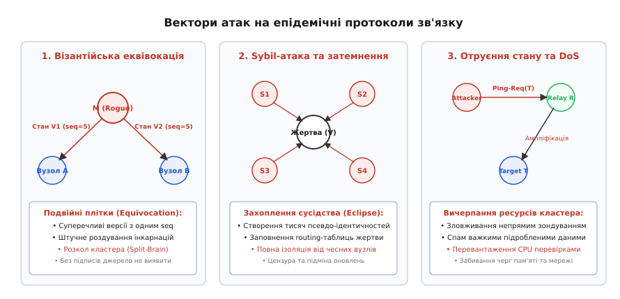
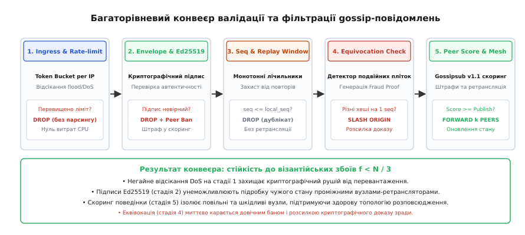
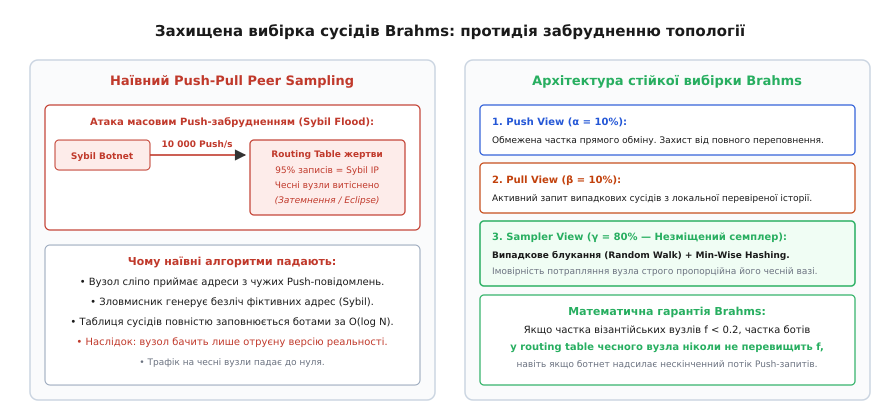

# Безпека пліток: Byzantine gossip, підписи та Sybil-атаки

<preknowlist>
- [Gossip-протоколи](book:programming/gossip-protocols) — основи епідемічного поширення, моделі Push, Pull та логарифмічна збіжність O(log N).
- [Вісім оман розподілених обчислень](book:programming/distributed-fallacies) — вразливість відкритих мереж, небезпека асиметричних затримок та топологічної нестабільності.
- [Плітки й членство в кластері](book:programming/gossip-membership) — протокол SWIM, непряме зондування, лічильники інкарнацій та механізм підозри.
- [Кворуми](book:programming/quorum-and-leaderless) — моделі перетину більшості та безлідерна реплікація.
- [Кінцева узгодженість на практиці](book:programming/eventual-consistency) — збіжність реплік у часі та розв'язання конфліктів стану.
</preknowlist>

Розподілений кластер із 4000 серверів використовує протокол епідемічного членства SWIM для моніторингу працездатності вузлів та динамічної маршрутизації. Зловмисник отримує доступ до одного периферійного вузла і починає транслювати фальшиве UDP-повідомлення: він оголошує всі три головні сервери координації мертвими (`Dead`), штучно встановивши номер інкарнації в максимальне 32-бітне значення `incarnation = 2 147 483 647`. Оскільки класичний gossip-протокол будується на сліпій довірі до найвищого баченого лічильника, чесні вузли приймають цю плітку і ретранслюють її своїм випадковим сусідам із коефіцієнтом `k = 3`. За 8 раундів (менше ніж 2.5 секунди) 99% серверів кластера видаляють координаційні вузли зі своїх локальних таблиць маршрутизації, обривають активні клієнтські сесії та переривають реплікацію даних. Справжні координатори намагаються спростувати хибну інформацію, але їхні легітимні повідомлення з нормальними номерами інкарнацій мовчки відкидаються всіма учасниками як застарілі.

Ця катастрофа розкриває фундаментальну слабкість класичних епідемічних алгоритмів: вони розроблялися для моделі відмов із зупинкою (англ. *crash-stop model*), у якій кожен учасник вважається апріорі чесним. Щойно система опиняється у ворожому середовищі (англ. *adversarial environment*) або зазнає компрометації хоча б одного вузла, швидкість та нестримність епідемічного поширення перетворюються на найпотужнішу зброю проти самої системи.

Щоб зберегти логарифмічне масштабування `O(log N)` та водночас забезпечити надійну роботу в присутності зрадників, епідемічний транспорт підсилюється протоколами безпеки від візантійських збоїв (від грец. *Byzantinos* — термін, уведений Леслі Лампортом для позначення довільної або шкідливої поведінки вузлів).

Історичний розвиток концепції боротьби зі зрадою в розподілених мережах — від математичного формулювання задачі візантійських генералів до сучасних протоколів консенсусу — детально викладено у вставці [Історія візантійських відмов: від генералів Лампорта до Gossipsub у блокчейнах](book:programming/gossip-security/hist-byzantine-faults.md).

---

## Анатомія загроз: як ламаються наївні епідемії

Уразливості епідемічних систем поділяються на чотири фундаментальні вектори атак, кожен із яких експлуатує специфічну властивість децентралізованого обміну:


*Вектори атак на епідемічні протоколи: візантійська еквівокація розколює стан, Sybil-атака захоплює сусідство жертви (Eclipse), а підроблені зондування створюють DoS-шторм ампліфікації.*

```
+-----------------------------------------------------------------------------------+
| 1. Візантійська еквівокація (Equivocation / Double-Gossiping):                    |
|    • Одночасне надсилання суперечливих станів v₁ та v₂ різним підмножинам пірів.  |
|    • Штучне роздування номерів версій (Sequence / Incarnation Inflation).         |
+-----------------------------------------------------------------------------------+
                                       ▲
                                       │ взаємно підсилюють загрозу
                                       ▼
+-----------------------------------------------------------------------------------+
| 2. Sybil-атаки та захоплення топології (Eclipse Attacks):                         |
|    • Створення тисяч фіктивних ідентичностей з однієї машини чи ботнету.          |
|    • Монополізація таблиць випадкової вибірки сусідів (Peer Sampling Service).    |
|    • Повна інформаційна ізоляція цільових вузлів від чесної частини мережі.       |
+-----------------------------------------------------------------------------------+
                                       ▲
                                       │
                                       ▼
+-----------------------------------------------------------------------------------+
| 3. Отруєння стану та DoS-ампліфікація (State Pollution & Amplification):          |
|    • Спам важкими невалідними повідомленнями для вичерпання пам'яті та процесора. |
|    • Зловживання механізмом непрямого зондування (ping-req) як підсилювачем трафіку|
+-----------------------------------------------------------------------------------+
```

### 1. Візантійська еквівокація (Equivocation)

Еквівокація (від лат. *aequivocatio* — двозначність) — це здатність скомпрометованого вузла стверджувати взаємовиключні факти різним учасникам мережі.

У класичному gossip-протоколі вузол `M` генерує оновлення конфігурації `V1` і передає його групі вузлів `A`, а групі вузлів `B` одночасно надсилає оновлення `V2` з тим самим ідентифікатором послідовності (`seq = 100`). Якщо повідомлення не захищені криптографічним зв'язуванням, група `A` вважатиме істинним стан `V1`, а група `B` — стан `V2`. Обидві групи поширюватимуть свої версії далі, спричиняючи перманентний розкол кластера (англ. *split-brain*) та руйнуючи кінцеву узгодженість.

### 2. Sybil-атаки та затемнення (Eclipse Attacks)

Епідемічні протоколи спираються на припущення, що кожен вузол обирає `k` партнерів **рівномірно випадково** з усієї популяції `N`. Сервіс, який надає цей список випадкових вузлів, називається сервісом вибірки пірів (англ. *Peer Sampling Service*, RPS).

Якщо створення нової ідентичності в мережі не вимагає відчутних витрат обчислювальних або фінансових ресурсів, зловмисник запускає Sybil-атаку (названу на честь клінічного випадку множинної особистості): генерує 100 000 віртуальних вузлів на кількох фізичних серверах. Ботнет починає агресивно надсилати повідомлення встановлення зв'язку чесним серверам.

Оскільки наївний сервіс вибірки пірів додає нові адреси до локальних таблиць на основі вхідних пакетів, таблиці маршрутизації чесних вузлів швидко заповнюються виключно адресами ботів. Коли чесний вузол намагається обрати `k` випадкових сусідів для чергового раунду пліток, з імовірністю `> 95%` усі `k` обраних вузлів виявляються підконтрольними атакуючому.

Вузол потрапляє в стан **затемнення** (англ. *Eclipse Attack*):
- Атакуючий повністю контролює вхідний і вихідний трафік жертви.
- Жертві блокують критичні оновлення системи або сповіщення про заміну ключів.
- Жертву піддають цілеспрямованій дезінформації, нав'язуючи їй хибне бачення консенсусу.

### 3. Отруєння стану та DoS-ампліфікація

У протоколах детектування відмов на зразок SWIM існує механізм непрямого зондування (англ. *Indirect Probing*): якщо вузол `A` не отримує прямої відповіді на `ping` від вузла `B`, він обирає `k` посередників `C₁, C₂, ...` і надсилає їм запит `ping-req(B)` з проханням перевірити стан `B`.

Зловмисник може надсилати мільйони запитів `ping-req(Target)` до всіх серверів кластера від імені різних адрес. Кожен такий невеликий запит змушує десятки посередників генерувати повнорозмірні пакети зондування у бік жертви `Target`. Мережа перетворюється на гігантський розподілений підсилювач рефлекторної DoS-атаки, забиваючи мережеву чергу жертви сміттєвим трафіком.

---

## Фундамент захисту: криптографічні конверти та монотонність

Першим обов'язковим рубежем захисту є усунення анонімності та незахищеності повідомлень на транспортному рівні.

Кожне повідомлення, що передається у gossip-мережі, огортається у криптографічний конверт (англ. *Cryptographic Envelope*), який містить публічний ключ джерела, номер послідовності, мітку часу та цифровий підпис на базі еліптичних кривих (Ed25519 або ECDSA):

```
+-----------------------------------------------------------------------------------+
| 1. Публічний ключ джерела (Origin Public Key, Ed25519, 32 байти)                  |
|    • Унікальний незмінний мережевий ідентифікатор автора даних.                   |
+-----------------------------------------------------------------------------------+
| 2. Монотонний лічильник послідовності (Sequence Number / Epoch, uint64)           |
|    • Гарантує строгий лінійний порядок версій стану для даного джерела.           |
+-----------------------------------------------------------------------------------+
| 3. Мітка часу створення (Timestamp Epoch UTC, uint64)                             |
|    • Обмежує час життя повідомлення та захищає від застарілих ін'єкцій.          |
+-----------------------------------------------------------------------------------+
| 4. Корисне навантаження (Payload: конфігурація, членство, стан)                   |
|    • Непрозорий бінарний масив даних прикладного рівня.                          |
+-----------------------------------------------------------------------------------+
| 5. Цифровий підпис автора (Signature, 64 байти)                                   |
|    • Sign(Origin_PrivateKey, SHA256(OriginKey || Seq || Time || Payload))       |
+-----------------------------------------------------------------------------------+
```

### Принцип дії криптографічного конверта

1. **Незмінність у транзиті (Integrity & Authenticity):**
   Проміжний ретранслятор `R` отримує підписаний конверт від джерела `S` і передає його сусіду `D`. Ретранслятор `R` не може змінити жодного біта в корисному навантаженні або зменшити номер послідовності, оскільки будь-яка модифікація зробить підпис `Signature` недійсним. Вузол `D` перевіряє підпис відкритим ключем `S` і переконується у справжності даних.
2. **Неможливість відмови від авторства (Non-Repudiation):**
   Джерело `S` не може заперечити факт відправлення повідомлення, оскільки валідний підпис міг бути створений лише за допомогою його закритого ключа `Origin_PrivateKey`.

---

## Виявлення еквівокації та докази зради (Fraud Proofs)

Наявність цифрових підписів унеможливлює модифікацію чужих повідомлень, проте не заважає самому джерелу підписати два різних повідомлення під одним номером послідовності: `Sign_S(seq=5, State=A)` та `Sign_S(seq=5, State=B)`.

Для нейтралізації цієї загрози захищений gossip-конвеєр використовує протокол **детекції подвійних пліток та генерації доказів зради**:


*Архітектура конвеєра захисту: відсікання DoS на стадії входу, перевірка криптографічного підпису й монотонності, виявлення еквівокації та динамічний скоринг репутації.*

Коли будь-який чесний вузол отримує повідомлення від автора `S` із номером `seq`, він перевіряє свій локальний кеш останніх бачених оновлень:
- Якщо `seq < local_seq[S]` — повідомлення мовчки відкидається як старий дублікат.
- Якщо `seq > local_seq[S]` — стан оновлюється: `local_seq[S] = seq`, а криптографічний хеш навантаження `hash = SHA256(Payload)` зберігається в таблиці.
- Якщо `seq == local_seq[S]`, але `hash ≠ local_hash[S]` — **зафіксовано факт візантійської еквівокації**.

Вузол, що виявив еквівокацію, миттєво формує структуру `EquivocationProof`, яка містить обидва конфліктні повідомлення разом із їхніми підписами. Цей доказ розміром менше 300 байтів негайно отримує найвищий пріоритет розповсюдження і розсилається всьому кластеру.

Будь-який вузол, отримавши `EquivocationProof`, перевіряє два підписи одного автора під однаковим номером послідовності над різними хешами. Оскільки математичний факт зради є беззаперечним, скомпрометована ідентичність `S` миттєво і назавжди додається до глобального чорного списку (англ. *Slashing / Permanent Blacklist*), а всі її подальші повідомлення ігноруються.

Математичне виведення швидкості поширення доказів еквівокації та розрахунок ймовірності виявлення зради наведено у вставці [Математичне моделювання візантійського зараження та стійкості Brahms](book:programming/gossip-security/math-byzantine-gossip.md).

---

## Захищена вибірка пірів: протокол Brahms

Навіть якщо всі повідомлення підписані, а еквівокація карається баном, зловмисник може спробувати захопити мережу за допомогою Sybil-атаки на рівні формування зв'язків (Peer Sampling).

Для захисту топології від забруднення фальшивими адресами застосовується протокол **Brahms** (*Byzantine-Resilient Random Membership Sampling*), розроблений Едвардом Бортоскі, Рідою Геррауї та їхніми колегами.


*Стійка вибірка сусідів Brahms: наївний обмін захоплюється ботнетом, тоді як поєднання Push, Pull та незміщеного рандомізованого семплера з min-wise хешуванням гарантує захист від затемнення.*

Brahms підтримує локальну таблицю сусідів фіксованого розміру `V` (зазвичай `V = 200–500` записів). Оновлення таблиці в кожному раунді здійснюється за трьома строго розділеними каналами:

1. **Компонента Push (частка `α = 10%`):**
   Приймає прямі запити на знайомство від інших вузлів. Оскільки зловмисник може генерувати мільярди `Push`-повідомлень, частка `Push` жорстко обмежена 10% від обсягу таблиці. Навіть повне отруєння цього каналу не дозволяє ботам захопити решту 90% таблиці.
2. **Компонента Pull (частка `β = 10%`):**
   Вузол самостійно обирає випадкових сусідів із власної локальної перевіреної історії та запитує їхні списки контактів.
3. **Незміщений рандомізований семплер (Unbiased Sampler, частка `γ = 80%`):**
   Головне ядро безпеки Brahms. Для вибору нових вузлів використовується поєднання **випадкових блукань** (англ. *Random Walks*) довжини `O(log N)` та техніки **min-wise незалежного хешування** (англ. *Min-Wise Hashing*).

### Механізм Min-Wise Hashing у вибірці

Для кожного випадкового блукання вузол ініціалізує набір із `m` незалежних хеш-функцій `h₁, h₂, ..., h_m`. Під час руху пакета вздовж ланцюжка вузлів кожен проміжний вузол `u` обчислює хеш свого публічного ключа `h_j(u)`. Пакет зберігає лише той вузол, який дав **мінімальне значення хешу** серед усіх відвіданих учасників:

```
u* = argmin_{u ∈ Walk} h_j(u)
```

Завдяки властивостям min-wise хешування ймовірність того, що конкретний вузол стане переможцем (мінімумом), строго пропорційна його чесній вазі в графі зв'язності та повністю не залежить від кількості повідомлень, які транслює ботнет.

Математично доведено: якщо частка візантійських вузлів у мережі `f < 0.2` (до 20% зловмисників), протокол Brahms гарантує, що частка ботів у таблиці маршрутизації будь-якого чесного вузла ніколи не перевищить `28.8%`, що унеможливлює успішне здійснення Eclipse-атаки.

---

## Багатовимірний скоринг репутації: модель Gossipsub v1.1

У великомасштабних однорангових мережах (таких як блокчейн-мережа Ethereum) бінарного поділу вузлів на «чесні» та «забанені» недостатньо: необхідний динамічний механізм оцінки якості роботи кожного сусіда в реальному часі.

Цю задачу вирішує протокол **Gossipsub v1.1** за допомогою багатовимірного репутаційного скорингу (англ. *Peer Scoring*).

Репутація сусіда `i` обчислюється як зважена функція п'яти параметрів:

```
Score(i) = ∑ [ w_t · (w₁·P₁ + w₂·P₂ + w₃·P₃ + w₄·P₄) ] + w_app·P₅ + w_coloc·P₆
```

```
+-----------------------------------------------------------------------------------+
| 1. Час перебування в сітці топіка (P₁: Time in Mesh):                             |
|    • w₁ > 0. Заохочує стабільні довготривалі з'єднання, захищає від churn.       |
+-----------------------------------------------------------------------------------+
| 2. Первинна доставка нових повідомлень (P₂: First Message Deliveries):            |
|    • w₂ > 0. Винагороджує вузли з низькою затримкою та швидкими каналами.         |
+-----------------------------------------------------------------------------------+
| 3. Достатність доставки повідомлень (P₃: Mesh Message Delivery Rate):             |
|    • w₃ < 0. Штрафує підписаних вузлів, які замовчують корисні повідомлення.     |
+-----------------------------------------------------------------------------------+
| 4. Невалідні / биті повідомлення (P₄: Invalid Message Deliveries):                |
|    • w₄ << 0. Квадратичний штраф -(Count)² за відправлення невалідних підписів.  |
+-----------------------------------------------------------------------------------+
| 5. Обмеження колокації за IP-підмережами (P₆: IP Colocation Penalty):            |
|    • w_coloc < 0. Прогресивний штраф за запуск багатьох ботів на одній підмережі. |
+-----------------------------------------------------------------------------------+
```

### Автомат станів репутації

На основі розрахованого значення `Score` поведінковий рушій класифікує сусіда за чотирма граничними порогами:

1. **Gossip Threshold (`Score ≥ 0.0`):** Стандартний партнер по сітці, бере участь у повному обміні корисними даними.
2. **Publish Threshold (`Score < -50.0`):** Сусіду заборонено передавати прямі корисні навантаження; від нього приймаються лише контрольні запити метаданих.
3. **Graylist Threshold (`Score < -100.0`):** Усі вхідні повідомлення від сусіда мовчки скидаються (`DROP`) без витрачання процесорного часу на перевірку криптографічних підписів.
4. **Disconnect Threshold (`Score < -1000.0`):** Мережеве з'єднання негайно закривається, а IP-адреса блокується на рівні фаєрволу.

Повна специфікація бінарного кадру, конфігураційні матриці коефіцієнтів та системні коди помилок описані у вставці [Специфікація захищеного протоколу пліток, матриця скорингу та конфігурація](book:programming/gossip-security/api-gossip-defense.md).

Практична реалізація захищеного gossip-рушія з перевіркою підписів та скорингом мовами C та C++20 наведена у вставці [Реалізація захищеного gossip-рушія з підписами Ed25519 та скорингом](book:programming/gossip-security/proj-secure-gossip.md).

---

> 🔧 **Навіщо це в реальній інженерії.**
> 
> 1. **Consul та Serf Encrypted Mesh:** У продакшен-інфраструктурі HashiCorp Consul використовує протокол Serf, де кожна UDP-дейтаграма членства та виявлення збоїв шифрується симетричним алгоритмом AES-128/256-GCM із контролем цілісності та захистом від перегравання через лічильники епох. Це унеможливлює ін'єкцію фальшивих статусів усередині корпоративних мереж.
> 2. **Ethereum 2.0 Consensus Layer:** Більше 10 000 валідаторських вузлів клієнтів Prysm, Lighthouse та Teku щодоби обмінюються мільйонами підписаних BLS/Ed25519 атестацій через протокол GossipSub v1.1. Багатовимірний скоринг захищає глобальний блокчейн від спроб зупинки консенсусу через спам невалідними блоками.
> 3. **Apache Cassandra Inter-Node TLS:** Розподілена база даних Cassandra використовує взаємну автентифікацію Mutual TLS (mTLS) між усіма вузлами кластера під час епідемічного обміну метаданими схем та кільця токенів (Gossip Stage), повністю ізолюючи внутрішню топологію від неавторизованих підключень.

---

## Підсумковий синтез: баланс вартості та безпеки

Захист епідемічних протоколів від візантійських збоїв не змінює базової природи gossip-алгоритмів: час поширення залишається логарифмічним `O(log N)`, а локальне мережеве навантаження — константним `O(k)`.

Проте ціна безпеки виражається в додаткових ресурсах:
- **Накладні витрати мережі:** Збільшення розміру дейтаграми на 96–128 байтів (публічний ключ, підпис, мітка часу та монотонний лічильник).
- **Накладні витрати процесора:** 25–60 мікросекунд на перевірку одного цифрового підпису Ed25519 (що компенсується пакетною верифікацією Batch Verification та швидким відсіканням на стадії Fast-Reject).
- **Накладні витрати пам'яті:** Зберігання таблиць скорингу пірів та кешів останніх номерів послідовностей (з фіксованим обмеженням через LRU-витіснення).

Впровадження криптографічних підписів, незміщеної вибірки Brahms та багатовимірного скорингу Gossipsub перетворює вразливу епідемію на надійний магістральний транспорт, здатний стабільно функціонувати навіть в умовах прямої ворожої координації до третини вузлів системи.
