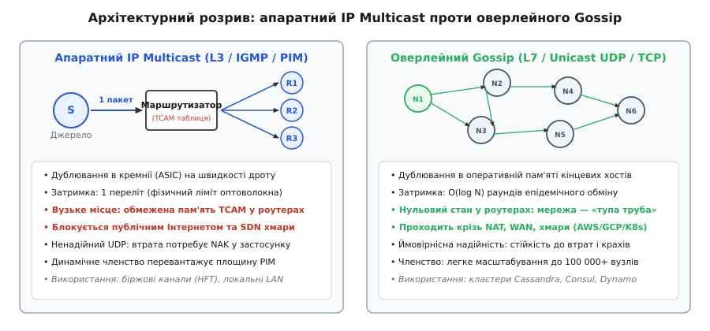
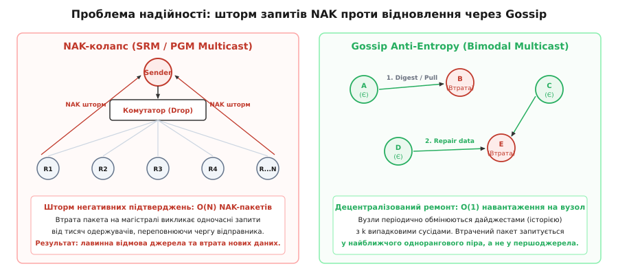
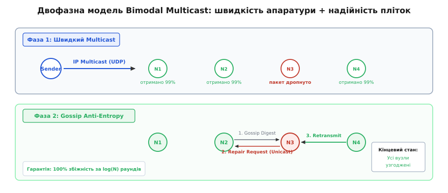

# Gossip vs IP Multicast

<preknowlist>
* [Мережевий сокет-API для групового мовлення](topic:programming/multicast-and-discovery) — базові операції приєднання сокета до групи мовлення на транспортному рівні.
* [Gossip-членство та протокол SWIM](topic:programming/gossip-membership) — концепція децентралізованого відстеження стану вузлів без координатора.
* [Anti-Entropy відновлення](topic:programming/anti-entropy-repair) — механіка фонового злиття розбіжностей у розподіленому стані через випадковий обмін.
* [Гарантії доставки у розподілених системах](topic:programming/delivery-guarantees) — класифікація семантик від At-most-once до надійного упорядкованого мовлення.
* [Метастабільні відмови](topic:programming/metastable-failures) — механізми самопідтримуваного перевантаження під час каскадних ретраїв і штормів запитів.
</preknowlist>

Коли кластер із 5000 вузлів потребує узгодженого оновлення конфігурації або членства, послідовне надсилання 5000 одноадресних пакетів (unicast) із центрального координатора виснажує його вихідний канал до повної відмови. Останній сервер у списку отримує оновлення із затримкою в десятки секунд, створюючи тривале вікно розбіжності даних. Інженерне рішення цієї проблеми вимагає розмноження дейтаграм у дорозі, проте фундаментальне розходження полягає в тому, де саме виконувати це копіювання: в апаратному кремнії комутаторів мережевого рівня L3 (IP Multicast) чи в прикладній пам'яті кінцевих серверів через взаємний епідемічний обмін рівня L7 (Gossip).

Вибір між цими підходами визначає не лише затримку доставки, а й граничну стійкість усієї системи до перевантажень, пачкових втрат у мережі та динамічних змін топології.


*Порівняння рівнів виконання: апаратний L3 Multicast у кремнії комутаторів проти децентралізованого L7 Gossip оверлею в пам'яті процесів.*

---

## Апаратний IP Multicast: ілюзія нульової вартості копіювання

Концепція групового мовлення (англ. *multicast*, від лат. *multus* — численний та англ. *cast* — спрямовувати) на рівні міжмережевого протоколу IP спирається на адреси класу D (діапазон `224.0.0.0/4` для IPv4 та `ff00::/8` для IPv6). Відправник формує рівно один UDP-пакет із цільовою груповою адресою, передає його на свій мережевий адаптер і повністю звільняє процесор від подальшого обслуговування цієї трансляції.

Копіювання дейтаграми здійснюється мережевими комутаторами та маршрутизаторами лише в точках фізичного розгалуження топології:

```
[Джерело даних S]
       │ (1 копія)
       ▼
[Комутатор ядра Spine]
  ┌────┴────────────┐
  │ (1 копія)       │ (1 копія)
  ▼                 ▼
[ToR Switch 1]    [ToR Switch 2]
 ┌───┼───┐         ┌───┼───┐
 ▼   ▼   ▼         ▼   ▼   ▼
[R1][R2][R3]      [R4][R5][R6]  (Кожен одержувач забирає локальну копію)
```

Для керування членством у групі хости використовують протокол IGMP (Internet Group Management Protocol) у мережах IPv4 або MLD (Multicast Listener Discovery) у мережах IPv6. Локальний комутатор аналізує ці звіти за допомогою механізму IGMP Snooping і програмує свою таблицю комутації (MAC Table), транслюючи групові Ethernet-кадри (діапазон `01:00:5e:00:00:00` — `01:00:5e:7f:ff:ff`) лише у ті фізичні порти, де присутні зареєстровані слухачі.

Маршрутизатори між підмережами будують спільні або індивідуальні дерева доставки за протоколом PIM-SM (Protocol Independent Multicast — Sparse Mode), визначаючи спільну точку рандеву (Rendezvous Point, RP).

З погляду відправника навантаження на мережевий стек становить строго `O(1)`. Пакет долає мінімальну кількість фізичних комутацій без додаткових затримок на буферизацію в операційній системі хостів-посередників, забезпечуючи час доставки на рівні мікросекунд.

---

## Чотири бар'єри апаратного мовлення у глобальних та хмарних мережах

Попри фізичну досконалість на рівні локального комутатора, спроба використати чистий IP Multicast за межами ізольованої стійки серверів стикається з системними обмеженнями архітектури Інтернету та віртуалізованих центрів обробки даних.

### 1. Вибух стану в TCAM-пам'яті маршрутизаторів

У класичній маршрутизації unicast таблиця BGP оперує агрегованими префіксами підмереж (CIDR), що дозволяє зберігати мільйони маршрутів у компактному вигляді. В IP Multicast кожен маршрутизатор уздовж дерева повинен підтримувати стан кожної активної пари «джерело-група» `(S, G)` або агрегованої групи `(*, G)`.

Ці записи зберігаються в асоціативній триковій пам'яті (TCAM, Ternary Content-Addressable Memory) мережевих процесорів. Ємність TCAM суворо обмежена через високу вартість та тепловиділення. Якщо в кластері з'являється 50 000 мікросервісів, кожен із яких створює власну групу мовлення для координації, таблиці комутаторів переповнюються. Маршрутизатор скидає надлишкові пакети на свій центральний процесор (Control Plane Exception), що призводить до відмови всього мережевого вузла.

### 2. Економічна інверсія та відсутність міждоменного транзиту

В одноадресній моделі діє правило: замовник вихідного трафіку оплачує транзит своєму провайдеру (Tier-1/Tier-2 ISP). В IP Multicast відправник у мережі провайдера `A` надсилає 1 МБ, а провайдер `B` на іншому континенті змушений розмножити цей пакет на 100 000 своїх локальних абонентів, згенерувавши 100 ГБ внутрішнього навантаження. Оскільки технічного протоколу взаємного клірингу між операторами для групового трафіку не було створено, комерційні провайдери за замовчуванням заблокували транзитний IP Multicast на своїх прикордонних шлюзах BGP.

Детальний аналіз історії створення експериментальної мережі MBone та причин її глобального занепаду наведено у вставці [📜 Від MBone і Deering до епідемій: чому апаратний Multicast не підкорив Інтернет](topic:programming/gossip-vs-multicast/hist-mbone-to-epidemics.md).

### 3. Відсутність зворотного зв'язку та керування перевантаженням

IP Multicast базується на UDP. У ньому відсутні вбудовані вікна перевантаження (Congestion Windows), таймери RTT та плавне гальмування швидкості, які є фундаментом TCP. Якщо джерело транслює потік зі швидкістю 1 Гбіт/с у групу, де 99 вузлів мають інтерфейси 10 Гбіт/с, а один вузол підключений через канал 100 Мбіт/с, черга вихідного порту останнього комутатора миттєво переповнюється, провокуючи 90% втрату пакетів без жодного сигналу для джерела.

### 4. Блокування у віртуалізованих хмарах (AWS, GCP, Azure)

Сучасні хмарні платформи будують віртуальні мережі (VPC) на основі протоколів інкапсуляції Geneve, VXLAN та OpenFlow у віртуальних комутаторах ядра гіпервізора. Одночасне розмноження пакетів між тисячами віртуальних машин у різних фізичних стійках вимагає підтримки глобального стану тунелів на кожному хості віртуалізації. Через ризик нестабільності площини керування гіперскейлери за замовчуванням вимкнули L3 Multicast усередині призначених для користувача підмереж VPC, надаючи натомість дорогі пропрієтарні шлюзи транзитної маршрутизації з жорсткими лімітами пропускної здатності.

---

## Надійний Multicast і пастка NAK-колапсу

Оскільки сам протокол IP Multicast не гарантує доставки, прикладні системи змушені будувати транспортний шар надійності (Reliable Multicast, протоколи SRM, PGM, RMTP). Спроба перенести механіку квитування з TCP у групове середовище викликає катастрофічне явище NAK-колапсу (NAK Implosion).

Якщо вимагати від кожного одержувача позитивного підтвердження (ACK, Acknowledgment), відправник на кожне надіслане повідомлення отримує лавину з `N` відповідей, що паралізує вхідну чергу його мережевої карти. Тому протоколи групової надійності використовують виключно негативні квитанції (NAK, Negative Acknowledgment): одержувач мовчить, якщо номери пакетів ідуть послідовно (`1, 2, 3...`), і надсилає запит джерелу лише при виявленні пропуску (наприклад, після отримання номера `5` замість `4`).


*Анатомія збою: NAK-колапс джерела при втраті пакета в спільному каналі проти розподіленого фонового виправлення втрат через випадкових сусідів у Gossip.*

Якщо пакет втрачається на магістральному комутаторі (спільній гілці дерева розсилки), втрату фіксують одночасно всі `M` серверів, розташованих за цим комутатором. Кожен із них негайно надсилає `NAK` у бік джерела:

```
R_nak = λ · N · p   [інтенсивність вхідного потоку NAK на відправника]
```

де `λ` — частота генерації повідомлень джерелом, `N` — розмір групи, `p` — імовірність втрати пакета.

Коли потік `R_nak` перевищує пропускну здатність мережевого стека відправника `μ`, буфер сокета переповнюється за час:

```
T_overflow = B / (λ · N · p - μ)   [час до вичерпання буфера розміром B]
```

Для кластера з `N = 10 000` вузлів при потоці `λ = 1000` пакетів/с та втраті `p = 0.01` інтенсивність NAK становить 100 000 пакетів на секунду. Буфер сокета переповнюється менш ніж за секунду. Ядро джерела починає скидати як нові `NAK`, так і чергові пакети даних, через що інші вузли також фіксують втрату й надсилають додаткові `NAK`. Система входить у незворотну [метастабільну відмову](topic:programming/metastable-failures), повністю припиняючи корисну роботу.

Повний математичний вивід імовірнісних меж NAK-колапсу та формул надійності розібрано в статті [Bimodal Multicast (pbcast)](topic:programming/bimodal-multicast).

---

## Епідемічний Gossip: децентралізована доставка рівня L7

Епідемічні протоколи (Gossip, від давньоангл. *godsibb* — хрещений родич / близький співрозмовник; грец. *epidēmia* — поширення серед людей) відмовляються від збереження будь-якого стану в мережевих маршрутизаторах. Мережа розглядається як звичайна ненадійна одноадресна труба (Unicast UDP/TCP).

Замість побудови детермінованого дерева кожен вузол у кластері періодично (раз на період `T_gossip`, наприклад 200 мс) обирає `k` випадкових партнерів зі своєї локальної таблиці [членства у кластері](topic:programming/gossip-membership) та обмінюється з ними даними або дайджестами стану:

```
[Вузол A] ──(Unicast UDP: Digest)──► [Вузол X (випадковий)]
[Вузол A] ──(Unicast UDP: Digest)──► [Вузол Y (випадковий)]
[Вузол A] ──(Unicast UDP: Digest)──► [Вузол Z (випадковий)]
```

### Динаміка поширення та логарифмічна збіжність

Процес поширення пліток математично ізоморфний класичній моделі епідемії SIR (Susceptible-Infectious-Recovered):
1. **Susceptible (Вразливі):** Вузли, які ще не знають про нове повідомлення.
2. **Infectious (Інфіковані):** Вузли, які отримали повідомлення та активно розсилають його випадковим сусідам.
3. **Removed (Вилучені):** Вузли, які перенесли повідомлення в історію та припинили активну трансляцію.

Кількість раундів `R`, необхідна для гарантованого поширення інформації до всіх `N` учасників кластера з високою ймовірністю (High Probability, `1 - 1/N`), масштабується логарифмічно:

```
R = c · log(N)   [де c — константа, що залежить від fan-out k]
```

Для кластера з `N = 100 000` серверів при коефіцієнті розгалуження `k = 3` повне поширення вимагає приблизно `log₂(100000) ≈ 17` раундів. При періоді раунду 100 мс оновлення охоплює весь світовий кластер за 1.7 секунди.

```
+--------------------------+--------------------+---------------------+
| Властивість              | Апаратний Multicast| Епідемічний Gossip  |
+--------------------------+--------------------+---------------------+
| Рівень моделі OSI        | L3 (Мережевий)     | L7 (Прикладний)     |
| Навантаження на джерело  | O(1)               | O(k) на період      |
| Стан у комутаторах       | O(груп × джерел)   | 0 (звичайний IP)    |
| Підтримка в хмарах (VPC) | Заблоковано        | Працює скрізь       |
| Затримка доставки        | 10–500 мкс         | 100–3000 мс         |
| Поведінка при відмові    | Втрата піддерева   | Автономне обходження|
| Механізм відновлення     | NAK-шторм на L3    | Локальний L7 repair |
+--------------------------+--------------------+---------------------+
```

---

## Гібридна парадигма: Bimodal Multicast (pbcast)

Протиставлення швидкості IP Multicast та надійності Gossip знаходить компроміс у гібридному протоколі **Bimodal Multicast** (також відомому як Probabilistic Broadcast, pbcast), розробленому Кеном Бірманом та Марком Гейденом (Ken Birman, Mark Hayden).

Ідея полягає в асиметричному розподілі обов'язків: високошвидкісна, але ненадійна апаратна розсилка використовується для первинної доставки, а випадковий епідемічний Gossip — виключно для фонового виявлення та закриття пропусків без участі первинного відправника.


*Двофазний гібрид Bimodal Multicast: швидка оптимістична доставка через IP Multicast на фазі 1 та ймовірнісне довиправлення пропусків через Gossip Anti-Entropy на фазі 2.*

### Механізм двох фаз

#### Фаза 1: Оптимістична апаратна розсилка (Optimistic Dissemination)
Джерело надсилає пакет через звичайний ненадійний UDP IP Multicast. За сприятливих умов комутатори доставляють дейтаграму 95–99% вузлів за частки мілісекунди. Відправник зберігає пакет у локальному кільцевому буфері й більше ніколи не бере участі в повторних передачах.

#### Фаза 2: Епідемічне довиправлення (Anti-Entropy Repair)
Кожен вузол періодично формує компактний дайджест (Digest) отриманих послідовностей і відправляє його випадково обраному сусідові через Unicast UDP. Якщо вузол `B` бачить у дайджесті вузла `A`, що `A` має пакет №42, якого немає у `B`, вузол `B` надсилає запит на ретрансляцію (`REPAIR_REQ`) безпосередньо вузлу `A`. Вузол `A` дістає копію зі свого кільцевого буфера та надсилає її вузлу `B` через одноадресне з'єднання.

### Бімодальність як математична властивість

У Bimodal Multicast розподіл кінцевої кількості інформованих вузлів `Z` є строго бімодальним (має дві різкі вершини):
1. **Майже всі вузли (`Z ≈ 1.0`):** Якщо джерело встигло передати пакет хоча б невеликій початковій підмножині вузлів (`> log N`), епідемічний процес другого етапу з експоненційною швидкістю затягує всі втрати. Імовірність того, що хоча б один здоровий вузол не отримає повідомлення, падає нижче `10⁻⁹`.
2. **Жоден вузол (`Z ≈ 0.0`):** Якщо джерело зазнало фатального краху в перші мікросекунди до виходу пакета в мережу.

Проміжні катастрофічні стани (коли 40% кластера зафіксували транзакцію, а 60% про неї не знають) повністю усуваються без застосування важких протоколів консенсусу або блокуючих двофазних фіксацій.

Повна специфікація бінарних заголовків, бітових масок дайджестів та констант Bimodal Wire Protocol зафіксована у [📋 Специфікації мережевого протоколу Bimodal Wire Protocol](topic:programming/gossip-vs-multicast/api-bimodal-wire-spec.md).

---

## Програмне налаштування сокетів: Multicast проти Gossip

Для практичного розуміння різниці розглянемо фрагменти коду для конфігурації сокета прийому апаратного IP Multicast на рівні ядра ОС та реалізацію обробника відновлення пакетів Bimodal Gossip через одноадресний UDP.

### Приєднання до групи IP Multicast

Для отримання групових дейтаграм процес повинен явно повідомити мережевий стек ядра ОС про бажання підписатися на адресу групи за допомогою опції сокета `IP_ADD_MEMBERSHIP`.

:::tabs
```c
#include <stdio.h>
#include <string.h>
#include <unistd.h>
#include <arpa/inet.h>
#include <netinet/in.h>
#include <sys/socket.h>

int setup_multicast_receiver(const char *mcast_addr, int port, const char *iface_ip) {
    int fd = socket(AF_INET, SOCK_DGRAM, 0);
    if (fd < 0) {
        return -1;
    }

    int reuse = 1;
    if (setsockopt(fd, SOL_SOCKET, SO_REUSEADDR, &reuse, sizeof(reuse)) < 0) {
        close(fd);
        return -1;
    }

    struct sockaddr_in bind_addr;
    memset(&bind_addr, 0, sizeof(bind_addr));
    bind_addr.sin_family = AF_INET;
    bind_addr.sin_port = htons(port);
    bind_addr.sin_addr.s_addr = htonl(INADDR_ANY);

    if (bind(fd, (struct sockaddr *)&bind_addr, sizeof(bind_addr)) < 0) {
        close(fd);
        return -1;
    }

    struct ip_mreq mreq;
    memset(&mreq, 0, sizeof(mreq));
    mreq.imr_multiaddr.s_addr = inet_addr(mcast_addr);
    mreq.imr_interface.s_addr = inet_addr(iface_ip);

    if (setsockopt(fd, IPPROTO_IP, IP_ADD_MEMBERSHIP, &mreq, sizeof(mreq)) < 0) {
        close(fd);
        return -1;
    }

    return fd;
}
```
```cpp
#include <expected>
#include <string_view>
#include <system_error>
#include <cstring>
#include <unistd.h>
#include <arpa/inet.h>
#include <netinet/in.h>
#include <sys/socket.h>

class UniqueSocket {
    int fd_{-1};
public:
    explicit UniqueSocket(int fd) noexcept : fd_(fd) {}
    ~UniqueSocket() noexcept {
        if (fd_ >= 0) {
            ::close(fd_);
        }
    }
    UniqueSocket(const UniqueSocket&) = delete;
    UniqueSocket& operator=(const UniqueSocket&) = delete;
    UniqueSocket(UniqueSocket&& other) noexcept : fd_(other.fd_) {
        other.fd_ = -1;
    }
    UniqueSocket& operator=(UniqueSocket&& other) noexcept {
        if (this != &other) {
            if (fd_ >= 0) ::close(fd_);
            fd_ = other.fd_;
            other.fd_ = -1;
        }
        return *this;
    }
    [[nodiscard]] int get() const noexcept { return fd_; }
    [[nodiscard]] bool valid() const noexcept { return fd_ >= 0; }
};

[[nodiscard]] std::expected<UniqueSocket, std::error_code>
create_multicast_receiver(std::string_view mcast_addr, uint16_t port, std::string_view iface_ip) noexcept {
    int raw_fd = ::socket(AF_INET, SOCK_DGRAM, 0);
    if (raw_fd < 0) {
        return std::unexpected(std::error_code(errno, std::generic_category()));
    }
    UniqueSocket sock(raw_fd);

    int reuse = 1;
    if (::setsockopt(sock.get(), SOL_SOCKET, SO_REUSEADDR, &reuse, sizeof(reuse)) < 0) {
        return std::unexpected(std::error_code(errno, std::generic_category()));
    }

    sockaddr_in bind_addr{};
    bind_addr.sin_family = AF_INET;
    bind_addr.sin_port = htons(port);
    bind_addr.sin_addr.s_addr = htonl(INADDR_ANY);

    if (::bind(sock.get(), reinterpret_cast<const sockaddr*>(&bind_addr), sizeof(bind_addr)) < 0) {
        return std::unexpected(std::error_code(errno, std::generic_category()));
    }

    ip_mreq mreq{};
    if (::inet_pton(AF_INET, mcast_addr.data(), &mreq.imr_multiaddr) <= 0) {
        return std::unexpected(std::make_error_code(std::errc::invalid_argument));
    }
    if (::inet_pton(AF_INET, iface_ip.data(), &mreq.imr_interface) <= 0) {
        return std::unexpected(std::make_error_code(std::errc::invalid_argument));
    }

    if (::setsockopt(sock.get(), IPPROTO_IP, IP_ADD_MEMBERSHIP, &mreq, sizeof(mreq)) < 0) {
        return std::unexpected(std::error_code(errno, std::generic_category()));
    }

    return sock;
}
```
:::

### Обробник відновлення пропущених пакетів у Bimodal Gossip

Коли вузол виявляє пропуск послідовності, він надсилає точковий одноадресний запит (`BWP_REPAIR_REQ`) до випадкового сусіда замість первинного джерела.

:::tabs
```c
#include <stdint.h>
#include <string.h>
#include <sys/socket.h>
#include <netinet/in.h>

#define BWP_MSG_REPAIR_REQ 0x03
#define BWP_MSG_REPAIR_RES 0x04

struct bwp_repair_header {
    uint8_t  type;
    uint8_t  flags;
    uint16_t reserved;
    uint64_t missing_seq;
    uint32_t sender_node_id;
} __attribute__((packed));

int send_gossip_repair_request(int unicast_fd, const struct sockaddr_in *peer_addr,
                               uint64_t seq, uint32_t my_id) {
    struct bwp_repair_header req;
    req.type = BWP_MSG_REPAIR_REQ;
    req.flags = 0;
    req.reserved = 0;
    req.missing_seq = htobe64(seq);
    req.sender_node_id = htonl(my_id);

    ssize_t sent = sendto(unicast_fd, &req, sizeof(req), 0,
                          (const struct sockaddr *)peer_addr, sizeof(*peer_addr));
    return (sent == sizeof(req)) ? 0 : -1;
}
```
```cpp
#include <cstdint>
#include <expected>
#include <system_error>
#include <bit>
#include <endian.h>
#include <sys/socket.h>
#include <netinet/in.h>

#pragma pack(push, 1)
struct BwpRepairHeader {
    uint8_t  type{0x03};
    uint8_t  flags{0};
    uint16_t reserved{0};
    uint64_t missing_seq{0};
    uint32_t sender_node_id{0};
};
#pragma pack(pop)

[[nodiscard]] std::expected<void, std::error_code>
send_gossip_repair_request(int unicast_fd, const sockaddr_in& peer_addr,
                           uint64_t seq, uint32_t my_id) noexcept {
    BwpRepairHeader req{
        .type = 0x03,
        .flags = 0,
        .reserved = 0,
        .missing_seq = htobe64(seq),
        .sender_node_id = htonl(my_id)
    };

    const auto* buf = reinterpret_cast<const char*>(&req);
    ssize_t sent = ::sendto(unicast_fd, buf, sizeof(req), 0,
                            reinterpret_cast<const sockaddr*>(&peer_addr),
                            sizeof(peer_addr));

    if (sent < 0) {
        return std::unexpected(std::error_code(errno, std::generic_category()));
    }
    if (static_cast<size_t>(sent) != sizeof(req)) {
        return std::unexpected(std::make_error_code(std::errc::message_size));
    }

    return {};
}
```
:::

---

## Інженерна матриця вибору: критерії застосування

Вибір між IP Multicast, чистим Gossip та гібридними рішеннями спирається на жорсткі фізичні та інфраструктурні обмеження системи:

```
+------------------------------------+-------------------------+-------------------------+
| Критерій оцінки                    | IP Multicast            | Епідемічний Gossip      |
+------------------------------------+-------------------------+-------------------------+
| Допустима затримка (Latency)       | Мікросекунди (1–50 мкс) | Сотні мілісекунд        |
| Середовище розгортання             | Власний L2/L3 датацентр | Публічна хмара / WAN    |
| Розмір кластера                    | 10–500 хостів           | 100–100 000+ хостів     |
| Частота змін топології             | Низька (статичні стійки)| Висока (динамічні поди) |
| Вартість пропускної здатності      | Критична (0 дублікатів) | Допускає надлишковість  |
| Вимоги до апаратної конфігурації   | IGMP Querier, PIM-SM    | Стандартний L3 Unicast  |
| Гарантії доставки                  | Ненадійний (Best Effort)| Eventual Consistency    |
+------------------------------------+-------------------------+-------------------------+
```

### Коли безальтернативно обирають IP Multicast
1. **Високочастотний фінансовий трейдинг (HFT):** Розсилка книги біржових заявок (Order Book) та стрічки угод (Market Data Feed) від торгового ядра біржі (NASDAQ, CME, Eurex) брокерам. Затримка в 10 мікросекунд є прямим фінансовим збитком; інфраструктура розгорнута в єдиному датацентрі з комутаторами з ультранизькою затримкою (Cut-Through Switching).
2. **Операторське лінійне телебачення (IPTV):** Доставка 4K/8K відеопотоку 100 000 абонентів у межах мережі одного інтернет-провайдера (PON/DOCSIS). Копіювання 20 Мбіт/с на рівні абонентських комутаторів рятує опорну мережу від колапсу.
3. **Локальне виявлення сервісів (LAN Service Discovery):** Протоколи mDNS (`224.0.0.251`) та SSDP (`239.255.255.250`) для пошуку принтерів, камер та IoT-пристроїв у межах одного широкомовного сегмента без виділеного реєстру.

### Коли домінує епідемічний Gossip
1. **Розподілені бази даних глобального масштабу:** Apache Cassandra, ScyllaDB, Amazon DynamoDB використовують Gossip для моніторингу працездатності реплік, оновлення топології кілець і [узгодження схем](topic:programming/schema-registry).
2. **Хмарні сервісні сітки та виявлення сервісів:** HashiCorp Consul, Nomad, Kubernetes kube-vip використовують протоколи на базі SWIM/Memberlist для синхронізації стану тисяч контейнерів усередині VPC без апаратної підтримки.
3. **Блокчейн-мережі та P2P-системи:** Bitcoin, Ethereum, IPFS транслюють транзакції та блоки між мільйонами незалежних вузлів через відкритий Інтернет поверх нестабільних каналів зв'язку.

---

## Підсумок: принцип наскрізного проєктування (End-to-End)

Еволюція групового зв'язку в комп'ютерних мережах є практичним підтвердженням принципу наскрізного проєктування (End-to-End Argument) Солтзера, Ріда та Кларка: складні функції забезпечення надійності, контролю цілісності та узгодженості даних неможливо ефективно реалізувати всередині проміжних комутаторів мережі без катастрофічного ускладнення їхнього кремнію.

Апаратний IP Multicast оптимізував фізичне копіювання бітів за рахунок перенесення стану в транзитні маршрутизатори, що призвело до NAK-колапсів та втрати масштабованості. Епідемічний Gossip повернув маршрутизаторам роль простого транспорту дейтаграм, перенісши всю логіку узгодження на кінцеві сервери, де обчислювальні ресурси та пам'ять легко масштабуються разом із розміром розподіленої системи.
