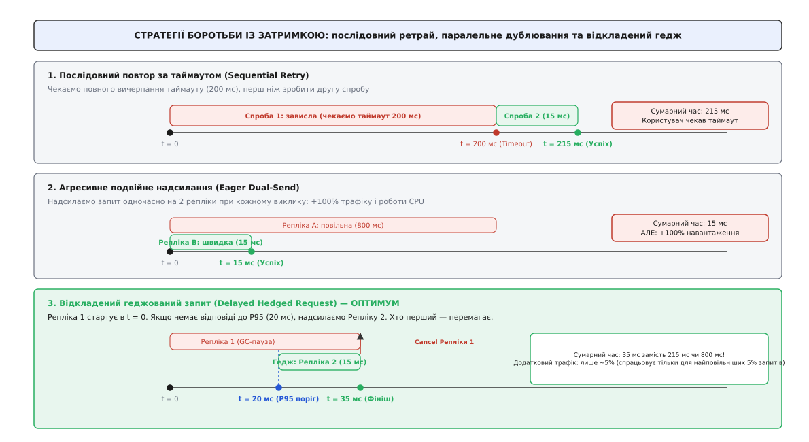
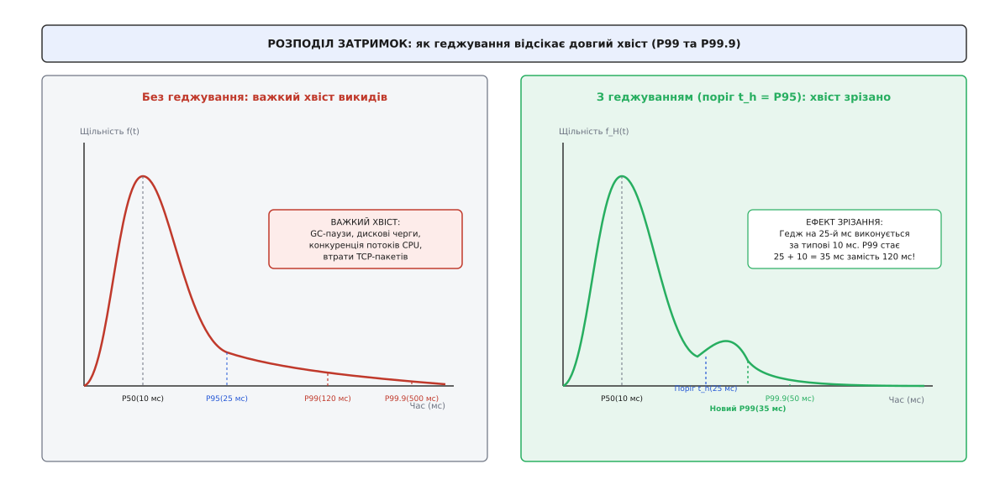
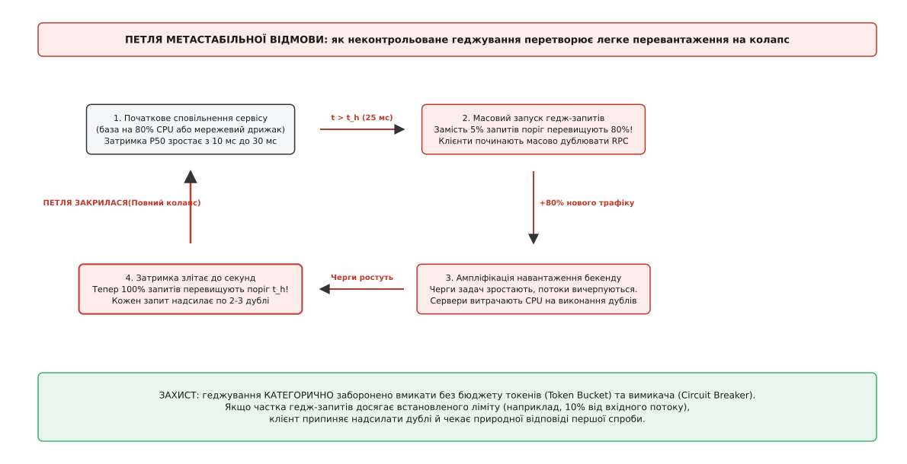
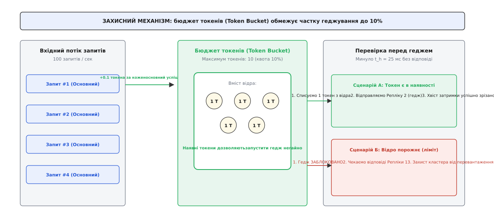

# Хеджовані запити: приборкання довгого хвоста затримок

<preknowlist>
- [Омани розподілених обчислень](topic:programming/distributed-fallacies) — мережа ненадійна, затримки непостійні, а окремі вузли можуть зависати або тимчасово сповільнюватися.
- [Таймаути і бюджет часу](topic:programming/timeouts-deadlines) — наскрізний дедлайн запиту та ризик зомбі-обчислень при тривалому очікуванні.
- [Повтори й експоненційний відступ](topic:programming/retries-backoff) — різниця між послідовними ретраями після повної відмови та паралельним дублюванням повільного виклику.
- [Ідемпотентність](topic:programming/idempotency) — дублювання запитів безпечне лише тоді, коли багаторазове виконання операції дає однаковий результат без побічних ефектів.
</preknowlist>

Користувач надсилає пошуковий запит або відкриває головну сторінку маркетплейса. Щоб зібрати відповідь, шлюз API розсилає 100 паралельних запитів на 100 шардованих мікросервісів — до каталогів товарів, складських залишків, персональних рекомендацій, відгуків та рекламних банерів. Дев'яносто дев'ять серверів повертають дані блискавично — за 10 мілісекунд. Проте один сотий сервер на іншому кінці датацентру саме в цю мить потрапляє в коротку паузу збирача сміття або відчуває затримку дискового контролера, витрачаючи на відповідь 800 мілісекунд.

Шлюз API не може відобразити сторінку без повного набору даних. Він змушений чекати на останнього обробника.

У результаті клієнт бачить затримку не 10 мілісекунд, а 800 мілісекунд. Попри те, що 99% інфраструктури відпрацювали бездоганно, якість сервісу для користувача повністю визначив один найповільніший компонент. Ба більше: якщо кожен окремий сервер має лише 1% імовірності потрапити в таку затримку (`p = 0.99`), то при ста паралельних викликах імовірність того, що користувач натрапить на повільну сторінку, становить `1 − 0.99¹⁰⁰ ≈ 63.4%`. Майже два з трьох користувацьких запитів виявляються зіпсованими випадковим сповільненням випадкового вузла.

Традиційні підходи до надійності тут безсилі. Зменшення таймауту призводить до обриву валідних операцій і повернення порожніх блоків інтерфейсу. Послідовний повтор запиту (ретрай) змушує клієнта спершу дочекатися вичерпання таймауту (наприклад, 200 мс), і лише потім робити другу спробу, що збільшує сумарний час очікування до 215–250 мс. А постійне надсилання кожного запиту одночасно на дві репліки подвоює обчислювальне навантаження на датацентр і спалює половину потужності кластера.

Розв'язанням цієї дилеми став патерн **хеджованих (геджованих) запитів (англ. *hedged requests*)** — механізм вибіркового дублювання повільних операцій, який зрізає важкий хвіст затримок у рази ціною мізерного збільшення трафіку.

## Анатомія хвоста затримок: чому варіативність неминуча

У розподілених системах затримка виконання операції (лат. *latentia* — прихованість, затримка між стимулом і реакцією) ніколи не є фіксованим числом. Вона описується статистичним розподілом.

Інженери вимірюють продуктивність через перцентилі (лат. *per centum* — на сотню):
* **P50 (медіана):** час, у який вкладається половина всіх запитів (типовий стан системи).
* **P95:** поріг, швидше за який виконуються 95% запитів.
* **P99:** межа для 99% запитів; найповільніший один запит зі ста.
* **P99.9:** хвіст розподілу (один найгірший запит із тисячі).

У монолітній програмі на одному комп'ютері різниця між P50 та P99 рідко перевищує 2–3 рази. Але в розподіленому кластері хвіст затримок має важкий, асиметричний характер: якщо P50 становить 10 мс, то P99.9 може сягати кількох секунд.

Ця варіативність породжується об'єктивними фізичними процесами, які неможливо повністю усунути оптимізацією коду:

1. **Збирання сміття (Garbage Collection):** керовані рантайми (Java, Go, .NET, Node.js) періодично зупиняють робочі потоки для розмітки та переміщення об'єктів у пам'яті (*Stop-the-World pauses*). Навіть найсучасніші збирачі сміття додають випадкові затримки від 5 до 50 мс.
2. **Фонові операції операційної системи та СУБД:** дискові ущільнення (*LSM-tree compactions* у RocksDB, Cassandra, BigTable), синхронізація журналів випереджального запису (*fsync WAL*), скидання брудних сторінок пам'яті ядром Linux на диск створюють короткочасні сплески черг введення-виведення.
3. **Конкуренція за спільні ресурси (Resource Contention):** на віртуалізованих серверах сусідні контейнери (*noisy neighbors*) можуть раптово навантажити кеш процесора L3, канали пам'яті або мережевий інтерфейс хоста.
4. **Мережеві черги та ретрансмісії:** мікроспалахи трафіку на комутаторах призводять до заповнення буферів портів і втрати окремих TCP-пакетів. Відновлення втраченого пакета через механізм RTO (*Retransmission Timeout*) у ядрі Linux за замовчуванням вимагає щонайменше 200 мілісекунд.
5. **Планувальник потоків і витіснення (CPU Throttling):** механізми обмеження ресурсів у Linux `cgroups` (зокрема CFS quota в Kubernetes) тимчасово заморожують виконання контейнера, якщо він вичерпав свій квант процесорного часу в поточному 100-мілісекундному вікні.

На кластері з 10 000 серверів завжди знайдуться десятки вузлів, які саме в цю секунду перебувають у стані локального сплеску затримки. Якщо бізнес-транзакція вимагає координації багатьох вузлів, система гарантовано зіткнеться з повільним хвостом.

Детальний історичний контекст того, як інженери виявили цю закономірність під час побудови вебпошуку, розкрито в нарисі про [історію відкриття патерну в Google](topic:programming/hedged-requests/hist-the-tail-at-scale.md).

## Принцип роботи геджування: фінансова аналогія в архітектурі

Термін «геджування» походить із біржової термінології (англ. *hedge* — захисна огорожа, страхування фінансового ризику). Трейдер, відкриваючи ризиковану позицію на падіння ціни активу, одночасно купує захисний опціон на її зростання. Якщо ринок поводиться стабільно, трейдер втрачає мізерну вартість опціону. Але якщо стається катастрофічний сплеск, опціон повністю компенсує збитки.

У розподілених системах **геджування запиту** — це клієнтська стратегія паралельного надсилання резервної копії запиту на іншу репліку сервісу з контрольованою часовою затримкою.

Алгоритм працює наступним чином:
1. **Старт основної спроби:** у момент часу `t = 0` клієнт надсилає запит на Репліку 1. Одночасно запускається локальний таймер затримки геджування `t_h` (англ. *hedging delay*).
2. **Очікування на порозі перцентиля:** тривалість `t_h` обирається рівною високому перцентилю затримки здорового сервісу — як правило, **95-му перцентилю (P95)** (наприклад, 20 мс).
3. **Оцінка ситуації о `t = t_h`:**
   * Якщо Репліка 1 відповіла до моменту `t_h` (що стається у 95% випадків), таймер скасовується. Запит завершено з мінімальними витратами, додатковий запит не надсилається.
   * Якщо Репліка 1 не відповіла за 20 мс, клієнт **не розриває з'єднання з Реплікою 1**, а надсилає ідентичний запит-дубль (гедж) на Репліку 2.
4. **Гонка відповідей:** клієнт очікує відповіді від обох реплік одночасно.
5. **Фініш і скасування:** репліка, яка першою надішле валідну відповідь (нехай це Репліка 2 за типові 10 мс на 30-й мс загального часу), стає переможцем. Її результат повертається бізнес-коду, а на повільну Репліку 1 клієнт негайно відправляє сигнал скасування операції.


*Хронологія трьох стратегій боротьби із затримкою: послідовний повтор витрачає 215 мс через очікування таймауту; агресивне дублювання подвоює трафік; відкладений гедж забезпечує результат за 35 мс ціною лише 5% додаткових запитів.*

### Чому це кардинально змінює затримку

Чому надсилання другого запиту на 20-й мілісекунді рятує ситуацію?

Оскільки причина повільності Репліки 1 має локальний характер (наприклад, локальна GC-пауза саме на вузлі 1), імовірність того, що випадково обрана Репліка 2 **в ту саму мілісекунду** також відчуває GC-паузу, надзвичайно мала. Репліка 2 є вільною і виконає запит за свій стандартний медіанний час (10 мс).

Сумарний час очікування клієнта становить:

```
T_total = t_h + T_replica2 = 20 мс + 10 мс = 30 мс
```

Замість очікування 800 мс користувач отримує відповідь за 30 мс!

При цьому додатковий запит надсилався лише для 5% найповільніших операцій. Кластер отримав лише 5% додаткового навантаження, але хвіст затримок P99 скоротився у 5–10 разів.

Точні математичні формули зрізання розподілу затримок, розрахунок площі під кривою та оцінку завантаження наведено у [математичному виведенні зрізання перцентилів](topic:programming/hedged-requests/math-hedged-tradeoff.md).


*Щільність розподілу затримок: зліва важкий неконтрольований хвіст викликів; справа — геджування формує жорстку межу відсікання затримки після точки t_h.*

## Різновиди геджування та їхня еволюція

Залежно від архітектури системи та можливостей транспортного протоколу геджування застосовують у кількох варіантах:

### 1. Відкладене геджування (Delayed Hedged Requests)
Класичний підхід, описаний вище. Клієнт очікує інтервал `t_h` (P90–P95) перед надсиланням дубля. Це універсальний метод, що працює поверх стандартних HTTP/1.1, HTTP/2 та gRPC без спеціальної підтримки на боці сервера.

### 2. Спекулятивні повтори (Speculative Retries)
Термін, прийнятий у розподілених базах даних (наприклад, Apache Cassandra). Координатор читання постійно веде ковзну гістограму часу відповіді кожної репліки. Якщо обрана репліка перевищує динамічний `P99` за останні 60 секунд, координатор відправляє спекулятивне читання на іншу репліку набору.

### 3. Зв'язані запити (Tied Requests)
Найбільш ресурсоощадний варіант для внутрішніх датацентрів із низькою мережевою затримкою:
1. Клієнт надсилає запит одночасно на дві репліки в момент `t = 0`.
2. Кожен запит містить у заголовку ідентифікатор своєї пари на іншому сервері.
3. Обидва сервери ставлять запит у свої черги обробки.
4. Щойно один із серверів звільняє робочий потік і витягує запит із черги на виконання, він негайно надсилає короткий міжсерверний RPC-сигнал скасування своєму двійнику.
5. Двійник видаляється з черги ще до того, як другий сервер витратить процесорний час на виконання важкого запиту.

Модель *tied requests* усуває час очікування в чергах без подвоєння обчислювальної роботи CPU.

## Загроза метастабільної відмови: петля шторму геджів

Геджування є потужним інструментом, але за відсутності захисних бар'єрів воно несе смертельну загрозу для стабільності всієї інфраструктури.

Геджування базується на фундаментальному припущенні: **повільність окремого сервера є ізольованим випадковим збоєм, а сусідні репліки мають вільні ресурси.**

Що станеться, якщо це припущення порушиться?

Розглянемо сценарій системного перевантаження кластера (наприклад, масовий наплив користувачів під час розпродажу або відмова половини серверів у зоні доступності):

1. **Початкове уповільнення:** усі сервери бази даних завантажені на 90% CPU. Через черги час обробки всіх запитів зростає з 10 мс до 35 мс.
2. **Масове спрацьовування таймерів:** оскільки поріг геджування `t_h` був статично налаштований на 20 мс, тепер **100% вхідних запитів** не встигають відповісти до 20 мс.
3. **Вибух трафіку:** клієнти починають надсилати гедж-дублі для **кожного** запиту. Вхідний потік на бекенд миттєво зростає з `R` до `2R` (+100% навантаження).
4. **Колапс черг:** сервери, які й без того ледве справлялися з потоком `R`, отримують подвійний обсяг роботи. Черги переповнюються, затримки злітають до секунд.
5. **Замикання петлі:** тепер навіть гедж-запити не встигають виконуватися. Клієнти починають надсилати треті й четверті геджі (якщо це дозволено конфігурацією). Система переходить у стан незворотного колапсу — [метастабільну відмову](topic:programming/metastable-failures), з якої неможливо вийти без повного перезавантаження або відсікання клієнтського трафіку.


*Петля метастабільної відмови: уповільнення сервісу призводить до 100% запуску геджів, що подвоює навантаження на систему й завершується повною втратою працездатності кластера.*

## Захисні бар'єри: як геджувати безпечно

Щоб унеможливити перетворення геджування на руйнівний шторм, промислові клієнти використовують чотири обов'язкові рівні захисту:

### 1. Бюджет токенів (Token Bucket Retry/Hedge Budget)
Найважливіший математичний запобіжник. Клієнтська бібліотека підтримує локальне «відро з токенами»:
* Кожен успішний основний запит, що завершився без геджу, додає у відро `0.1` токена (при ліміті квоти 10%).
* Запуск кожного гедж-запиту вимагає списання `1.0` цілого токена.
* Якщо у відрі менше 1 токена, **геджування суворо забороняється**, незалежно від того, скільки часу минуло на таймері `t_h`. Запит продовжує чекати на першу репліку.

Цей механізм гарантує: навіть під час повної деградації бекенду сумарна кількість надісланих геджів ніколи не перевищить 10% від нормального обсягу запитів, що запобігає множенню трафіку.


*Принцип роботи бюджету токенів: успішні виклики наповнюють квоту, а геджі споживають її. При перевантаженні відро вичерпується, і клієнт безпечно блокує надсилання дублів.*

### 2. Захисний вимикач для геджування (Hedge Circuit Breaker)
Клієнт відстежує відсоток помилок або завантаження пулу з'єднань цільового сервісу. Якщо [запобіжник](topic:programming/circuit-breaker-pattern) фіксує сплеск помилок `HTTP 503` чи `UNAVAILABLE`, він автоматично деактивує модуль геджування, залишаючи лише поодинокі спроби.

### 3. Адаптивні ліміти конкурентності (Adaptive Concurrency Limits)
Клієнт обмежує максимальну кількість одночасно відкритих in-flight запитів на основі [адаптивних лімітів конкурентності](topic:programming/adaptive-concurrency). Якщо пул з'єднань заповнений основними запитами, гедж-запити відкидаються на вході клієнта без надсилання в мережу.

### 4. Відсікання на вході (Load Shedding)
Якщо гедж-запит усе ж надійшов на перевантажений сервер, серверний шар [скидання навантаження](topic:programming/load-shedding) перевіряє мітку в заголовку `X-Hedged-Attempt: 2` і відкидає спекулятивний запит із нульовими витратами процесора на користь обслуговування первинних запитів інших клієнтів.

> 🔧 **Навіщо це.** Безпечне геджування в продакшені — це завжди компроміс між швидкістю відповіді та запасом міцності інфраструктури. Правило простої інженерної гігієни: геджування вмикають лише тоді, коли бекенд має підтверджений резерв обчислювальної потужності щонайменше у 15–20% вище від пікового навантаження, а на клієнті активовано жорсткий 10-відсотковий ліміт бюджету токенів.

## Непорушний інваріант: небезпека мутацій та ідемпотентність

Найкритичніша помилка під час впровадження геджування — застосування патерну до операцій, що змінюють стан системи (англ. *state-mutating operations*).

Уявімо платіжний сервіс або сервіс оформлення замовлення, де клієнт надсилає запит на списання коштів із банківської картки:
1. Клієнт надсилає `POST /api/v1/charge` на Сервер 1.
2. Сервер 1 успішно списує гроші в платіжному шлюзі, але через повільний мережевий комутатор затримує відправку HTTP-відповіді клієнту на 30 мс.
3. Клієнт, не знаючи про успіх Сервера 1, о 25-й мс запускає гедж `POST /api/v1/charge` на Сервер 2.
4. Сервер 2 отримує дубль і **списує гроші вдруге**!

Клієнт отримає успішну відповідь від Сервера 2, але з рахунку користувача буде списано подвійну суму.

### Правило безпечного геджування

1. **Читання за замовчуванням (Read-Only Safety):** Геджування без додаткових заходів безпеки дозволено застосовувати **виключно для безпечних операцій читання** (`GET`, `HEAD`, ідемпотентні RPC-методи пошуку та вибірки даних).
2. **Вимога ідемпотентності (Idempotency Requirement):** Якщо геджування застосовується для операцій запису чи модифікації даних, кожен запит зобов'язаний містити унікальний криптографічний ключ ідемпотентності (`Idempotency-Key` або UUIDv4), як описано в темі про [ідемпотентність](topic:programming/idempotency). Сервери бази даних повинні використовувати унікальні індекси або розподілені блокування, щоб гарантувати: якщо два сервери одночасно спробують виконати дію з однаковим ключем, операція виконається строго один раз, а другий сервер поверне збережений кешований результат першого.

## Протокол скасування та звільнення ресурсів

Коли клієнт отримує відповідь від однієї з реплік, його робота не закінчується. Він зобов'язаний коректно завершити другу незавершену гілку.

Якщо клієнт просто «забуде» про повільний потік, виникає явище **зомбі-обчислень**:
* Віддалений сервер продовжуватиме сканувати гігабайти таблиць на диску.
* Оперативна пам'ять і дескриптори сокетів залишатимуться заблокованими до вичерпання повного таймауту.
* База даних утримуватиме блокування рядків, блокуючи інші транзакції.

### Транспортне скасування: від клієнта до ядра бази даних

Сучасний стек розподіленого скасування працює на кількох рівнях:

```
[ Клієнт: Отримав відповідь B ]
        │
        ▼ (HTTP/2 RST_STREAM або gRPC CANCEL)
[ Мережа: Скидання стріму без розриву TCP-з'єднання ]
        │
        ▼
[ Сервер A: Диспетчер RPC отримує сигнал скасування ]
        │
        ▼ (Закриття context.Done() / stop_token)
[ Обробник коду: Перериває цикл сканування ]
        │
        ▼ (ROLLBACK / DISCARD)
[ СУБД: Звільнення блокувань таблиць і буферів пам'яті ]
```

1. **На рівні протоколу (HTTP/2 / gRPC):** Клієнт надсилає у відкритий мультиплексований канал спеціальний керівний фрейм `RST_STREAM` із кодом `CANCEL`. Це миттєво знищує логічний потік даних, не вимагаючи дорогого закриття та повторного відкриття базового TCP/TLS-з'єднання.
2. **На рівні сервісу (Go Context / C++ Stop Token):** Серверний мережевий шар транслює `RST_STREAM` у переривання контексту виконання обробника.
3. **На рівні сховища (Database Cooperative Cancellation):** Серверний код зобов'язаний періодично опитувати стан контексту. Якщо клієнт відмовився від результату, запит до бази даних негайно анулюється (`pg_cancel_backend` у PostgreSQL або переривання курсору), повертаючи дискові ресурси системі.

Повний покроковий код реалізації клієнтської бібліотеки з контролем скасування, безпечною моделлю пам'яті та бюджетом токенів наведено у [практичній реалізації клієнта з бюджетом токенів](topic:programming/hedged-requests/proj-hedged-client.md).

## Топологія балансування: куди надсилати гедж-запит

Ефективність геджування критично залежить від алгоритму вибору цільового вузла для другої спроби. Якщо клієнт надішле гедж-дубль на той самий сервер або на сусідню віртуальну машину в тій самій стійці, обидва запити постраждають від однієї першопричини.

Для максимізації статистичної незалежності клієнтські балансувальники застосовують комплекс евристик:

### 1. Алгоритм «Power of Two Random Choices» (P2C) із Peak EWMA
Замість простого циклічного опитування (Round-Robin), клієнт обирає двох випадкових кандидатів із пулу доступних реплік і порівнює їхню зважену затримку за експоненційною ковзною середньою (**Peak EWMA** — *Exponentially Weighted Moving Average*):
* Первинний запит надсилається репліці з мінімальною поточною затримкою та найменшою кількістю активних in-flight запитів.
* Якщо виникає потреба в геджі, клієнт обирає наступну репліку, яка має найвищий ранг готовності серед решти пулу.

### 2. Зональна ізоляція (Cross-Zone vs Intra-Zone Hedging)
У хмарних датацентрах (AWS, GCP, Azure) сервіси розгортаються у кількох зонах доступності (Availability Zones, AZ).
* **Економіка та затримка:** Запити всередині однієї зони мають затримку < 1 мс і не тарифікуються за міжзональний трафік. Перетин межі зон додає 1–2 мс базової затримки та коштує близько одного цента за гігабайт переданих даних.
* **Гібридна стратегія:** Первинний запит завжди спрямовується до репліки в локальній AZ. Якщо локальний вузол сповільнюється понад `t_h`, гедж-запит надсилається до **віддаленої зони доступності**. Це забезпечує ідеальний захист: якщо в локальній зоні стався перегрів стійки, збій мережевого комутатора чи просідання живлення, гедж гарантовано оминає проблемну зону й виконується здоровим обладнанням.

### 3. Антиспорідненість доменів відмов (Failure Domain Anti-Affinity)
Маршрутизатор стежить, щоб репліка 1 і репліка 2 не ділили спільний комутатор верхнього рівня (Top-of-Rack switch, ToR) та фізичний сервер віртуалізації. Якщо обидва контейнери ділять один фізичний процесор, GC-пауза сусіднього важкого процесу сповільнить обидва сервери одночасно.

## Транспортний рівень: колізії TCP Incast та переваги HTTP/3 QUIC

Під час широкого фанауту (коли один шлюз опитує 100–500 шардованих вузлів) на рівні мережевих протоколів виникає специфічний апаратний бар'єр — **колапс TCP Incast**.

### Проблема Incast при широкому опитуванні
Коли 100 серверів отримують запит одночасно, вони майже одночасно завершують обчислення і спрямовують потоки пакетів-відповідей назад до одного порту шлюзу.

Буфер мережевого порту комутатора (зазвичай кілька мегабайтів) миттєво переповнюється (*buffer exhaustion*). Комутатор скидає хвостові пакети кількох з'єднань. У протоколі TCP втрата пакета на початку сесії активує таймер RTO (200 мс), що миттєво відкидає ці запити в глибокий хвіст затримок.

### Як геджування взаємодіє з Incast
Відкладене геджування має унікальну перевагу: оскільки гедж-запити відправляються не одночасно, а зі зсувом у `t_h = 25` мс і лише для 5% операцій, вони надходять на комутатор тоді, коли первинний сплеск пакетів уже розсмоктався. Гедж оминає переповнений буфер і повертається без втрат.

### HTTP/2 проти HTTP/3 (QUIC) на шляху геджування
У протоколі HTTP/2 усі паралельні стріми до одного хоста мультиплексуються поверх одного TCP-з'єднання. Якщо через втрату пакета TCP-з'єднання встає на паузу (Head-of-Line Blocking), **усі стріми в цьому з'єднанні блокуються**, включно з гедж-запитами.

Перехід на протокол **HTTP/3 (QUIC поверх UDP)** повністю вирішує цю проблему:
* Кожен стрім у QUIC має незалежну доставку та власні номери пакетів.
* Втрата пакета в первинному запиті не впливає на гедж-стрім, що передається паралельно в тому ж каналі.
* Скасування через `RST_STREAM` у QUIC обробляється миттєво без потреби очікування підтвердження попередніх втрачених байтів.

## Узгодженість даних у безлідерних сховищах (Quorum Consistency)

У розподілених базах даних без єдиного лідера (Dynamo, Cassandra, ScyllaDB) читання виконується за схемою кворуму (`R + W > N`).

При застосуванні геджування читання виникає ризик порушення **монотонності читання (Monotonic Read Inconsistency)**:
1. Клієнт оновлює запис на версію `v2` (запис підтверджено на вузлах A та B). Вузол C тимчасово відстає і містить стару версію `v1` (лаг реплікації).
2. Клієнт робить читання. Первинний запит іде на вузол A (актуальний, версія `v2`), але затримується на дисковій черзі.
3. О 25-й мс координатор надсилає гедж на відстаючий вузол C.
4. Вузол C миттєво відповідає за 2 мс, бо його диск не навантажений, і повертає застарілу версію `v1`.
5. Клієнт, який щойно записав `v2`, раптом бачить у відповіді старі дані `v1` («подорож у часі назад»).

### Захист: векторні годинники та Read Repair
Для запобігання цій аномалії координатор сховища:
* Зіставляє версії за допомогою позначок часу Lamport або векторних годинників (Vector Clocks).
* Якщо спекулятивна репліка повертає версію з нижчим таймстемпом, ніж очікуваний клієнтський контекст (Causal Read Token), координатор відкидає цю відповідь і дочікується актуальної репліки.
* Одночасно запускається асинхронне фонове відновлення даних (Read Repair), що надсилає свіжу версію `v2` на відстаючий вузол C.

## Промислові стандарти: gRPC, Envoy та Cassandra

Сьогодні інженерам рідко доводиться писати геджування вручну з нуля. Патерн стандартизовано в провідних розподілених платформах:

1. **gRPC Service Config (gRFC A6):** Декларативна конфігурація `hedgingPolicy` на рівні JSON-специфікації сервісу. Дозволяє задавати `maxAttempts` (кількість спроб), `hedgingDelay` (паузу запуску) та список `nonFatalStatusCodes`, при отриманні яких клієнт миттєво запускає наступний дубль без очікування таймера.
2. **Envoy Proxy (`RouteAction.HedgePolicy`):** Дозволяє увімкнути геджування прозоро для будь-яких сервісів у сервісній сітці (Service Mesh). Підтримує параметри `initial_requests`, `additional_request_chance` (геджування випадкової частки трафіку для тестування) та `hedge_on_per_try_timeout`.
3. **Apache Cassandra (`speculative_retry`):** Налаштування на рівні схеми таблиці CQL. Підтримує режими `'99PERCENTILE'`, `'95PERCENTILE'`, фіксовані часові інтервали `'50MS'` або агресивне паралельне читання `'ALWAYS'`.

Повний довідник конфігураційних схем, типів полів, правил валідації та матрицю обробки кодів помилок наведено в [довіднику конфігурацій gRPC, Envoy та Cassandra](topic:programming/hedged-requests/api-grpc-hedging.md).

## Підсумок: стратегічний вибір архітектора

Хеджовані запити змінюють парадигму проектування розподілених систем: замість марної та дорогої боротьби за викорінення кожної потенційної причини сповільнення на окремих серверах, архітектура визнає варіативність затримок неминучим фізичним законом масштабу.

Геджування дозволяє перетворити надлишкову пропускну здатність кластера (мізерні 5–10% додаткового трафіку) на передбачувану, детерміновану швидкість реакції системи. За умови суворого дотримання вимог ідемпотентності, обов'язкового використання бюджету токенів для запобігання штормам запитів та активного протоколу скасування, геджування стає найнадійнішим щитом проти прокляття повільного хвоста у високонавантажених сервісах будь-якого масштабу.
