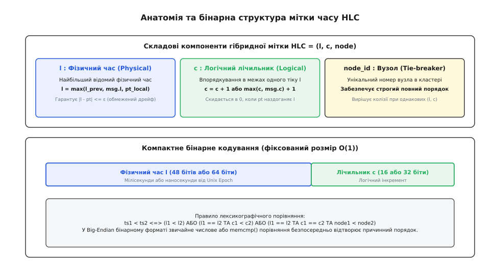
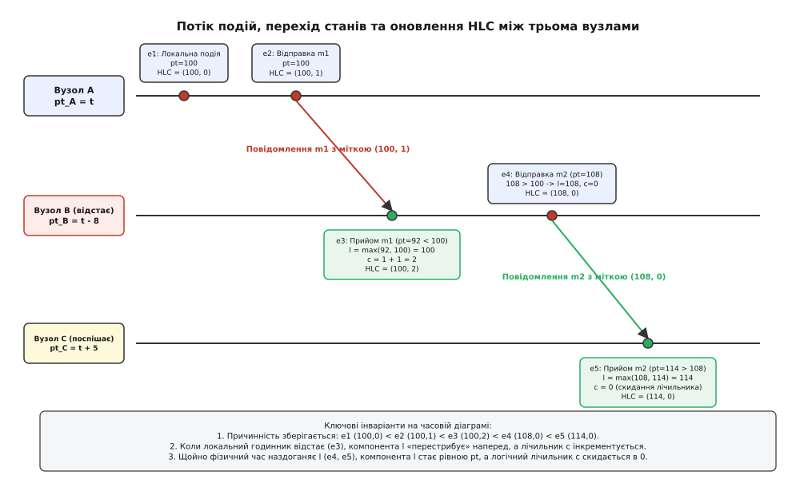
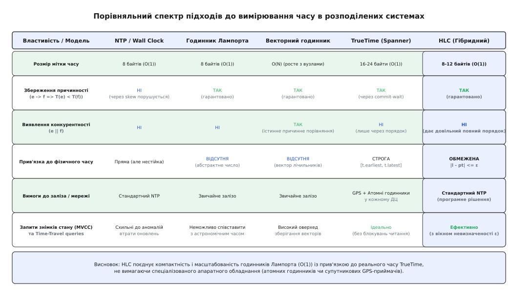

# Гібридні логічні годинники (HLC)

<preknowlist>
- [Монотонний і астрономічний час](topic:programming/monotonic-vs-wall-time) — різниця між фізичним плином та системним таймером, стрибки NTP і похибка синхронізації.
- [Спектр консистентності](topic:programming/consistency-models) — відношення причинності (happens-before), лінеаризовність та знімки стану (snapshots).
</preknowlist>

Клієнт ініціює банківський переказ між двома континентальними регіонами. Вузол у Франкфурті списує $100 з рахунку `A` о 12:00:00.010 за своїм фізичним годинником і надсилає повідомлення про зарахування на вузол у Дубліні. Через мережеві затримки демона синхронізації часу фізичний годинник дублінського сервера відстає на 15 мілісекунд, тому зарахування на рахунок `B` фіксується з локальною міткою 12:00:00.002. Якщо аналітичний сервіс виконує запит знімка стану (англ. *snapshot read*) на момент 12:00:00.005, він бачить списання у Франкфурті, але не бачить зарахування в Дубліні: $100 безслідно зникають із загального балансу банку, грубо порушуючи причинність.

Ця проблема є фундаментальною для всіх розподілених систем: незалежні сервери фізично не здатні мати абсолютно однаковий час на апаратних кварцових таймерах. Температурні коливання, нерівномірне старіння кристалів та мікрозатримки маршрутизації пакетів протоколу NTP (Network Time Protocol) неминуче створюють взаємний скос годинників (англ. *clock skew*), який у звичайних дата-центрах коливається від кількох мілісекунд до сотень мілісекунд. Спроба спиратися виключно на фізичний системний час при впорядкуванні розподілених транзакцій неминуче призводить до втрати оновлень та порушення порядку операцій.

## Глухий кут класичних годинників

Щоб зрозуміти необхідність гібридного підходу, розглянемо обмеження трьох попередніх поколінь розподілених годинників.

### 1. Фізичний час (NTP / Wall Clock)
Астрономічний час зручний для користувачів і бізнес-логіки: кожен запис має зрозумілу дату й секунду. Проте фізичний годинник операційної системи має дві критичні вади:
- **Відсутність гарантії причинності:** Якщо подія `e₁` спричинила подію `e₂` (`e₁ → e₂`), через зсув годинників цілком можливо отримати `pt(e₁) > pt(e₂)`;
- **Нестабільність і стрибки назад:** При кроковій синхронізації демона NTP або введенні секунди координації (англ. *leap second*) фізичний час операційної системи може стрибнути назад, порушуючи локальну монотонність.

### 2. Логічні годинники Лампорта (1978)
Леслі Лампорт запропонував замінити фізичний час монотонним цілочисельним лічильником, який інкрементується при кожній локальній події та оновлюється за правилом `max(local, msg) + 1` при отриманні повідомлень.

Годинник Лампорта бездоганно гарантує збереження причинності: `e₁ → e₂ ⇒ L(e₁) < L(e₂)`, займаючи всього 8 байтів пам'яті (`O(1)`). Проте він повністю відірваний від реального світу. Його покази є абстрактними числами. Високонавантажений вузол швидко накручує свій лічильник до мільярдів, тоді як сусідній сервер простоює на числі 100. База даних на годинниках Лампорта не може відповісти на елементарні запити:
- «Поверни стан таблиці станом на 14:00» (англ. *time-travel queries*);
- «Які транзакції відбулися за останні 5 хвилин»;
- «Видали всі версії рядків MVCC, старші за 30 днів» (англ. *garbage collection*).

### 3. Векторні годинники (1988)
Векторний час зберігає масив лічильників для всіх `N` вузлів кластера, що дозволяє точно визначати причинність і виявляти конкурентні події (`e₁ || e₂`). Проте розмір вектора зростає як `O(N)`. У сучасних кластерах на тисячі вузлів або динамічних мікросервісних середовищах передача та збереження кілобайтових векторів разом із кожною транзакцією створює неприйнятний оверхед на мережу й дискове сховище.

### 4. Апаратний TrueTime (Google Spanner, 2012)
Google розв'язав проблему апаратним шляхом: встановленням атомних рубідієвих годинників та GPS-приймачів у кожний дата-центр. API TrueTime повертає довірчий інтервал `[t.earliest, t.latest]` із гарантованою похибкою `ε ≤ 7` мс. Завдяки протоколу *commit-wait* (очікування тривалістю `2ε` перед підтвердженням транзакції) Spanner досяг лінеаризовності без блокування читань. Проте для решти індустрії, що розгортається в публічних хмарах (AWS, GCP, Azure) без доступу до приватних атомних еталонів, це рішення лишалося недосяжним.

Детальніше про історію розвитку та протистояння цих підходів розповідає [Історія еволюції годинників](topic:programming/hybrid-logical-clocks/hist-hlc-origins.md).

## Концепція та будова HLC

Гібридні логічні годинники (англ. *Hybrid Logical Clocks*, HLC), запропоновані у 2014 році Сандіпом Кулкарні та колегами, поєднують переваги фізичного часу та логічного годинника Лампорта в єдиній компактній структурі фіксованого розміру `O(1)`.

Мітка часу HLC складається з трьох компонентів:

```
HLC = (l, c, node_id)
```

1. `l` (**фізична компонента**, англ. *logical physical time*): Фіксує найвищий показник фізичного часу, який даний вузол коли-небудь спостерігав на своєму локальному годиннику або отримував у вхідних мережевих повідомленнях від інших вузлів;
2. `c` (**логічний лічильник**, англ. *logical counter*): Цілочисельний лічильник, що впорядковує події, які відбулися всередині одного й того самого кванта фізичної компоненти `l` або в період, коли локальний фізичний годинник вузла тимчасово відстає від кластера;
3. `node_id` (**ідентифікатор вузла**): Унікальний числовий номер сервера в кластері, який використовується як вирішувач колізій (англ. *tie-breaker*) для побудови детермінованого повного лінійного порядку між конкурентними подіями.


*Компоненти гібридної мітки часу: фізична частина l, логічний лічильник c та ідентифікатор вузла для повної впорядкованості.*

## Алгоритм функціонування HLC

Кожен вузол системи підтримує внутрішній стан годинника `(l, c)` і має доступ до системного фізичного таймера `pt` (наприклад, `clock_gettime(CLOCK_REALTIME)`). Початковий стан при старті вузла: `l = pt`, `c = 0`.

Алгоритм визначає два правила переходу станів:

### 1. Локальна подія або відправка повідомлення (Send)

Коли на вузлі відбувається внутрішня подія (наприклад, генерація транзакції) або формується вихідний мережевий пакет:

```
pt = get_physical_time()
l_prev = l

якщо (pt > l):
    l = pt
    c = 0
інакше:
    l = l_prev
    c = c + 1

призначити події мітку HLC = (l, c, node_id)
```

**Логіка поведінки:** Якщо системний фізичний час `pt` пішов уперед і перевищив раніше зафіксоване значення `l`, годинник оновлює `l = pt`, а логічний лічильник `c` скидається в нуль. Якщо ж фізичний час ще не змінився (висока частота подій) або локальний таймер тимчасово відстає, фізична компонента `l` лишається незмінною, а лічильник `c` інкрементується, забезпечуючи сувору локальну монотонність.

### 2. Отримання повідомлення (Receive)

Коли вузол отримує мережевий пакет від віддаленого вузла з прикріпленою міткою `msg = (l_m, c_m, node_m)`:

```
pt = get_physical_time()
l_prev = l

l_new = max(l_prev, l_m, pt)

якщо (l_new == l_prev && l_new == l_m):
    c = max(c, c_m) + 1
інакше якщо (l_new == l_prev):
    c = c + 1
інакше якщо (l_new == l_m):
    c = c_m + 1
інакше:
    c = 0

l = l_new
призначити події отримання мітку HLC = (l, c, node_id)
```


*Обмін повідомленнями між трьома вузлами: коригування фізичної компоненти l та інкремент лічильника c при локальному запізненні годинника.*

Розглянемо траєкторію на діаграмі вище:
1. **Вузол A** генерує подію `e₁` при `pt = 100`. Отримуємо мітку `(100, 0)`.
2. Потім **Вузол A** генерує подію відправки `e₂` в той самий момент часу `pt = 100`. Компонента `l` залишається 100, а лічильник стає 1: мітка `(100, 1)`.
3. Повідомлення надходить на **Вузол B**, чий фізичний годинник відстає (`pt = 92`). За правилом максимуму Вузол B встановлює `l = max(92, 100) = 100`. Оскільки `l_new == l_m`, лічильник стає `c_m + 1 = 2`. Мітка події отримання `e₃`: `(100, 2)`. Причинність збережена: `(100, 1) < (100, 2)`.
4. Пізніше на **Вузлі B** відбувається подія `e₄`, коли його локальний годинник наздогнав час (`pt = 108`). Оскільки `108 > 100`, `l` оновлюється до 108, а лічильник `c` скидається в 0: мітка `(108, 0)`.
5. Повідомлення від B приходить на **Вузол C**, чий годинник поспішає (`pt = 114`). Вузол C бере `l = max(108, 114) = 114` і скидає лічильник: мітка `(114, 0)`.

## Фундаментальні математичні властивості

Алгоритм HLC гарантує три ключові математичні інваріанти за умови, що протокол NTP утримує розсинхронізацію фізичних годинників у межах максимального порогу `ε` (`|pt_j - pt_k| ≤ ε`):

1. **Суворе збереження причинності (Happens-Before Consistency):**
   Для будь-яких двох подій `e` та `f`:
   ```
   e → f  ⇒  HLC(e) < HLC(f)
   ```
   де порівняння здійснюється за лексикографічним правилом:
   `(l_e < l_f) || (l_e == l_f && c_e < c_f) || (l_e == l_f && c_e == c_f && node_e < node_f)`.

2. **Обмежений дрейф від фізичного часу (Bounded Drift):**
   Для будь-якої події `e`, згенерованої на вузлі `j`:
   ```
   0 ≤ l(e) - pt_j(e) ≤ ε
   ```
   Фізична компонента `l` ніколи не відстає від локального фізичного часу і ніколи не випереджає його більше ніж на максимальний фізичний скос кластера `ε`.

3. **Обмеженість логічного лічильника:**
   Оскільки `l` не може відірватися від `pt` більше ніж на `ε`, логічний лічильник `c` не може зростати нескінченно. При швидкості генерації `R` подій на мілісекунду значення `c` не перевищує `(N + 1) · (ε · R + 1)`. Щойно фізичний час наздоганяє `l`, лічильник скидається в нуль.

Строгі математичні доведення цих теорем та індуктивні виведення наведено у вставці [Математичні доведення інваріантів](topic:programming/hybrid-logical-clocks/math-hlc-invariants.md).

## Порівняльний аналіз розподілених годинників

Зведена таблиця ілюструє місце HLC серед інших підходів до вимірювання часу в розподілених архітектурах:


*Порівняння підходів до вимірювання часу в розподілених системах за розміром мітки, причинністю та прив'язкою до реального часу.*

HLC пропонує оптимальний компроміс: він забезпечує розмір мітки `O(1)` (як у годинників Лампорта) і близькість до реального фізичного часу (як у TrueTime), але не вимагає спеціального апаратного обладнання.

## HLC у розподілених базах даних: MVCC та вікно невизначеності

У розподілених СУБД, таких як CockroachDB та YugabyteDB, HLC слугує основою для багатоверсійного керування конкурентним доступом (англ. *Multi-Version Concurrency Control*, MVCC). Кожен запис у сховищі зберігається у вигляді ключа з суфіксом мітки часу HLC:

```
/Table/Users/Key_42 @ (l=1718000000100, c=0) -> Value="Alice"
/Table/Users/Key_42 @ (l=1718000000500, c=1) -> Value="Alice Smith"
```

Коли транзакція виконує читання знімка на момент часу `T_read = (l_r, c_r)`, рушій сховища (на базі Pebble або RocksDB) просто шукає останню версію ключа з міткою `T_version ≤ T_read`.

### Вікно невизначеності читання (Read Uncertainty Window)

Проте через наявність фізичного скосу годинників `ε` виникає тонка аномалія. Припустимо, транзакція `T₁` стартувала на вузлі `A` з міткою читання `T_read`. Якщо вузол `B` має фізичний годинник, що поспішає на величину `δ ≤ ε`, вузол `B` міг зафіксувати транзакцію `T₂` з міткою `T_write > T_read`, хоча в абсолютному реальному часі `T₂` була записана *до* початку транзакції `T₁`.

Усі транзакції з мітками в діапазоні:
```
[ T_read, T_read + ε ]
```
потрапляють у так зване **вікно невизначеності** (англ. *uncertainty interval*). Для таких записів неможливо лише за міткою часу визначити, чи відбулися вони до початку читання в реальному часі.

### Механізм Read Restart у CockroachDB

Щоб розв'язати цю проблему без апаратного очікування TrueTime, CockroachDB застосовує алгоритм **перезапуску читання** (англ. *Read Restart*):
1. Коли транзакція читання з міткою `T_read` натрапляє на версію запису `T_write`, яка лежить у вікні невизначеності `T_read < T_write ≤ T_read + ε`, транзакція не може гарантувати, що цей запис не стався раніше;
2. Транзакція прозоро оновлює свою мітку читання: `T_read_new = max(T_read, T_write)`;
3. Транзакція скидає накопичений стан і повторює читання з новою міткою `T_read_new`.

Оскільки `ε` у стабільному дата-центрі становить усього 100–250 мс, а конфлікти на гарячих ключах у межах цього вузького вікна трапляються рідко, середня ціна перезапусків читання залишається мізерною.

## Захист від збоїв: аномальний дрейф і збереження стану

У промисловій експлуатації HLC стикається з двома небезпечними граничними сценаріями:

### 1. Аномальний стрибок годинника (Clock Drift Guard)
Якщо на одному із серверів кластера збивається конфігурація NTP і його системний час стрибає на 5 років уперед, звичайний годинник Лампорта «заразив» би весь кластер: кожне надіслане повідомлення змусило б усі інші сервери підняти свій час на 5 років.

HLC запобігає цій катастрофі введенням конфігураційного ліміту `max_clock_drift` (зазвичай 250 або 500 мс). Якщо сервер отримує повідомлення з фізичною компонентою `l_m > pt_local + max_clock_drift`:
- Повідомлення негайно відхиляється з помилкою;
- Вузол генерує критичний алерт;
- Збійний сервер із викривленим годинником автоматично виводиться з кластера (англ. *node eviction / self-fencing*), захищаючи монолітність часового простору бази даних.

### 2. Перезавантаження вузла
Якщо сервер раптово перезавантажується, його пам'ять очищується. Якщо після старту системний годинник показує час, менший за останню видану до перезавантаження мітку `l_last`, сервер ризикує повторно згенерувати старі мітки часу, порушивши монотонність.

Для запобігання цьому застосовують одну з двох стратегій:
- **Періодичний запис high-water mark на диск:** Вузол регулярно зберігає на диск значення `l_persisted = l + buffer` (наприклад, з випередженням на 2 секунди). Після рестарту годинник ініціалізується значенням `l_persisted`;
- **Захисна пауза при старті (Sleep on Boot):** Після перезавантаження процес чекає `max_clock_drift` (наприклад, 500 мс) перед початком обробки запитів, гарантуючи, що фізичний час операційної системи гарантовано випередив будь-які мітки минулої сесії.

Практичну програмну реалізацію цих механізмів наведено у вставці [Реалізація вузла на C та C++](topic:programming/hybrid-logical-clocks/proj-hlc-node.md), а специфікацію двійкового формату — у [Специфікація бінарного протоколу](topic:programming/hybrid-logical-clocks/api-hlc-contract.md).

> 🔧 **Навіщо це.** Гібридні логічні годинники дозволяють будувати повнофункціональні розподілені транзакційні СУБД із підтримкою знімків стану (Snapshot Isolation), часових зрізів та підтвердженої монотонності в звичайних публічних хмарах. Використовуючи HLC, ви позбавляєтеся необхідності орендувати дорогі сервери з апаратними GPS/атомними модулями TrueTime і водночас уникаєте експоненційного роздування заголовків пакетів, притаманного векторним годинникам.
