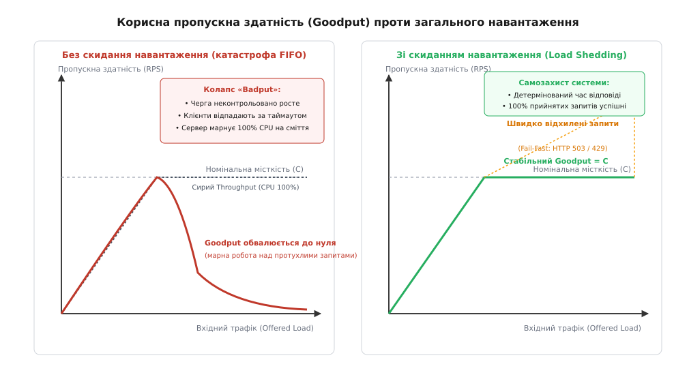
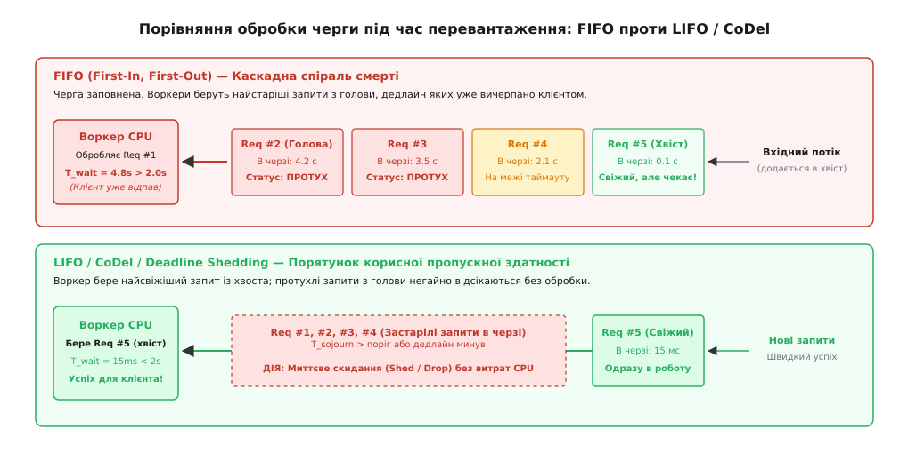
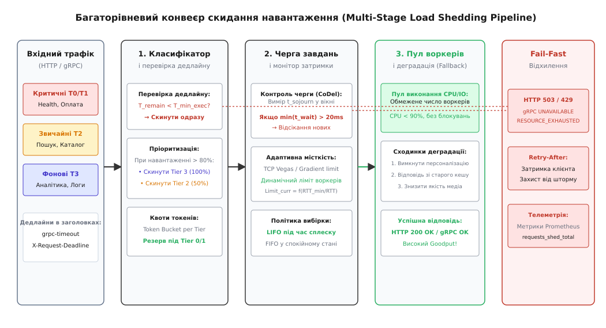

# Скидання навантаження і плавна деградація

<preknowlist>
- [Таймаути і бюджет часу](topic:programming/timeouts-deadlines) — дедлайни запитів, клієнтські таймаути та бюджет часу наскрізного виклику.
- [Запобіжник](topic:programming/circuit-breaker-pattern) — клієнтський захист від повільних і збійних залежностей за допомогою розмикання ланцюга.
- [Повторні спроби та експоненційний відступ](topic:programming/retries-backoff) — небезпека шторму повторів під час деградації серверних вузлів.
- [Перебірки (bulkhead)](topic:programming/bulkhead-isolation) — ізоляція пулів потоків, черг і семафорних квот між різними операціями.
- [Вісім оман розподілених обчислень](topic:programming/distributed-fallacies) — фізичні обмеження мережі, затримки та асиметричні затримки передачі.
</preknowlist>

Під час раптового сплеску трафіку на платіжному шлюзі інтенсивність вхідних RPC-запитів зростає з штатних 8 000 до 45 000 на секунду. Апаратна місткість пулу серверів розрахована щонайбільше на 10 000 одночасних обробок. Внутрішні черги завдань вебсерверів Netty та черги сокетів ядра Linux (`listen backlog`) заповнюються вщерть за 120 мілісекунд. Час виконання бізнес-логіки транзакції становить 40 мілісекунд, однак через гігантську чергу кожен запит проводить в очікуванні ще 4 200 мілісекунд. Клієнтські застосунки на мобільних телефонах мають жорсткий таймаут у 2 000 мілісекунд; не отримавши відповіді, вони розривають TCP-з'єднання і повторюють спробу знову. Сервери продовжують сумлінно витягувати з черги старі запити, виділяти пам'ять, виконувати криптографічний підпис та навантажувати базу даних запитами `UPDATE balances`. Коли через 4,24 секунди сервер нарешті формує HTTP-відповідь, сокет клієнта вже закрито з боку операційної системи. Завантаження центрального процесора вузлів сягає 100%, ядра горять, база даних захлинається транзакціями, проте частка успішно доставлених клієнтам відповідей падає з 100% до 0,3%. Система увійшла в катастрофічний режим метастабільного колапсу, марнуючи всі свої ресурси на обслуговування вже мертвих клієнтських запитів.

Ця аварія демонструє парадокс неконтрольованого перевантаження: **намагання сервера виконати абсолютно всю вхідну роботу за умов дефіциту ресурсів призводить до того, що система не виконує жодної корисної роботи взагалі**. Коли запити накопичуються в чергах швидше, ніж воркери встигають їх вичерпати, час очікування перевищує клієнтський дедлайн. Будь-які обчислення над таким запитом є марною витратою енергії та пропускної здатності.

Архітектурний патерн **скидання навантаження (англ. *load shedding*, від давньоангл. *scadan* — розділяти, відсікати та *hladan* — вантажити, наповнювати)** вирішує цю проблему за допомогою проактивного, усвідомленого відхилення надлишкової частини запитів на найранішому етапі вхідного конвеєра. Замість того, щоб дозволити всім запитам повільно деградувати й померти за таймаутом у спільній черзі, сервер миттєво відкидає ту частину трафіку, яку фізично не здатен обслужити вчасно, гарантуючи детермінований час відповіді та бездоганну якість обслуговування для решти прийнятих викликів.

## Фізика перевантаження: корисна робота проти марного згоряння ресурсів

Щоб зрозуміти механіку виникнення колапсу, необхідно чітко розмежувати дві метрики продуктивності обчислювальної системи:

* **Сира пропускна здатність (англ. *throughput*, від давньоангл. *thurh* — наскрізь та *put* — вихід):** загальна кількість запитів, які сервер завершив обробляти за одиницю часу, незалежно від того, чи була ця відповідь потрібна клієнту, чи прийшла вона вже після розриву з'єднання або після спливання таймауту.
* **Корисна пропускна здатність (англ. *goodput*, від давньоангл. *gōd* — корисний, добротний та *put*):** кількість запитів, успішно та коректно оброблених і доставлених клієнту **до** спливання встановленого дедлайну, результат яких приніс пряму бізнес-користь.
* **Марна робота (англ. *badput*):** робота, повністю виконана процесором, дисковою підсистемою та мережевим стеком, результат якої був відкинутий через застарілість або розрив клієнтського контексту.


*Корисна пропускна здатність (Goodput) проти загального навантаження: катастрофічний колапс системи за черги FIFO через марнування ресурсів на протухлі запити проти стабільного утримання максимальної місткості завдяки своєчасному скиданню навантаження.*

У нормальному робочому режимі, коли інтенсивність вхідного потоку `λ` (lambda) менша за максимальну продуктивність системи `C`, черги залишаються короткими, час очікування прямує до мікросекунд, а `goodput` дорівнює `throughput`.

Коли вхідний потік перевищує межу `C` (`λ > C`), виникає фундаментальний ефект теорії черг: затримка зростає гіперболічно. Якщо система не обмежує прийом, черга накопичує сотні тисяч завдань. Затримка очікування в черзі `W_q` (Queue Wait Time) перевищує клієнтський таймаут `T_timeout`. Сервер перетворюється на фабрику з утилізації тактових частот процесора на обробку «привидів».

Поведінку черг за наближення до насичення, розрахунок граничної місткості системи, ймовірнісний розподіл часу очікування та математичне виведення точки перегину корисної пропускної здатності наведено у вставці [🧮 Математика черг, часу перебування та колапсу корисної пропускної здатності](topic:programming/load-shedding/math-queue-delay-and-goodput.md).

Скидання навантаження стабілізує систему в точці насичення: сервер пропускає до виконання рівно такий обсяг трафіку `λ_admitted = C`, який утримує час очікування в черзі нижче критичного порогу, а решту `λ_shed = λ - C` миттєво відхиляє з кодом швидкої відмови (Fail-Fast). Завдяки цьому `goodput` залишається максимальним і дорівнює номінальній місткості `C`, а не падає до нуля.

## Анатомія системного колапсу: ядро, пам'ять та збирач сміття

Коли вхідний потік перевищує обчислювальні можливості сервера, руйнування розгортається одночасно на кількох рівнях операційної системи та прикладного рантайму:

1. **Захлинання мережевого стека ядра Linux:** вхідні TCP-пакети потрапляють у чергу `TCP SYN backlog` та чергу готових з'єднань сокета `listen backlog`. Коли прикладний процес не встигає викликати `accept()`, черги переповнюються. Ядро вмикає механізм SYN cookies або починає мовчки дропати пакети `SYN`, що викликає важкі таймаути повторної відправки TCP SYN на стороні клієнтів (починаючи від 1 секунди з експоненційним зростанням).
2. **Конкуренція за дескриптори та пам'ять сокетів:** кожен відкритий сокет утримує системні структури `struct sock` та буфери читання й запису ядра `sk_buff` (типово від 4 до 128 кілобайтів на з'єднання). Якщо сервер утримує 50 000 завислих з'єднань, ядро виділяє гігабайти пам'яті під нерухомі сокети, витісняючи сторінковий кеш файлової системи (Page Cache).
3. **Спіраль збирача сміття (Garbage Collection Death Spiral):** у керованих рантаймах (Java, Go, .NET, Node.js) накопичення десятків тисяч завислих об'єктів запитів у чергах створює величезний довгоживучий обсяг живої купи (Heap Tenuring). Збирач сміття змушений сканувати гігабайти пам'яті, що різко збільшує тривалість фаз Stop-the-World або навантаження на фонові потоки маркування. Паузи GC ще сильніше сповільнюють обробку черги, черга росте ще більше, викликаючи нові паузи збирача сміття, доки процес не загине від `OutOfMemoryError` або не буде вбитий `OOM Killer` ядра Linux.
4. **Виснаження пулів потоків операційної системи:** якщо застосунок використовує блокуючу модель вводу-виводу (один потік на запит), пул потоків швидко сягає максимуму (наприклад, 500 потоків). Планувальник ядра Linux `CFS` (Completely Fair Scheduler) витрачає значну частку тактових частот процесора лише на перемикання контекстів між потоками (`sys_switch`), що остаточно паралізує корисні обчислення.

## Спіраль смерті FIFO: чому звичайна черга вбиває сервіс

Більшість класичних серверних платформ (вебсервери, черги потоків у пулах JVM, черги завдань пулів воркерів Go) за замовчуванням організовані за принципом **FIFO (First-In, First-Out — першим прийшов, першим пішов)**. У спокійному режимі це забезпечує чесність обслуговування. Проте під час перевантаження FIFO стає головним драйвером каскадного краху.

Розглянемо покрокову динаміку черги FIFO, коли навантаження вдвічі перевищує місткість сервера:

1. **Накопичення відставання:** запити надходять швидше, ніж воркери їх вичитують. Хвіст черги віддаляється від голови.
2. **Протухання голови черги:** кожен запит проводить у черзі час `T_wait = 3500 мс`. При цьому клієнтський таймаут становить `T_client = 1500 мс`. Кожен елемент, що доходить до голови черги, **вже гарантовано прострочений**.
3. **Хибний пріоритет старого сміття:** звільнений потік процесора бере з черги елемент з голови (найстаріший). Він витрачає 50 мс на виконання бази даних та розрахунків, формує відповідь і намагається надіслати її клієнту. Клієнтський сокет уже розірвано. Воркер змарнував 50 мс.
4. **Зараження нових запитів:** поки воркер марнував час на прострочений запит, свіжі запити, щойно додані в хвіст черги (які мали всі шанси вкластися у свій таймаут), продовжують старіти в хвості і неминуче протухають.
5. **Шторм повторів (Retry Storm):** клієнти, не дочекавшись відповіді на першу спробу, надсилають повторні запити (Retries). Це подвоює або потроює вхідний потік `λ`, ще більше подовжуючи чергу FIFO.


*Порівняння поведінки черг під час перевантаження: класична черга FIFO витрачає ресурси на протухлі запити з голови, тоді як дисципліна LIFO та CoDel негайно виконують свіжі запити з хвоста і відсікають застарілі.*

### Дисципліна LIFO та адаптивне скидання хвоста

Щоб розірвати це замкнене коло, під час перевантаження сервери перемикають дисципліну черги на **LIFO (Last-In, First-Out — останнім прийшов, першим пішов)** або впроваджують алгоритми активного управління чергою.

Під час вибірки за схемою LIFO воркер бере в роботу найсвіжіший запит із хвоста черги. Оскільки цей запит потрапив до системи лише кілька мілісекунд тому, його клієнт гарантовано чекає на відповідь, а залишок таймауту є максимальним. У результаті свіжий запит негайно отримує ресурси процесора і успішно повертається користувачеві. Застарілі запити, що опинилися на дні черги, або вичищаються фоновим процесом за таймером дедлайну, або скидаються миттєво під час переповнення буфера.

Черга LIFO перетворює катастрофічне падіння на детерміноване збереження якості: замість 100% завалених запитів система успішно обслуговує 50% або 80% найсвіжіших транзакцій, миттєво відсікаючи застарілий залишок.

## Сигнали перевантаження: на що спиратися під час скидання

Ефективність скидання навантаження цілком залежить від швидкості та точності детекції перевантаження. Якщо почати скидати зарано — система втратить корисні запити; якщо запізнитися — черги переповнять пам'ять і викличуть падіння процесу через вичерпання дескрипторів або OOM-killer ядра Linux.

У розподілених системах застосовують чотири основні класи сигналів:

```
                          ┌──────────────────────────────────────────────────┐
                          │         СИГНАЛИ ПЕРЕВАНТАЖЕННЯ СЕРВЕРА           │
                          └─────────────────────────┬────────────────────────┘
                                                    │
         ┌──────────────────────────┬───────────────┴──────────────┬─────────────────────────┐
         ▼                          ▼                              ▼                         ▼
┌──────────────────┐      ┌────────────────────┐         ┌────────────────────┐    ┌────────────────────┐
│  Час перебування │      │    Залишковий      │         │     Апаратне та    │    │     Адаптивна      │
│  в черзі (CoDel) │      │  дедлайн виклику   │         │ системне насичення │    │   конкурентність   │
├──────────────────┤      ├────────────────────┤         ├────────────────────┤    ├────────────────────┤
│ • Sojourn time   │      │ • grpc-timeout     │         │ • Linux PSI        │    │ • TCP Vegas / AIMD │
│ • Min delay      │      │ • X-Request-       │         │ • CPU runqueue     │    │ • Gradient / Vegas │
│   у вікні часу   │      │   Deadline         │         │ • Event loop lag   │    │ • Динамічний ліміт │
│ • Швидка реакція │      │ • T_remain < T_exec│         │ • GC pause time    │    │   активних потоків │
└──────────────────┘      └────────────────────┘         └────────────────────┘    └────────────────────┘
```

### 1. Час перебування в черзі (Sojourn Time) та алгоритм CoDel

Найчистішим і найбільш прямим показником перевантаження є **час перебування в черзі (англ. *sojourn time*, від лат. *sub* — під та *diurnus* — денний, тимчасовий)**. Це інтервал часу від моменту, коли мережевий потік записав запит у внутрішню чергу завдань, до моменту, коли робочий потік витягнув цей запит для початку виконання.

Кількість елементів у черзі є оманливим показником: 100 легких завдань можуть бути виконані за 2 мілісекунди, тоді як 10 важких аналітичних запитів можуть заблокувати воркерів на 10 секунд. Натомість виміряний `sojourn time` показує реальну затримку, яку вже пережив запит.

Алгоритм **CoDel (Controlled Delay)**, адаптований для прикладних RPC-сервісів, працює за принципом відстеження мінімального часу перебування:

* Сервер відстежує мінімальний `sojourn time` серед усіх запитів у ковзному вікні (наприклад, 100 мс).
* Якщо протягом усього вікна мінімальний час очікування перевищує цільовий поріг (`target`, наприклад, 20 мс), алгоритм констатує наявність стійкої, шкідливої черги (Bufferbloat) і переходить у стан активного скидання (`Dropping State`).
* У стані скидання система відкидає запити з черги за монотонно зростаючою часовою функцією доти, доки черга не спорожніє і мінімальний час очікування не повернеться в межі норми.

Історію створення CoDel, перенесення ідей керування мережевими буферами Ван Джейкобсона у сферу мікросервісних платформ Google та Netflix розглянуто у вставці [📜 Від буферблоту маршрутизаторів до хмарних гіперскейлерів: історія CoDel та скидання навантаження](topic:programming/load-shedding/hist-bufferbloat-to-codel.md).

### 2. Залишковий бюджет часу (Deadline Propagation)

Кожен клієнтський виклик повинен нести в метаданих інформацію про граничний час свого життя:
* У протоколі gRPC це стандартний заголовок `grpc-timeout`.
* У HTTP/REST — заголовки `X-Request-Deadline` або `Request-Timeout`.

Коли вузол витягує запит із черги (або приймає його на рівні шлюзу), він обчислює залишок часу:

```
T_remain = T_deadline - T_current
```

Якщо розрахунковий залишок часу `T_remain` менший за історичний перцентиль часу виконання цього типу операції (наприклад, `T_remain < P99_Latency`), сервер **негайно відкидає запит без звернення до бази даних чи зовнішніх сервісів**. Починати роботу, яку неможливо встигнути завершити до таймауту клієнта, категорично заборонено.

### 3. Системне насичення (Linux PSI та Event Loop Lag)

Метрики навантаження центрального процесора (`CPU Utilization %`) мають суттєвий недолік — вони усереднюються за проміжки часу (1–5 секунд) і запізнюються щодо миттєвих сплесків трафіку. Для низькорівневого контролю використовують метрики блокувань ядра:

* **Linux PSI (Pressure Stall Information):** файли `/proc/pressure/cpu`, `/proc/pressure/io` та `/proc/pressure/memory` надають інформацію про частку часу, протягом якого задачі перебувають у стані недобровільного очікування ресурсів ядра (`some` та `full`). Якщо `cpu pressure > 25%` за останні 10 секунд, система перевантажена контекстними перемиканнями та очікуванням планувальника ядра.
* **Затримка циклу подій (Event Loop Lag):** для асинхронних однопотокових та кооперативних рантаймів (Node.js, Go runtime scheduler) вимірюється інтервал між запланованим та реальним виконанням таймера `uv_timer_t` або затримка черги `sysmon`. Якщо відставання перевищує 50 мс, сервер не встигає обробляти події сокетів.

### 4. Адаптивні ліміти конкурентності (Adaptive Concurrency Limits)

Замість статичного ліміту пулу потоків (наприклад, жорсткі 200 воркерів) сучасні сервери розраховують максимальну кількість одночасних запитів `Inflight_Limit` динамічно за допомогою алгоритмів керування перевантаженням TCP:

* **TCP Vegas / Gradient Limit:** сервер постійно вимірює базову затримку обробки без навантаження `RTT_no_load` (мінімальний RTT за тривалий період) та поточну середню затримку `RTT_current`. На основі їхнього співвідношення обчислюється градієнт:
```
gradient = RTT_no_load / RTT_current
new_limit = current_limit * gradient + headroom
```
Якщо затримка зростає без пропорційного зростання пропускної здатності, градієнт стає меншим за одиницю, і ліміт конкурентності автоматично зменшується, змушуючи шеддер скидати всі запити понад новий ліміт `Inflight`.

## Багаторівневий конвеєр скидання навантаження

Надійне скидання навантаження будується не в одному місці коду, а як послідовний ешелонований конвеєр оборони від мережевого інтерфейсу ядра до бізнес-обробника.


*Багаторівневий конвеєр скидання навантаження: проходження запиту крізь класифікатор пріоритетів, перевірку залишкового дедлайну, моніторинг часу очікування CoDel, адаптивний ліміт воркерів та сходинки плавної деградації.*

Розглянемо чотири рубежі захисту:

### Рівень 1: Мережевий стек та Ingress-проксі (L4 / L7)
* **Ядро Linux та eBPF/XDP:** на екстремальних обсягах (DDoS або масивні сплески трафіку) захисні програми eBPF, завантажені на рівень мережевого драйвера (XDP — eXpress Data Path), можуть скидати надлишкові пакети без виділення пам'яті ядра під `sk_buff` та передачі в TCP-стек.
* **Зворотний проксі / Сервісна сітка (Envoy, NGINX):** фільтри перевантаження (наприклад, Envoy Overload Manager) стежать за споживанням пам'яті купою і затримками дескрипторів. При досягненні 85% ліміту пам'яті Envoy починає відхиляти нові з'єднання та повертати `HTTP 503 Service Unavailable` ще до передачі байтів у бекенд-сервіс.

### Рівень 2: Класифікатор пріоритетів та черга завдань
* Отримавши HTTP/gRPC-запит, проміжне програмне забезпечення (Middleware) визначає категорію важливості запиту та перевіряє залишок дедлайну.
* Якщо система перебуває під тиском, скидання починається з найменш пріоритетних категорій.

### Рівень 3: Адаптивний шлюз конкурентності
* Запит намагається захопити токен ліміту одночасних викликів (Concurrency Permit).
* Якщо ліміт вичерпано або час перебування в черзі перевищив критичний поріг, запит негайно перенаправляється на лінію аварійної відмови або плавної деградації.

### Рівень 4: Пул робочих потоків та бізнес-деградація
* Запит потрапляє до ізольованого пулу воркерів. Якщо залежна база даних чи зовнішній мікросервіс працюють повільно, обробник перемикається на спрощену бізнес-логіку (Fallback).

## Класифікація запитів та рівні пріоритету (Tiering)

Усі запити, що надходять до розподіленої системи, не є рівноцінними. Відмова у завантаженні рекламного банера не має ламати оформлення замовлення, а фонова аналітика не повинна конкурувати за процесор із системними перевірками здоров'я кластера.

Промислові системи поділяють трафік на чотири чіткі рівні пріоритетності (Tiering):

| Рівень (Tier) | Назва та призначення | Типові приклади операцій | Стратегія під час перевантаження |
| :--- | :--- | :--- | :--- |
| **Tier 0: Критичний** | Системні операції життя кластера | `/healthz`, `/readyz`, Raft heartbeats, продовження distributed locks, виявлення лідера | **Ніколи не скидаються.** Мають 100% зарезервовану квоту ресурсів. |
| **Tier 1: Основний бізнес** | Прямі дохідні та користувацькі транзакції | Оплата карткою, оформлення замовлення, списання коштів, аутентифікація | Скидаються в останню чергу за екстремального перевантаження (>95%). |
| **Tier 2: Інтерактивний** | Читання та навігація користувача | Пошук товарів, фільтри каталогу, перегляд профілю, коментарі | Скидаються пропорційно (20–70%) або деградують до читання застарілого кешу. |
| **Tier 3: Фоновий / Best-Effort** | Асинхронні та другорядні задачі | Відправка телеметрії, аналітичні кліки, генерація PDF-звітів, аудит-логи | **Скидаються першими на 100%** за найменших ознак дефіциту ресурсів. |

```
                       ┌─────────────────────────────────────────────────┐
                       │          ПОРОГИ СКИДАННЯ ЗА РІВНЯМИ             │
                       └────────────────────────┬────────────────────────┘
                                                │
         Завантаження:      0%                 70%                85%               95%          100%
         ───────────────────┼───────────────────┼──────────────────┼─────────────────┼────────────►
         Tier 0 (System)    │    Обробляється   │   Обробляється   │  Обробляється   │ Обробляється (Резерв)
         Tier 1 (Checkout)  │    Обробляється   │   Обробляється   │  Обробляється   │ Скидання надлишку
         Tier 2 (Browse)    │    Обробляється   │   Обробляється   │ Скидання 50%    │ Скидання 100%
         Tier 3 (Analytics) │    Обробляється   │ Скидання 100%    │ Скидання 100%   │ Скидання 100%
```

Розподіл квот здійснюється через механізм **ізольованих кошиків токенів (Multi-Bucket Token Leases)** або зважених черг з чесним розподілом: високопріоритетні запити мають безумовний пріоритет захоплення вільних воркерів, а фоновий трафік допускається лише за наявності невикористаних ресурсних залишків.

## Плавна деградація (Graceful Degradation)

Повне скидання запиту з кодом помилки `HTTP 503` або `gRPC UNAVAILABLE` — це крайній захід. Перед тим як повністю відмовити клієнту, система повинна застосувати **плавну деградацію (англ. *graceful degradation*, від лат. *gratia* — милість, витонченість та *degradare* — спускатися на нижчий щабель)**: замінити дорогу повну обробку на дешеву наближену.

Сходинки деградації розгортаються зверху вниз:

```
[Повна обробка: Персоналізовані рекомендації ML + свіжий залишок на складі + повний рендеринг]
                                   │  (Навантаження > 75%)
                                   ▼
[Сходинка 1: Вимкнення персоналізації -> Статичний топ-10 популярних товарів з пам'яті]
                                   │  (Навантаження > 85%)
                                   ▼
[Сходинка 2: Читання застарілого кешу -> Відповідь із заголовком stale-while-revalidate]
                                   │  (Навантаження > 92%)
                                   ▼
[Сходинка 3: Спрощення медіа та відкладення записів -> Асинхронний запис у чергу]
                                   │  (Навантаження > 97%)
                                   ▼
[Сходинка 4: Повне відсікання Fail-Fast -> HTTP 503 / 429 з обов'язковим Retry-After]
```

1. **Вимкнення важких другорядних блоків:** під час формування головної сторінки інтернет-магазину модуль рекомендацій на базі складної нейромережі вимикається. Замість 200 мс розрахунку повертається статичний заздалегідь згенерований список популярних товарів із локальної пам'яті за 0,1 мс.
2. **Перехід на читання застарілого кешу (Stale Cache Fallback):** за умов дефіциту процесора або високої затримки бази даних застосовується патерн `stale-if-error`. Клієнту повертається копія даних з Redis чи локального кешу, навіть якщо її TTL минув кілька хвилин тому.
3. **Зниження точності та роздільності:** відеосервіси автоматично знижують бітрейт потоку з 4K до 1080p або 720p; пошукові системи обмежують глибину обходу індексу (раннє відсікання пошукових результатів).
4. **Асинхронне відкладення операцій запису:** якщо сервіс збору аналітики чи відгуків не може виконати запис у реляційну базу даних, запит не відхиляється, а скидається у швидкий локальний буфер або чергу повідомлень для відкладеної обробки.

## Контракт взаємодії з клієнтом: запобігання штормам повторів

Скинути запит правильно — це лише половина завдання. Не менш важливо повідомити клієнта про скидання так, щоб його реакція не зруйнувала систему остаточно.

Якщо сервер поверне неінформативну помилку (наприклад, `HTTP 500 Internal Server Error`), стандартні клієнтські бібліотеки сприймуть її як збій конкретного сервера і негайно повторять запит на сусідній вузол кластера. Це спричиняє **шторм повторів (Retry Storm)**, миттєво переносячи перевантаження ланцюжком на весь кластер.

Коректний контракт взаємодії під час скидання навантаження містить чотири обов'язкові компоненти:

### 1. Семантично точний статус-код
* **HTTP:** статус `429 Too Many Requests` (якщо клієнт перевищив персональну квоту) або `503 Service Unavailable` (якщо сервер тимчасово перевантажений і скидає глобальний надлишок).
* **gRPC:** статус-код `RESOURCE_EXHAUSTED` (дефіцит ресурсів або квот) або `UNAVAILABLE` (тимчасова неможливість обробки).

### 2. Заголовок керування повторами `Retry-After`
Сервер зобов'язаний повернути вказівку, через який час клієнту дозволено повторити спробу:
```http
HTTP/1.1 503 Service Unavailable
Retry-After: 5
X-Shed-Reason: sojourn-time-exceeded
X-RateLimit-Reset: 1700000005
```
Клієнтські бібліотеки, отримавши `Retry-After: 5`, блокують повторні виклики до закінчення 5 секунд і додають випадковий шум (Jitter), щоб уникнути одночасного залпу запитів від тисяч клієнтів.

### 3. Ознака неможливості повтору (Non-Retryable Hint)
Для другорядних операцій (аналітика, логування) сервер додає прапорець `X-Do-Not-Retry: true`, який сигналізує SDK повністю скасувати цю операцію без будь-яких повторних спроб.

Повний опис HTTP- та gRPC-заголовків, форматів машиночитаних повідомлень про помилки RFC 7807 (Problem Details) та специфікації метрик Prometheus наведено у вставці [📋 Контракт інтерфейсу, протокольні заголовки та телеметрія скидання навантаження](topic:programming/load-shedding/api-load-shedding-contract.md).

## Типові антипатерни та інженерні пастки

Під час проектування підсистем скидання навантаження розробники часто припускаються типових системних помилок:

1. **Скидання на основі утилізації процесора (CPU-based Shedding):** встановлення простого правила «скидати трафік, якщо CPU > 80%» призводить до хибних спрацьовувань. Сучасні багатоядерні сервери можуть ефективно працювати при 95% CPU, якщо всі запити є короткими і не блокуються. Навпаки, система може повністю зупинитися при 15% CPU через блокування пулу з'єднань з базою даних. Скидати слід за затримкою черги (`sojourn time`), а не за відсотком процесора.
2. **Незбалансовані таймаути в ланцюжку мікросервісів (Timeout Inversion):** якщо сервіс А викликає сервіс Б з таймаутом 5 секунд, а сервіс Б викликає базу даних з таймаутом 15 секунд, то за умов перевантаження сервіс А відпаде через 5 секунд, а сервіс Б продовжуватиме ще 10 секунд даремно мучити базу даних. Таймаути повинні монотонно зменшуватися вглиб архітектури.
3. **Блокуючі операції всередині фільтра скидання:** якщо сам шеддер для ухвалення рішення робить мережевий виклик у Redis чи базу даних для перевірки квот, він сам стає точкою відмови та джерелом затримки. Уся логіка шеддера має виконуватися виключно в локальній пам'яті процесу за наносекунди.

## Високопродуктивна реалізація: архітектура черги з низькими накладними витратами

Реалізація скидання навантаження повинна бути надзвичайно дешевою за ресурсами процесора та пам'яті. Якщо логіка перевірки затримки або виділення токенів виконує важкі блокування м'ютексів чи алокації в купі, сам захисний механізм спричинить деградацію системи під високим навантаженням.

Ключові архітектурні інваріанти ефективного шеддера (Load Shedder):
1. **Неблокуючі атомарні лічильники (Lock-Free Atomics):** лічильники активних завдань `inflight_requests` та мітки часу зберігаються в атомарних змінних `std::atomic<uint64_t>` (C++) або `atomic.Uint64` (Go) без використання глобальних блокувань `mutex`.
2. **Штампування монотонного часу на вході:** щойно запит вичитано з мережевого сокета, йому присвоюється мітка часу монотонного годинника `clock_gettime(CLOCK_MONOTONIC_RAW)` або `time.Now()`.
3. **Миттєва перевірка при дек'юїнгу (Dequeue Check):** коли робочий потік забирає запит із черги, він розраховує різницю `T_sojourn = T_now - T_entry`. Якщо `T_sojourn > Threshold`, запит відкидається негайно за кілька десятків наносекунд без входу в контекст бізнес-транзакції.

Повний вихідний код промислового потокобезпечного модуля скидання навантаження на базі адаптивного алгоритму CoDel, реалізований мовами C++20 та Go з детальним аналізом накладних витрат пам'яті, наведено у вставці [⚙️ Високопродуктивний адаптивний шеддер навантаження на C++20 та Go](topic:programming/load-shedding/proj-adaptive-load-shedder.md).

## Порівняння суміжних архітектурних механізмів

Скидання навантаження часто плутають із суміжними патернами захисту стабільності. Порівняємо їхні фундаментальні ролі:

| Критерій | Скидання навантаження (Load Shedding) | Обмеження швидкості (Rate Limiting) | Запобіжник (Circuit Breaker) | Перебірки (Bulkhead) |
| :--- | :--- | :--- | :--- | :--- |
| **Де виконується** | **Сервер (Вхідний конвеєр)** | Шлюз / Сервер (API Gateway) | **Клієнт / Вихідний проксі** | Сервер (Внутрішні пули) |
| **Головна мета** | Захист власного здоров'я від надлишку трафіку | Захист від зловживань та дотримання лімітів тарифів | Захист клієнта від повільних зовнішніх залежностей | Ізоляція ресурсів, щоб збій одного не потопив інших |
| **Критерій рішення** | **Черга, Sojourn Time, CPU, Дедлайн** | Статичний ліміт RPS на API-ключ чи IP | Відсоток помилок віддаленого сервісу | Квота паралельних потоків / завдань |
| **Поведінка під час сплеску** | Відсікає надлишок для збереження Goodput | Повертає HTTP 429 за перевищення квоти | Розмикає ланцюг, блокуючи вихідні виклики | Обмежує чергу конкретного пулу завдань |

> 🔧 **Навіщо це.**
>
> Уявіть реальну ситуацію: ваш бекенд платіжного шлюзу витримує 5 000 транзакцій на секунду. Маркетинговий відділ раптово запускає рекламну кампанію з блогером-мільйонником, і на сервер прилітає 30 000 запитів на секунду.
> 
> * **Без скидання навантаження:** черги переповнюються, час відповіді стрибає з 30 мс до 10 секунд, мобільні клієнти відпадають за таймаутом у 3 секунди, сервери на 100% CPU обробляють мертві запити, а успішні платежі падають до нуля. Ви втрачаєте 100% виручки, а компанія зазнає репутаційної катастрофи.
> * **Зі скиданням навантаження:** шеддер на рівні шлюзу виявляє стрибок `sojourn time` понад 25 мс, миттєво відхиляє 25 000 запитів фонового та інтерактивного трафіку з кодом `503 Service Unavailable` та заголовком `Retry-After: 4`, пропускаючи рівно 5 000 критичних платіжних операцій. Усі 5 000 платежів успішно обробляються за 35 мс. Бізнес зберігає максимальну пропускну здатність, сервери залишаються холодними і стабільними, а клієнти, отримавши відмову, цивілізовано повторюють запити за таймером.

## Архітектурний синтез: принципи незламної стійкості

Скидання навантаження перетворює невизначену й руйнівну катастрофу перевантаження на керований, детермінований інженерний процес.

Фундаментальні закони побудови стійкої системи скидання навантаження:

1. **Краще відмовити швидко, ніж відповісти запізно:** запит, оброблений після спливання клієнтського таймауту, є чистою шкодою для системи. Миттєве відсікання за 10 наносекунд рятує мілісекунди процесорного часу для тих, хто ще чекає.
2. **Керуйте чергою за часом перебування (Sojourn Time), а не за довжиною:** затримка є об'єктивною мірою страждання запиту; довжина черги залежить від ваги окремих операцій і вводить в оману.
3. **Дисципліна LIFO рятує корисну роботу:** під час шторму перевантаження віддавайте ресурси найсвіжішим запитам, вичищаючи протухлий хвіст.
4. **Пропагуйте дедлайни наскрізно:** кожен мікросервіс у ланцюжку викликів повинен знати кінцевий дедлайн і відмовлятися від роботи, якщо виділений бюджет часу вже вичерпано.
5. **Поєднуйте скидання з плавною деградацією:** вимкніть рекомендації та перейдіть на застарілий кеш до того, як почнете повністю рубати трафік.
