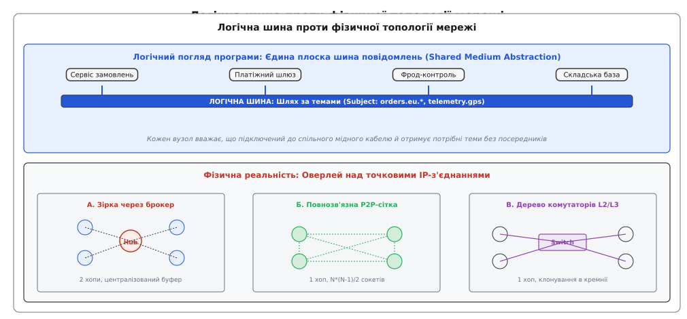
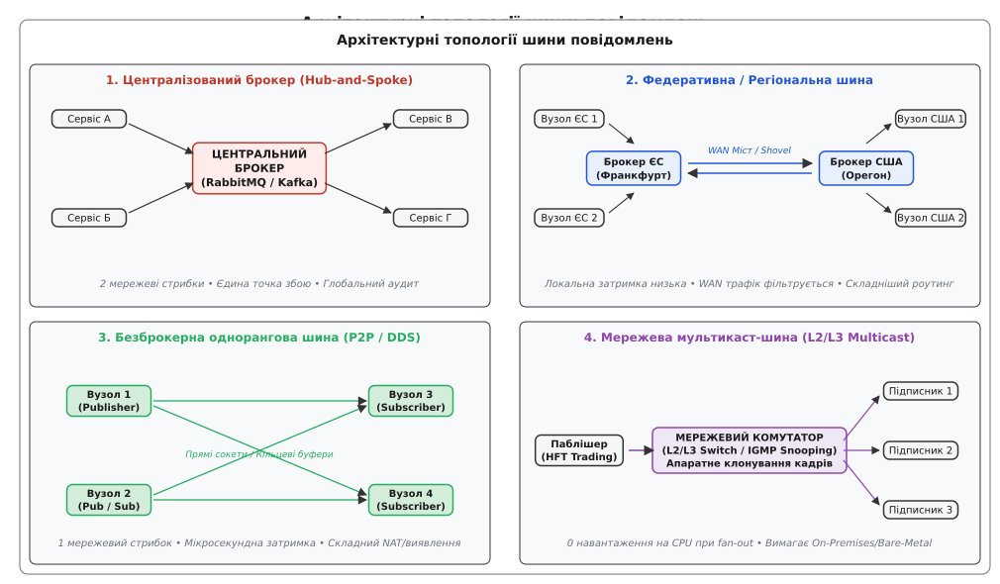
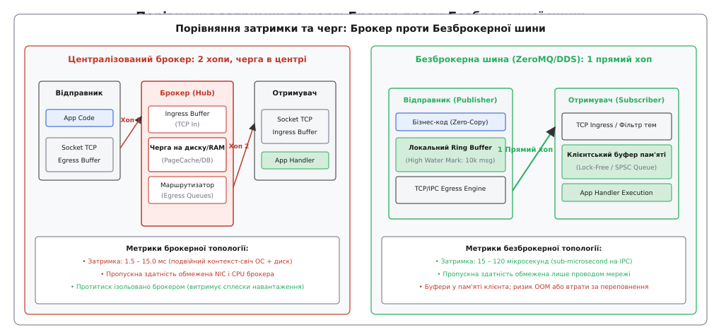
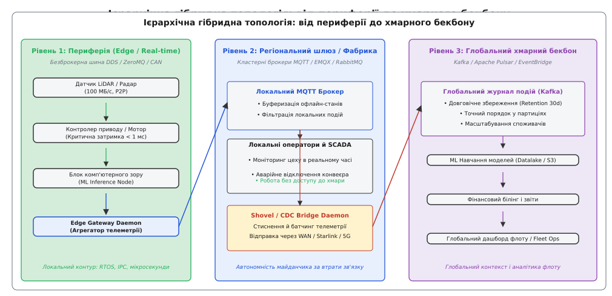

# Топологія шини повідомлень: від централізованого хабу до однорангової мережі

<preknowlist>
- [Черга повідомлень](topic:programming/message-queue) — передача повідомлень «точка-точка» через ізольований буфер.
- [Pub/sub (тема)](topic:programming/publish-subscribe) — розсилання подій підписникам за назвами тем без знання адрес.
- [Маршрутизатор повідомлень](topic:programming/message-router) — динамічне спрямування пакетів за предикатами та вмістом.
- [Сервісна сітка](topic:programming/service-mesh) — інфраструктурний рівень проксі-сайдкарів для синхронного сервісного зв'язку.
</preknowlist>

Розподілена платформа обробки біржових транзакцій або контур керування автономним флотом роботів об'єднує сорок спеціалізованих сервісів, які генерують 800 000 телеметричних та розрахункових подій щосекунди з жорстким лімітом затримки до однієї мілісекунди. Якщо кожен сервіс з'єднується з усіма іншими компонентами через прямі мережеві сокети «точка-точка», система миттєво зазнає комбінаторного колапсу: сорок вузлів утворюють 780 взаємних зв'язків. Будь-яка зміна мережевої адреси, масштабування сервісу або додавання нового модуля контролю ризиків змушує інженерів оновлювати конфігураційні списки й перезапускати всі сервіси-відправники.

Якщо ж піти протилежним шляхом і спрямувати весь трафік у єдиний централізований брокер повідомлень (патерн Hub-and-Spoke), кожен пакет змушений долати фізичну мережу двічі: спочатку від відправника до брокера, а потім від брокера до отримувача. Мережевий інтерфейс і центральний процесор брокера перетворюються на спільне вузьке місце, а планове перезавантаження або пауза збирача сміття (Garbage Collection) на центральному вузлі паралізує роботу всього підприємства.

Вибір між цими крайнощами визначається **топологією шини повідомлень** — архітектурним способом організації маршрутів передачі даних, розміщення буферів черг і розподілу логіки підписок між компонентами розподіленої системи.


*Зверху: логічна модель плоскої шини, де всі сервіси взаємодіють через спільне середовище ієрархічних тем. Знизу: три варіанти фізичного втілення — зірка через центральний брокер, повнозв'язна однорангова P2P-сітка та апаратне дерево комутаторів.*

## Що таке шина повідомлень: логічна абстракція проти фізичної реальності

Термін **топологія** (від грецького *τόπος* — місце, простір та *λόγος* — вчення, слово) описує геометричну та функціональну конфігурацію зв'язків між вузлами мережі. Слово **шина** (англ. *bus*, від латинського *omnibus* — «для всіх») прийшло в програмну інженерію з архітектури обчислювальних машин, де мідні доріжки на материнській платі (PCIe, ISA, I2C) утворюють спільне фізичне середовище для передачі адрес, даних і сигналів керування між процесором, пам'яттю та периферійними контролерами.

У розподілених програмних системах **шина повідомлень** (англ. *Message Bus*) — це інфраструктурний патерн зв'язку, який створює для прикладних програм ілюзію спільного середовища передачі даних. Програма-відправник не відкриває сокет до конкретного сервера; вона публікує подію в абстрактну шину, вказуючи ієрархічну назву теми (наприклад, `orders.eu.settlement` або `telemetry.chassis.speed`). Програми-одержувачі підключаються до тієї самої шини та реєструють фільтри підписок.

Фундаментальна відмінність програмної шини від апаратної полягає в тому, що в мережах Ethernet та IP **фізичного спільного кабелю не існує**. Кожен мережевий комутатор комутує окремі кадри між фізичними портами за допомогою точкових з'єднань.

Тому будь-яка розподілена шина повідомлень є **логічною оверлейною мережею** (англ. *logical overlay network*). Те, як саме ця абстрактна плоска шина відображається на реальні фізичні сервери, сокети операційної системи та комутатори дата-центру, і формує спектр інженерних топологій.

Історично ця концепція народилася на торгових майданчиках Волл-стріт наприкінці 1980-х років, коли компанія Teknekron створила першу у світі промислову інформаційну шину The Information Bus ([як розвивалася концепція від біржових терміналів Волл-стріт і Teknekron TIB до стандарту PGM](topic:programming/message-bus-topology/hist-tibrv-bus.md)).


*Чотири фундаментальні архітектурні топології: централізований брокер (Hub-and-Spoke), міжрегіональна федерація брокерів, безброкерна однорангова шина (P2P/DDS) та апаратна мультикаст-шина.*

## Таксономія архітектурних топологій шини

Залежно від наявності проміжних вузлів, способу реплікації пакетів і структури мережевих з'єднань виділяють чотири класичні топології шини повідомлень.

### 1. Централізована брокерна топологія (Hub-and-Spoke / Star Topology)

У централізованій топології (топологія «зірка») всі відправники та одержувачі підключаються виключно до єдиного проміжного вузла або кластера — **брокера повідомлень** (наприклад, RabbitMQ, Apache ActiveMQ, Apache Kafka, NATS Streaming).

```
Відправник 1 ──┐                                  ┌──► Отримувач 1
Відправник 2 ──┼──► [ ЦЕНТРАЛЬНИЙ БРОКЕР (HUB) ] ──┼──► Отримувач 2
Відправник 3 ──┘                                  └──► Отримувач 3
```

Механізм роботи:
1. Клієнт-відправник встановлює одне TCP-з'єднання з брокером і публікує повідомлення.
2. Брокер приймає пакет, поміщає його у вхідний буфер, звіряє назву теми з центральною таблицею підписок (Exchange / Topic Registry) і клонує посилання на повідомлення у відповідні вихідні черги.
3. Брокер передає повідомлення підключеним клієнтам-підписникам по окремих вихідних TCP-з'єднаннях.

**Переваги:**
* **Максимальне розчеплення клієнтів:** Клієнти не знають топології мережі, не займаються виявленням сусідів і не керують списками підключень.
* **Довговічність і збереження станів:** Брокер бере на себе збереження повідомлень на диск (Write-Ahead Log або диск/RAM черги). Якщо споживач вимкнений, повідомлення чекають на нього в брокері.
* **Централізований аудит та безпека:** Єдина точка контролю доступу (mTLS, ACL, RBAC), моніторингу трафіку та перехоплення помилкових пакетів у [мертву чергу](topic:programming/dead-letter-queue).

**Недоліки:**
* **Подвійний мережевий стрибок (2 Hops):** Кожне повідомлення долає фізичну мережу двічі, що збільшує затримку передачі до 1.5–15 мілісекунд.
* **Вузьке місце за пропускною здатністю:** Сумарний вхідний і вихідний трафік усіх сервісів проходить через мережеві карти та шину пам'яті брокера.
* **Єдина точка відмови (Single Point of Failure):** Збій або деградація кластера брокера зупиняє комунікацію між усіма сервісами системи.

### 2. Федеративна та кластерна топологія (Federated / Hierarchical Brokers)

Коли розподілена система виходить за межі одного дата-центру або хмарного регіону, централізований брокер стає непридатним через високу затримку та вартість міжрегіонального трафіку (WAN).

У **федеративній топології** кожен дата-центр, зона доступності чи підмережа розгортає власний локальний брокер. Брокери з'єднуються між собою через спеціалізовані фонові канали зв'язку (модель Shovel, Federation або MirrorMaker).

```
[ РЕГІОН ЄВРОПА (Франкфурт) ]                  [ РЕГІОН США (Орегон) ]
Вузол 1 ──┐                                   ┌──► Вузол 3
          ├──► [ Локальний Брокер ЄС ] ───────┤
Вузол 2 ──┘                 ▲ (WAN Міст)       └──► Вузол 4
                            │
                            ▼
                   [ Локальний Брокер США ]
```

Механізм роботи:
1. Локальні сервіси регіону Франкфурт публікують і споживають повідомлення через брокер ЄС із мінімальною затримкою локальної мережі (< 1 мс).
2. Міжрегіональний міст (WAN Bridge) транслює підписки між брокерами. Якщо сервіс у регіоні США підписався на тему `orders.eu.settlement`, брокер ЄС налаштовує пересилку лише тих повідомлень, які відповідають цьому критерію.
3. Трафік фільтрується на стороні джерела: 95% локальних подій не залишають межі франкфуртського дата-центру.

**Переваги:**
* **Автономність майданчиків:** У разі розриву міжконтинентального підводного кабелю обидва дата-центри продовжують обробляти локальні запити без збоїв.
* **Економія пропускної здатності WAN:** Передаються лише відфільтровані міжрегіональні події, нерідко зі стисненням на рівні моста.

**Недоліки:**
* **Складність конфігурації маршрутів:** Ризик виникнення нескінченних петель маршрутизації (routing loops), коли брокери ретранслюють повідомлення по колу.
* **Розмивання гарантій порядку:** Доставка між регіонами виконується асинхронно, що унеможливлює суворий глобальний порядок повідомлень без застосування важких розподілених протоколів консенсусу.

### 3. Безброкерна однорангова топологія (Brokerless / Peer-to-Peer Bus)

У **безброкерній топології** проміжний сервер-хаб повністю вилучається з архітектури. Бібліотека шини повідомлень інтегрується безпосередньо в кожний прикладний процес (за зразком бібліотек ZeroMQ, nanomsg, Aeron або промислового стандарту OMG Data Distribution Service — DDS).

```
[ Вузол 1: Publisher ] ───────────────────────────► [ Вузол 3: Subscriber ]
          │                                                  ▲
          │                                                  │
          └─────────────────► [ Вузол 2: Pub / Sub ] ────────┘
```

Механізм роботи:
1. Кожен вузол шини відкриває мережеві сокети (TCP або UDP) для вхідних з'єднань і транслює власні маячки виявлення (Discovery Beacons).
2. Відправник самостійно підтримує прямі мережеві з'єднання з усіма відомими підписниками, зацікавленими в його темах.
3. Коли відправник викликає функцію публікації, бібліотека шини в його адресному просторі здійснює копіювання даних безпосередньо у вихідні системні сокети або сегменти спільної пам'яті кожного отримувача.

Практична реалізація вузла такої шини на мовах C++ та Go із прямим сокетним транспортом і локальною фільтрацією розібрана окремо: [побудова безброкерної однорангової шини повідомлень](topic:programming/message-bus-topology/proj-brokerless-bus.md).

**Переваги:**
* **Один мережевий стрибок (1 Hop):** Пакет прямує від джерела до споживача без проміжних зупинок. Затримка знижується до 15–80 мікросекунд на мережі 10/25 GbE та до 100–350 наносекунд на міжпроцесній взаємодії (IPC / Shared Memory).
* **Лінійне масштабування:** Загальна пропускна здатність системи дорівнює сумі пропускних здатностей усіх мережевих карт системи. Немає жодного центрального вузла, який міг би стати вузьким місцем.
* **Відсутність інфраструктурних витрат:** Не потрібно адмініструвати, оновлювати й масштабувати окремі кластери брокерів.

**Недоліки:**
* **«Розумні» клієнти (Smart Endpoints):** Складність фільтрації, буферизації та виявлення переноситься в код додатків, збільшуючи споживання оперативної пам'яті кожним процесом.
* **Відсутність офлайн-буферизації:** Якщо споживач вимкнений або перезавантажується, відправник не може зберігати для нього терабайти історичних даних і після вичерпання локального буфера змушений скидати нові пакети.
* **Складність подолання NAT і фаєрволів:** Кожен процес повинен мати доступні мережеві порти, що ускладнює роботу в динамічних контейнерних середовищах із приватними IP-адресами.

### 4. Апаратна мультикаст-шина (L2/L3 Hardware Multicast Bus)

У системах наднизької затримки (High-Frequency Trading, фінансові біржі, радіолокаційні системи ППО) навіть безброкерна відправка пакетів через множину TCP-сокетів створює неприпустиме навантаження на процесор відправника: щоб надіслати котирування ста підписникам, відправник має викликати `send()` сто разів (високий fan-out).

**Мультикаст-шина** вирішує це завдання перенесенням тиражування пакетів на рівень апаратного кремнію мережевих комутаторів за допомогою протоколів IP Multicast (групи адрес `224.0.0.0/4` або `239.0.0.0/8`), протоколів керування групами IGMP / MLD та надійного мультикасту PGM (RFC 3208).

```
                      ┌───► [ Мережевий порт 1: Підписник A ]
[ Сервер котирувань ] ───► [ КОМУТАТОР (L2/L3 SWITCH) ] ─┼───► [ Мережевий порт 2: Підписник B ]
 (1 виклик sendto)        (Клонування кадрів в ASIC)     └───► [ Мережевий порт 3: Підписник C ]
```

Механізм роботи:
1. Сервер публікації формує UDP-пакет і передає його в мережеву карту рівно один раз на мультикаст-адресу (наприклад, `239.255.10.1:9000`).
2. Мережевий комутатор перехоплює кадр. На основі таблиць IGMP Snooping комутатор апаратно дублює електричний/оптичний сигнал на всі фізичні порти, де зареєстровані зацікавлені підписники.
3. Мережеві карти підписників апаратно фільтрують пакети та передають їх процесорам. Навантаження на процесор і мережеву карту відправника залишається константним `O(1)` незалежно від того, підключено до шини три споживачі чи три тисячі.

**Переваги:**
* **Нульовий оверхед на множення трафіку (Fan-out O(1)):** Відправник надсилає один пакет; мережа розмножує його на швидкості дроту (Line Rate).
* **Ідеальна синхронність доставки:** Усі підписники в межах одного стійкового комутатора отримують пакет з різницею в лічені наносекунди, що виключає несправедливу перевагу одних торгових роботів над іншими.

**Недоліки:**
* **Ненадійність базового транспорту (UDP Packet Loss):** У разі переповнення вхідних черг мережевого адаптера пакети губляться. Для відновлення потрібні складні протоколи на базі негативних підтверджень (NAK), які за високих втрат спричиняють лавиноподібні шторми повторних запитів (NAK Storms).
* **Блокування мультикасту в публічних хмарах:** Провайдери AWS, Google Cloud та Microsoft Azure з міркувань безпеки та ізоляції віртуальних мереж блокують нативний L3 IP Multicast у своїх VPC, що обмежує застосування мультикаст-шин власними Bare-Metal дата-центрами.


*Зліва: централізований брокер утримує черги на власному диску чи в оперативній пам'яті, вимагаючи двох мережевих переходів і подвійного контекстного перемикання. Справа: безброкерна шина розміщує кільцеві буфери безпосередньо в адресному просторі клієнта, передаючи повідомлення за один прямий перехід.*

## Фізика проходження пакета та розміщення буферів

Архітектурна топологія шини безпосередньо визначає, де саме в системі матеріалізується стан черги та як обробляється затримка.

### Математична модель затримки та кількості переходів

Сумарна затримка доставки повідомлення від моменту генерації події в додатку-відправнику до моменту початку виконання обробника в додатку-отримувачі складається з кількох фізичних компонентів:

```
L_broker = T_tx1 + T_prop1 + T_nic_irq1 + T_ctx_broker + T_queue_ingress + T_match + T_queue_egress + T_tx2 + T_prop2 + T_nic_irq2 + T_ctx_consumer
L_p2p    = T_tx  + T_prop  + T_nic_irq  + T_ctx_consumer + T_match_local
```

Де:
* `T_tx` — час серіалізації та передачі байтів у мережевий кабель (обернено пропорційний швидкості мережі, наприклад, 0.2 мкс для пакета 256 байтів на 10 GbE);
* `T_prop` — фізичний час поширення сигналу по мідному або оптичному кабелю (~5 наносекунд на метр);
* `T_nic_irq` — час обробки апаратного переривання мережевої карти операційною системою (1–5 мкс);
* `T_ctx` — час витіснення поточного процесу та перемикання контексту ядра ОС (Context Switch, 1.5–4 мкс);
* `T_queue` — час перебування пакета в черзі очікування пам'яті брокера або диску (від кількох мікросекунд до десятків мілісекунд за високого завантаження);
* `T_match` — час зіставлення теми з деревом префіксних підписок (Trie / Radix Tree).

У брокерній моделі кожна операція подвоюється. Додатково виникає ризик потрапляння під примусовий скид буферів ядра на накопичувач (fsync), якщо брокер сконфігуровано на гарантію збереження при відмові живлення.

### Модель масштабування пропускної здатності (Fan-Out Dynamics)

Нехай у системі є одне джерело подій, яке генерує потік із швидкістю `λ` повідомлень на секунду, а середній розмір повідомлення становить `S` байтів. Якщо потік одночасно слухають `N` незалежних підписників, навантаження на мережеві адаптери розподіляється кардинально по-різному залежно від топології:

1. **Централізований брокер:**
   * Вхідний трафік на мережевій карті відправника: `BW_pub = λ · S` (константа `O(1)`).
   * Навантаження на мережеву карту брокера: `BW_broker_in = λ · S`, `BW_broker_out = N · λ · S`. Сумарне навантаження брокера дорівнює `(N + 1) · λ · S`. Коли `N = 100`, а потік становить 50 МБ/с, брокер має прокачувати 5 ГБ/с, що вичерпує можливості стандартного інтерфейсу 40 GbE.
2. **Безброкерна P2P-шина:**
   * Вхідний трафік на кожному отримувачі: `BW_sub = λ · S`.
   * Навантаження на мережеву карту відправника: `BW_pub = N · λ · S`. Відправник самостійно тиражує копії кожному піру, що навантажує його вихідний мережевий інтерфейс пропорційно `O(N)`.
3. **Мережева мультикаст-шина:**
   * Навантаження на відправника: `BW_pub = λ · S` (константа `O(1)`).
   * Навантаження на кожного підписника: `BW_sub = λ · S`.
   * Тиражування `N` копій виконується кремнієвою матрицею комутатора без залучення центральних процесорів.

### Де живе черга: парадокс розміщення буферів

Будь-яка черга в розподілених системах існує для згладжування нерівномірності швидкості виробництва та споживання даних. Проте місце розміщення цього буфера кардинально змінює поведінку всієї системи за перевантажень:

1. **Буфер на стороні брокера (Broker-Side Buffering):**
   У централізованій топології брокер виділяє гігабайти оперативної пам'яті та дискового простору під кожну підписку. Якщо споживач уповільнюється, брокер накопичує мільйони повідомлень у себе. Відправник продовжує працювати на повній швидкості, не відчуваючи жодних проблем. Проте, якщо брокер вичерпує дисковий простір або оперативну пам'ять, настає аварійна деградація всієї системи.
2. **Буфер на стороні клієнта (Client-Side Ring Buffering):**
   У безброкерній топології буферизація здійснюється виключно в адресному просторі самих додатків. Відправник виділяє кільцевий буфер фіксованого розміру (наприклад, 65 536 повідомлень) під кожного підключеного споживача. Оскільки пам'ять процесу обмежена, безброкерна шина не може накопичувати повідомлення годинами. Щойно локальний буфер заповнюється до встановленої верхньої межі (High Water Mark, HWM), відправник змушений ухвалювати рішення: або заблокувати свій робочий потік (створивши прямий [наскрізний протитиск](topic:programming/backpressure-end-to-end)), або відкинути найстаріші пакети, що неприпустимо для фінансових транзакцій, але є нормою для відеопотоків та сенсорної телеметрії.

## Механіка виявлення сусідів та узгодження контрактів QoS

У централізованій системі питання топології вирішується тривіально: адреса брокера зашивається в конфігураційний файл, і всі сервіси підключаються до відомого порту. У децентралізованих і федеративних топологіях виникає фундаментальна проблема: **як вузли дізнаються про існування один одного без статичного списку IP-адрес?**

Індустрія використовує три основні протоколи динамічного виявлення (Service Discovery):

```
1. Мультикаст-маячки (DDS SPDP):
[Новий вузол] ──(UDP Multicast 239.255.0.1:7400 "Я Вузол X")──► [Усі сусіди в підмережі]

2. Центральний реєстр (Consul / etcd):
[Новий вузол] ──(Реєстрація: POST /service/nodeX)──► [Consul / etcd] ◄──(Watch-підписка)── [Сусіди]

3. Епідемічний протокол (Gossip / SWIM):
[Вузол A] ──(Плітка: "Я бачив вузли B та C")──► [Вузол D] ──(Переказ далі)──► [Вузол E]
```

1. **Двоетапне мультикаст-виявлення (DDS RTPS Discovery: SPDP + SEDP):**
   У промисловому стандарті OMG Real-Time Publish-Subscribe (RTPS) виявлення розбито на дві фази:
   * **Простий протокол виявлення учасників (SPDP):** Кожен вузол періодично розсилає маячки по мультикасту на фіксовану адресу `239.255.0.1:7400`, заявляючи про свій ідентифікатор `GUID` та відкриті сокети для прямого зв'язку.
   * **Протокол виявлення кінцевих точок (SEDP):** Після виявлення вузли встановлюють точкові канали й обмінюються метаданими своїх читачів (DataReaders) та письменників (DataWriters), включно з контрактами якості обслуговування (Quality of Service, QoS):
     * *Надійність (Reliability):* `BEST_EFFORT` (для потоків відео та лідарів) або `RELIABLE` (для команд керування).
     * *Довговічність (Durability):* `VOLATILE` (лише нові повідомлення) або `TRANSIENT_LOCAL` (автоматична відправка останнього відомого значення новопідключеному підписнику).
     * *Дедлайн (Deadline):* максимальний інтервал між оновленнями; порушення викликає спрацьовування тривоги.
2. **Централізований координатор (Registry-Based Discovery):**
   У хмарних мікросервісних середовищах вузли реєструють свій поточний стан у розподіленому сховищі консенсусу ([виявлення сервісів через Consul/etcd/ZooKeeper](topic:programming/service-discovery)). Вузли-підписники підписуються на зміни в реєстрі (Long Polling або gRPC streaming watch) і динамічно відкривають або закривають прямі TCP-з'єднання з новими інстансами сервісів.
3. **Епідемічні плітки (Gossip Protocol / SWIM):**
   У великих георозподілених кластерах (Apache Cassandra, HashiCorp Memberlist) вузли обмінюються інформацією про склад кластера методом пліток: раз на 200 мс кожен вузол обирає трьох випадкових сусідів і передає їм відомі зміни в топології. За час `O(log N)` інформація про появу або аварійне відключення будь-якого вузла поширюється на весь кластер.

## Поведінка топологій за збоїв і мережевих аномалій

Розподілені системи неминуче стикаються з мережевими розділеннями (Network Partitions), сплесками навантаження та падіннями окремих вузлів. Топологія шини визначає характер деградації сервісу в кризових умовах:

### 1. Мережеве розділення (Split-Brain Scenario)
Коли зв'язок між двома частинами дата-центру переривається:
* **У централізованій брокерній топології:** Якщо відпала половина клієнтів не може зв'язатися з брокером, вона повністю втрачає здатність обмінюватися повідомленнями навіть між тими вузлами, які знаходяться на сусідніх портах одного комутатора. Кластер брокерів змушений зупинити прийом повідомлень у меншій ізольованій частині для збереження кворуму.
* **У безброкерній топології:** Вузли всередині кожного ізольованого сегмента мережі продовжують безперешкодно спілкуватися між собою по прямих каналах. Система деградує плавно: втрачається лише міжсегментний трафік, тоді як локальні контури залишаються повністю працездатними.

### 2. Проблема повільного споживача (Slow Consumer Problem)
Якщо один із підписників починає відставати через довгі транзакції бази даних або блокування пам'яті:
* **У брокерній топології:** Брокер накопичує відставання в окремій черзі підписника. Якщо черга переповнює виділену квоту, брокер перенаправляє надлишкові повідомлення у [мертву чергу](topic:programming/dead-letter-queue) або починає скидати старі пакети відповідно до налаштованої політики TTL (Time-To-Live). Інші споживачі не відчувають затримки.
* **У безброкерній топології:** Оскільки сокет до повільного клієнта блокується, відправник змушений ізолювати вихідні буфери. Якщо бібліотека не підтримує багатопотокові незалежні черги, затримка одного клієнта може заблокувати відправку повідомлень усім швидким споживачам.

### 3. Безпека та периметри шини (Security Boundaries)
Топологія диктує спосіб реалізації шифрування та контролю доступу:
* **У централізованій брокерній шині:** Клієнти встановлюють TLS-з'єднання з брокером. Брокер розшифровує повідомлення, виконує аудит і повторно шифрує його для підписника (Hop-by-Hop Encryption). Це вимагає повної довіри до інфраструктури брокера.
* **У безброкерній шині:** Шифрування здійснюється за принципом нульової довіри (Zero-Trust End-to-End Encryption). У стандарті DDS Security пакети шифруються на стороні відправника симетричними ключами теми (AES-GCM), а відкритий текст ніколи не з'являється у відкритому вигляді в транзитній мережі.


*Трирівнева ієрархічна гібридна топологія промислової системи: рівень 1 — локальні сенсори та приводи робота на безброкерній шині DDS; рівень 2 — регіональний цеховий брокер MQTT; рівень 3 — глобальний хмарний бекбон Apache Kafka.*

## Гібридні та ієрархічні топології на практиці: від периферії до хмари

Сучасні масштабні промислові системи — від безпілотних автомобілів і заводів Industry 4.0 до глобальних платіжних систем — рідко використовують одну топологію в чистому вигляді. Вони поєднують різні топології на різних структурних рівнях, формуючи **ієрархічну гібридну шину**.

Типова промислова система розбивається на три рівні:

### Рівень 1: Периферійний контур реального часу (Edge / In-Device Bus)
* **Задачі:** Взаємодія між датчиками LiDAR, блоками комп'ютерного зору, контролерами двигунів та гальмівними актуаторами безпілотного транспорту або промислових роботів-маніпуляторів.
* **Вимоги:** Затримка < 1 мс, нульовий ризик блокування через збій зовнішньої мережі, повна відсутність дискових операцій.
* **Топологія:** Безброкерна шина на базі OMG DDS або ZeroMQ над протоколами CAN-FD, Ethernet AVB / TSN та спільною пам'яттю ОС реального часу (QNX, VxWorks, FreeRTOS). Живий приклад — еволюція платформи ROS 2 (Robot Operating System), де розробники відмовилися від централізованого майстра `roscore` на користь однорангової безброкерної архітектури DDS.

### Рівень 2: Цеховий / Регіональний шлюз (Factory / Edge Broker)
* **Задачі:** Агрегація телеметрії з сотень периферійних пристроїв, локальний моніторинг операторами цеху, первинна фільтрація шумів, аварійне керування конвеєром у разі відсутності інтернету.
* **Топологія:** Кластерна брокерна топологія на базі легких MQTT-брокерів (EMQX, HiveMQ) або RabbitMQ. Брокер забезпечує збереження повідомлень у локальній базі під час втрати зовнішнього зв'язку.

### Рівень 3: Глобальний хмарний бекбон (Cloud Streaming Backbone)
* **Задачі:** Глобальна бізнес-аналітика всього флоту пристроїв, машинне навчання на масивах історичних даних, білінг, синхронізація фінансових звітів між континентами.
* **Топологія:** Масштабований розподілений журнал подій на базі Apache Kafka або Apache Pulsar ([архітектура журналу подій](topic:programming/event-log)), оптимізований для тривалого зберігання терабайтів даних (Retention 30 днів) та масивного паралельного зчитування консьюмер-групами.

## Інженерна матриця порівняння топологій шини

| Критерій оцінки | 1. Централізований брокер (Hub-and-Spoke) | 2. Федеративна шина брокерів | 3. Безброкерна шина (P2P / DDS) | 4. Мережевий мультикаст (L2/L3 Multicast) |
| :--- | :--- | :--- | :--- | :--- |
| **Кількість мережевих хопів** | 2 хопи | 1 хоп (локально)<br>2+ хопи (WAN) | **1 прямий хоп** | **1 прямий хоп** |
| **Типова затримка (Latency p50)** | 1.5 – 15 мс | 1 – 3 мс (локально)<br>50 – 200 мс (WAN) | **15 – 80 мкс (Net)**<br>**0.1 – 0.4 мкс (IPC)** | **2 – 10 мкс** (апаратна Line-Rate) |
| **Масштабованість Fan-Out** | Обмежена процесором і мережевою картою брокера | Добре масштабується по регіонах | Навантажує мережеву карту відправника `O(N)` | **Ідеальна `O(1)`** (множення в комутаторі) |
| **Єдина точка відмови (SPOF)** | Так (кластер брокера) | Частково (ізольовано по регіонах) | **Ні** (повна ізоляція вузлів) | **Ні** (високодоступні комутатори) |
| **Збереження офлайн-повідомлень** | **Вбудоване** (черги на диску/RAM) | **Вбудоване** (локальні черги) | Відсутнє (потрібен окремий вузол-архіватор) | Відсутнє (лише кільцевий буфер відновлення) |
| **Робота в публічних хмарах (AWS/GCP)** | Ідеальна (стандартні VM і керовані сервіси) | Ідеальна | Добра (потрібна плоска мережа VPC або Service Mesh) | **Неможлива нативно** (блокується L3 Multicast) |
| **Складність експлуатації** | Середня (моніторинг брокера) | Висока (топологія мостів, захист від петель) | Низька інфраструктурна, висока прикладна | Дуже висока (конфігурація мережевого заліза) |
| **Типові представники** | RabbitMQ, ActiveMQ, Kafka, AWS SQS | RabbitMQ Federation, MirrorMaker 2 | ZeroMQ, nanomsg, Aeron, FastDDS, ROS 2 | TIBCO Rendezvous, 29West / Informatica LBM |

## Критерії вибору топології для архітектора

Під час вибору топології шини повідомлень архітектор спирається на три жорсткі технічні виміри системи:

1. **Бюджет затримки (Latency Budget):**
   * Якщо система вимагає детермінованої доставки швидше за 500 мікросекунд (біржова торгівля, робототехніка, аудіо-відео зв'язок реального часу) — застосовують виключно **безброкерну P2P-шину** або **апаратний мультикаст**.
   * Якщо допустима затримка становить десятки мілісекунд (типовий корпоративний бекенд, інтернет-магазини, білінг) — обирають **централізований брокер** завдяки простоті розробки клієнтського коду та надійності збереження станів.
2. **Вимоги до збереження та перегравання (Persistence & Event Sourcing):**
   * Якщо бізнес вимагає гарантованої доставки повідомлень споживачам, які перебували офлайн кілька годин, або повторного вичитування історії подій за минулий місяць — обирають **централізований лог-орієнтований брокер** (Kafka/Pulsar).
   * Безброкерна шина орієнтована на передачу поточних транзитних станів (Transient State), де втрата застарілого координатного пакета датчика не є критичною, оскільки через 10 мілісекунд надійде свіже вимірювання.
3. **Мережеве середовище та межі розгортання:**
   * У межах одного фізичного сервера чи одного стійкового комутатора дата-центру максимальну ефективність дає безброкерна шина над спільною пам'яттю (Shared Memory IPC) або прямими TCP-сокетами.
   * Для зв'язку між незалежними хмарними регіонами, філіями компанії чи мобільними клієнтами обов'язково застосовують **федеративну брокерну топологію**, яка ізолює локальні контури від затримок та збоїв глобальної мережі.
