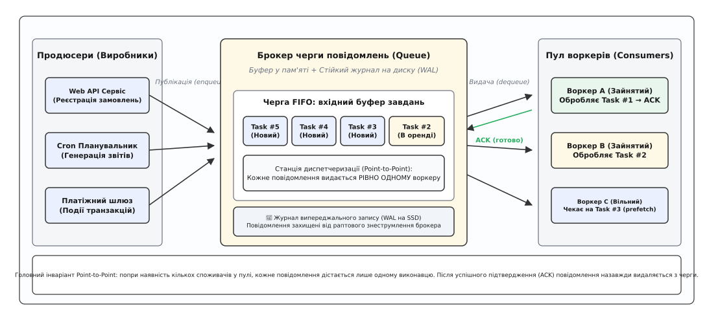
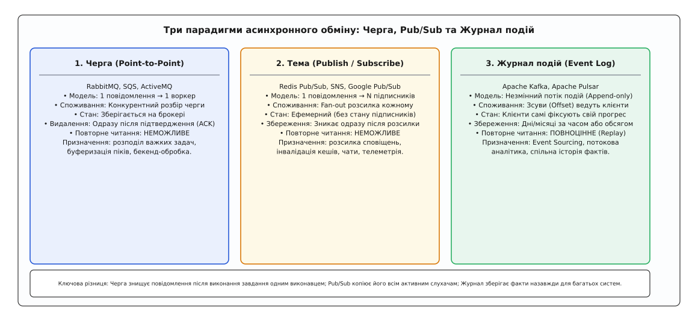
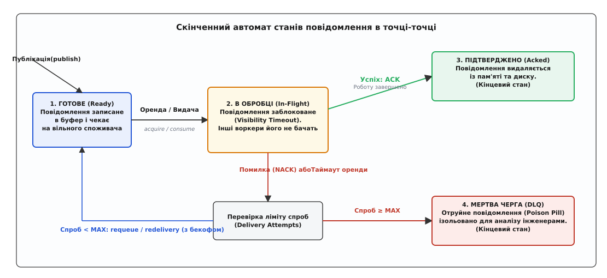
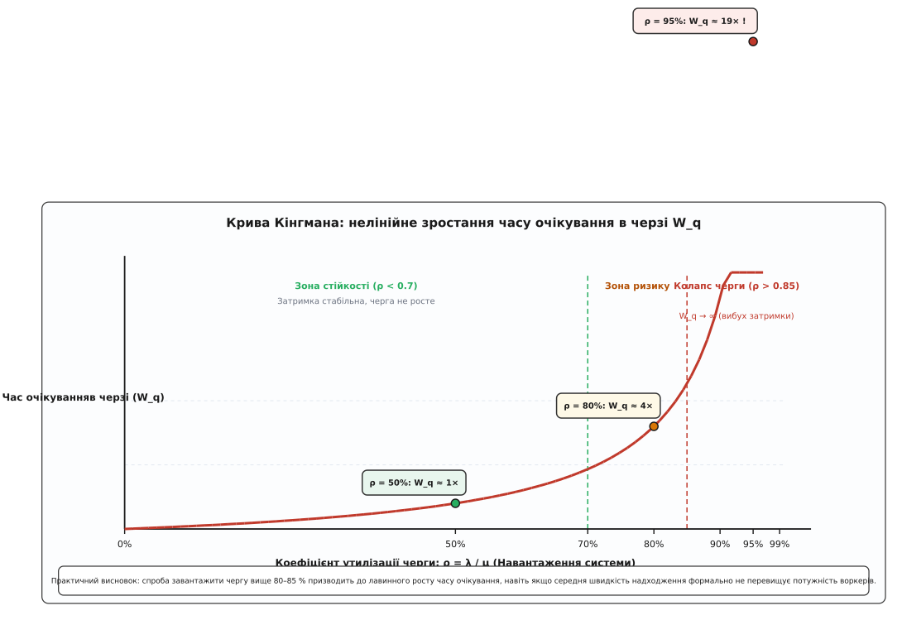

# Черга повідомлень: архітектура point-to-point, оренда видимості та балансування навантаження

<preknowlist>
- [Омани розподілених обчислень](book:programming/distributed-fallacies) — мережа ненадійна, затримка не нульова, а часткові відмови вузлів є штатним станом системи.
- [Гарантії доставки](book:programming/delivery-guarantees) — відмінності між at-most-once, at-least-once та обробкою effectively-once при передачі повідомлень.
- [Таймаути й бюджет часу](book:programming/timeouts-deadlines) — обмеження часу очікування та запобігання нескінченному блокуванню клієнтів.
- [Ідемпотентність](book:programming/idempotency) — здатність споживача повторно обробляти дублікати повідомлень без пошкодження кінцевого стану.
- [Черга FIFO](book:algorithms/queue-fifo) — базова структура даних із дисципліною «першим прийшов — першим пішов».
- [Закон Літтла](book:math/littles-law) — фундаментальне співвідношення між темпом надходження, середньою кількістю елементів і часом перебування в системі.
</preknowlist>

Сервіс купівлі квитків на концерти відкриває продаж на виступ популярного гурту. За перші 30 секунд на вебсервери навалюється 15 000 користувачів, які одночасно натискають кнопку бронювання. Фронтенд-сервер формує синхронний HTTP-запит до бекенд-сервісу генерації PDF-квитків із криптографічними QR-кодами, накладанням водяних знаків та відправкою банківських чеків. Генерація одного PDF-документа вимагає 400 мілісекунд інтенсивних обчислень процесора. Коли 15 000 запитів одночасно вдаряють у пул із 20 робочих потоків сервера PDF, 21-й запит стає в чергу очікування сокета, 100-й вичерпує ліміт з'єднань, а 500-й переповнює оперативну пам'ять сервера. Через 5 секунд вебсервери починають повертати користувачам помилку «504 Gateway Timeout», процеси генерації квитків зазнають аварії через вичерпання пам'яті (`OOM Kill`), а клієнти знову й знову оновлюють сторінку в браузері, посилюючи шторм навантаження.

Уся система зазнає повного каскадного колапсу.

Ця катастрофа сталася через фундаментальну ваду архітектури: **прямий синхронний зв'язок між компонентами змушував швидкий вебсервер працювати з тією самою швидкістю, що й повільний генератор квитків, одночасно вимагаючи їхньої стовідсоткової доступності в одну й ту саму мікросекунду**. Щоб розірвати цей згубний зв'язок, у розподілених системах застосовують посередника — **чергу повідомлень** (англ. *Message Queue*), організовану за моделлю «точка-точка» (англ. *Point-to-Point*).

## Чотири виміри зв'язаності: чому синхронний RPC руйнує розподілені системи

Коли два мікросервіси спілкуються за допомогою прямого виклику процедур (англ. *Remote Procedure Call, RPC* або синхронного HTTP/REST), між ними виникає чотири небезпечні виміри жорсткої зв'язаності (англ. *Coupling*):

1. **Часова зв'язаність (Temporal Coupling):**
   Відправник і отримувач зобов'язані бути доступними, працювати та мати активне мережеве з'єднання в **той самий момент часу**. Якщо цільовий сервіс перезавантажується для оновлення схеми бази даних протягом 30 секунд, клієнт отримує помилку з'єднання, і бізнес-транзакція скасовується.

2. **Пропускна зв'язаність (Throughput Coupling):**
   Швидкість роботи клієнта жорстко обмежена швидкістю найповільнішого етапу всього ланцюга викликів. Якщо зовнішній платіжний шлюз обробляє запит за 2 секунди, клієнтський HTTP-потік заблокований усі 2 секунди, утримуючи відкритий сокет, пам'ять стека та дескриптор з'єднання.

3. **Зв'язаність за відмовами (Failure Coupling):**
   Аварія або збій на стороні сервісу-отримувача негайно транслюється клієнту як виняток. Відправник змушений самостійно реалізовувати складну логіку повторів (*retries*), зберігати стан у тимчасових таблицях або втрачати замовлення клієнтів.

4. **Вразливість до пікових навантажень (Burst Vulnerability):**
   Короткочасний сплеск трафіку (наприклад, ранкова розсилка сповіщень) миттєво доходить до цільового сервісу в повному обсязі. Сервер, розрахований на середнє навантаження 500 запитів/с, отримує 5000 запитів/с і захлинається, замість того щоб планомірно розібрати накопичений обсяг.

Черга повідомлень типу «точка-точка» ліквідує всі чотири типи зв'язаності. Відправник публікує повідомлення в чергу за 2 мілісекунди, отримує підтвердження від брокера й негайно відпускає користувача. Повідомлення надійно осідає в буфері брокера, звідки його в спокійному темпі вичитує пул фонових воркерів.

Історія того, як індустрія пройшла шлях від перших банківських черг 1980-х років та пропрієтарного IBM MQ до відкритого протоколу AMQP та сервісу Amazon SQS, детально висвітлена окремо: [як виникли перші комерційні черги, стандартизувався AMQP та запускався хмарний SQS](book:programming/message-queue/hist-message-queuing.md).

## Анатомія моделі Point-to-Point: буфер, черга та інваріант єдиного споживача

Головною характеристикою черги повідомлень є архітектурна модель **Point-to-Point** (точка-точка, 1:1).


*Головний інваріант Point-to-Point: попри наявність багатьох продюсерів і багатьох воркерів у пулі, кожне конкретне повідомлення видається в обробку рівно одному виконавцю. Після отримання підтвердження (ACK) повідомлення назавжди знищується в брокері.*

У моделі точка-точка діють такі інваріанти:
- **Один або багато продюсерів (Producers / Publishers):** відправляють повідомлення (завдання, команди, документи) в іменовану чергу брокера через операцію `enqueue` (`basic.publish`).
- **Стійкий буфер черги (Queue Buffer):** брокер зберігає повідомлення в пам'яті для швидкого доступу та паралельно записує їх у дисковий журнал випереджального запису (WAL) для забезпечення стійкості до відмов (*Durability*).
- **Пул конкурентних споживачів (Competing Consumers):** кілька незалежних процесів-воркерів підключаються до однієї черги й конкурують за отримання наступного доступного завдання (`dequeue` / `basic.consume`).
- **Семантика єдиного виконання (Exclusive Delivery per Message):** на відміну від розсилки підписникам (Pub/Sub), **кожне окреме повідомлення дістається лише одному воркеру з усього пулу**.
- **Руйнівне вичитування (Destructive Consumption):** після того, як воркер успішно обробив завдання та надіслав квитанцію `ACK`, повідомлення **назавжди видаляється з черги**. Його неможливо перечитати повторно, і воно більше не існує для інших процесів.

## Три парадигми асинхронного обміну: Черга, Pub/Sub та Журнал подій

В інженерній практиці термін «повідомлення» часто застосовують до принципово різних архітектурних рішень. Важливо чітко розрізняти три головні парадигми асинхронного зв'язку.


*Три парадигми асинхронного обміну вирішують різні інженерні завдання: черга розподіляє дискретні задачі між воркерами (1:1), Pub/Sub транслює сповіщення багатьом системам (1:N), а журнал подій зберігає незмінну хронологію фактів для багаторазового відтворення.*

Порівняймо їхні фундаментальні характеристики:

```
Характеристика             Черга (Point-to-Point)            Тема (Publish / Subscribe)       Журнал подій (Event Log)
Еталонні системи           RabbitMQ, AWS SQS, ActiveMQ        Redis Pub/Sub, AWS SNS, GCP Pub/Sub Apache Kafka, Apache Pulsar
Призначення                Розподіл задач між воркерами      Трансляція подій (Fan-out)       Збереження незмінних фактів
Модель адресації           1 повідомлення → 1 воркер         1 повідомлення → N підписників   1 подія → N незалежних груп
Керування станом           Брокер відстежує кожен елемент    Ефемерне (без збереження стану)  Клієнти керують своїм зміщенням (Offset)
Доля після обробки         Видаляється з черги після ACK     Зникає одразу після розсилки     Зберігається днями/роками на диску
Повторне читання (Replay)  Неможливе в принципі              Неможливе в принципі             Повноцінне перечитування з будь-якого offset
Масштабування вичитування  Додавання воркерів у пул          Додавання нових підписок         Обмежене кількістю партицій (Partitions)
Типовий розмір повідомлень Середній або великий (1–512 КБ)   Дрібний (1–10 КБ)                Дрібний та структурований (Avro/Protobuf)
```

Детальніше про роботу розсилки та моделі підписок див. [архітектуру Publish/Subscribe](book:programming/publish-subscribe), а про механіку шардованих журналів комітів — [розподілений журнал подій у моделі Kafka](book:programming/event-log).

## Скінченний автомат повідомлення: від оренди видимості до підтвердження

Головною проблемою при передачі завдань через мережу є можливість раптової аварії виконавця. Якщо брокер видасть повідомлення воркеру і негайно зітре його зі свого сховища (режим `no_ack = true` або *Auto-Ack*), перше ж падіння процесу через вичерпання пам'яті призведе до безповоротної втрати бізнес-даних.

Щоб запобігти втратам, промислові черги точка-точка використовують модель **оренди з таймаутом видимості** (англ. *Visibility Timeout / Message Leasing*).


*Життєвий цикл повідомлення у точці-точці: повідомлення переходить у стан In-Flight і стає невидимим для інших воркерів на час оренди. Якщо воркер підтверджує успіх (ACK), воно видаляється. Якщо воркер гине або відправляє NACK, воно повертається в чергу (requeue) або після вичерпання ліміту спроб прямує в мертву чергу (DLQ).*

### Стан 1: Готове (Ready / Available)
Повідомлення успішно збережене в буфері та на диску (WAL). Воно видиме для диспетчера черги й чекає, поки будь-який вільний воркер запитає наступне завдання.

### Стан 2: В оренді / Невидиме (In-Flight / Leased / Invisible)
Коли воркер вичитує повідомлення (через `basic.consume` або `acquire`), брокер:
1. Змінює стан повідомлення на `In-Flight`.
2. Встановлює таймлайн завершення оренди: `lease_deadline = now() + visibility_timeout` (наприклад, 30 секунд).
3. **Робить повідомлення повністю невидимим для всіх інших воркерів у пулі.**

Поки діє таймаут видимості, жоден інший споживач не може отримати це повідомлення, що унеможливлює конкурентне паралельне виконання однієї задачі кількома воркерами.

### Стан 3: Підтверджено (Acknowledged / Deleted)
Воркер успішно виконав бізнес-транзакцію (записав дані в базу даних) і відправляє брокеру команду `basic.ack(delivery_tag)`.
Отримавши ACK, брокер:
- Знищує повідомлення в оперативній пам'яті.
- Дописує запис видалення в дисковий журнал (WAL).
- Звільняє кредит у вікні префетчу споживача.
Це кінцевий стан успішного завершення.

### Стан 4: Негативне підтвердження (NACK) або таймаут оренди
Якщо під час виконання завдання сталася помилка, можливі два сценарії:
- **Явний NACK / Reject:** воркер перехопив помилку (наприклад, таймаут зв'язку з базою даних) і сам надіслав брокеру команду `basic.nack(requeue=true)`.
- **Таймаут оренди (Visibility Timeout Expired):** процес воркера раптово загинув (сигнал `SIGKILL`, аварія заліза) або завис у дедлоку. Воркер не шле жодних сигналів. Брокер виявляє, що поточний час перевищив `lease_deadline`, і примусово відкликає оренду.

У разі повернення повідомлення брокер перевіряє лічильник спроб доставки (`attempts / redelivery_count`):
1. **Спроб < Ліміту (наприклад, attempts < 5):** повідомлення повертається в чергу `READY` (з можливим експоненційним бекофом) і буде видане іншому вільному воркеру.
2. **Спроб ≥ Ліміту (attempts >= 5):** повідомлення класифікується як **«отруйне»** (*Poison Pill*) і маршрутизується в спеціальну [мертву чергу](book:programming/dead-letter-queue) (Dead Letter Queue, DLQ), запобігаючи зацикленню збоїв.

Повнофункціональний сирцевий код надійного рушія черги з журналом WAL, таймером оренди та обробкою збоїв мовами C та C++ наведено в практичному проєкті: [робоча реалізація довговічної черги з журналом WAL та орендою на C та C++](book:programming/message-queue/proj-durable-p2p-queue.md).

## Керування потоком і зворотний тиск: вікно префетчу (QoS Prefetch)

Найпоширеніша помилка розробників-початківців під час налаштування споживачів — увімкнення підписки без обмеження швидкості видачі.

Якщо в черзі накопичилося 100 000 замовлень, і підключається один новий воркер, наївний брокер спробує миттєво «виштовхнути» всі 100 000 повідомлень у TCP-сокет цього воркера. Клієнтська бібліотека воркера збереже всі повідомлення у внутрішньому буфері пам'яті процесу, що миттєво призведе до аварійного вичерпання пам'яті (`OutOfMemory Error`). Крім того, решта паралельних воркерів сидітимуть без роботи, оскільки всі завдання монополізував перший підключений процес.

Для захисту від цієї проблеми в протоколі AMQP 0-9-1 передбачено механізм **Quality of Service (QoS Prefetch)** через метод `basic.qos`.

```
                    ┌─────────────────────────┐
                    │    Черга повідомлень    │
                    │      (10 000 задач)     │
                    └────────────┬────────────┘
                                 │
                   Ліміт видачі: Prefetch = 1
                                 │
                                 ▼
                     ┌───────────────────────┐
                     │   Воркер (Consumer)   │
                     │  (Обробляє 1 задачу)  │
                     └───────────┬───────────┘
                                 │
                          basic.ack(tag)
                                 │
                     (Звільняє слот префетчу ──> Брокер шле наступну 1 задачу)
```

Воркер встановлює параметр `prefetch_count` (наприклад, `prefetch_count = 1` або `prefetch_count = 10`):
- `prefetch_count = 1` (Суворий режим): брокер надсилає воркеру **рівно одне повідомлення** і блокує відправку наступних, доки воркер не надішле `basic.ack` за поточне завдання. Це забезпечує ідеальний баланс навантаження між швидкими й повільними воркерами: швидкий воркер обробляє 10 коротких задач, поки повільний працює над однією довгою.
- `prefetch_count = N` (Пакетний конвеєр): воркер утримує до `N` повідомлень у польоті. Це усуває затримки очікування мережевого раунд-трипу, суттєво підвищуючи загальну пропускну здатність конвеєра.

Повний довідник полів кадру `basic.qos`, прапорців конфігурації черг та бінарних кодів протоколу наведено в специфікації інтерфейсу: [повна специфікація бінарних кадрів, параметрів та кодів помилок протоколу AMQP 0-9-1](book:programming/message-queue/api-amqp-p2p.md).

> 🔧 **Навіщо це.** Запам'ятай залізне правило налаштування черг у прод-середовищі: ніколи не запускай воркер із нескінченним або дефолтним нульовим префетчем. Для важких завдань (генерація PDF, відеокодування, виклики сторонніх API) встановлюй `prefetch = 1`. Для швидких мікрооперацій (запис рядка в Redis, проста валідація) встановлюй `prefetch` у діапазоні від 20 до 100.

## Конкурентні споживачі та проблема збереження порядку

Черга повідомлень типу «точка-точка» є фундаментом класичного патерну [конкурентних споживачів](book:programming/competing-consumers) (англ. *Competing Consumers Pattern*).

Головна перевага цієї схеми — **безшовне горизонтальне масштабування**. Якщо графіки моніторингу фіксують зростання черги, інженер або автоскейлер Kubernetes просто збільшує кількість реплік воркерів з 3 до 10. Усі 10 воркерів підключаються до тієї самої черги, і швидкість обробки пропорційно зростає без необхідності переналаштування продюсерів чи перезапуску брокера.

Проте паралельна обробка в точці-точці породжує фундаментальну проблему: **неминуче порушення глобального порядку виконання завдань (Out-of-Order Execution)**.

```
Черга FIFO:        [ Задача #1 (довга, 5с) ] ──> Воркер A (почав о 12:00:00, завершив о 12:00:05)
                   [ Задача #2 (коротка, 1с) ] ─> Воркер B (почав о 12:00:01, завершив о 12:00:02)
```

Хоча брокер видав задачу #1 раніше за задачу #2, воркер B завершив виконання задачі #2 раніше, ніж воркер A впорався із задачею #1! Якщо ці повідомлення представляли зміни статусу одного замовлення (`#1: СТВОРЕНО` → `#2: ОПЛАЧЕНО`), стан бази даних буде пошкоджено.

Ще більший хаос виникає при повторних спробах (*Redelivery*): якщо задача #1 зазнає помилки й повертається в чергу через `NACK`, вона буде виконана **після** задач #2, #3 та #4.

### Як вирішують проблему порядку в архітектурі точка-точка:

1. **Групування повідомлень (Message Groups / Partition Keys):**
   Повідомлення маркуються бізнес-ключем (наприклад, `x-group-id: "order_8491"` або `MessageGroupId` в AWS SQS FIFO). Брокер гарантує, що всі повідомлення з однаковим ідентифікатором групи завжди видаються **суворо послідовно одному й тому самому воркеру**. Повідомлення різних груп обробляються паралельно.
2. **Режим єдиного активного споживача (Single Active Consumer):**
   До черги підключаються кілька воркерів, але брокер обирає рівно одного активного виконавця (`Active`), а решту тримає в гарячому резерві (`Standby`). Це гарантує суворий глобальний FIFO-порядок ціною втрати паралелізму.
3. **Оптимістичне версіонування в базі даних:**
   Кожне оновлення супроводжується номером версії (`UPDATE orders SET status = 'PAID', version = 2 WHERE id = 42 AND version = 1;`). Якщо через порушення порядку повідомлення з версією 1 прийде після версії 2, база даних просто проігнорує застарілу мутацію.

## Теорія масового обслуговування: чому 85% утилізації викликає колапс черги

Поширена інтуїтивна омана розробників полягає в очікуванні лінійної залежності між завантаженням системи та часом очікування в черзі. Здається: якщо при 50 % навантаження затримка становить 10 мс, то при 90 % вона повинна зрости максимум до 20 мс.

На практиці поведінка черг описується **законом Літтла** (`L = λ · W`) та **наближенням Кінгмана** для систем масового обслуговування.


*Крива Кінгмана демонструє нелінійну природу затримок у чергах: до 70 % завантаження час очікування мінімальний; у діапазоні 70–85 % починається деградація; понад 85 % затримка зростає за гіперболою до нескінченності.*

Середній час очікування завдання в черзі `W_q` для базової моделі M/M/1 виражається формулою:

```
W_q = (ρ / (1 - ρ)) · (1 / μ)
```

де `ρ = λ / μ` — коефіцієнт утилізації (відношення темпу надходження до продуктивності воркерів), а `1 / μ` — середній час обробки одного завдання.

Коли утилізація `ρ` наближається до `1.0`, знаменник `(1 - ρ)` прямує до нуля, створюючи круту вертикальну асимптоту:
- При `ρ = 0.50` (50 % навантаження): фактор затримки `0.5 / 0.5 = 1.0` (базовий час).
- При `ρ = 0.80` (80 % навантаження): фактор затримки `0.8 / 0.2 = 4.0` (зростання в 4 рази).
- При `ρ = 0.90` (90 % навантаження): фактор затримки `0.9 / 0.1 = 9.0` (зростання в 9 разів).
- При `ρ = 0.95` (95 % навантаження): фактор затримки `0.95 / 0.05 = 19.0` (зростання в 19 разів!).
- При `ρ = 0.99` (99 % навантаження): фактор затримки `0.99 / 0.01 = 99.0` (зростання в 99 разів!).

Повний математичний вивід формул M/M/1, розрахунок багатоканальних пулів M/M/c за формулою Ерланга-C та формули розрахунку місткості аварійного буфера наведено у вставці: [математичне виведення моделі M/M/1, пулу M/M/c та формули Кінгмана для затримок черги](book:programming/message-queue/math-queue-latency.md).

## Спеціалізовані патерни поверх черг точка-точка

На базі класичної черги повідомлень будуються високорівневі інженерні патерни:

### 1. Відкладені та заплановані повідомлення (Delayed / Scheduled Messages)
Продюсер публікує повідомлення із заголовком затримки (наприклад, `x-delay: 60000` або `DelaySeconds = 60`). Брокер тримає повідомлення у внутрішньому таймерному колесі (*Timer Wheel*) або службовій черзі очікування і переводить його в стан `READY` лише після завершення заданого інтервалу.
*Застосування:* надсилання листа з проханням залишити відгук через 24 години після доставки товару, повторна перевірка статусу оплати через 15 хвилин.

### 2. Пріоритетні черги (Priority Queuing)
Черга створюється з підтримкою рівнів пріоритетів (наприклад, `x-max-priority: 10`). Повідомлення публікуються з полем `priority: 9` (термінове) або `priority: 1` (фонове).
Диспетчер брокера підтримує внутрішній бінарний heap або набір масивів і **завжди видає споживачам повідомлення з вищим пріоритетом раніше за низькопріоритетні**, навіть якщо низькопріоритетні надійшли значно раніше.

### 3. Патерн «Квитанція в камері схову» (Claim Check Pattern)
Брокери черг оптимізовані для роботи з дрібними бінарними метаданими (до 64–256 КБ). Якщо відправник спробує передати крізь чергу важке відео вагою 500 МБ, брокер миттєво вичерпає оперативну пам'ять і деградує за дисковим вводом-виводом.
Патерн [квитанції в камері схову](book:programming/claim-check) розв'язує цю проблему: продюсер завантажує великий файл в об'єктне сховище (AWS S3, MinIO), отримує унікальний URI-ідентифікатор файлу, і кладе в чергу **лише компактну JSON-квитанцію** `{"file_id": "s3://bucket/video_9182.mp4", "action": "transcode"}`. Воркер отримує квитанцію з черги, самостійно викачує файл з S3, обробляє його й підтверджує задачу.

### 4. Транзакційна вихідна скринька (Transactional Outbox)
Як гарантувати, що запис у реляційну базу даних (створення замовлення) та публікація повідомлення в чергу відбудуться атомарно? Патерн [Transactional Outbox](book:programming/outbox-pattern) записує подію в спеціальну таблицю `outbox` у тій самій локальній транзакції БД, звідки фоновий процес вичитує рядки й публікує їх у брокер. На стороні споживача дзеркально діє патерн [Transactional Inbox](book:programming/inbox-pattern) для гарантії надійної дедуплікації.

## Механізми збереження даних: сторінковий кеш, fsync та кворумна реплікація Raft

Коли продюсер надсилає стійке повідомлення (`delivery_mode = 2` / `Persistent`), брокер повідомлень зобов'язаний забезпечити його збереження на випадок аварійного вимкнення живлення сервера. Проте на рівні взаємодії з операційною системою Linux виникає конфлікт між швидкістю та безпекою даних.

### Рівні збереження на диску:

```
Застосунок-брокер ──(write)──> [ Сторінковий кеш ОС (Page Cache) ] ──(fsync / dirty flush)──> [ Контролер NVMe SSD ] ──> Флеш-комірки
```

1. **Запис у сторінковий кеш (Page Cache):**
   Системний виклик `write()` лише копіює байти структури повідомлення з адресної пам'яті брокера в буфери ядра ОС. Операція триває лічені мікросекунди, але фізично дані все ще залишаються в енергозалежній оперативній пам'яті (RAM). Якщо в цю мить сервер знеструмиться, ядро не встигне скинути «брудні сторінки» (*Dirty Pages*), і повідомлення зникне безслідно.

2. **Примусова синхронізація (`fsync` / `fdatasync`):**
   Щоб брокер мав право надіслати продюсеру підтвердження `Publisher Confirm` (або `commit-ok`), він зобов'язаний викликати `fdatasync()`. Ядро Linux надсилає накопичувачу команду скидання внутрішнього кешу DRAM (`FLUSH CACHE`), гарантуючи фізичний запис у комірки пам'яті.

3. **Груповий коміт (Group Commit):**
   Оскільки одиночний `fsync` на сучасному накопичувачі займає 100–500 мікросекунд, виконання синхронізації на кожне повідомлення обмежує темп публікації 2 000 – 10 000 msg/s на диск. Промислові брокери об'єднують повідомлення від сотень паралельних каналів і виконують один спільний `fdatasync()` кожні 2–5 мс, досягаючи пропускної здатності понад 100 000 msg/s.

### Кворумна реплікація супроти застарілого дзеркалювання (Mirrored Queues)

В історичних версіях RabbitMQ для захисту від падіння одного вузла застосовували схему дзеркалювання черг (англ. *Mirrored Queues / Classic HA*), побудовану поверх вбудованої бази даних Erlang Mnesia. У цій схемі один вузол був майстром (`Master`), а решта вузлів кластера тримали повні синхронні копії (`Mirrors`).

Проте дзеркалювання мало критичну інженерну ваду: **нездатність коректно переживати мережеві розщеплення (Network Partitions / Split-Brain)**. Якщо між стійками дата-центру виникав розрив зв'язку, обидві половини кластера обирали власного незалежного майстра. Коли зв'язок відновлювався, рушій Mnesia не міг автоматично вирішити конфлікт даних, що призводило до затирання черг або масового дублювання завдань.

У сучасних розподілених брокерах стандартним рішенням стали **кворумні черги** (англ. *Quorum Queues*), побудовані на базі строгого математичного алгоритму розподіленого консенсусу **Raft**.

```
                   ┌──────────────────────────────────────┐
                   │    Кворумна черга (Raft-група)       │
                   └──────────────────────────────────────┘
                                      │
            ┌─────────────────────────┼─────────────────────────┐
            │                         │                         │
            ▼                         ▼                         ▼
   ┌─────────────────┐       ┌─────────────────┐       ┌─────────────────┐
   │ Вузол 1 (Лідер) │       │ Вузол 2 (Фоловер│       │ Вузол 3 (Фоловер│
   │  Raft Leader    │       │  Raft Follower  │       │  Raft Follower  │
   │   [ WAL Log ]   │       │   [ WAL Log ]   │       │   [ WAL Log ]   │
   └────────┬────────┘       └────────▲────────┘       └────────▲────────┘
            │                         │                         │
            │ AppendEntries           │                         │
            ├─────────────────────────┴─────────────────────────┤
            │  (Реплікація на більшість вузлів: 2 з 3 = Кворум)  │
            ▼                                                   ▼
```

Принципи роботи кворумної черги:
- Кожна черга є автономною Raft-групою з непарної кількості реплік (зазвичай 3 або 5 вузлів).
- Лідер черги приймає операції `enqueue`, записує їх у свій локальний WAL і паралельно транслює фоловерам через RPC `AppendEntries`.
- Щойно **більшість реплік** (наприклад, 2 з 3) підтвердили запис на свій диск, запис вважається закоміченим (*Committed*). Лідер повертає продюсеру квитанцію `Publisher Confirm` і робить повідомлення доступним для видачі споживачам.
- Якщо лідер виходить з ладу, фоловери за 150–300 мс проводять голосування, обирають нового лідера з найактуальнішим журналом і продовжують обслуговування без втрати жодного підтвердженого повідомлення та без ризику розщеплення мозку.

## Стратегії дедуплікації: вікна дедуплікації та таблиці оброблених ключів

У будь-якій системі з гарантією доставки [At-Least-Once](book:programming/delivery-guarantees) дублювання повідомлень є математично неминучим наслідком мережевих збоїв.

Типовий сценарій виникнення дубліката:
1. Продюсер відправляє повідомлення `{"payment_id": 901, "amount": 100}` брокеру.
2. Брокер успішно зберігає його на диску в черзі.
3. Брокер надсилає підтвердження `ACK`, але пакет втрачається через короткочасний обрив TCP-кабелю.
4. Продюсер зазнає таймауту очікування квитанції, вважає операцію невдалою і надсилає повідомлення повторно.
5. У черзі утворюються **два абсолютно однакові завдання**.

Для запобігання подвійному списанню коштів архітектори застосовують два рівні дедуплікації:

### 1. Дедуплікація на рівні брокера (Deduplication Window)
Брокери з підтримкою строгих черг FIFO (наприклад, AWS SQS FIFO або RabbitMQ з плагіном deduplication) вимагають обов'язкової наявності поля `MessageDeduplicationId` або генерують SHA-256 хеш від тіла повідомлення.
- Брокер підтримує ковзне часове вікно (наприклад, 5 хвилин).
- Якщо протягом цього вікна надходить повідомлення з ідентифікатором, який уже було зафіксовано в системі, брокер успішно повертає клієнту статус OK, але **не додає дублікат у чергу повторно**.

### 2. Дедуплікація на рівні споживача (Transactional Inbox / Idempotency Key)
Якщо вікно дедуплікації брокера спливло (наприклад, повтор надійшов через 10 хвилин), захист переходить на сторону сервісу-споживача:
- Споживач перед виконанням корисної дії відкриває транзакцію в реляційній базі даних.
- Виконується атомарна спроба вставити унікальний ключ повідомлення в таблицю дедуплікації:
  ```sql
  INSERT INTO processed_messages (message_id, processed_at) VALUES ('pay_901_a8f9', NOW());
  ```
- Якщо ключ уже існує в таблиці, база даних генерує помилку порушення унікальності `Unique Key Violation`. Воркер негайно припиняє обробку, шле брокеру `ACK` (щоб видалити дублікат із черги) і не списує гроші вдруге.
- Якщо ключа немає — воркер виконує бізнес-логіку та фіксує транзакцію `COMMIT` разом зі збереженням ключа.

## Дерево архітектурних рішень: Черга, Pub/Sub чи Журнал подій?

Щоб обрати правильний інструмент асинхронної взаємодії, використовуйте інженерний алгоритм прийняття рішень:

```
Чи вимагає задача обробки даних кількома незалежними підсистемами одночасно?
  │
  ├──> ТАК ──> Чи потрібна можливість перечитувати історію подій з минулого (Replay)
  │            або зберігати лог днями/місяцями?
  │              │
  │              ├──> ТАК ──> [ Журнал подій: Apache Kafka / Apache Pulsar ]
  │              │            (Незмінний append-only лог подій з шардуванням за ключем)
  │              │
  │              └──> НІ  ──> [ Тема Pub/Sub: Redis Pub/Sub / AWS SNS / GCP PubSub ]
  │                           (Ефемерна широкомовна розсилка повідомлень підписникам)
  │
  └──> НІ (Одне завдання має виконати рівно один воркер із пулу)
         │
         └──> [ Черга повідомлень Point-to-Point: RabbitMQ / AWS SQS / ActiveMQ ]
              (Дискретний розподіл задач, оренда видимості, руйнівне вичитування після ACK)
```

## Практичний розбір конфігурації у виробничому середовищі

Для безперебійної експлуатації черг під високим навантаженням інфраструктурні інженери повинні враховувати три ключові конфігураційні ліміти:

1. **Водяні знаки оперативної пам'яті (Memory High Watermark):**
   У RabbitMQ за замовчуванням встановлено `vm_memory_high_watermark.relative = 0.4` (40 % від загального обсягу RAM сервера). Якщо розмір черг у пам'яті досягає цієї межі, брокер **примусово блокує TCP-сокети всіх продюсерів** (*Alarm Backpressure*), припиняючи прийом нових повідомлень, доки воркери не звільнять пам'ять. Для захисту від раптових блокувань використовують черги типу `lazy` або `quorum`, які агресивно вивантажують тіла повідомлень на SSD-диск.

2. **Ліміти дескрипторів файлів (File Descriptors Limit, `nofile`):**
   Кожне клієнтське TCP-з'єднання, кожен віртуальний канал та кожен сегментний файл журналу на диску потребують виділення дескриптора файлу в ядрі Linux. Стандартний системний ліміт `1024` дескриптори призведе до відмови брокера при підключенні 500 воркерів. У виробничих конфігураціях системний ліміт обов'язково піднімають до щонайменше `65536` або `1048576` (`/etc/security/limits.conf`).

3. **Розмір дискового розділу під аварійні беклоги:**
   Якщо пул споживачів зазнає повної аварії під час нічного релізу, брокер повинен мати достатньо дискового простору, щоб накопичувати 100 % вхідного потоку без зупинки роботи бізнесу. Розрахунок мінімального дискового розділу виконується за формулою: `V_disk = λ_peak · T_max_outage · S_msg · 1.5`, де `1.5` — коефіцієнт на службові індекси та метадані WAL.

## Підводні камені та типові дефекти експлуатації

### 1. Отруйні повідомлення (Poison Pills)
Повідомлення, вміст якого викликає фатальну помилку парсингу, ділення на нуль або неперехоплений виняток у коді воркера.
- *Наслідок:* воркер падає, брокер повертає повідомлення в чергу, наступний вільний воркер бере його, теж падає — за лічені секунди вимирає весь пул із сотні воркерів (*Cascade Crash*).
- *Захист:* перехоплення фатальних помилок у глобальному блоці `try/catch`, підрахунок спроб доставки (`delivery_count`) та автоматичне переміщення в [мертву чергу](book:programming/dead-letter-queue) (DLQ) після 3–5 невдалих спроб.

### 2. Лавина повторів (Retry Storms)
Коли база даних споживача зазнає короткочасного перевантаження й починає відповідати повільно, воркери масово відхиляють завдання (`NACK`) або перевищують таймаут видимості. Якщо всі воркери повертають тисячі повідомлень одночасно, навантаження на базу зростає лавиноподібно.
- *Захист:* використання [експоненційного відтермінування з випадковим шумом](book:programming/retries-backoff) (Exponential Backoff with Jitter) та локальних [запобіжників](book:programming/circuit-breaker-pattern) (Circuit Breakers).

### 3. Зомбі-воркери (Zombie Consumers)
Воркер зависає в тривалій паузі збирача сміття (GC Pause) або важкому SQL-запиті. Брокер вважає його мертвим за таймаутом видимості й передає повідомлення воркеру B. Воркер B успішно виконує транзакцію. Після цього воркер A повертається до життя й повторно застосовує застарілу мутацію.
- *Захист:* використання монотонних фехтувальних токенів (*Fencing Tokens / Lease Epochs*) або ідемпотентних оновлень стану в базі даних.

## Архітектурний висновок

Черга повідомлень типу «точка-точка» — це головний архітектурний інструмент для побудови слабозв'язаних, масштабованих та стійких до відмов розподілених систем. Вона перетворює нестабільний, хаотичний потік вхідних запитів на планомірний, керований конвеєр обробки, гарантуючи збереження кожного бізнес-завдання навіть під час найважчих апаратних та мережевих аварій.

