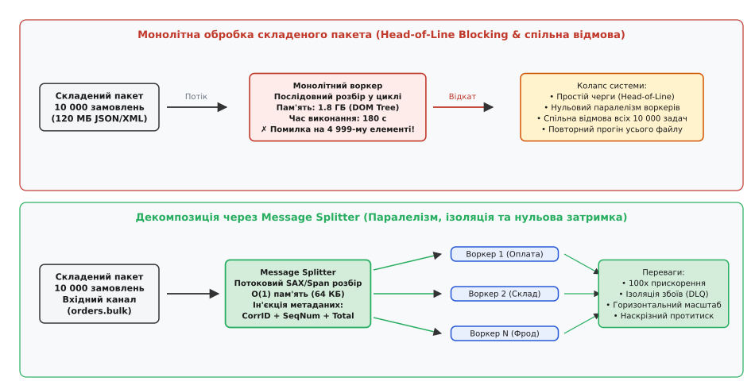
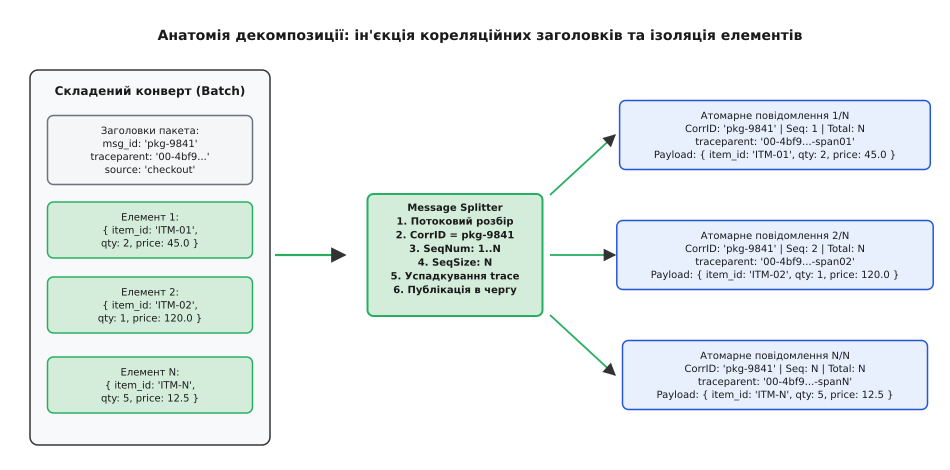
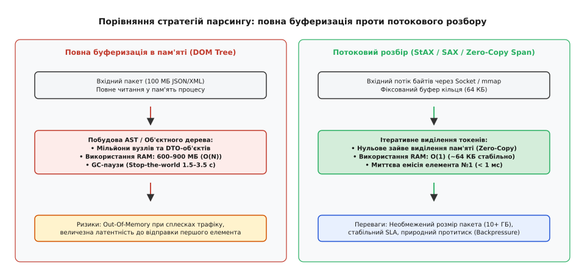
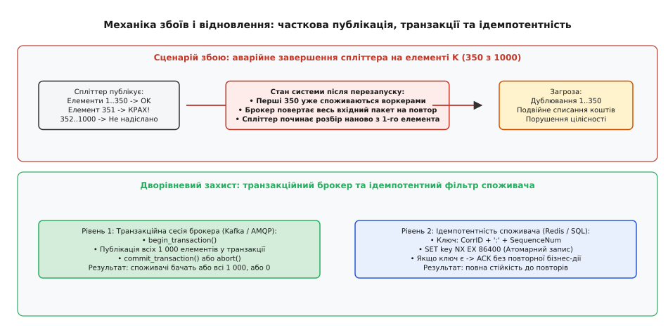

# Розділювач повідомлень: декомпозиція складених пакетів у розподілених потоках

<preknowlist>
- [Черга повідомлень](book:programming/message-queue) — буферизована асинхронна передача даних «точка-точка» між компонентами.
- [Маршрутизатор повідомлень](book:programming/message-router) — розв'язання топологічних шляхів та селекція цільових каналів за критеріями.
- [Гарантії доставки](book:programming/delivery-guarantees) — семантика at-least-once, at-most-once та exactly-once у ненадійній мережі.
- [Ідемпотентність](book:programming/idempotency) — захист стану системи від дублювання операцій при повторній доставці.
- [Мертва черга](book:programming/dead-letter-queue) — ізоляція пошкоджених та необроблюваних повідомлень для аудиту.
</preknowlist>

Міжбанківський платіжний шлюз приймає щовечірній кліринговий файл від платіжної системи: єдиний стиснений пакет розміром 180 МБ містить 60 000 окремих транзакцій списання, переказів між філіями, конвертацій валют та податкових утримань. Якщо підсистема обробки побудована за монолітним принципом, один сервіс-споживач змушений зчитати весь 180-мегабайтний пакет із черги, десеріалізувати його у велетенське дерево об'єктів пам'яті (витрачаючи понад 1.5 ГБ RAM) та послідовно виконувати валідацію кожної операції в циклі. 

Такий підхід породжує три критичні системні проблеми:
1. **Блокування черги (Head-of-Line Blocking):** Обробка 60 000 платежів одним процесом триває 210 секунд. Протягом усього цього часу вхідний канал заблоковано, а десятки паралельних воркерів у кластері простоюють без роботи, позбавлені можливості отримати доступ до окремих незалежних операцій.
2. **Катастрофічний радіус ураження одиничного збою (Blast Radius):** Якщо 48 112-та транзакція містить пошкоджену контрольну суму, невідомий рахунок або викликає помилку валідації схеми, монолітний обробник перериває виконання всього пакетного циклу. Вся сесія відкочується, 48 111 уже перевірених успішних платежів скасовуються, а весь 180-мегабайтний файл відправляється брокером на нескінченний повторний прогін, блокуючи фінансовий розрахунок тисяч користувачів.
3. **Гетерогенна маршрутизація:** Окремі рядки вхідного пакета вимагають абсолютно різної бізнес-обробки: валютні операції мають прямувати до валютного контролю, транзакції на суму понад 100 000 гривень — до підсистеми фінансового моніторингу, а дрібні комісії — до внутрішнього бухгалтерського регістру. Монолітний сервіс змушений інтегрувати в собі клієнтські бібліотеки всіх існуючих у банку підсистем, перетворюючись на заплутану «божественну точку відмови» (англ. *God Object / Tight Coupling*).


*Зверху: монолітна обробка складеного пакета блокує потік, створює високу латентність і призводить до спільної відмови всіх 10 000 замовлень через помилку в одному елементі. Знизу: розділювач повідомлень декомпозує пакет на дискретні елементи, забезпечуючи паралелізм воркерів та ізоляцію збоїв.*

## Декомпозиція та розв'язання зв'язності

Щоб розірвати монолітне зчеплення складених даних і надати кожному атомарному бізнес-факту можливість рухатися системою незалежно, між джерелом пакетів та пулом обробників розміщують спеціалізований посередник — **розділювач повідомлень** (англ. *Message Splitter*, від давньоанглійського *splittan* та нідерландського *splitten* — розколювати, розщеплювати, ділити на частки).

Розділювач повідомлень приймає єдине складене повідомлення з вхідного каналу, ітеративно виділяє з його тіла кожну окрему логічну бізнес-одиницю, загортає її в індивідуальний транспортний конверт, збагачує службовими метаданими походження і публікує в один або кілька вихідних каналів для паралельного виконання.

Історично ця концепція пройшла шлях від механічного сортування перфокарт і розбору складених комерційних конвертів стандарту UN/EDIFACT до сучасних потокових реактивних операторів: [як патерн розбиття еволюціонував від пакетних перфокарт і EDIFACT до реактивних потоків](book:programming/message-splitter/hist-batch-fragmentation.md).

Фундаментальні архітектурні наслідки впровадження розділювача:
* **Трансформація відношення «один-до-багатьох» (`1 → N`):** Одне вхідне повідомлення на транспортному рівні породжує `N` дискретних незалежних подій.
* **Повна ізоляція відмов (Fault Isolation):** Помилка в одному елементі ізолюється на рівні одного конкретного вихідного повідомлення (яке можна відправити у [мертву чергу](book:programming/dead-letter-queue)), не зупиняючи обробку решти `N - 1` валідних елементів.
* **Горизонтальне масштабування споживання:** Дискретні повідомлення розподіляються між сотнями воркерів через патерн [конкурентних споживачів](book:programming/competing-consumers), скорочуючи час виконання 60 000 операцій з 210 секунд до лічених часток секунди.
* **Динамічна селективна маршрутизація:** Після розбиття кожне окреме повідомлення може бути направлене через [маршрутизатор повідомлень](book:programming/message-router) у власну спеціалізовану чергу згідно з його персональним типом.

## Анатомія розділювача: семантична декомпозиція та технічна фрагментація

У практиці проектування розподілених систем патерн Message Splitter застосовується у двох принципово різних площинах: семантичній та технічній.

### 1. Семантичне розбиття (Semantic Splitting)

**Семантичне розбиття** (від грецького *semantikos* — значущий, сутнісний) здійснює декомпозицію за межами бізнес-домену. Вхідне повідомлення є контейнером для логічного списку об'єктів.

Типові сценарії семантичного розбиття:
* **Замовлення інтернет-магазину (Order → Order Items):** Кошик покупця містить 10 різних товарів (книга, монітор, побутова хімія). Спліттер формує 10 незалежних повідомлень: одне прямує на цифровий склад ліцензій, три — до складу електроніки у Львові, решта — до складу в Києві.
* **Розрахункова відомість заробітної плати (Payroll Batch → Payslips):** Бухгалтерський документ на 5 000 працівників розбивається на 5 000 персональних розрахункових листів для паралельного розрахунку податків та банківських виплат.
* **Кадр телеметрії IoT (Telemetry Frame → Sensor Readings):** Автомобільний бортовий комп'ютер надсилає єдиний пакет із 50 параметрами (тиск у шинах, температура оливи, заряд батареї, координати GPS). Спліттер розщеплює його на події для підсистеми безпеки, моніторингу батареї та сервісу геопозиціонування.

```
Вхід:  CompositeOrder{order_id: "ORD-902", items: [ItemA, ItemB, ItemC]}
Вихід: Msg1{order_id: "ORD-902", item: ItemA, seq: 1/3}
       Msg2{order_id: "ORD-902", item: ItemB, seq: 2/3}
       Msg3{order_id: "ORD-902", item: ItemC, seq: 3/3}
```

### 2. Технічна фрагментація (Payload Chunking)

**Технічна фрагментація** (від латинського *fragmentum* — уламок, шматок) не аналізує бізнес-структуру даних, а розв'язує задачу подолання апаратних та мережевих обмежень інфраструктури брокера.

Більшість сучасних систем обміну повідомленнями мають жорсткі ліміти на максимальний розмір одного повідомлення:
* **AWS SQS / SNS:** 256 КБ на повідомлення.
* **Azure Service Bus:** 1 МБ (Standard) або 100 МБ (Premium).
* **Apache Kafka:** за замовчуванням `message.max.bytes = 1048576` (1 МБ).
* **RabbitMQ:** рекомендований розмір кадру до 128 КБ для уникнення деградації продуктивності пам'яті Erlang VM.

Якщо системі необхідно передати бінарний артефакт розміром 40 МБ (наприклад, супутниковий знімок або оновлення мікропрограми контролера), технічний спліттер нарізає сирий байтовий потік на фіксовані блоки (чанки) розміром по 512 КБ. Кожен чанк отримує заголовок із байтовим зміщенням `chunk_offset` та порядковим номером `chunk_index`, передається через стандартний брокер і пізніше реконструюється в єдиний файл симетричним агрегатором.


*Складений конверт проходить через розділювач, який виділяє окремі елементи й збагачує кожен унікальним заголовком кореляції, монотонним номером послідовності та прапорцем завершення.*

## Механіка кореляції: збереження контексту та топологія метаданих

Головна небезпека декомпозиції — втрата контексту походження. Коли 10 000 окремих повідомлень опиняються у спільній черзі поряд із мільйонами інших повідомлень від сторонніх процесів, споживачі та системи моніторингу повинні точно знати:
1. Частиною якого саме початкового пакета є цей елемент?
2. Яке його положення в загальній послідовності?
3. Скільки всього елементів містив початковий пакет і чи є цей елемент останнім?
4. Який наскрізний слід розподіленого трасування (Distributed Trace) пов'язує його з початковим HTTP-запитом клієнта?

Для розв'язання цього завдання розділювач інжектує у службовий заголовок кожного вихідного повідомлення стандартизований конверт метаданих:

* **Кореляційний ідентифікатор (`X-Correlation-ID` / `x-correlation-id`):** Унікальний ідентифікатор сесії (UUIDv4 або 64-бітний числовий ідентифікатор). Усі `N` елементів, виділених з одного пакета, отримують абсолютно однаковий `Correlation ID`.
* **Номер послідовності (`X-Sequence-Number`):** Строго монотонно зростаючий числовий індекс елемента (`1, 2, 3, ..., N`).
* **Загальний розмір послідовності (`X-Sequence-Size`):** Загальна кількість елементів `N` у початковому пакеті.
* **Прапорець завершення (`X-Is-Last-Element` / `fin`):** Булевий індикатор (`true` для останнього елемента, `false` для решти). Критично необхідний у потокових сценаріях, де загальна кількість елементів `N` невідома заздалегідь аж до завершення читання файлу.
* **W3C Trace Context (`traceparent`):** Спліттер копіює глобальний `Trace ID` вихідного запиту, але генерує новий унікальний `Span ID` для кожної виділеної гілки обробки.

Повна нормативна специфікація заголовків, форматів Protobuf v3 та схем JSON Schema наведена у технічній довідці: [детальна специфікація метаданих, схеми заголовків та протоколу фрагментації розділювача](book:programming/message-splitter/api-splitter-contract.md).

```
Вхідний пакет:
  Headers: { id: "batch-4019", traceparent: "00-4bf92f...-00f0-01" }
  Payload: [ {item: "A"}, {item: "B"} ]

Вихідне повідомлення 1:
  Headers: { 
    "x-correlation-id": "batch-4019",
    "x-sequence-number": 1,
    "x-sequence-size": 2,
    "x-is-last-element": false,
    "traceparent": "00-4bf92f...-span01-01"
  }
  Payload: { item: "A" }

Вихідне повідомлення 2:
  Headers: { 
    "x-correlation-id": "batch-4019",
    "x-sequence-number": 2,
    "x-sequence-size": 2,
    "x-is-last-element": true,
    "traceparent": "00-4bf92f...-span02-01"
  }
  Payload: { item: "B" }
```

## Стратегії парсингу та управління пам'яттю: DOM проти потокового Zero-Copy

Найчастіша архітектурна помилка при реалізації розділювача — спроба завантажити весь вхідний пакет у пам'ять у вигляді об'єктного дерева (DOM-модель у XML, повне читання `json.loads()` або десеріалізація через `Jackson ObjectMapper`).

### 1. Буферизація у пам'яті (DOM / Memory Tree)

При DOM-парсингу вхідний файл розміром 200 МБ трансформується у мільйони дрібних об'єктів мови високого рівня (рядки, мапи, вузли дерева). Через накладні витрати на заголовки об'єктів віртуальної машини (JVM / V8 / Python Runtime) коефіцієнт роздування пам'яті становить від 4x до 8x:

```
200 МБ JSON на диску  →  800 МБ – 1.6 ГБ у купі (Heap RAM)
```

Наслідки:
* Складність за пам'яттю: `O(N)` від розміру вхідного документа.
* Паузи збирача сміття (GC Stop-The-World) на 1.5–4.0 секунди для очищення мільйонів тимчасових вузлів.
* Небезпека аварійної зупинки сервера (Out-Of-Memory Error) при одночасному надходженні кількох паралельних пакетів.
* Висока початкова затримка: перший елемент не може бути відправлений у чергу доти, доки весь гігабайтний файл не буде повністю вичитаний і розпарсений у пам'яті.

### 2. Потоковий розбір без копіювання (Streaming / StAX / Zero-Copy)

Промисловий розділювач будується за принципом **потокового токенізатора** (Streaming Event Parser: StAX у Java, SAX/Expat у C, `ijson` у Python, `simdjson` у C++).

Спліттер виділяє фіксований кільцевий буфер пам'яті (наприклад, 64 КБ) і зчитує дані з мережевого сокета або диска невеликими порціями. Лексер шукає відкриваючий тег або структурну дужку чергового елемента, десеріалізує **рівно один** поточний об'єкт, негайно відправляє його у вихідну чергу й звільняє пам'ять перед зчитуванням наступного елемента.

Переваги потокового підходу:
* Складність за пам'яттю: `O(1)` (константне використання пам'яті, яке не залежить від розміру файлу — файл на 100 ГБ обробляється у тих самих 64 КБ RAM).
* Мінімальна затримка: перший елемент надходить споживачам через 0.1 мілісекунди після старту читання файлу.
* Нульовий оверхед на збирач сміття: відсутнє масове виділення довгоживучих об'єктів у купі.


*Зліва: завантаження всього пакета в DOM створює вибух споживання оперативної пам'яті та затримки GC. Справа: потоковий розбір через фіксований буфер утримує константну пам'ять O(1) і миттєво передає перший елемент у чергу.*

## Партиціонування та стратегії збереження локального порядку

Коли розділені повідомлення надсилаються у розподілений журнал подій ([Event Log](book:programming/eventual-consistency)) на кшталт Apache Kafka, вибір ключа повідомлення (Kafka Record Key) визначає, у яку саме фізичну партицію потрапить кожен дискретний елемент.

Існує три взаємовиключні стратегії партиціонування розділених повідомлень:

### 1. Партиціонування за кореляційним ключем пакета (`Key = Correlation_ID`)

Усі `N` повідомлень одного пакета публікуються з однаковим ключем, що дорівнює ідентифікатору батьківської сесії:
* **Перевага:** Гарантується 100% збереження порядку слідування всіх елементів усередині однієї партиції.
* **Недолік:** Усі 60 000 елементів спрямовуються в **одну** партицію, яку читає лише **один** активний споживач у групі споживачів. Це створює локальне гаряче місце (англ. *Hot Partition*) і повністю нівелює переваги горизонтального паралелізму.

### 2. Партиціонування за бізнес-ключем сутності (`Key = Item.Account_ID`)

Кожен дискретний елемент публікується з ключем, що відповідає бізнес-ідентифікатору цільової сутності (наприклад, номеру банківського рахунку чи ідентифікатору клієнта):
* **Перевага:** Елементи рівномірно розсіюються по всіх доступних партиціях кластера, забезпечуючи максимальний паралелізм обробки. Водночас для кожного окремого клієнтського рахунку зберігається строгий порядок транзакцій, оскільки всі операції над одним рахунком гарантовано потрапляють в одну й ту саму партицію.
* **Недолік:** Загальний глобальний порядок усього початкового пакета втрачається. Якщо підсумковий звіт вимагає початкової послідовності, на виході необхідний [ресеквенсер](book:programming/message-aggregator).

### 3. Циклічний розподіл без ключа (`Key = null` / Round-Robin)

Повідомлення почергово відправляються в усі партиції топіка:
* **Перевага:** Ідеальне вирівнювання навантаження (Perfect Load Balancing) на мережу та брокери.
* **Недолік:** Повний хаос у порядку слідування подій; підходить лише для абсолютно незалежних атомарних завдань (наприклад, надсилання Push-сповіщень).

## Відмовостійкість, атомарність та ідемпотентна обробка

У розподілених середовищах падіння серверів та розриви мережевих з'єднань є неминучими штатними подіями. Розглянемо критичний сценарій збою розділювача повідомлень:

> **Сценарій збою:** Спліттер прийняв складений пакет на 1 000 транзакцій. Він успішно розпарсив та опублікував у вихідну чергу перші 350 елементів. Під час формування 351-го елемента на сервері спліттера вимикається живлення або стається апаратний збій ядра (Kernel Panic).

Що відбувається після відновлення працездатності системи:
1. Оскільки вхідне 1 000-елементне повідомлення не було підтверджено (не надійшов `ACK` брокеру), брокер повертає початковий пакет у вхідну чергу.
2. Новий екземпляр спліттера вичитує цей пакет і починає розбір **спочатку**, тобто з 1-го елемента.
3. Елементи з 1 по 350 публікуються у вихідну чергу **вдруге**.
4. Якщо кінцеві споживачі не мають захисту від дублювання, перші 350 клієнтів отримають подвійне списання коштів або повторне відвантаження товару.


*Аварія спліттера на проміжному елементі призводить до повторної емісії вже надісланих частин. Система захищається дворівневою моделлю: транзакційними сесіями брокера та ідемпотентними фільтрами споживачів.*

Для забезпечення надійності та цілісності даних застосовується комплекс інженерних тактик:

### 1. Транзакційне публікування брокера (Transactional Batch Publish)

Якщо використовується брокер із підтримкою розподілених транзакцій (наприклад, транзакційний продюсер Apache Kafka або сесії AMQP/JMS), спліттер відкриває транзакцію `producer.beginTransaction()`. Усі 1 000 розділених повідомлень публікуються всередині цієї транзакції разом зі зміщенням споживача (Consumer Offset) вхідного повідомлення:

```
1. producer.beginTransaction()
2. FOR item IN split(composite_message):
     producer.send(item)
3. producer.sendOffsetsToTransaction(consumer_offset)
4. producer.commitTransaction()
```

Якщо спліттер падає на 351-му елементі, транзакція автоматично анулюється (Abort). Споживачі, налаштовані на рівень ізоляції `read_committed`, взагалі ніколи не побачать перші 350 повідомлень, а після перезапуску спліттер створить чисту нову транзакцію.

### 2. Транзакційний патерн Outbox та чекпоінти декомпозиції

У системах, де брокер не підтримує наскрізні розподілені транзакції між чергами, застосовують [Outbox-патерн](book:programming/outbox-pattern):

1. Спліттер записує виділені елементи у внутрішню реляційну таблицю бази даних `outbox_messages` у межах локальної транзакції, фіксуючи зміщення вхідного файлу:
   ```
   INSERT INTO outbox_messages (correlation_id, seq_num, payload, status)
   VALUES ('batch-4019', 1, '{...}', 'PENDING');
   ```
2. Окремий фоновий процес (Transactional Outbox Publisher або Debezium CDC) вичитує рядки з таблиці та публікує їх у чергу брокера.
3. Якщо процес спліттера перезавантажився, він перевіряє максимальний збережений `seq_num` у базі даних і відновлює читання вхідного потоку безпосередньо з точки переривання без дублювання записів.

### 3. Ідемпотентність на стороні споживачів (Consumer Deduplication)

Якщо брокер або сховище не підтримують наскрізні транзакції, захист реалізується на рівні кожного споживача. Завдяки наявності метаданих спліттера споживач формує детермінований складений ключ ідемпотентності:

```
IdempotencyKey = "dedup:" + msg.headers["x-correlation-id"] + ":" + msg.headers["x-sequence-number"]
```

Перед виконанням бізнес-операції споживач виконує атомарну перевірку у сховищі стану (наприклад, `SET key "LOCKED" NX EX 86400` у Redis або `INSERT INTO idempotency_log` в SQL). Якщо запис із таким ключем уже існує, споживач фіксує дублікат, підтверджує повідомлення брокеру (`ACK`) і пропускає повторне виконання бізнес-дії.

### 4. Маршрутизація отруйних елементів (Poison Sub-items & DLQ)

Якщо 48-й елемент усередині 1000-елементного пакета має невідновні синтаксичні пошкодження, спліттер не повинен скасовувати весь пакет:
1. Пошкоджений елемент вилучається й упаковується у спеціальне аварійне повідомлення `SplitErrorEvent`.
2. Повідомлення про помилку публікується в [мертву чергу](book:programming/dead-letter-queue) (DLQ) із фіксацією початкового зміщення та коду помилки.
3. Лічильник послідовності `sequence_number` збільшується, і спліттер переходить до 49-го елемента.
4. Конвеєр успішно доставляє 999 валідних замовлень, а один збійний елемент стає предметом аудиту інженерів без блокування бізнесу.

## Динаміка протитиску та захист черг від вибухового навантаження

Один із найпідступніших ризиків архітектури розділювача — **ефект вибухового множення черги** (англ. *1-to-N Queue Explosion*).

Уявімо ситуацію: вхідна черга отримує лише 20 складених повідомлень на секунду. З точки зору мережевого трафіку це здається незначним навантаженням. Проте кожен такий пакет містить 10 000 позицій. У результаті роботи спліттера внутрішня черга миттєво отримує:

```
20 пакетів/с · 10 000 елементів/пакет
= 200 000 повідомлень/с    [миттєва генерація трафіку]
```

Якщо пул споживачів спроможний обробляти лише 50 000 повідомлень на секунду, неконтрольований спліттер генерує дефіцит пропускної здатності у 150 000 повідомлень щосекунди. За 10 секунд у пам'яті брокера накопичується 1.5 мільйона повідомлень, що призводить до вичерпання дискових буферів (Bufferbloat), затримки доставки та деградації всього кластера.

Для нейтралізації цієї загрози розділювач повідомлень зобов'язаний реалізовувати протокол **наскрізного протитиску** (Backpressure):

* **Механізм подвійних ватерліній (Watermarks):** Спліттер моніторить розмір вихідної черги. Коли кількість повідомлень у черзі досягає верхнього порогу (High Watermark, наприклад 5 000), спліттер блокує внутрішній потік розбору й перестає вичитувати вхідний потік. Коли воркери розвантажують чергу нижче нижнього порогу (Low Watermark, наприклад 1 000), спліттер автоматично відновлює емісію.
* **Реактивні потоки (Reactive Streams Demand):** Спліттер функціонує як `Publisher`, емітуючи елементи строго у відповідь на запити споживачів `request(n)`, унеможливлюючи переповнення проміжних буферів.

Повнофункціональну програмну реалізацію потокового розділювача з обмеженими буферами, механізмом подвійних ватерліній та ізоляцією пошкоджених елементів на мовах C та C++ подано у практичній вставці: [робоча реалізація потокового розділювача повідомлень із підтримкою протитиску та ізоляції помилок на C та C++](book:programming/message-splitter/proj-streaming-splitter.md).

## Розподілене трасування та граф причинності (Distributed Tracing & OpenTelemetry)

При розділенні монолітного пакета на десятки тисяч незалежних подій критично важливо зберегти наскрізну причинно-наслідкову структуру для систем спостережуваності (OpenTelemetry, Jaeger, Datadog). 

У традиційній синхронній архітектурі один HTTP-запит клієнта породжує лінійний ланцюг спанів:

```
[ HTTP Ingress Span ]  ───►  [ Service Span ]  ───►  [ Database Span ]
```

У конвеєрі декомпозиції розділювач повідомлень виконує функцію **вузла розгалуження графа трасування** (Fork Node in Distributed Trace Graph):

1. Вхідний складений пакет надходить із батьківським контекстом `traceparent` (наприклад, `00-4bf92f3577b34da6a3ce929d0e0e4736-00f067aa0ba902b7-01`), де `4bf92f35...` є глобальним `TraceID`.
2. Спліттер створює внутрішній операційний спан `SplitterProcessSpan`, який виступає дочірнім спаном для вхідного пакетного повідомлення.
3. Для кожного виділеного дискретного елемента `k ∈ [1, N]` спліттер створює окремий спан `ItemEmitSpan_k`. У цьому спані:
   * Зберігається той самий глобальний `TraceID`.
   * `ParentSpanID` встановлюється рівним `SpanID` процесу спліттера.
   * Атрибути спана збагачуються тегами: `messaging.splitter.correlation_id`, `messaging.splitter.sequence_number`, `messaging.splitter.total_items`.
4. Коли паралельні воркери вичитують дискретні елементи з черги, вони починають власні бізнес-спани обробки як прямі дочірні гілки для відповідного `ItemEmitSpan_k`.

Завдяки такій деревоподібній структурі трасування інженери мають можливість:
* Візуалізувати повне дерево виконання з 50 000 паралельних гілок в єдиному UI трасування.
* Миттєво знайти конкретний повільний або збійний елемент серед мільйона оброблених транзакцій.
* Виміряти точний час перебування кожного окремого елемента в проміжній черзі брокера (Queue Ingress to Egress Latency).

## Моніторинг, експлуатаційні SRE-метрики та сигналізація

Експлуатація високонавантажених розділювачів повідомлень вимагає моніторингу спеціалізованого набору SLI-метрик (Service Level Indicators):

| Метрика Prometheus | Тип | Цільовий поріг | Опис та аварійний тригер |
| :--- | :--- | :--- | :--- |
| `splitter_split_ratio` | Gauge | `1.0 .. N` | Відношення кількості емітованих повідомлень до кількості вхідних пакетів (`emitted_items / input_batches`). Різке падіння сигналізує про порожні або пошкоджені вхідні файли. |
| `splitter_backpressure_time_ratio` | Gauge | `< 0.15` (15%) | Частка часу, протягом якого спліттер заблокований на верхній ватерлінії через переповнення вихідної черги. Перевищення 30% вимагає автоматичного масштабування воркерів (HPA). |
| `splitter_dlq_rate_per_batch` | Counter | `0.0` | Кількість пошкоджених елементів, відправлених у Dead Letter Queue на один пакет. Зростання вище 1% свідчить про зміну схеми серіалізації на стороні відправника. |
| `splitter_item_emission_latency_seconds` | Histogram | `p99 < 5 ms` | Час від моменту прочитання байтів кадру з сокета до успішного додавання елемента у вихідний канал. |
| `splitter_memory_allocated_bytes` | Gauge | `Const (O(1))` | Обсяг оперативної пам'яті, зайнятої процесом спліттера. Будь-який висхідний лінійний тренд свідчить про витік пам'яті у буфері ковзання. |

## Взаємодія з системним кешуванням та оптимізація вводу-виводу ядра (OS Page Cache & Zero-Copy)

При екстремальних навантаженнях (обробка мільйонів пакетів на секунду) вузьким місцем розділювача стає не алгоритмічна складність парсингу, а системні виклики та копіювання пам'яті між простором ядра Linux та простором користувача (User Space context switches).

Сучасна архітектура високопродуктивного спліттера спирається на три технології ядра:

1. **Кільцевий буфер `io_uring`:** Замість блокуючих системних викликів `read()` та `write()` спліттер взаємодіє з ядром через дві спільні черги без блокувань (Submission Queue та Completion Queue). Спліттер ставить запити на зчитування потоку в чергу без жодного перемикання контексту ядра (System Call Overhead = 0), отримуючи сповіщення про готовність порцій даних через спільну пам'ять.
2. **Нульове копіювання через `splice()` та `vmsplice()`:** Системний виклик `splice()` дозволяє перекачувати сторінки оперативної пам'яті між сокетом TCP та системним каналом pipe без копіювання байтів у буфер користувацького процесу. Спліттер інспектує лише перші байти заголовка кадру, а масив корисного навантаження передається безпосередньо через дескриптори фізичних сторінок пам'яті ядра.
3. **Попереджувальне читання пам'яті (Memory Prefetching):** Інструкції процесора `_mm_prefetch` дозволяють заздалегідь завантажувати заголовок наступного кадру в L1-кеш процесора, поки поточне ядро виконує розрахунок контрольної суми CRC32 для поточного повідомлення. Це повністю усуває затримки простою конвеєра інструкцій процесора.

## Взаємодія з суміжними патернами EIP: Composed Message Processor, Scatter-Gather та Агрегатор

У каталозі Enterprise Integration Patterns розділювач повідомлень майже ніколи не працює наодинці: він є початковою ланкою складних розподілених топологій обробки.

```
                          ┌──────────────┐
                          │    Вхідне    │
                          │ повідомлення │
                          └──────┬───────┘
                                 │
                                 ▼
                     ┌───────────────────────┐
                     │   MESSAGE SPLITTER    │
                     └───────────┬───────────┘
                                 │
            ┌────────────────────┼────────────────────┐
            │ Msg (1/3)          │ Msg (2/3)          │ Msg (3/3)
            ▼                    ▼                    ▼
     ┌─────────────┐      ┌─────────────┐      ┌─────────────┐
     │  Воркер 1   │      │  Воркер 2   │      │  Воркер 3   │
     │  (Оплата)   │      │   (Склад)   │      │  (Доставка) │
     └──────┬──────┘      └──────┬──────┘      └──────┬──────┘
            │                    │                    │
            │ Res (1/3)          │ Res (2/3)          │ Res (3/3)
            └────────────────────┼────────────────────┘
                                 │
                                 ▼
                     ┌───────────────────────┐
                     │   MESSAGE AGGREGATOR  │
                     └───────────┬───────────┘
                                 │
                                 ▼
                          ┌──────────────┐
                          │   Зведений   │
                          │  результат   │
                          └──────────────┘
```

1. **Складений процесор повідомлень (Composed Message Processor):**
   Комбінація: `Splitter → Router → Competing Workers → Aggregator`. Складене замовлення розбивається спліттером на окремі товарні позиції. Маршрутизатор розсилає кожну позицію відповідному спеціалізованому воркеру. Після паралельної обробки всі окремі квитанції збираються агрегатором в єдиний підсумковий інвойс для клієнта.
2. **Розкидання-збирання (Scatter-Gather):**
   Спліттер розщеплює великий масив запитів на котирування цін, розсилає їх десяткам незалежних постачальників, а агрегатор збирає найкращі цінові пропозиції протягом встановленого таймауту.
3. **Ресеквенсер (Resequencer):**
   Оскільки паралельні воркери можуть завершувати обробку елементів із різною швидкістю (наприклад, елемент 3 завершився раніше за елемент 1), ресеквенсер використовує заголовок `X-Sequence-Number` для відновлення строгого початкового порядку слідування повідомлень перед їхнім фінальним збереженням або передачею клієнту.

## Порівняльний аналіз архітектурних альтернатив декомпозиції

Перед впровадженням патерну Message Splitter архітектор повинен оцінити альтернативні підходи до роботи з великими складеними навантаженнями:

| Критерій порівняння | Message Splitter | Claim Check (Квитанція в камері схову) | Monolithic Batch Worker |
| :--- | :--- | :--- | :--- |
| **Основний принцип** | Фізична декомпозиція пакета на `N` дискретних повідомлень черги. | Збереження всього пакета в об'єктному сховищі (S3), передача посилання в чергу. | Послідовна обробка всього пакета єдиним сервісом без розбиття. |
| **Паралелізм обробки** | Максимальний (до `N` конкурентних воркерів одночасно). | Обмежений (воркер завантажує весь файл і самостійно керує потоками). | Нульовий (строго послідовне виконання в одному потоці). |
| **Ізоляція помилок** | Повна (збійний елемент ізолюється в DLQ, 99.9% продовжують рух). | Часткова (помилка всередині файлу вимагає складної логіки відкату). | Відсутня (одинична помилка скасовує всі 60 000 транзакцій). |
| **Накладні витрати мережі** | Високі (заголовки брокера дублюються для кожного з `N` елементів). | Мінімальні (через чергу передається лише короткий URI-ідентифікатор). | Мінімальні (один великий мережевий трансфер). |
| **Складність консистенції** | Кінцева узгодженість (Eventual Consistency, патерн Saga). | Локальна транзакційність у межах одного вузла. | Повна локальна ACID-транзакційність у межах однієї бази. |

## Межі застосовності та ціна декомпозиції

Попри значні переваги паралелізму та ізоляції збоїв, розділювач повідомлень не є універсальним рішенням і має свою архітектурну ціну:

* **Накладні витрати мережі та пам'яті (Envelope Framing Overhead):** Якщо вхідний пакет містить 1 000 000 дрібних числових показників датчиків по 4 байти кожен, розбиття їх на окремі повідомлення створить 1 000 000 повноцінних транспортних конвертів брокера (кожен із власними заголовками, метаданими AMQP/Kafka та мережевими пакетами TCP розміром 500–1000 байтів). Накладні витрати мережі зростуть у 100–250 разів порівняно з пакетною передачею. Для таких мікроелементів ефективніше використовувати мікробатчінг (наприклад, розбиття на групи по 500 записів).
* **Втрата локальної ACID-транзакційності бази даних:** Якщо всі 50 000 рядків замовлення зберігалися в одній локальній транзакції реляційної СУБД за один оператор `COMMIT`, декомпозиція на 50 000 незалежних повідомлень переводить систему в площину кінцевої узгодженості ([Eventual Consistency](book:programming/eventual-consistency)). Скасування або компенсація операції тепер вимагає складних патернів саги ([Saga Pattern](book:programming/saga-pattern)) замість простого відкату транзакції `ROLLBACK`.
* **Невпорядкованість виконання:** Якщо бізнес-домен вимагає, щоб елемент №2 виконувався строго після успішного завершення елемента №1 (наприклад, створення облікового запису перед нарахуванням бонусу), розбиття на конкурентні черги без шардування за ключем може призвести до стану перегонів (Race Conditions).

Розділювач повідомлень є фундаментальним будівельним блоком розподілених систем, що перетворює монолітні пакетні бар'єри на гнучкі, паралельні та відмовостійкі потоки подій.
