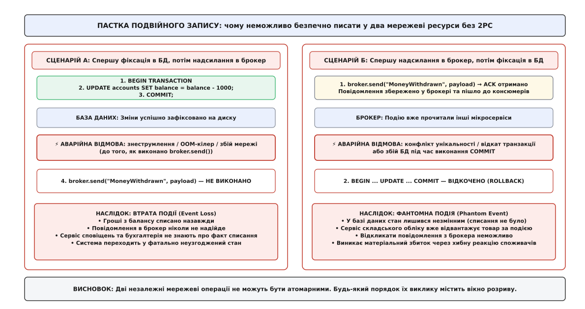
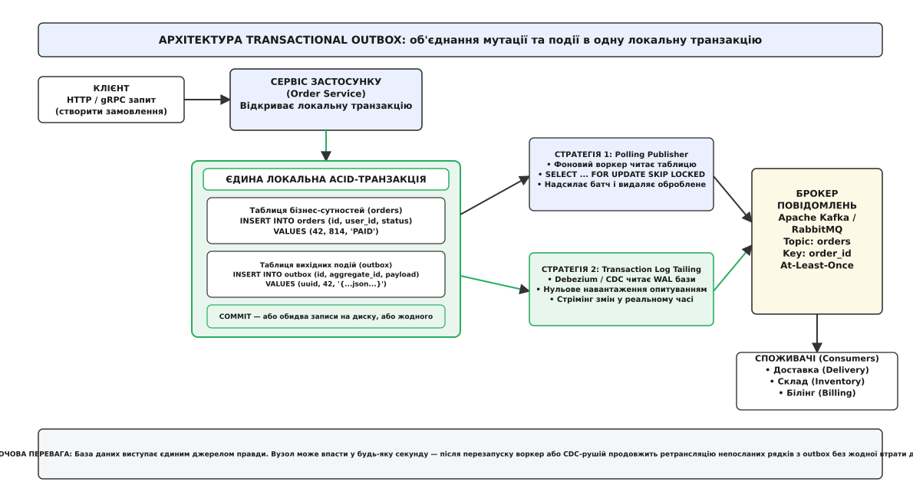
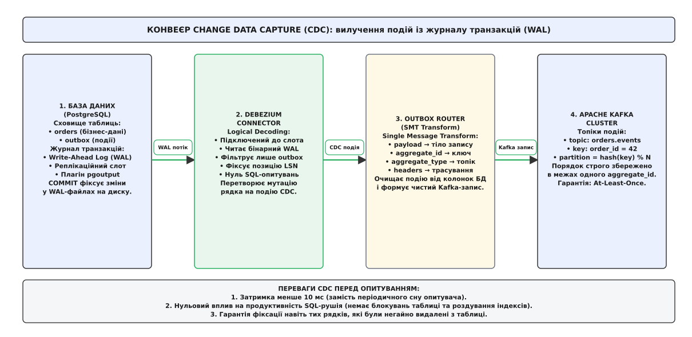
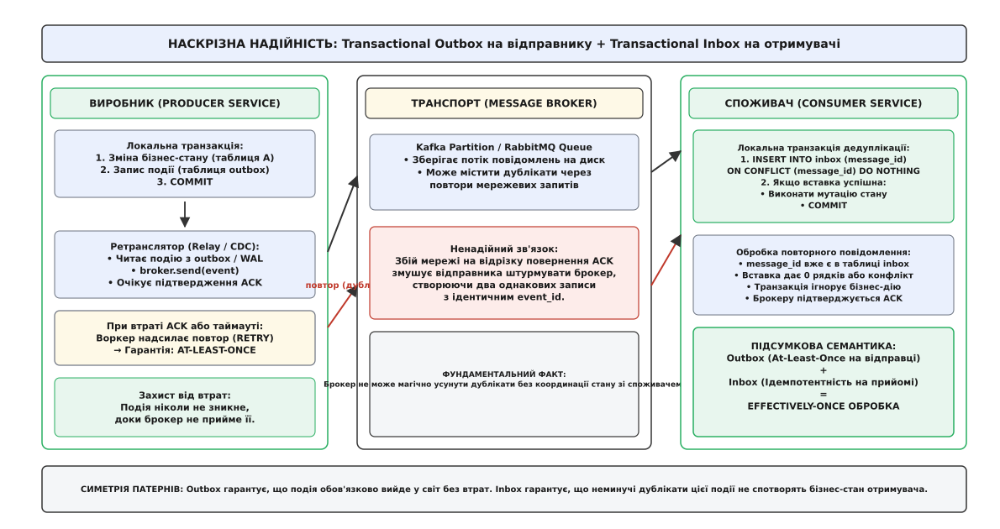

# Патерн вихідної скриньки (Transactional Outbox)

<preknowlist>
- [Омани розподілених обчислень](book:programming/distributed-fallacies) — чому мережа ненадійна, пакети губляться і виникають часткові відмови.
- [Гарантії доставки](book:programming/delivery-guarantees) — семантика at-most-once, at-least-once та чому прикладний рівень спирається на effectively-once.
- [Ідемпотентність](book:programming/idempotency) — властивість операцій залишати стан системи незмінним при повторному виконанні запитів.
- [Журнал подій](book:programming/event-log) — впорядкована послідовність незмінних записів у системах масштабування потоків даних.
</preknowlist>

Сервіс електронної комерції обробляє замовлення на придбання сервера вартістю 120 000 гривень. Процес застосунку відкриває з'єднання з базою даних PostgreSQL, створює новий рядок у таблиці `orders` зі статусом `PAID` і фіксує локальну транзакцію командою `COMMIT`. Наступним рядком коду сервіс викликає бібліотеку брокера Apache Kafka, щоб опублікувати доменну подію `OrderPaid` для систем складського обліку, білінгу та кур'єрської доставки. У проміжку між завершенням фіксації транзакції на диску СКБД та відправкою першого TCP-пакета в мережевий сокет брокера операційна система примусово завершує процес застосунку через вичерпання ліміту пам'яті (*Out-Of-Memory Killer*). База даних зберегла факт оплати замовлення, але брокер повідомлень нічого не отримав. Склад не пакує обладнання, доставка не планує маршрут, а покупець очікує на відправку, яка ніколи не відбудеться.

Спроба змінити порядок викликів — спершу надіслати повідомлення у брокер, а потім зафіксувати транзакцію в базі даних — породжує дзеркальну і ще небезпечнішу аварійну ситуацію. Якщо брокер успішно приймає пакет і повертає підтвердження, а наступна команда `COMMIT` у базі даних завершується відкатом (*ROLLBACK*) через конфлікт унікальності або обрив з'єднання, у розподіленій системі виникає **фантомна подія** (*Phantom Event*). Брокер уже розіслав подію `OrderPaid` підписникам: склад списує реальний сервер із залишків, а платіжна система формує податкову накладну для замовлення, якого юридично і фізично не існує в первинній базі даних.

Ця фундаментальна інженерна дилема має назву **пастка подвійного запису** (*Dual-Write Hazard*): неможливо атомарно зберегти стан у локальній базі даних і надіслати повідомлення у віддалений мережевий брокер без використання спеціального координаційного протоколу. **Патерн вихідної скриньки** (*Transactional Outbox Pattern*) розв'язує цю проблему без важких і блокуючих розподілених транзакцій: він переносить факт відправки повідомлення всередину самої локальної транзакції бази даних, гарантуючи нерозривність бізнес-мутації та майбутньої публікації події.



*Крах узгодженості при спробі одночасного запису у два мережеві ресурси без єдиного координатора. У першому випадку подія губиться назавжди, у другому — брокер поширює неіснуючу мутацію.*

## Чому розподілені транзакції (2PC/XA) зазнали краху

Природною реакцією інженера на проблему подвійного запису є спроба використати протокол двофазної фіксації (*Two-Phase Commit, 2PC*) за стандартом X/Open XA. У такій схемі зовнішній координатор транзакцій пов'язує базу даних і чергу повідомлень в єдину розподілену транзакцію, опитуючи обидва ресурси на фазі підготовки (`Prepare`) і фіксуючи зміни на фазі виконання (`Commit`).

Проте в сучасних мікросервісних та хмарних архітектурах протокол 2PC принципово не застосовується через три непереборні вади:

1. **Блокуюча природа та ризик каскадного простою:**
   Якщо координатор транзакцій падає або втрачає зв'язок після того, як база даних відповіла згодою на фазі `Prepare`, СКБД зобов'язана утримувати ексклюзивні блокування рядків до відновлення координатора. Інші транзакції, що намагаються звернутися до цих записів, вишиковуються в чергу очікування, пул з'єднань бази вичерпується за лічені секунди, і вся система зазнає повного колапсу.

2. **Катастрофічне зростання латентності:**
   Кожна транзакція 2PC вимагає щонайменше двох послідовних мережевих раунд-трипів (*Round-Trip Time, RTT*) між координатором і кожним учасником із примусовим скиданням журналу на диск (*fsync*). Якщо локальна транзакція PostgreSQL виконується за 2–5 мс, розподілена транзакція XA збільшує час утримання блокувань до 50–200 мс, скорочуючи загальну пропускну здатність вузла в десятки разів.

3. **Відсутність підтримки в сучасній інфраструктурі:**
   Високопродуктивні брокери повідомлень та платформи потокової обробки (Apache Kafka, RabbitMQ, AWS SQS, NATS) свідомо не реалізують інтерфейс XA. Їхня архітектура оптимізована для послідовного додавання даних у журнал із колосальною швидкістю, що несумісно з механізмом розподілених блокувань і двофазного узгодження.

Детальний аналіз того, як корпоративна індустрія перейшла від блокуючих транзакцій XA 1990-х років до асинхронного обміну повідомленнями, викладено в [історичному нарисі появи патерну](book:programming/outbox-pattern/hist-outbox-origins.md).

## Анатомія патерну: перенесення межі атомарності

Назва патерну походить від англійського слова *outbox* (вихідна скринька для паперової кореспонденції, куди службовець складає готові листи перед тим, як кур'єр забере їх для відправки адресатам).

Фундаментальний принцип Transactional Outbox полягає у відмові від спроби створити глобальну атомарність між різнорідними системами. Натомість межа атомарності звужується до єдиного надійного джерела правди — локальної ACID-транзакції реляційної або документної бази даних самого сервісу.



*Локальна ACID-транзакція гарантує нерозривність бізнес-зміни та запису події в таблицю outbox. Ретрансляція у брокер відбувається асинхронно через опитувач або CDC-рушій.*

### Механізм роботи складається з двох ізольованих фаз:

1. **Транзакційне збереження (In-Transaction Capture):**
   Коли застосунок виконує бізнес-операцію (наприклад, списання коштів або створення замовлення), він не звертається до мережевого брокера. Замість цього застосунок формує доменну подію, серіалізує її у формат JSON або Protobuf і вставляє окремим рядком у спеціальну службову таблицю `outbox`, що розташована **в тій самій базі даних**. Операція модифікації бізнес-таблиць (`orders`) та операція `INSERT INTO outbox` виконуються всередині одного неподільного блоку `BEGIN ... COMMIT`.

2. **Асинхронна ретрансляція (Out-of-Transaction Relay):**
   Окремий незалежний фоновий процес (ретранслятор / publisher) зчитує зафіксовані події з таблиці `outbox`, публікує їх у цільові топіки або черги брокера повідомлень і після отримання надійного підтвердження (*ACK*) видаляє або позначає оброблені записи в базі даних.

Завдяки властивостям атомарності (*Atomicity*) та довговічності (*Durability*) локальної СКБД досягається абсолютна узгодженість:
* Якщо бізнес-транзакція зазнає невдачі і відкочується, запис у таблиці `outbox` також безслідно зникає. Фантомна подія не може виникнути в принципі.
* Якщо бізнес-транзакція успішно зафіксована, рядок події гарантовано записано на диск у журналі випереджального запису (*Write-Ahead Log, WAL*). Навіть якщо процес сервісу буде негайно знищено аварійною відмовою, після перезапуску ретранслятор знайде збережену подію і доставить її споживачам.

```sql
-- АТОМАРНА БІЗНЕС-ОПЕРАЦІЯ ТА ФІКСАЦІЯ ПОДІЇ
BEGIN;

-- 1. Мутація бізнес-стану
INSERT INTO orders (id, user_id, amount, status)
VALUES ('ord-98421', 8412, 120000.00, 'PAID');

-- 2. Запис події у вихідну скриньку (в тій самій транзакції)
INSERT INTO outbox (id, aggregate_type, aggregate_id, type, payload)
VALUES (
    'f47ac10b-58cc-4372-a567-0e02b2c3d479',
    'orders',
    'ord-98421',
    'OrderPaid',
    '{"orderId":"ord-98421","amount":120000.00,"currency":"UAH"}'::jsonb
);

-- 3. Атомарна фіксація на диску
COMMIT;
```

> 🔧 **Навіщо це.** Transactional Outbox усуває необхідність у складних компенсаційних транзакціях на боці відправника. Тобі більше не потрібно думати, що робити, якщо брокер відхилив з'єднання посеред бізнес-дії: запис у базу єдиний, і якщо він пройшов, доставка повідомлення стає суто технічним обов'язком фонового рушія.

## Стратегії ретрансляції: Опитування проти вилучення змін (CDC)

Головне інженерне розгалуження при впровадженні патерну Outbox полягає у способі вилучення зафіксованих подій із бази даних та їх передачі у брокер. Існує два принципово різних підходи: періодичне опитування таблиці SQL-запитами та потокове вилучення змін із бінарного журналу транзакцій.

### 1. Періодичне опитування (Polling Publisher)

При реалізації методом опитування фоновий потік застосунку або окремий демон із фіксованим інтервалом (наприклад, кожні 200–500 мс) виконує SQL-запит до таблиці `outbox`, вибирає накопичені події, відправляє їх у брокер і видаляє підтверджені рядки.

Критичною проблемою цього підходу в багатопотоковому або кластерному середовищі є конкуренція між кількома екземплярами воркерів. Якщо два процеси одночасно виконають звичайний `SELECT`, вони виберуть однакові події і створять масу дублікатів у брокері.

Для запобігання гонкам використовується конструкція **`FOR UPDATE SKIP LOCKED`**:

```sql
-- БЕЗПЕЧНА КОНКУРЕНТНА ВИБІРКА ПАЧКИ ПОДІЙ
BEGIN;

SELECT id, aggregate_type, aggregate_id, payload
FROM outbox
ORDER BY created_at ASC
LIMIT 50
FOR UPDATE SKIP LOCKED;

-- [Воркер надсилає вибрані 50 подій у брокер Kafka і чекає ACK]

DELETE FROM outbox 
WHERE id = ANY(ARRAY['f47ac10b-58cc-4372-a567-0e02b2c3d479'::uuid, ...]);

COMMIT;
```

Директива `SKIP LOCKED` змушує рушій PostgreSQL блокувати перші 50 вільних рядків, а рядки, які вже захоплені іншим паралельним воркером, миттєво пропускати без очікування.

Працюючий багатопотоковий рушій публікації з обробкою сигналів завершення та захистом від блокувань мовами C та C++ наведено у [проєктній вставці реалізації рушія вихідної скриньки](book:programming/outbox-pattern/proj-outbox-engine.md).

#### Обмеження методу опитування:
* **Дискове роздування (Table Bloat):** Постійні операції `INSERT` та наступні `DELETE` сотень тисяч рядків на добу створюють колосальну кількість мертвих кортежів у багатоверсійній моделі PostgreSQL (MVCC). Фоновий процес AutoVacuum починає споживати значну частину ресурсів дискового вводу-виводу для дефрагментації сторінок.
* **Латентність доставки:** Подія не може бути доставлена швидше, ніж інтервал таймера сну опитувача (зазвичай 200–1000 мс).
* **Навантаження на СКБД:** Навіть коли в системі немає нових подій, воркери продовжують бомбардувати базу даних циклічними опитуваннями, витрачаючи процесорний час на сканування індексів.

### 2. Вилучення змін із журналу транзакцій (Change Data Capture, CDC)

Сучасним промисловим стандартом реалізації Outbox є використання технології **Change Data Capture (CDC)**. Замість виконання SQL-запитів до таблиць спеціалізований процес (наприклад, Debezium, що працює на платформі Kafka Connect) підключається до низькорівневого механізму логічної реплікації СКБД і безпосередньо вичитує двійковий потік змін із журналу випереджального запису (*Write-Ahead Log, WAL* у PostgreSQL або *Binlog* у MySQL).



*Конвеєр Debezium читає бінарні записи WAL безпосередньо з диска або буфера пам'яті, усуваючи будь-яке SQL-навантаження опитування на табличний рушій бази даних.*

#### Як працює конвеєр CDC:
1. Застосунок виконує стандартний `INSERT INTO outbox` у межах своєї бізнес-транзакції.
2. Рушій PostgreSQL при фіксації транзакції записує мутацію рядка у WAL-файл.
3. Вбудований плагін логічного декодування `pgoutput` читає двійковий WAL і транслює зміну рядка через реплікаційний слот (*Replication Slot*).
4. Debezium Connector вихоплює цю подію з реплікаційного слота за частки мілісекунди.
5. Спеціалізований модуль трансформації **Outbox Event Router (SMT)** розбирає поля таблиці, витягує корисне навантаження `payload`, встановлює ключ повідомлення `aggregate_id`, додає службові заголовки `headers` і безпосередньо публікує чистий запис у топік Kafka, ім'я якого динамічно генерується на основі `aggregate_type`.

Повні специфікації реляційної DDL-схеми, JSON-маніфест конфігурації Debezium та параметри маршрутизатора SMT наведено у [довіднику конфігурації Debezium та контракту подій](book:programming/outbox-pattern/api-outbox-cdc-config.md).

Математичне виведення наскрізної затримки доставки, розрахунок стабільності черги подій та аналіз дискового посилення запису (*Write Amplification*) представлено у [математичному аналізі затримки та черги подій](book:programming/outbox-pattern/math-polling-vs-cdc-backlog.md).

## Низькорівнева механіка логічного декодування в PostgreSQL

Щоб зрозуміти, чому CDC перевершує звичайне опитування за надійністю та швидкістю, необхідно зазирнути всередину підсистеми реплікації реляційного ядра.

PostgreSQL підтримує два види реплікації: фізичну та логічну. Фізична реплікація передає сирі байти дискових сторінок (блоки по 8 КБ), вимагаючи повної байтової ідентичності сховища на стороні отримувача. Логічна реплікація, навпаки, розбирає двійкові WAL-записи і реконструює з них логічні зміни рядків: команду операції (`INSERT`, `UPDATE`, `DELETE`), назву схеми і таблиці, а також типізовані кортежі нових та старих значень стовпців.

### Життєвий цикл реплікаційного слота

Коли конектор Debezium реєструється в PostgreSQL, він створює **логічний реплікаційний слот** (*Logical Replication Slot*). Слот фіксує дві критичні позиції в журналі транзакцій:
* **`restart_lsn` (Log Sequence Number):** Мінімальна позиція у WAL, починаючи з якої збережені файли журналу потрібні для можливого відновлення процесу реплікації. PostgreSQL гарантує, що жоден WAL-сегмент із LSN, більшим за `restart_lsn`, не буде видалений або перезаписаний під час виконання операції `CHECKPOINT`.
* **`confirmed_flush_lsn`:** Позиція у WAL, яку Debezium уже прочитав, обробив, відправив у кластер Apache Kafka і отримав підтвердження запису від реплік брокера (*broker ACK*).

```
Журнал транзакцій WAL на диску:
[LSN 100] ──► [LSN 200] ──► [LSN 300] ──► [LSN 400] ──► [LSN 500 (Current)]
                 ▲                           ▲
                 │                           │
          restart_lsn               confirmed_flush_lsn
    (PostgreSQL не видаляє          (Debezium зафіксував у Kafka
     файли після LSN 200)            всі події до LSN 400)
```

Завдяки цьому механізму досягається абсолютна стійкість до збоїв інфраструктури:
* Якщо процес Kafka Connect раптово падає через нестачу пам'яті або перезавантаження контейнера, PostgreSQL продовжує утримувати WAL-файли на диску.
* Після відновлення Debezium звертається до слота, читає значення `confirmed_flush_lsn = 400` і відновлює вичитування подій точно з позиції LSN 401. Жодна транзакція не пропускається і не губиться.

### Режими ідентифікації реплік (Replica Identity)

Кожна таблиця в PostgreSQL має параметр `REPLICA IDENTITY`, який визначає, яка додаткова інформація про старий стан рядка записується у WAL під час модифікації чи видалення:
* `DEFAULT` (за замовчуванням): У WAL записуються старі значення лише колонок первинного ключа. Для патерну Outbox це оптимальний вибір, оскільки події вихідної скриньки є незмінними (*Immutable Append-Only*): застосунок виконує тільки `INSERT`, а старі версії відсутні.
* `FULL`: У WAL записується повний попередній образ усього рядка. Цей режим генерує надлишковий дисковий трафік і для таблиці `outbox` не потрібен.

## Гарантії черговості та партиціонування

У розподілених системах критично важливо гарантувати не лише факт доставки подій, а й збереження їхнього **причинно-наслідкового порядку** (*Causal Ordering*). Якщо споживач отримає подію `OrderCancelled` раніше, ніж подію `OrderCreated`, бізнес-логіка зламається.

У таких розподілених брокерах, як Apache Kafka, загальний порядок повідомлень підтримується тільки **в межах однієї партиції** топіка. Якщо топік розбитий на 16 партицій для паралельної обробки, повідомлення, надіслані в різні партиції, можуть вичитуватися консюмерами в довільному порядку.

Патерн Outbox вирішує проблему черговості через детерміноване призначення **ключа повідомлення** (*Message Key*):

```
Ключ повідомлення Kafka = aggregate_id (наприклад, "ord-98421")
Номер партиції топіка   = murmur2_hash(aggregate_id) % Total_Partitions
```

Оскільки всі події, що стосуються одного й того самого замовлення (`OrderCreated`, `OrderPaid`, `OrderShipped`), володіють однаковим значенням `aggregate_id`, брокер Kafka гарантовано записує їх в одну й ту саму партицію в суворому порядку їх фіксації в базі даних. Консюмер, закріплений за цією партицією, обробляє події суто послідовно.

```
Події замовлення ord-98421:
[OrderCreated] ──► [OrderPaid] ──► [OrderShipped]
       │                 │                │
       ▼                 ▼                ▼
   hash("ord-98421") % N = Партиція #3 Kafka (суворий FIFO порядок)
```

При цьому події різних агрегатів (наприклад, замовлення `ord-98421` та замовлення `ord-11054`) потрапляють у різні партиції і обробляються паралельно, забезпечуючи високу горизонтальну масштабованість системи.

### Гонки при багатопотоковому Polling проти CDC

Важливою перевагою CDC над опитуванням є захист від порушення черговості при конкурентній обробці:
* Якщо при використанні Polling два паралельні воркери захоплюють дві сусідні пачки подій одного агрегату, швидший воркер може надіслати другу подію в Kafka раніше, ніж перший воркер встигне надіслати першу через затримку мережевого сокета.
* При використанні CDC потік WAL є строго лінійним і монотонним за своєю фізичною структурою. Debezium транслює події одного реплікаційного слота строго в один потік, що повністю виключає можливість перестановки подій місцями.

## Симетрія надійності: At-Least-Once та патерн Inbox

Поширена омана серед розробників полягає в очікуванні, що впровадження Transactional Outbox забезпечує магічну доставку «строго один раз» (*Exactly-Once Delivery*). Це фізично неможливо в ненадійній мережі.

Transactional Outbox є генератором гарантії **доставки принаймні один раз** (*At-Least-Once Delivery*). Розглянемо сценарій виникнення неминучого дубліката:

1. Ретранслятор (воркер або Debezium) вичитує подію `id = 42` з бази даних і відправляє її по мережі в брокер Kafka.
2. Брокер успішно записує подію у партицію на диск і відправляє відправнику пакет підтвердження `ACK`.
3. У цю саму мілісекунду мережевий комутатор скидає з'єднання. Пакет `ACK` втрачається в мережі.
4. Ретранслятор зазнає таймауту очікування відповіді. Згідно з протоколом надійності, ретранслятор не знає, чи отримав брокер повідомлення, тому він зобов'язаний виконати повторну спробу (*retry*).
5. Ретранслятор знову надсилає подію `id = 42`. Брокер зберігає другий екземпляр того самого повідомлення.



*Transactional Outbox на стороні продюсера гарантує доставку принаймні один раз (At-Least-Once). Transactional Inbox на стороні консюмера виконує дедуплікацію, забезпечуючи підсумкову семантику Effectively-Once.*

Оскільки відправник не може запобігти дублюванню на рівні транспорту, надійність системи досягається через **архітектурну симетрію**:
* На стороні **відправника (Producer)** працює **Transactional Outbox**, який гарантує, що жодна подія не буде втрачена (`At-Least-Once`).
* На стороні **отримувача (Consumer)** працює **Transactional Inbox** або [ідемпотентний обробник](book:programming/idempotency), який гарантує, що дублікати будуть безпечно відсіяні.

### Механізм обробки вхідної скриньки (Inbox)

При отриманні повідомлення сервіс-споживач відкриває власну локальну транзакцію і виконує атомарну перевірку унікальності:

```sql
BEGIN;

-- 1. Спроба зареєструвати унікальний ідентифікатор вхідної події
INSERT INTO inbox (message_id, handler_name, received_at)
VALUES ('f47ac10b-58cc-4372-a567-0e02b2c3d479', 'PaymentProcessor', NOW())
ON CONFLICT (message_id) DO NOTHING;

-- 2. Якщо вставка повернула 0 змінених рядків (дублікат) — скасовуємо бізнес-дію
-- Якщо вставка успішна (1 рядок) — виконуємо мутацію бізнес-стану:
UPDATE inventory SET stock = stock - 1 WHERE sku = 'SRV-XEON-64G';

COMMIT;
```

Якщо транзакція завершилася успішно, споживач фіксує зміщення (*Commit Offset*) у брокері Kafka. Поєднання Outbox на видачі та Inbox на прийомі формує наскрізну семантику **ефективно однократної обробки** (*Effectively-Once Processing*).

Детальний розбір алгоритмів дедуплікації на стороні отримувача наведено у статті про [патерн дедуплікації на стороні споживача (Inbox)](book:programming/inbox-pattern).

## Еволюція схем даних та зворотна сумісність

У живій розподіленій системі структура корисного навантаження подій неминуче змінюється з плином часу: додаються нові обов'язкові поля, перейменовуються існуючі атрибути, змінюються типи числових значень.

Оскільки події у вихідній скриньці зберігаються у форматі JSON або бінарного буфера, застосування патерну Outbox вимагає суворого дотримання правил еволюції схем:

1. **Правило адитивності (Additive Changes):**
   При зміні структури дозволяється лише додавання нових необов'язкових полів. Видалення існуючих полів або зміна їхнього семантичного сенсу заборонені, оскільки старі консюмери зламаються при читанні нових подій, а нові консюмери не зможуть переграти старі події з архіву.

2. **Інтеграція зі Schema Registry:**
   Замість довільного сирого JSON у поле `payload` поміщають серіалізований Protobuf або Apache Avro двійковий блок, який містить магічний байт та 4-байтний ідентифікатор зареєстрованої схеми (*Schema ID*). Debezium передає цей масив байтів без змін, а консюмери завантажують схему відповідної версії зі спільного реєстру схем, гарантуючи сувору пряму та зворотну сумісність.

3. **Версіонування через тип події:**
   Якщо бізнес-структура зазнає кардинальної ломки, рекомендується випускати подію під новим ім'ям або версійним тегом (наприклад, `OrderPaid_v2`), залишаючи старий обробник для сумісності.

## Реалізація Outbox у NoSQL та документних базах даних

Хоча класичний патерн Outbox асоціюється з реляційними СКБД, він успішно застосовується і в документних базах даних (MongoDB, DynamoDB, Couchbase).

### 1. Документний Outbox у MongoDB
У MongoDB кожен документ замовлення може містити вкладений масив `outbox_events`:

```json
{
  "_id": "ord-98421",
  "userId": 8412,
  "status": "PAID",
  "outbox_events": [
    {
      "id": "f47ac10b-58cc-4372-a567-0e02b2c3d479",
      "type": "OrderPaid",
      "createdAt": "2026-08-20T12:00:00Z"
    }
  ]
}
```

Зміна статусу замовлення та додавання події в масив виконуються атомарно на рівні одного документа (*Single-Document Atomicity*). Замість опитування використовується технологія **MongoDB Change Streams**, яка слухає внутрішній журнал операцій (*Oplog*) і транслює нові події в Kafka в режимі реального часу.

### 2. Транзакції у DynamoDB та DynamoDB Streams
У хмарній базі даних Amazon DynamoDB застосовується виклик `TransactWriteItems`, який атомарно записує зміну бізнес-елемента в основну таблицю та створює запис у таблиці `OutboxTable`. Сервіс **DynamoDB Streams** вичитує журнал змін таблиці вихідної скриньки і передає події у функцію AWS Lambda або чергу Amazon SQS/EventBridge.

## Міграція з Polling на CDC без зупинки системи (Zero-Downtime Migration)

У процесі розвитку проєкту багато команд починають із простого опитування (`SKIP LOCKED`) і згодом стикаються з необхідністю переходу на Debezium CDC через зростання навантаження.

План безшовної міграції без зупинки обробки замовлень та без ризику втрати подій:

1. **Підготовка СКБД:** У `postgresql.conf` вмикається `wal_level = logical`, створюється реплікаційний слот `debezium_outbox_slot` та вибіркова публікація `CREATE PUBLICATION dbz_outbox_publication FOR TABLE public.outbox`.
2. **Тіньовий запуск (Shadow Mode):** Debezium запускається на тестовий топік Kafka `shop.events.shadow` для перевірки коректності читання WAL та просування LSN без впливу на основних споживачів.
3. **Момент перемикання (Cutover):**
   * Фоновий процес опитування Polling зупиняється (`kill -SIGTERM`).
   * Воркер дочікується завершення обробки поточної пачки подій і відключається від бази.
   * Конфігурація Debezium змінюється на основний робочий топік `shop.events.orders`.
4. **Нейтралізація можливих дублікатів:** Будь-які події, які могли бути надіслані воркером опитування перед зупинкою і одночасно потрапити у WAL Debezium, безпечно відсіюються на стороні споживачів завдяки обов'язковому патерну Inbox.

## Експлуатаційні пастки та крайові випадки у продакшені

Впровадження патерну Outbox кардинально змінює профіль навантаження на інфраструктуру зберігання даних. Досвід експлуатації виявляє кілька критичних пасток, які необхідно враховувати при проєктуванні.

### 1. Небезпека переповнення диска через реплікаційний слот (WAL Retention Hazard)

Коли Debezium підключається до PostgreSQL через реплікаційний слот, база даних бере на себе зобов'язання **не видаляти WAL-файли**, доки конектор не підтвердить їх вичитування (*confirmed_flush_lsn*).

Якщо сервіс Kafka Connect зазнає збою, буде зупинений на технічне обслуговування або втратить мережевий доступ до брокера Kafka, транзакції застосунку продовжуватимуть записуватися у WAL. Оскільки реплікаційний слот стоїть на місці, PostgreSQL накопичуватиме всі гігабайти нових WAL-файлів на системному диску. Якщо проблему не помітити вчасно, диск сервера переповниться до 100%, після чого PostgreSQL аварійно завершить роботу (*panic shutdown*) і заблокує будь-які операції запису.

**Захисні заходи:**
* Обов'язкове налаштування параметра `max_slot_wal_keep_size` (наприклад, `50GB`) у `postgresql.conf`. Якщо відставання слота перевищує цей ліміт, PostgreSQL примусово інвалідує слот і видаляє старі WAL-файли, рятуючи базу даних від аварійної зупинки ціною необхідності переініціалізації CDC.
* Моніторинг метрики `pg_replication_slots.pg_wal_lsn_diff` через Prometheus та алертинг при відставанні понад 5 ГБ.

### 2. Роздування таблиці (Table Bloat) при використанні Polling

У схемі з опитуванням швидкість запису та видалення рядків у таблиці `outbox` може досягати десятків тисяч операцій на секунду. Рушій PostgreSQL при виконанні `DELETE` фізично не витирає дані з диска, а лише встановлює мітку мертвого кортежу (*tombstone*).

Якщо фоновий демон AutoVacuum не встигає очищати сторінки, розмір таблиці на диску може роздутися з 10 МБ до 50 ГБ, а індекс за полем `created_at` перетворюється на розріджене дерево з колосальною глибиною. Кожен наступний запит опитування починає сканувати тисячі порожніх сторінок, викликаючи деградацію швидкодії всієї СКБД.

**Захисні заходи:**
* Налаштування агресивного режиму очищення для таблиці: `WITH (autovacuum_vacuum_scale_factor = 0.01, autovacuum_vacuum_threshold = 100)`.
* Застосування **секціонування таблиці за часом** (*Time-based Partitioning*): події пишуться в окремі секції (наприклад, щогодинні). Очищення застарілих подій виконується миттєвою командою `DROP TABLE outbox_2026_08_20_12`, яка звільняє простір на рівні файлової системи без навантаження на AutoVacuum.

### 3. Отруйні повідомлення (Poison Pills) у черзі CDC

Якщо застосунок випадково збереже в таблицю `outbox` рядок із корисним навантаженням, розмір якого перевищує максимальний ліміт брокера Kafka (`message.max.bytes`, зазвичай 1 МБ), Debezium не зможе відправити цей запис у топік.

Оскільки Debezium читає журнал WAL суворо послідовно, збій відправки однієї події блокує весь реплікаційний слот. Потік зупиняється, черга реплікації починає рости, а всі наступні валідні події системи зависають.

**Захисні заходи:**
* Налаштування конвеєра помилок у Kafka Connect (*Dead Letter Queue, DLQ*):
  ```json
  "errors.tolerance": "all",
  "errors.deadletterqueue.topic.name": "shop.outbox.dlq",
  "errors.deadletterqueue.context.headers.enable": "true"
  ```
* Додавання перевірки обмеження довжини корисного навантаження в DDL-схему таблиці: `CONSTRAINT check_payload_size CHECK (octet_length(payload::text) < 900000)`.

### 4. Довготривалі транзакції, що блокують просування LSN

Якщо сторонній аналітичний процес або фонова міграція даних відкриває транзакцію з рівнем ізоляції `REPEATABLE READ` і виконується протягом 40 хвилин, рушій PostgreSQL не може просувати горизонт очищення знімків (*Transaction Horizon*).

Це заважає плагіну `pgoutput` коректно звільняти ресурси логічного декодування, що призводить до зростання споживання оперативної пам'яті процесом бази даних та уповільнення генерації CDC-подій.

## Порівняльна матриця архітектурних рішень

| Критерій порівняння | Наївний подвійний запис (Dual-Write) | Polling Outbox (`SKIP LOCKED`) | CDC Outbox (Debezium + WAL) | Розподілені транзакції (2PC/XA) |
| :--- | :--- | :--- | :--- | :--- |
| **Гарантія узгодженості** | Відсутня (втрати або фантоми) | `At-Least-Once` (гарантована) | `At-Least-Once` (гарантована) | Атомарна узгодженість |
| **Латентність публікації** | 1–5 мс (миттєва) | 200–1000 мс (період опитування) | 5–15 мс (майже реальний час) | 50–200 мс (блокуюча) |
| **Навантаження на СКБД** | Мінімальне | Високе (роздування індексів, I/O) | Мінімальне (читання WAL з пам'яті) | Критичне (утримання блокувань) |
| **Складність інфраструктури** | Нульова | Низька (лише код воркера) | Середня (Kafka Connect, Debezium) | Висока (Transaction Manager) |
| **Збереження черговості** | Не гарантується | Складно (потрібна серіалізація) | Гарантовано (за `aggregate_id`) | Гарантовано |
| **Ризик аварійного простою** | Неузгодженість бізнес-даних | Деградація продуктивності через bloat | Переповнення диска WAL-файлами | Каскадне блокування пулу бази |

## Підсумковий синтез

Патерн Transactional Outbox — це фундаментальний архітектурний компроміс, який перетворює нерозв'язну проблему розподіленої узгодженості в надійну послідовність двох локальних дій.

Замість ілюзорної спроби одночасно скоординувати два незалежні мережеві вузли, розробник використовує локальну транзакцію як єдину точку фіксації правди. Публікація у зовнішній світ стає асинхронним наслідком цієї фіксації. Поєднуючи Transactional Outbox на стороні відправника з технологією Change Data Capture для мінімізації затримок та патерном Transactional Inbox на стороні отримувача для нейтралізації дублікатів, розподілена система досягає найвищого рівня надійності без жодної втрати продуктивності та масштабованості.
