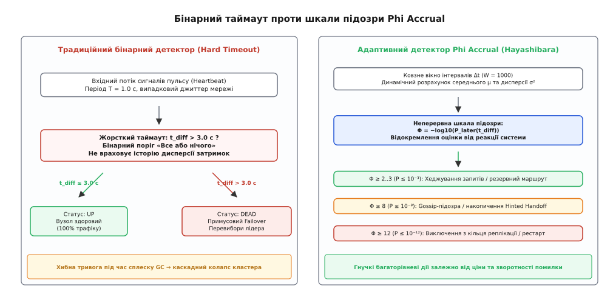
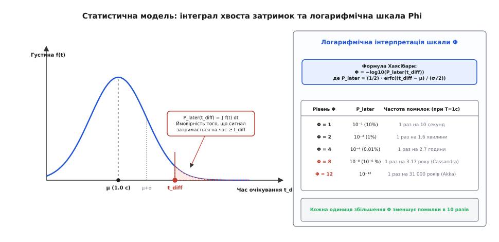
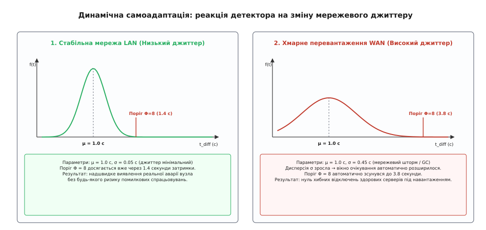
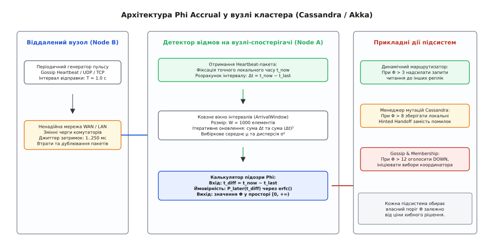

# Детектор відмов Phi Accrual: адаптивна ймовірнісна оцінка доступності вузлів

<preknowlist>
- [Омани розподілених обчислень](book:programming/distributed-fallacies) — мережа ненадійна, пакети губляться, а час передачі постійно коливається.
- [Таймаути й дедлайни](book:programming/timeouts-deadlines) — обмеження часу очікування та наслідки статичних часових рамок.
- [Gossip-протоколи](book:programming/gossip-protocols) — фоновий епідемічний обмін станом і сигналами пульсу між вузлами.
- [Хеджовані запити](book:programming/hedged-requests) — спекулятивне дублювання викликів для зрізання довгих хвостів затримок.
- [Вибори лідера](book:programming/leader-election) — узгодження координатора, яке залежить від точності детектора відмов.
</preknowlist>

О 03:14 під час нічного резервного копіювання у розподіленому кластері з 80 серверів під керуванням Apache Cassandra міжрегіональний магістральний канал зв'язку зазнає короткочасного сплеску навантаження. Через буферизацію пакетів у проміжних маршрутизаторах затримка передачі зростає з 18 до 350 мілісекунд, а окремі службові повідомлення затримуються на 2.4 секунди.

Кожен сервер у кластері контролює стан сусідів за допомогою традиційного бінарного детектора з жорстким таймаутом у 2.0 секунди: якщо контрольний сигнал пульсу (heartbeat) не надійшов за дві секунди, віддалений сервер автоматично позначається мертвим. Упродовж трьох секунд 28 абсолютно здорових вузлів одночасно визнаються аварійними.

Кластер охоплює паніка: активні вузли починають локально накопичувати сотні тисяч відкладених записів (Hinted Handoff) для «загиблих» сусідів, координатори виключають третину реплік із кілець консистентності й запускають фонові процедури відновлення даних. Сплеск дискового та мережевого навантаження перевантажує процесори вцілілих серверів, провокує тривалі паузи збирача сміття JVM (Garbage Collection) тривалістю по 2.5 секунди, через що вони також перестають вчасно відповідати на пульс. Система входить у некерований каскадний колапс: здоровий кластер паралізує сам себе через помилкову інтерпретацію звичайного джиттеру як фізичної загибелі серверів.

Ця катастрофа демонструє фатальну ваду класичного підходу: жорсткий бінарний таймаут намагається вкласти неперервну динаміку мережевих коливань у категоричну відповідь «живий або мертвий».

Щоб уникнути подібних криз, сучасні розподілені системи застосовують ймовірнісний підхід — **детектор відмов Phi Accrual (англ. *Phi Accrual Failure Detector*, від грецької літери Φ — позначення рівня підозри, та лат. *accrescere* — накопичувати, нарощувати)**, розроблений дослідницькою групою Наото Хаясібари у 2004 році.

## Пастка бінарного порогу: фундаментальний компроміс

У будь-якій асинхронній мережі діє теорема Фішера — Лінч — Патерсона (FLP): неможливо строго довести, що віддалений процес розбився і зупинився (аварія типу crash-stop), а не просто відчуває затримку виконання чи застряг у черзі мережевого інтерфейсу.

Класичні детектори відмов використовують бінарну модель зі статичним дедлайном `T`:

```
Статус = (t_now - t_last > T) ? DEAD : UP
```

Інженер, який обирає конфігурацію такого детектора, потрапляє у нерозв'язну дилему двох конфліктних метрик:
1. **Час виявлення аварії (`T_D` — Detection Time):** скільки секунд минає між реальною зупинкою сервера (аварійне вимкнення живлення, крах ядра ОС) та моментом, коли кластер перестає спрямовувати на нього запити.
2. **Частота помилкових спрацьовувань (`λ_M` — Mistake Rate):** як часто тимчасові затримки мережі викликають хибну підозру щодо здорового сервера.

Якщо встановити агресивний таймаут `T = 1.5` секунди, кластер блискавично реагує на реальні аварії (`T_D` мінімальний). Проте перший же хвилинний сплеск трафіку, повторна передача TCP-сегмента або пауза пам'яті викличуть лавину хибних спрацьовувань. Якщо ж встановити консервативний поріг `T = 30` секунд для захисту від помилок, кластер працюватиме стабільно, але в разі справжньої аварії клієнтські запити блокуватимуться на пів хвилини, вичерпуючи пули з'єднань і спричиняючи відмову сервісу.

Головний концептуальний дефект бінарного детектора полягає в тому, що він жорстко пов'язує **оцінку стану** з **дією системи** всередині одного неподільного механізму.


*Порівняння бінарного таймауту та накопичувального детектора Phi Accrual: жорсткий поріг провокує хибні тривоги, тоді як шкала підозри дозволяє гнучко диференціювати реакцію системи.*

## Принцип Accrual: відокремлення підозри від реакції

Архітектурний прорив Наото Хаясібари полягав у повному розділенні двох обов'язків:
* **Модуль детектора:** відповідає виключно на статистичне питання: *«Яка ймовірність того, що поточна затримка повідомлення є звичайним мережевим відхиленням, а не аварією?»*. Детектор повертає не булевий статус, а неперервне числове значення підозри `Φ ∈ [0, +∞)`.
* **Прикладні підсистеми:** самостійно інтерпретують значення `Φ` і приймають рішення про конкретні дії з огляду на ціну та зворотність кожного кроку.

Детальний опис еволюції цієї ідеї від абстрактних класів Чандри — Туега до реалізації в Cassandra наведено у вставці [Історія детектора відмов Phi Accrual](book:programming/phi-accrual-failure-detector/hist-accrual-detector-origin.md).

Завдяки неперервній шкалі система реалізує градуйовану, багаторівневу реакцію на погіршення доступності:

```
[Затримка t_diff зростає] ──> [Φ збільшується] ──> [Підсистеми виконують все більш жорсткі дії]
```

1. **Низька підозра (`Φ ≥ 2..3`, ймовірність запізнення `P ≤ 10⁻²..10⁻³`):** Затримка перевищила типові значення. Клієнтський маршрутизатор тимчасово перестає спрямовувати на цей вузол нові запити читання і надсилає хеджований запит (hedged request) на альтернативну репліку. Це повністю зворотна і дешева операція: якщо вузол відповість за 50 мс, маршрутизація відновиться без жодних наслідків для кластера.
2. **Помірна підозра (`Φ ≥ 8`, ймовірність `P ≤ 10⁻⁸`):** Вузол не виходить на зв'язок підозріло довго. Модуль реплікації тимчасово припиняє прямі спроби синхронного запису й переходить у режим накопичення локальних дельт (Hinted Handoff), запобігаючи накопиченню черг запитів.
3. **Висока підозра (`Φ ≥ 12..16`, ймовірність `P ≤ 10⁻¹²..10⁻¹⁶`):** Відсутність зв'язку практично напевно свідчить про фізичну аварію. Протокол членства виключає сервер із активного кільця кластера, ініціює вибори нового лідера та починає фонове виділення замінного вузла. Це дорога, незворотна операція, яка запускається лише за наявності абсолютних статистичних підстав.

## Статистичний двигун: як розраховується метрика Phi

Щоб оцінити правдоподібність затримки, детектор на вузлі-спостерігачі веде безперервний статистичний облік надходження повідомлень пульсу від кожного віддаленого сусіда.


*Статистична модель детектора: інтеграл від правого хвоста густини розподілу визначає ймовірність запізнення, яка логарифмічно відображається у значення підозри Phi.*

### 1. Ковзне вікно інтервалів прибуття

Детектор фіксує моменти прибуття контрольних сигналів `t₁, t₂, ...` і зберігає останні `W` часових інтервалів `Δt[i] = t[i] - t[i-1]` у кільцевому буфері (зазвичай `W = 1000`).

На основі вибірки динамічно обчислюються вибіркове середнє `μ` та вибіркова дисперсія `σ²`:

```
μ = (1 / W) · ∑_{i=1}^{W} Δt[i]
```

```
σ² = (1 / (W - 1)) · ∑_{i=1}^{W} (Δt[i] - μ)²
```

Стандартне відхилення `σ = √(σ²)` безпосередньо відображає поточний рівень джиттеру в мережі.

### 2. Ймовірність запізнення та інтеграл хвоста

Нехай `t_last` — мітка часу останнього отриманого пульсу від вузла, а `t_now` — поточний локальний час. Час очікування чергового сигналу дорівнює:

```
t_diff = t_now - t_last
```

Припускаючи, що інтервали між прибуттями підпорядковуються нормальному закону розподілу з густиною `f(t)`, ймовірність `P_later(t_diff)` того, що черговий сигнал затримається на час, не менший за `t_diff` (за умови, що сервер насправді живий), дорівнює інтегралу від правого хвоста розподілу:

```
P_later(t_diff) = ∫_{t_diff}^{∞} f(t) dt = (1 / 2) · erfc((t_diff - μ) / (σ · √2))
```

де `erfc(z)` — додаткова функція помилок Гауса (Complementary Error Function).

### 3. Логарифмічне шкалювання підозри

Метрика `Φ` визначається як від'ємний десятковий логарифм знайденої ймовірності:

```
Φ = -log₁₀(P_later(t_diff))
```

Строге математичне виведення інтеграла, асимптотичний розклад для великих затримок та перетворення логарифмів наведено у вставці [Математичне виведення метрики підозри та логарифмічна шкала Phi](book:programming/phi-accrual-failure-detector/math-phi-derivation-and-scale.md).

Фізичний зміст шкали надзвичайно прозорий: значення `Φ` вказує на кількість дев'яток у ймовірності того, що сигнал уже мав надійти:
* **`Φ = 1`:** ймовірність випадкової затримки становить `10⁻¹ = 0.1` (10%). Помилкова підозра виникає раз на 10 сигналів пульсу (кожні 10 секунд при щосекундному пульсі).
* **`Φ = 2`:** ймовірність `10⁻² = 0.01` (1%). Помилка виникає раз на 100 секунд (1.6 хвилини).
* **`Φ = 4`:** ймовірність `10⁻⁴ = 0.0001` (0.01%). Помилка виникає раз на 2.7 години.
* **`Φ = 8`:** ймовірність `10⁻⁸` (одна стомільйонна). Помилка виникає раз на 3.17 року. Це стандартний поріг за замовчуванням у Cassandra.
* **`Φ = 12`:** ймовірність `10⁻¹²`. Помилка виникає раз на 31 700 років безперервної роботи. Стандартний поріг у Akka Cluster.

Кожне збільшення порогу `Φ` на одиницю експоненційно зменшує частоту хибних спрацьовувань рівно в 10 разів.

## Динамічна самоадаптація до змін умов

Головна практична перевага детектора Phi Accrual перед будь-якими статичними таймаутами — його здатність автономно підлаштовуватися під коливання мережевого середовища без ручного втручання оператора.


*Автоматичне розширення та звуження часового вікна: при зростанні дисперсії затримок поріг спрацьовування автоматично відсувається, захищаючи систему від хибних відключень.*

Розгляньмо два протилежні сценарії функціонування кластера:

1. **Стабільна локальна мережа дата-центру (LAN):**
   * Період пульсу `μ = 1000` мс, стандартне відхилення затримок мінімальне: `σ = 50` мс.
   * Дзвін густини ймовірності вузький і крутий.
   * Поріг відключення `Φ = 8` досягається вже при затримці `t_diff = μ + 3.8σ ≈ 1190` мс.
   * **Результат:** кластер фіксує фізичну аварію сервера практично миттєво (всього за 1.2 секунди) і не чекає штучних 10-секундних таймаутів.

2. **Перевантажений міжрегіональний канал або фоновий GC (WAN):**
   * Через сплеск трафіку або плаваючі затримки віртуалізації джиттер різко зростає: `σ = 450` мс при тому самому `μ = 1000` мс.
   * Дзвін розподілу автоматично стає широким і пологим.
   * Поріг `Φ = 8` тепер досягається лише при затримці `t_diff ≈ 1000 + 3.8 × 450 = 2710` мс.
   * **Результат:** детектор автоматично розширив допустиме вікно очікування майже до 3 секунд, повністю нівелювавши ризик помилкового відключення здорових серверів. Щойно мережевий шторм стихає, дисперсія зменшується, і детектор автоматично повертається до надшвидкого режиму виявлення.

## Архітектура вузла та потік даних

У реальних промислових системах детектор відмов інтегрований у комунікаційний стек протоколу пліток (Gossip) або мережевого транспорту.


*Потік даних у вузлі кластера: надходження сигналів пульсу оновлює ковзне вікно затримок, а прикладні підсистеми незалежно зчитують метрику Phi для маршрутизації та кворумів.*

Коли віддалений вузол `Node B` надсилає контрольне повідомлення:
1. Мережевий потік вводу-виводу фіксує точний монотонний локальний час `t_now` і викликає метод `heartbeat()`.
2. Детектор обчислює `Δt = t_now - t_last`, додає його у ковзне вікно `ArrivalWindow` та інкрементально коригує внутрішні накопичувачі `sum` і `sum_sq` за час `O(1)`.
3. Коли робочий потік клієнтського запиту готується відправити дані на `Node B`, він запитує поточне значення `phi()`. Детектор бере різницю `t_diff = t_now - t_last` і за формулою Гауса повертає актуальний рівень підозри.

Повний програмний контракт інтерфейсу, вимоги до безпеки потоків та параметри конфігурації детально специфіковано у вставці [Специфікація інтерфейсу та конфігурація Phi Accrual детектора](book:programming/phi-accrual-failure-detector/api-phi-detector-contract.md).

## Підводні камені реалізації та виробничі пастки

Створення надійного детектора відмов вимагає врахування низки критичних нюансів обчислювальної математики та архітектури операційних систем.

### 1. Зникнення порядку при обчисленні додаткової функції помилок (Underflow)

Коли час очікування `t_diff` суттєво перевищує середнє значення (наприклад, `t_diff > μ + 6σ`), ймовірність `P_later` падає нижче машинного епсилон `10⁻¹⁶`. Стандартна бібліотечна функція `erfc(z)` повертає нуль (`0.0`). Спроба виконати операцію `-log10(0.0)` породжує значення `+Infinity`.

У промисловому коді для аргументів `z = (t_diff - μ) / (σ · √2) > 3` замість прямого обчислення `erfc` використовують асимптотичний розклад Лапласа:

```
Φ ≈ (z² + ln(z) + 0.57236) / ln(10) - log₁₀(2)
```

Це гарантує плавне, монотонне зростання підозри до значень `Φ = 20..50` без стрибків у нескінченність.

### 2. Пастка нульової дисперсії (Zero Variance Trap)

У середовищах модульного тестування або при передачі пульсу за таймером операційної системи високої точності інтервали між повідомленнями можуть бути абсолютно однаковими (`Δt = 1.000` с). Стандартне відхилення стає нульовим (`σ = 0.0`), що провокує фатальне ділення на нуль при спробі обчислити `z = (t_diff - μ) / σ`.

Для захисту алгоритм завжди затискає вибіркове відхилення знизу мінімальним гарантованим порогом:

```
σ_effective = max(σ_computed, min_std_dev)
```

Зазвичай `min_std_dev` обирають у діапазоні від `50` до `100` мілісекунд.

### 3. Проблема холодного старту (Bootstrap)

Під час запуску нового вузла в кластері його ковзне вікно порожнє. Перше контрольне повідомлення фіксує лише `t_last`, друге дає першу вибірку `Δt[1]`, але для розрахунку незсуненої дисперсії потрібно щонайменше 2 інтервали (тобто 3 повідомлення пульсу).

До накопичення статистичної бази (`N < 30`) детектор використовує синтетичні апріорні значення за замовчуванням: `μ = heartbeat_interval` (наприклад, 1.0 с) та `σ = min_std_dev` (0.1 с).

### 4. Пауза спостерігача (Observer GC Pause)

Якщо сам вузол-спостерігач зазнає блокуючої паузи збирача сміття або зависання процесора на 3 секунди, для нього локальний годинник зміститься вперед. Під час пробудження виявиться, що повідомлення від **усіх без винятку** вузлів кластера прострочені на 3 секунди. Вузол помилково оголосить увесь кластер мертвим.

Для захисту від цього ефекту сучасні реалізації (зокрема Akka) відстежують тривалість власних циклів диспетчера подій: якщо виявлено локальну системну паузу тривалістю `t_pause`, вона віднімається від `t_diff` перед обчисленням підозри для всіх контрольованих вузлів.

Практичну реалізацію алгоритму, яка повністю вирішує всі перелічені крайові випадки, наведено у вставці [Реалізація детектора відмов Phi Accrual](book:programming/phi-accrual-failure-detector/proj-phi-accrual-detector.md).

> 🔧 **Навіщо це.**
> 
> У реальній практиці побудови мікросервісів та хмарних баз даних вибір детектора відмов визначає межу стійкості всієї архітектури:
> * **Усунення штормів перевиборів:** Використання порогу `Φ = 8` у координаторах виключає ситуації, коли випадковий джиттер між AZ (Availability Zones) в AWS/GCP провокує безперервні перевибори лідера у Raft/Paxos-групах.
> * **Розумне хеджування викликів:** Замість очікування повного таймауту в gRPC/HTTP-клієнтах, мікросервіс опитує локальний детектор `phi(backend_ip)`: якщо `Φ > 2.5`, клієнт негайно надсилає дублюючий запит на інший екземпляр бекенду, скорочуючи хвіст затримок `p99` у 5–10 разів без перевантаження мережі.

## Порівняння родин детекторів відмов

| Характеристика | Фіксований бінарний таймаут | TCP Keepalive | Протокол SWIM (Ping-Req) | Детектор Phi Accrual |
| :--- | :--- | :--- | :--- | :--- |
| **Тип вихідного значення** | Бінарний (`UP / DOWN`) | Бінарний (розрив сокета) | Ступінчастий (`Alive / Suspect / Dead`) | Неперервний (`Φ ∈ [0, +∞)`) |
| **Адаптація до джиттеру** | Відсутня (статичний поріг) | Відсутня (фіксовані ліміти ядра) | Часткова (через фазу Suspect) | Повна динамічна (через ковзне вікно `μ` та `σ`) |
| **Диференціація реакцій** | Неможлива | Неможлива | Тільки базові переходи стану | Повна (будь-яка кількість порогів для підсистем) |
| **Стійкість до сплесків навантаження** | Низька (каскадні помилки) | Низька (таймаут стека TCP) | Середня | Максимальна |
| **Типові системи застосування** | Прості скрипти, HTTP-проби | Драйвери БД, балансувальники L4 | Consul, HashiCorp Memberlist | Apache Cassandra, Akka Cluster, Riak |

Ймовірнісна модель Phi Accrual трансформувала підхід індустрії до стійкості: замість марних спроб подолати невизначеність асинхронних мереж жорсткими заборонами, алгоритм перетворив невизначеність на точну математичну ймовірність, надійно захистивши кластери від самознищення.
