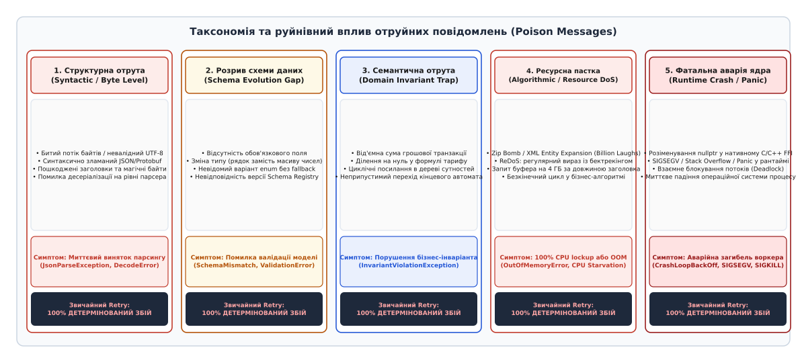
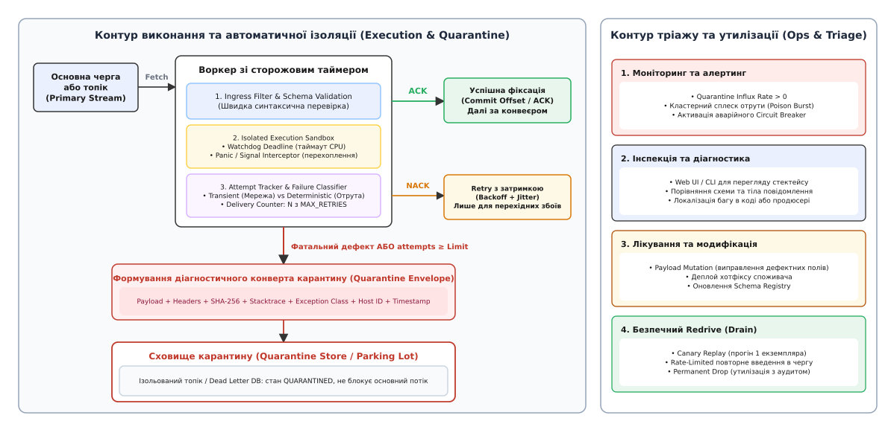
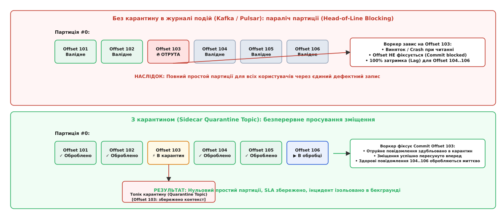

# Poison message та карантин: таксономія детермінованих збоїв, захист від паралічу черг, ізоляція в потоках та протокол тріажу

<preknowlist>
- [Черга повідомлень](topic:programming/message-queue) — асинхронний буфер між продюсером і споживачем для просторового й часового розв'язання.
- [Гарантії доставки](topic:programming/delivery-guarantees) — семантика at-least-once, механізми підтвердження (ACK/NACK) та неминучість повторної обробки.
- [Мертва черга](topic:programming/dead-letter-queue) — базовий буфер для накопичення повідомлень після вичерпання ліміту спроб.
- [Повтори](topic:programming/retries-backoff) — стратегії повторних спроб із експоненційним уповільненням та випадковим тремтінням.
- [Ідемпотентність](topic:programming/idempotency) — коректність багаторазового виконання операції без накопичення побічних ефектів.
- [Запобіжник](topic:programming/circuit-breaker-pattern) — розрив ланцюга викликів під час лавиноподібного зростання збоїв.
- [Журнал подій](topic:programming/event-log) — впорядкований незмінний лог із фіксацією послідовного зміщення (offset).
- [Реєстр схем](topic:programming/schema-registry) — централізований контроль сумісності форматів серіалізації (Protobuf, Avro, JSON Schema).
</preknowlist>

Розподілений конвеєр обробки платежів фінтех-платформи вичитує транзакції з черги з інтенсивністю 1200 операцій на секунду. Тридцять паралельних воркерів декодують повідомлення, перевіряють баланси в базі даних, звертаються до банківських шлюзів та фіксують результати. Середній час обробки одного запису становить 25 мілісекунд, затримка черги близька до нуля, а процесори вузлів завантажені на стабільні 45%.

О 10:14 надходить повідомлення, у якому поле коду валюти замість стандартного трибуквеного стандарту `USD` містить 2 мегабайти некоректно закодованих бінарних даних із вкладеним циклічним об'єктом.

Перший вільний воркер бере повідомлення в обробку. Модуль валідації намагається виконати регулярний вираз над дефектним рядком. Через катастрофічний бектрекінг (*Catastrophic Backtracking*) регулярного виразу потік воркера миттєво захоплює 100% одного ядра процесора і зависає. За 500 мілісекунд спрацьовує системний сторожовий таймаут, або процес падає з вичерпанням пам'яті (`OutOfMemoryError`). Брокер фіксує аварійний розрив з'єднання зі споживачем, вважає доставку непідтвердженою і негайно повертає повідомлення на початок черги.

За 2 мілісекунди це саме повідомлення захоплює другий воркер. Той зазнає такого самого фатального збою і знову скидає повідомлення брокеру. Протягом 1.5 секунди всі тридцять воркерів один за одним по черзі забирають це дефектне повідомлення, спалюють 100% ресурсів центрального процесора на вузлах, падають і перезапускаються оркестратором.

У цей час позаду зависають десятки тисяч цілком валідних платежів від звичайних клієнтів. Затримка обробки зростає від 25 мілісекунд до десятків хвилин, транзакції починають відхилятися за клієнтськими дедлайнами, а бізнес зазнає колосальних фінансових збитків.

Єдине дефектне повідомлення спричинило повний каскадний колапс розподіленого кластера.

Це явище отримало назву **отруйного повідомлення** (англ. *poison message*, або *poison pill* — від *poison* + *message*, метафора капсули з отрутою в шпигунстві та стратегіях корпоративного захисту). Це повідомлення, обробка якого детерміновано призводить до непереборного збою споживача (аварійної загибелі процесу, вичерпання пам'яті, зависання або порушення фундаментального інваріанта системи), роблячи будь-які стандартні повторні спроби обробки не просто марними, а руйнівними для всієї інфраструктури.

Для захисту від такого паралічу застосовують патерн **карантину** (англ. *Quarantine Pattern* / *Parking Lot Pattern*) — архітектурний комплекс ранньої детекції, негайної ізоляції токсичних даних у спеціалізоване захищене сховище без блокування основного потоку, збагачення запису повнотекстовим діагностичним контекстом та надання регламентованого інтерфейсу для інженерного тріажу і безпечного спуску.

Історія виникнення цієї концепції — від шпигунських ампул Другої світової війни та оборонних механізмів поглинання компаній на Волл-стріт до моделей паралельних акторів та черг повідомлень — детально описана у вставці: [походження терміна від шпигунських капсул та оборонних стратегій Волл-стріт до паралічу черг](topic:programming/poison-message/hist-poison-pill.md).

---

## Анатомія та класифікація отруйних повідомлень

Поширена інженерна помилка полягає у ставленні до всіх помилок у чергах як до однорідних мережевих збоїв. У розподілених системах усі помилки обробки діляться на дві діаметрально протилежні категорії: **перехідні** (*transient*) та **детерміновані** (*deterministic / poison*).

Перехідний збій виникає через тимчасові фактори зовнішнього середовища: короткочасну втрату TCP-пакета, сплеск блокувань у реляційній СКБД або перезавантаження репліки мікросервісу. Повторна спроба (*retry*) через 200 мілісекунд з експоненційним уповільненням вирішує проблему без зміни коду чи даних.

Детермінована отрута закодована в самому повідомленні або в невідповідності між повідомленням та логікою споживача. Скільки б мільйонів разів воркер не повторював виконання над тими самими вхідними байтами, результат буде математично ідентичним: аварія, відкат транзакції та повторний збій.


*Таксономія отруйних повідомлень: від структурних збоїв серіалізації до нескінченних циклів ReDoS та панік рантайму, для яких звичайні повторні спроби є деструктивними.*

За внутрішнім механізмом виникнення отруйні повідомлення поділяються на п'ять фундаментальних класів:

### 1. Структурні та синтаксичні отрути (Syntactic & Binary Corruption)
Повідомлення неможливо навіть розпарсити на рівні бінарного чи текстового протоколу:
- Обрізаний потік байтів через раптовий обрив сокета під час запису продюсером.
- Невалідні послідовності UTF-8 (наприклад, ізольовані сурогатні байти `0xD800–0xDFFF`).
- Синтаксично зламаний JSON (незакрита дужка, відсутня кома) або пошкоджений магічний заголовок Protobuf/Avro.
- *Наслідок:* парсер викидає фатальний виняток (`JsonParseException`, `DecodeError`) на нульовому етапі бізнес-логіки.

### 2. Розриви еволюції схем даних (Schema Evolution Drift)
Продюсер і споживач розійшлися у версіях контракту даних:
- Продюсер перейшов на версію схеми `v2` і додав обов'язкове поле або новий варіант переліку (`enum Status { NEW, PAID, REFUNDED, CHARGEBACK }`), а консюмер все ще працює на схемі `v1`, де значення `CHARGEBACK` викликає аварійне падіння конструктора десеріалізації.
- Зміна типу даних: продюсер надіслав масив рядків замість одного рядка, або число у вигляді рядка з плаваючою крапкою замість цілого числа.
- *Наслідок:* збій валідації схеми (`SchemaValidationException`), який неможливо вирішити без оновлення коду консюмера.

### 3. Семантичні пастки та порушення бізнес-інваріантів (Domain Invariants)
Синтаксично повідомлення бездоганне, але його зміст суперечить базовим законам предметної області:
- Спроба переказу від'ємної або нульової суми грошей, якщо ядро системи вимагає строго додатного значення.
- Замовлення з датою доставки в минулому столітті або посиланням на видалений обліковий запис користувача.
- Формула розрахунку ціни, яка для специфічної конфігурації знижок викликає ділення на нуль.
- Циклічні посилання в дереві категорій товарів, що провокують нескінченну рекурсію та `StackOverflowError`.

### 4. Алгоритмічні та ресурсні атаки (Algorithmic & Resource DoS)
Повідомлення спеціально або випадково сконструйоване так, щоб викликати вибухоподібне споживання ресурсів вузла:
- **Zip Bomb / XML Billion Laughs:** стиснений архів розміром 10 КБ, який під час розпакування в пам'ять розгортається у 100 ГБ, миттєво вбиваючи процес через вичерпання віртуальної пам'яті.
- **ReDoS (Regular Expression Denial of Service):** рядок довжиною в 50 символів, який під час зіставлення з неоптимальним регулярним виразом породжує експоненційну кількість кроків бектрекінгу (2⁵⁰ ≈ 10¹⁵ операцій), блокуючи потік процесора на години.
- **Алокаційні пастки:** заголовок повідомлення декларує довжину масиву в 2³¹ - 1 елементів, змушуючи консюмера виділити гігабайти пам'яті ще до читання корисного навантаження.

### 5. Фатальні аварії середовища виконання (Fatal Runtime Crashes & Panics)
Повідомлення активує приховану вразливість у системному коді:
- Розіменування нульового або висячого вказівника (`NullPointerException` у Java, `panic: runtime error` у Go, `SIGSEGV` у нативних бібліотеках C/C++ через FFI).
- Неперехоплений асинхронний виняток, який обходить стандартні блоки `try/catch` веб-фреймворку та знищує кореневий потік процесу.
- *Наслідок:* оркестратор (Kubernetes / systemd) фіксує падіння контейнера, переводить под у статус `CrashLoopBackOff`, і вся група споживачів деградує.

---

## Чому класичні повторні спроби перетворюються на катастрофу

Якщо в системі налаштовано стандартний механізм повторів (наприклад, 5 повторних спроб із затримкою) або безумовний негативний відгук (`NACK requeue=true`), поява детерміновано отруйного повідомлення викликає ланцюгову реакцію.

### 1. Блокування початку черги (Head-of-Line Blocking)
У чергах із підтримкою строгого порядку або в секціях (партиціях) розподілених логів повідомлення обробляються послідовно одне за одним.
Отруйне повідомлення зависає на першій позиції. Споживач не може підтвердити зміщення (Commit Offset) і перейти до наступного елемента. Позаду отрути утворюється затор із мільйонів валідних записів. Довжина черги зростає зі швидкістю повного вхідного трафіку.

### 2. Загибель пулу воркерів (CrashLoop Spiral)
Якщо в системі працює пул із `W` воркерів, одне отруйне повідомлення, повертаючись у чергу, по черзі вибиває всі `W` воркерів. Якщо час аварії або таймауту становить `T_p`, а час обробки валідного повідомлення `T_v`, то за `T_p ≫ T_v` частка отруйних повідомлень навіть на рівні 0.05% здатна захопити 100% робочого часу всіх воркерів кластера.

Формальне математичне виведення часу до повного паралічу пулу споживачів (`MTTE`), рівняння накопичення затору та розрахунок ймовірності блокування партицій наведено у вставці: [математична модель вичерпання пулу воркерів та динаміки блокування черги](topic:programming/poison-message/math-poison-cascade.md).

---

## Архітектура та контур карантину

Карантин відрізняється від класичної мертвої черги (DLQ) принциповою філософією:
- **Мертва черга (DLQ)** часто є пасивним буфером кінцевого скидання («морг» повідомлень), куди запис потрапляє після сліпого вичерпання лічильника спроб.
- **Контур карантину (Quarantine Architecture)** — це активна інтелектуальна підсистема захисту, яка поєднує сторожовий нагляд за виконанням, миттєву класифікацію типу збою, ізоляцію в паралельний потік, збереження повного діагностичного зліпка та надання інструментарію операційного тріажу.


*Архітектура конвеєра карантину: відокремлення перехідних збоїв від детермінованих отрут, збереження збагаченого конверта в сховищі карантину та покроковий контур інженерного тріажу.*

Конвеєр надійного карантину базується на п'яти послідовних етапах:

```
[Вхідний потік] ──> [Сторожовий супервізор (Watchdog Sandbox)]
                                  │
                 ┌────────────────┴────────────────┐
             [Успіх]                            [Збій]
                 │                                 │
          [Commit Offset]             [Класифікація помилки]
                                                   │
                         ┌─────────────────────────┴─────────────────────────┐
                 [Перехідний збій]                                   [Детермінована отрута]
                         │                                                   │
               [Retry Backoff Delay]                                 [МИТТЄВИЙ КАРАНТИН]
                         │                                                   │
                 [count < Limit]                                     [Формування конверта]
                         │                                                   │
                         ▼                                                   ▼
                [Повторна спроба]                                  [Сховище карантину]
                                                                             │
                                                                   [Commit Offset у черзі]
                                                                             │
                                                                   [Алерт інженерам / Тріаж]
```

### 1. Сторожовий супервізор виконання (Execution Supervisor)
Прямий виклик потенційно небезпечного коду в основному потоці воркера неприпустимий. Супервізор обгортає виклик бізнес-логіки в ізольований контекст:
- **Дедлайн виконання (Execution Deadline):** якщо обробка повідомлення триває довше встановленого ліміту (наприклад, 500 мс замість штатних 25 мс), сторожовий таймер примусово перериває виконання, запобігаючи зависанню воркера від атак на зразок ReDoS або нескінченних циклів.
- **Перехоплення панік та аварій (Panic / Signal Catcher):** будь-який неперехоплений виняток, розіменування нульового вказівника чи паніка рантайму перехоплюються на рівні супервізора. Процес воркера залишається живим, зберігаючи здатність обробляти наступні здорові повідомлення.

### 2. Диференціація збоїв: миттєвий карантин проти лічильника спроб
Система не повинна витрачати ресурси на повторення детермінованих збоїв:
- Якщо збій класифіковано як **детерміновану отруту** (помилка парсингу JSON, порушення контракту Protobuf, паніка рантайму, таймаут бектрекінгу) — повідомлення відправляється в карантин **негайно на спробі №1**. Повторювати його безглуздо.
- Якщо збій класифіковано як **перехідний** (мережевий таймаут до бази даних, HTTP 503 від стороннього шлюзу) — повідомлення надсилається в чергу повторів із затримкою. Лише якщо збій повториться `N` разів (наприклад, 3–5 спроб), воно переміщується в карантин із причиною `MAX_RETRIES_EXCEEDED`.

### 3. Збагачення діагностичного конверта (Quarantine Envelope)
Переміщувати в карантин сирі байти без контексту — означає приректи чергових інженерів на неможливість розслідування. Супервізор формує збагачений діагностичний конверт, що містить:
1. `QuarantineID` — унікальний ідентифікатор інциденту (UUID).
2. `OriginalMessageID`, `OriginalTopic`, `Partition`, `Offset` — точні координати походження.
3. `Payload` — вихідне незмінне тіло повідомлення (у бінарному або Base64 форматі).
4. `PayloadSHA256` — криптографічний відбиток для виявлення дублікатів та групування схожих атак.
5. `ExceptionClass` та `Stacktrace` — повний стек викликів у момент виникнення збою.
6. `HostIdentity` — назва контейнера/сервера, де стався збій, та версія розгорнутого коду.
7. `FailureCategory` — категорія дефекту (`SCHEMA_MISMATCH`, `INVARIANT_VIOLATION`, `RESOURCE_EXHAUSTION`, `RUNTIME_PANIC`).

### 4. Атомарна фіксація зміщення (Commit Offset)
Щоб звільнити чергу від отрути, воркер виконує критичну операцію:
1. Гарантовано зберігає сформований конверт у карантинному сховищі (у спеціалізованому топіку `orders.quarantine` або в базі даних інцидентів).
2. Після успішного збереження підтверджує отримання повідомлення в основному брокері (`ACK` або `Commit Offset`).

Основний потік розблоковано. Здорові замовлення, що стояли позаду, негайно починають оброблятися.

Повна специфікація транспортних заголовків, Protobuf/JSON схем конверта та протоколу керування інцидентами винесена у вставку: [специфікація діагностичного конверта карантину та протокол керування інцидентами](topic:programming/poison-message/api-quarantine-protocol.md).

---

## Ізоляція в потоках подій: подолання Head-of-Line у Kafka та Pulsar

У традиційних брокерах із вибірковим підтвердженням окремих повідомлень (RabbitMQ, AWS SQS) ізолювати повідомлення відносно просто: воркер надсилає окремий `ACK` на дефектний ID після запису в карантин.

У секціонованих розподілених логах (Apache Kafka, Apache Pulsar) концепція принципово інша: зміщення є монотонно зростаючим числом. Споживач не може підтвердити зміщення 104, не підтвердивши зміщення 103.


*Блокування початку черги в секціонованому журналі подій: без карантину єдиний дефектний запис паралізує всю партицію; з бічним топіком карантину зміщення фіксується, звільняючи шлях здоровому потоку.*

Для запобігання паралічу партицій у потокових логах застосовують три патерни:

### Патерн 1: Бічний топік карантину (Sidecar Quarantine Topic)
Під час виявлення отрути на зміщенні `Offset = X` споживач у межах однієї локальної транзакції:
1. Публікує конверт із тілом повідомлення та діагностикою в паралельний топік `topic-name.quarantine`.
2. Фіксує зміщення `X` у споживчій групі основної партиції.
3. Переходить до зміщення `X + 1`.

Партиція продовжує рух без жодної мілісекунди простою.

### Патерн 2: Ізоляція за скомпрометованим ключем (Tainted Key Pattern)
Якщо повідомлення в партиції впорядковані за ключем користувача (`user_id = 42`), а бізнес-логіка вимагає строгого порядку операцій для кожного окремого клієнта:
- Ми не можемо просто пропустити транзакцію користувача №42, оскільки наступні транзакції того самого користувача порушать фінансовий баланс.
- Проте ми не маємо права блокувати інших користувачів у цій самій партиції.
- *Рішення:* воркер позначає ключ `user_id = 42` як «скомпрометований» (*tainted*) у розподіленій пам'яті (Redis/In-Memory Cache) і записує дефектне повідомлення в карантинну таблицю. Усі наступні повідомлення для `user_id = 42` автоматично направляються в карантинний буфер користувача без спроби виконання. Усі інші користувачі (`user_id = 43, 44...`) у тій самій партиції продовжують оброблятися в штатному режимі.

### Патерн 3: Кластерний запобіжник (Poison Burst Circuit Breaker)
Що відбувається, якщо через фатальну помилку в релізі продюсера в чергу надходить не одне, а 50 000 отруйних повідомлень підряд?
Якщо воркер буде для кожного з них записувати конверт у карантин і фіксувати зміщення, система може мовчки «злити» весь вхідний бізнес-трафік у карантин за лічені секунди.

Для захисту від масового скидання консюмер обладнується ковзним лічильником частки помилок:
- Якщо частка отруйних повідомлень перевищує встановлений поріг (наприклад, > 15% за останні 30 секунд), спрацьовує [запобіжник](topic:programming/circuit-breaker-pattern).
- Консюмер призупиняє вичитування черги (`consumer.pause()`), генерує критичний алерт найвищого рівня (P0 Incident) та запобігає спустошенню черги до з'ясування причин інженерами.

---

## Життєвий цикл повідомлення в карантині та протокол лікування

Потрапляння повідомлення в карантинне сховище — це початок регламентованого процесу операційного відновлення.

```
       [QUARANTINED]
             │
      (Взяття в роботу)
             │
             ▼
      [UNDER_REVIEW]
             │
     ┌───────┴─────────────────────────┐
     │                                 │
(Виправлено код / схему)     (Ручна модифікація тіла)
     │                                 │
     ▼                                 ▼
[Ready to Replay]                  [MUTATED]
     │                                 │
     └───────────────┬─────────────────┘
                     │
         (Canary Replay: 1 екземпляр)
                     │
                     ▼
          [Controlled Bulk Redrive]
           (Rate Limiter / Backoff)
                     │
                     ▼
                 [RESOLVED]
```

### 1. Тріаж та інспекція (Triage Station)
Оператори використовують спеціалізований Web UI або CLI-утиліту для перегляду накопичених інцидентів. Інтерфейс групує повідомлення за криптографічним хешем `PayloadSHA256` та класом винятку, дозволяючи бачити, що одна й та сама помилка виникла на 200 різних повідомленнях.

### 2. Мутація корисного навантаження (Payload Mutation)
Якщо дефект полягає в одиничній друкарській помилці стороннього інтегратора (наприклад, замість коду країни `UA` передано рядок `UKR`, що не пройшов валідацію ISO), інженер може відредагувати JSON-тіло прямо в інтерфейсі тріажу.
Система зберігає оригінальне тіло для аудиту, фіксує виправлене тіло у полі `mutated_payload`, записує ідентифікатор оператора та переводить статус у `MUTATED`.

### 3. Канарейковий повтор (Canary Replay)
Перед тим як відправляти 5000 виправлених повідомлень назад у бойову чергу, оператор запускає канарейковий тест:
- Одне вибране повідомлення передається на тестовий запуск у пісочницю з поточною версією сервісу.
- Якщо обробка пройшла успішно без винятків — повідомлення маркується як придатне для безпечного спуску.

### 4. Дозований спуск із захистом від перевантаження (Safe Rate-Limited Redrive)
Коли дефект у коді виправлено і розгорнуто хотфікс, накопичені в карантині повідомлення потрібно повернути в основну чергу.
Прямий скид 50 000 повідомлень одномоментно створить вторинну хвилю цунамі (*Thundering Herd*), яка перевантажить базу даних.

Спуск карантину здійснюється через обмежувач швидкості (*Rate Limiter* / *Token Bucket*):

```
λ_drain ≤ W · μ_v · (1 - ρ_0) · (1 - SafetyMargin)
```

де швидкість повернення повідомлень жорстко обмежується вільним запасом продуктивності downstream-сервісів (наприклад, не більше 50 повідомлень на секунду), забезпечуючи плавне спорожнення карантину паралельно з обробкою штатного потоку.

Повноцінна промислова реалізація супервізора, сховища карантину, сторожового таймера та служби безпечного спуску мовами C++ та Go наведена у вставці: [повноцінна реалізація конвеєра карантину з перехопленням аварій та безпечним redrive](topic:programming/poison-message/proj-quarantine-pipeline.md).

---

## Превентивні бар'єри на межі системи

Ізоляція в карантин — це рятувальний круг останньої надії. Проте надійна інженерна архітектура будується на принципі мінімізації потрапляння отрути в брокер повідомлень ще на етапі вхідного шлюзу (Ingress Gateway).

```
[Клієнт / Продюсер] ──> [Вхідний шлюз (API Gateway)]
                               │
               ┌───────────────┴───────────────┐
       [Суворий розмір]                [Реєстр схем (Schema Registry)]
       (Content-Length limit)          (Перевірка сумісності)
               │                               │
               └───────────────┬───────────────┘
                               │
                [Безпечна десеріалізація]
                (Вимкнення поліморфних гаджетів)
                               │
                               ▼
                    [Публікація в брокер]
```

### 1. Сувора перевірка на боці продюсера через Schema Registry
Кожне повідомлення перед публікацією в чергу валідується проти централізованого [реєстру схем](topic:programming/schema-registry) (Confluent Schema Registry / AWS Glue Schema Registry). Якщо продюсер намагається надіслати структуру, несумісну з актуальними правилами зворотної сумісності (*Backward / Full Transitive Compatibility*), клієнтська бібліотека продюсера відхиляє запис ще до відправки в мережу.

### 2. Жорсткі ліміти розміру та тайм-бюджети
Шлюзи зобов'язані відсікати аномальні пакети:
- Ліміт максимального розміру корисного навантаження (`max.request.size = 1MB`). Будь-який запит більшого розміру відхиляється на рівні L7-проксі без передачі брокеру.
- Обмеження глибини вкладеності JSON/XML (наприклад, не більше 32 рівнів вкладеності об'єктів для запобігання переповненню стека під час парсингу).

### 3. Безпечна десеріалізація (Defensive Deserialization)
Категорично заборонено використовувати небезпечні механізми динамічної типізації при читанні зовнішніх черг:
- Повна заборона нативної серіалізації Java (`ObjectInputStream`) та Python `pickle`, які дозволяють зловмисникам виконувати довільний код через ланцюжки гаджетів (*gadget chains*).
- Вимкнення поліморфної десеріалізації за замовчуванням у бібліотеках на зразок Jackson (`enableDefaultTyping` має бути суворо вимкнено).

> 🔧 **Навіщо це в реальній розробці:**
> У будь-якій системі масштабу підприємства дефектні повідомлення виникають неминуче: через помилки релізів, розсинхронізацію схем мобільних додатків, апаратні збої пам'яті або зловмисні дії. Відсутність карантинного контуру перетворює локальний дефект єдиного байта на глобальну аварію всієї платформи. Впровадження автоматичного карантину ізолює дефект за 5 мілісекунд, забезпечує безперервний рух 99.99% здорового бізнес-трафіку і надає інженерам детальний діагностичний контекст для спокійного виправлення проблеми без нічних авралів.
