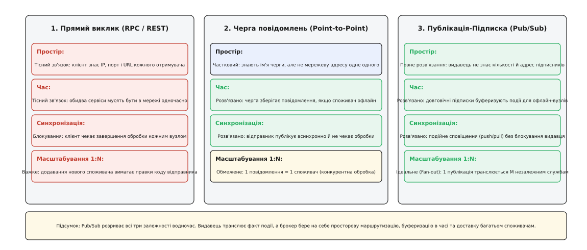
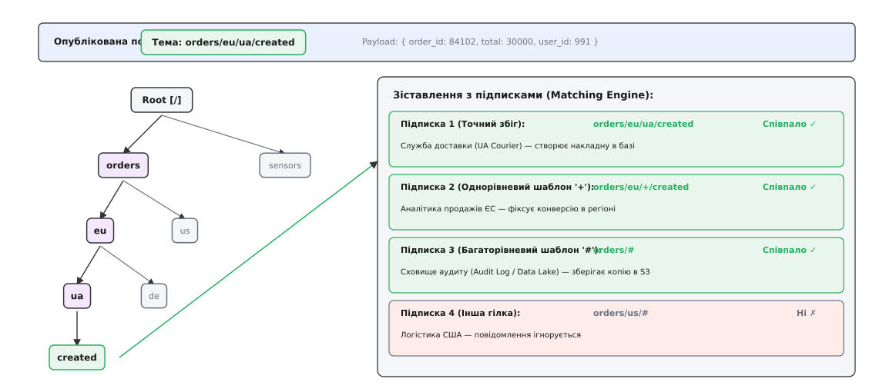
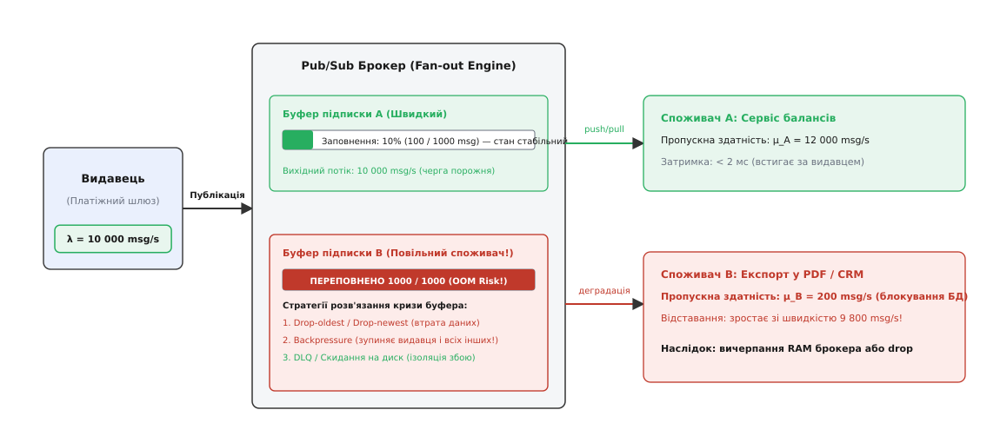
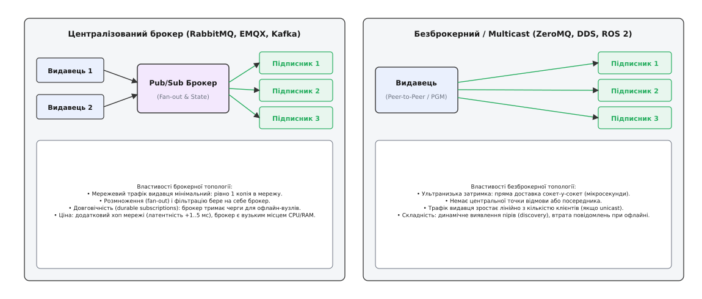

# Шаблон «Публікація-Підписка»: розрив просторової, часової та синхронізаційної зв'язності

<preknowlist>
- [Омани розподілених обчислень](topic:programming/distributed-fallacies) — мережа ненадійна, затримка ненульова, а топологія динамічно змінюється; збої є штатним станом.
- [Черга повідомлень (point-to-point)](topic:programming/message-queue) — передача завдання від одного відправника одному конкретному обробнику (1:1).
- [Гарантії доставки](topic:programming/delivery-guarantees) — семантики at-most-once, at-least-once та механізми підтверджень через ненадійний канал.
- [Ідемпотентність](topic:programming/idempotency) — здатність споживача коректно обробляти повторні дублікати повідомлень без спотворення стану.
</preknowlist>

Коли покупець оформлює замовлення в інтернет-магазині, сервіс замовлень (*Order Service*) повинен повідомити про це інші частини системи: списати гроші через платіжний шлюз, зарезервувати товар на складі, надіслати SMS-сповіщення клієнту, оновити баланс у програмі лояльності, відправити подію у відділ боротьби з шахрайством (*Fraud Detection*) і записати метрику в аналітичне сховище. Якщо архітектор реалізує цю взаємодію через прямі HTTP- чи RPC-виклики, сервіс замовлень змушений послідовно або паралельно виконати шість мережевих запитів. Якщо сервіс аналітики затримує відповідь на дві секунди або сервіс лояльності зазнає аварії, вся транзакція створення замовлення зависає або завершується помилкою для покупця. Коли через місяць маркетинговий відділ додає сьомий сервіс — систему персональних рекомендацій, — інженерам доводиться переписувати код сервісу замовлень, додавати нові конфігурації адрес, збільшувати таймаути й повторно тестувати критичний бізнес-шлях.

Ця криза зв'язності виникає через те, що прямий виклик процедур жорстко пов'язує вузли в трьох незалежних вимірах: у просторі (відправник знає адреси всіх шести отримувачів), у часі (усі сім сервісів мусять працювати одночасно) та за синхронізацією (відправник блокує свої потоки в очікуванні відповідей).

Шаблон **«Публікація-Підписка»** (англ. *Publish-Subscribe* або *Pub/Sub*, від лат. *publicare* — оголошувати всенародно, та *subscribere* — ставити підпис унизу) розв'язує цю проблему, повністю розділяючи відправників (видавців) та отримувачів (підписників) через посередника або спільну шину повідомлень. Видавець просто реєструє факт: «Замовлення № 84102 створено» — і негайно повертається до обслуговування наступних клієнтів, не знаючи й не турбуючись про те, скільки служб, де саме і в який момент часу читатимуть цей факт.

## Три виміри декуплінгу: простір, час, синхронізація

Щоб зрозуміти, чому Pub/Sub є фундаментальним будівельним блоком розподілених систем, необхідно розглянути класичну модель трьох вимірів розв'язання зв'язності (англ. *decoupling dimensions*).


*Публікація-підписка повністю розриває просторову, часову та синхронізаційну залежності. Видавець транслює факт події, а транспортний рівень бере на себе тиражування та доставку багатьом споживачам.*

### 1. Розв'язання в просторі (Space Decoupling)

У традиційній клієнт-серверній архітектурі або при прямому RPC відправник зобов'язаний володіти адресною інформацією одержувача: його доменним ім'ям, IP-адресою, TCP-портом або внутрішнім ідентифікатором черги. Будь-яка зміна IP-адреси чи міграція сервісу в інший сегмент хмари вимагає оновлення DNS, перезапуску балансувальників або переналаштування клієнтів.

У моделі Pub/Sub взаємодіючі сторони повністю анонімні:
- **Видавець (Publisher)** не знає IP-адрес підписників, не знає їхньої кількості (це може бути 0, 1 або 10 000 сервісів) і не знає, які саме бізнес-функції вони виконують. Видавець взаємодіє виключно з абстрактним іменуванням події.
- **Підписник (Subscriber)** не знає, який саме вузол або фізичний процес згенерував подію. Він лише декларує свій інтерес до певного класу подій (теми або предикатів фільтрації).

Це дозволяє динамічно змінювати топологію кластера: нові сервіси підключаються до системи, починають читати потік подій і відключаються без жодної зміни конфігурації чи перезапуску сервісів-видавців.

### 2. Розв'язання в часі (Time Decoupling)

При синхронному запиті обидва вузли повинні бути фізично доступні й підключені до мережі в один і той самий момент часу. Якщо сервіс формування рахунків перезавантажується після оновлення версії, прямий виклик до нього завершиться мережевою помилкою `Connection Refused` або перевищенням таймауту.

Pub/Sub розриває часову залежність:
- Видавець може опублікувати 10 000 подій і штатно завершити свою роботу.
- Підписник може бути вимкненим у момент публікації, запуститися через дві години, звернутися до брокера або постійного сховища, вичитати накопичені в темі дані з буфера й послідовно їх обробити.

Ця властивість робить систему надзвичайно стійкою до локальних аварій та хвиль перезавантажень: тимчасова зупинка одного підписника ніяк не зупиняє роботу видавців та інших споживачів.

### 3. Розв'язання за синхронізацією (Synchronization Decoupling)

У блокуючій моделі потік виконання видавця заморожується на час обробки запиту сервером. Навіть при використанні неблокуючого вводу-виводу (I/O) видавець змушений тримати в оперативній пам'яті дескриптори відкритих TCP-з'єднань, контексти очікування та структури зворотних викликів (*callbacks*). Якщо мережева затримка зростає, пул потоків видавця вичерпується, блокуючи прийом нових запитів від користувачів.

У Pub/Sub публікація події є операцією типу «вистрілив і забув» (*fire-and-forget*) або вимагає лише локального підтвердження від брокера про прийом пакета в буфер оперативної пам'яті:
- Видавець не чекає, доки підписники виконають складні розрахунки або збережуть дані на повільний диск.
- Підписники отримують сповіщення асинхронно через подієвий цикл (*event loop*) або самостійно витягують повідомлення з буфера у зручному для них темпі.

Історію того, як ця концепція еволюціонувала від біржових терміналів Волл-стріт і перших інформаційних шин Teknekron до сучасних протоколів MQTT та AMQP, детально викладено окремо: [еволюцію біржових шин і зародження стандарту](topic:programming/publish-subscribe/hist-pubsub-evolution.md).

## Моделі адресації та фільтрації: як подія знаходить підписника

Ключовим механізмом будь-якої Pub/Sub системи є логіка зіставлення (англ. *matching engine*), яка визначає, кому саме з зареєстрованих підписників необхідно доставити кожне конкретне повідомлення. В індустрії утвердилися три базові підходи до адресації.

```
Класифікація моделей адресації Pub/Sub:
┌─────────────────────────┬───────────────────────────────┬───────────────────────────────┐
│ Тематична (Topic-based) │ За вмістом (Content-based)    │ Типізована (Type-based)       │
├─────────────────────────┼───────────────────────────────┼───────────────────────────────┤
│ Повідомлення містить    │ Повідомлення містить довільні │ Повідомлення належить до      │
│ текстовий шлях-тему:    │ атрибути; підписник задає     │ строгого типу або схеми:      │
│ "orders/eu/ua/created"  │ предикат: "price > 1000 AND   │ OrderCreatedEvent (C++/Java), │
│ Фільтрація за префіксом │ region = 'UA'". Складна,      │ десеріалізація за класом      │
│ через швидке дерево Trie│ але гнучка фільтрація         │ у пам'яті (ROS, CORBA, DDS)   │
└─────────────────────────┴───────────────────────────────┴───────────────────────────────┘
```

### 1. Тематична адресація (Topic-Based Addressing)

Найпоширеніша модель, у якій кожне повідомлення публікується у виділений іменований логічний канал — **тему** (англ. *topic* або *subject*). Теми зазвичай організовуються у вигляді ієрархічного дерева з роздільником `/` (як в MQTT чи ROS) або `.` (як в AMQP чи NATS).

Наприклад, структура теми для системи датчиків розумного міста:
```
telemetry / europe / ukraine / kyiv / sensor-42 / temperature
```

Підписники можуть вказувати як точну назву теми, так і використовувати спеціальні символи-маски (англ. *wildcards*):
- **Однорівнева маска (`+` в MQTT, `*` в AMQP/NATS):** замінює рівно один сегмент ієрархії. Підписка `telemetry/europe/+/kyiv/+/temperature` отримуватиме дані з усіх датчиків температури Києва в усіх доступних країнах Європи.
- **Багаторівнева маска (`#` в MQTT, `>` в NATS, `#` в AMQP):** замінює довільну кількість сегментів до кінця дерева. Підписка `telemetry/europe/ukraine/#` перехоплює всі події, згенеровані будь-якими сенсорами на території України.


*Організація маршрутизатора на основі дерева префіксів (Trie). При надходженні події з темою `orders/eu/ua/created` алгоритм виконує обхід дерева за O(L), миттєво знаходячи всі відповідні підписки без перебору всього списку клієнтів.*

Всередині високопродуктивних брокерів пошук підписників реалізується через **префіксне дерево (Trie)**. Кожен вузол дерева представляє один токен теми, а листки містять списки вказівників на черги підписників. Це дозволяє знаходити адресатів за час `O(L)`, де `L` — кількість токенів у темі повідомлення, незалежно від того, чи зареєстровано в системі десять підписників, чи один мільйон.

Детальну реалізацію такого дерева префіксів із підтримкою однорівневих і багаторівневих масок мовами C++ та Go наведено у вставці: [потокобезпечну реалізацію брокера з деревом префіксів](topic:programming/publish-subscribe/proj-pubsub-broker.md).

### 2. Адресація за вмістом (Content-Based Addressing)

У моделі фільтрації за вмістом видавець не призначає повідомленню фіксовану тему. Замість цього повідомлення містить набір пар ключ-значення (атрибутів) або структуроване двійкове тіло (JSON, Protobuf), а підписник формує **булевий предикат фільтрації** (англ. *subscription predicate*).

Приклад предиката підписки:
```sql
(event_type = 'PaymentProcessed') AND (amount > 100000) AND (currency = 'UAH') AND (country = 'UA')
```

Брокер зобов'язаний розпарсити кожне вхідне повідомлення, витягнути з нього зазначені поля та обчислити булевий вираз для кожної зареєстрованої підписки.

**Архітектурний компроміс:**
Фільтрація за вмістом надає максимальну гнучкість, оскільки споживачам не потрібно створювати комбінаторний вибух підтем виду `payments/type/amount/currency/country`. Однак обчислювальна складність маршрутизації зростає експоненційно. Для оптимізації таких систем застосовують модифіковані алгоритми сітки правил (Rete-подібні дерева предикатів або інвертовані бітові індекси), але навіть з ними пропускна здатність content-based брокера зазвичай на один-два порядки нижча за швидкість topic-based маршрутизації.

### 3. Типізована адресація (Type-Based Addressing)

У типізованому Pub/Sub (характерному для об'єктних брокерів, систем стандарту OMG DDS, робототехнічного фреймворку ROS 2 та мов із сильною типізацією) канал прив'язується до конкретного класу або схеми даних (наприклад, IDL-структури чи Protobuf-повідомлення).

Підписник реєструє тип `GPSCoordinates`, і система автоматично гарантує перевірку сумісності схеми даних (*schema validation*) на етапі компіляції чи встановлення з'єднання, унеможливлюючи передачу пошкоджених або несумісних структур даних.

## Внутрішня механіка брокера: системні виклики та буфери ядра ОС

Щоб зрозуміти, де виникають затримки та втрати повідомлень у Pub/Sub, необхідно простежити шлях байтів від сокета видавця до сокета підписника на рівні операційної системи.

```
Шлях повідомлення крізь брокер:
[Видавець] ──TCP──> [Socket In Buffer (SO_RCVBUF)] ──> [epoll / io_uring]
                                                            │
                                                            ▼
                                                   [User-space Trie Match]
                                                            │
                                                            ▼
                                                   [Subscriber Ring Buffers]
                                                            │
                                                            ▼
[Підписник] <──TCP── [Socket Out Buffer (SO_SNDBUF)] <── [writev / sendfile]
```

Коли брокер отримує пакет від видавця:
1. **Мережевий адаптер** через механізм DMA скидає байти в кільцевий буфер драйвера (RX ring buffer), генеруючи апаратне переривання або обробляючись у режимі опитування (NAPI).
2. **Стек TCP/IP ядра** перевіряє контрольну суму, формує TCP ACK і поміщає корисні байти в системний буфер прийому сокета (`SO_RCVBUF`).
3. **Подієвий мультиплексор брокера** (`epoll` у Linux, `kqueue` у BSD/macOS або `io_uring`) сповіщає робочий потік брокера про готовність сокета до читання.
4. Робочий потік вичитує байти системним викликом `read()` або `recvmsg()` у простір користувача (*user-space*), де серіалізатор відновлює структуру повідомлення та виділяє тему.
5. **Механізм зіставлення** виконує пошук у префіксному дереві тем і формує список цільових підписників `Sub_1, Sub_2, ..., Sub_M`.
6. Для кожного підписника повідомлення поміщається в його персональний буфер черги (виділений кільцевий буфер у просторі користувача).
7. Потік відправки брокера викликає системний виклик `write()`, `writev()` або `sendmsg()`, копіюючи байти з черги підписника в системний буфер відправки сокета (`SO_SNDBUF`).
8. Мережевий стек ядра відправляє IP-пакети через мережеву карту підписнику.

Якщо мережа між брокером і підписником перевантажена, системний буфер `SO_SNDBUF` заповнюється до межі. У цей момент виклик `write()` у неблокуючому режимі повертає помилку `EAGAIN` / `EWOULDBLOCK`. Брокер змушений зупинити пряму відправку в сокет і накопичувати невідправлені байти у внутрішній черзі в оперативній пам'яті процесу. Якщо ця черга росте без обмежень, брокер зазнає аварійного завершення через вичерпання пам'яті (*Out-Of-Memory Killer*).

## Семантика довговічності підписок та життєвий цикл стану

За характером збереження сесійного стану підписки поділяються на два класи:

```
Життєвий цикл підписок:
┌────────────────────────────────────────┬────────────────────────────────────────┐
│ Недовговічна (Ephemeral / Non-durable) │ Довговічна (Durable Subscription)      │
├────────────────────────────────────────┼────────────────────────────────────────┤
│ • Існує лише під час активного TCP-    │ • Створюється з унікальним ClientID    │
│   з'єднання клієнта з брокером.        │ • Якщо клієнт офлайн, брокер           │
│ • При розриві зв'язку підписка         │   накопичує події в персональній черзі │
│   миттєво видаляється.                 │ • Після відновлення зв'язку підписник  │
│ • Всі пропущені події безповоротно     │   вичитує пропущені повідомлення       │
│   втрачаються.                         │ • Потребує моніторингу переповнення    │
│ • Ідеально для UI та живих графіків.   │ • Необхідно для фінансових транзакцій. │
└────────────────────────────────────────┴────────────────────────────────────────┘
```

Якщо довговічний підписник виходить із ладу або зазнає тривалої мережевої ізоляції, брокер продовжує зберігати кожну опубліковану подію в його персональній черзі. Це створює загрозу неконтрольованого накопичення даних на диску чи в оперативній пам'яті брокера, що веде до проблеми повільного споживача.

## Ущільнення тем і надгробні повідомлення (Topic Compaction & Tombstones)

Для довговічних тем із семантикою збереження стану (наприклад, актуальні ціни товарів або конфігурації пристроїв) нескінченне збереження всіх проміжних версій призводить до безконтрольного росту сховища.
В індустрії застосовують механізм **ущільнення тем (Topic Compaction)**:
- Брокер аналізує ключ кожного повідомлення (наприклад, `order_id` або `sensor_id`).
- Замість збереження всієї послідовності правок, фоновий процес очищення залишає лише **останнє відоме значення** для кожного унікального ключа, видаляючи всі застарілі проміжні стани.
- Якщо об'єкт було видалено в бізнес-домені, видавець публікує спеціальне **надгробне повідомлення (Tombstone Message)** із нульовою довжиною корисного навантаження (`payload == null` або довжина 0). Побачивши надгробок, брокер під час наступного циклу ущільнення видаляє ключ із постійного індексу сховища.

## Проблема повільного споживача (The Slow Consumer Problem)

Найнебезпечніший граничний випадок у шаблоні Pub/Sub виникає тоді, коли швидкість публікації повідомлень видавцем стабільно перевищує швидкість їх обробки одним із підписників.

Нехай видавець генерує потік з інтенсивністю `λ = 10 000` повідомлень/с. Підписник `A` (кеш у пам'яті) здатний приймати `μ_A = 15 000` msg/s і працює без затримок. Проте підписник `B` (сервіс генерації PDF-звітів, що робить важкі операції з диском) здатний обробляти лише `μ_B = 200` msg/s.

```
Різниця швидкостей у буфері підписника B:
Δ = λ - μ_B = 10000 - 200 = 9800 повідомлень за кожну секунду!
```


*Якщо брокер не ізолює буфери споживачів, повільний клієнт B спричинить вичерпання оперативної пам'яті всього сервера (OOM crash) або заблокує видавця, уповільнивши швидкого споживача A.*

Якщо брокер виділив для черги споживача `B` буфер місткістю `K = 50 000` повідомлень, він буде повністю заповнений лише за `50000 / 9800 ≈ 5.1` секунди. Щойно вільне місце вичерпано, брокер постає перед вибором однієї з трьох стратегій ізоляції:

### 1. Стратегії відкидання (Drop Policies)

Брокер продовжує приймати події від видавця, але починає примусово скидати повідомлення, призначені для повільного клієнта:
- **Tail Drop (Drop Newest):** нові повідомлення, які не вміщуються в буфер, просто ігноруються. Підписник отримує старі події, але втрачає найсвіжішу інформацію.
- **Drop Oldest (Head Drop):** брокер видаляє з початку черги найстаріше повідомлення, яке ще не встиг вичитати споживач, і записує на його місце найновіше. Підписник завжди бачить актуальний стан, але втрачає історію змін.

Ці стратегії допустимі для телеметрії або потокових котирувань акцій, де свіже значення важливіше за пропущені проміжні стани, але категорично неприпустимі для фінансових транзакцій чи обліку замовлень.

### 2. Зворотний тиск (Backpressure)

Якщо втрата даних заборонена бізнес-логікою, брокер блокує вичитування мережевого сокета від видавця або надсилає йому команду призупинення відправки (через механізми керування потоком TCP Window або кредитний протокол flow-control).

Зворотний тиск гарантує збереження даних, але породжує катастрофічний ефект доміно: **блокування початку черги (Head-of-Line Blocking)**. Через один завислий сервіс генерації PDF брокер змушений зупинити видавця, що автоматично позбавляє свіжих даних швидкий сервіс балансів `A` та всі інші компоненти системи.

### 3. Мертва черга (Dead-Letter Queue, DLQ) та витіснення на диск

Найстійкіший промисловий патерн: при перевищенні ліміту часу очікування повідомлення повільного підписника вилучаються з оперативної пам'яті й скидаються у вторинне сховище (на повільний диск або в спеціальну чергу недоставлених повідомлень DLQ). Це дозволяє системі не втрачати критичні дані та не блокувати швидких споживачів.

Строге математичне виведення швидкості накопичення черг, застосування закону Літтла та розрахунок точної ймовірності відкидання подій за моделлю `M/M/1/K` наведено у вставці: [математичну модель fan-out, динаміку буферів і розрахунок утрат](topic:programming/publish-subscribe/math-fanout-backpressure.md).

## Топології побудови: Централізований брокер проти Безброкерного зв'язку

За фізичною організацією передачі даних системи Pub/Sub діляться на два протилежні архітектурні класи.


*Вибір між брокерною та безброкерною топологією — це компроміс між простотою адміністрування, можливістю буферизації офлайн-вузлів та екстремальною продуктивністю на рівні заліза.*

### Централізована / Кластерна брокерна архітектура (Broker-Based)

Усі видавці й підписники встановлюють TCP-з'єднання з виділеним сервером або кластером брокерів (RabbitMQ, EMQX, HiveMQ, Google Cloud Pub/Sub).

**Переваги:**
- **Економія вихідного трафіку видавця:** видавець відправляє в мережу рівно одну копію повідомлення (`BW_in = λ · S`). Всю роботу з розмноження на `M` копій бере на себе сервер брокера.
- **Підтримка довговічності:** якщо всі підписники тимчасово офлайн, брокер надійно зберігає стан на диску або у виділеному кластерному журналі.
- **Єдина точка контролю безпеки:** автентифікація, авторизація через списки контролю доступу (ACL) та аудит налаштовуються централізовано.

**Недоліки:**
- **Додатковий мережевий хоп:** повідомлення проходить шлях `Видавець → Мережа → Брокер → Мережа → Підписник`, що додає від 0.5 до 5 мілісекунд затримки.
- **Вузьке місце масштабування:** процесор, пам'ять і мережева карта брокера обмежують загальну продуктивність кластера.

### Безброкерна / Однорангова архітектура (Brokerless / Peer-to-Peer / Multicast)

У безброкерній моделі (ZeroMQ, Cyclone DDS, RTI Connext, eBPF XDP) посередник відсутній. Бібліотека Pub/Sub вбудовується безпосередньо в процес програми:
- Видавець відкриває локальний порт або транслює повідомлення в мережевий сегмент через **UDP Multicast** чи спеціалізований протокол PGM (*Pragmatic General Multicast*).
- Підписники самостійно підключаються до IP-адрес видавців або перехоплюють мультикаст-групу комутатора.

**Переваги:**
- **Ультранизька затримка:** передача відбувається напряму між сокетами оперативної пам'яті за мікросекунди (sub-millisecond latency).
- **Відсутність центральної точки відмови:** падіння будь-якого вузла не впливає на зв'язок між іншими учасниками.

**Недоліки:**
- **Неможливість збереження для офлайн-клієнтів:** якщо підписник не був підключений у момент мультикаст-передачі, повідомлення втрачено назавжди.
- **Вибух трафіку при Unicast:** якщо мережеве обладнання не підтримує IP Multicast, видавець змушений сам надсилати `M` окремих TCP-пакетів, що перевантажує його процесор і мережеву карту.

Специфікацію протокольних кадрів, формати пакетів підтверджень та детальний аналіз стеків MQTT, AMQP і gRPC викладено у вставці: [протокольний контракт, кадри пакетів і рівні QoS](topic:programming/publish-subscribe/api-pubsub-protocol.md).

## Масштабування брокерних кластерів та федерація тем

Коли обсяг подій перевищує фізичні можливості одного сервера (наприклад, понад 1 000 000 одночасних підписників або понад 500 000 повідомлень за секунду), брокери об'єднують у кластери. В індустрії застосовують три стратегії кластеризації:

```
Стратегії масштабування брокерів:
┌──────────────────────────────────────┬──────────────────────────────────────┐
│ Повна реплікація маршрутів (Full)    │ Шардинг тем (Partitioned / DHT)      │
├──────────────────────────────────────┼──────────────────────────────────────┤
│ Кожен брокер знає всі підписки       │ Тема хешується на конкретний брокер: │
│ кластера. Видавець надсилає на будь- │ Node = Hash(Topic) % N               │
│ який вузол, брокери пересилають один │ Зменшує міжброкерний трафік,         │
│ одному через внутрішню сітку.        │ але ускладнює підписки з масками     │
│ Добре для малого кластера (3–10 шт). │ на кшталт "orders/#".                │
└──────────────────────────────────────┴──────────────────────────────────────┘
```

1. **Повна реплікація таблиць маршрутизації (Full Mesh Routing):**
   У таких системах, як RabbitMQ або EMQX, кожен вузол кластера реплікує глобальне дерево підписок через протоколи Mnesia або Raft. Якщо клієнт підключений до вузла `Node_1` і підписаний на `orders/ua`, а видавець публікує в `Node_3`, вузол `Node_3` знає про наявність віддаленого підписника і передає рівно одну копію повідомлення міжвузловим каналом на `Node_1`, який виконує локальну роздачу клієнту.
2. **Федерація та мости тем (Bridges & Federation):**
   Для географічно розподілених дата-центрів (наприклад, Франкфурт, Сінгапур, Орегон) повна реплікація неможлива через високу затримку трансатлантичних каналів. Замість цього налаштовують мости (*MQTT Bridges* / *AMQP Federation*): брокер у Сінгапурі підписується лише на агреговані теми європейського брокера (наприклад, `summary/orders/eu/#`), мінімізуючи міжконтинентальний трафік.

## Безпека, списки контролю доступу (ACL) та ізоляція клієнтів

Оскільки Pub/Sub надає спільну шину даних для всієї організації, критичною вимогою є контроль прав доступу до тем:
- **Ізоляція префіксів для мультиарендності (Multitenancy):** кожному клієнту або організації призначається унікальний простір імен: `tenants/{tenant_id}/...`. Брокер на рівні авторизації автоматично додає префікс орендаря до будь-якої операції публікації або підписки, що унеможливлює випадкове перехоплення чужих даних іншим клієнтом.
- **Матриця прав доступу (Topic ACLs):** правила визначають права читання (`READ`), запису (`WRITE`) або адміністрування на основі ролі користувача чи змісту сертифіката mTLS:
  ```
  Користувач "PaymentService":
    ALLOW WRITE "payments/+/completed"
    DENY  READ  "payments/#"
  Користувач "AnalyticsService":
    ALLOW READ  "payments/+/completed"
    DENY  WRITE "payments/#"
  ```
- **Наскрізне шифрування (End-to-End Encryption):** якщо брокер розміщено в ненадійній публічній хмарі, видавці шифрують корисне навантаження симетричним ключем групи підписників. Брокер бачить лише зашифрований масив байтів і тему в заголовку, що дозволяє виконувати маршрутизацію без доступу до конфіденційного вмісту повідомлень.

## Налаштування операційної системи та язики навантаження

Для досягнення високої пропускної здатності на рівні сотень тисяч TCP-сесій інженери зобов'язані оптимізувати параметри ядра Linux:
- **Збільшення ліміту файлових дескрипторів:** кожен TCP-сокет є файлом. Параметри `fs.file-max` та обмеження `ulimit -n 1048576` запобігають помилці `Too many open files`.
- **Розміри TCP-буферів:** налаштування `net.ipv4.tcp_rmem` та `net.ipv4.tcp_wmem` (наприклад, мінімум 4096, за замовчуванням 87380, максимум 16777216 байтів) запобігають передчасному переповненню буферів сокетів при сплесках трафіку.
- **Повторне використання портів:** прапорець `SO_REUSEPORT` дозволяє кільком робочим потокам брокера паралельно приймати з'єднання (`accept()`) на одному TCP-порті, усуваючи блокування ядра на вході.

## Крайові випадки та архітектурні пастки Pub/Sub

### 1. Парадокс атомарності багатоадресної доставки (Multi-Subscriber Atomicity)

У системі Pub/Sub доставка не є розподіленою транзакцією. Якщо на тему підписано 5 сервісів, брокер може успішно передати повідомлення чотирьом із них, а на п'ятому з'єднанні зафіксувати мережевий таймаут.
Брокер не може «відкотити» повідомлення назад із перших чотирьох сервісів, оскільки вони вже могли виконати незворотні дії (наприклад, відправити SMS клієнту). Єдиним рішенням є повторна доставка повідомлення п'ятому споживачеві, що вимагає обов'язкової **ідемпотентності** на стороні підписників для нейтралізації можливих дублікатів.

### 2. Ілюзія глобального порядку (Global Ordering Fallacy)

Початківці часто очікують, що всі підписники отримуватимуть події у строго однаковому хронологічному порядку.
На практиці в розподіленій системі з багатьма паралельними брокерами або мережевими маршрутами глобальний порядок повідомлень зберегти неможливо без критичного падіння продуктивності до швидкості одного потоку. Порядок гарантується виключно **в межах одного з'єднання видавця або в межах однієї теми/партиції**. Якщо сервіс A опублікував подію `X`, а сервіс B — подію `Y`, різні споживачі можуть отримати їх у комбінаціях `(X, Y)` або `(Y, X)`.

### 3. Стан гонитви при динамічній підписці (Subscription Race Condition)

Коли підписник відправляє брокеру пакет `SUBSCRIBE`, між моментом надсилання запиту і моментом внесення нового правила в дерево префіксів минає ненульовий час мережевої затримки. Будь-які події, опубліковані видавцями в цей мілісекундний проміжок, не потраплять новому споживачеві. Якщо клієнту критично важливо мати початковий зріз даних, застосовують механізм **збережених повідомлень (Retained Messages)**, коли брокер автоматично надсилає останнє відоме значення теми негайно після оформлення нової підписки.

### 4. Лавинне перевантаження при ребалансуванні підписок (Thundering Herd)

Коли оновлюється версія споживача, пул із сотень екземплярів сервісу одночасно надсилає запити на підписку. Брокер зазнає різкого спалаху навантаження на процесор через необхідність одночасного оновлення префіксного дерева та вичитування збережених повідомлень. Для запобігання цій деградації клієнти повинні застосовувати випадковий часовий джитер (*jitter*) при підключенні та плавне нарощування кількості підписок.

## Зведена таблиця: вибір моделі інтеграції

```
Порівняння чотирьох парадигм комунікації:
┌──────────────────────┬──────────────────────┬──────────────────────┬──────────────────────┬──────────────────────┐
│ Критерій             │ Прямий виклик (RPC)  │ Черга (Point-to-Point│ Pub/Sub (Теми)       │ Журнал подій (Log)   │
├──────────────────────┼──────────────────────┼──────────────────────┼──────────────────────┼──────────────────────┤
│ Модель взаємодії     │ 1:1 Запит-Відповідь  │ 1:1 Обробка завдання │ 1:N Трансляція подій │ 1:N Потік партицій   │
│ Зв'язок у просторі   │ Тісний (IP/Port/URL) │ Середній (ім'я черги)│ Повний розрив        │ Повний розрив        │
│ Зв'язок у часі       │ Одночасно в мережі   │ Асинхронний (буфер)  │ Асинхронний (буфер)  │ Довговічний (дні/роки│
│ Синхронізація        │ Блокування потоку    │ Неблокуюча відправка │ Неблокуюча відправка │ Неблокуюча відправка │
│ Видалення після читання│ Не застосовується  │ Видаляється з черги  │ Видаляється з буфера │ Зберігається в лозі  │
│ Довільне перемотування│ Неможливо           │ Неможливо            │ Неможливо (окрім Jet)│ Можливо (за offset)  │
│ Типові системи       │ gRPC, REST, Thrift   │ RabbitMQ Queue, SQS  │ MQTT, Cloud Pub/Sub  │ Apache Kafka, Pulsar │
└──────────────────────┴──────────────────────┴──────────────────────┴──────────────────────┴──────────────────────┘
```

> 🔧 **Навіщо це на практиці:**
> Використовуйте Pub/Sub, коли одну й ту саму подію повинні незалежно обробляти два або більше сервісів, і поява нових зацікавлених споживачів у майбутньому не повинна вимагати модифікації коду чи конфігурації відправника.
> Якщо ж вашу задачу можна сформулювати як «розподілити важкі завдання між пулом однакових воркерів, щоб кожне завдання виконав рівно один обробник», використовуйте класичну [чергу повідомлень point-to-point](topic:programming/message-queue) або патерн [конкурентних споживачів](topic:programming/competing-consumers). Якщо вам потрібна можливість довільного перемотування часу, повторного читання історії за минулий рік та гарантоване зберігання терабайтів подій у партиціях — обирайте [розподілений журнал подій](topic:programming/event-log).
