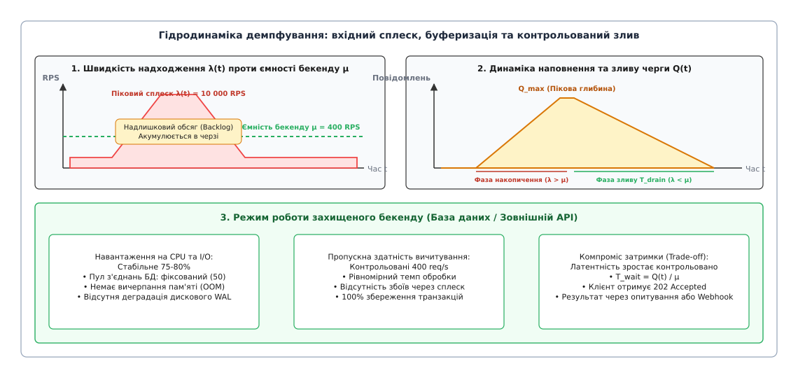
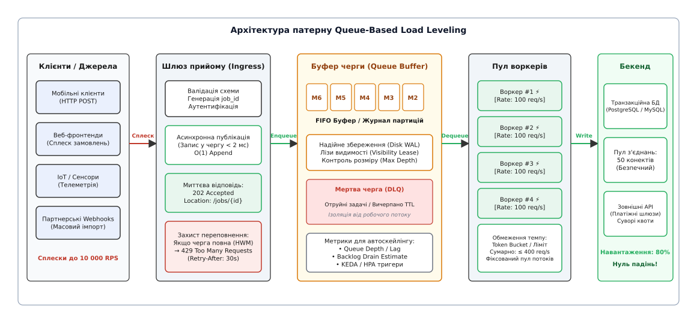
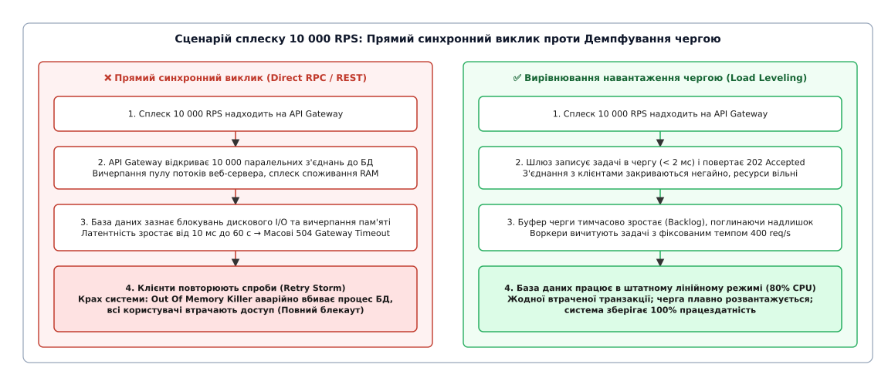
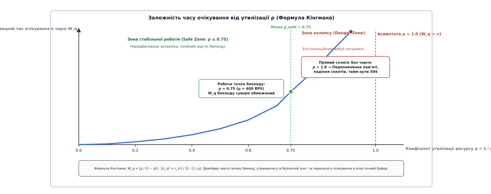

# Вирівнювання навантаження чергою: асинхронна амортизація сплесків трафіку, захист бекенду та керування латентністю

<preknowlist>
- [Черга повідомлень](topic:programming/message-queue) — асинхронний буфер між продюсером і консюмером, що розв'язує компоненти в часі та за доступністю.
- [Конкурентні споживачі](topic:programming/competing-consumers) — патерн паралельної обробки повідомлень із черги пулом незалежних воркерів.
- [Таймаути і бюджет часу](topic:programming/timeouts-deadlines) — механізми обмеження часу очікування відповіді в умовах ненадійних з'єднань.
- [Повторні спроби та експоненційне відтермінування](topic:programming/retries-backoff) — стратегії повторної відправки запитів для згладжування короткочасних мережевих збоїв.
- [Ізоляція відсіками](topic:programming/bulkhead-isolation) — розподіл ресурсів системи на ізольовані пули для запобігання каскадному краху.
- [Мертва черга](topic:programming/dead-letter-queue) — ізольований канал для утилізації повідомлень, які не вдалося обробити після граничної кількості спроб.
</preknowlist>

О десятій годині ранку популярний сервіс продажу квитків відкриває бронювання на фінальний матч чемпіонату. За перші три секунди на вхідні веб-сервери обрушується шквал із 12 000 HTTP-запитів на секунду. Кожен запит на бронювання вимагає створення замовлення, перевірки доступності місць, резервування слота та ініціалізації банківської транзакції. 

Основна реляційна база даних системи (кластер PostgreSQL) здатна виконувати не більше 400 важких транзакцій запису на секунду. Її пул з'єднань жорстко обмежений 50 клієнтськими сесіями, швидкістю скидання журналу випереджального запису на диск (*NVMe WAL fsync*) та конкуренцією за блокування рядків у таблиці квитків.

Якщо сервіс спробує обробити цей вхідний потік через прямі синхронні HTTP-виклики від веб-сервера до бази даних, система зазнає миттєвої катастрофи:
1. Веб-сервери відкривають 12 000 паралельних з'єднань, повністю вичерпуючи пул із 50 доступних сесій бази даних за 150 мілісекунд.
2. Решта 11 950 запитів стають у внутрішню чергу очікування сокетів операційної системи. Пул потоків веб-сервера блокується, споживання оперативної пам'яті стрімко зростає через виділення стеків для кожного завислого потоку.
3. Через 10 секунд спрацьовують таймаути мережевого шлюзу, і клієнти масово отримують помилки `504 Gateway Timeout`.
4. Мобільні додатки та браузери користувачів, запрограмовані на повторні спроби, автоматично надсилають нові запити, генеруючи шторм повторів (*Retry Storm*), що подвоює навантаження до 24 000 запитів на секунду.
5. Процес бази даних аварійно завершується через вичерпання пам'яті (*Out Of Memory Killer*) або деградацію дискового вводу-виводу, і сервіс повністю припиняє роботу.

Спроба розв'язати проблему шляхом масштабування бази даних до пікової ємності 12 000 транзакцій на секунду економічно абсурдна: такий сплеск триває лише 15 хвилин на місяць, а утримання надлишкового серверного кластера з 30-кратним запасом ресурсів коштуватиме сотні тисяч доларів на рік, простоюючи 99.9% часу.

Вихід із цієї дилеми полягає у зміні самої природи взаємодії між клієнтом і бекендом. Патерн **вирівнювання навантаження чергою** (англ. *Queue-Based Load Leveling*) вводить між швидким, але нестійким джерелом трафіку та обмеженим бекендом еластичний буфер-демпфер на основі черги повідомлень, який накопичує енергію пікового сплеску і дозволяє обробляти задачі з постійною, безпечною для системи швидкістю.

## Чому кешування не рятує операції запису

Поширеною помилкою інженерів-початківців є спроба захистити перевантажений бекенд шаром розподіленого кешу (Redis або Memcached). 

Кешування є ідеальним рішенням для асиметричного навантаження з переважанням операцій читання (*Read-Heavy Workloads*): якщо мільйон користувачів одночасно відкривають сторінку опису матчу, Redis повертає готовий JSON-документ з оперативної пам'яті за 200 мікросекунд, повністю знімаючи навантаження з реляційної СКБД.

Проте для операцій мутації стану системи (створення замовлення, списання коштів, зміна залишків товару на складі) кеш безсилий:
- Кожна транзакція запису вимагає суворого дотримання гарантій `ACID` (атомарність, узгодженість, ізольованість, довговічність).
- Запис не може бути «закешований» без ризику втрати даних у разі перезавантаження вузла пам'яті.
- Застосування патерну відкладеного запису (*Write-Behind Cache*) перетворює сам шар кешу на імпровізовану ненадійну чергу, позбавлену транзакційного журналу на диску, ліз видимості та протоколів підтвердження.
- Операція запису в реляційній СКБД неминуче впирається у фізичну межу: операційна система зобов'язана виконати системний виклик `fsync()`, зафіксувавши сторінку транзакційного журналу (*Write-Ahead Log*, WAL) на енергонезалежному накопичувачі NVMe.

Оскільки швидкість послідовного скидання блоків на диск фізично обмежена мікросекундними затримками контролера пам'яті, єдиним надійним способом зберегти стабільність системи під час сплеску записів є накопичення транзакцій в асинхронному буфері черги.

## Принцип дії: черга як гідродинамічний демпфер

Фізична інтуїція патерну подібна до роботи гідравлічного накопичувача або компенсаційного резервуара на греблі гідроелектростанції: коли гірська річка під час паводка несе тисячі кубометрів води на секунду, шлюзи електростанції не відкриваються на повну потужність (це зруйнувало б турбіни), а накопичують надлишок води у водосховищі, скидаючи її через турбіни з суворо контрольованим постійним темпом.

У розподілених системах швидкість надходження вхідних запитів позначається як `λ(t)` (інтенсивність вхідного потоку), а швидкість обробки бекендом — як `μ` (пропускна здатність пулу споживачів).


*Гідродинаміка демпфування: короткочасний сплеск трафіку λ(t) накопичується в буфері черги Q(t), поки захищений бекенд працює зі стабільною безпечною швидкістю μ, запобігаючи деградації ресурсів.*

У будь-який момент часу стан системи підпорядковується фундаментальному закону збереження обсягу:

```
dQ(t) / dt = λ(t) - μ(t)
```

1. **Фаза спокою (`λ < μ`):** вхідний потік становить, наприклад, 50 запитів на секунду при ємності воркерів 400. Черга порожня (`Q = 0`), задачі виконуються практично миттєво із затримкою в кілька мілісекунд.
2. **Фаза сплеску (`λ > μ`):** навантаження стрибає до 10 000 запитів на секунду. Воркери продовжують забирати рівно 400 задач на секунду. Різниця `λ - μ = 9600` задач щомиті осідає в черзі повідомлень. Розмір беклогу `Q(t)` лінійно зростає, досягаючи піку `Q_max` наприкінці сплеску.
3. **Фаза зливу беклогу (`T_drain`):** вхідний трафік спадає назад до 50 запитів на секунду. Воркери не сповільнюються, а продовжують вичитувати чергу з максимальною швидкістю 400 задач на секунду. Швидкість спорожнення черги становить `400 - 50 = 350` повідомлень на секунду. За кілька хвилин черга повністю обнуляється.

Головний архітектурний компроміс вирівнювання навантаження чергою полягає у **свідомому обміні миттєвого синхронного відгуку на 100% збереження транзакцій та стабільність системи**: замість аварійного падіння всієї платформи клієнтські задачі отримують контрольовану затримку виконання.

Математичне виведення балансу маси, розрахунок максимальної глибини черги, часу розвантаження та зв'язок зі стохастичною теорією черг наведено у вставці: [розрахунок динаміки наповнення черги, часу розвантаження та формули Кінгмана для чергових систем](topic:programming/queue-load-leveling/math-queuing-load-leveling.md).

## Анатомія системи: компоненти, взаємодії та життєвий цикл

Архітектура із демпфуванням навантаження складається з чотирьох чітко розмежованих компонентів, кожен із яких володіє власною зоною відповідальності та ресурсною моделлю.


*Архітектура демпфування: вхідний шлюз виконує швидку асинхронну публікацію в буфер черги і повертає статус 202 Accepted, а пул воркерів з лімітером темпу спокійно взаємодіє з базою даних.*

### 1. Шлюз швидкого прийому (Ingress API Gateway / Producer)

Шлюз прийому — це фронтальний сервіс (на базі Nginx, Envoy, Go або Node.js), який приймає вхідні HTTP/gRPC запити від зовнішніх клієнтів. Його завдання — максимально швидко зняти задачу з клієнтського з'єднання і звільнити мережевий сокет.

Шлюз **не виконує** важкої бізнес-логіки і **не звертається** до реляційної бази даних. Його робота зводиться до чотирьох кроків:
1. Базова валідація схеми корисного навантаження (JSON Schema / Protobuf).
2. Перевірка автентифікації та лімітів клієнта (*Rate Limiting* за API-ключем).
3. Генерація глобально унікального ідентифікатора задачі (`job_id` або `task_id`).
4. Запис серіалізованого повідомлення у брокер черг і негайне повернення клієнту статусу `HTTP 202 Accepted` з заголовком `Location: /api/v1/jobs/{job_id}`.

Оскільки операція додавання в кінець черги (*Queue Append*) у брокерах займає менше 1.5 мілісекунди, один екземпляр шлюзу здатен обробляти десятки тисяч запитів на секунду без блокування процесора та пам'яті.

### 2. Буфер черги повідомлень (Queue Buffer)

Черга повідомлень (RabbitMQ, Apache Kafka, AWS SQS, Redis Streams, Azure Service Bus) виступає сховищем беклогу. Вона ізолює шлюз від споживачів і гарантує збереження даних під час пікових навантажень.

Ключові вимоги до буфера демпфування:
- **Надійність збереження (*Durability*):** під час сплеску повідомлення повинні фіксуватися у журналі на диску (*Write-Ahead Log*), щоб у разі перезавантаження брокера жодне замовлення не зникло.
- **Керування лізами видимості (*Visibility Timeout / In-Flight Lease*):** коли воркер забирає задачу, вона тимчасово стає невидимою для інших воркерів на 30–60 секунд. Якщо воркер падає під час виконання, брокер повертає задачу в чергу для повторної спроби.
- **Підтримка мертвої черги (*Dead Letter Queue*, DLQ):** якщо окрема задача викликає помилку обробки більше встановленого ліміту спроб (наприклад, 3 рази), вона переміщується в DLQ, щоб не блокувати просування черги.

### 3. Пул споживачів із регулюванням темпу (Rate-Limited Worker Pool)

Воркери — це фонові процеси або контейнери, які вичитують повідомлення з черги та виконують реальну бізнес-транзакцію (запис у базу даних, накладання цифрового підпису, виклик платіжного шлюзу).

Головне правило пулу споживачів при демпфуванні: **темп вичитування задач з черги регулюється не швидкістю надходження нових повідомлень, а суворою пропускною здатністю захищеного ресурсу**.

Для цього воркери використовують алгоритми регулювання швидкості (*Token Bucket* або *Leaky Bucket*) та підтримують фіксований пул з'єднань із базою даних, унеможливлюючи її перевантаження.

### 4. Захищений бекенд (Protected Downstream Resource)

База даних PostgreSQL/MySQL, мікросервіс нарахування балів або сторонній банківський API функціонують у штатному лінійному режимі: їхня утилізація CPU утримується на рівні 75–80%, транзакції не конкурують за блокування пам'яті, а дискова підсистема працює без деградації затримки.

Історія того, як індустрія відмовилася від монолітних пакетних інтервалів і як компанія Amazon зробила чергу повідомлень першим хмарним сервісом AWS, детально описана у вставці: [як відмова від синхронного RPC у білінгових системах привела до появи буферизації чергами](topic:programming/queue-load-leveling/hist-queue-load-leveling.md).

## Прямий виклик проти демпфування чергою: анатомія відмови

Щоб наочно продемонструвати різницю між синхронною моделлю та демпфуванням навантаження, розглянемо поведінку системи за однакових умов сплеску 10 000 запитів на секунду.


*Порівняння поведінки: прямий синхронний виклик призводить до вичерпання пулу потоків, шторму повторних спроб і падіння бази даних. Демпфування чергою перетворює перевантаження на контрольований час очікування.*

```
Сценарій прямого синхронного виклику (Каскадний крах):
Клієнт ──(10k RPS HTTP)──> API Gateway ──(10k TCP Conn)──> База Даних (Макс 400 RPS)
                                │                                │
                                ├─ Пул потоків вичерпано         ├─ Пул з'єднань вичерпано (50/50)
                                ├─ Споживання RAM: 100%          ├─ Блокування дисків WAL
                                └─ 504 Gateway Timeout           └─ OOM Killer: SIGKILL (Крах)

Сценарій демпфування чергою (Стабільність і збереження даних):
Клієнт ──(10k RPS HTTP)──> API Gateway ──(Enqueue <2ms)──> Черга повідомлень (Backlog)
   │                             │                                    │
   │ <──(202 Accepted + JobID)───┘                                    │ (Вичитування: 400 RPS)
   │                                                                  ▼
   └────(Опитування / Webhook) <── Пул воркерів ──(50 з'єднань)──> База Даних (CPU 80%)
```

При прямому виклику ресурсний колапс настає в трьох точках:
- **Мережевий шар операційної системи:** черга незавершених з'єднань сокета (*TCP Listen Backlog*) переповнюється, ядро починає відкидати `SYN`-пакети або надсилати `RST`-пакети, руйнуючи з'єднання клієнтів.
- **Пул потоків веб-сервера:** створення тисяч операційних потоків (*OS Threads*) під кожен клієнтський запит призводить до деградації планувальника ядра через надмірне перемикання контексту (*context switching overhead*).
- **Транзакційний рівень СКБД:** тисячі конкурентних транзакцій змагаються за спільні сторінки буферного пулу (*Buffer Pool Latches*) та блокування рядків у таблицях, викликаючи взаємні блокування (*deadlocks*) і лавиноподібне зростання затримки.

При демпфуванні чергою зв'язок розривається: клієнтські HTTP-з'єднання завершуються за кілька мілісекунд, шлюз не тримає відкритих сокетів, а база даних взагалі не відчуває, що вхідний трафік зріс у 25 разів.

## Трансформація клієнтської взаємодії: від синхронності до асинхронності

Впровадження патерну демпфування навантаження змінює контракт взаємодії між клієнтом і сервером: клієнт більше не може блокувати свій потік в очікуванні миттєвого результату транзакції.

Існують чотири усталені інженерні моделі організації асинхронного клієнтського досвіду:

### 1. Модель періодичного опитування (Polling Pattern)

Клієнт надсилає запит на створення ресурсу і отримує статус `HTTP 202 Accepted` з унікальним посиланням на дескриптор задачі:

```http
HTTP/1.1 202 Accepted
Location: /api/v1/orders/tasks/tsk_99812
Retry-After: 10
Content-Type: application/json

{
  "task_id": "tsk_99812",
  "status": "QUEUED",
  "estimated_wait_seconds": 8.5
}
```

Клієнт через встановлені інтервали надсилає легкі `GET`-запити за адресою `/api/v1/orders/tasks/tsk_99812`. Відповідь повертає статус задачі (`QUEUED`, `PROCESSING`, `COMPLETED`, `FAILED`). 

Щоб клієнти не перевантажили шлюз мільйонами запитів опитування, шлюз повертає заголовок `Retry-After`. Клієнтська бібліотека зобов'язана реалізовувати алгоритм опитування з експоненційним відтермінуванням та рандомізацією (*Exponential Backoff with Jitter*).

### 2. Модель зворотного виклику (Webhook Callback)

Підходить для взаємодії між серверами (*B2B / Server-to-Server*). Клієнт у тілі початкового запиту передає URL свого приймача:

```json
{
  "order_payload": { "amount": 150.00, "currency": "USD" },
  "callback_url": "https://partner.com/webhooks/orders"
}
```

Шлюз приймає задачу, повертає `202 Accepted`, а коли воркер завершує обробку замовлення через 2 хвилини, він самостійно здійснює вихідний `HTTP POST` запит на вказаний `callback_url` з фінальним результатом.

### 3. Двосторонні постійні канали (WebSocket / Server-Sent Events)

Для інтерактивних веб-додатків клієнт відкриває постійне з'єднання через WebSocket або Server-Sent Events (SSE). Після збереження задачі в черзі клієнт підписується на канал оновлень із назвою свого `task_id`. Коли воркер завершує роботу, він публікує подію завершення в легкому внутрішньому брокері повідомлень (наприклад, Redis Pub/Sub), який транслює статус у відкритий сокет браузера.

### 4. Модель «відправив і забув» (Fire-and-Forget)

Застосовується для операцій, де клієнту взагалі не потрібен синхронний результат: збір телеметрії, реєстрація кліків, надсилання аналітичних подій або постановка листів у чергу розсилки. Клієнт отримує статус `202` або `204 No Content` і негайно продовжує виконання.

## Теорія черг, затримка та закон Кінгмана

Чому синхронні системи зазнають колапсу задовго до того, як середнє навантаження досягне 100% апаратної ємності? Відповідь дає теорія масового обслуговування.

У реальному житті запити надходять не рівномірно раз на мілісекунду, а випадковими пачками. Час виконання запитів у базі даних також коливається залежно від розміру вибірки, стану кешу та блокувань.

Для довільної системи масового обслуговування із загальним розподілом інтервалів надходження та часу обслуговування (черга типу `G/G/1`) середній час очікування задачі в черзі описується **наближенням Кінгмана** (*Kingman's Heavy-Traffic Formula*):

```
W_q ≈ (ρ / (1 - ρ)) · ((c_a² + c_s²) / 2) · (1 / μ)
```
де:
- `ρ = λ / μ` — коефіцієнт утилізації сервера (від 0.0 до 1.0).
- `c_a` — коефіцієнт варіації інтервалів між надходженням запитів (міра нерівномірності трафіку).
- `c_s` — коефіцієнт варіації часу обслуговування.
- `1 / μ` — середній час обробки одного запиту сервером.


*Залежність часу очікування від утилізації ρ. Демпфер черги утримує бекенд у безпечній зоні ρ ≤ 0.75, запобігаючи асимптотичному колапсу латентності.*

### Інженерні висновки з формули Кінгмана

1. **Асимптота колапсу при `ρ → 1.0`:** Множник `ρ / (1 - ρ)` демонструє, що при наближенні утилізації до 100% затримка очікування зростає не лінійно, а прямує до нескінченності. Якщо база даних завантажена на 95% (`ρ = 0.95`), множник дорівнює `0.95 / 0.05 = 19`. При 99% завантаження затримка зростає в 99 разів!
2. **Вплив стохастичної варіативності `c_a`:** Якщо вхідний трафік надходить сплесками (високий `c_a`), черга сокетів синхронної системи вибухає навіть при помірному середньому навантаженні `ρ = 0.60`.

**Як Load Leveling знешкоджує криву Кінгмана:**
Патерн вирівнювання навантаження чергою усуває обидва руйнівні фактори:
- Він знижує коефіцієнт варіативності надходження до бази даних практично до нуля (`c_a ≈ 0`), оскільки воркери беруть задачі з черги строго за таймером з фіксованим темпом.
- Він жорстко обмежує утилізацію самої бази даних у безпечній зоні `ρ_safe ≤ 0.75–0.80`, де множник Кінгмана не перевищує `3.0–4.0`.

У результаті сама база даних завжди відповідає за фіксовані передбачувані мілісекунди, а вся нерівномірність сплеску безпечно ізолюється в накопичувальному буфері черги.

## Обмежені черги, зворотний тиск та гістерезис

Найнебезпечніша помилка при проектуванні системи з демпфуванням навантаження — припущення, що черга повідомлень може бути «нескінченною».

Якщо вхідний сплеск перевищує розраховані обсяги і триває не 15 хвилин, а три дні (наприклад, масована DDoS-атака або вірусна популярність), необмежена черга призведе до нової форми відмови:
- Брокер повідомлень вичерпає оперативну пам'ять або дисковий простір і впаде.
- Повідомлення в черзі застаріють: замовлення піци, оброблене через 12 годин після створення, принесе бізнесу лише збитки і скарги користувачів.

Для захисту самого брокера черга **завжди проєктується як обмежений буфер (*Bounded Queue*) з механізмом зворотного тиску (*Backpressure*)**.

```
[Вхідний потік] ──> [ Шлюз прийому ]
                          │
     ┌────────────────────┴────────────────────┐
     │ Перевірка глибини черги Q(t)            │
     ▼                                         ▼
Q < High-Water Mark (85%)             Q ≥ High-Water Mark (85%)
     │                                         │
     ▼                                         ▼
[ Запис у чергу ]                     [ Скидання перевантаження (Load Shedding) ]
[ 202 Accepted  ]                     [ 429 Too Many Requests (Retry-After: 30s) ]
```

### Керування зворотним тиском через гістерезис

Для запобігання високочастотному перемиканню режимів (*flapping*) використовують два пороги заповнення:
1. **Верхній поріг (High-Water Mark, HWM — наприклад, 85% ємності):** коли кількість повідомлень у черзі перевищує 85 000 із 100 000 допустимих, шлюз переходить у режим захисного скидання навантаження (*Load Shedding*). Нові запити не ставляться в чергу, а негайно відхиляються зі статусом `HTTP 429 Too Many Requests`.
2. **Нижній поріг (Low-Water Mark, LWM — наприклад, 50% ємності):** шлюз не повертається до прийому 100% трафіку одразу при зниженні до 84.9%. Він тримає обмеження доти, доки воркери не розвантажать чергу нижче 50 000 повідомлень. Це гарантує наявність буферного резерву для наступного сплеску.

Специфікація декларативної конфігурації параметрів буфера, порогів HWM/LWM та метрик Prometheus представлена у вставці: [специфікація та контракт політики демпфування навантаження](topic:programming/queue-load-leveling/api-load-leveling-policy.md).

## Автомасштабування проти фіксованого ліміту: парадигма KEDA

Сучасні хмарні платформи (Kubernetes) дозволяють динамічно масштабувати кількість споживачів. Проте стандартний інструмент масштабування Kubernetes (*Horizontal Pod Autoscaler*, HPA) за замовчуванням орієнтується на утилізацію CPU або пам'яті споживачів.

Масштабування воркерів за CPU при демпфуванні чергою є неефективним:
- Воркер, який очікує відповіді бази даних або спить на таймері лімітера, споживає 5% CPU. HPA вважає, що навантаження низьке, і не додає нових подів, хоча в черзі вже накопичилося 200 000 невиконаних задач.
- Коли CPU нарешті піднімається, ініціалізація нових контейнерів займає 2–3 хвилини, що занадто повільно для гасіння пікового сплеску.

Рішенням є **подієво-орієнтоване автомасштабування (*Event-Driven Autoscaling*)**, реалізоване у фреймворку KEDA (*Kubernetes Event-driven Autoscaling*). KEDA масштабує пул воркерів на основі **глибини черги (*Queue Length / Lag*)**:

```yaml
apiVersion: keda.sh/v1alpha1
kind: ScaledObject
metadata:
  name: order-consumer-scaler
spec:
  scaleTargetRef:
    name: order-consumer-deployment
  minReplicaCount: 2
  maxReplicaCount: 20                  # Сувора верхня стеля захисту бази даних!
  triggers:
  - type: rabbitmq
    metadata:
      queueName: orders-queue
      mode: QueueLength
      value: "500"                     # Додавати 1 под на кожні 500 повідомлень у беклозі
```

### Залізне правило автомасштабування при демпфуванні

> ⚠️ **Стеля масштабування (`maxReplicaCount`) ніколи не повинна перевищувати максимальну безпечну пропускну здатність бази даних.**

Якщо під час сплеску KEDA запустить 500 подів-споживачів, вони сумарно зроблять 500 одночасних запитів до PostgreSQL, вичерпають пул з'єднань і покладуть базу даних точно так само, як це сталося б при прямому синхронному виклику без черги. Черга рятує систему лише тоді, коли сумарна продуктивність усіх активних споживачів обмежена зверху.

## Інженерні пастки, крайові випадки та відмови

Експлуатація систем із демпфуванням навантаження пов'язана з низкою специфічних ризиків розподіленого середовища:

### 1. Отруйні пігулки та блокування голови черги (Poison Pills & Head-of-Line Blocking)

Якщо клієнт надіслав специфічно пошкоджене повідомлення, яке проходить базову валідацію шлюзу, але викликає неперехоплюваний виняток або аварійне падіння (*Segmentation Fault / Panic*) у бізнес-коді воркера, виникає небезпечний цикл:
1. Воркер бере отруйне повідомлення і падає.
2. Брокер фіксує втрату з'єднання і повертає повідомлення на початок черги (*NACK / Requeue*).
3. Сусідній воркер забирає це саме повідомлення і теж падає.
4. За кілька секунд весь пул воркерів вибивається одним повідомленням, черга повністю зупиняється.

**Захист:** кожне повідомлення супроводжується лічильником спроб доставки (*delivery count*). Якщо кількість спроб перевищує ліміт (зазвичай 3–5), брокер переміщує його в мертву чергу (*Dead Letter Queue*, DLQ) і сповіщає систему моніторингу.

### 2. Обробка застарілих задач (Stale Message Processing)

Якщо через високий беклог задача пролежала в черзі 40 хвилин, її виконання може бути шкідливим для бізнесу (наприклад, скасоване користувачем таксі або замовлення піци, від якого відмовилися).

**Захист:** кожне повідомлення містить мітку часу створення та поле максимального терміну актуальності (*Time-To-Live*, TTL). Воркер, вичитуючи задачу, першим кроком перевіряє `now() > created_at + TTL`. Якщо термін минув, задача негайно списується в архів без виконання важких транзакцій до бази даних.

### 3. Шторм відновлення після аварії бекенду (Thundering Herd on Recovery)

Якщо база даних вимикається на 15 хвилин для планового обслуговування, шлюзи продовжують приймати трафік і накопичують у черзі 300 000 повідомлень. У момент увімкнення бази даних сотні воркерів одночасно кидаються виконувати накопичені задачі. Непрогрітий буферний пул бази даних (*cold cache*) миттєво перевантажується дисковим читанням і знову падає.

**Захист:** механізм плавного старту (*Slow Start / Warm-up rate limiter*). Після відновлення бекенду споживачі починають вичитування з 10% дозволеної швидкості, поступово нарощуючи темп до 100% протягом кількох хвилин паралельно з прогріванням кешів бази даних.

### 4. Порушення порядку транзакцій при паралельних воркерах

Класична черга гарантує порядок FIFO лише для одного споживача. Якщо 20 воркерів паралельно вичитують задачі з черги, повідомлення `M2` (оновлення адреси замовлення) може бути опрацьоване швидше, ніж повідомлення `M1` (створення замовлення), через випадкову різницю в часі виконання потоків.

**Захист:** застосування шардування черги за ключем сутності (*Partitioning / Sharding* у Kafka або Message Groups у AWS SQS FIFO). Усі повідомлення, що стосуються одного `order_id`, направляються в одну партицію, гарантуючи сувору послідовність виконання для кожного окремого клієнта при збереженні загального паралелізму системи.

### 5. Ідемпотентність обробки та дублікати

Через мережеві таймаути між воркером і брокером або аварійні перезапуски воркера перед відправкою квитанції `ACK` брокер неминуче виконує повторну доставку повідомлення іншому воркеру (семантика *at-least-once*).

Якщо обробник списання коштів не є ідемпотентним, користувач буде двічі списаний за одне й те саме замовлення. Тому кожен воркер зобов'язаний супроводжувати бізнес-транзакцію перевіркою унікального ключа ідемпотентності (`Idempotency-Key` або `task_id`) у таблиці транзакцій бази даних:

```sql
INSERT INTO processed_tasks (task_id, result_payload, processed_at)
VALUES ('tsk_99812', '{"status":"SUCCESS"}', NOW())
ON CONFLICT (task_id) DO NOTHING;
```

Якщо запис із таким `task_id` уже існує, воркер негайно підтверджує повідомлення в брокері (`ACK`), не повторюючи бізнес-операцію вдруге.

Повна практична реалізація демпфера з кільцевим буфером, токен-бакетом та відсіканням застарілих задач на мовах C та C++ представлена у вставці: [демпфер навантаження з бекпреше, токен-бакетом споживача та відсіканням за таймаутом](topic:programming/queue-load-leveling/proj-queue-leveler.md).

## Спостережуваність: моніторинг латентності та eBPF-простеження

Експлуатація демпфера вимагає спеціалізованого набору метрик, оскільки стандартні графіки затримки HTTP-відповідей шлюзу показують лише мілісекунди запису в чергу, створюючи оманливу ілюзію швидкої роботи системи.

Повна наскрізна затримка виконання (*End-to-End Latency*) складається з двох величин:

```
T_e2e = T_queue_wait + T_processing
```

Для контролю цього показника в систему впроваджують наскрізну трасировку за стандартом OpenTelemetry (*W3C Trace Context*):
- Шлюз генерує унікальний ідентифікатор трасування `traceparent` і записує його в метадані повідомлення черги.
- Воркер витягує `traceparent` з заголовків повідомлення і створює дочірній спан (*Span*), замикаючи повний граф виконання в системі спостереження (Jaeger, Grafana Tempo).

Крім того, на рівні ядра Linux за допомогою eBPF-зондів відстежується стан черги дескрипторів сокетів (*TCP backlog*) та час утримання блокувань м'ютексів у черзі пам'яті, що дозволяє виявляти деградацію продуктивності задовго до настання критичного переповнення буфера.

## Коли вирівнювання навантаження чергою ЗАБОРОНЕНО використовувати

Незважаючи на потужні переваги захисту бекенду, патерн Queue-Based Load Leveling не є універсальним рішенням і протипоказаний у таких архітектурних сценаріях:

1. **Суворо синхронні низьколатентні операції (Interactive Read/Write):** авторизація користувача (перевірка пароля/токена), інтерактивний пошук товарів з автодоповненням, банківська верифікація 3D Secure, де браузер клієнта вимагає відповіді за 100–200 мілісекунд. Переведення таких операцій в асинхронну чергу руйнує інтерфейс користувача.
2. **Операції читання з високим навантаженням (Read Spikes):** якщо сервіс зазнає сплеску читання новинної статті (100 000 RPS на читання), черга не допоможе, оскільки клієнт чекає на самі дані. Тут застосовують кешування (Redis, Memcached, CDN), реплікацію баз даних на читання (*Read Replicas*) та шардування.
3. **Розподілені транзакції зі строгою миттєвою узгодженістю (Strong ACID across services):** якщо бізнес-вимога категорично вимагає атомарного двофазного підтвердження (*Two-Phase Commit*) між трьома незалежними банківськими системами в межах одного клієнтського виклику, асинхронна буферизація вимагає заміни моделі на кінцеву узгодженість (*Eventual Consistency*) та використання патерну Saga.

## Підсумок архітектурного вибору

Вирівнювання навантаження чергою — це базовий патерн забезпечення стійкості (*Resilience Pattern*) у розподілених системах. Він перетворює крихку синхронну архітектуру, де збій або сплеск на вході викликає каскадну відмову всіх внутрішніх сервісів, на пружну асинхронну екосистему.

Встановлюючи надійний буфер черги між шлюзом та базою даних, інженер отримує систему, яка:
- Гарантовано зберігає 100% вхідних транзакцій під час непередбачуваних пікових навантажень.
- Дозволяє експлуатувати дорогі бази даних та внутрішні ресурси на оптимальному рівні продуктивності без переплати за надлишкові потужності.
- Захищає розподілену систему від каскадної деградації, перетворюючи пікову енергію сплеску на контрольовану та безпечну затримку виконання.
