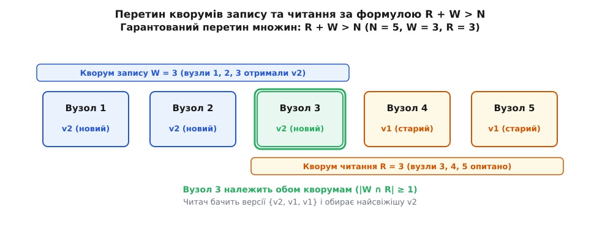
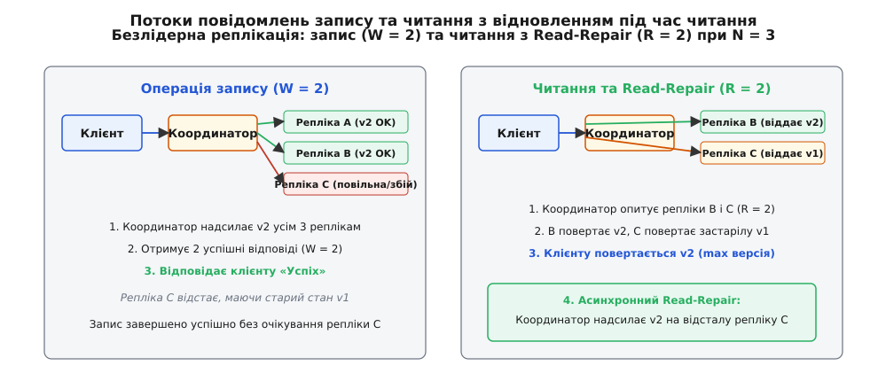
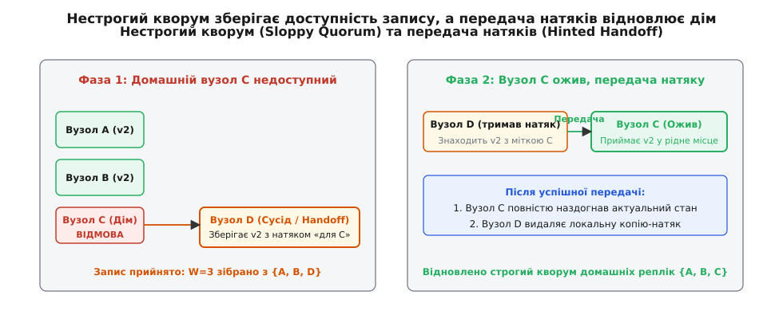
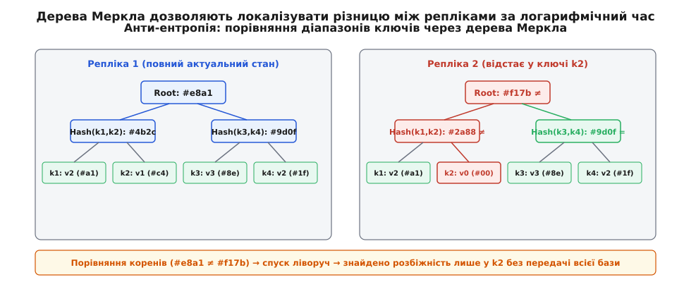

# Кворуми та безлідерна реплікація

<preknowlist>
- [Лідер-фоловер / мультилідер / leaderless](book:programming/replication-leader-follower) — базові топології реплікації даних та ролі вузлів у кластері.
- [Мережевий поділ і теорема CAP](book:programming/cap-theorem) — неможливість одночасно гарантувати повну узгодженість і доступність за наявності розділення мережі.
- [Таймаути і повтори](book:programming/timeouts-deadlines) — ненадійність мережі, часткові відмови та необхідність обмеження очікування.
- [Хеш-таблиця](book:algorithms/hash-table) — структура ключ-значення, де запис адресується за хешем ключа.
- [Принцип Діріхле](book:math/pigeonhole-principle) — якщо об'єктів більше за кількість комірок, то бодай в одній комірці опиниться понад один об'єкт.
</preknowlist>

У великому інтернет-магазині триває святковий розпродаж: тисячі покупців щосекунди додають товари до своїх кошиків. Сервер бази даних, призначений єдиним лідером для запису, раптово перестає відповідати через апаратний збій контролера накопичувача. Кластер починає процедуру виявлення відмови: чекає тридцять секунд таймауту серцебиття, скликає голосування для обрання нового лідера, перевіряє журнали реплікації. Упродовж цієї хвилини жоден клієнт у світі не може зберегти покупку — веб-сервери повертають системні помилки, транзакції обриваються, компанія втрачає прямий виторг.

У цій точці виникає фундаментальне архітектурне питання: чи можна побудувати надійне сховище, у якому взагалі немає виділеного лідера, де падіння будь-якого окремого вузла не спричиняє жодної секунди простою, а операції запису та читання приймає будь-який доступний сервер?

Така архітектура називається безлідерною (англ. *leaderless*), а її математичним фундаментом виступають кворуми (від лат. *quorum* [praesentia sufficit] — «яких [присутність достатня] для ухвалення рішення»). Замість передачі повної влади єдиному серверу-монарху система розподіляє прийняття рішень між групою рівноправних реплік (від лат. *replicare* — «відповідати, повторювати»).

---

## Ціна єдиного монарха: чому виникає безлідерна топологія

Щоб зрозуміти необхідність безлідерної схеми, простежимо ланцюг обмежень класичної однолідерної моделі (primary-backup).

В однолідерній системі всі операції запису направляються на один конкретний вузол. Лідер призначає монотонний порядок транзакцій, записує їх у власний журнал і транслює на репліки-послідовники (фоловери). Така модель забезпечує просту та інтуїтивну узгодженість: порядок записів на лідері є абсолютним джерелом істини для всього кластера.

Однак за цю простоту доводиться платити потрійну ціну:

```
1. Вузьке горло пропускної здатності:
   Потік усіх записів кластера обмежений ресурсами CPU та диска одного сервера.

2. Пауза на перемикання (Failover Lag):
   Смерть лідера вимагає часу на детекцію збою (Heartbeat Timeout)
   та проведення виборів. У цей період запис повністю заблоковано.

3. Ризик розщеплення мозку (Split-Brain):
   Якщо мережа розпалася на два ізольовані сегменти,
   помилкове обрання другого лідера призводить до несумісних гілок даних.
```

Коли системі потрібна гранична доступність запису (High Availability for Writes) з гарантією роботи в режимі 24/7/365, пауза на переобрання лідера стає неприйнятною.

Безлідерна реплікація повністю ліквідує поняття монарха. Усі вузли кластера є абсолютно симетричними. Будь-який вузол має право прийняти запит на запис або читання для будь-якого ключа. Якщо сервер, до якого звернувся клієнт, не зберігає копію запитуваних даних безпосередньо, він бере на себе роль тимчасового координатора (від лат. *co-* «разом» + *ordinare* «впорядковувати»): паралельно розсилає повідомлення призначеним реплікам, чекає на відповіді та повертає результат клієнту.

Але якщо лідера немає, виникає нова криза: як запобігти поверненню застарілих даних, якщо різні репліки отримують оновлення з різною швидкістю через мережеві затримки? Відповідь дає механізм кворумного перетину.

---

## Принцип кворуму та формула R + W > N

Нехай для надійного збереження кожного ключа система створює `N` копій на різних фізичних серверах. Число `N` називається фактором реплікації (Replication Factor).

Коли клієнт записує нове значення, координатор надсилає його всім `N` реплікам, але не чекає на відповідь від усіх серверів (оскільки один завислий диск заблокував би всю операцію). Запис вважається успішним, щойно його підтвердила фіксована кількість реплік — кворум запису `W` (Write Quorum).

Коли клієнт читає значення, координатор опитує репліки й чекає на відповіді від фіксованої кількості вузлів — кворуму читання `R` (Read Quorum).

Щоб гарантувати, що операція читання **обов'язково** побачить останнє записане значення, розміри кворумів мусять задовольняти базову нерівність:

```
R + W > N
```


*Схема гарантованого перетину кворумів при N = 5, W = 3, R = 3. Множина з трьох оновлених вузлів і множина з трьох опитаних вузлів обов'язково мають щонайменше один спільний вузол (Вузол 3), який передає координатору найновішу версію v2.*

Чому ця проста арифметика дає залізобетонну гарантію?

Розглянемо загальну множину реплік `S`, де `|S| = N`. Кворум запису є підмножиною `W ⊆ S` розміром `|W| = W`. Кворум читання є підмножиною `R ⊆ S` розміром `|R| = R`. За класичним комбінаторним принципом включень-виключень, потужність об'єднання двох множин дорівнює:

```
|W ∪ R| = |W| + |R| - |W ∩ R|
```

Оскільки об'єднання `W ∪ R` є частиною загального простору `S`, його розмір не може перевищувати `N`:

```
|W ∪ R| ≤ N
W + R - |W ∩ R| ≤ N
|W ∩ R| ≥ W + R - N
```

Якщо `W + R > N`, тобто `W + R ≥ N + 1`, то розмір перетину гарантовано становить:

```
|W ∩ R| ≥ 1
```

Це математичне формулювання принципу Діріхле: якщо розкласти `W + R` предметів у `N` шухляд, і предметів більше, ніж шухляд, то принаймні в одній шухляді обов'язково опиниться два предмети.

У нашому контексті це означає: **серед `R` вузлів, які відповіли на запит читання, гарантовано присутній щонайменше один вузол, який брав участь в останньому успішному записі `W`**. Цей спільний вузол повертає свіже значення разом із його номером версії (або міткою часу). Отримавши `R` відповідей, координатор порівнює версії, відкидає старі значення та повертає клієнту найновіше.

Строге математичне доведення, узагальнення на випадок зваженого голосування, ймовірнісний аналіз застарілих читань за гіпергеометричним розподілом та формули доступності кластера зібрані у вставці [математичне доведення перетину кворумів та оцінка доступності](book:programming/quorum-and-leaderless/math-quorum-intersection.md).

---

## Розподіл даних у кільці: Token Ring та список переваг

У кластері з сотень або тисяч серверів постає практичне питання: як система визначає, які саме `N` серверів із усієї маси машин мусять зберігати копії конкретного ключа?

Для цього безлідерні системи використовують кільце погодженого хешування (Consistent Hash Ring). Простір хеш-значень (наприклад, 64-бітні або 128-бітні числа від `-2⁶³` до `2⁶³ - 1` у разі алгоритму Murmur3) умовно замикається в коло. Кожен фізичний сервер відповідає за один або кілька фіксованих токенів (позицій) на цьому кільці. Для рівномірного розподілу навантаження один фізичний сервер зазвичай представляють десятками віртуальних вузлів (vnodes), розкиданих по різних секторах кільця.

```
                  [ Токен 0: Сервер А ]
                     /             \
                    /               \
       [ Сервер D ]                  [ Сервер B ]
      (Токен 3000)                  (Токен 1000)
            \                               /
             \                             /
                 [ Токен 2000: Сервер C ]
```

Коли координатор отримує ключ `k`, алгоритм пошуку реплік виконує такі кроки:
1. **Обчислення хешу:** Вираховується токен ключа `t = Hash(k)`.
2. **Пошук першого володаря:** На кільці знаходиться перший вузол, чий токен більший або дорівнює `t` за годинниковою стрілкою.
3. **Побудова списку переваг (Preference List):** Координатор рухається далі по кільцю за годинниковою стрілкою і відбирає наступні вузли, доки не набереться рівно `N` **фізично унікальних** серверів.

Під час побудови списку переваг система враховує топологію стійок і дата-центрів (Rack / Datacenter Awareness): якщо два сусідні віртуальні вузли на кільці належать одній і тій самій фізичній стійці або живляться від одного джерела живлення, алгоритм пропускає дублікат і бере наступний вузол з іншої стійки. Це гарантує, що знеструмлення цілої серверної шафи не знищить більше однієї репліки з набору `N`.

Саме цей відібраний список із `N` серверів і стає тією домашньою групою реплік, між якими координатор збиратиме кворуми `W` та `R`.

---

## Простір конфігурацій: баланс між читанням, записом і доступністю

Формула `R + W > N` задає не одне конкретне число, а ціле сімейство допустимих налаштувань. Змінюючи співвідношення між `W` та `R`, архітектор системи керує балансом між затримкою запису, затримкою читання та стійкістю до відмов.

Розглянемо типові профілі конфігурації для класичного кластера з `N = 3` та `N = 5` репліками:

```
                  ┌─────────────────────────────────────┐
                  │ Простір конфігурацій кворумів (N=5) │
                  └──────────────────┬──────────────────┘
                                     │
         ┌───────────────────────────┼───────────────────────────┐
         ▼                           ▼                           ▼
[ Швидкий запис ]            [ Симетричний ]             [ Швидке читання ]
  W = 1, R = 5                 W = 3, R = 3                W = 5, R = 1
  · Запис: 1 ACK               · Запис: 3 ACK              · Запис: 5 ACK
  · Читання: 5 ACK             · Читання: 3 ACK            · Читання: 1 ACK
  · Стійкість запису: 4 збої   · Стійкість: по 2 збої      · Стійкість читання: 4 збої
```

### 1. Симетрична більшість (Majority Quorum): `W = ⌊N/2⌋ + 1, R = ⌊N/2⌋ + 1`
Найпоширеніша універсальна конфігурація.
- Для `N = 3`: `W = 2, R = 2` (`2 + 2 = 4 > 3`).
- Для `N = 5`: `W = 3, R = 3` (`3 + 3 = 6 > 5`).

Цей профіль забезпечує ідеальний баланс стійкості: кластер із 3 вузлів витримує падіння будь-якого 1 вузла без втрати доступності як читання, так і запису (`3 - 2 = 1`). Кластер із 5 вузлів витримує одночасну відмову будь-яких 2 вузлів (`5 - 3 = 2`).

### 2. Оптимізація під інтенсивне читання: `W = N, R = 1`
Якщо система виконує мільйони читань на секунду і лише рідкісні оновлення:
- Читання надзвичайно швидке: запит надсилається найближчій одній репліці (`R = 1`), затримка мінімальна.
- Запис повільний і крихкий: вимагає підтвердження від усіх вузлів (`W = N`). Якщо хоча б один сервер у кластері впав, жоден запис неможливий.

### 3. Оптимізація під інтенсивний запис: `W = 1, R = N`
Зворотний випадок: системи збору телеметрії або логів сенсорів.
- Запис миттєвий: достатньо підтвердження від одного будь-якого вузла (`W = 1`). Запис доступний, поки живий хоча б один сервер із `N`.
- Читання дороге: вимагає опитування всіх `N` вузлів, щоб гарантовано знайти той єдиний, який прийняв останнє оновлення.

### 4. Слабкі кворуми (Weak / Non-strict Quorums): `R + W ≤ N`
Якщо бізнес-вимоги ставлять мінімальну затримку вище за строгу узгодженість, встановлюють, наприклад, `N = 3, W = 1, R = 1`.
Сума `1 + 1 = 2 ≤ 3`. Перетин не гарантований. Запити виконуються з мінімальною мережевою затримкою, але читачі періодично отримуватимуть застарілі дані доти, доки фонова синхронізація не вирівняє стан реплік.

---

## Мультидатацентрові топології: локальні та глобальні кворуми

Коли кластер розгортається на кілька географічно віддалених регіонів (наприклад, Дата-центр 1 у Франкфурті, Дата-центр 2 у Вірджинії та Дата-центр 3 у Сінгапурі), фізичні обмеження швидкості світла в оптоволокні докорінно змінюють вартість координації. Кругова затримка (RTT) між Франкфуртом та Сінгапуром становить близько 160–180 мілісекунд, тоді як усередині одного дата-центру — менше 1 мілісекунди.

Якщо налаштувати глобальний строгий кворум через усі дата-центри (`QUORUM` за всіма регіонами), кожна операція запису та читання буде змушена чекати трансокеанських мережевих пакетів, збільшуючи час відповіді застосунку з 2 мс до 200 мс.

Для вирішення цієї проблеми безлідерні СУБД вводять рівні узгодженості для мультирегіональних топологій:

```
                                  [ Клієнт у Франкфурті ]
                                             │
                                     1. PUT (LOCAL_QUORUM)
                                             ▼
                                   [ Координатор DC-EU ]
                                      /      |      \
                           2. Запис  /   2.  |   2.  \  2. Асинхронний бекграунд
                                    ▼        ▼        ▼    через WAN
                               [Вузол 1] [Вузол 2] [Вузол 3] ════════════════► [DC-US] & [DC-ASIA]
                                  (ACK)    (ACK)   (Лаг)
                                    \        /
                                3. Зібрано 2 з 3
                                   локальних ACK
                                        │
                                        ▼
                                [ HTTP 200 OK: 2 мс ]
```

1. **`LOCAL_QUORUM` (Локальний кворум):**
   Кворум обчислюється виключно серед реплік того дата-центру, де знаходиться координатор (`W_{local} = ⌊N_{local}/2⌋ + 1`).
   Координатор чекає на відповіді лише від серверів у тій самій локальній мережі (затримка 1–3 мс).
   Реплікація до віддалених дата-центрів (DC-US, DC-ASIA) ініціюється асинхронно у фоні через один міжрегіональний канал.
   Це забезпечує субмілісекундну швидкість для користувачів у кожному регіоні, але створює невелике часове вікно асинхронного відставання між континентами.

2. **`EACH_QUORUM` (Кворум у кожному регіоні):**
   Запис вимагає одночасного успішного збору локального кворуму в **кожному** окремому дата-центрі.
   Захищає від втрати даних при раптовій загибелі цілого континентального регіону, проте збільшує затримку запису до найповільнішого міжрегіонального лінку.

3. **`LOCAL_ONE` / `ONE`:**
   Запит завершується після відповіді першої-ліпшої локальної репліки. Максимальна швидкість ціною відсутності гарантії свіжості.

---

## Справжня координація без лідера: життєвий цикл запиту

Погляньмо, як саме відбувається обробка клієнтського запиту на рівні мережевих пакетів у безлідерній системі (модель Amazon Dynamo, Apache Cassandra, ScyllaDB).


*Потік повідомлень при безлідерній реплікації (N = 3, W = 2, R = 2). Ліворуч: запис завершується успішно за 2 підтвердженнями, попри відставання репліки C. Праворуч: читання виявляє відставання репліки C та запускає її асинхронне лікування через Read-Repair.*

Історичні витоки цієї архітектури — від першої статті Девіда Гіффорда 1979 року про зважені голоси до подолання кризи кошика покупок Amazon у 2007 році — детально викладено у вставці [історія виникнення кворумів від Гіффорда до Amazon Dynamo](book:programming/quorum-and-leaderless/hist-gifford-dynamo.md).

### Життєвий цикл запису (Write Flow)
1. **Маршрутизація:** Клієнт надсилає запит `PUT /key` на довільний вузол кластера або використовує розумний драйвер (Token-Aware Driver), який за хешем ключа одразу обирає один із вузлів, що входять до діапазону реплікації цього ключа.
2. **Координація:** Вузол, що прийняв запит, стає координатором. Він присвоює запису мітку часу або монотонну версію та паралельно надсилає повідомлення `WriteMessage` усім `N` реплікам.
3. **Очікування підтверджень:** Координатор блокується до отримання `W` успішних відповідей (ACK). Решта `N - W` реплік можуть відповідати повільніше або тимчасово перебувати в стані збою — координатор не чекає на них.
4. **Відповідь клієнту:** Щойно поріг `W` подолано, координатор повертає клієнту підтвердження `HTTP 200 OK`.

### Життєвий цикл читання (Read Flow)
1. **Опитування:** Клієнт надсилає `GET /key`. Координатор надсилає запит `ReadMessage` усім `N` реплікам, але обмежує очікування першими `R` відповідями.
2. **Оптимізація трафіку (Data + Digest):** Щоб не перевантажувати мережу передачею повного тіла об'єкта від усіх `R` вузлів, координатор зазвичай запитує повні дані лише у найшвидшої репліки, а від решти `R - 1` реплік запитує лише криптографічний хеш (Digest/Checksum) їхнього локального значення та версію.
3. **Звірка версій:**
   - Якщо всі `R` хешів і версій збіглися — координатор негайно віддає дані клієнту.
   - Якщо виявлено розбіжність (наприклад, одна репліка повернула версію 2, а інша — застарілу версію 1), координатор запитує повні дані у вузла з версією 2, віддає свіже значення клієнту і переходить до процедури лікування.

Повну реалізацію цього протоколу з кластером, координатором та обробкою збоїв мовами C та C++ наведено у вставці [практична реалізація безлідерного кворуму та read repair](book:programming/quorum-and-leaderless/proj-leaderless-quorum.md).

---

## Темний бік простих кворумів: де математика стикається з фізикою

Формула `R + W > N` виглядає бездоганно на папері. Проте в реальних розподілених системах проста нерівність кворумів стикається з фізичними обмеженнями мереж, ненадійними годинниками та частковими відмовами.

Розглянемо чотири фундаментальні крайові випадки, коли «строгий» кворум без додаткових механізмів дає збій.

### 1. Конкурентні паралельні записи (Concurrent Racing Writes)
Припустимо, два клієнти одночасно намагаються оновити один і той самий ключ `user:101`.
- Клієнт 1 надсилає значення `A` через координатора 1. Координатор 1 встигає записати `A` на репліки 1 та 2 (`W = 2`).
- Клієнт 2 одночасно надсилає значення `B` через координатора 2. Координатор 2 записує `B` на репліки 2 та 3 (`W = 2`).

```
Репліка 1:  значення A (від Клієнта 1)
Репліка 2:  значення A чи B? (залежить від мікросекунд приходу пакетів)
Репліка 3:  значення B (від Клієнта 2)
```

Обидва записи зібрали кворум `W = 2`. Але в системі немає єдиного лідера, який би визначив, яка операція відбулася «раніше». Якщо система використовує просту стратегію Last-Write-Wins (LWW) на основі системного часу серверів (NTP), годинниковий дрейф (Clock Drift) у кілька мілісекунд може призвести до того, що старіший за логікою запис тихо зітре новіший. Для повного збереження причинності безлідерні системи змушені застосовувати векторні годинники або безконфліктні репліковані типи даних (CRDT).

### 2. Частковий збій запису (Incomplete / Phantom Writes)
Клієнт ініціює запис із `W = 2` при `N = 3`.
- Репліка 1 успішно зберегла значення `v2`.
- Репліки 2 та 3 відповіли таймаутом через мережевий обрив.

Координатор зібрав лише 1 підтвердження замість необхідних 2. Він зобов'язаний повернути клієнту **помилку** (Timeout / Write Failure).

Але значення `v2` **вже фізично лежить на диску Репліки 1**! У безлідерних системах немає автоматичного двофазного відкату (Rollback). Якщо наступне читання опитає Репліку 1 та Репліку 2 (`R = 2`), воно побачить `v2` на Репліці 1 і визнає його найновішим значенням. Тобто клієнт отримав статус «запис не вдався», але значення насправді частково збереглося і стало видимим іншим читачам.

### 3. Порушення монотонності читань (Non-monotonic Reads)
Під час виконання запису оновлення потрапляє на репліки не одночасно:

```
Хронологія подій:
1. Запис v2 надходить на Репліку 1.
2. Клієнт А виконує читання з кворумом {Репліка 1, Репліка 2} -> бачить нове v2.
3. Клієнт Б за мить виконує читання з кворумом {Репліка 2, Репліка 3} ->
   обидві репліки ще не отримали оновлення і повертають старе v1!
```

Клієнт Б побачив повернення системи назад у часі (`v2 → v1`), хоча його дія відбулася пізніше за дію Клієнта А. Кворум сам по собі не гарантує лінеаризовності (Linearizability) без додаткового раунду консенсусу або синхронного відновлення перед поверненням відповіді.

### 4. Легковажні транзакції (Lightweight Transactions / LWT) та протокол Paxos
Щоб вирішити проблему конкурентних записів та забезпечити атомарні операції умовного оновлення (Compare-And-Swap: `INSERT ... IF NOT EXISTS` або `UPDATE ... IF status = 'PENDING'`), безлідерні бази даних реалізують вбудований протокол консенсусу Paxos над кворумними репліками.

Такі операції називаються легковажними транзакціями (Lightweight Transactions, LWT). Замість одного раунду розсилки повідомлень координатор проводить 4 фази:

```
1. Prepare / Promise  ──► Збір кворуму на право оновлення (Leader Lease)
2. Read / Results     ──► Зчитування поточного значення для перевірки умови IF
3. Propose / Accept   ──► Пропозиція нового значення та збір згоди більшості
4. Commit / Acknowledge ──► Фіксація результату
```

Ціна абсолютної узгодженості в безлідерному світі є високою: LWT вимагає 4 послідовні мережеві раунди замість 1, що збільшує затримку операції вчетверо та суттєво знижує пропускну здатність вузлів.

---

## Механіка видалення даних: життєвий цикл надгробків (Tombstones)

Видалення даних у безлідерних СУБД з дисковими рушіями на базі LSM-дерев (Log-Structured Merge-tree) має унікальну специфіку, незнання якої призводить до фатальних аварій.

Коли клієнт виконує операцію `DELETE`, система **не видаляє байти з диска негайно**. Якби вузол просто стер запис у своєму файлі, а сусідній вузол під час операції видалення був тимчасово недоступний (перебував у перезавантаженні), то під час наступного читання з Read-Repair старий запис із другого вузла був би розцінений як «пропущене оновлення» і перезаписав би перший вузол. Видалені дані самовільно воскресли б!

Щоб запобігти воскресінню (Resurrection Bug), видалення реалізується як **запис спеціального маркера видалення — надгробка** (Tombstone):

```
Клієнт: DELETE WHERE key='user:101'
Координатор записує:
Key: 'user:101'
Value: <TOMBSTONE>
Timestamp: 1718900000 (поточний час видалення)
```

Надгробок зберігається як звичайний запис і реплікується по кворуму. Під час читання система бачить надгробок, порівнює його мітку часу зі старими даними і повертає клієнту статус «запис відсутній».

### Життєвий цикл надгробка та небезпека накопичення
1. **Збереження:** Надгробок потрапляє в пам'ять (Memtable), а згодом скидається на диск у файл SSTable.
2. **Період очікування (`gc_grace_seconds`):** Надгробок зобов'язаний зберігатися на диску впродовж фіксованого часу (за замовчуванням у Cassandra — 10 днів або 864 000 секунд). Цей інтервал гарантує, що всі відсталі сервери встигнуть дізнатися про видалення через Read-Repair або анти-ентропію.
3. **Фізичне знищення (Compaction):** Лише після завершення `gc_grace_seconds` фоновий процес ущільнення дисків (Compaction) остаточно стирає надгробок і старі закриті ним версії даних.

> ⚠️ **Інженерна пастка:** Якщо застосунок масово створює і видаляє мільйони записів (наприклад, використовує таблицю як чергу повідомлень), на дисках накопичуються мільйони надгробків. Коли читач виконує скан діапазону ключів, сервер змушений прочитати мільйон надгробків у пам'ять, перш ніж знайде один живий запис. Це спричиняє гігантські паузи збирача сміття (GC Pauses) та падіння вузлів із помилкою `TombstoneOverwhelmingException`. Безлідерні бази непридатні для використання в ролі черг завдань.

---

## Три стовпи зцілення даних у безлідерному світі

Оскільки кворумний запис допускає, що частина реплік (`N - W`) законно відстає або не отримує оновлення під час аварій, безлідерна база даних неминуче накопичує ентропію (розбіжності між копіями).

Для підтримки кінцевої узгодженості (Eventual Consistency) застосовуються три взаємодоповнюючі механізми сходження реплік.

```
                    ┌───────────────────────────────────┐
                    │ Три механізми самозцілення даних  │
                    └─────────────────┬─────────────────┘
                                      │
         ┌────────────────────────────┼────────────────────────────┐
         ▼                            ▼                            ▼
[ 1. Read Repair ]           [ 2. Hinted Handoff ]        [ 3. Anti-Entropy ]
  Під час читання              Під час аварії вузла         Фоновий процес
  · Ловить розбіжності         · Сусід тримає натяк         · Дерева Меркла
  · Лікує гарячі дані          · Віддає, коли дім оживе     · Лікує холодні дані
```

---

### Механізм 1: Відновлення під час читання (Read-Repair)

Read-Repair — це реактивний механізм, який працює безпосередньо в момент виконання клієнтських операцій читання.

Коли координатор опитує `R` реплік і помічає, що одна з реплік повернула застарілу версію або не має запису взагалі:
1. Координатор повертає клієнту найсвіжіше значення `v_max` (клієнт не відчуває затримки).
2. Одночасно координатор надсилає асинхронний запит на оновлення до відсталої репліки, передаючи їй актуальне значення `v_max`.

**Перевага:** Гарячі дані, які читаються постійно, синхронізуються майже миттєво.
**Обмеження:** Якщо ключ записали, але після цього ніхто ніколи не читає, Read-Repair не спрацює ніколи. Для холодних даних потрібні інші механізми.

---

### Механізм 2: Нестрогий кворум та передача натяків (Sloppy Quorum & Hinted Handoff)

Що робити, якщо під час запису із `N = 3, W = 2` дві з трьох призначених реплік ключа виявилися недоступними через падіння дата-центру?

У строгому кворумі (Strict Quorum) запис відхиляється. Проте філософія Amazon Dynamo вимагає приймати запис за будь-яку ціну. Для цього застосовується **нестрогий кворум**:

1. Координатор тимчасово обирає здорові вузли за межами призначеного списку реплік ключа (так звані вузли-вигнанці або сусіди по кільцю).
2. Вузол-сусід зберігає оновлення в спеціальному ізольованому сховищі разом із натяком (Hint) — метаданими, де вказано: «Ці дані насправді належать Вузлу C. Я тримаю їх тимчасово».
3. Координатор зараховує відповідь від сусіда в кворум `W`, і запис завершується успішно.


*Фази нестрогого кворуму та передачі натяків. Фаза 1: Вузол D приймає запис замість мертвого Вузла C, позначаючи його натяком. Фаза 2: Після відновлення Вузла C натяк передається додому, а тимчасова копія на Вузлі D видаляється.*

Коли вузол-господар повертається в стрій:
1. Вузол, що тримав натяк, виявляє появу сусіда в мережі через протокол пліток (Gossip Protocol).
2. Вузол передає накопичені натяки (Handoff) справжньому володарю.
3. Після успішного підтвердження локальний натяк безпечно видаляється.

> ⚠️ **Важливе застереження:** Під час використання нестрогого кворуму формула `R + W > N` тимчасово втрачає свою силу! Оскільки запис прийняли вузли за межами домашньої групи `N`, звичайне читання з `R` домашніх вузлів не перетнеться з оновленням доти, доки всі натяки не будуть передані за призначенням.

---

### Механізм 3: Анти-ентропія з деревами Меркла (Anti-Entropy with Merkle Trees)

Якщо репліка була відключена тривалий час (наприклад, кілька днів), буфер натяків (Hinted Handoff) може переповнитися і скинути застарілі натяки. Крім того, записи, які ніколи не читаються, залишаються несинхронізованими через відсутність Read-Repair.

Для повного фонового вирівнювання стану реплік застосовується процес анти-ентропії (від грец. *ἀντί* «проти» + *ἐντροπία* «поворот, міра хаосу») на основі геш-дерев Меркла (Merkle Trees, винайдені Ральфом Мерклом у 1979 році).


*Синхронізація реплік через дерева Меркла. Порівняння кореневих хешів дозволяє за логарифмічну кількість мережевих раундів O(log K) локалізувати конкретний розбіжний ключ k2 без передачі всієї бази даних через мережу.*

Принцип роботи анти-ентропії:
1. Кожна репліка будує бінарне дерево хешів для певного діапазону ключів (Token Range). Листя дерева містить хеші окремих значень ключів; проміжні вузли містять хеші від об'єднання своїх нащадків; корінь дерева представляє зведений хеш усього діапазону.
2. Дві репліки обмінюються лише **кореневими хешами**.
3. Якщо кореневі хеші ідентичні — репліки гарантовано знаходяться в абсолютно однаковому стані. Мережевий трафік становить кілька байтів.
4. Якщо кореневі хеші відрізняються — репліки запитують хеші нащадків наступного рівня. Процес рекурсивно спускається по дереву лише тими гілками, де виявлено розбіжності.
5. Репліки локалізують точний перелік несинхронізованих ключів і пересилають через мережу лише відсутні дані.

Завдяки деревам Меркла перевірка гігабайтів даних між дата-центрами вимагає передачі мінімальної кількості інформації.

---

## Практичний вибір: коли безлідерна модель перемагає, а коли стає пасткою

Безлідерна реплікація з кворумами — це вузькоспеціалізований інструмент, оптимізований під конкретний профіль навантаження.

| Критерій порівняння | Однолідерна модель (PostgreSQL / MySQL) | Консенсусна група (Raft / Paxos / etcd) | Безлідерна кворумна модель (Cassandra / ScyllaDB) |
| :--- | :--- | :--- | :--- |
| **Доступність запису при збоях** | Низька (пауза на failover) | Середня (вимагає строгої більшості) | **Гранична (Always Writable / Sloppy Quorum)** |
| **Модель узгодженості** | Строга / Лінеаризовна | Строга лінеаризовна | **Кінцева (Eventual Consistency)** |
| **Підтримка складних транзакцій (ACID)** | Повна (блокування, зовнішні ключі) | Повна в межах групи | **Відсутня або обмежена (Lightweight Transactions)** |
| **Масштабування запису** | Вертикальне (один сервер) | Обмежене розміром групи | **Горизонтальне (лінійне додаванням вузлів)** |
| **Чутливість до затримок мережі** | Висока при синхронній реплікації | Висока (раунди узгодження) | **Низька (відсікання повільних вузлів)** |

> 🔧 **Навіщо це.** Безлідерні системи ідеально підходять для сценаріїв, де запис не можна зупиняти ні за яких умов, а дані мають природну структуру «ключ-значення» або часових рядів (Time-Series): кошики інтернет-магазинів, стрічки повідомлень чатів, показники лічильників IoT, журнали дій користувачів, телеметрія фінансових операцій.
>
> Проте спроба побудувати на безлідерних кворумах реляційну білінгову систему з перевіркою балансу та складними інваріантами («баланс не може бути меншим за нуль») перетворюється на інженерний кошмар: відсутність центрального арбітра вимагає складних оптимістичних блокувань (Paxos-based Lightweight Transactions), які нівелюють усю перевагу безлідерної швидкості.

Під час експлуатації кворумних кластерів звертайте увагу на чотири критичні метрики моніторингу:
1. `Read-Repair Rate` — частка операцій читання, які виявляють розбіжності версій. Її раптове зростання свідчить про накопичення мережевого лагу або приховані дискові збої на окремих репліках.
2. `Hinted Handoff Pending Count` — кількість накопичених натяків на дисках вузлів. Якщо цей графік безперервно росте, отже один із вузлів випав із кластера надовго, і система працює з деградованою узгодженістю.
3. `Tombstones Scanned Per Read` — середня кількість надгробків, прочитаних під час виконання одного запиту. Якщо число перевищує кілька сотень, таблиця потребує перегляду моделі даних або примусового ущільнення (Major Compaction).
4. `p99 / p99.9 Read Latency` — затримка найповільніших запитів. Зростання 99-го перцентилю вказує на те, що кворум очікує на вузли, які зазнають пауз збирача сміття (GC pauses) або дискового перевантаження.
